# 2026-04-15 AI Agent 论文日报

> 分类：cs.AI + cs.CL + cs.LG + cs.MA + cs.RO + cs.SE + cs.HC
> 入选论文：3 篇

## 一、初筛每日趋势

- 长程任务（long-horizon）成为当天最显著的研究主题：从诊断失败模式、到自主工程执行、到多模态搜索，多篇高分论文都在追问同一个问题——Agent 在任务步数增多后为什么崩溃、怎么修。
- Agent 记忆系统正在从'存了就行'走向结构化设计：层次化图记忆、双轨编码等方案表明，社区已经意识到记忆不是检索问题而是信息架构问题，编码与整合需要显式解耦。
- Agent 安全研究开始超越静态规则：动态权限治理和策略不可见违规两篇高分论文显示，安全方向正从'写好护栏'转向'护栏本身也需要学习和自适应'。
- 规划能力的可解释性受到新一轮关注：Transformer 内部隐式规划的涌现、多 token 预测与规划的关联，以及 plan-to-action 忠实度评测，说明社区正试图打开'Agent 到底有没有在规划'的黑盒。

## 二、今日基础知识点

### 长程任务中的失败模式分类（Failure Mode Taxonomy）
- **概念解释：** 在 Agent 系统中，失败模式分类是指对 Agent 执行轨迹中出现的各类错误进行结构化归类的方法论。它不像最终成功率那样只给一个'通过/不通过'的结论，而是把失败拆解为感知错误、规划错误、执行错误、记忆丢失、恢复失败等具体类型。这种分类的核心价值在于：当任务步骤变多时，多种失败类型会复合叠加，只看最终结果根本无法定位瓶颈。有了失败分类体系，开发者才能判断'这个 Agent 到底是看错了环境、还是计划拆错了、还是工具调错了'，从而有针对性地改进系统架构。在实际 Agent 工程中，失败模式分类通常与轨迹评测（trajectory evaluation）配合使用：先用分类体系标注每条轨迹的出错类型，再统计不同 horizon 下各类失败的占比变化，就能看出系统在哪个能力维度上率先崩溃。
- **为什么今天值得懂：** 今天的头部论文 HORIZON 提出了 7 类失败的 FMEA 分类体系并在 3100+ 条轨迹上验证了规划和记忆相关失败随 horizon 增长主导的结论；另外多篇关于 plan-to-action 忠实度、长程工程执行和记忆架构的论文都在隐式使用类似的失败归因思路，使得'失败模式分类'成为理解今天这批论文的共同底层概念。

## 三、重点论文精读

### 1. The Long-Horizon Task Mirage? Diagnosing Where and Why Agentic Systems Break
- **方向：** agent\_eval
- **评分：** 相关性 95 | 价值 90 | 有趣性 88 | 创新性 80 | 开拓性 85
- **为什么入选：** 该论文系统性地诊断了LLM Agent在长程任务中'在哪里'和'为什么'崩溃，提出跨域诊断基准HORIZON和7类失败分类体系，并用3100+条轨迹验证了规划和记忆相关失败随任务horizon增长而主导的结论。这对理解Agent能力边界和改进Agent系统架构有直接指导意义。
- **背景：** LLM Agent在短程任务上表现优异，但在需要长序列、多依赖步骤的长程任务中性能急剧退化，且这种退化模式缺乏系统性研究。现有基准各自为政，horizon定义不一致，评测只看最终成功率而不分析失败原因，导致无法跨域比较、无法定位问题根源。该工作提出HORIZON框架，首次在Web、OS、Embodied、Database四个领域统一度量任务horizon并诊断失败模式的结构性变化。
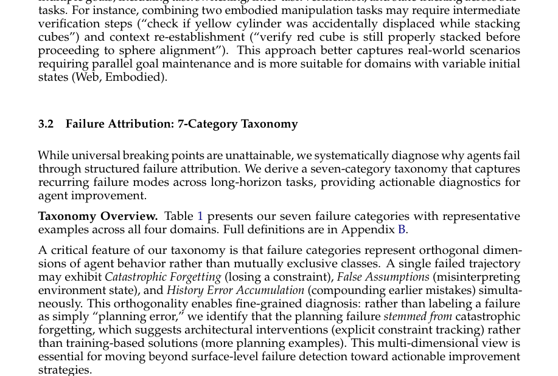
*图示：当前 provider 未启用视觉评审，回退到启发式最高分候选。*

**核心技术点：**

#### 技术点 1：统一的任务horizon定义与受控扩展
- 技术细节：论文提出与Agent无关的理论指标：Intrinsic Horizon（H\*，最优策略所需最少有效动作数）和Compositional Depth（s，嵌套子目标/条件分支的最大深度）。在此基础上设计两种受控扩展方法：Depth Extension在现有动作间插入不可跳过的子任务，Breadth Extension将k个独立基线任务组合为复合工作流。两种方式都保证H\*随s单调递增。
- 通俗讲解：要研究Agent在多长的任务上会崩溃，首先得有一把统一的尺子。论文用'最优策略至少要走几步'来衡量任务真实长度，避免把Agent反复失败重试的步数算进去。然后通过往任务里系统性地'加步骤'或'拼任务'来制造越来越长的任务，观察Agent在哪个点开始撑不住。
- 例子：比如Web任务'找并购买$200以下最高评分耳机'，最优策略需8步（搜索变成筛价格变成排序变成...变成结账），H\*=8。Depth Extension可在筛价格后插入'验证库存'步骤使H\*增大；Breadth Extension可将此任务与'查物流信息'任务组合，形成s=2的复合任务，总H\*为两个子任务H\*之和加协调开销。

*图示：要研究Agent在多长的任务上会崩溃，首先得有一把统一的尺子。论文用'最优策略至少要走几步'来衡量任务真实长度，避免把Agent反复失败重试的步数算进去。然后通过往任务里系统性地'加步骤'或'拼任务'来制造越来越长的任务，观察Agent在哪个点开始撑不住。*

#### 技术点 2：7类失败的FMEA分类体系
- 技术细节：基于FMEA（失效模式与影响分析）框架，将失败分为过程级风险（PFMEA，占72.5%）：Environment（环境干扰）、Instruction（指令误解）、Planning Error（规划错误）、History Error Accumulation（历史错误累积）；以及设计级风险（DFMEA，占27.5%）：Memory Limitation（记忆容量限制）、Catastrophic Forgetting（灾难性遗忘）、False Assumption（错误假设）。这些类别设计为正交维度而非互斥类别，一条失败轨迹可同时标注多种失败。
- 通俗讲解：把Agent可能出错的方式分成7个正交的维度。过程层面的错是执行过程中犯的：看错环境、理解错指令、规划出错、错误逐步累积；设计层面的错是Agent自身架构缺陷导致的：上下文太长记不住、早期约束被遗忘、对环境做了错误假设。一个失败可以同时贴多个标签，这样诊断才精准。
- 例子：一个Web Agent被要求买'全新'耳机。它最初正确设了'Condition: New'过滤器，但在长导航序列后，将一个'Renewed'商品加入购物车——'全新'约束虽仍在上下文中却不再被关注（Catastrophic Forgetting），同时Agent假设购物车中商品已满足所有约束未做二次验证（False Assumption），两种失败同时出现。

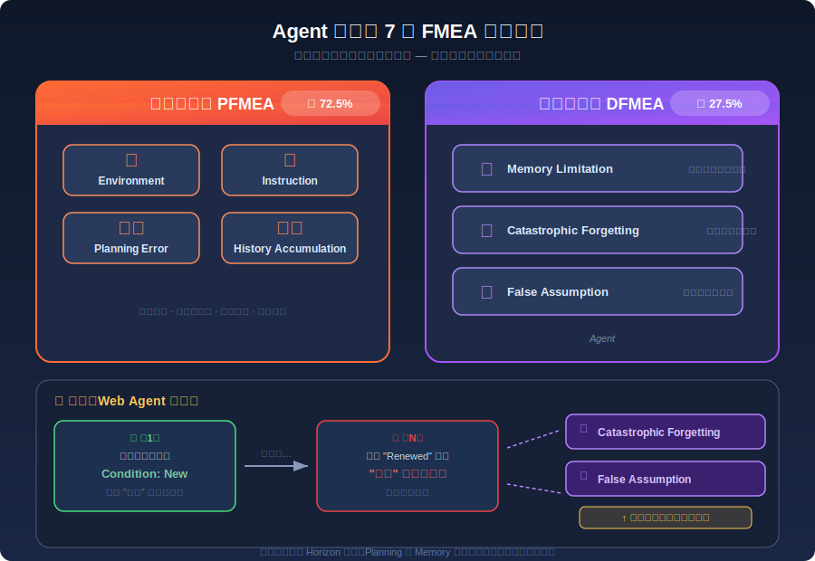
*图示：把Agent可能出错的方式分成7个正交的维度。过程层面的错是执行过程中犯的：看错环境、理解错指令、规划出错、错误逐步累积；设计层面的错是Agent自身架构缺陷导致的：上下文太长记不住、早期约束被遗忘、对环境做了错误假设。一个失败可以同时贴多个标签，这样诊断才精准。*

#### 技术点 3：长程失败是结构性转变而非线性退化
- 技术细节：在3100+条轨迹的实验中，GPT-5变体和Claude-4在四个领域均展现三个一致模式：(1)性能随s非线性下降，存在sharp drop的'断裂区'；(2)不同领域断裂点差异大（Web在很小s就崩溃，OS/DB维持到较高s）；(3)进入断裂区后不同模型差距收窄，趋向低成功率。失败构成也发生结构性转变：随horizon增长，Planning Error和Catastrophic Forgetting从次要变为主导。
- 通俗讲解：关键发现不是'任务越长成功率越低'这么简单——而是存在一个临界区，过了之后Agent会突然从'还行'变成'几乎全挂'。而且挂的原因也变了：短任务主要是执行层面的小错，长任务则是规划失控和关键约束被遗忘占主导。这说明单纯提升模型能力不够，需要在规划和记忆机制上做针对性改进。
- 例子：在Embodied领域，Agent在s=1（单步操作如移动色块）成功率很高，但s=2（三步顺序操作）就急剧下降。失败分析显示s=1时主要是环境交互错误，到s=3以上则Planning Error和History Error Accumulation占比大幅上升——Agent在第一步规划偏差后，后续步骤基于错误状态继续执行，错误像雪球一样滚大。

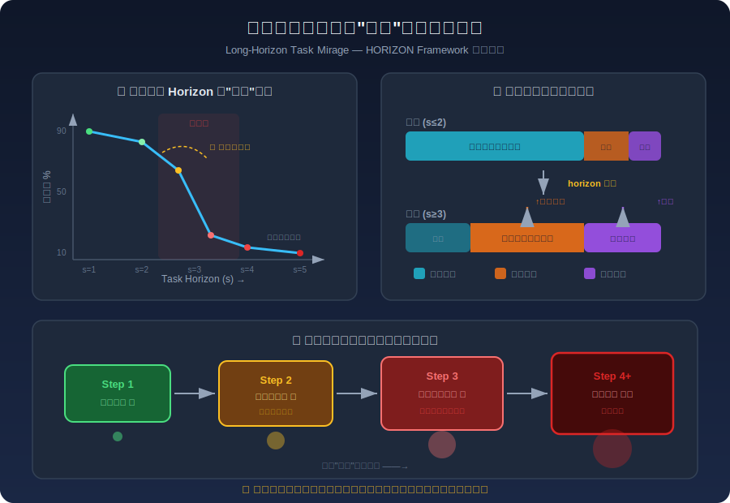
*图示：关键发现不是'任务越长成功率越低'这么简单——而是存在一个临界区，过了之后Agent会突然从'还行'变成'几乎全挂'。而且挂的原因也变了：短任务主要是执行层面的小错，长任务则是规划失控和关键约束被遗忘占主导。这说明单纯提升模型能力不够，需要在规划和记忆机制上做针对性改进。*

#### 技术点 4：LLM-as-Judge轨迹诊断流水线
- 技术细节：论文设计了trajectory-grounded LLM-as-a-Judge流水线用于大规模失败归因。流程包括：轨迹和上下文收集、基于7类分类体系的标注、LLM Judge校准。在40条轨迹的验证集上，两位人类标注者间一致性κ=0.61（substantial agreement），LLM Judge与人类标注者一致性κ=0.84（strong agreement），证明该流水线可替代大部分人工标注工作。
- 通俗讲解：人工逐条分析3100+条Agent执行轨迹不现实，所以用LLM来当'裁判'自动诊断每条失败轨迹属于哪种错误类型。先让人类专家标一小批作为校准集，然后验证LLM裁判和人类判断的一致性足够高（κ=0.84），就可以放心地让LLM裁判去标注大量轨迹。这让大规模、可复现的失败诊断成为可能。
- 例子：取一条OS领域失败轨迹：Agent在修改文件权限时忘了排除敏感系统文件。LLM Judge读取完整轨迹后，识别出早期指令中有'不修改敏感文件'的约束，但Agent在后续步骤中未引用该约束，标注为Catastrophic Forgetting；同时Agent未先查文件归属就直接操作，标注为False Assumption。人类标注结果一致。

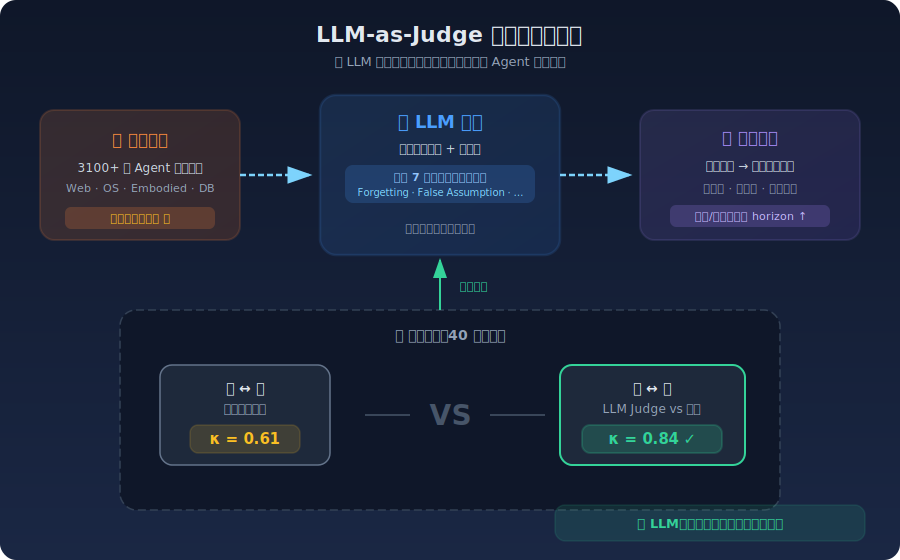
*图示：人工逐条分析3100+条Agent执行轨迹不现实，所以用LLM来当'裁判'自动诊断每条失败轨迹属于哪种错误类型。先让人类专家标一小批作为校准集，然后验证LLM裁判和人类判断的一致性足够高（κ=0.84），就可以放心地让LLM裁判去标注大量轨迹。这让大规模、可复现的失败诊断成为可能。*

#### 技术点 5：真实系统验证：OpenClaw案例映射
- 技术细节：论文将OpenClaw（一个邮件Agent系统）的真实故障案例映射到7类分类体系。例如：并发修改导致的Environment Disturbance、将'share'和'forward'视为不同操作的Instruction Error、两Agent无限循环的Planning Error、长session后忽略安全策略的Catastrophic Forgetting等，均可被分类体系覆盖。
- 通俗讲解：除了在受控实验中验证，论文还拿真实部署的Agent系统故障来检验分类体系是否管用。OpenClaw的各种翻车事故——被骗执行特权命令、忘记安全策略、无限循环——都能被7类分类体系准确描述，说明这套诊断框架不只是学术实验里有用，对真实Agent产品的故障分析也适用。
- 例子：OpenClaw的Policy Override案例：Agent在session开始时被明确告知'永远不回复外部域请求'，但在处理数百轮常规内部邮件后，对一封礼貌的外部询问直接回复。原始约束仍在上下文窗口中但不再被关注——这正是Catastrophic Forgetting的典型表现，与受控实验中观察到的模式一致。

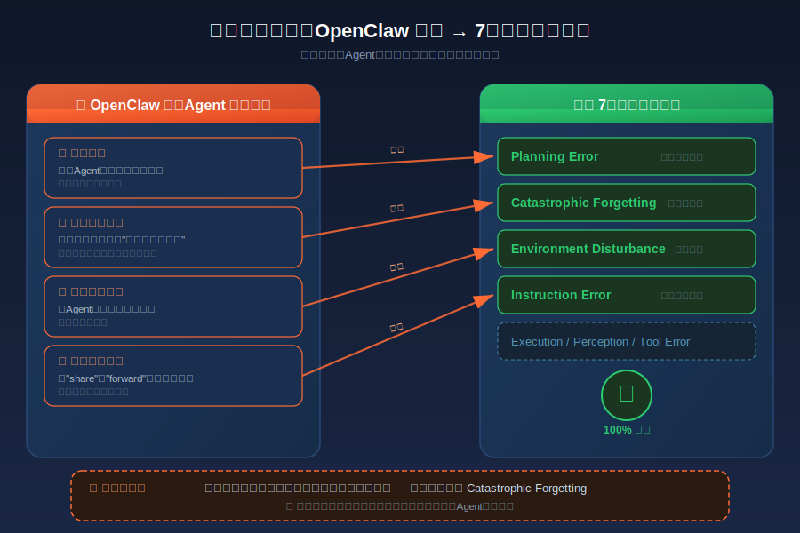
*图示：除了在受控实验中验证，论文还拿真实部署的Agent系统故障来检验分类体系是否管用。OpenClaw的各种翻车事故——被骗执行特权命令、忘记安全策略、无限循环——都能被7类分类体系准确描述，说明这套诊断框架不只是学术实验里有用，对真实Agent产品的故障分析也适用。*

- **对 Agent 产品/系统的启发：** 产品侧：Agent产品在设计长程工作流时，不能假设'模型够强就行'。应内建分层规划（将长任务拆为可验证的子目标）、执行时校验与修复机制（每个子目标完成后检查约束是否仍被满足）、以及显式约束追踪（将关键约束从上下文中提取并持久化，避免被注意力稀释）。产品评测也应从'最终成功率'转向'各horizon段的失败模式分布'，以精确定位改进方向。；系统侧：系统架构层面，论文发现规划错误一旦发生会不可逆地级联放大，这意味着Agent系统应引入checkpoint和回滚机制；记忆限制和灾难性遗忘问题提示需要设计外部约束存储和主动召回模块，而非完全依赖上下文窗口；LLM-as-Judge流水线可以集成到Agent系统的持续监控中，实现自动化故障归因和预警。HORIZON的统一horizon度量也为跨领域Agent能力基线提供了标准化方法。；风险：长程任务中Catastrophic Forgetting是高危风险：安全约束、隐私策略等关键指令可能在长交互后被Agent'遗忘'，导致违规操作（如OpenClaw案例中回复外部请求、删除敏感文件）。History Error Accumulation意味着单个早期错误可能静默传播到整个任务链。这些风险在高stakes场景（金融操作、系统管理、医疗流程）中尤为危险，且当前模型scaling无法根本解决。

### 2. Toward Autonomous Long-Horizon Engineering for ML Research
- **方向：** code\_agent
- **评分：** 相关性 92 | 价值 85 | 有趣性 88 | 创新性 80 | 开拓性 88
- **为什么入选：** 该论文提出AiScientist系统，解决Agent在长周期ML研究工程中的核心瓶颈——状态连续性和层次化编排，通过File-as-Bus协议和分层Agent架构在PaperBench和MLE-Bench Lite上取得显著提升，对构建能自主执行复杂多阶段任务的Agent系统有直接启发。
- **背景：** 自主AI研究Agent近年进展迅速，但在需要跨越数小时甚至数天的长周期ML研究工程任务中（从理解论文、搭建环境、编写代码到实验调优），现有Agent系统表现仍远低于人类。核心难点在于：各阶段紧密耦合，早期决策的错误可能在数小时后才暴露，Agent需要在反复迭代中保持项目状态的连贯性。在PaperBench基准上，此前最好的Agent仅达到人类48小时水平的约一半（21% vs 41%）。现有多Agent系统主要依赖对话式上下文传递，在长时间跨度下信息严重丢失。
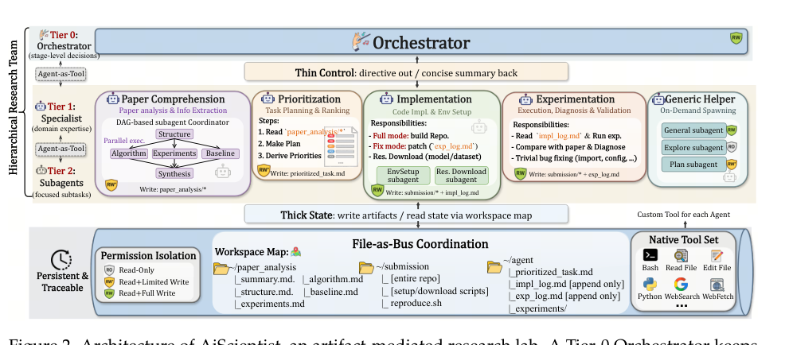
*图示：当前 provider 未启用视觉评审，回退到启发式最高分候选。*

**核心技术点：**

#### 技术点 1：File-as-Bus持久状态协议
- 技术细节：AiScientist将项目状态外化到权限隔离的共享工作区中，分为paper-analysis/（论文理解产物）、submission/（可运行代码仓库）、agent/（计划、实现日志、实验日志）三个区域。Agent之间不依赖对话上下文传递信息，而是通过读写这些持久化文件来协调。每个Tier-1专家只对其职责区域有写权限，共享日志为仅追加模式，从而减少跨Agent干扰。
- 通俗讲解：传统多Agent系统靠'对话接力'传递项目进展，就像每次换班时口头交接，信息量大了必然遗漏。File-as-Bus把所有中间产物——论文分析、代码、实验日志——都写成文件存在共享磁盘上。下一个Agent上线时不需要从头听故事，直接读文件就能接续工作。这让24小时的长时间迭代中，项目状态不会因为上下文窗口限制而丢失。
- 例子：假设实现Agent写完代码后，实验Agent运行发现AUC偏低并将诊断结果写入exp-log.md（包含具体错误指标和可能原因）。6小时后编排器决定再次调用实现Agent，实现Agent直接读取exp-log.md中的诊断信息，定位到数据预处理步骤的bug并修复，而不需要重新从对话历史中回忆问题所在。消融实验显示移除File-as-Bus后，PaperBench下降6.41分，MLE-Bench Lite的Any Medal%下降31.82个百分点。

*图示：传统多Agent系统靠'对话接力'传递项目进展，就像每次换班时口头交接，信息量大了必然遗漏。File-as-Bus把所有中间产物——论文分析、代码、实验日志——都写成文件存在共享磁盘上。下一个Agent上线时不需要从头听故事，直接读文件就能接续工作。这让24小时的长时间迭代中，项目状态不会因为上下文窗口限制而丢失。*

#### 技术点 2：薄控制厚状态的分层编排
- 技术细节：系统分三层：Tier-0编排器只维护阶段级摘要和工作区地图（workspace map），通过Agent-as-Tool接口选择性地调用Tier-1专家（论文理解、优先级排序、实现、实验、通用助手）；Tier-1专家可进一步生成Tier-2子Agent处理聚焦子任务。编排器的决策上下文保持轻量，不需要将全部工作区载入活跃上下文，而是通过渐进式披露按需读取。
- 通俗讲解：把编排器想象成一个项目经理：他不需要记住每行代码的细节，只需看'项目地图'和各阶段的简短汇报就能决定下一步该让谁做什么。具体实现细节由专家Agent自己在局部上下文中处理。这种'薄控制'设计避免了编排器上下文爆炸，同时通过专家分工保证了各阶段的专业性。
- 例子：编排器查看workspace map发现submission/中代码已完成但agent/exp-log.md记录了三个实验失败。它生成指令'进入fix模式，根据exp-log.md修复数据加载问题'并调用实现专家。实现专家作为一个tool call被执行，内部可能再生成环境配置子Agent，完成后返回简短摘要'已修复数据路径问题，更新了impl-log.md'。对比IterativeAgent（有更多交互轮次但无层次结构），AiScientist在成本更低的情况下分数高出近10分。

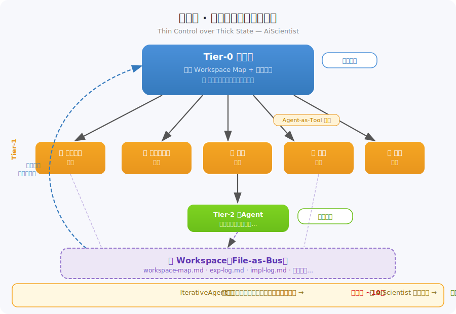
*图示：把编排器想象成一个项目经理：他不需要记住每行代码的细节，只需看'项目地图'和各阶段的简短汇报就能决定下一步该让谁做什么。具体实现细节由专家Agent自己在局部上下文中处理。这种'薄控制'设计避免了编排器上下文爆炸，同时通过专家分工保证了各阶段的专业性。*

#### 技术点 3：证据驱动的迭代研究循环
- 技术细节：AiScientist不是单次流水线，而是在工作区上运行证据驱动的循环：先建立可运行脚手架，然后反复交替实现与实验。每次实验产出的失败轨迹、部分成功、指标差距都写回持久化产物，后续实现轮次基于这些证据做针对性修复而非重复试错。在MLE-Bench的Detecting Insults任务上，系统23小时内自主执行了74轮实验循环，将验证AUC从0.903提升到0.982。
- 通俗讲解：就像一个研究者做实验：跑一次看结果，分析哪里不对，改代码再跑。关键是每次实验的发现都被记录下来，下一轮不会重蹈覆辙。系统前期重点建立能跑通的基线，后期转向精细调优和差异诊断。这种从'能跑'到'跑好'的渐进过程在24小时预算内自动完成。
- 例子：第1-10轮：建立基本训练流程，验证AUC达0.903。第11-30轮：根据exp-log.md中记录的'loss曲线异常平坦'诊断结果，实现Agent调整学习率和模型架构，AUC提升到0.945。第31-74轮：进入精细调优阶段，对比不同特征工程方案和集成策略，最终AUC达0.982。全程无人干预，共产生18次最佳记录更新。

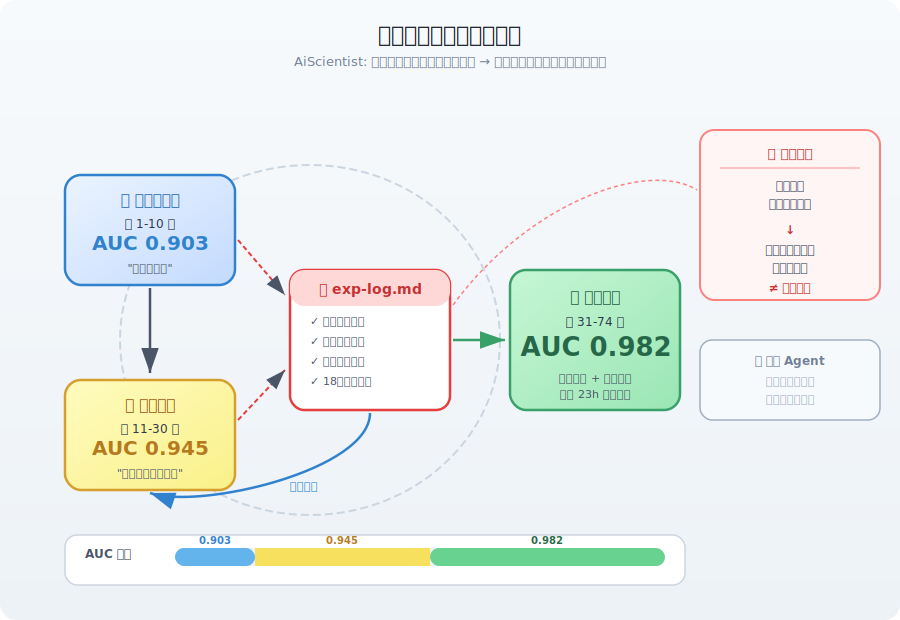
*图示：就像一个研究者做实验：跑一次看结果，分析哪里不对，改代码再跑。关键是每次实验的发现都被记录下来，下一轮不会重蹈覆辙。系统前期重点建立能跑通的基线，后期转向精细调优和差异诊断。这种从'能跑'到'跑好'的渐进过程在24小时预算内自动完成。*

- **对 Agent 产品/系统的启发：** 产品侧：对于AI编程助手和自动化ML平台产品，File-as-Bus模式提供了一个可落地的架构范式：将项目状态持久化到文件系统而非依赖对话记忆，使Agent能在长时间任务中保持连贯性。这对IDE集成的AI Agent、AutoML服务、自动化研究助手等产品形态都有直接参考价值，特别是在需要跨多个工作会话保持项目上下文的场景中。；系统侧：系统设计上有三个关键启发：（1）权限隔离的共享工作区比全局对话历史更适合多Agent协调；（2）Agent-as-Tool让编排器可以像调用普通工具一样调用专家Agent，简化了多Agent系统的控制协议；（3）渐进式披露（workspace map + 按需读取）有效解决了长上下文中信息过载的问题。这些设计模式可推广到任何需要长时间跨度多阶段执行的Agent系统。；风险：24小时无人监管的自主实验循环存在资源浪费和安全风险（如无限循环、错误的环境操作）。File-as-Bus虽然提升了可追溯性，但大量中间文件也增加了状态管理复杂度。此外，系统高度依赖底层LLM能力，在GLM-5和Gemini-3-Flash上表现一致性好，但对更弱模型的鲁棒性未知。评测成本高昂（单次PaperBench评测约$832）也限制了大规模验证。

### 3. GAM: Hierarchical Graph-based Agentic Memory for LLM Agents
- **方向：** memory
- **评分：** 相关性 92 | 价值 85 | 有趣性 85 | 创新性 80 | 开拓性 82
- **为什么入选：** GAM 提出了层次化图结构的 Agent 记忆框架，通过将记忆编码与整合显式解耦，解决了 LLM Agent 长期交互中'快速感知新信息'与'稳定保留旧知识'之间的核心矛盾，对 Agent 记忆系统设计有直接且重要的参考价值。
- **背景：** LLM Agent 在长期对话中需要同时快速捕获新信息并保护已有知识不被噪声污染。现有方案分为两类：统一流式记忆（如 MemGPT、Mem0）能快速更新但容易出现'记忆丢失'和'语义漂移'；离散结构化记忆（如 GraphRAG）稳定但不擅长跟踪实时叙事变化。两者都无法根本性解决编码与整合之间的冲突，因此需要一种能同时兼顾感知敏捷性和存储稳定性的新架构。
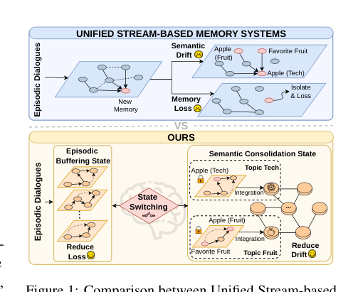
*图示：当前 provider 未启用视觉评审，回退到启发式最高分候选。*

**核心技术点：**

#### 技术点 1：双层图记忆解耦存储
- 技术细节：GAM 将记忆结构分为全局 Topic Associative Network（Gtopic，存放高层语义主题节点及其关联边）和局部 Event Progression Graph（Gevent，存放实时对话的原子事件节点及时序/因果边）。两层通过跨层边 Ecross 连接到归档事件图集合 Sarch，物理隔离了瞬时上下文与长期知识。
- 通俗讲解：想象你有一个全局知识地图（主题网络）和一个临时草稿本（事件图）。新对话只写在草稿本上，绝不直接改全局地图。只有当一个话题真正结束时，草稿本的内容才被提炼后放进地图。这样临时噪声就不会污染你的长期记忆。
- 例子：用户在对话中先聊'苹果手机'再聊'苹果水果'。事件图实时记录每句话的时序关系，但全局主题网络上'Apple Tech'和'Apple Fruit'是两个独立节点，不会因为同时出现'Apple'就被错误合并（避免语义漂移）。

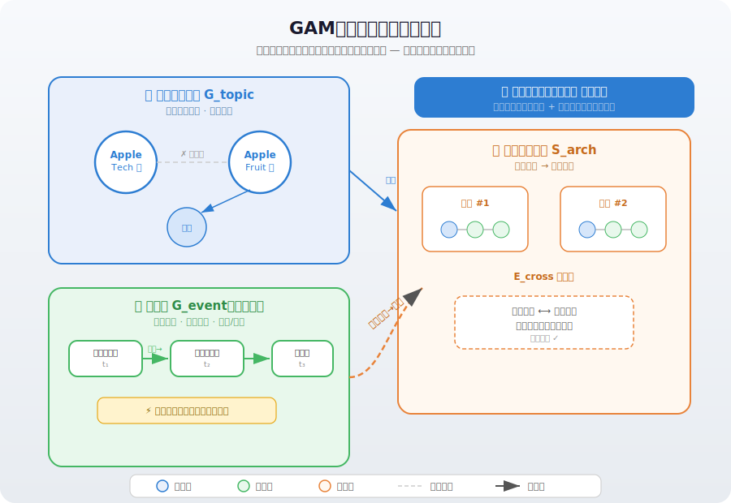
*图示：想象你有一个全局知识地图（主题网络）和一个临时草稿本（事件图）。新对话只写在草稿本上，绝不直接改全局地图。只有当一个话题真正结束时，草稿本的内容才被提炼后放进地图。这样临时噪声就不会污染你的长期记忆。*

#### 技术点 2：语义事件触发的状态切换
- 技术细节：系统建模为两态有限状态机：Episodic Buffering State 负责将新话语追加到局部事件图；当检测到语义边界（bt=1）时切换到 Semantic Consolidation State，将缓冲区内容用 LLM 生成摘要+原文双粒度表示的新主题节点 vnew，通过粗筛（向量相似度取 top-5）+ 精排（LLM 语义打分）建立语义边后写入全局图。语义边界检测仅在 session 结束、交互暂停或 buffer 溢出（2048 token）时触发，而非每轮都判断。
- 通俗讲解：系统不是每句话都更新长期记忆，而是先在本地缓存中积累，只有当话题发生了明显转变时才触发一次'整合'操作。整合时同时保存精炼摘要（用于高层推理）和原始文本（防止摘要丢失细节），然后清空缓存重新开始。这比按固定窗口或固定轮次切割更合理。
- 例子：用户前 8 轮在聊旅行计划，第 9 轮突然转到工作安排。buffer 溢出或 session 暂停时 LLM 判断'旅行变成工作'是语义转变，触发整合：将旅行相关 8 轮对话压缩为一个主题节点写入全局图，并归档原始事件图作为证据链，然后清空 buffer 开始记录工作话题。

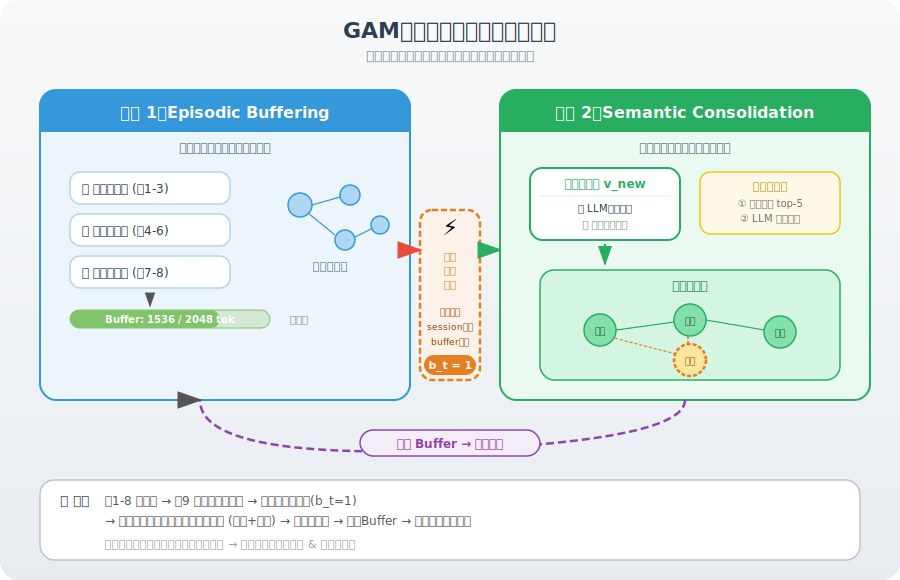
*图示：系统不是每句话都更新长期记忆，而是先在本地缓存中积累，只有当话题发生了明显转变时才触发一次'整合'操作。整合时同时保存精炼摘要（用于高层推理）和原始文本（防止摘要丢失细节），然后清空缓存重新开始。这比按固定窗口或固定轮次切割更合理。*

#### 技术点 3：图引导多因子检索
- 技术细节：检索分三步：(1) 在 Gtopic 中用向量相似度找到 top-k 语义锚点并扩展其一阶邻居；(2) 通过 Ecross 钻取到归档事件图获取候选细节节点集合 C；(3) 用 cross-encoder 计算基础语义概率 Psem，再乘以时间、置信度、角色三个 boost 因子做多因子重排序。boost 因子设为 βtime=1.4, βrole=1.4, βconf=1.2，敏感性分析显示在 1.0-2.0 范围内性能稳定。
- 通俗讲解：检索时先从主题层找到相关大主题，再顺着链接深入到具体的历史对话片段，最后综合语义匹配度、时间相关性、说话人身份和编码时的可信度来排序。这种自顶向下的方式比扁平向量检索更精准，尤其在多人对话中能区分不同说话者的信息。
- 例子：查询'Howard 去年圣诞节说了什么关于火箭的事？'系统先在主题层匹配到'太空/火箭'主题节点及其邻居'NASA实习'，再钻取到归档事件图中的具体对话，最后通过角色因子优先选择 Howard 的发言、时间因子优先选择圣诞节前后的记录，排出最终 top-K 结果。

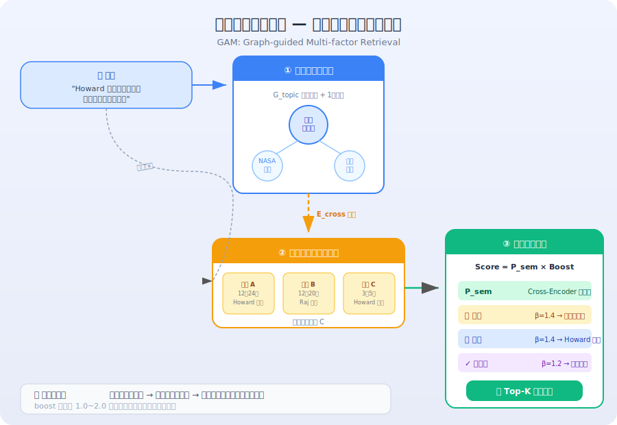
*图示：检索时先从主题层找到相关大主题，再顺着链接深入到具体的历史对话片段，最后综合语义匹配度、时间相关性、说话人身份和编码时的可信度来排序。这种自顶向下的方式比扁平向量检索更精准，尤其在多人对话中能区分不同说话者的信息。*

#### 技术点 4：实验验证与效率优势
- 技术细节：在 LoCoMo 和 LongDialQA 两个长期对话基准上，GAM 在 4 种 LLM backbone（Llama-3.2-3B 到 GPT-4o-mini）上大多取得最优 Avg F1。以 Qwen2.5-7B 为例，LoCoMo Avg F1 达 40.00（Mem0 为 35.38），Temporal F1 超 Mem0 约 18%；LongDialQA Avg F1 达 12.55（超 MemoryOS 86%）。效率方面，GAM 每次查询仅消耗 1370 token（比 Mem0 少 11%），延迟 0.80s，F1 比 Mem0 高 13%。消融实验显示移除事件图（w/o EPG）损失最大。
- 通俗讲解：GAM 不仅更准确，而且更省 token。因为它的结构化存储天然做了信息压缩和精准检索，不需要塞大量原始文本进 prompt。在小模型上优势尤其明显——结构化记忆弥补了小模型上下文窗口的不足。消融实验证实事件图（叙事结构）是最关键组件。
- 例子：在 Qwen2.5-7B 上回答 LoCoMo 时间推理题时，GAM 的 Temporal F1 为 48.97，而 Mem0 为 41.22。GAM 每次查询仅用 1370 个 token 构建 prompt，A-Mem 则需 4221 个 token，MemoryOS 虽 token 适中但延迟高达 154 秒。

*图示：GAM 不仅更准确，而且更省 token。因为它的结构化存储天然做了信息压缩和精准检索，不需要塞大量原始文本进 prompt。在小模型上优势尤其明显——结构化记忆弥补了小模型上下文窗口的不足。消融实验证实事件图（叙事结构）是最关键组件。*

- **对 Agent 产品/系统的启发：** 产品侧：对于需要长期对话记忆的 Agent 产品（如个人助手、客服机器人、角色扮演 AI），GAM 的双层图架构和语义触发整合机制提供了清晰的工程范式：用局部 buffer 隔离噪声、用语义边界触发整合、用图结构索引支持精准召回。这种设计在小模型（3B-7B）上就能获得显著提升，降低了部署门槛。其图节点结构也天然支持用户查看、删除、修正记忆等隐私合规功能。；系统侧：GAM 的核心设计思想——将记忆生命周期解耦为'快写慢整合'两阶段——可以作为 Agent 记忆系统的通用架构模式。工程实现上，事件图的追加操作极轻量，整合操作只在语义转变时触发（稀疏调用 LLM），整体 token 开销低于 Mem0。粗筛+精排的主题链接策略避免了全图 O(N) 扫描。跨层边 Ecross 的设计使得检索可以在主题抽象层和事件细节层之间自由穿梭，值得在 RAG 系统中借鉴。；风险：当前方案仅支持文本模态，无法处理图像或语音信息。语义边界检测依赖 LLM 判断，存在误判风险（论文附录显示在 40% 分段噪声下仍优于基线，但极端情况未验证）。整合阶段的摘要可能丢失关键细节（论文用双粒度表示缓解但未完全消除）。此外，持久化记忆涉及用户隐私，需要在整合前设置隐私过滤机制。Open-Domain 类问题上 GAM 表现不如其他类别突出，说明对弱定位、宽泛主题的检索仍有改进空间。

## 四、候选但未完成深读的论文

当前重点论文都已完成可用分析。

## 五、总结

- 今天的论文集中传递了一个信号：Agent 的核心瓶颈不在单步能力，而在长程任务中的结构性退化——规划层、记忆层和安全层在步数增多后都会以不同方式崩溃。
- 社区正在从'让 Agent 跑通任务'转向'让 Agent 的失败可诊断、可归因、可修复'，失败模式分类和轨迹级评测正在成为新一代 Agent 工程的基础设施。
- 记忆和安全两个方向都在从静态方案向自适应方案演进，这意味着下一阶段的 Agent 系统将更像一个需要运行时治理的'活系统'，而不只是一条固定流水线。
