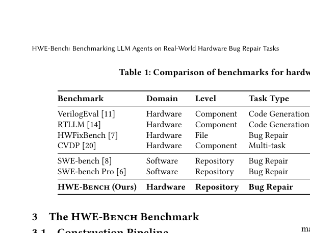
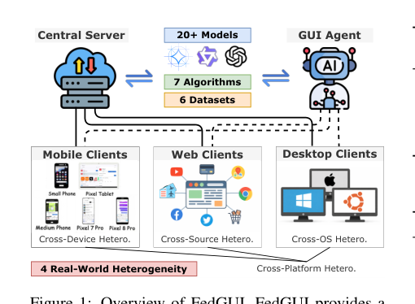
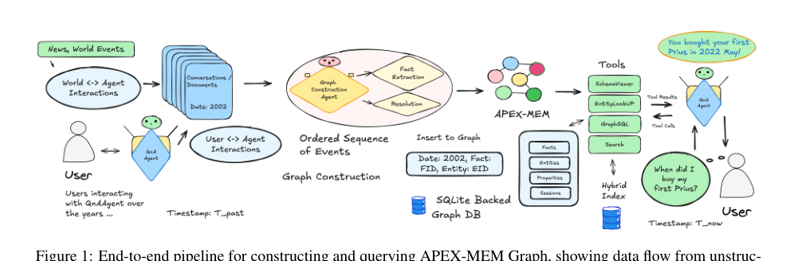

# 2026-04-17 AI Agent 论文日报

> 分类：cs.AI + cs.CL + cs.LG + cs.MA + cs.RO + cs.SE + cs.HC
> 入选论文：3 篇

## 一、初筛每日趋势

- 今天初筛后最集中的主题是 tool\_use、planning\_reasoning、agent\_eval，说明研究关注点继续从单轮回答能力转向更完整的执行链。
- 从创新性和研究开拓性看，Benchmarks for Trajectory Safety Evaluation and Diagnosis in OpenClaw and Codex: ATBench-Claw and ATBench-CodeX、Neuro-Oracle: A Trajectory-Aware Agentic RAG Framework for Interpretable Epilepsy Surgical Prognosis 代表了今天最值得后续继续追踪的切口。

## 二、今日基础知识点

### Planner 为什么重要
- **概念解释：** Planner 可以理解成 Agent 在真正动手前先安排'先做什么、后做什么、每一步依赖什么反馈'的那层机制。没有 planner，系统容易把任务做成一步一拍脑袋的局部反应；有了 planner，Agent 才能处理长任务、跨工具任务和需要中途修正的任务。很多 Agent 能力差异，最后都不是出在语言生成本身，而是出在计划层有没有把任务拆对、有没有给执行留回退空间。
- **为什么今天值得懂：** 今天的重点论文里，反复出现了评测、执行链安全、工具与环境交互这些问题，所以补这个概念最划算。

## 三、重点论文精读

### 1. HWE-Bench: Benchmarking LLM Agents on Real-World Hardware Bug Repair Tasks
- **方向：** agent\_eval
- **评分：** 相关性 73 | 价值 62 | 有趣性 64 | 创新性 54 | 开拓性 51
- **为什么入选：** 与 Agent 方向有关，值得保留关注。
- **背景：** HWE-Bench: Benchmarking LLM Agents on Real-World Hardware Bug Repair Tasks 和 Agent 能力或系统设计有关，但当前只能基于摘要做保守判断。LLM 分析失败: LLM 调用失败: An error occurred (ValidationException) when calling the InvokeModel operation: Access to Anthropic models is not allowed from unsupported countries, regions, or territories. Please refer to https://www.anthropic.com/supported-countries for more information on the countries and regions Anthropic currently supports.

*图示：当前 provider 未启用视觉评审，回退到启发式最高分候选。*

- **当前状态：** llm_failed（LLM 分析失败: LLM 调用失败: An error occurred (ValidationException) when calling the InvokeModel operation: Access to Anthropic models is not allowed from unsupported countries, regions, or territories. Please refer to https://www.anthropic.com/supported-countries for more information on the countries and regions Anthropic currently supports.）
- **核心技术点：** 本次精读未成功，暂不展示结构化核心点，避免误导。

### 2. FedGUI: Benchmarking Federated GUI Agents across Heterogeneous Platforms, Devices, and Operating Systems
- **方向：** computer\_use
- **评分：** 相关性 73 | 价值 62 | 有趣性 64 | 创新性 54 | 开拓性 51
- **为什么入选：** 与 Agent 方向有关，值得保留关注。
- **背景：** FedGUI: Benchmarking Federated GUI Agents across Heterogeneous Platforms, Devices, and Operating Systems 和 Agent 能力或系统设计有关，但当前只能基于摘要做保守判断。LLM 分析失败: LLM 调用失败: An error occurred (ValidationException) when calling the InvokeModel operation: Access to Anthropic models is not allowed from unsupported countries, regions, or territories. Please refer to https://www.anthropic.com/supported-countries for more information on the countries and regions Anthropic currently supports.

*图示：当前 provider 未启用视觉评审，回退到启发式最高分候选。*

- **当前状态：** llm_failed（LLM 分析失败: LLM 调用失败: An error occurred (ValidationException) when calling the InvokeModel operation: Access to Anthropic models is not allowed from unsupported countries, regions, or territories. Please refer to https://www.anthropic.com/supported-countries for more information on the countries and regions Anthropic currently supports.）
- **核心技术点：** 本次精读未成功，暂不展示结构化核心点，避免误导。

### 3. APEX-MEM: Agentic Semi-Structured Memory with Temporal Reasoning for Long-Term Conversational AI
- **方向：** planning\_reasoning
- **评分：** 相关性 73 | 价值 62 | 有趣性 56 | 创新性 54 | 开拓性 59
- **为什么入选：** 与 Agent 方向有关，值得保留关注。
- **背景：** APEX-MEM: Agentic Semi-Structured Memory with Temporal Reasoning for Long-Term Conversational AI 和 Agent 能力或系统设计有关，但当前只能基于摘要做保守判断。LLM 分析失败: LLM 调用失败: An error occurred (ValidationException) when calling the InvokeModel operation: Access to Anthropic models is not allowed from unsupported countries, regions, or territories. Please refer to https://www.anthropic.com/supported-countries for more information on the countries and regions Anthropic currently supports.

*图示：当前 provider 未启用视觉评审，回退到启发式最高分候选。*

- **当前状态：** llm_failed（LLM 分析失败: LLM 调用失败: An error occurred (ValidationException) when calling the InvokeModel operation: Access to Anthropic models is not allowed from unsupported countries, regions, or territories. Please refer to https://www.anthropic.com/supported-countries for more information on the countries and regions Anthropic currently supports.）
- **核心技术点：** 本次精读未成功，暂不展示结构化核心点，避免误导。

## 四、候选但未完成深读的论文

- **HWE-Bench: Benchmarking LLM Agents on Real-World Hardware Bug Repair Tasks**
  - 状态：llm\_failed
  - 原因：LLM 分析失败: LLM 调用失败: An error occurred (ValidationException) when calling the InvokeModel operation: Access to Anthropic models is not allowed from unsupported countries, regions, or territories. Please refer to https://www.anthropic.com/supported-countries for more information on the countries and regions Anthropic currently supports.
- **FedGUI: Benchmarking Federated GUI Agents across Heterogeneous Platforms, Devices, and Operating Systems**
  - 状态：llm\_failed
  - 原因：LLM 分析失败: LLM 调用失败: An error occurred (ValidationException) when calling the InvokeModel operation: Access to Anthropic models is not allowed from unsupported countries, regions, or territories. Please refer to https://www.anthropic.com/supported-countries for more information on the countries and regions Anthropic currently supports.
- **APEX-MEM: Agentic Semi-Structured Memory with Temporal Reasoning for Long-Term Conversational AI**
  - 状态：llm\_failed
  - 原因：LLM 分析失败: LLM 调用失败: An error occurred (ValidationException) when calling the InvokeModel operation: Access to Anthropic models is not allowed from unsupported countries, regions, or territories. Please refer to https://www.anthropic.com/supported-countries for more information on the countries and regions Anthropic currently supports.

## 五、总结

- 如果把今天的论文连起来看，一个明显变化是：大家越来越少把 Agent 当成单一模型能力问题，而是把它当成执行链、工具层、评测层和安全层共同构成的系统问题。
- 这意味着后续真正有开拓性的研究，往往不是再加一点 prompt 技巧，而是重新定义 Agent 应该如何被评测、如何被约束，以及如何在真实环境里更稳地工作。
