# 2026-04-21 AI Agent 论文日报

> 分类：cs.AI + cs.CL + cs.LG + cs.MA + cs.RO + cs.SE + cs.HC
> 入选论文：3 篇

## 一、初筛每日趋势

- Agent 安全研究正在从 prompt injection 等单点攻击扩展到更系统性的维度——自进化过程中的安全风险、长期记忆的投毒与隐私泄露、工具调用的内核级治理同时出现在高分候选中，表明社区开始认真对待 Agent 在持续运行和自我改进中累积的安全债务。
- 测试时计算扩展（test-time scaling）正式进入长 horizon Agent 场景：不再局限于数学推理或单轮代码生成，而是需要处理多步轨迹的摘要、选择和精炼，'轨迹摘要'正成为连接并行搜索与序贯改进的关键中间表示。
- 环境合成与 Agent 评测走向规模化和闭环化：Agent-World 和 AJ-Bench 分别从训练环境和评测裁判两端推进，表明社区对'用更真实、更多样的环境驱动 Agent 能力进化'已形成共识，单一基准刷分的时代正在结束。
- 小模型编排和 RL 训练框架（LiteResearcher、Small Model as Orchestrator）同时上榜，说明 Agent 系统设计正在从'用最强模型做一切'转向分层架构——用轻量模型做调度和工具编排，用 RL 训练闭环提升策略，追求效率与可控性的平衡。

## 二、今日基础知识点

### 轨迹摘要（Trajectory Summary）：Agent 长 horizon 决策的核心中间表示
- **概念解释：** 轨迹摘要是指将 Agent 在完成一次任务过程中产生的完整执行轨迹——包括观察、动作、中间输出、错误和恢复步骤——压缩成一份结构化的摘要。它不是简单截断或拼接日志，而是提取出哪些步骤成功了、哪些失败了、最终状态是什么、关键决策节点在哪里。在 Agent 系统中，轨迹摘要充当三重角色：第一，作为并行搜索时的比较接口——当多个 Agent 实例并行尝试同一个任务，系统需要一个统一格式来判断哪条轨迹更好；第二，作为序贯精炼时的上下文——下一轮尝试不需要重读几千 token 的原始日志，只需要摘要就能知道上次错在哪里；第三，作为可靠性诊断的基础——当同一任务多次执行结果不一致时，比对轨迹摘要比比对原始轨迹高效得多。好的轨迹摘要需要在信息保留和长度压缩之间取得平衡：太粗会丢失关键失败原因，太细又退化回原始轨迹的噪声问题。
- **为什么今天值得懂：** 今天入选的三篇精读论文都围绕轨迹级别的信息处理展开：Scaling Test-Time Compute 直接以轨迹摘要作为并行选择和精炼的统一接口，Agent-World 用轨迹级奖励驱动 RL 训练闭环，Computer Use Agent 可靠性研究则通过比对重复执行轨迹来分解不可靠性的来源——理解轨迹摘要是读懂今天这三篇工作的共同前提。

## 三、重点论文精读

### 1. Scaling Test-Time Compute for Agentic Coding
- **方向：** code\_agent
- **评分：** 相关性 95 | 价值 92 | 有趣性 90 | 创新性 82 | 开拓性 90
- **为什么入选：** 直接研究 code agent 在测试时计算量扩展的策略，提出以轨迹摘要为核心接口的并行选择+序贯精炼统一框架，在 SWE-Bench Verified 和 Terminal-Bench v2.0 上对多个前沿模型取得显著提升，对 agentic coding 的推理效率和能力边界有直接参考价值。
- **背景：** 测试时计算扩展（test-time scaling）在数学推理、单轮代码生成等短输出场景已被验证有效，但 agentic coding 产生的是长轨迹（读文件、编辑代码、看日志、执行命令、处理中间错误），每次尝试可达几十步，原始轨迹又长又噪，难以直接比较或复用。已有的 best-of-N 或 self-refine 方法在这种长 horizon 场景下效果打折，核心瓶颈在于如何把过往经验表示成可选择、可复用的形式。本文提出以「结构化轨迹摘要」为统一接口，同时驱动并行选择和序贯精炼两条扩展路径。
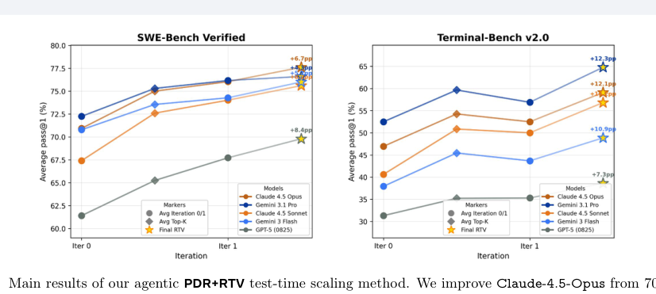
*图示：当前 provider 未启用视觉评审，回退到启发式最高分候选。*

**核心技术点：**

#### 技术点 1：轨迹摘要是核心表示
- 技术细节：每条 rollout 轨迹通过一个摘要提示 Psum 被 LLM 压缩为结构化摘要 Si，保留关键假设、进展和失败模式，丢弃重复终端输出和死胡同探索等低信号细节。这些摘要是后续并行投票和序贯精炼共用的接口。实验表明在 RTV 的后期轮次中，使用摘要比使用原始轨迹选出的 rollout 质量高出数个百分点。
- 通俗讲解：Agent 一次尝试可能产生几十步交互日志，里面既有有用的诊断信息也有大量噪音。论文的核心洞察是：先把每条轨迹'浓缩'成一份结构化报告（像一份'验尸报告'），后续所有比较和复用都在报告层面进行，而不是让 LLM 硬啃几万 token 的原始日志。
- 例子：假设 agent 在 SWE-Bench 上修一个 Django bug，产生一条 40 步的轨迹。摘要会提取：'根因是 QuerySet.-clone() 未复制 -iterable-class 属性；在第 12 步尝试了 monkey-patch 但失败；第 25 步找到了正确修改位置但 patch 格式有误'。后续投票和精炼都只看这份摘要，而不是完整的 bash 交互记录。

*图示：Agent 一次尝试可能产生几十步交互日志，里面既有有用的诊断信息也有大量噪音。论文的核心洞察是：先把每条轨迹'浓缩'成一份结构化报告（像一份'验尸报告'），后续所有比较和复用都在报告层面进行，而不是让 LLM 硬啃几万 token 的原始日志。*

#### 技术点 2：递归锦标赛投票(RTV)
- 技术细节：RTV 将 N 条 rollout 的摘要分成大小为 G 的小组，每组通过 V 次 LLM 投票选出一个胜者，胜者进入下一轮，递归进行直到剩下一条。实验发现 G=2（两两比较）优于更大分组，V=8 的投票聚合在可靠性和成本间取得平衡。在 N=16 的设置下，RTV 单独即可将 Claude-4.5-Sonnet 在 Terminal-Bench v2.0 上从 40.6% 提升到 54.6%。
- 通俗讲解：想象一场淘汰赛：16 条轨迹的摘要两两配对，LLM 当裁判投 8 票选出每对中更好的那条，8 个胜者再两两比，如此递归直到选出冠军。之所以不一次性让 LLM 从 16 条里挑最好的，是因为一次比较太多候选时 LLM 判断力下降，分解成小决策更稳定。
- 例子：16 条摘要分成 8 组，每组 2 条。对第一组，LLM 被问 8 次'哪条摘要描述了更可靠的修复方案？'，假设 6 票投给摘要 A、2 票投给摘要 B，则 A 胜出进入下一轮。经过 4 轮淘汰，最终选出 1 条 rollout 作为最终提交。

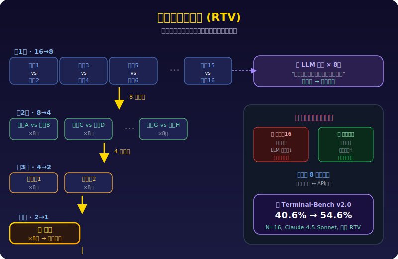
*图示：想象一场淘汰赛：16 条轨迹的摘要两两配对，LLM 当裁判投 8 票选出每对中更好的那条，8 个胜者再两两比，如此递归直到选出冠军。之所以不一次性让 LLM 从 16 条里挑最好的，是因为一次比较太多候选时 LLM 判断力下降，分解成小决策更稳定。*

#### 技术点 3：并行蒸馏精炼(PDR)
- 技术细节：在序贯维度上，先用 RTV 从 N=16 条 iteration-0 rollout 中选出 top-K=4 条摘要作为精炼上下文，然后在全新的容器环境中执行 N=16 条 iteration-1 rollout，每条 rollout 的首个 action 同时以原始问题和这 K 条摘要为条件。实验发现精炼上下文中 4/4 通过的 rollout 对应 iteration-1 约 99% 的通过率，而 0/4 通过时接近 0%。
- 通俗讲解：第一轮做了 16 次尝试后，挑出 4 份最好的'验尸报告'告诉 agent：'这是你之前最好的 4 次尝试的总结，包括它们的思路、进展和还没解决的问题，请在全新环境中再试一次。'agent 可以直接跳过之前的探索阶段，步数从平均 41 步降到 14 步，同时成功率还上升了。
- 例子：在修复一个 Python 库的 bug 时，iteration-0 的 4 份摘要可能分别描述了'定位到了 utils.py 第 42 行的类型检查缺失'、'patch 格式需要用 unified diff'等信息。iteration-1 的 agent 在新容器中启动后，直接导航到正确文件、应用正确格式的 patch，14 步完成原本需要 41 步的工作。

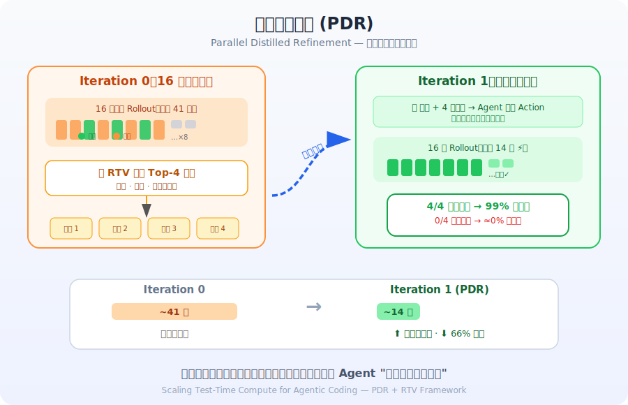
*图示：第一轮做了 16 次尝试后，挑出 4 份最好的'验尸报告'告诉 agent：'这是你之前最好的 4 次尝试的总结，包括它们的思路、进展和还没解决的问题，请在全新环境中再试一次。'agent 可以直接跳过之前的探索阶段，步数从平均 41 步降到 14 步，同时成功率还上升了。*

#### 技术点 4：精炼上下文质量决定性能
- 技术细节：论文将 iteration-1 结果按精炼上下文中通过 rollout 数量分层统计，发现强烈的单调关系：以 Claude-4.5-Opus 在 SWE-Bench 为例，上下文 0/4 通过时 iteration-1 pass@1 仅 0.1%，4/4 通过时达 99.2%。这证明 RTV 选出高质量上下文对序贯精炼至关重要，随机采样 K 条不如 RTV 选择 K 条。
- 通俗讲解：给 agent 的'参考答案'越好，它下一轮的表现就越好。如果 4 份参考摘要全是失败的，agent 几乎学不到有用信息；如果 4 份全是成功的，agent 几乎 100% 能在新环境中复现成功。因此先用 RTV 精选高质量摘要再做精炼，比随机挑摘要效果好得多。
- 例子：对 100 个 SWE-Bench 任务，随机采样 K=4 摘要时有约 52.8 个任务拿到 4/4 通过的上下文；用 RTV 选择后有 62 个任务拿到 4/4 通过的上下文。后者对应的 iteration-1 平均 pass@1 从 75.06% 提升到 78.06%（Claude-4.5-Sonnet）。

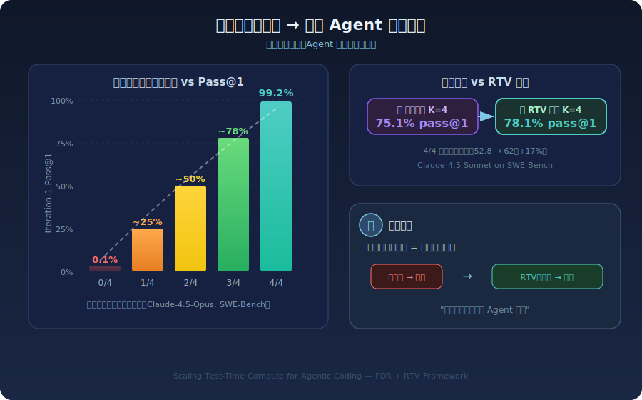
*图示：给 agent 的'参考答案'越好，它下一轮的表现就越好。如果 4 份参考摘要全是失败的，agent 几乎学不到有用信息；如果 4 份全是成功的，agent 几乎 100% 能在新环境中复现成功。因此先用 RTV 精选高质量摘要再做精炼，比随机挑摘要效果好得多。*

#### 技术点 5：跨模型跨基准一致提升
- 技术细节：在 5 个前沿模型（Claude-4.5-Opus/Sonnet, Gemini-3.1-Pro, Gemini-3-Flash, GPT-5-0825）和 2 个基准上均取得一致提升。SWE-Bench Verified 上最大提升 +8.4pp（Claude-4.5-Sonnet），Terminal-Bench v2.0 上最大提升 +16.2pp（Claude-4.5-Sonnet）。方法还帮助 agent 解决了初始 16 次 rollout 中完全无法解决的新任务。
- 通俗讲解：不管用哪个顶级模型，这套'摘要变成锦标赛选择变成精炼变成再选择'的流程都能稳定地把成功率往上推。尤其在 Terminal-Bench 这种更难、方差更大的基准上，提升幅度更大，说明越难的任务越需要从多次尝试中提取和复用经验。
- 例子：Claude-4.5-Opus 在 Terminal-Bench v2.0 上单次尝试只有 47% 的通过率，经过 PDR+RTV 后达到 59.1%。其中还包括之前 16 次尝试全部失败但通过精炼后首次成功的任务，如 gpt2-codegolf。

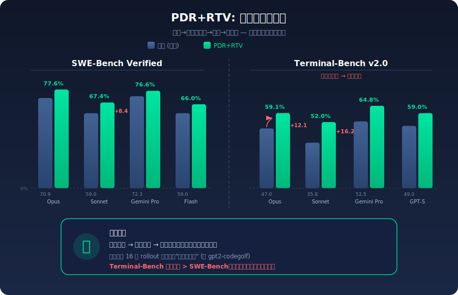
*图示：不管用哪个顶级模型，这套'摘要变成锦标赛选择变成精炼变成再选择'的流程都能稳定地把成功率往上推。尤其在 Terminal-Bench 这种更难、方差更大的基准上，提升幅度更大，说明越难的任务越需要从多次尝试中提取和复用经验。*

- **对 Agent 产品/系统的启发：** 产品侧：对 Cursor、Devin、Codex 等代码 Agent 产品，可以直接应用此框架：用户提交一个任务后，后端并行跑多条轨迹、自动生成摘要、投票选最优、再精炼一轮，用户看到的是单次高质量结果。关键是产品需要提供'轨迹摘要'能力作为中间层，而非简单的 best-of-N 或自我反思。对于高价值任务（如生产环境 bug 修复），额外的推理成本（16×2=32 次 rollout）在质量提升面前完全值得。；系统侧：系统层面有三个启发：(1) 需要为每条 agent 轨迹维护结构化摘要作为'记忆接口'，这比存储完整轨迹更高效也更有用；(2) 并行执行需要隔离的容器环境，每轮精炼需要全新环境以避免状态污染；(3) RTV 的递归小组投票模式可泛化到其他长 horizon agent 场景（如研究 agent、运维 agent），其核心是将全局比较分解为局部两两决策+多票聚合。；风险：主要风险：(1) 计算成本高，N=16 并行 × 2 轮迭代 × V=8 投票 = 大量 LLM 调用，需要权衡成本与收益；(2) 当所有初始 rollout 全部失败时（0/4 通过的上下文），精炼几乎无效（pass@1 约 0.1%），说明该方法放大优势但不能从无到有创造解决方案；(3) 摘要质量依赖 LLM 能力，如果 LLM 在摘要时遗漏关键信息或引入幻觉，会传播到后续所有环节。

### 2. Agent-World: Scaling Real-World Environment Synthesis for Evolving General Agent Intelligence
- **方向：** agent\_eval
- **评分：** 相关性 95 | 价值 88 | 有趣性 90 | 创新性 85 | 开拓性 90
- **为什么入选：** Agent-World 提出了一套从真实世界主题出发、规模化合成可执行环境并驱动 Agent 持续自我进化的完整框架，直接解决 Agent RL 训练中环境多样性不足与缺乏持续学习机制这两大核心瓶颈，对 Agent 产品和系统具有高度实践指导价值。
- **背景：** 当前训练通用 Agent 面临两个关键瓶颈：一是现有环境要么是 LLM 模拟（易产生幻觉、偏离真实动态），要么来自有限的开源工具链，难以覆盖真实世界中有状态、多工具组合的复杂交互场景；二是已有工作侧重环境构建本身，缺少利用可扩展环境来诊断 Agent 弱点并驱动持续自我改进的闭环机制。Agent-World 正是为同时解决这两个问题而提出的：它既能从数千个真实主题出发大规模合成可执行环境（1978 个环境、19822 个工具），又能通过自进化训练竞技场让 Agent 策略与环境共同演进。在 23 个基准上，8B/14B 模型一致超越强 proprietary 模型和现有环境扩展基线。
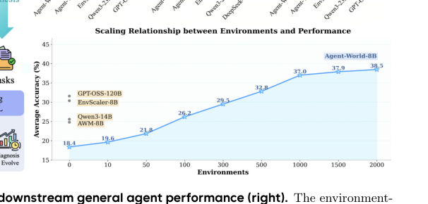
*图示：当前 provider 未启用视觉评审，回退到启发式最高分候选。*

**核心技术点：**

#### 技术点 1：智能体式环境挖掘与合成
- 技术细节：从 MCP Server 规范、开源工具文档、工业 PRD 三个来源收集数千环境主题，然后用一个配备搜索/浏览器/代码/OS 工具的深度研究 Agent 自动从互联网挖掘主题对齐的真实数据库，再通过多轮 '数据库复杂化' 扩展数据规模与结构复杂度。之后用编码 Agent 生成可执行 Python 工具函数并通过单元测试交叉验证（通过率\>50%才保留），最终构建出包含 1978 个环境、19822 个工具的生态系统。
- 通俗讲解：与以往靠 LLM 凭空编造数据库不同，Agent-World 让一个 Agent 像做深度调研一样去网上搜集真实结构化数据，然后围绕这些真实数据生成可执行的工具接口，再用自动化测试确保工具真的能跑通。这样生成的环境既贴近真实世界，又能大规模扩展。
- 例子：假设主题是'航班预订'，深度研究 Agent 会从航空数据网站抓取航班时刻表、价格、库存等数据构建数据库，然后编码 Agent 生成 check-inventory()、book-flight()、update-calendar() 等 Python 函数，每个函数配有单元测试；测试通过后这个环境就可以用于训练 Agent 按正确顺序调用工具完成预订流程。

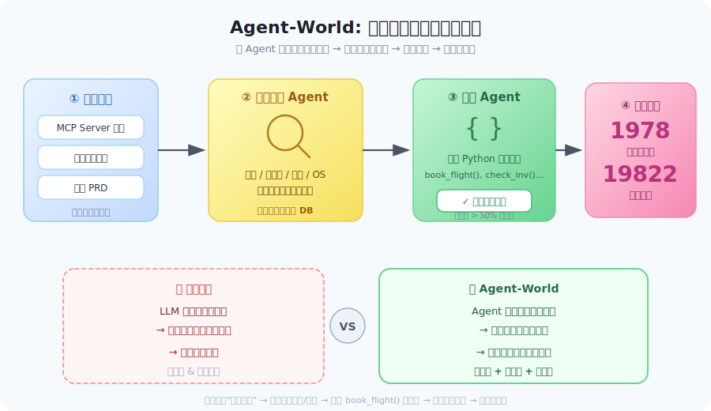
*图示：与以往靠 LLM 凭空编造数据库不同，Agent-World 让一个 Agent 像做深度调研一样去网上搜集真实结构化数据，然后围绕这些真实数据生成可执行的工具接口，再用自动化测试确保工具真的能跑通。这样生成的环境既贴近真实世界，又能大规模扩展。*

#### 技术点 2：双策略可验证任务合成
- 技术细节：论文提出两种互补的任务生成策略：(1) 图式合成——为每个环境构建工具依赖有向图（强/弱/独立三种边），通过加权随机游走生成工具调用序列，再逆向生成自然语言任务描述，最后在沙箱中执行获取 ground-truth 和评估 rubric；(2) 程序化合成——直接让 LLM 生成包含循环、分支、聚合等复杂控制流的 Python 解题脚本及对应验证脚本。两种方式都通过 ReAct Agent 五次独立执行来保证任务的可解性和一致性。难度则通过加长工具链、增加弱依赖比例、隐藏工具名等方式可控提升。
- 通俗讲解：图式合成适合模拟'先查库存再下单再更新日历'这类有序流程；程序化合成则覆盖'循环比对多个供应商价格后取最优'这类非线性推理。两条路线都先生成答案再出题，确保每道题都有可执行的正确答案和自动判分脚本，不依赖人工标注。
- 例子：图式合成示例：随机游走选出 search-flights 变成 book-flight 变成 get-booking-details 三步序列，在沙箱执行后得到具体航班号和订单信息，再据此生成用户问题'帮我订一张明天从北京到上海最便宜的航班并告诉我订单号'。程序化合成示例：生成一段 Python 脚本，循环调用三家航司 API 比价并排序，验证脚本检查 Agent 返回的最低价是否与脚本输出一致。

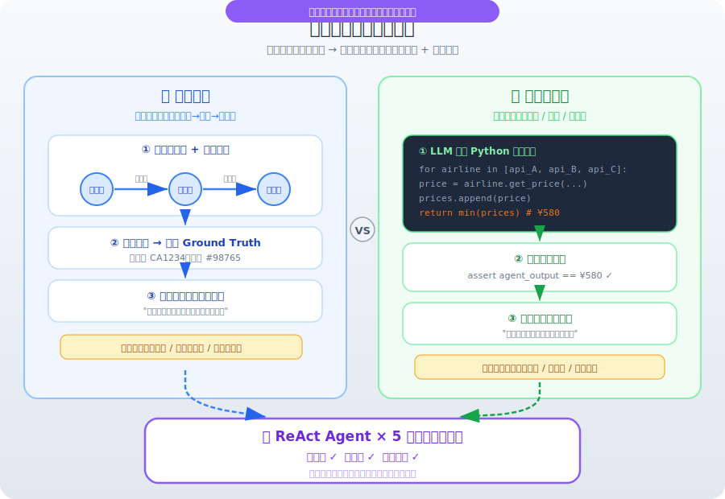
*图示：图式合成适合模拟'先查库存再下单再更新日历'这类有序流程；程序化合成则覆盖'循环比对多个供应商价格后取最优'这类非线性推理。两条路线都先生成答案再出题，确保每道题都有可执行的正确答案和自动判分脚本，不依赖人工标注。*

#### 技术点 3：自进化竞技场闭环训练
- 技术细节：训练分三个循环阶段：(1) 在分层采样的竞技场环境上合成新评测任务并评估当前策略；(2) 诊断 Agent 用一个配备 Python 解释器和搜索工具的自动诊断 Agent 分析失败轨迹，输出弱环境集合和针对性任务生成指导；(3) 根据诊断结果在弱环境上扩展数据库复杂度并合成靶向训练任务，继续用 GRPO 做多环境 Agent RL。多轮迭代形成'评估变成诊断变成靶向训练变成再评估'的策略-环境共演化闭环。
- 通俗讲解：这就像一个自动化教练系统：先考试看 Agent 哪些场景做得差，然后分析错误原因（比如工具调用顺序错误或状态更新遗漏），接着专门出更多同类型的题让 Agent 练，练完再考，如此循环。每轮考试题目和环境都在动态更新，防止 Agent '刷题过拟合'。
- 例子：第 1 轮评估发现 Agent 在'金融交易'类环境中频繁因为状态更新错误而失败（如扣款后未更新余额），诊断 Agent 输出'金融交易环境为弱环境，建议生成更多涉及余额状态追踪的任务'。第 2 轮便在该环境上扩充数据库（增加多账户场景）并合成靶向任务进行 RL 训练，第 3 轮评估中该类环境的成功率从 30% 提升到 55%。

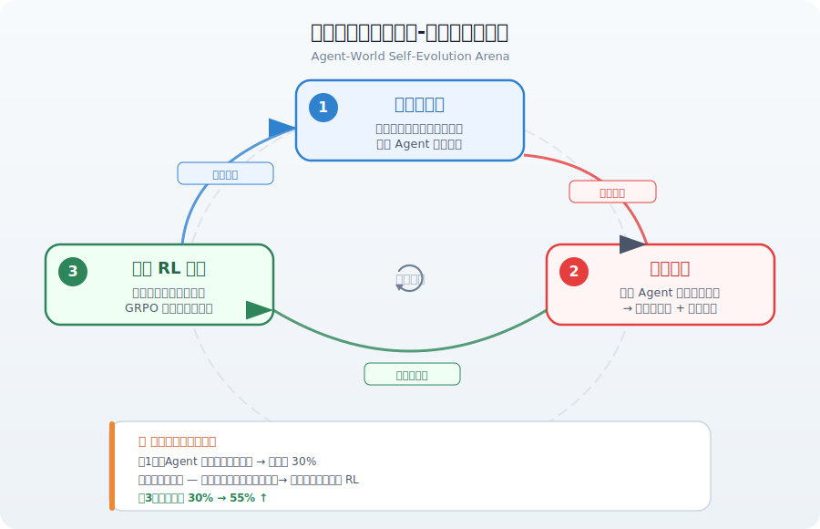
*图示：这就像一个自动化教练系统：先考试看 Agent 哪些场景做得差，然后分析错误原因（比如工具调用顺序错误或状态更新遗漏），接着专门出更多同类型的题让 Agent 练，练完再考，如此循环。每轮考试题目和环境都在动态更新，防止 Agent '刷题过拟合'。*

#### 技术点 4：多环境 Agent RL 与可执行奖励
- 技术细节：训练采用 GRPO 算法，每个 batch 内的任务配对独立的动态环境进行 agent-tool-database 闭环 rollout。奖励信号分两种：图式任务用 rubric-conditioned LLM judge 逐条评分取均值；程序化任务直接在沙箱执行验证脚本判定通过与否。最大轨迹长度 80K token，每步最多生成 32K token，每个任务采样 8 条轨迹。
- 通俗讲解：Agent 在训练时真的去调用工具、读写数据库，得到的反馈不是 LLM 模拟的而是真实执行结果。奖励也不是简单的字符串匹配，而是通过执行验证代码或结构化评分来判断答案和环境状态是否正确，这比静态问答训练能学到更扎实的交互逻辑。
- 例子：Agent 收到任务'查询并取消过去 7 天内所有未发货订单'，它依次调用 list-orders(status='pending', days=7) 和 cancel-order(id=...)，每次调用都真正修改数据库。最终验证脚本检查数据库中是否所有符合条件的订单状态都变为 cancelled，全部通过则奖励为 1，否则为 0。

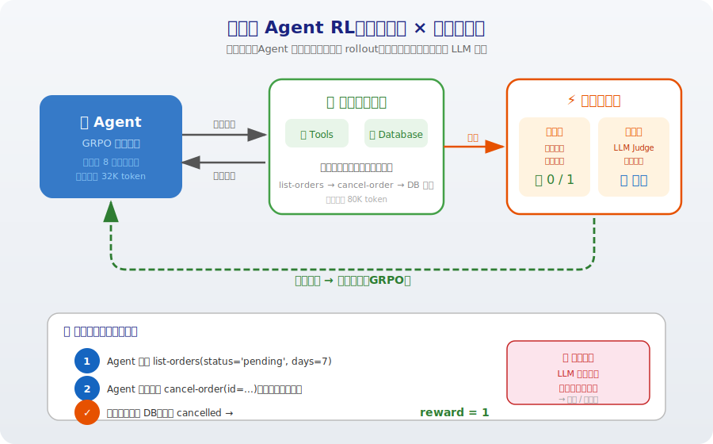
*图示：Agent 在训练时真的去调用工具、读写数据库，得到的反馈不是 LLM 模拟的而是真实执行结果。奖励也不是简单的字符串匹配，而是通过执行验证代码或结构化评分来判断答案和环境状态是否正确，这比静态问答训练能学到更扎实的交互逻辑。*

#### 技术点 5：23 基准全面验证与规模律
- 技术细节：在 MCP-Mark、BFCL V4、τ2-Bench 等核心 Agent 基准以及 SWE-Bench、GAIA、ARC-AGI-2 等 20 个额外基准上评测。Agent-World-8B 在 τ2-Bench 达 61.8%、BFCL V4 达 51.4%、MCP-Mark 达 8.9%，全面超越同参数量环境扩展基线和 Qwen3-235B-A22B。Agent-World-14B 在 BFCL V4 上以 55.8% 与 DeepSeek-V3.2-685B 的 54.1% 持平。论文还展示了环境数量和自进化轮数与下游性能之间的正向扩展关系。
- 通俗讲解：用 8B 小模型就能在多个复杂 Agent 基准上打败 235B 大模型和各种 proprietary 模型，说明环境质量和训练机制比单纯堆参数更重要。而且随着合成环境数量增加和自进化轮数增加，性能持续上升，暗示这条路线有很好的 scaling 前景。
- 例子：在 τ2-Bench 的 Airline 子域，Qwen3-8B 基座仅 26.5%，经过环境扩展训练的 EnvScaler-8B 提升到 31.5%，而 Agent-World-8B 达到 40.0%，Agent-World-14B 进一步达到 52.0%，显示出随模型规模和环境多样性同时扩展时的叠加收益。

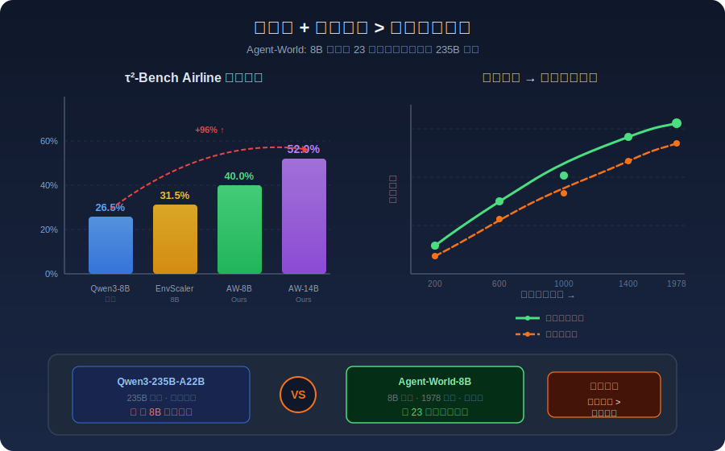
*图示：用 8B 小模型就能在多个复杂 Agent 基准上打败 235B 大模型和各种 proprietary 模型，说明环境质量和训练机制比单纯堆参数更重要。而且随着合成环境数量增加和自进化轮数增加，性能持续上升，暗示这条路线有很好的 scaling 前景。*

- **对 Agent 产品/系统的启发：** 产品侧：该框架为构建通用 Agent 产品提供了一条可落地的路径：产品团队可以从自身业务 PRD 和 MCP Server 出发，自动化地挖掘真实数据库、生成工具接口和训练任务，极大降低为特定行业定制 Agent 的环境构建成本。同时自进化竞技场机制使得产品上线后可持续发现和修补 Agent 弱点，形成数据飞轮。；系统侧：系统设计上，Agent-World 的 POMDP 建模（环境状态 + 对话状态 + 工具执行）和 agent-tool-database 三层架构为 Agent 系统提供了清晰的工程参考。其分层环境分类体系和动态竞技场评估机制可直接复用于 Agent 系统的持续集成与质量监控管线。多环境 rollout 的训练范式也提示需要构建高效的沙箱执行基础设施。；风险：主要风险包括：(1) 环境合成依赖 GPT-OSS-120B 等强模型，合成质量受限于该模型能力且成本较高；(2) 从互联网挖掘数据库可能引入噪声、过时信息甚至隐私数据；(3) 自进化循环可能导致 Agent 过度拟合诊断指标而忽视未覆盖场景；(4) 可执行奖励虽比字符串匹配更可靠，但验证脚本本身也可能有 bug，导致奖励信号不准确。

### 3. On the Reliability of Computer Use Agents
- **方向：** computer\_use
- **评分：** 相关性 95 | 价值 90 | 有趣性 88 | 创新性 75 | 开拓性 90
- **为什么入选：** 首篇系统研究Computer Use Agent可靠性的论文，将不可靠性分解为随机性、指令歧义和规划变异三大因素，并用配对统计检验在OSWorld上对GPT-5、Claude Sonnet 4.6、Kimi 2.5等前沿模型做了大规模重复执行实验，对Agent产品落地的评测标准和系统设计有直接指导意义。
- **背景：** 当前Computer Use Agent在OSWorld等基准上的单次成功率已超过人类基线，但同一任务重复执行时表现极不稳定——Pass@10约78%而Pass^10仅约36%。已有评测只关注'能否成功一次'，缺乏对重复执行可靠性的系统度量。论文将不可靠性分解为解码/环境随机性、指令歧义、规划策略变异三个因素，通过配对统计检验在任务级别量化每个因素的影响，填补了Agent可靠性评测的空白。
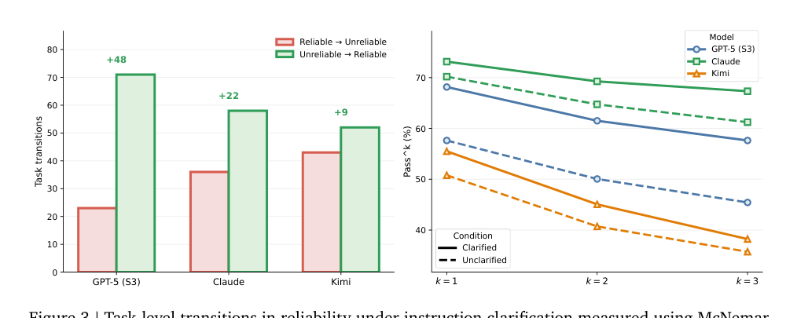
*图示：当前 provider 未启用视觉评审，回退到启发式最高分候选。*

**核心技术点：**

#### 技术点 1：可靠性三因素分解与度量框架
- 技术细节：论文将Agent执行的不可靠性分解为三个正交因素：(1)解码随机性与环境噪声、(2)任务指令歧义、(3)规划策略变异。在此基础上提出以Pass k（所有k次执行均成功的概率）为核心度量，并引入McNemar配对检验（检测任务在两个设置间从'可靠'到'不可靠'或反向的转变数量）和Wilcoxon符号秩检验（检测每任务成功次数的增量变化），实现任务级别的可靠性对比分析。
- 通俗讲解：以往我们只看Agent'能不能做成'，这篇论文追问'每次都能做成吗'。它把不稳定来源拆成三块：模型自身的随机采样、用户指令说得不够清楚、以及Agent每次选了不同的做法。然后用统计检验逐个任务比较两种设置下的成功次数变化，精确定位哪类问题最影响可靠性。
- 例子：对同一任务重复执行10次，Agent S3+GPT-5的Pass@10（至少成功一次）约78%，但Pass 10（10次全部成功）仅约36%。用McNemar检验比较'加指令澄清'前后，发现GPT-5有48个任务从不可靠变为可靠，仅少数任务退化，差异显著（p\<0.05）。

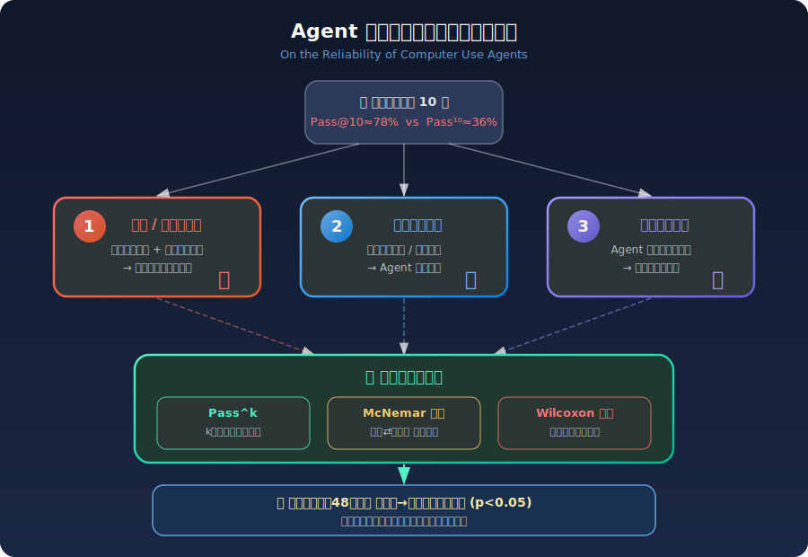
*图示：以往我们只看Agent'能不能做成'，这篇论文追问'每次都能做成吗'。它把不稳定来源拆成三块：模型自身的随机采样、用户指令说得不够清楚、以及Agent每次选了不同的做法。然后用统计检验逐个任务比较两种设置下的成功次数变化，精确定位哪类问题最影响可靠性。*

#### 技术点 2：确定性执行无法解决可靠性
- 技术细节：实验对Qwen-3VL-8B、OpenCUA、UI-TARS-1.5三个模型分别测试了temperature-0确定性解码和固定策略（预生成plan复用）两种去随机化方案。结果因模型而异：Qwen在确定性解码下反而显著退化（b-c=-20），OpenCUA和UI-TARS显著改善；但所有模型的Pass 1到Pass 3仍有明显下降，说明消除随机性不足以保证可靠性。对GPT-5和Claude引入非功能性环境扰动（如壁纸、字体等装饰变化）后，Claude可靠性显著下降（b-c=-20）。
- 通俗讲解：直觉上觉得'把随机性去掉Agent就稳定了'，但实验证明这不成立。把temperature设为0甚至给Agent固定执行计划，有的模型反而变差了。更意外的是，仅仅换个桌面壁纸这种无关变化，就能让Claude的可靠性显著下降。这说明Agent对微小环境变化非常敏感，而一定的随机性反而帮助Agent适应这些变化。
- 例子：UI-TARS-1.5基线Pass 3=15.2%，切换到temperature-0后Pass 3提升到20.5%且McNemar显著（b-c=19）。但加上固定策略后反而回落（b-c=14），增量为0。对Claude在环境中引入壁纸/主题等装饰变化，Pass 3从61.2%降至55.7%，20个任务从可靠变为不可靠，统计显著。

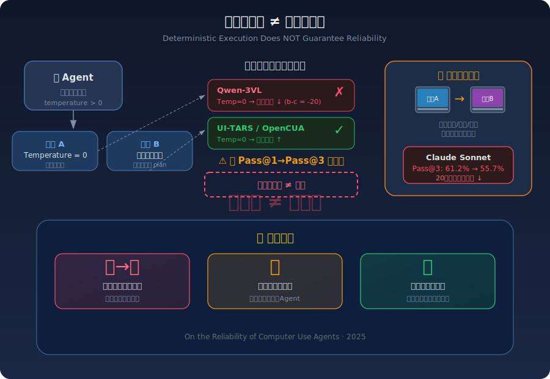
*图示：直觉上觉得'把随机性去掉Agent就稳定了'，但实验证明这不成立。把temperature设为0甚至给Agent固定执行计划，有的模型反而变差了。更意外的是，仅仅换个桌面壁纸这种无关变化，就能让Claude的可靠性显著下降。这说明Agent对微小环境变化非常敏感，而一定的随机性反而帮助Agent适应这些变化。*

#### 技术点 3：指令澄清是提升可靠性最有效手段
- 技术细节：论文设计两种澄清干预：(1)执行前澄清——利用评测脚本信息改写任务描述使成功标准更明确；(2)执行中澄清——用LLM用户模拟器在失败后根据Agent轨迹和评测信号给出针对性反馈（Retry Clarify），并与仅告知成功/失败的重试基线（Retry Binary）对比。结果显示：GPT-5在Retry Clarify下b-c=68，Δcx=0.474（最大改善）；Kimi改善更惊人，b-c=100。单次执行+事前澄清甚至可以匹配或超过5次重试（Retry Binary）的效果。
- 通俗讲解：很多时候Agent做错不是因为它能力不够，而是因为任务说得不清楚，Agent猜了一种做法但评测标准期望另一种。把指令写清楚后GPT-5多了48个任务变可靠；如果在执行过程中还能像真实用户一样给反馈纠正，效果更好——Kimi从Pass 3=35.7%飙升到63.4%。有趣的是，'说清楚要求做一次'比'不说清楚重试五次'更有效。
- 例子：原始指令：'在LibreOffice中调整表格格式'。澄清后：'在LibreOffice Calc中将A1:D10区域的边框设为黑色实线，字体设为Arial 12pt'。Retry Clarify场景下，Agent第一次用了错误的边框样式，用户模拟器反馈'边框应为实线而非虚线'，Agent第二次修正成功。GPT-5在此设置下Pass 1从57.6%提升到73.0%，Pass 3从45.4%提升到63.2%。

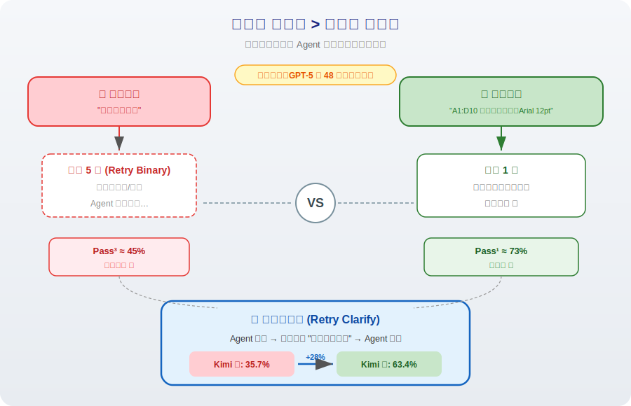
*图示：很多时候Agent做错不是因为它能力不够，而是因为任务说得不清楚，Agent猜了一种做法但评测标准期望另一种。把指令写清楚后GPT-5多了48个任务变可靠；如果在执行过程中还能像真实用户一样给反馈纠正，效果更好——Kimi从Pass 3=35.7%飙升到63.4%。有趣的是，'说清楚要求做一次'比'不说清楚重试五次'更有效。*

#### 技术点 4：迭代计划提炼可改善规划变异
- 技术细节：在已澄清指令的基础上（Iteration 0），从多次rollout中提取成功行为和失败模式生成结构化计划指导下一轮执行（Iteration 1），再用新rollout的反馈迭代更新计划（Iteration 2）。GPT-5在两轮迭代后McNemar b-c=27、Δcx=0.130，均显著。但Claude出现退化（Iteration 1时b-c=-15），原因是Claude偏好代码方案导致环境变化难被行为判断器检测，反馈不完整。
- 通俗讲解：即使指令清楚了，Agent每次还可能选不同策略，有些策略更脆弱。解决办法是让Agent先跑几次，从成功和失败的经验中提炼出一个靠谱的执行计划，之后每次都按这个计划走。GPT-5通过两轮迭代，Pass 3从57.6%升至65.1%。但这个方法对Claude不管用，因为Claude喜欢写代码执行，导致反馈系统抓不准问题在哪。
- 例子：某文件管理任务，Iteration 0的3次rollout中2次成功（用GUI拖拽）、1次失败（用终端命令但路径错误）。系统提取计划：'优先使用文件管理器GUI完成文件移动，避免终端命令'。Iteration 1的3次执行中3次全部成功，该任务从不可靠变为可靠。

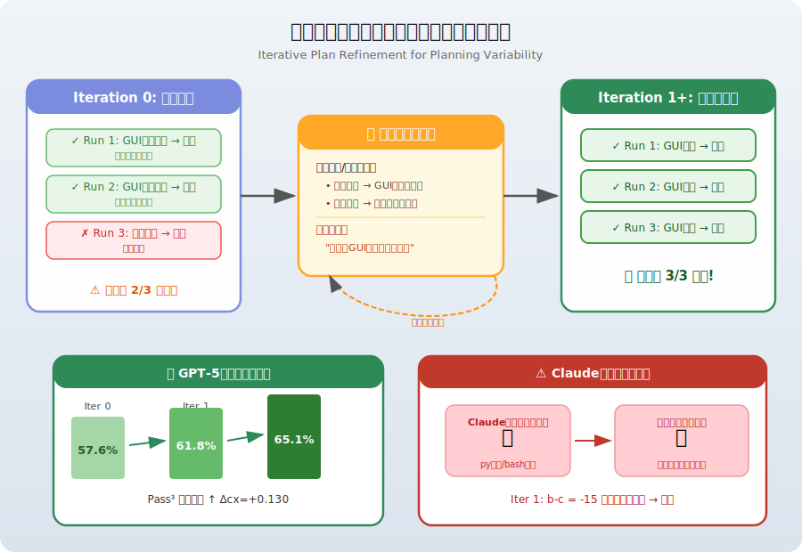
*图示：即使指令清楚了，Agent每次还可能选不同策略，有些策略更脆弱。解决办法是让Agent先跑几次，从成功和失败的经验中提炼出一个靠谱的执行计划，之后每次都按这个计划走。GPT-5通过两轮迭代，Pass 3从57.6%升至65.1%。但这个方法对Claude不管用，因为Claude喜欢写代码执行，导致反馈系统抓不准问题在哪。*

- **对 Agent 产品/系统的启发：** 产品侧：Agent产品不能只追求单次任务成功率，必须建立重复执行的可靠性评测体系。产品中应内置指令澄清机制（如让Agent在执行前向用户确认关键细节），以及执行中的用户反馈通道，这比简单的自动重试更有效。Pass^k应成为Agent产品上线的核心质量指标。；系统侧：系统设计上，应支持从历史轨迹中提取和迭代优化执行计划的能力，类似经验复用机制。同时需注意：(1)确定性解码不一定提升可靠性，需要按模型特性调优；(2)系统应对环境装饰性变化具备鲁棒性，可考虑在观察层做归一化处理；(3)不同模型对反馈的响应差异大（如代码偏好的模型需要专门的反馈策略），系统需要模型感知的反馈生成。；风险：论文揭示了一个严重风险：当前最强Agent（Pass@10约78%）的全程可靠率仅约36%，意味着在航空、医疗、金融等对可靠性要求高的场景中远未达到部署标准。环境微小变化即可导致显著退化（Claude因壁纸变化丢失20个可靠任务），这在真实多变的桌面环境中是常态。指令歧义造成的'假失败'也意味着当前基准可能低估了Agent真实能力，同时高估了其在不同用户表述下的稳健性。

## 四、候选但未完成深读的论文

当前重点论文都已完成可用分析。

## 五、总结

- 今天的论文景观传递出一个清晰信号：Agent 研究正在从'单次能不能成功'转向'反复执行是否可靠、持续进化是否安全、训练环境是否够多样'这些更接近真实部署的问题。
- 轨迹摘要作为一种中间表示，正在成为连接 Agent 搜索、精炼、评测和训练的枢纽概念，值得系统构建者认真对待。
- 安全研究的视角从外部攻击扩展到 Agent 自身的记忆、经验和工具调用链路，意味着 Agent 系统的安全边界正在随着能力边界一起扩张——这既是挑战，也是下一阶段产品化必须跨过的门槛。
