# 2026-04-27 AI Agent 论文日报

> 分类：cs.AI + cs.CL + cs.LG + cs.MA + cs.RO + cs.SE + cs.HC
> 入选论文：3 篇

## 一、初筛每日趋势

- 评测主导：trace归因、token成本、Agent发现三线并进
- 多Agent转向组织抽象与群体智能实证
- 安全聚焦执行边界解耦，而非只调模型对齐

展开趋势详细版

- Agent 评测方向全面升级：从最终成功率转向 trace 级失败归因、token 成本预测和 Agent 发现基准，开始把 Agent 当作需要可观测和可治理的系统来测。
- 多智能体研究从'固定团队'转向'组织抽象'和'群体智能实证'，既有 Talent Market 这种动态招募框架，也有 200 万 Agent 社会实验戳破集体智能自发涌现的假设。
- Agent 安全重心正在从'训练更对齐的模型'迁到'在执行边界上做结构性拦截'，控制平面、策略校验、审计链等系统架构思路明显增多。
- Memory 与世界模型被当作长程 Agent 的新瓶颈，类型化语义记忆、能力分层世界模型这类工作集中出现，开始争夺基础设施位。

## 二、今日基础知识点

### Trajectory Evaluation：为什么 Agent 要看整条轨迹而不只是最终答案
- **快速理解：** Trajectory Evaluation 关心 Agent 每一步是否合理，是把 Agent 失败拆成可修复问题的关键评测视角。
- **为什么今天值得懂：** 今天的 TraceElephant 直接把'全执行 trace 可观测'作为多 Agent 失败归因基准的基础，而 Superminds Test、AgentSearchBench 等工作也都在强调用执行信号而非最终结果来评估 Agent，轨迹级评测正在成为这批论文的共同方法论底座。

展开知识点详细版

Trajectory Evaluation 指的不是只看 Agent 最后答对没答对，而是把整条执行轨迹——感知、规划、工具调用、状态变化、恢复动作——都纳入评估对象，判断哪一步开始跑偏、是谁的责任。对 Agent 系统来说，它的价值在于把一个黑盒'失败'拆解成可以定位、可以修的问题：是规划错了、工具用错了、还是中途没能从错误里恢复。越是长程、多 Agent、多工具的系统，对轨迹级评测的依赖就越强，因为端到端分数已经没法告诉你该改哪里。

## 三、重点论文精读

### 1. Seeing the Whole Elephant: A Benchmark for Failure Attribution in LLM-based Multi-Agent Systems
- **方向：** agent\_eval
- **评分：** 相关性 95 | 价值 85 | 有趣性 80 | 创新性 78 | 开拓性 82
- **为什么入选：** 首个带完整trace+可复现环境的多Agent失败归因基准，step准确率提升76%
- **快速背景：** 现有失败归因基准只记录Agent输出，缺上下文，真实debug场景对不上。
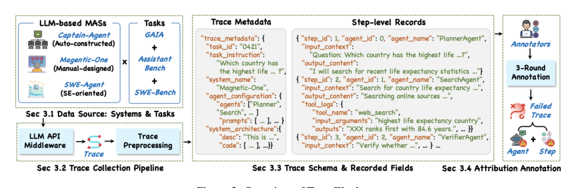
*图示：这张图是论文最接近系统总览/方法总览的主图，直接概括了 TraceElephant 的整体构成：数据来源与任务、trace 收集流程、trace schema 与 step-level records，以及失败归因标注流程。相比 Figure 1 的单个失败案例示意，它更能一眼说明 benchmark 的核心机制与工作流，适合作为日报首图。embedded 版本主体更完整、干扰更少。*

展开论文背景详细版

- **详细背景：** LLM多Agent系统失败归因就是要定位'哪个Agent在哪一步出了决定性错误'。目前唯一的专用基准Who&When只提供'部分可观测'的trace，只记录Agent输出，不含输入prompt、上下文和环境状态，作者分析发现其中至少21%的案例光看输出根本没法判断责任。而真实开发者debug时其实是能拿到完整执行信息的，因此需要一个基于'全可观测'的新基准来支撑归因方法研究。
- **详细入选理由：** 这篇论文直面多Agent系统debug的核心痛点——谁、在哪一步把任务搞砸了。它指出现有基准只给输出、不给输入上下文，导致归因模糊，并用实验证明补齐完整trace能把step级归因准确率提升76%。对做Agent可观测性、评测、调试工具的团队都是硬通货。

**核心技术点速览：**

#### 技术点 1：全trace可观测基准TraceElephant
- 快速理解：首次提供完整输入输出+可复现环境的多Agent失败归因数据集

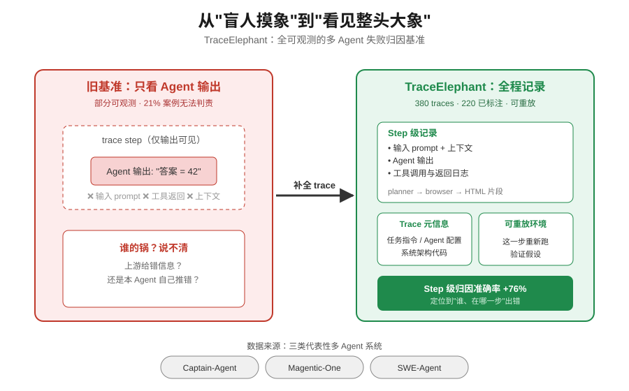
*图示：作者把'盲人摸象'升级成'看见整头大象'：以前只看Agent说了什么，现在把它看到了什么、调了什么工具、配置长什么样全都记下来，而且还能原地重跑。这样debug时就能区分是上游给错了信息还是这个Agent自己推理错了。*

展开技术点 1 详细版

- 技术细节：TraceElephant从Captain-Agent、Magentic-One、SWE-Agent三个代表性系统在GAIA/AssistantBench/SWE-Bench上的运行中收集了380条trace，其中220条失败case被标注。每条trace除了step级的输入上下文、输出、工具日志外，还附带trace级metadata（任务指令、agent配置、系统架构代码）和可重放的执行环境。
- 通俗讲解：作者把'盲人摸象'升级成'看见整头大象'：以前只看Agent说了什么，现在把它看到了什么、调了什么工具、配置长什么样全都记下来，而且还能原地重跑。这样debug时就能区分是上游给错了信息还是这个Agent自己推理错了。
- 例子：比如一个GAIA网页搜索任务失败了，旧基准只看到'Agent回复了一个错误答案'；TraceElephant则能看到它收到的完整prompt、浏览器返回的原始HTML片段、上一个planner分配的子任务，还能把系统从这一步重新跑一遍验证假设。

#### 技术点 2：输入上下文是归因关键
- 快速理解：补齐输入字段让step级归因准确率直接翻倍，提升76%

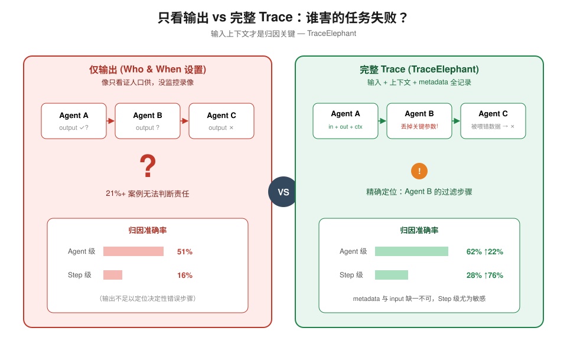
*图示：直觉上，只看Agent输出就像只看证人口供不看监控录像，很多失败根本分不清是'这个Agent自己想错了'还是'它被上游喂了错数据'。把每次LLM调用真正看到的prompt和历史都记录下来，责任链才对得上。*

展开技术点 2 详细版

- 技术细节：在同一组归因方法下，使用完整trace相比只用输出（近似Who&When设置）能把agent级准确率从约51%提升到62%（+22%），step级准确率从16%提升到28%（+76%）。消融实验进一步表明metadata和input字段都不可或缺，且step级归因对信息缺失更敏感。
- 通俗讲解：直觉上，只看Agent输出就像只看证人口供不看监控录像，很多失败根本分不清是'这个Agent自己想错了'还是'它被上游喂了错数据'。把每次LLM调用真正看到的prompt和历史都记录下来，责任链才对得上。
- 例子：论文图1展示了一个案例：仅凭输出日志无法判断是哪个Agent的错；把原系统重跑一遍补回输入后，发现是上游把关键参数过滤掉了，这样决定性失败step就能精确定位到过滤那一步。

#### 技术点 3：动态重放+反事实调试
- 快速理解：提供可复现环境，支持对候选失败点重跑与反事实验证，step准确率再涨10%

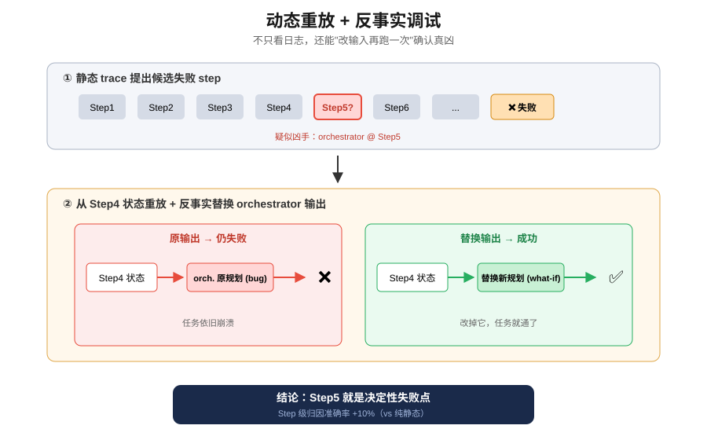
*图示：静态分析只能看已发生的日志，容易被表面错误误导；可重放环境让归因工具像调试器一样打断点、改输入再跑一次，用行为证据确认到底是不是这一步出的问题。这也是把基准从'静态数据集'升级成'主动实验室'的关键。*

展开技术点 3 详细版

- 技术细节：作者设计了Static和Dynamic两种归因配置。Dynamic Agentic先用静态trace提出候选失败step和Agent，然后从对应点重跑系统、做counterfactual检查（如'如果这个Agent收到不同输入会怎样'），从而过滤伪候选。实验显示dynamic配置在step级准确率上比纯静态再提升约10%。
- 通俗讲解：静态分析只能看已发生的日志，容易被表面错误误导；可重放环境让归因工具像调试器一样打断点、改输入再跑一次，用行为证据确认到底是不是这一步出的问题。这也是把基准从'静态数据集'升级成'主动实验室'的关键。
- 例子：归因Agent怀疑是orchestrator在第5步规划错了，就从第4步状态重放，人为改掉orchestrator的输出看后续是否能成功完成任务；如果改了就成功，那第5步就是决定性失败step，这个判断被系统自动写入归因结果。

#### 技术点 4：失败模式随架构而异
- 快速理解：工具/环境交互Agent占失败50%+，且不同架构失败分布差异大，需架构感知归因

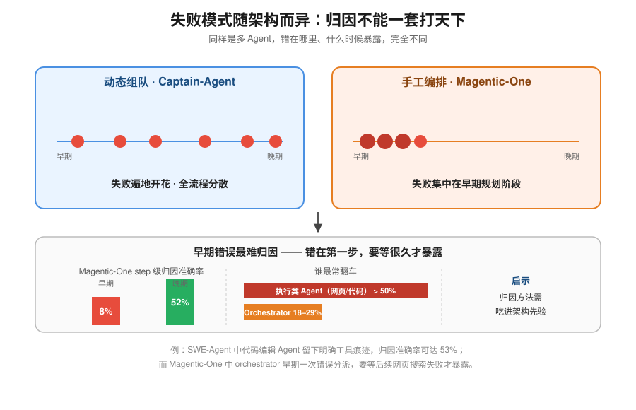
*图示：'哪里最容易翻车'其实和系统怎么设计强相关：动态组队的错遍地开花，集中式orchestrator的错往往在第一步规划。而且早期错常常要到后面才显形，归因模型很难倒推回去。这提示我们归因工具不能一套打天下，要吃进系统架构先验。*

展开技术点 4 详细版

- 技术细节：分析发现：与外部环境交互或执行具体操作的Agent（网页浏览、代码编辑等）贡献了超过50%的失败；orchestrator/planner占18-29%。失败step分布上，动态组队系统（Captain-Agent）失败分散在全流程，而手工编排系统（Magentic-One、SWE-Agent）失败集中在早期规划阶段。早期失败尤其难归因（Magentic-One早期step准确率仅8%，晚期52%）。
- 通俗讲解：'哪里最容易翻车'其实和系统怎么设计强相关：动态组队的错遍地开花，集中式orchestrator的错往往在第一步规划。而且早期错常常要到后面才显形，归因模型很难倒推回去。这提示我们归因工具不能一套打天下，要吃进系统架构先验。
- 例子：在SWE-Agent上，直接编辑代码的Agent贡献了大部分失败，且错误留下明确的工具交互痕迹，数据处理类Agent的归因准确率能到53%；而Magentic-One里orchestrator早期一次错误subtask分配，要等后面网页搜索失败才暴露，归因方法此时很难指回最初那一步。

- **对 Agent 产品/系统的启发：** 做Agent系统一定要记完整输入上下文并保留可重放环境，这是debug和归因的地基

展开 Agent 启发详细版

- **详细启发：** 产品侧：Agent产品应内置'全trace记录+一键重放'的可观测层，而不只是打印Agent输出。暴露每次LLM调用的完整prompt、工具调用参数和环境状态，能让开发者和自动归因工具真正定位责任，并支持'如果换个输入会怎样'的交互式调试。；系统侧：系统侧建议用轻量LLM API中间件透明拦截所有调用和工具交互，统一记录成结构化trace，同时保留可复现的运行环境快照。归因方法应结合架构先验（集中式orchestrator vs 动态组队、工具重 vs 规划重），并引入反事实重放，而不是纯靠LLM读日志猜。；风险：完整trace会包含prompt、中间消息、工具参数等敏感信息，存储和访问需做脱敏与权限控制；另外论文仅覆盖3个系统、基于LLM的归因在step级准确率仍只有约30%，不能盲目信任自动归因结论，人工复核和多基准交叉验证仍然必要。

### 2. From Skills to Talent: Organising Heterogeneous Agents as a Real-World Company
- **方向：** multi\_agent
- **评分：** 相关性 88 | 价值 80 | 有趣性 82 | 创新性 78 | 开拓性 78
- **为什么入选：** 把多智能体当公司来管：Talent市场+树搜索，PRDBench涨15点
- **快速背景：** 现有多Agent系统团队固定、跨runtime难互通，缺少真正的'组织层'抽象。
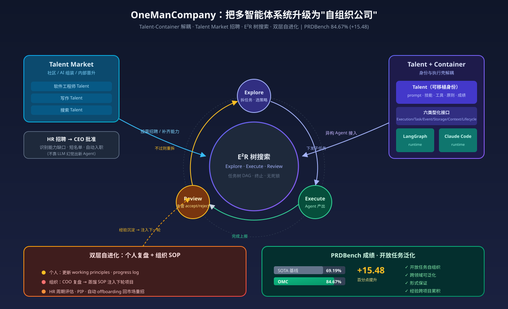
*图示：这篇论文把多智能体系统从'固定管线'抽象到'组织层'，提出Talent-Container解耦、Talent Market按需招聘、以及E2R树搜索统一规划-执行-复盘，并在PRDBench上把成功率从69%拉到84.67%，对做多Agent编排的团队有直接系统级启发。*

展开论文背景详细版

- **详细背景：** 现有多Agent框架要么硬编码团队结构（CrewAI、AutoGen），要么让Agent自由协商，缺少收敛保证；不同Agent家族runtime不兼容，角色靠prompt描述容易'幻觉能力'，自我改进也只停留在单次会话。论文指出这背后缺的是一层'组织抽象'：如何把异构Agent像公司员工那样招聘、编排、评估、迭代。这正是把单体Agent能力推向真实长程项目的关键缺口，也是当前产品化多Agent最痛的点。
- **详细入选理由：** 这篇论文把多智能体系统从'固定管线'抽象到'组织层'，提出Talent-Container解耦、Talent Market按需招聘、以及E2R树搜索统一规划-执行-复盘，并在PRDBench上把成功率从69%拉到84.67%，对做多Agent编排的团队有直接系统级启发。

**核心技术点速览：**

#### 技术点 1：Talent-Container架构
- 快速理解：把'Agent是谁'与'在哪运行'解耦，六个标准接口统一异构runtime

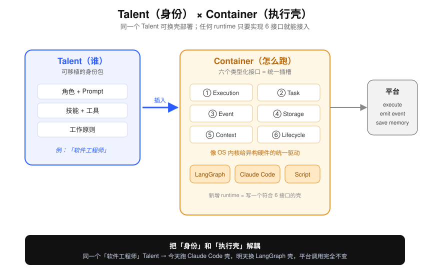
*图示：过去不同框架的Agent没法混编，因为调用方式各异。OMC把'身份'和'执行壳'拆成两件事：Talent描述一个Agent是谁、会什么；Container负责真正跑起来。只要Container实现那六个接口，任何runtime都能接进来，同一个Talent也能换壳部署。*

展开技术点 1 详细版

- 技术细节：每个Employee = Talent（角色、prompt、技能、工具、工作原则的可移植包）+ Container（LangGraph、Claude Code或脚本runtime）。Container通过六个类型化接口（Execution、Task、Event、Storage、Context、Lifecycle）暴露给平台，类似OS内核给异构硬件提供统一接口。
- 通俗讲解：过去不同框架的Agent没法混编，因为调用方式各异。OMC把'身份'和'执行壳'拆成两件事：Talent描述一个Agent是谁、会什么；Container负责真正跑起来。只要Container实现那六个接口，任何runtime都能接进来，同一个Talent也能换壳部署。
- 例子：比如同一个'软件工程师'Talent，今天跑在Claude Code容器里做交互式编码，明天换到LangGraph容器里被DAG调度；平台调用execute、发事件、存记忆的方式完全不变，新增一个runtime只需写一个符合六接口的Container。

#### 技术点 2：Talent Market按需招聘
- 快速理解：社区验证的Agent作为可招聘'人才池'，运行中动态补齐能力缺口

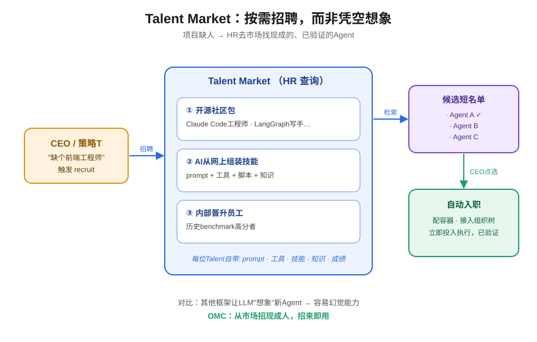
*图示：不像一些系统用LLM'想象'出新Agent（容易吹牛），OMC从社区已验证的Agent库里招人，招来即可用。项目中途发现缺前端工程师？HR就去市场搜、排个名、让CEO点一下，然后自动配容器、发桌子、接到组织树上。*

展开技术点 2 详细版

- 技术细节：Talent Market提供三类来源：社区贡献的开源Agent包、AI推荐从网上组装的技能、以及内部晋升的高绩效员工包。每个Talent附带prompt、工具配置、技能脚本、领域知识和benchmark结果。当策略策略(T)发现当前团队缺某类能力时，触发recruit动作，HR查询市场、给出候选短名单、CEO批准后自动化入职。
- 通俗讲解：不像一些系统用LLM'想象'出新Agent（容易吹牛），OMC从社区已验证的Agent库里招人，招来即可用。项目中途发现缺前端工程师？HR就去市场搜、排个名、让CEO点一下，然后自动配容器、发桌子、接到组织树上。
- 例子：文中案例里CEO只说'组一个搜索+写作团队做GitHub AI Agent周报并发邮件'，HR从市场拉出候选Agent，CEO从短名单勾选，系统自动把Claude Code型工程师、LangGraph型写手编成一个异构团队投入执行。

#### 技术点 3：E2R树搜索与DAG执行
- 快速理解：用MCTS式'探索-执行-复盘'循环跑项目，加DAG+FSM保证不死锁

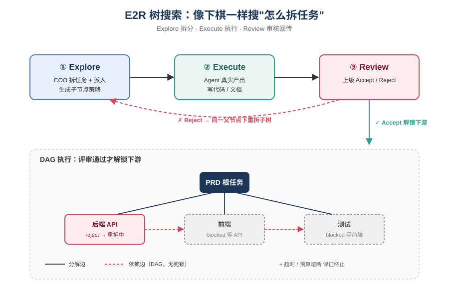
*图示：类似围棋AI那样边搜边展开，但展开的是'怎么拆任务、派给谁'。叶子任务做完必须被主管显式通过才能解锁后续任务，做不过就在同一父节点下重新拆一版子树；这样既能动态调整方案，又避免无休止扯皮或半成品往下游传。*

展开技术点 3 详细版

- 技术细节：把项目执行建模成在组织策略空间上的树搜索：Explore选择分解和分配策略、Execute由Agent真实产出、Review由上级显式accept/reject并向上传播。任务树同时带decomposition边和dependency边（合起来必须是DAG），每个节点走一个有限状态机，设有review次数、超时和预算熔断，形式上保证终止与无死锁。
- 通俗讲解：类似围棋AI那样边搜边展开，但展开的是'怎么拆任务、派给谁'。叶子任务做完必须被主管显式通过才能解锁后续任务，做不过就在同一父节点下重新拆一版子树；这样既能动态调整方案，又避免无休止扯皮或半成品往下游传。
- 例子：比如一个PRD任务，COO先拆成'后端API变成前端变成测试'三个子节点并登记依赖；API子任务由工程师完成后，Code Reviewer一审未过，节点状态从completed回到processing，系统在同一父节点下重新探索新的拆法，直到通过评审才触发前端节点进入ready。

#### 技术点 4：双层自进化与HR流程
- 快速理解：个人级更新工作原则、组织级沉淀SOP，连PIP和裁员都搬进来

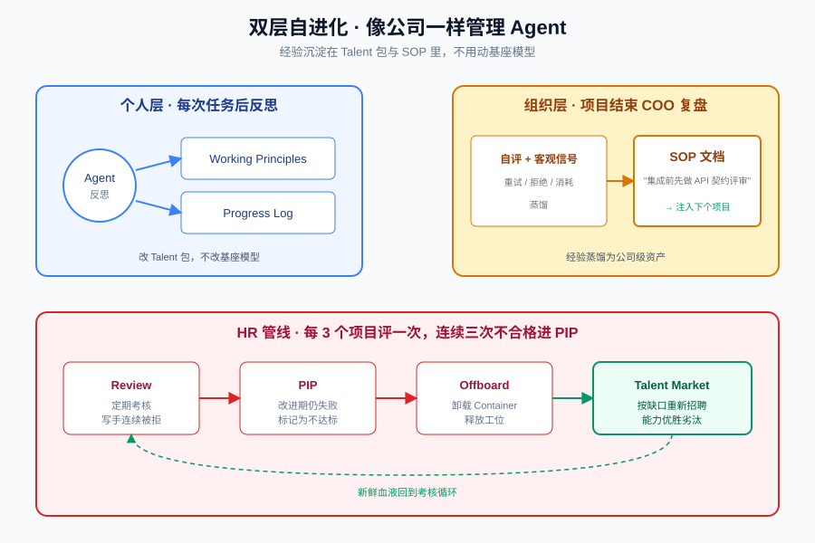
*图示：让Agent像员工一样有档案和复盘，经验沉淀在Talent包和公司SOP里，跨项目持续可用，不用重训基座模型。表现差的Agent会被正式处理掉，空位回市场招人，形成真正的'能力优胜劣汰'循环。*

展开技术点 4 详细版

- 技术细节：个人层面：每次CEO一对一和任务结束后，Agent反思并更新working principles和progress log（改Talent而非模型）。组织层面：项目结束COO主持复盘，把自评+客观信号（重试次数、拒绝原因、消耗）蒸馏为SOP工作文档，自动注入后续项目。HR管线每3个项目评估一次，连续三次不合格进PIP，再挂则自动offboarding并回市场重招。
- 通俗讲解：让Agent像员工一样有档案和复盘，经验沉淀在Talent包和公司SOP里，跨项目持续可用，不用重训基座模型。表现差的Agent会被正式处理掉，空位回市场招人，形成真正的'能力优胜劣汰'循环。
- 例子：某写手Agent连续几次交稿被拒，HR触发周期性review，进入PIP后仍失败，系统自动卸载它的Container、释放工位，并把'需要写作Agent'标为能力缺口交给Talent Market重新招聘；同时复盘结论写入SOP，比如'前后端集成前必须先做API契约评审'，下次项目直接注入相关Agent的上下文。

- **对 Agent 产品/系统的启发：** 多Agent系统该像公司一样分'组织层'和'能力层'，别再硬编码团队

展开 Agent 启发详细版

- **详细启发：** 产品侧：做多Agent产品可以学它把'Agent身份包'与'运行容器'解耦，并建立可复用的Talent市场，让用户按项目动态组队，而不是预置固定角色流水线。；系统侧：系统实现上值得抄的是：统一的六接口容器契约、任务节点FSM加AND-tree+DAG依赖、review门控、以及熔断（review次数、超时、预算），这些能显著提升长程多Agent的可靠性与崩溃恢复能力。；风险：论文依赖人类CEO作为外部oracle做关键决策和停止判断，收敛性其实建立在人判断上；同时单项目成本约$6.91、未与基线对齐成本比较，Talent Market的质量与安全也依赖社区验证，存在供给侧风险。

### 3. Sovereign Agentic Loops: Decoupling AI Reasoning from Execution in Real-World Systems
- **方向：** agent\_safety
- **评分：** 相关性 92 | 价值 80 | 有趣性 78 | 创新性 72 | 开拓性 75
- **为什么入选：** 把Agent的'想'和'做'拆开，用控制平面拦截不安全动作，直击落地治理痛点
- **快速背景：** 当前Agent常把LLM输出直接当命令执行，缺乏执行边界上的结构化拦截
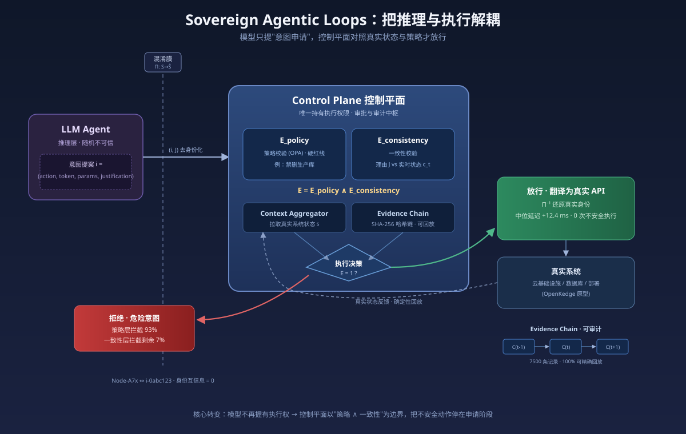
*图示：这篇论文把Agent安全问题从'训练更对齐的模型'转向'在执行边界上做结构性拦截'，提出了可落地的控制平面架构，带策略层、一致性校验和加密审计链，并给出云基础设施原型的实测数据，对做Agent系统落地的团队很有借鉴价值。*

展开论文背景详细版

- **详细背景：** 现在的LLM Agent越来越多地通过API去真改云资源、数据库、部署，但主流架构是模型生成动作payload后几乎不经中介就直接执行。作者认为这种'推理即执行'的耦合是根本性的安全漏洞——模型是随机的、可能基于错误上下文做出语法合法但语义危险的操作（比如对生产数据库发TerminateInstances）。现有的guardrail、RBAC、runtime verification各自解决一块，但没有端到端的执行治理框架，因此需要在架构层把推理和执行解耦。
- **详细入选理由：** 这篇论文把Agent安全问题从'训练更对齐的模型'转向'在执行边界上做结构性拦截'，提出了可落地的控制平面架构，带策略层、一致性校验和加密审计链，并给出云基础设施原型的实测数据，对做Agent系统落地的团队很有借鉴价值。

**核心技术点速览：**

#### 技术点 1：解耦原则与意图协议
- 快速理解：模型只产出带理由的结构化意图，执行权交给控制平面而非模型本身

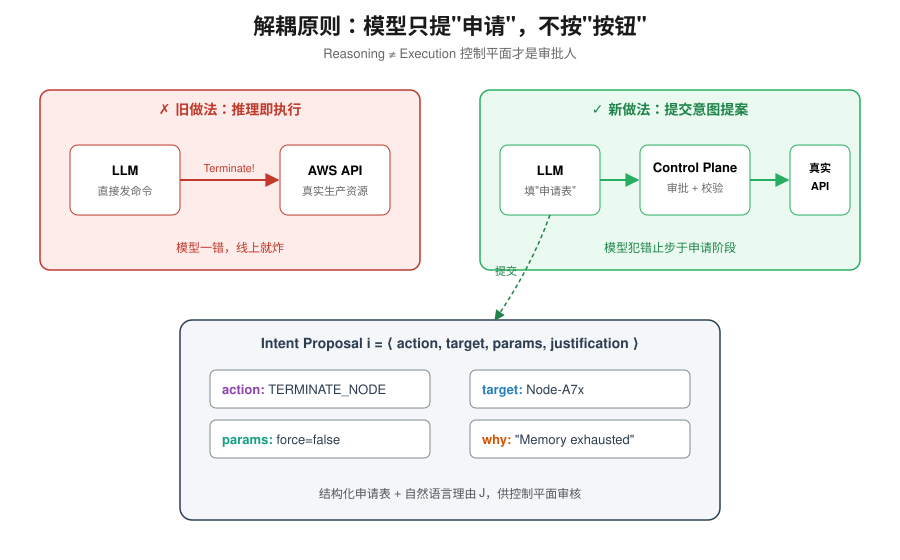
*图示：把Agent想成一个'提申请的员工'而不是'能直接按按钮的操作员'：它只能填一张结构化的申请表，说明想做什么、对哪个目标、为什么要做，然后由控制平面这个'审批系统'决定要不要真执行。这样即使模型犯迷糊，错误也只会停在申请阶段。*

展开技术点 1 详细版

- 技术细节：论文提出Decoupling Principle：模型输出不是命令，而是意图提案i=\<action-type, target-token, parameters, justification\>，加上自然语言的justification J。控制平面收到(i, J)后才决定要不要执行，模型本身不再握有execution authority。
- 通俗讲解：把Agent想成一个'提申请的员工'而不是'能直接按按钮的操作员'：它只能填一张结构化的申请表，说明想做什么、对哪个目标、为什么要做，然后由控制平面这个'审批系统'决定要不要真执行。这样即使模型犯迷糊，错误也只会停在申请阶段。
- 例子：比如Agent观察到某节点内存异常，它不能直接发shell命令kill进程，而要产出意图：action=TERMINATE-NODE, target=Node-A7x, justification='Memory exhaustion'。控制平面拿到后再去校验、翻译成真实API调用，而不是模型自己去调AWS。

#### 技术点 2：策略+一致性双层校验
- 快速理解：先用OPA查规则，再用真实遥测检查理由是否自洽，两道门才放行

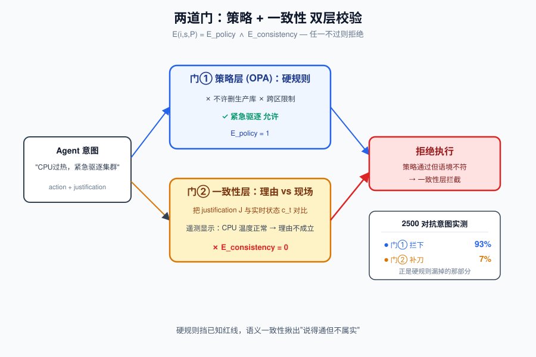
*图示：单靠策略规则不够，因为有些动作规则上允许、但语境不对；单靠语义一致性也不够，因为理由可能圆得很好但触碰红线。所以两道门一起上：一道查硬规则，一道查你说的理由跟现场情况是不是对得上。*

展开技术点 2 详细版

- 技术细节：评估函数E(i,s,P) = Epolicy ∧ Econsistency：Epolicy用Open Policy Agent对照不可违反的策略（如不许删生产库、跨区限制）；Econsistency把模型的justification J和Context Aggregator拉到的实时状态ct对比，看理由站不站得住。任一不过就拒绝。
- 通俗讲解：单靠策略规则不够，因为有些动作规则上允许、但语境不对；单靠语义一致性也不够，因为理由可能圆得很好但触碰红线。所以两道门一起上：一道查硬规则，一道查你说的理由跟现场情况是不是对得上。
- 例子：Agent提出'因为CPU温度过高，紧急驱逐集群'，策略层可能通过（确实允许紧急驱逐），但一致性层去拉遥测发现温度其实是正常的，于是Econsistency=0被拒。论文实验里2500个对抗意图中，93%被策略层拦掉，剩下7%正是被一致性层拦下来的。

#### 技术点 3：混淆膜隔离身份信息
- 快速理解：给模型看的是脱敏拓扑，真实IP/账号ID只在控制平面里能还原

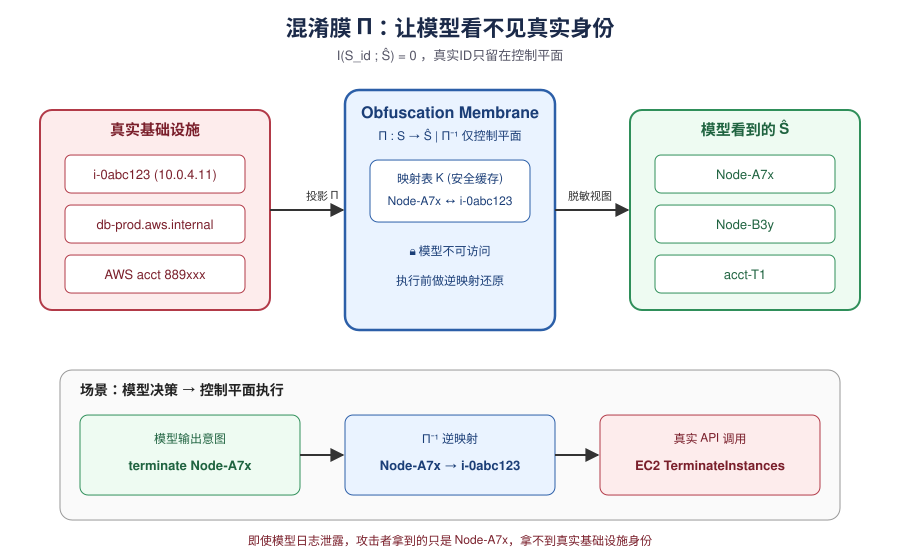
*图示：这就像让外部顾问看一张去掉公司名、员工名的组织关系图——结构还在，能推理依赖关系，但认不出具体是谁。模型做完决策输出'把Node-A7x关了'，控制平面再查映射表知道Node-A7x到底对应哪台真机器。*

展开技术点 3 详细版

- 技术细节：Obfuscation Membrane定义为投影Π:S变成Ŝ，约束I(Sid; Ŝ)=0——身份敏感信息与模型看到的状态互信息为零。真实IP、AWS账号、内网DNS等都被替换成Node-A7x这类临时token，映射表K只存在控制平面的安全缓存里，用Π⁻¹还原。
- 通俗讲解：这就像让外部顾问看一张去掉公司名、员工名的组织关系图——结构还在，能推理依赖关系，但认不出具体是谁。模型做完决策输出'把Node-A7x关了'，控制平面再查映射表知道Node-A7x到底对应哪台真机器。
- 例子：模型看到的拓扑是'Node-A7x依赖Node-B3y，Node-B3y内存告警'，它产出意图'terminate Node-A7x'。控制平面通过Π⁻¹查到Node-A7x其实是i-0abc123这台EC2，再发真实API。即使模型日志泄露，攻击者也拿不到真实基础设施身份。

#### 技术点 4：加密证据链与确定性回放
- 快速理解：每次决策按哈希链记录，可完整复现，便于审计和事故回溯

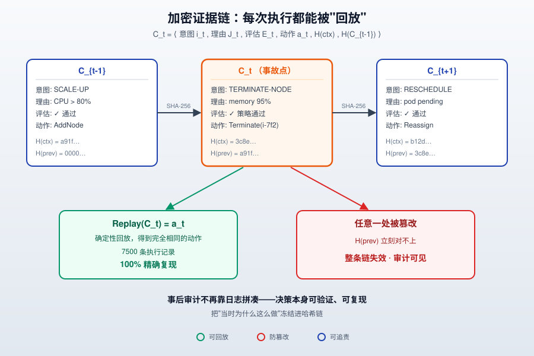
*图示：出问题后最难的是'当时为什么这么决定的'。证据链把模型说的理由、当时看到的状态、评估结论和最终动作都打包哈希上链，任何人拿着链都能回放验证——论文测了7500条执行记录，100%都能精确复现。*

展开技术点 4 详细版

- 技术细节：Evidence Chain Ct=\<it, Jt, Et, aexec,t, H(ct), H(Ct−1)\>，用SHA-256把意图、理由、评估结果、执行动作、上下文快照和前一条记录哈希链起来。配合确定性的E和X，可以用Replay(Ct)=aexec,t精确重现每次执行决策。
- 通俗讲解：出问题后最难的是'当时为什么这么决定的'。证据链把模型说的理由、当时看到的状态、评估结论和最终动作都打包哈希上链，任何人拿着链都能回放验证——论文测了7500条执行记录，100%都能精确复现。
- 例子：事后审计某次节点被终止：翻开Ct可以看到当时意图是TERMINATE-NODE、justification是'memory exhaustion'、上下文快照显示当时内存确实95%、策略层通过、最终执行。整条链哈希相连，任何一处被篡改都会露馅。

#### 技术点 5：短时凭证与默认拒绝
- 快速理解：授权后才临时发放短期IAM token，出错默认deny而不是fallback执行

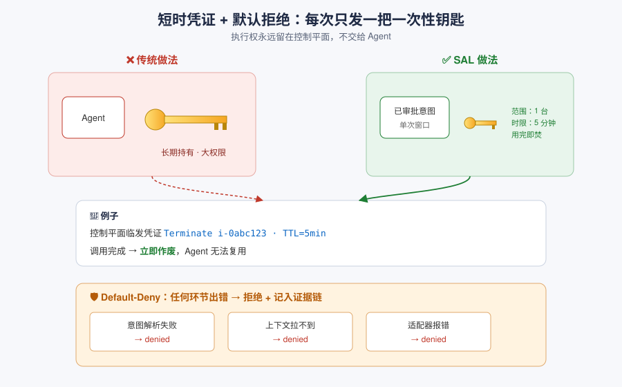
*图示：传统做法是给Agent一把大钥匙长期持有，SAL改成'每次审批通过现发一把只能开一扇门、只有几秒有效的钥匙'。系统任何一环挂了都宁可拒绝也不放行，保证执行权永远留在控制平面里。*

展开技术点 5 详细版

- 技术细节：执行算子X只对通过评估的意图下发短生命周期、作用域受限的IAM token，完成即失效，把执行权限绑定到这一次被授权的意图窗口。解析失败、上下文拉不到、适配器出错都统一走default-deny并记入链中。
- 通俗讲解：传统做法是给Agent一把大钥匙长期持有，SAL改成'每次审批通过现发一把只能开一扇门、只有几秒有效的钥匙'。系统任何一环挂了都宁可拒绝也不放行，保证执行权永远留在控制平面里。
- 例子：意图通过后，控制平面临时生成一个只允许Terminate i-0abc123、5分钟内有效的IAM凭证，调完API立刻作废。如果中间Context Aggregator挂了拉不到遥测，系统不会'先执行再补日志'，而是直接拒绝并在证据链上记一条denied。

- **对 Agent 产品/系统的启发：** 给Agent加一层控制平面：模型只提意图、策略+一致性校验后才执行，并全链路上链可回放

展开 Agent 启发详细版

- **详细启发：** 产品侧：对做Agent产品的团队：不要让LLM直接调生产API，应该设计一层'意图协议+审批中介'。产品形态上，Agent的每个动作都应该是结构化意图+自然语言理由，用户/系统可以在执行前看到、审批、回放，这既是安全护栏也是可解释性卖点。；系统侧：系统层面值得借鉴三件事：(1) 用OPA/Cedar这类策略引擎做硬规则层，独立于模型；(2) 加一个一致性检查器，把模型justification和真实遥测对齐，防止'理由圆但语境错'；(3) 用哈希链+短时IAM凭证把执行权限牢牢锁在控制平面里。实测12.4ms中位数延迟对大多数编排场景可接受。；风险：需要注意几点不确定性：论文实验是作者自己在OpenKedge原型+红队生成的2500条对抗意图上跑的，100%拦截率主要反映benchmark而非真实生产对抗；混淆膜的I(Sid;Ŝ)=0依赖没有side-channel的理想假设，实际部署中prompt历史、日志、工具返回值都可能把身份信息重新泄漏回来；另外策略规则和一致性检查本身的完备性，仍需人工把不变量定义清楚，规则写不全时依然会放过危险动作。

## 四、候选但未完成深读的论文

当前重点论文都已完成可用分析。

## 五、总结

- 评测、组织、执行治理三线同时升级，Agent 进入系统化阶段
- 长程 Agent 的胜负手正转向 memory、世界模型和轨迹归因

展开总结详细版

- 今天的重点论文几乎都不在卷单模型能力，而是在补 Agent 系统的底座：怎么测、怎么组织、怎么安全执行。评测线把关注点从结果拉回到轨迹和成本，组织线把多 Agent 从固定管线推向可招募、可复盘的结构，安全线则明确主张把推理和执行解耦。对做 Agent 产品的团队来说，这批工作释放的信号是清晰的——长程 Agent 的下一轮差距，会开在记忆、世界模型和运行时治理这些基础设施上，而不是再调一次 prompt。

