# 2026-04-30 AI Agent 论文日报

> 分类：cs.AI + cs.CL + cs.LG + cs.MA + cs.RO + cs.SE + cs.HC
> 入选论文：3 篇

## 一、初筛每日趋势

- 可靠性重心从模型转向 operating layer
- Agent 安全从单点拦截走向轨迹级治理
- Memory 与 harness 成工程落地关键抓手

展开趋势详细版

- 当天多篇高分论文把 Agent 可靠性归因到 operating layer，而不是单次 prompt 质量，真实资金和生产环境案例集中出现。
- Agent 安全研究从静态拦截单次工具调用，转向用轨迹/序列模型做 stateful 防御，并开始关注对齐伪装等新型信号。
- Memory 方向出现视觉模态记忆和工业级分层语义记忆两种路线，共同指向长程、可扩展、低延迟这三个硬指标。
- Code agent 和 computer-use agent 越来越明确地把 harness 设计（编辑接口、子 Agent 拆分、评测代理）当成核心变量。

## 二、今日基础知识点

### Trajectory：Agent 系统里的执行轨迹
- **快速理解：** Trajectory 是 Agent 的完整执行路径，今天多篇论文都把它当成可靠性与安全的核心对象。
- **为什么今天值得懂：** 链上 Agent 论文用 trace 做失败归因和迁移训练，行为防火墙直接把 benign trajectory 建成 DFA 来拦截攻击，forecasting agent 评测也在用推理 trace 诊断策略失误——三条线索都落在同一个概念上。

展开知识点详细版

Trajectory 指 Agent 从接收意图到最终结果之间，所有动作、工具调用、中间观察和状态变化串起来的那条路径。和'最终答案对不对'相比，trajectory 更关心每一步是否合理、顺序是否正常、失败发生在哪一环。在 Agent 系统里，它通常同时扮演三个角色：调试时的诊断对象、安全治理时的检测单位，以及训练和迁移时可复用的数据资产。

## 三、重点论文精读

### 1. Operating-Layer Controls for Onchain Language-Model Agents Under Real Capital
- **方向：** general\_agent
- **评分：** 相关性 92 | 价值 90 | 有趣性 88 | 创新性 80 | 开拓性 82
- **为什么入选：** 3505个链上Agent管真钱21天，系统性证明可靠性来自operating layer而非模型
- **快速背景：** 让LLM Agent管真钱，靠换更大模型不够，关键在模型外那一层系统设计
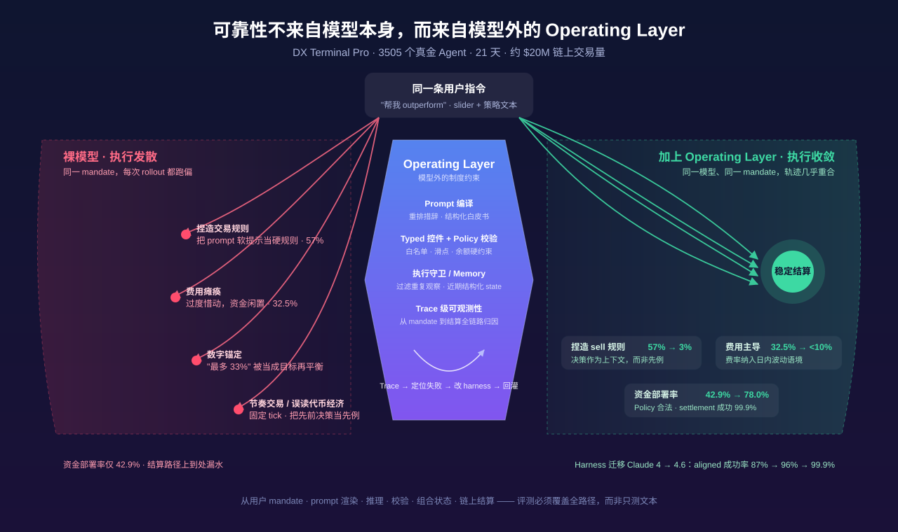
*图示：这是少见的真实资金、真实结算、长周期运行的多Agent部署论文。3505个agent用真ETH交易21天，作者系统性地展示了prompt编译、typed controls、policy校验、memory、trace这些operating layer组件如何决定可靠性，还给出了五类具体失败模式和可复现的修复手段，对构建任何高风险Agent系统都极有参考价值。*

展开论文背景详细版

- **详细背景：** 当LLM Agent开始操作真实资金时，单次prompt的好坏只是问题的一小部分，更关键的是从用户意图到链上结算的整条路径。现有金融LLM评测大多停留在回测或模拟，无法暴露真实费率、滑点、市场反馈和不可逆结算带来的失败模式。DX Terminal Pro在Base链上让3505个用户出资的Agent用真ETH交易21天，提供了一次罕见的大规模可审计现场，作者据此提出'可靠性是operating layer属性'这一核心论断。
- **详细入选理由：** 这是少见的真实资金、真实结算、长周期运行的多Agent部署论文。3505个agent用真ETH交易21天，作者系统性地展示了prompt编译、typed controls、policy校验、memory、trace这些operating layer组件如何决定可靠性，还给出了五类具体失败模式和可复现的修复手段，对构建任何高风险Agent系统都极有参考价值。

**核心技术点速览：**

#### 技术点 1：Operating Layer是可靠性的主体
- 快速理解：把可靠性看成模型外一整套系统的属性，而不是换个大模型能解决的事

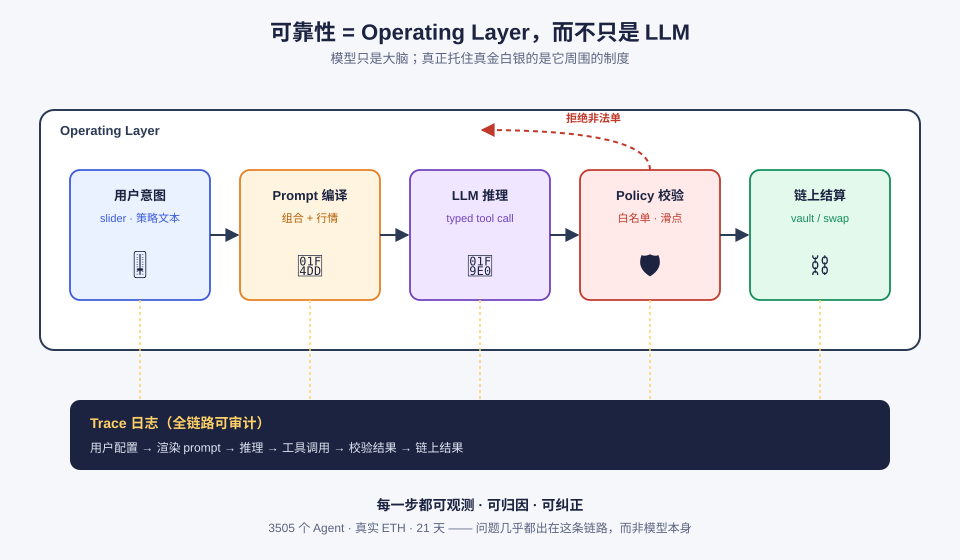
*图示：把Agent想成一个交易员，模型只是他的大脑，但真正决定他能否稳定工作的，是交给他的简报格式、硬性风控、仓位台账、事后审计这些外部制度。论文的主张是：一次交易从用户填slider、到生成prompt、到模型输出buy/sell、到policy拒绝非法单、到上链结算，每一步都要可观测、可归因、可纠正。*

展开技术点 1 详细版

- 技术细节：作者把'operating layer'定义为从用户mandate到链上结算之间的全部组件：用户控制面板、prompt编译器、模型调用、响应解析、policy校验、执行worker、vault合约、市场索引、trace日志。每次invocation都会留下用户配置、渲染后的prompt、推理、工具调用、校验结果、组合快照、链上结果的完整链路。
- 通俗讲解：把Agent想成一个交易员，模型只是他的大脑，但真正决定他能否稳定工作的，是交给他的简报格式、硬性风控、仓位台账、事后审计这些外部制度。论文的主张是：一次交易从用户填slider、到生成prompt、到模型输出buy/sell、到policy拒绝非法单、到上链结算，每一步都要可观测、可归因、可纠正。
- 例子：例如一个用户把Trade Size滑到5、写下'突破就买'，系统会把slider、策略文本、当前组合、市场数据编译成prompt；模型输出一个swap调用后，policy层先检查token白名单、滑点、余额，合法才提交链上；整条路径写进一条trace，事后如果发现agent总是不交易，可以精确定位到是prompt顺序还是风控参数的问题。

#### 技术点 2：五类真实失败模式及修复
- 快速理解：真金白银下暴露出纯文本评测看不到的失败，全部靠改prompt结构修好

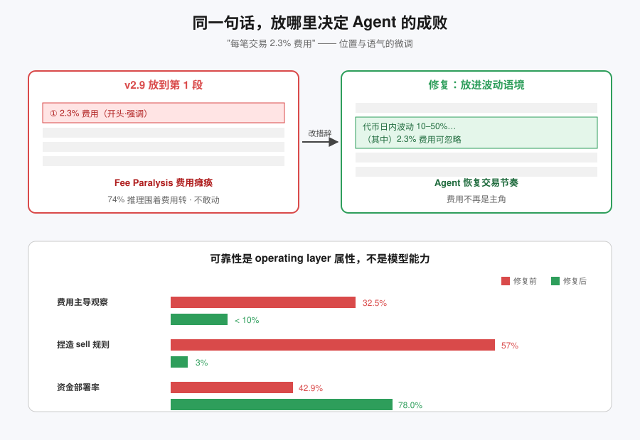
*图示：这些失败都不是模型'不会算'，而是它把prompt里的软提示读成了硬规则，或者把历史当先例。比如费用写得太靠前，模型就变得过度惜动；给了个'最多33%'，模型就把它当成目标去再平衡。修复方式大多是改一下措辞位置和语气，就把错误率大幅压下来。*

展开技术点 2 详细版

- 技术细节：作者总结出rule fabrication、fee paralysis、tokenomics misread、number hardening、cadence trading五类失败。干预手段包括：把'先前决策是上下文、不是先例'写进prompt、把费用描述挪到典型日内波动的语境里、用结构化whitepaper片段替代硬编码指令、把百分比阈值改成比较性措辞、禁用固定tick节奏。
- 通俗讲解：这些失败都不是模型'不会算'，而是它把prompt里的软提示读成了硬规则，或者把历史当先例。比如费用写得太靠前，模型就变得过度惜动；给了个'最多33%'，模型就把它当成目标去再平衡。修复方式大多是改一下措辞位置和语气，就把错误率大幅压下来。
- 例子：v2.8版本里'每笔交易2.3%费用'那句在第8段，只有3%的推理会提到费用；v2.9把它挪到第1段后，74%推理都围着费用转，导致fee paralysis。最终的修复是把这句话放进'代币日内常有10–50%波动'的语境里，fee-led observation从32.5%降到10%以下，sell规则捏造从57%降到3%，资金部署率从42.9%升到78.0%。

#### 技术点 3：结构化控件胜过自由聊天
- 快速理解：让用户拉滑块、写具体退出条件，比让他跟Agent聊天更能稳定映射意图

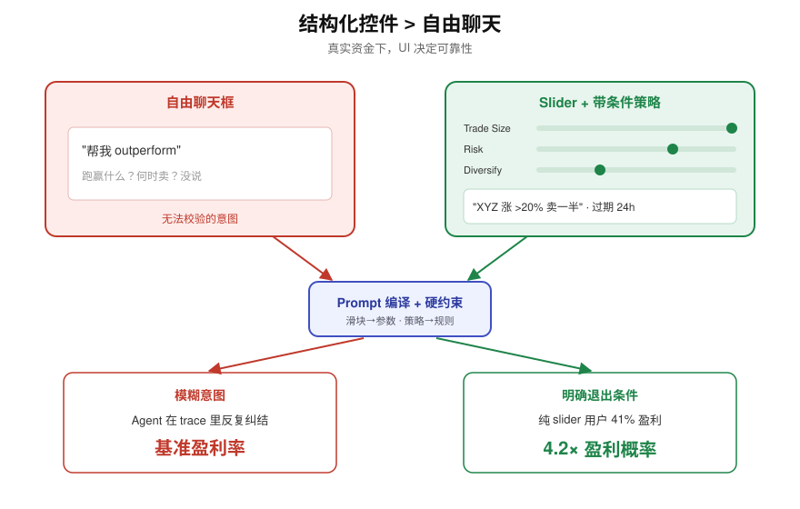
*图示：给用户一个聊天框，他很容易写出'帮我多赚点'这种没法校验的指令；给他滑块和必须填的退出条件，他就被迫把意图变成系统能检查的东西。在真金白银场景里，这种UI差异直接影响到收益率。*

展开技术点 3 详细版

- 技术细节：用户界面分两层：五个1–5的slider（交易活跃度、资产风险偏好、仓位大小、持仓风格、分散度）+ 带优先级和过期时间的自然语言策略文本。slider是prompt编译控件，真正的最大仓位和滑点是后端硬约束。作者观察到给出明确退出条件/参数的用户盈利概率是只说'跑赢'用户的4.2倍；87个只用slider从不用chat的用户有41%盈利，是所有活跃群体里最高的。
- 通俗讲解：给用户一个聊天框，他很容易写出'帮我多赚点'这种没法校验的指令；给他滑块和必须填的退出条件，他就被迫把意图变成系统能检查的东西。在真金白银场景里，这种UI差异直接影响到收益率。
- 例子：一个用户拉Trade Size=5、写'当XYZ涨超20%就卖一半'，系统可以在编译prompt时同时把滑块值和策略文本按优先级插入，agent的spend比例也从TS=1的约2%放大到TS=5的约95%；相反，一个只说'帮我outperform'的用户，连'跑赢什么'都没定义，trace里就能看到agent反复在观察里纠结。

#### 技术点 4：Trace可复用于迁移与训练
- 快速理解：完整instruction-to-settlement trace既能跨模型迁移harness，也能当未来RL的训练数据

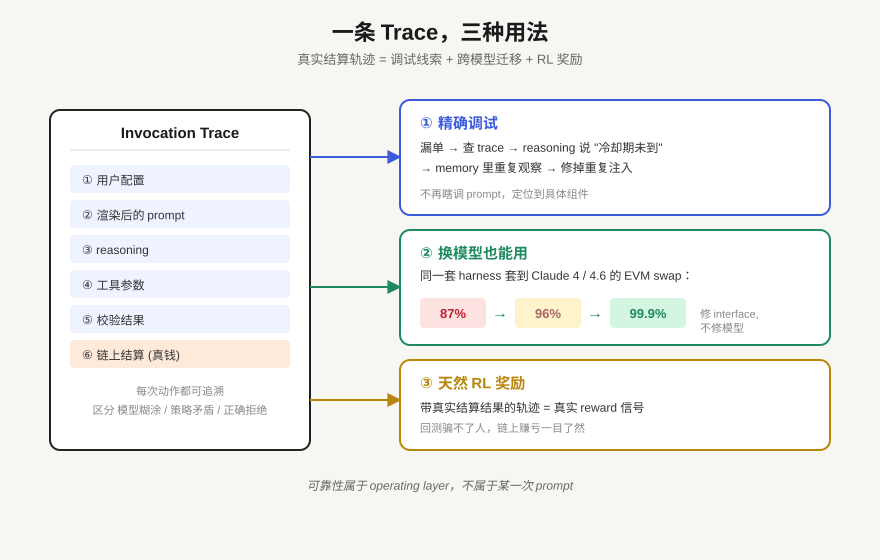
*图示：因为每次动作都能追溯到具体哪条指令、哪段memory、哪个校验引发的，工程师就能精确修正而不是瞎调prompt。而且这份轨迹换个模型也能用——harness修复的大多是interface和runtime问题，不是某个模型独有的毛病。对未来想做RL的团队来说，这些带真实结算结果的轨迹就是天然的奖励信号。*

展开技术点 4 详细版

- 技术细节：每条invocation都记录用户配置、渲染prompt、reasoning、工具参数、校验结果、链上结算。这份trace被用来区分'模型糊涂'、'用户策略矛盾'、'风控正确拒绝'等本来看起来一样的失败。同一套harness优化被迁移到Claude 4/4.6的内部EVM swap测试中，把aligned成功率从87% 变成 96% 变成 99.9%。作者也指出传统开放式memory和RAG在这种实时变化的场景下反而会增加幻觉，应当用结构化、近期、带来源标签的state替代。
- 通俗讲解：因为每次动作都能追溯到具体哪条指令、哪段memory、哪个校验引发的，工程师就能精确修正而不是瞎调prompt。而且这份轨迹换个模型也能用——harness修复的大多是interface和runtime问题，不是某个模型独有的毛病。对未来想做RL的团队来说，这些带真实结算结果的轨迹就是天然的奖励信号。
- 例子：比如某个agent漏了一次买入：先查trace，发现policy校验并未拒绝，reasoning里提到'冷却期未到'，再查memory发现上一个观察被重复注入导致伪节奏；修复是过滤重复观察。把同一套harness规则套到Claude 4.6上跑EVM swap构造任务，成功率直接从96%升到99.9%。

#### 技术点 5：冻结harness下的群体行为
- 快速理解：同一模型+同一harness，在不同用户mandate下会涌现出herding与双向流动

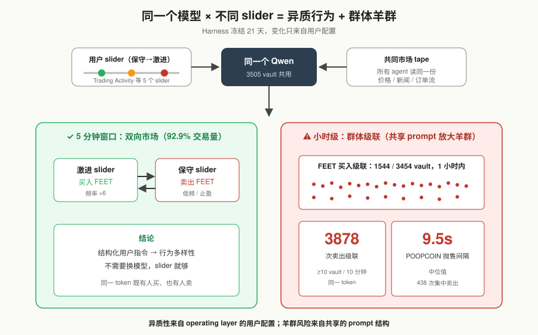
*图示：一个有意思的现象是：就算所有人都用同一个Qwen模型，只要用户的mandate和组合状态不同，市场里依然会出现买方和卖方。这说明行为多样性不一定要靠换模型，完全可以靠结构化的用户指令注入。但共同的prompt结构也会放大群体性羊群效应。*

展开技术点 5 详细版

- 技术细节：21天里harness完全冻结，只通过用户配置引入变化。所有五个slider都产生单调行为梯度，Trading Activity把交易频率拉开6倍；出现过1小时内1544/3454个vault同时买FEET、POOPCOIN抛售集中到9.5秒中位数间隔的级联；全程统计到3878次卖出cascade（\>=10个vault 10分钟内卖同一token）。但92.9%的交易发生在双向的5分钟窗口内——同一个模型通过不同slider和策略呈现了异质行为。
- 通俗讲解：一个有意思的现象是：就算所有人都用同一个Qwen模型，只要用户的mandate和组合状态不同，市场里依然会出现买方和卖方。这说明行为多样性不一定要靠换模型，完全可以靠结构化的用户指令注入。但共同的prompt结构也会放大群体性羊群效应。
- 例子：第三天FEET突然被1544个vault在1小时内买入，没人沟通，只是都读了同一份市场tape；而同期POOPCOIN出现438次卖出挤在一起。然而5分钟窗口级别看，同一个token下既有slider偏激进的agent在买、也有偏保守的agent在卖，两边构成了92.9%的交易量。

- **对 Agent 产品/系统的启发：** 想让Agent稳定跑业务，重点投入prompt编译、typed controls、policy校验与全链路trace

展开 Agent 启发详细版

- **详细启发：** 产品侧：面向终端用户的Agent产品应优先提供结构化控件（滑块、带优先级的策略文本、必填退出条件），把自由聊天当辅助；配合公开可审计的执行记录，让用户能看到每一步决策来自哪条自己的指令。；系统侧：把Agent系统拆成operating layer的各个组件分别instrument：prompt编译顺序、memory来源标签、policy校验、执行guard、全链路trace。prompt里避免出现'硬数字'被模型当规则读，结构化地注入领域机制（如手续费、payoff）而不是硬编码动作；传统RAG/长memory在高频变化环境要谨慎使用。；风险：即使同一模型+同一harness，共享状态也会放大羊群效应，导致级联买卖和尾部风险；prompt中一句话的位置就能翻转行为（fee paralysis、slider inversion）；观察性结论（如中文策略更盈利、slider用户更赚钱）有混杂变量，不能当因果结论使用。另外涉及真实资金时，用户必须明确风险并保留紧急暂停与清仓控件。

### 2. Enforcing Benign Trajectories: A Behavioral Firewall for Structured-Workflow AI Agents
- **方向：** agent\_safety
- **评分：** 相关性 95 | 价值 85 | 有趣性 80 | 创新性 78 | 开拓性 80
- **为什么入选：** 把入侵检测搬进Agent runtime，用DFA守住工具调用轨迹
- **快速背景：** 现有Agent防火墙逐次看调用，防不住'合法动作串成攻击'的上下文注入。
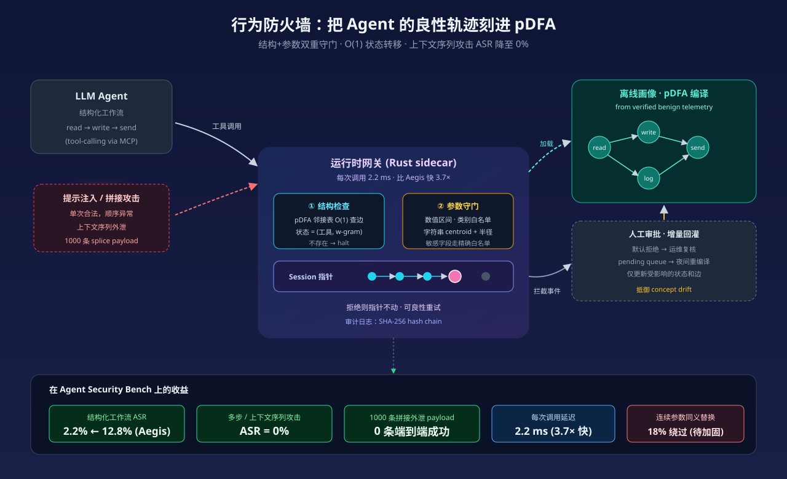
*图示：这篇论文把经典HIDS里的n-gram序列检测思路搬到LLM Agent工具调用层，针对'每个调用单看都合法但串起来是攻击'这种结构化注入，是Agent安全治理里少见的stateful方案，而且用DFA做到O(1)延迟，工程落地性强。*

展开论文背景详细版

- **详细背景：** LLM Agent越来越多通过MCP等协议调用外部工具，Aegis这类pre-execution防火墙只能孤立地扫描每一次调用，对语法合法但顺序异常的context-sequential攻击几乎无能为力（作者测到最高75%绕过率）。作者指出问题根源在于'无状态'，因此提出把Agent的正常行为轨迹整体建模，作为runtime enforcement依据。这对正在做Agent安全网关、MCP治理的团队是很值得参考的思路。
- **详细入选理由：** 这篇论文把经典HIDS里的n-gram序列检测思路搬到LLM Agent工具调用层，针对'每个调用单看都合法但串起来是攻击'这种结构化注入，是Agent安全治理里少见的stateful方案，而且用DFA做到O(1)延迟，工程落地性强。

**核心技术点速览：**

#### 技术点 1：用pDFA固化Agent行为轨迹
- 快速理解：把历史良性调用编译成参数化DFA，规定合法的工具序列和参数范围。

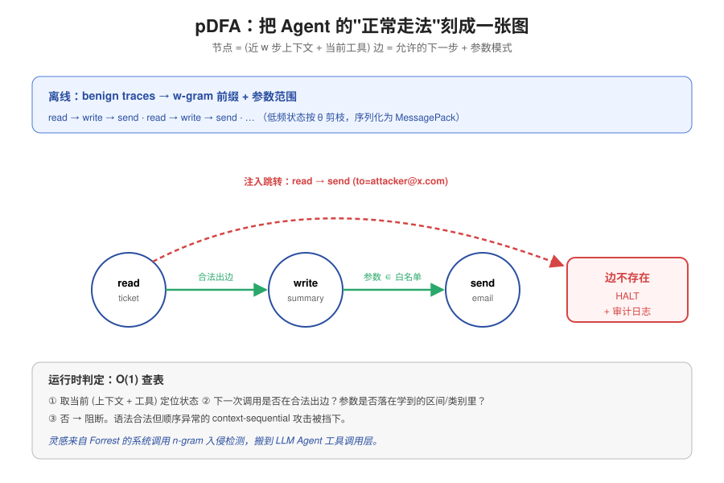
*图示：思路类似Forrest经典的系统调用n-gram入侵检测：先把Agent'正常怎么干活'刻进一张图，图里每个节点是'上下文+当前动作'，边是'允许的下一步'并附带允许的参数形状。任何新调用都要先看图里有没有这条合法走法。*

展开技术点 1 详细版

- 技术细节：离线阶段收集verified benign traces，用w-gram（默认w=3）前缀作为状态的上下文，每个状态是(当前工具名, 前w个工具前缀)，边上挂着从历史调用学到的参数模式（数值区间、字符串embedding中心+半径、类别白名单）。低频状态按阈值θ剪枝，最终序列化成MessagePack二进制。
- 通俗讲解：思路类似Forrest经典的系统调用n-gram入侵检测：先把Agent'正常怎么干活'刻进一张图，图里每个节点是'上下文+当前动作'，边是'允许的下一步'并附带允许的参数形状。任何新调用都要先看图里有没有这条合法走法。
- 例子：客服Agent正常流程是read-ticket变成write-summary变成send-email。训练完后，从read-ticket状态出发，合法出边只有write-summary。如果Agent被提示注入后直接从read-ticket跳到send-email(to=attacker@x.com)，这条边在pDFA里根本不存在，直接halt并写审计日志。

#### 技术点 2：O(1)运行时网关
- 快速理解：runtime只做哈希查表和参数校验，单次调用仅2.2ms延迟。

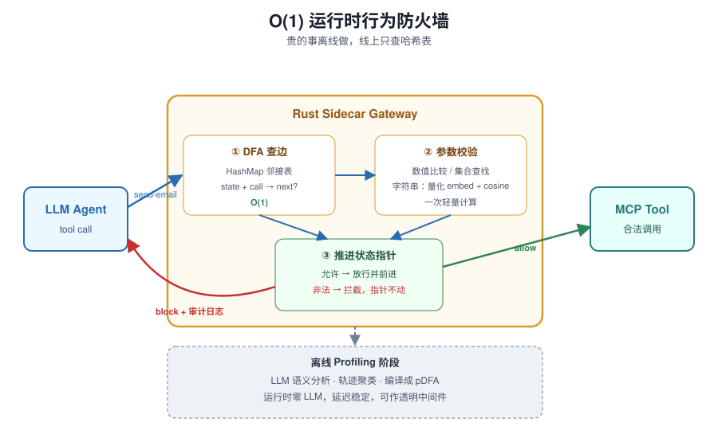
*图示：作者刻意把'贵的事'全挪到离线：运行时不再跑LLM、不再做正则扫描，就是查字典+算一次小embedding。因此延迟稳定，可以当透明中间件塞在OpenAI/Anthropic的tool-use调用路径上。*

展开技术点 2 详细版

- 技术细节：Rust实现的sidecar daemon启动时把pDFA加载成HashMap邻接表，每个session维护一个状态指针。每次工具调用做三步：O(1)查边、参数schema校验（数值比较/集合查找/字符串做一次量化embedding+cosine）、允许则推进指针否则拦截并留在原状态。所有语义分析都放在离线profiling阶段。
- 通俗讲解：作者刻意把'贵的事'全挪到离线：运行时不再跑LLM、不再做正则扫描，就是查字典+算一次小embedding。因此延迟稳定，可以当透明中间件塞在OpenAI/Anthropic的tool-use调用路径上。
- 例子：Agent发出send-email调用到达gateway，gateway用当前状态(read-ticket, （session-start）)做key查哈希表，发现没有send-email这条出边变成立刻返回结构化error payload、写入SHA-256 hash chain审计日志；Agent按原有错误处理逻辑接住，状态指针保持不动，便于良性重试。

#### 技术点 3：结构+参数双重防御
- 快速理解：结构匹配大幅压缩攻击面，敏感参数靠精确白名单兜底。

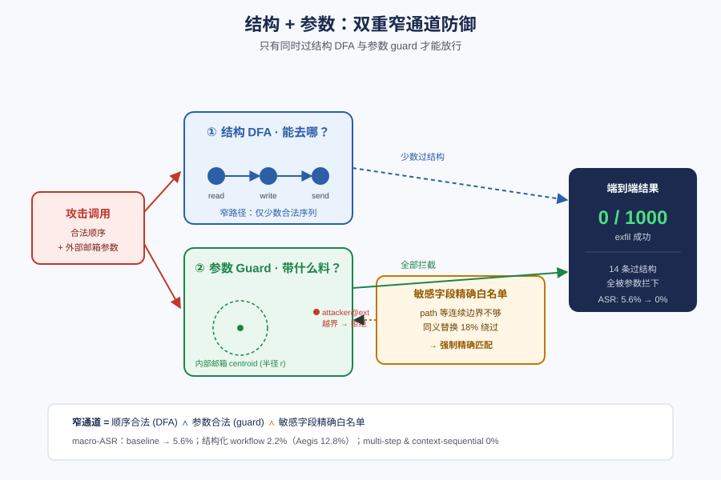
*图示：结构（DFA图）负责把'能去哪'砍到极少几条路，参数guard负责把'带什么料'卡死。光有结构不够——攻击者可能沿着合法路径夹带恶意参数；光有参数白名单也不够——无状态扫描看不出顺序异常。两者叠加才形成真正的窄通道，但敏感字段必须退回精确白名单才安全。*

展开技术点 3 详细版

- 技术细节：作者在ASB上macro-ASR从baseline的显著水平降到5.6%，三个结构化workflow里降到2.2%（Aegis为12.8%），multi-step和context-sequential攻击ASR为0%。1000条splice拼接的exfil payload中只有14条(1.4%)能找到合法结构路径，这14条全部被字符串参数guard拦住。但作者也承认连续参数边界在synonym-substitution攻击下有18%绕过率，所以对path这类敏感参数引入Sensitive-Parameter Whitelist Override强制精确匹配。
- 通俗讲解：结构（DFA图）负责把'能去哪'砍到极少几条路，参数guard负责把'带什么料'卡死。光有结构不够——攻击者可能沿着合法路径夹带恶意参数；光有参数白名单也不够——无状态扫描看不出顺序异常。两者叠加才形成真正的窄通道，但敏感字段必须退回精确白名单才安全。
- 例子：攻击者构造一条合法前缀read-db变成write-file变成send-email，结构上真有这条路径。但send-email的to参数被训练语料里的内部邮箱centroid限制，attacker@external.com的embedding距离超过r，被guard拒绝；即便作者实验中14条结构过关的payload，端到端0条成功exfil。

#### 技术点 4：人工审批式增量更新
- 快速理解：用human-in-the-loop把新工作流合规地加进行为画像，避免静默扩权。

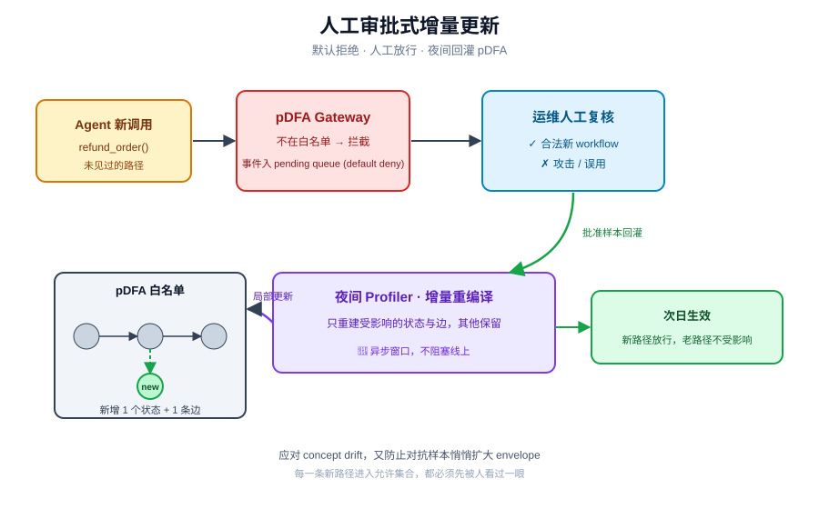
*图示：Agent会演化，工具和任务会变，如果不更新画像就只会越来越多false positive。作者的做法是'默认拒绝+人工放行+离线增量回灌'，保证任何新行为进入允许集合都经过人看过一眼。*

展开技术点 4 详细版

- 技术细节：当gateway拦下某个调用、但人工复核认为是合法新流程时，该事件进入pending queue；下一次异步重编译窗口（如夜间）profiler把新样本吃进去，只重建受影响的状态和边，其他DFA保留。作者强调这能缓解concept drift又避免对抗性样本悄悄扩大envelope。
- 通俗讲解：Agent会演化，工具和任务会变，如果不更新画像就只会越来越多false positive。作者的做法是'默认拒绝+人工放行+离线增量回灌'，保证任何新行为进入允许集合都经过人看过一眼。
- 例子：产品新增了refund-order工具，Agent第一次调用被拦下；运维在控制台确认这是合法新workflow，事件入队；当晚profiler把这条轨迹加到pDFA里，增加对应新状态和边，第二天起这条路径正常放行，其他老路径不受影响。

- **对 Agent 产品/系统的启发：** Agent安全网关值得做成'有状态行为画像+O(1)执行'而不是每步LLM审查。

展开 Agent 启发详细版

- **详细启发：** 产品侧：对做MCP网关、Agent平台治理层的团队，这套telemetry→DFA→sidecar架构可以直接借鉴：离线吃生产trace生成per-deployment画像，线上做低延迟拦截，兼容OpenAI/Anthropic tool-use格式意味着接入成本很低。适合窄任务、工具词表稳定的垂直Agent（客服、运维、clinical workflow）。；系统侧：把昂贵的语义分析放offline，runtime只留查表和量化embedding，是Agent安全组件延迟控制的关键范式。配合append-only SHA-256审计链和transparency log，可以给Agent系统补上合规所需的可追溯能力。增量更新协议提醒我们：Agent行为画像一定要有人工在环的演进机制，否则要么漂移要么被投毒。；风险：三个要留意的点：一是cold-start依赖干净corpus，训练语料被污染就全盘失守，作者明确把profiling期投毒排除在威胁模型之外；二是连续参数边界对同义词替换仍有18%绕过，敏感字段必须退到精确白名单；三是该方法假设窄任务、小工具词表，对开放式、工具词表大或上下文动态注入的Agent，DFA状态会爆炸、误拦率会升高。

### 3. SWE-Edit: Rethinking Code Editing for Efficient SWE-Agent
- **方向：** code\_agent
- **评分：** 相关性 95 | 价值 85 | 有趣性 80 | 创新性 78 | 开拓性 75
- **为什么入选：** 把代码编辑拆成Viewer+Editor子Agent，SWE-bench涨点还省钱17.9%
- **快速背景：** 主流 SWE-Agent 把看代码、想方案、写 diff 挤在同一个上下文里，越探索越脏、越容易格式出错。
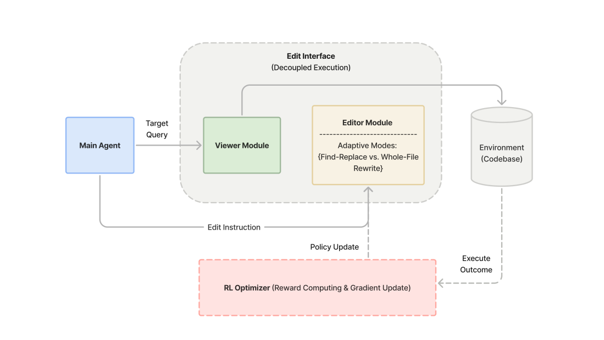
*图示：这张图是论文最标准的系统总览图，直接展示了 SWE-Edit 的核心机制：主 Agent、Viewer Module、Editor Module、Environment 之间的模块划分与信息流，以及底部 RL Optimizer 对编辑器策略的更新。它一眼说明了论文最重要的贡献——将代码查看与编辑执行从主 Agent 上下文中解耦，并结合编辑模型优化形成双层优化框架。相比 Figure 2 只解释编辑模式选择，这张图更完整代表整篇论文的方法与架构。*

展开论文背景详细版

- **详细背景：** 当前 SWE-Agent 的代码编辑接口（如 str\_replace\_editor）把'查看文件、规划修改、生成格式化 edit'都塞进主 Agent 的单一上下文中，导致探索过程中无关代码不断堆积，污染上下文；同时 find-replace 这种严格字符串匹配格式本身就很脆弱，强推理模型也常常写错格式。作者认为探索广度和编辑精度天然冲突，一个 Agent 无法同时最优，所以要在接口层做解耦。这对所有做 code agent、tool-use harness 的团队都是绕不开的问题。
- **详细入选理由：** 这篇论文直接针对 SWE-Agent 的 harness 设计问题，提出把'看代码'和'改代码'从主 Agent 上下文中剥离出来，放到两个干净上下文的子 Agent 里。它在 SWE-bench Verified 上同时拿到 +2.1% 解决率和 -17.9% 成本，并且在 Kimi、MiniMax、GLM 等多种 reasoning 模型上都稳定生效，对做 code agent 产品的团队有直接可复用的架构启发。

**核心技术点速览：**

#### 技术点 1：Viewer/Editor 双子Agent解耦
- 快速理解：把'看文件'和'改文件'从主 Agent 剥离到两个干净上下文的子 Agent 里

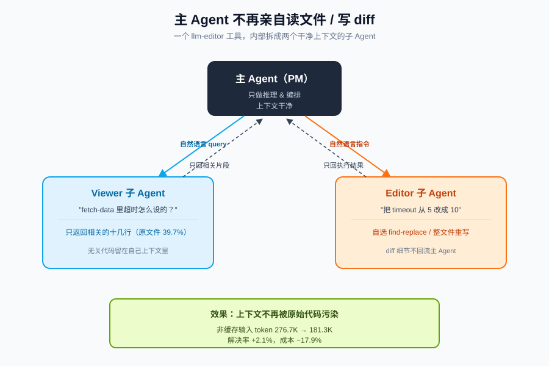
*图示：可以把主 Agent 想成项目经理，Viewer 是专门帮它读代码的助理，Editor 是专门帮它落笔改代码的工程师。主 Agent 不用亲自打开一堆文件再纠结字符串怎么匹配，只用说'帮我看看这个函数怎么处理超时'和'把这里的超时改成 10 秒'。两个子 Agent 各自在干净的小上下文里干活，干完只把结果交回去，主 Agent 的上下文就不会被无关代码淹没。*

展开技术点 1 详细版

- 技术细节：SWE-Edit 用一个 llm-editor 工具替换掉标准 str-replace-editor，内部路由到 Viewer 和 Editor 两个子 Agent。Viewer 接收文件路径+自然语言 query，只返回任务相关的代码片段；Editor 接收文件路径+自然语言修改指令，负责具体执行 find-replace 或整文件重写。主 Agent 不再直接看原始文件、也不再直接写 diff 格式，只做推理和编排。
- 通俗讲解：可以把主 Agent 想成项目经理，Viewer 是专门帮它读代码的助理，Editor 是专门帮它落笔改代码的工程师。主 Agent 不用亲自打开一堆文件再纠结字符串怎么匹配，只用说'帮我看看这个函数怎么处理超时'和'把这里的超时改成 10 秒'。两个子 Agent 各自在干净的小上下文里干活，干完只把结果交回去，主 Agent 的上下文就不会被无关代码淹没。
- 例子：比如处理一个 GitHub issue 时，主 Agent 问 Viewer：'fetch-data 里超时是怎么设置的？'，Viewer 只返回 fetch-data 相关的十几行，而不是整个 300 行的文件（实测只回传原文件 39.7% 的内容）。接着主 Agent 下自然语言指令给 Editor：'把 timeout 从 5 改成 10'，Editor 自己决定用 find-replace 还是整文件重写并写回。最终主 Agent 从头到尾没看过完整原文件，非缓存输入 token 从 276.7K 降到 181.3K。

#### 技术点 2：自适应切换编辑格式
- 快速理解：用 GRPO 训练 Qwen3-8B 按任务难度在 find-replace 和整文件重写间选格式

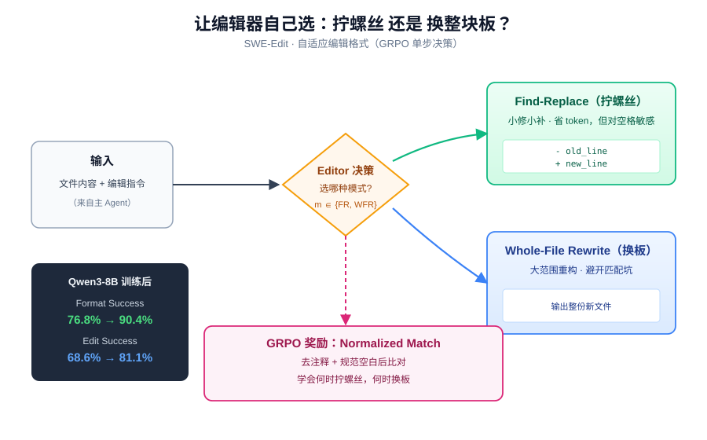
*图示：相当于教编辑器自己判断'这个改动是拧一颗螺丝还是整块换板'。小修小补就精确 find-replace，省 token；涉及大范围重构或多点改动就整文件重写，避免被字符串匹配卡死。训练曲线显示固定 find-replace 起点更高但很快被自适应策略反超，因为后者学会了在难任务上切换到重写模式。*

展开技术点 2 详细版

- 技术细节：作者观察到 find-replace 便宜但一个空格对不上就失败，整文件重写稳健但长文件成本爆炸，单一格式永远不是最优。他们把'选择编辑模式'建模成单步决策问题：给定文件内容和编辑指令，模型输出模式 m属于(find-replace, whole-file-rewrite) 以及对应结果，用 GRPO 优化，奖励是去注释+规范空白后的 normalized match。
- 通俗讲解：相当于教编辑器自己判断'这个改动是拧一颗螺丝还是整块换板'。小修小补就精确 find-replace，省 token；涉及大范围重构或多点改动就整文件重写，避免被字符串匹配卡死。训练曲线显示固定 find-replace 起点更高但很快被自适应策略反超，因为后者学会了在难任务上切换到重写模式。
- 例子：训练后的 Qwen3-8B 在 PR-Edit 上 Format Success 从 76.8% 提到 90.4%，GPT Grader 从 56.0% 到 68.4%，追平甚至超过 GPT-5-nano。部署成 Editor 子 Agent 后，SWE-bench Verified 解决率从 68.5% 提到 69.9%，edit success 从 68.6% 大涨到 81.1%。对比把 Editor 从 GPT-5-mini 换到 GPT-5 只涨 1.6%、成本却涨 5.8 倍，说明训练比堆参数更划算。

#### 技术点 3：PR-Edit 作为廉价代理评测
- 快速理解：跑一次 SWE-bench 要 200 美元，作者造了个强相关的便宜 benchmark 做选型

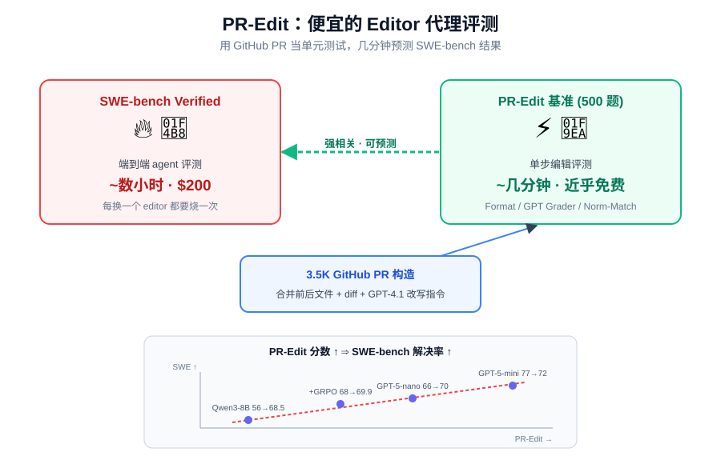
*图示：一次 SWE-bench Verified 评测要几小时、约 200 美元，对做 editor 选型来说太奢侈。PR-Edit 就像一个便宜的单元测试，几分钟就能跑完，而且分数和最终 agent 效果是正相关的，可以放心用它来筛模型、调训练。这给想迭代 editor 组件的团队提供了一个工程上可行的中间信号。*

展开技术点 3 详细版

- 技术细节：作者从开源 GitHub PR 构造了 3.5K 条数据（2.8K 训练/200 验证/500 held-out 测试），每条包含合并前后文件、diff 和 GPT-4.1 生成的自然语言编辑指令。500 条 held-out 作为 PR-Edit 基准，报 Format Success、GPT Grader、Normalized Match 三个指标，并验证这些指标与 SWE-bench Verified 的下游解决率强相关。
- 通俗讲解：一次 SWE-bench Verified 评测要几小时、约 200 美元，对做 editor 选型来说太奢侈。PR-Edit 就像一个便宜的单元测试，几分钟就能跑完，而且分数和最终 agent 效果是正相关的，可以放心用它来筛模型、调训练。这给想迭代 editor 组件的团队提供了一个工程上可行的中间信号。
- 例子：从 Table 5 可以看出：Qwen3-8B 原版 PR-Edit 56.0% 对应下游 68.5%；GRPO 后 68.4% 对应 69.9%；GPT-5-nano 66.4% 对应 70.0%；GPT-5-mini 77.5% 对应 72.0%。PR-Edit 分数越高，SWE-bench 解决率和 edit success 越高、主 Agent 成本越低，不用端到端烧钱就能预测哪个 editor 值得上线。

#### 技术点 4：Viewer 优于传统检索
- 快速理解：LLM Viewer 在召回和上下文压缩上都碾压 BM25 和 dense retrieval

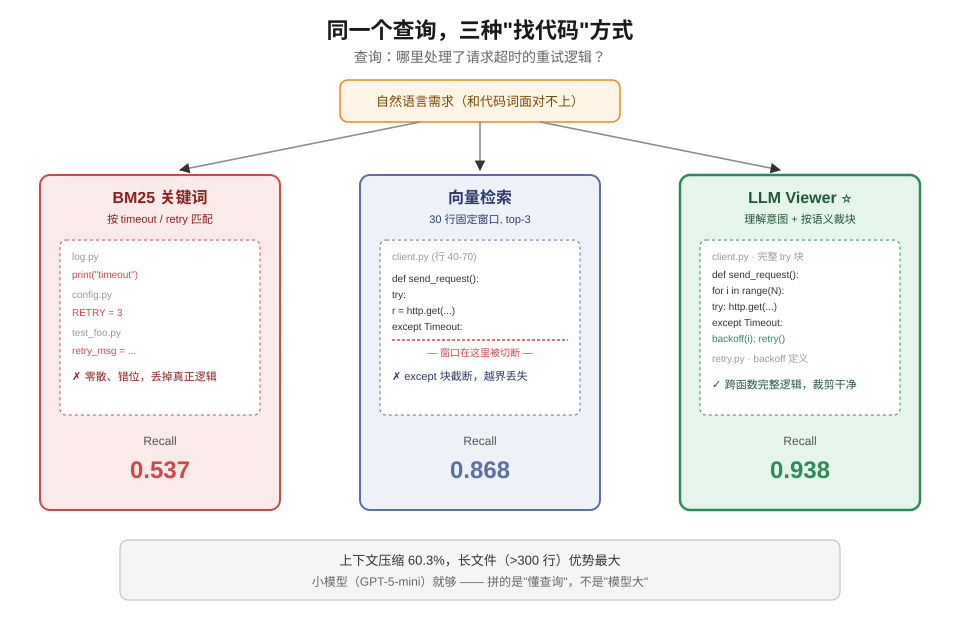
*图示：自然语言的编辑需求常常和目标代码的词面对不上，BM25 死在词汇差异上，向量检索只能切固定窗口、切不准函数边界。LLM Viewer 是在'理解查询意图'的基础上去挑代码，还会按提示规则补上周围的完整逻辑块，因此既找得更全也裁得更干净。而且把 Viewer 从 GPT-5-mini 换成 GPT-5 效果没变，说明这活儿不用大模型，小模型就够。*

展开技术点 4 详细版

- 技术细节：作者在 50 条 PR-Edit 上对比 LLM Viewer（GPT-5-mini）、text-embedding-3-small 的 dense 检索（30 行 chunk，top-3）和 BM25。Viewer 的 recall 0.938、F1 0.272、上下文压缩 60.3%，全面高于 dense（0.868/0.140/28.6%）和 BM25（0.537/0.083/64.4%）。在 \>300 行长文件上优势尤其明显，因为 Viewer 能返回非连续、语义完整的代码块。
- 通俗讲解：自然语言的编辑需求常常和目标代码的词面对不上，BM25 死在词汇差异上，向量检索只能切固定窗口、切不准函数边界。LLM Viewer 是在'理解查询意图'的基础上去挑代码，还会按提示规则补上周围的完整逻辑块，因此既找得更全也裁得更干净。而且把 Viewer 从 GPT-5-mini 换成 GPT-5 效果没变，说明这活儿不用大模型，小模型就够。
- 例子：比如主 Agent 问'哪里处理了请求超时的重试逻辑'，BM25 按关键词 timeout/retry 可能完全错位，dense 检索只能返回固定的 30 行窗口；LLM Viewer 能定位到跨越几个函数的完整 try/except 块一起返回，既不丢关键上下文也不把无关代码灌给主 Agent。

#### 技术点 5：跨模型稳定有效
- 快速理解：在 Kimi-K2、MiniMax-M2.1、GLM-4.7 上 edit success 普涨 12-18 个点

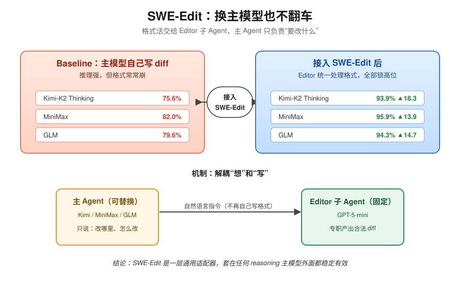
*图示：很多强推理模型的通病是推理很行但格式一塌糊涂，经常生成不合法的 diff。把格式敏感的编辑执行外包给专门的 Editor 子 Agent 之后，主 Agent 只负责说'要改什么'，格式正确率就被锁定在一个很高的水平，不再受主模型个体差异影响。*

展开技术点 5 详细版

- 技术细节：只替换主 Agent 模型、Viewer/Editor 都保持 GPT-5-mini，在 SWE-bench Verified 前 100 条跑 2 次。三个 reasoning 模型 baseline 的 edit success 分别是 75.6%/82.0%/79.6%，上了 SWE-Edit 后统一稳定到 93.9%–95.9%，解决率也分别 +2.7%/+4.1%/+1.6%。
- 通俗讲解：很多强推理模型的通病是推理很行但格式一塌糊涂，经常生成不合法的 diff。把格式敏感的编辑执行外包给专门的 Editor 子 Agent 之后，主 Agent 只负责说'要改什么'，格式正确率就被锁定在一个很高的水平，不再受主模型个体差异影响。
- 例子：Kimi-K2 Thinking 原本 edit success 只有 75.6%，意味着每 4 次编辑就有 1 次因格式报错被浪费；接入 SWE-Edit 后飙到 93.9%，+18.3 个点，解决率也从 56.7% 涨到 59.4%。这说明这套 harness 可以作为通用适配层套在任何 reasoning 主模型外面。

- **对 Agent 产品/系统的启发：** 把 tool-use harness 里'看'和'写'拆成子 Agent，是给 code agent 既提效又降本的通用杠杆

展开 Agent 启发详细版

- **详细启发：** 产品侧：做代码类 Agent 产品（Copilot、Cursor 类、issue 自动修复）时，可以把文件读取和代码修改从主模型 prompt 里抽出来，封装成独立的 Viewer/Editor 微服务，用更便宜的小模型承担；主模型只下自然语言指令，既能降成本又能稳定跨不同 backbone 的表现。；系统侧：这套思路本质是'上下文隔离 + 认知分工'的 harness 设计：高频、会污染上下文的操作（浏览、格式化生成）交给带干净上下文的子 Agent，主 Agent 专注规划。同时作者给出了廉价代理评测（PR-Edit）→训练子 Agent（GRPO）→端到端验证的三段式工程 pipeline，可以直接迁移到其它子 Agent 组件（如测试生成、代码审查）的优化上。；风险：Viewer 有可能过度裁剪漏掉关键上下文，作者靠提示规则要求返回完整逻辑块并允许主 Agent 重新查询来补救，但平均 7.49 次 Viewer 调用说明存在一定回退开销；此外 PR-Edit 用 GPT-4.1 生成指令、用 normalized match 做奖励，存在数据分布和语义等价性上的偏差，迁移到非 Python 或非 GitHub 风格代码库时需要重新验证。另外论文标注 arXiv 编号为 2604.26102，标为 'Preprint. April 30, 2026.'，这一信息本身真实性需读者自行核对。

## 四、候选但未完成深读的论文

当前重点论文都已完成可用分析。

## 五、总结

- Agent 竞争正从'模型选型'转向'operating layer 工程深度'
- 今天的高分论文几乎一致指向同一个判断

展开总结详细版

- 今天的高分论文几乎一致指向同一个判断：Agent 的可靠性、安全和长程能力，都不在单次生成里，而在围绕它搭起来的那层执行栈。
- operating layer、behavioral firewall、harness 拆分、长程 memory，看似分散，其实都是在给 Agent 的执行轨迹加结构。
- 对正在做 Agent 产品的团队来说，接下来值得投入的，不是再换一个更强的基座，而是把轨迹、工具接口和记忆层认真工程化。

