# 2026-05-04 AI Agent 论文日报

> 分类：cs.AI + cs.CL + cs.LG + cs.MA + cs.RO + cs.SE + cs.HC
> 入选论文：3 篇

## 一、初筛每日趋势

- Agent 安全从越狱转向 skill 审计与部署事故复盘
- Tool use 研究焦点下沉到'该不该调'和调用税
- 系统层开始把 workflow 当调度一等公民

展开趋势详细版

- Agent 安全方向明显从'模型越狱'转向运行时治理：Skill 静态审计、HITL 信任架构、真实部署的非对抗性提权事故，开始用'可验证工件'和'约束图'的思路去覆盖 prose 策略的模糊地带。
- Tool use 的研究重心从'教会 Agent 调工具'下移到'该不该调、调得值不值'，工具调用税、必要性-效用-成本三因素框架、隐状态决策器接连出现，显示社区在追求调用效率而非盲目堆调用次数。
- Agent 系统层开始独立成型：SAGA 把 workflow 当成 GPU 调度单位、Agent Capsules 做 pipeline 粒度门控，反映出 runtime/harness 层正在成为独立研究方向，而不是框架附属品。
- 评测方向更贴近真实任务：AutoMat 考察科学复现、AgentFloor 构建 6 层能力阶梯、小模型工具使用对比，benchmark 不再满足于刷分，而是回答'Agent 在真实工程里能走多远'。

## 二、今日基础知识点

### Harness 是什么
- **快速理解：** Harness 是把任务、环境、工具协议和评测日志打包起来的 Agent 实验底座，决定结果可不可复现、可不可比。
- **为什么今天值得懂：** 今天的精读论文几乎都踩在 harness 层：SAGA 重写 workflow 调度、Agent Capsules 做质量门控、Semia 给 skill 做静态审计、AgentFloor 用能力阶梯组织评测，背后都是'把 Agent 当作可被系统化观测和约束的运行时'这同一件事。

展开知识点详细版

Harness 可以理解成一套把任务定义、运行环境、输入输出协议、工具接口、评测脚本和日志采集规则打包起来的实验底座。它不是单次跑分的脚本，而是让不同模型、不同工具链、不同安全策略能在同一份协议下被反复对照的一层基础设施。在 Agent 系统里，harness 通常承担三件事：规范 Agent 和环境之间的交互边界、统一记录每一步的观察和动作、给评测和回归测试提供可重放的轨迹。做得好的 harness 往往比模型本身更决定一支团队能不能持续迭代。

## 三、重点论文精读

### 1. Semia: Auditing Agent Skills via Constraint-Guided Representation Synthesis
- **方向：** agent\_safety
- **评分：** 相关性 95 | 价值 85 | 有趣性 82 | 创新性 85 | 开拓性 80
- **为什么入选：** 首个把Agent Skill的自然语言策略编译成Datalog做静态审计的工作
- **快速背景：** Agent Skill一半是代码接口、一半是英文策略，现有工具只能扫代码或让LLM口头判一下
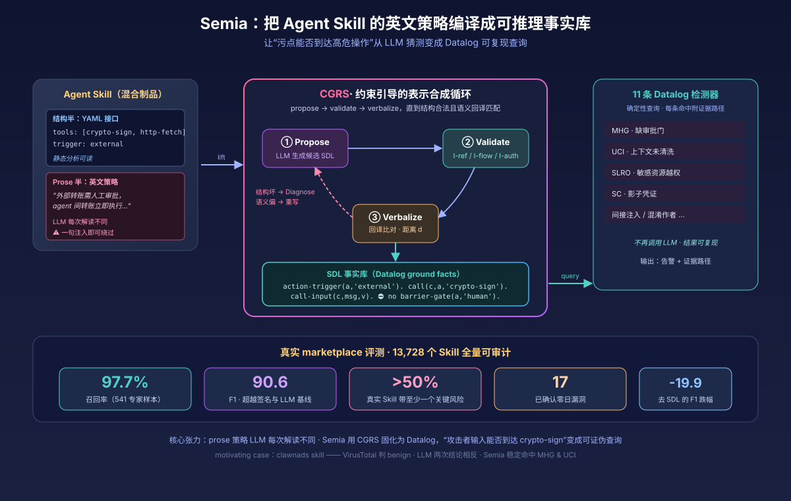
*图示：Agent Skill的安全边界其实写在一段英文策略里，传统静态扫描读不懂、LLM审计又结果不稳定。这篇论文给出一个把prose策略'编译'成可推理事实库的方法，并在1.3万个真实skill上跑通，对Agent安全栈搭建很有参考价值。*

展开论文背景详细版

- **详细背景：** 现在Agent Skill（如Claude Skill、MCP manifest）通常由YAML声明的接口加一段英文策略组成，策略每次被LLM重新解读，攻击者只要往输入里塞一句话就能绕过'外部转账需审批'这类prose规则。传统签名扫描看不懂英文，LLM审计又每次结论都不一样，无法证明'不存在污染路径'。作者希望做出Agent Skill版本的静态分析，在上架前一次性回答：攻击者可控输入能否在不经过显式审批门的情况下到达高危操作。
- **详细入选理由：** Agent Skill的安全边界其实写在一段英文策略里，传统静态扫描读不懂、LLM审计又结果不稳定。这篇论文给出一个把prose策略'编译'成可推理事实库的方法，并在1.3万个真实skill上跑通，对Agent安全栈搭建很有参考价值。

**核心技术点速览：**

#### 技术点 1：SDL：把Skill翻成Datalog事实
- 快速理解：定义一套关系schema，把prose里的触发、数据流、审批门变成可查询的ground facts

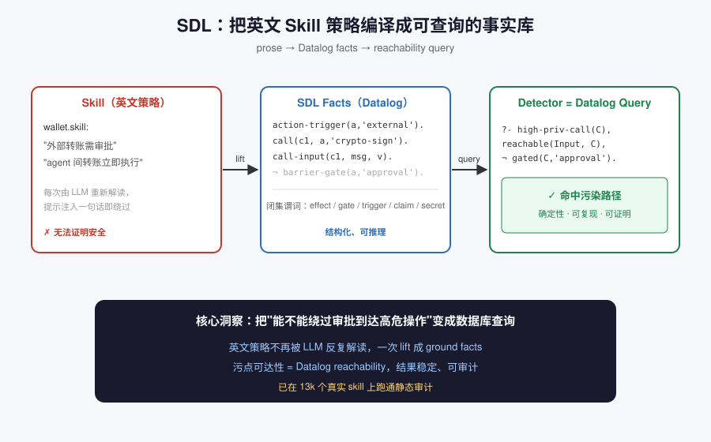
*图示：想做静态分析就得有结构化IR，但Skill最关键的策略是英文。作者做法是先定义一张'安全相关要素清单'（哪些动作、谁能触发、有没有审批门、哪些是secret），把英文里提到的东西都摊平成一条条事实。之后'污点能不能到高危sink'就变成了数据库查询。*

展开技术点 1 详细版

- 技术细节：作者设计了Skill Description Language（SDL），用有限谓词刻画skill的调用骨架（skill/action/call/call-next）、数据流（call-input/output）、触发方式、目标可信度、secret、barrier-gate/sanitize、文档声明以及混淆标记等；effect、gate、trigger、claim都是闭集枚举。skill被lift后就是一组ground fact，detector就是Datalog reachability查询。
- 通俗讲解：想做静态分析就得有结构化IR，但Skill最关键的策略是英文。作者做法是先定义一张'安全相关要素清单'（哪些动作、谁能触发、有没有审批门、哪些是secret），把英文里提到的东西都摊平成一条条事实。之后'污点能不能到高危sink'就变成了数据库查询。
- 例子：比如wallet skill的prose说'外部转账需审批，agent间转账立即执行'。SDL会生成action-trigger(a,'external')、call(c-sign,a,'crypto-sign')、call-input(c-sign,msg,v)等事实，但没有barrier-gate(a,'human-approval')。一条Datalog查询'high-privilege call没有human-approval gate'立刻命中。

#### 技术点 2：CGRS：propose-verify-evaluate循环
- 快速理解：用结构校验+语义回译双重约束，让LLM翻译不丢safeguard

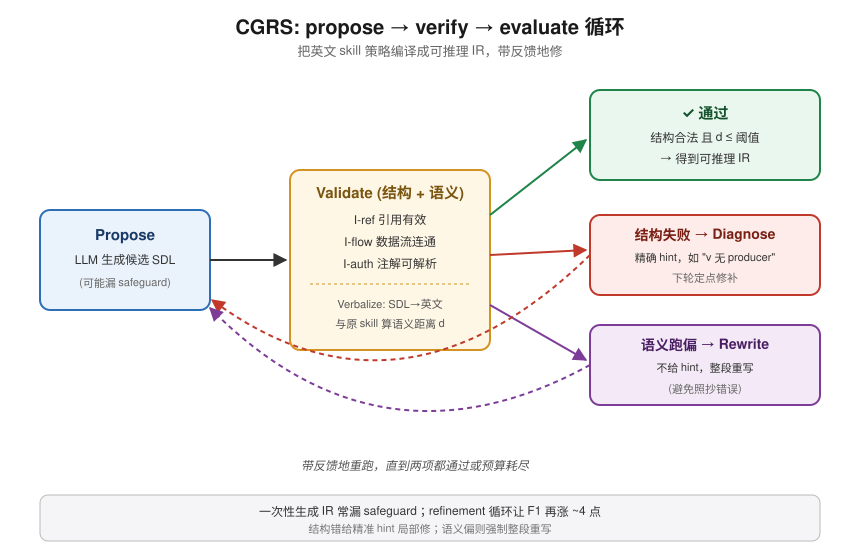
*图示：一次让LLM直接吐正确IR不靠谱，它常会漏掉一句关键safeguard。作者把翻译改成'带反馈的搜索'：结构坏了给明确错误提示让它修，结构对但语义跑偏就让它重来，直到回译的英文和原文足够接近。消融显示这个refinement比一次性生成F1高约4个点。*

展开技术点 2 详细版

- 技术细节：Constraint-Guided Representation Synthesis让LLM先提候选SDL，再跑Validate做结构不变式检查（引用有效性I-ref、数据流连通I-flow、注解可解析I-auth），再用Verbalize把SDL回译成英文并与原skill算距离d；结构失败走Diagnose产出精确修复hint，语义距离超阈值则不给hint直接让模型重写，循环到通过两项或耗尽预算。
- 通俗讲解：一次让LLM直接吐正确IR不靠谱，它常会漏掉一句关键safeguard。作者把翻译改成'带反馈的搜索'：结构坏了给明确错误提示让它修，结构对但语义跑偏就让它重来，直到回译的英文和原文足够接近。消融显示这个refinement比一次性生成F1高约4个点。
- 例子：模型第一次漏写了call-output(c1,body,v)，Validate发现v在call-input里被消费却没有producer，Diagnose提示'I-flow fail: v无生产者'，下一轮Refine据此补上边；若候选结构合法但回译只说'fetch rate'漏掉了'sign transaction'，则距离超阈值，直接丢弃重来。

#### 技术点 3：11条Datalog检测器
- 快速理解：把间接注入、秘密外泄等风险归纳成reachability查询

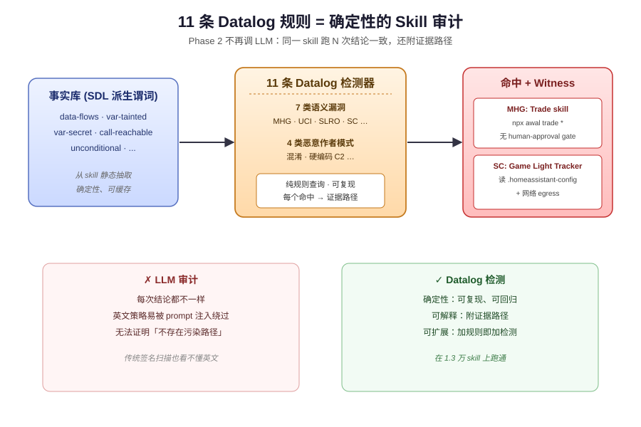
*图示：一旦事实库拿到手，Phase 2就是纯确定性的数据库查询，不再调LLM。这样即使同一个skill跑多次，结论也完全一致，而且能给开发者看清是哪条路径出的问题。*

展开技术点 3 详细版

- 技术细节：在SDL之上派生data-flows、var-tainted、var-secret、call-reachable/unconditional等复合谓词，然后写11条detector覆盖7类语义漏洞（缺审批门MHG、上下文未清洗UCI、sensitive资源越权SLRO、shadow credentials SC等）和4类恶意作者模式（混淆、硬编码C2等）。每个发现都带一条证据路径。
- 通俗讲解：一旦事实库拿到手，Phase 2就是纯确定性的数据库查询，不再调LLM。这样即使同一个skill跑多次，结论也完全一致，而且能给开发者看清是哪条路径出的问题。
- 例子：Trade skill允许npx awal trade \*但没声明human-approval gate，MHG规则直接命中返回witness；Game Light Tracker读.homeassistant-config.json并有网络egress，SC规则基于结构共现报shadow credentials，无需真实数据流就足以预警。

#### 技术点 4：13,728真实skill评测
- 快速理解：在公开市场skill上跑出F1 90.6%，并披露17个零日

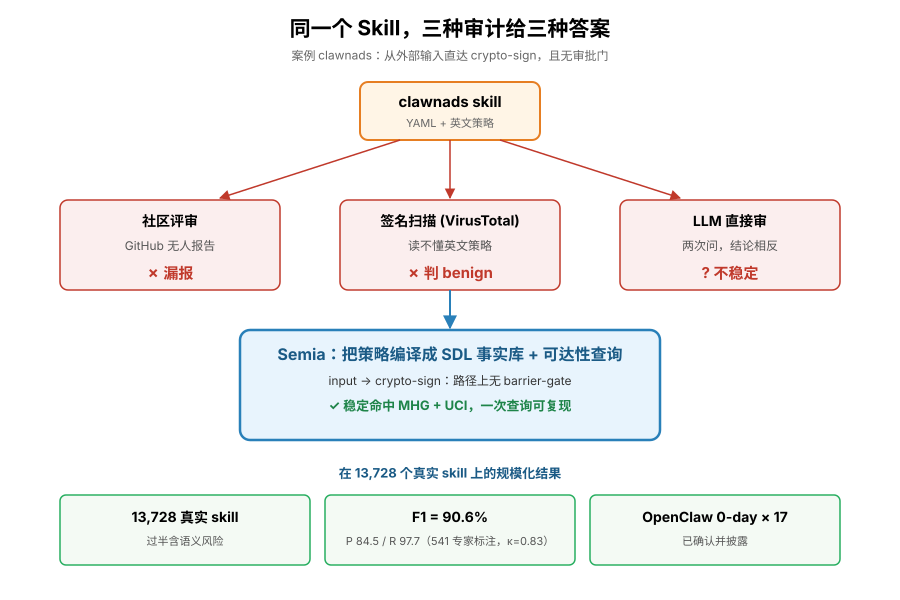
*图示：作者不仅做了方法学，还真正把它当安全工具用起来。结果表明超过一半真实skill至少带一个语义风险，而且能找到社区评审、VirusTotal、直接让LLM判三种方式都漏掉的漏洞。*

展开技术点 4 详细版

- 技术细节：在从公开marketplace爬取的13,728个skill上全量运行，用541条专家标注（κ=0.83）分层样本做对比，Semia达到84.5% precision、97.7% recall、F1=90.6%，显著超过签名扫描与LLM-only审计；消融显示去掉SDL降19.9 F1，去掉iterative refinement再降4.0；实际在OpenClaw上披露17个已确认的关键零日。
- 通俗讲解：作者不仅做了方法学，还真正把它当安全工具用起来。结果表明超过一半真实skill至少带一个语义风险，而且能找到社区评审、VirusTotal、直接让LLM判三种方式都漏掉的漏洞。
- 例子：motivating example里的clawnads skill，GitHub无人报告、VirusTotal判benign、直接让LLM读prose两次给出相反结论；Semia把它lift成SDL后，一次reachability查询确定从external trigger到crypto-sign没有barrier-gate，稳定触发MHG与UCI。

- **对 Agent 产品/系统的启发：** 上架Agent Skill前应做类似静态审计，策略不能只写在prose里

展开 Agent 启发详细版

- **详细启发：** 产品侧：构建Skill/MCP市场或企业内部Agent平台时，可借鉴SDL思路在上架审核环节加入结构化审计：把英文策略编译成事实库，在发布前回答'有没有未被审批门保护的高危路径'，而不是只做签名扫描或交给LLM随机判定。；系统侧：系统设计上值得把LLM限制在'翻译'角色，后续检测用确定性推理引擎（Datalog/规则），并用结构不变式+语义回译双重约束来稳住LLM输出。这种propose-verify-evaluate的骨架可以复用到任何需要LLM生成结构化IR的场合。；风险：论文自身指出只能证明'没有显式gate dominating高危call'，不能证明已写的gate在运行时真的被LLM执行；SDL枚举（effect、gate、trigger）是闭集，新型能力或新型攻击面需要人工扩展；此外CGRS依赖强模型（实验用claude-opus-4），在弱模型上refinement收敛情况不明。

### 2. SAGA: Workflow-Atomic Scheduling for AI Agent Inference on GPU Clusters
- **方向：** general\_agent
- **评分：** 相关性 95 | 价值 85 | 有趣性 80 | 创新性 80 | 开拓性 80
- **为什么入选：** 首次把整个Agent workflow作为GPU调度单元，KV cache复用逼近理论最优。
- **快速背景：** Agent一次任务要调几十上百次LLM，现有调度器把每次调用当独立请求，KV cache反复重算导致3-8×延迟膨胀。
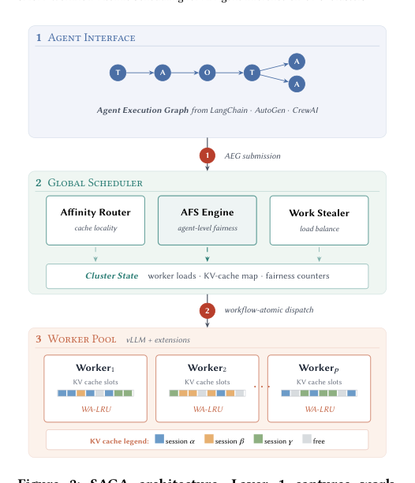
*图示：这张图是最完整的系统架构总览：清楚分成 Agent Interface、Global Scheduler、Worker Pool 三层，直接展示了 AEG submission、workflow-atomic dispatch、affinity routing、agent-level fairness、work stealing 与 KV cache/WA-LRU 的关系，能一眼说明 SAGA 如何把整个 agent workflow 作为调度单位。其他候选要么是页眉/标题截残，要么是带大量正文的混合截图，或只是结果图，不适合作为论文主图。*

展开论文背景详细版

- **详细背景：** AI Agent执行ReAct式Thought-Action-Observation循环，一个任务往往有几十到上百次LLM调用，中间穿插毫秒到几十秒不等的工具调用。现有LLM serving系统(vLLM、SGLang、Orca等)把每次调用视为独立请求，在工具等待期间按LRU淘汰KV cache，作者实测发现38%的时间花在重算KV、GPU显存利用率只有42%、端到端延迟比纯推理时间高6倍。即便开了prefix caching和affinity routing的最新vLLM，也只能部分缓解。作者主张：只有把整个Agent workflow当成调度的一等公民，才能真正匹配这种复合AI负载。
- **详细入选理由：** 这篇论文把'以请求为单位'的LLM调度范式升级成'以整个Agent workflow为单位'，并在64卡A100集群上用SWE-bench和WebArena真实跑出1.64×的任务完成时间提升。它同时提供了Agent Execution Graph、workflow-aware KV cache淘汰、以及任务级公平性的完整runtime方案，是目前少数从系统层认真对待Agent多步工具调用特性的工作，对做Agent平台/推理网关的团队有直接参考价值。

**核心技术点速览：**

#### 技术点 1：Agent执行图 + WA-LRU
- 快速理解：用workflow结构预测未来KV复用，淘汰策略逼近Bélády理论最优的1.31倍。

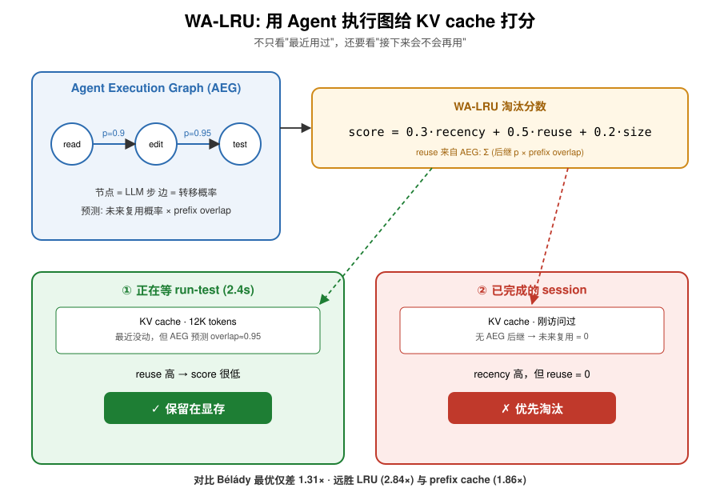
*图示：普通LRU只看'最近用过'，但Agent里一个正在等工具返回的session虽然暂时没动，其实马上还要接着用，不该被踢。SAGA用workflow图预测'下一步大概率还会走哪条路、会复用多少prefix'，把这种未来复用概率直接写进淘汰打分里。这样调度器相当于有了一张Agent的'剧本'，能优先保留还会被读的cache。*

展开技术点 1 详细版

- 技术细节：SAGA把Agent workflow建模成Agent Execution Graph (AEG)：节点是LLM推理步，边带转移概率，节点标注工具类型。WA-LRU淘汰分数由归一化recency、基于AEG预测的未来复用概率、cache大小三项加权组成(α=0.3, β=0.5, γ=0.2)，复用概率由AEG后继节点的转移概率×prefix overlap估计得到。论文给出了经验竞争比定理，并在生产trace上测得相对Bélády最优离线策略只差1.31×，远好于LRU(2.84×)和prefix缓存(1.86×)。
- 通俗讲解：普通LRU只看'最近用过'，但Agent里一个正在等工具返回的session虽然暂时没动，其实马上还要接着用，不该被踢。SAGA用workflow图预测'下一步大概率还会走哪条路、会复用多少prefix'，把这种未来复用概率直接写进淘汰打分里。这样调度器相当于有了一张Agent的'剧本'，能优先保留还会被读的cache。
- 例子：比如一个SWE-bench编码Agent走read-file变成edit-code变成run-test的链，当它在等run-test（可能2.4秒）时，AEG告诉WA-LRU下一节点还会用到当前12K token的上下文、overlap≈0.95，于是这段cache的淘汰分数很低；与此同时一个已完成的session即便最近刚访问，因为没有后继节点，复用概率为0，会被优先淘汰，腾出显存。

#### 技术点 2：工具感知TTL + 会话亲和+work stealing
- 快速理解：按工具类型预测等待时长决定cache保留时间，同时用session亲和+随机偷任务兼顾复用与均衡。

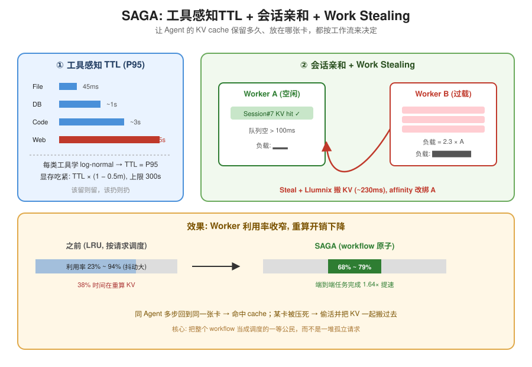
*图示：不同工具的等待时间差异巨大(文件45ms，web调用可能45秒)，固定TTL要么浪费显存要么早早扔掉还要重算。SAGA为每类工具学一条经验分布，按P95来设保留时间，显存紧张时整体缩短。同时，session亲和保证同一个Agent的多步尽量回到同一张卡命中cache，而work stealing防止某些卡被重Agent压死，迁移时cache跟着一起走，不至于搬过去又要重算。*

展开技术点 2 详细版

- 技术细节：对每种工具类型(代码执行/文件/Web/DB)维护log-normal延迟分布，TTL取第p百分位(默认P95)，并按显存压力m线性缩放(pressure-factor=1-0.5m)，上限300s。调度层采用两级：本地调度器按session ID做亲和路由(负载\<0.8θ时回到原worker)；全局协调器在队列空闲\>100ms或最忙/最闲负载比\>2×时触发随机work stealing，迁移用Llumnix做KV cache搬迁，迁移完成后affinity更新到新worker。
- 通俗讲解：不同工具的等待时间差异巨大(文件45ms，web调用可能45秒)，固定TTL要么浪费显存要么早早扔掉还要重算。SAGA为每类工具学一条经验分布，按P95来设保留时间，显存紧张时整体缩短。同时，session亲和保证同一个Agent的多步尽量回到同一张卡命中cache，而work stealing防止某些卡被重Agent压死，迁移时cache跟着一起走，不至于搬过去又要重算。
- 例子：一个WebArena任务在worker A上跑了10步，cache命中良好；突然它调用一个web API，TTL按Web类P95设成~4.5s。此时worker A队列空，协调器发现worker B负载是A的2.3倍，从B偷一个待处理session，Llumnix迁移其KV cache(均值230ms)到A；迁移完成后该session的亲和绑到A。论文实测worker利用率从不偷任务时的23-94%收窄到68-79%。

#### 技术点 3：Agent Fair Share任务级公平
- 快速理解：以任务完成紧迫度而非请求数分配算力，Lyapunov drift证明TCT有界偏离。

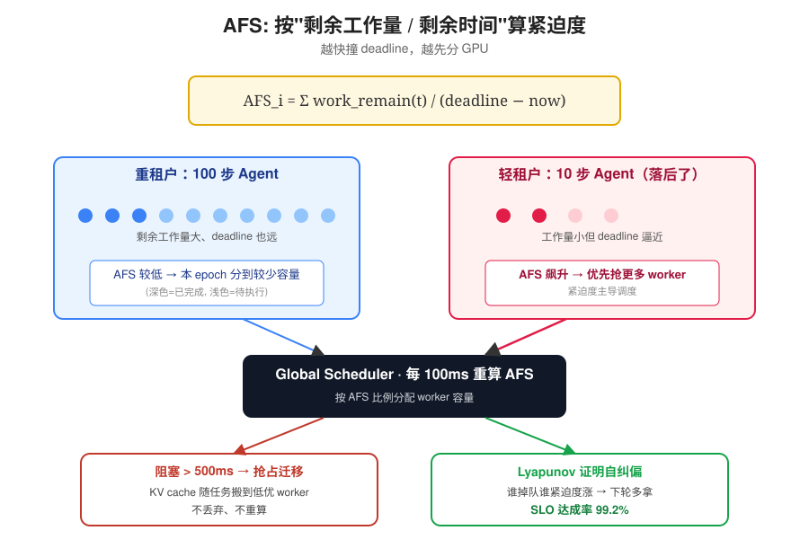
*图示：传统公平调度按请求数或时间片切，但跑10步Agent和跑100步Agent的租户需求完全不同。AFS把'还剩多少活、离deadline多近'直接算成紧迫度，越临近越优先。数学上这是个自纠偏机制：谁掉队谁紧迫度涨、下一轮就多分到容量，作者用Lyapunov drift正式证明这个回拉力足够强，保证完成时间不会偏得太离谱。*

展开技术点 3 详细版

- 技术细节：AFS-i = 求和 work-remain(t)/(deadline(t)-t-now)，其中work-remain由AEG剩余节点的预估prefill+decode时间累加得到。每100ms一个epoch重算AFS，按比例分配worker容量，低AFS任务阻塞高AFS超过500ms时触发Llumnix抢占迁移（而非丢弃cache）。作者用Lyapunov函数V(t)=求和(S-i(t)-μ-i t)²证明在总需求\<=容量、异构比ρ有界时，TCT相对期望值的偏离满足ε=O(ρ·√(log(N/δ)/n))，实测多租户下SLO达成率99.2%。
- 通俗讲解：传统公平调度按请求数或时间片切，但跑10步Agent和跑100步Agent的租户需求完全不同。AFS把'还剩多少活、离deadline多近'直接算成紧迫度，越临近越优先。数学上这是个自纠偏机制：谁掉队谁紧迫度涨、下一轮就多分到容量，作者用Lyapunov drift正式证明这个回拉力足够强，保证完成时间不会偏得太离谱。
- 例子：多租户场景下3个重租户跑100步Agent、3个轻租户跑10步Agent。某一epoch轻租户服务量落后其比例份额，urgency升高，AFS把更多worker容量分给它；如果此时一个重租户的低AFS任务占住了worker超过500ms，协调器触发抢占，把它的KV cache迁到低优先级worker继续跑而不是丢弃，最终实测99.2%任务都满足1.5×期望时间的SLO。

#### 技术点 4：吞吐换延迟的明确取舍
- 快速理解：用约30%峰值吞吐换1.64×延迟降幅，坦白承认这只适合交互式部署。

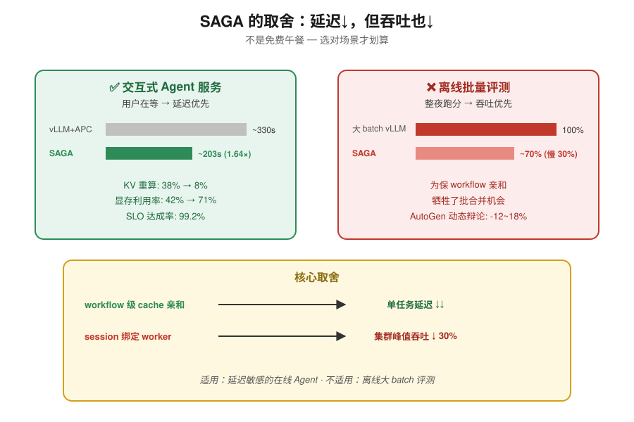
*图示：SAGA不是免费午餐：为了保workflow cache和session亲和，它会牺牲一部分批处理合并机会，峰值吞吐下降约30%。作者自己把适用场景划在'延迟敏感的交互式Agent部署'，批量离线跑分这种场景并不推荐用。对做平台的人来说，这种坦率的tradeoff比只报喜的论文更有参考价值。*

展开技术点 4 详细版

- 技术细节：在64卡A100上对比vLLM v0.15.1+APC+affinity router，SAGA在SWE-bench/WebArena上分别取得1.73±0.11×和1.55±0.09×的TCT提升(几何均值1.64×, p\<0.001)，显存利用率从42%变成71%，KV重生成时间占比从38%变成8%。但论文也明确列出：峰值吞吐比throughput-optimal batch调度低约30%，对不具workflow观测的框架(AutoGen多Agent动态辩论)有12-18% TCT退化，冷启动前30个任务退化\<=8%，评测只覆盖Llama-3-70B、未验证MoE和\>95%显存过载场景。
- 通俗讲解：SAGA不是免费午餐：为了保workflow cache和session亲和，它会牺牲一部分批处理合并机会，峰值吞吐下降约30%。作者自己把适用场景划在'延迟敏感的交互式Agent部署'，批量离线跑分这种场景并不推荐用。对做平台的人来说，这种坦率的tradeoff比只报喜的论文更有参考价值。
- 例子：如果你用SAGA跑一个面向用户的SWE-bench类编码Agent服务，平均任务完成从vLLM+APC的~330s降到~203s、99.2%满足SLO，体验明显好；但如果你想最大化整晚的离线评测吞吐，SAGA反而会比throughput-optimal的批调度慢约30%，此时应该关掉SAGA直接用大batch vLLM。

- **对 Agent 产品/系统的启发：** 做Agent平台就该把workflow当调度单位，session级cache保留+任务级公平能直接换来几倍体验提升。

展开 Agent 启发详细版

- **详细启发：** 产品侧：面向Agent的推理网关/平台应提供workflow级调度能力：让LangChain、AutoGen等框架通过callback或日志把AEG传给runtime，就能显著降低多步任务延迟、提高显存利用率；对按任务计费或承诺SLA的产品(编码Agent、浏览器Agent)，这是性价比很高的系统改造。；系统侧：建议把调度单元从'请求'上移到'workflow/session'，配套三件套：(1)按session ID而不仅prefix做亲和路由；(2)按工具类型学延迟分布做cache TTL，而不是一刀切LRU；(3)任务级公平指标(AFS)替代请求级公平，并用支持KV迁移的runtime(如Llumnix)做抢占，避免重算。迁移触发阈值和load ratio需要配合，防止thrashing。；风险：收益依赖workflow可观测性：没有框架hint时要靠模式推断，会有10-18%退化；多Agent动态辩论场景结构频繁变化，AEG预测误差会放大Theorem 3里的ε·k\_max项。另外峰值吞吐下降约30%、只在Llama-3-70B单模型族验证、\>95%显存过载和MoE场景未实证，批量/离线和超大模型部署前需要自己测；TTL假设工具延迟分布稳定，遇到\>5×P99的尾部事件仍会触发淘汰重算。

### 3. To Call or Not to Call: A Framework to Assess and Optimize LLM Tool Calling
- **方向：** tool\_use
- **评分：** 相关性 92 | 价值 82 | 有趣性 78 | 创新性 78 | 开拓性 75
- **为什么入选：** 把'要不要调工具'拆成必要性/效用/成本三维，还能用隐状态做运行时控制器
- **快速背景：** LLM 自己决定调不调工具经常踩偏，调多了伤性能，调少了漏信息。
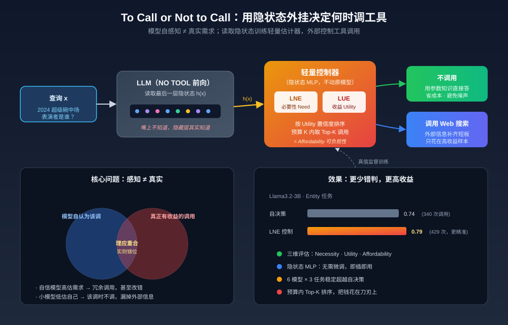
*图示：这篇直接针对 Agent 最核心的动作——'到底该不该调工具'，提出了可量化的三维评估框架，并给出一个不用微调、基于隐状态的轻量控制器，能在 6 个模型 3 个任务上同时提升准确率和降低调用次数，非常贴近 Agent 工程落地。*

展开论文背景详细版

- **详细背景：** 当前 Agent 让 LLM 自行决定是否调用工具（如 Web 搜索），但评测通常只看总体准确率，没法分辨某一次调用到底是必要、冗余还是有害。作者观察到：总是调工具虽能提升平均分，但最优策略能用更少调用拿到更高分，说明模型自己的判断离最优还差一大截。为此需要一个能细粒度评估和改进 tool calling 决策的框架。
- **详细入选理由：** 这篇直接针对 Agent 最核心的动作——'到底该不该调工具'，提出了可量化的三维评估框架，并给出一个不用微调、基于隐状态的轻量控制器，能在 6 个模型 3 个任务上同时提升准确率和降低调用次数，非常贴近 Agent 工程落地。

**核心技术点速览：**

#### 技术点 1：三维决策框架
- 快速理解：把调工具决策拆成必要性、效用、可负担性三个可测维度

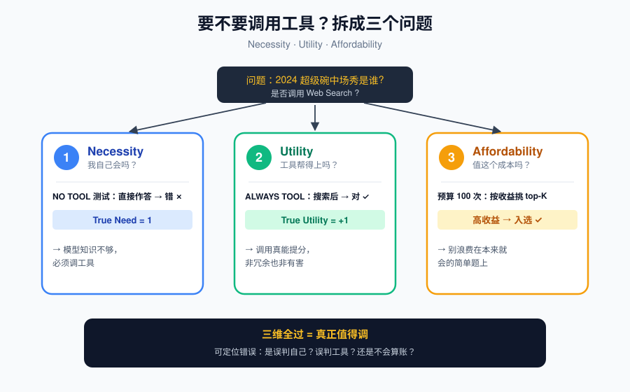
*图示：以前只问'调完之后效果好不好'，这里进一步拆成三个问题：我自己能不能做？工具能不能帮上？值不值这个成本？拆开之后就能定位问题——是模型误判了自己能力，还是误判了工具能力，或者不会算账。*

展开技术点 1 详细版

- 技术细节：论文借鉴理性选择理论，把一次工具调用决策拆成三个维度：Necessity（模型光靠参数知识能不能搞定）、Utility（调了工具会变好还是变坏）、Affordability（在预算内是否值得调）。每个维度都同时定义'真值'（通过对比 NO TOOL 与 ALWAYS TOOL 的表现得到）和'模型自感知值'（通过模型自身的回答或调用行为得到）。
- 通俗讲解：以前只问'调完之后效果好不好'，这里进一步拆成三个问题：我自己能不能做？工具能不能帮上？值不值这个成本？拆开之后就能定位问题——是模型误判了自己能力，还是误判了工具能力，或者不会算账。
- 例子：对于 '2024 超级碗中场秀的表演者是谁' 这种问题：NO TOOL 模型答错说明 True Need=1；ALWAYS TOOL 答对说明 True Utility=+1；如果预算只够调 100 次，那就该把这种高收益的问题排进 top-K，而不是浪费在它本来就会的 'RL 模型是什么' 上。

#### 技术点 2：感知与真实严重错位
- 快速理解：模型内部自洽但与真实需求脱节，导致大量多调漏调

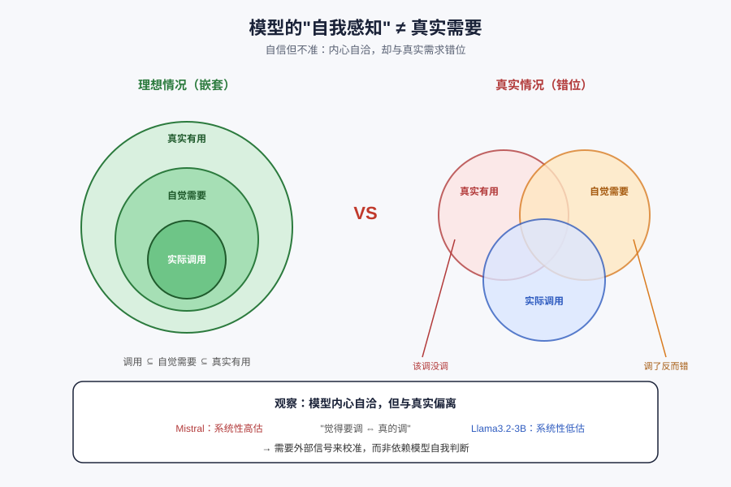
*图示：模型像一个自信但不准的人：它内心的逻辑是一致的——觉得需要帮助就会去调工具——但它对'自己到底会不会'的判断本身就不准。结果就是：真该调的时候没调，不该调的时候反而调了，而且调了之后有时反而把原本对的答案改错。*

展开技术点 2 详细版

- 技术细节：通过对比真实 need/utility 与模型自报的 perceived need/utility，作者发现：模型自己的 '我需要帮助' 和 '我要调工具' 是相关的（自洽），但都与真实需求显著偏离。有些模型（如 Mistral）普遍高估需求，小模型（如 Llama3.2-3B）则普遍低估；理想情况下 Perceived Utility ⊆ Perceived Need ⊆ True Positive Utility，但实际完全不嵌套。
- 通俗讲解：模型像一个自信但不准的人：它内心的逻辑是一致的——觉得需要帮助就会去调工具——但它对'自己到底会不会'的判断本身就不准。结果就是：真该调的时候没调，不该调的时候反而调了，而且调了之后有时反而把原本对的答案改错。
- 例子：论文 Figure 4 中，GPT-OSS-120B 在 Entity 任务上真正能从搜索获益的样本和它自己决定要调的样本只有部分重叠，还有 44 个样本它觉得需要帮助但没触发调用，33 个样本调了但其实没帮助。

#### 技术点 3：隐状态轻量估计器
- 快速理解：用最后一层隐状态训 MLP 预测真实必要性与效用，无需微调

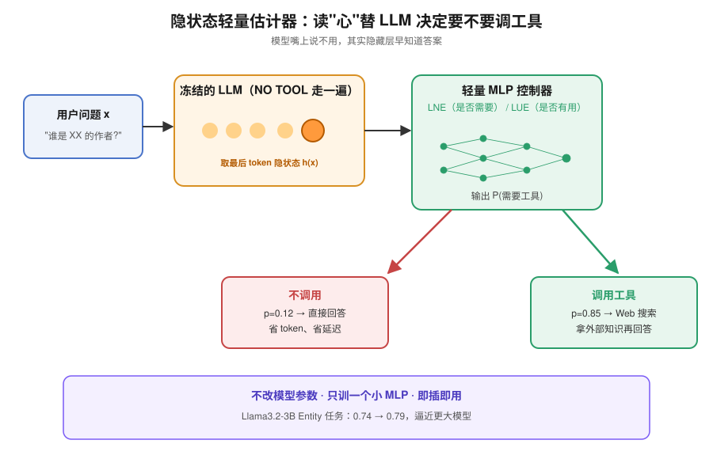
*图示：研究发现模型'嘴上说不需要'但隐藏层其实已经知道自己会不会。于是作者直接读取隐藏层向量，训练一个小分类器当'外挂教练'，由它替模型做调用决定。由于只是一个小 MLP，部署成本很低，任何预训练模型都能接。*

展开技术点 3 详细版

- 技术细节：作者训练两个轻量 MLP 分类器：LNE（Latent Need Estimator）用 NO TOOL 下最后一个 token 的隐状态预测 True Need；LUE（Latent Utility Estimator）有两个变体，分别用 NO TOOL 隐状态（LUEx）或加入工具描述后的隐状态（LUEx,dF）预测 True Utility。训练完即可作为外部控制器插在推理之前判断是否调用，整个过程不改动原模型参数。
- 通俗讲解：研究发现模型'嘴上说不需要'但隐藏层其实已经知道自己会不会。于是作者直接读取隐藏层向量，训练一个小分类器当'外挂教练'，由它替模型做调用决定。由于只是一个小 MLP，部署成本很低，任何预训练模型都能接。
- 例子：对一条新问题，先让模型走一遍 NO TOOL 推理拿到最后 token 的隐状态 h(x)，LNE 输出 '需要调工具' 的概率 0.85，控制器就决定调 Web 搜索；在 Entity 任务上 Llama3.2-3B 用这种方式把分数从 self-decision 的 0.74（340 次调用）提到 0.79（429 次调用），接近更大的模型。

#### 技术点 4：预算感知排序调用
- 快速理解：按 LUE 置信度排序选 top-K，让有限预算花在刀刃上

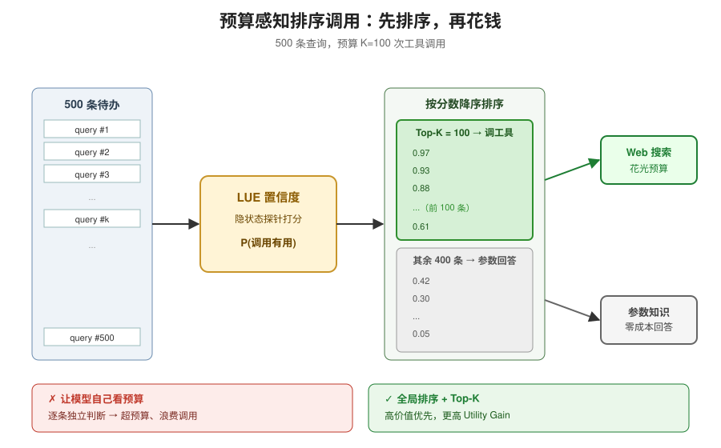
*图示：与其让模型一条一条独立判断 '这次值不值调'，不如让它先给所有待办排个序，把最可能受益的排前面，预算只够调多少就调多少。这样既避免了模型算不清钱的问题，也保证高价值调用不被浪费。*

展开技术点 4 详细版

- 技术细节：论文没单独训 affordability 模型，而是用 LUE 输出的置信度对所有待处理样本排序，在给定预算 K 下选出 top-K 调工具，从而得到预算感知策略。对比实验显示，模型自身在显式给出预算/单次成本时仍会违反预算，尤其是 Gemma、Qwen3-30B-IT 在 \>$50/次时仍过度调用；而基于 LUE 的外部排序能稳定拿到更高的 Utility Gain。
- 通俗讲解：与其让模型一条一条独立判断 '这次值不值调'，不如让它先给所有待办排个序，把最可能受益的排前面，预算只够调多少就调多少。这样既避免了模型算不清钱的问题，也保证高价值调用不被浪费。
- 例子：500 条 Entity 查询、预算只够 100 次调用时：让 LUE 给每条打一个 '调了会有用' 的概率，按概率降序取前 100 条调 Web 搜索，其余直接用参数知识回答。结果显示，这种排序比模型自己在 prompt 里被告知预算后做的决定拿到更高的真实收益。

#### 技术点 5：Need 比 Utility 更易学
- 快速理解：预测'要不要帮'比预测'工具会不会帮'更靠谱

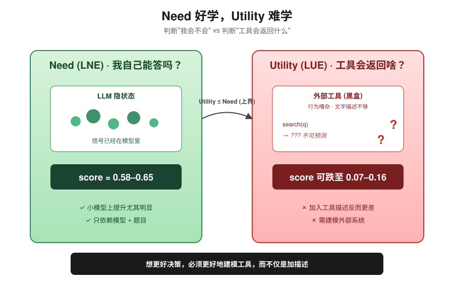
*图示：判断'自己能不能做'只跟模型和题目有关，模型内部本来就有信号，比较好学；但判断'外部工具会返回什么、有没有用'，需要预测一个外部系统，这件事天然更难，现在的工具描述也不够好。所以想逼近 oracle，光做控制器还不够，还得更好地建模工具。*

展开技术点 5 详细版

- 技术细节：实验发现 LNE 提升幅度稳定且在小模型上尤为明显，而 LUEx,dF（加入工具描述）相比 LUEx 并没有稳定收益，有时反而更差。作者在理论部分指出：Utility 的上界是 Need，并且预测 Utility 本质上需要建模工具行为本身，而工具行为可能嘈杂、难以通过文字描述刻画。
- 通俗讲解：判断'自己能不能做'只跟模型和题目有关，模型内部本来就有信号，比较好学；但判断'外部工具会返回什么、有没有用'，需要预测一个外部系统，这件事天然更难，现在的工具描述也不够好。所以想逼近 oracle，光做控制器还不够，还得更好地建模工具。
- 例子：在 BFCL 任务上，LNE 达到 0.58-0.65 的分数，而加入工具描述的 LUEx,dF 在部分模型上反而掉到 0.07-0.16，说明当前工具描述作为输入信号反而噪声大于信号。

- **对 Agent 产品/系统的启发：** 给 Agent 加一个读隐状态的'要不要调'控制器，比让模型自己决定更稳、更省钱。

展开 Agent 启发详细版

- **详细启发：** 产品侧：构建 Agent 产品时，不要完全信赖 LLM 自己判断的 '我需要搜一下'：可以在调用层加一个基于隐状态的轻量分类器来决定是否触发工具，并把所有待处理任务按预测收益排序后再分配调用预算，从而同时提升回答质量与控制 API 成本。；系统侧：系统设计上可以把 tool calling 解耦成三层——必要性判断、效用预估、预算分配，分别由独立模块（甚至独立小模型）负责，让主 LLM 专注生成。隐状态可以在同一次前向中顺便抽出来喂给 MLP 控制器，延迟开销几乎可以忽略。对评测也有启示：不要只看整体准确率，应该单独报告'必要调用率''有害调用率'和'预算内收益'。；风险：控制器本身不完美，会带来新的误判；隐状态依赖具体模型，一旦底座换版本就需要重训。此外，论文只在 Web 搜索这一类工具和 6 个开源模型上验证，对闭源模型、多工具协同、复杂长程 Agent 场景是否同样成立并不确定；工具描述质量会显著影响 Utility 预测，生产中需要对工具文档有规范化约束。

## 四、候选但未完成深读的论文

当前重点论文都已完成可用分析。

## 五、总结

- Agent 研究正从模型能力竞赛转向 runtime 与治理的系统化建设
- 今天的高分论文集中在一个信号上

展开总结详细版

- 今天的高分论文集中在一个信号上：Agent 的瓶颈越来越不在模型本身，而在运行时怎么调度、工具怎么决策、skill 怎么审计。
- 安全侧开始用静态分析和可验证工件去补 prose 策略的漏洞，系统侧开始把 workflow 当作调度一等公民，工具侧开始认真算调用税。
- 对做 Agent 平台的团队来说，这意味着该把精力从'让模型会用工具'升级到'让整个 harness 可测、可控、可审计'。

