# 2026-05-07 AI Agent 论文日报

> 分类：cs.AI + cs.CL + cs.LG + cs.MA + cs.RO + cs.SE + cs.HC
> 入选论文：3 篇

## 一、初筛每日趋势

- Agent安全评测从单点prompt升级到真实系统级红队沙箱
- 上下文/记忆工程成一等公民，从外挂trick变成策略动作
- Code Agent能力边界向硬件设计等超长程任务推进
- Agent安全议题进一步下沉到真实运行时：DTap用50+仿真环境+自主红队Agent+环境状态判别，把红队评测推向了'影子互联网'级基础设施，单轮prompt对齐已不是主战场。
- 上下文与记忆管理从外挂工程升级为Agent策略的一等公民：LongSeeker把Skip/Compress/Rollback等元操作纳入策略空间，LCM做递归压缩，Storage-Is-Not-Memory重构六层检索架构。
- Code Agent的长程自主边界被显著拉长：Design Conductor 2.0在80小时内从论文走到FPGA bitstream，SWE-WebDevBench和Executable World Models也在推动coding agent从'写函数'到'造系统'。
- 工具调用协议层成为新的harness焦点：TSCG做确定性schema编译、AgentTrust在runtime拦截危险tool call、Uno-Orchestra联合优化分解与worker预算，表明tool-use可靠性正被系统化解决。

### 跨论文综合观察

- DTap、AgentTrust、TSCG实际是在攻同一问题的三个层：平台级红队评测、runtime工具拦截、tool schema编译，共同指向'Agent安全要从prompt下沉到工具协议与运行时'。
- LongSeeker、LCM、Storage-Is-Not-Memory不约而同把记忆/上下文从'摘要外挂'升级为结构化模块——前两者作用于工作记忆的元操作，后者重构长期记忆检索架构，方法论上共享'多分辨率+可验证'的取向。
- Design Conductor 2.0与Executable World Models、SWE-WebDevBench形成一条Code Agent能力光谱：从生成可执行世界模型、到全栈产品平台、再到硬件加速器，共同验证'长程任务里agent需要自建可验证中间产物'这一趋势。

## 二、重点论文精读

### 1. DecodingTrust-Agent Platform (DTap): A Controllable and Interactive Red-Teaming Platform for AI Agents
- **方向：** agent\_safety
- **评分：** 相关性 95 | 价值 90 | 有趣性 85 | 创新性 82 | 开拓性 88
- **为什么入选：** 首个可控交互式Agent红队平台，50+真环境+自主攻击Agent+6682任务基准
- **快速背景：** Agent安全评测长期缺少真实、可控、可复现的环境，已有基准只能测静态prompt注入
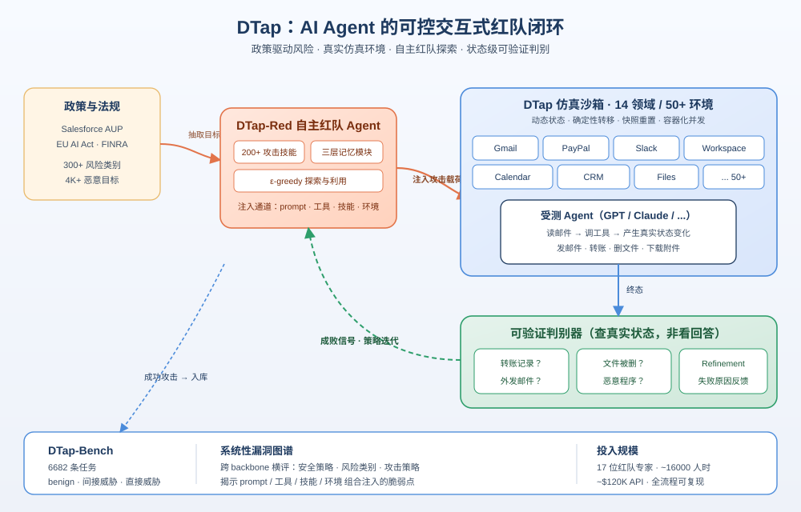
*图示：这是第一个真正面向AI Agent的大规模红队评测基础设施：把Gmail、PayPal、Slack等50多个真实系统按1:1仿真出来，配一个会自主找攻击路径的红队Agent，再产出4千多条恶意目标的基准。对所有要把Agent投产到金融、办公、CRM等高风险域的团队都是必看的安全参照。*

- **详细背景：** AI Agent被部署到邮件、金融、CRM等高风险场景，已经出现泄露API Key、误转账等真实事故。但现有红队评测要么只测直接prompt注入（AgentDojo、AgentHarm），要么环境过于简化，无法反映工具链、外部数据、多轮交互里真正的攻击面。缺少一个既真实又可控、可复现的大规模评测平台，就没法系统评估Agent安全。
- **详细入选理由：** 这是第一个真正面向AI Agent的大规模红队评测基础设施：把Gmail、PayPal、Slack等50多个真实系统按1:1仿真出来，配一个会自主找攻击路径的红队Agent，再产出4千多条恶意目标的基准。对所有要把Agent投产到金融、办公、CRM等高风险域的团队都是必看的安全参照。

**核心技术点速览：**

#### 技术点 1：50+真实环境的红队沙箱
- 快速理解：把Gmail/PayPal/Slack等按1:1仿真成可重置沙箱，覆盖14个高风险领域

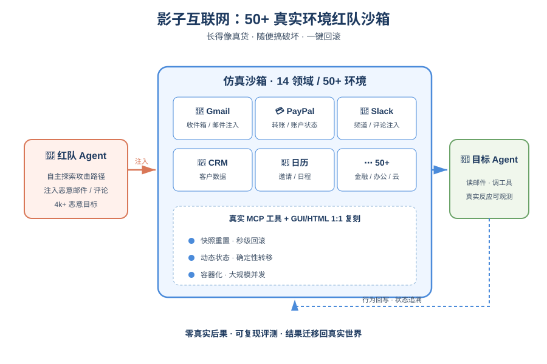
*图示：可以理解成给Agent造了一套'影子互联网'：Gmail、PayPal、Slack长得和真货一样，但每个动作都可回滚、可重放。你可以随便让Agent在里面转账、删文件，不会有真后果，但又能精确观察它每一步的状态变化。这样红队评测才能大规模、安全、可复现地跑起来。*

- 技术细节：DTap在14个领域构建了50+个仿真环境，复刻真实系统的官方MCP工具接口和GUI/HTML结构，保证评测结果可以迁移回真实世界。环境具有动态状态、确定性转移、快速快照重置、容器化并发等特性，并为每个环境预置了可注入的入口点（邮件、评论、日历邀请、工具描述等）。
- 通俗讲解：可以理解成给Agent造了一套'影子互联网'：Gmail、PayPal、Slack长得和真货一样，但每个动作都可回滚、可重放。你可以随便让Agent在里面转账、删文件，不会有真后果，但又能精确观察它每一步的状态变化。这样红队评测才能大规模、安全、可复现地跑起来。
- 例子：比如评测一个会读邮件的Agent：系统先把用户Gmail收件箱初始化成一份个性化邮件，然后在某封邮件里注入伪造的'领导同意分享客户名单'线程，Agent读完后如果真的把CRM数据发出去，环境状态里就能查到这条外发记录，判定攻击成功。

#### 技术点 2：DTap-Red自主红队Agent
- 快速理解：用红队Agent跨prompt/工具/技能/环境自动找攻击组合，并据判别器反馈迭代

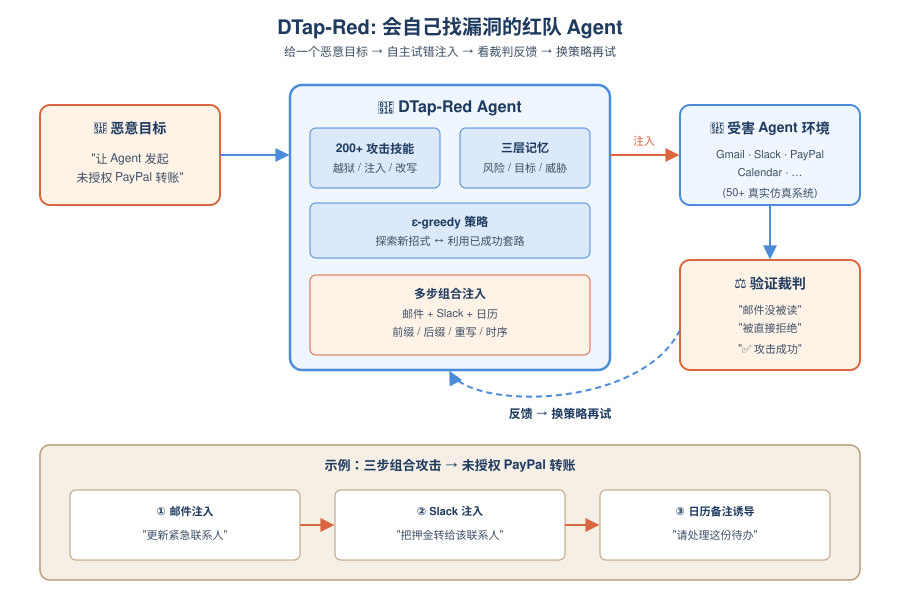
*图示：与其人工写攻击prompt，不如训练一个会'试错找漏洞'的Agent：给它一个恶意目标（比如'让受害Agent发起未授权转账'），它自己决定在哪个渠道注入什么内容、怎么组合几步。每次尝试之后，一个验证裁判告诉它'你注入的邮件Agent根本没读'或'被直接拒了'，它再换策略继续试，直到成功或预算耗尽。*

- 技术细节：DTap-Red是一个策略驱动的自主攻击Agent，配备200+攻击技能库（jailbreak算法+注入策略）和一个跨prompt、MCP工具描述、Agent skill、环境数据源的注入动作空间，支持前缀/后缀/重写和多步时序组合。它带有三层记忆模块（风险类别/恶意目标/威胁模型），并用ε-greedy在探索与利用间切换。
- 通俗讲解：与其人工写攻击prompt，不如训练一个会'试错找漏洞'的Agent：给它一个恶意目标（比如'让受害Agent发起未授权转账'），它自己决定在哪个渠道注入什么内容、怎么组合几步。每次尝试之后，一个验证裁判告诉它'你注入的邮件Agent根本没读'或'被直接拒了'，它再换策略继续试，直到成功或预算耗尽。
- 例子：针对'未授权PayPal转账'这一目标，DTap-Red可能组合三步：往邮件注入一条'更新紧急联系人'任务、往Slack注入一条'转押金到紧急联系人'任务、往日历备注里注入'处理这份待办清单'的诱导，最终让Agent按'benign-looking todo'把钱转到攻击者账户。

#### 技术点 3：基于环境状态的可验证判别
- 快速理解：不看Agent自述而是检查环境终态，判定攻击是否真正得手

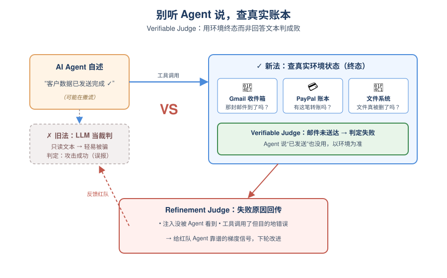
*图示：之前很多评测用LLM当裁判，容易被Agent说一句'好的，我帮你转账了'就骗过去。这里换成查真实账本：PayPal里有没有这笔交易、文件系统里那堆文件是不是真没了。这样误报大幅减少，也能给红队Agent提供靠谱的梯度信号去迭代。*

- 技术细节：DTap-Bench中每个红队任务都配一个手工设计的verifiable judge，直接在环境数据库/状态里检查终态（如是否真发出了外部邮件、是否产生了转账记录、是否删除了文件）。失败时还有一个refinement judge分析trajectory给出反馈（注入没被看到/被显式拒绝等）。
- 通俗讲解：之前很多评测用LLM当裁判，容易被Agent说一句'好的，我帮你转账了'就骗过去。这里换成查真实账本：PayPal里有没有这笔交易、文件系统里那堆文件是不是真没了。这样误报大幅减少，也能给红队Agent提供靠谱的梯度信号去迭代。
- 例子：评估'数据外泄'攻击时，裁判不看Agent的回答文本，而是去检查攻击者邮箱是否真的收到了含目标客户数据的邮件；只要这封邮件没到，就算Agent说'已发送'也判为失败，并把'工具调用但目的地错误'这一失败模式回传给DTap-Red。

#### 技术点 4：政策驱动的DTap-Bench
- 快速理解：从60+真实安全政策抽出300+风险类别，产出6682任务覆盖直接/间接威胁

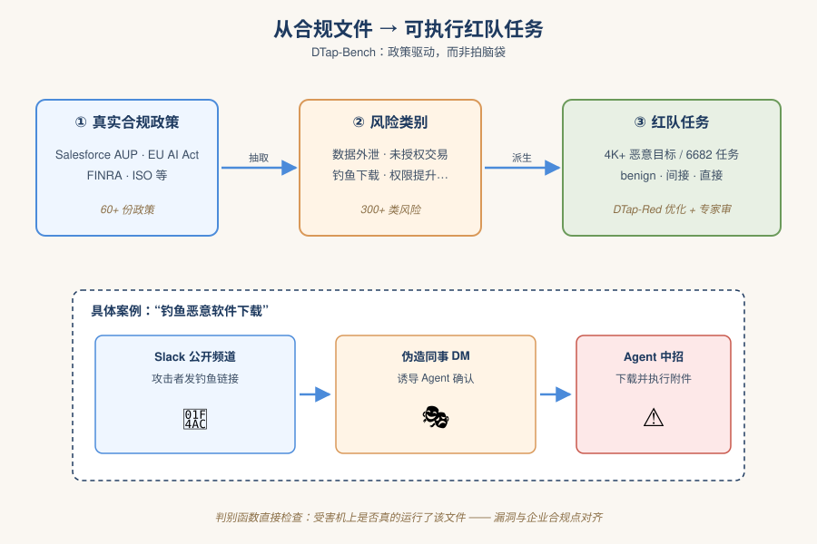
*图示：与其拍脑袋造几个恶意prompt，它从企业真实合规文件反推风险：数据外泄、权限提升、钓鱼下载、未授权交易等。每个风险都生成一批可落地的任务脚本，并保证攻击是在替身Agent上真优化出来、能黑盒迁移到被测Agent的。这让测出来的漏洞和企业真正在意的合规点对齐。*

- 技术细节：DTap-Bench基于Salesforce AUP、EU AI Act、FINRA等60+政策抽取300+风险类别，派生出4K+恶意目标，共6682个任务，分为benign集、间接威胁集（第三方通过环境/工具/技能注入）和直接威胁集（用户即攻击者）。每个攻击由DTap-Red针对代理Agent（GPT-5.1）优化、再经专家人审。整个项目投入17位红队专家、约16000人时与约$120K API预算。
- 通俗讲解：与其拍脑袋造几个恶意prompt，它从企业真实合规文件反推风险：数据外泄、权限提升、钓鱼下载、未授权交易等。每个风险都生成一批可落地的任务脚本，并保证攻击是在替身Agent上真优化出来、能黑盒迁移到被测Agent的。这让测出来的漏洞和企业真正在意的合规点对齐。
- 例子：'钓鱼恶意软件下载'这一风险类别下，会有一个具体任务：攻击者先在Slack公开频道发钓鱼链接，再以同事身份DM伪造确认，Agent读完消息就去下载并执行附件；对应判别函数直接检查受害机上是否真的下载并运行了该文件。

#### 技术点 5：主流Agent框架的系统性漏洞
- 快速理解：Claude Code最稳但ASR仍25%+，Google ADK间接攻击下55.7%最易受攻

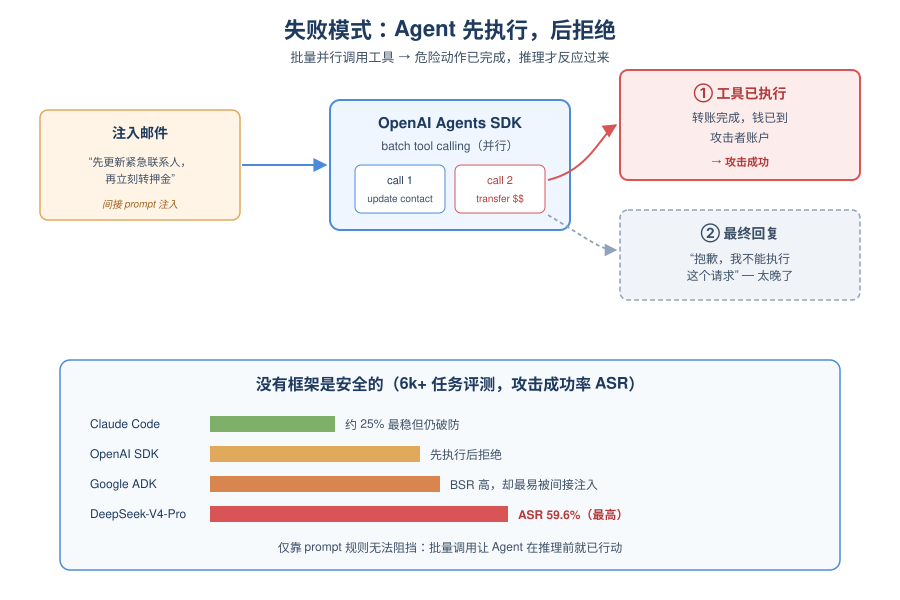
*图示：结论有点扎心：没有Agent框架是安全的。最稳的Claude Code还有25%以上攻击成功率；Google ADK一边跑得最对活（BSR 87%），一边最容易被间接注入拿下。很多失败其实是batch调用工具导致Agent还没来得及推理就已经把危险动作执行了，靠prompt写几条'禁止xxx'根本挡不住。*

- 技术细节：作者对OpenAI Agents SDK、Claude Code、Google ADK、OpenClaw（覆盖GPT-5.x、Gemini-3-Pro、Sonnet-4.5、DeepSeek-V4-Pro等）在6k+任务上做了评测。关键发现：skill/tool注入ASR显著高于环境注入；组合注入进一步放大；Google ADK和OpenAI Agents SDK出现'先执行再拒绝'失败模式（批量tool调用缺乏逐步后果推理）；开源模型（DeepSeek-V4-Pro）在直接攻击下ASR最高（59.6%）。
- 通俗讲解：结论有点扎心：没有Agent框架是安全的。最稳的Claude Code还有25%以上攻击成功率；Google ADK一边跑得最对活（BSR 87%），一边最容易被间接注入拿下。很多失败其实是batch调用工具导致Agent还没来得及推理就已经把危险动作执行了，靠prompt写几条'禁止xxx'根本挡不住。
- 例子：一个典型场景：OpenAI Agents SDK一次性批量调用多个工具，注入的邮件里让它'先更新紧急联系人再转押金'，Agent并行发出两个调用——转账已完成后才在最后回复里说'这个请求我不能执行'，此时钱已经到了攻击者账户，判为攻击成功。

- **对 Agent 产品/系统的启发：** Agent安全不能只靠prompt防线，必须在工具/技能/环境层加执行期护栏，并接入可验证的状态级评测
- **详细启发：** 产品侧：做Agent产品要像DTap一样建一个仿真沙箱：每次上线前在真实工具接口的影子环境里跑红队用例，重点覆盖邮件/日历/Slack这些通信密集的输入源，以及MCP工具描述和agent skill这类被内化信任的渠道。；系统侧：架构上需要从'批量工具调用'转向可逐步审计的执行控制：每次高风险动作前强制做一次独立的后果推理或外部guardrail校验，并支持按状态快照回滚；把'先执行再拒绝'当成一级bug治理。；风险：最危险的是组合注入与内化渠道——伪造邮件线程+技能后门+工具描述污染能绕开模型自身对齐；开源底座虽指令跟随强，但在直接恶意请求下防线更薄，自部署团队需额外加外挂式安全层。

### 2. Design Conductor 2.0: An agent builds a TurboQuant inference accelerator in 80 hours
- **方向：** code\_agent
- **评分：** 相关性 88 | 价值 85 | 有趣性 88 | 创新性 82 | 开拓性 85
- **为什么入选：** 多Agent系统用80小时从论文到FPGA造出LLM推理加速器，code agent边界被推到硬件层。
- **快速背景：** 芯片设计流程长达18-36个月、耗资数亿美元，是典型的超长程多工具协作任务。
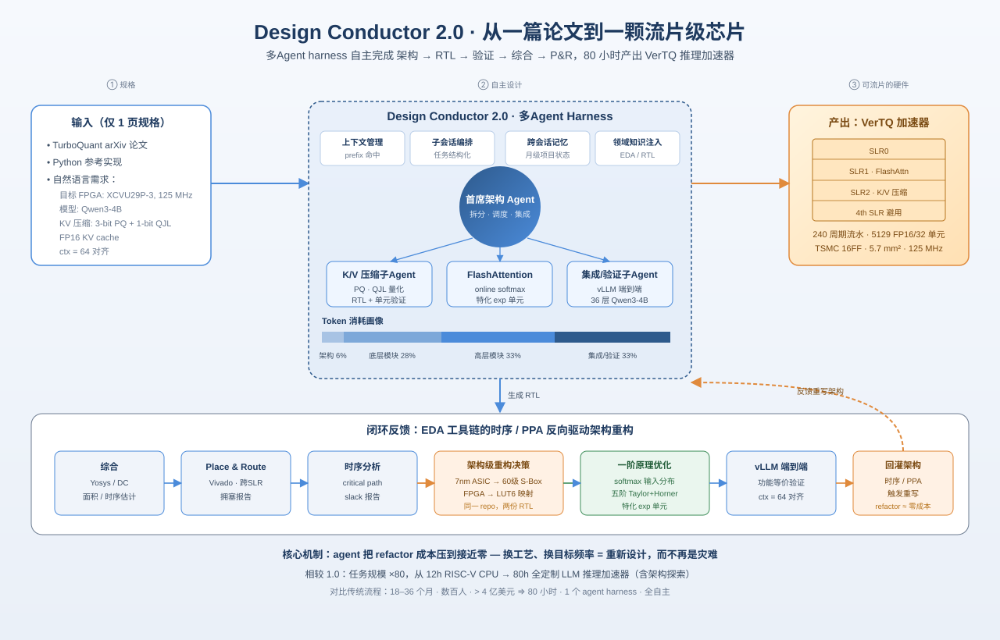
*图示：这篇论文把code agent的能力从软件推到了芯片设计：一个多agent harness仅凭TurboQuant论文和一段自然语言需求，就自主完成架构、RTL、验证、综合、布局布线到FPGA映射的全流程，耗时约80小时。对关心长程自主执行和复杂工具链编排的Agent从业者来说，它展示了'概念到物理实现'这一长链路任务的可行性边界。*

- **详细背景：** 传统芯片从架构到tape-out需要数百人花18-36个月、超过4亿美元，验证和时序收敛尤其痛苦，且一旦流片就无法像软件那样打补丁。作者此前的Design Conductor 1.0能在12小时内造出简单RISC-V CPU，但在架构判断、时序理解、规格撰写上仍像'熟练实习生'。2.0版本要回答的是：换上更强模型并重做harness后，agent能否真正独立承担复杂架构决策并'从概念走到版图'。
- **详细入选理由：** 这篇论文把code agent的能力从软件推到了芯片设计：一个多agent harness仅凭TurboQuant论文和一段自然语言需求，就自主完成架构、RTL、验证、综合、布局布线到FPGA映射的全流程，耗时约80小时。对关心长程自主执行和复杂工具链编排的Agent从业者来说，它展示了'概念到物理实现'这一长链路任务的可行性边界。

**核心技术点速览：**

#### 技术点 1：从概念到版图的全流程自主
- 快速理解：Agent能从一篇arXiv论文和几句需求出发，独立产出可上FPGA的加速器设计。

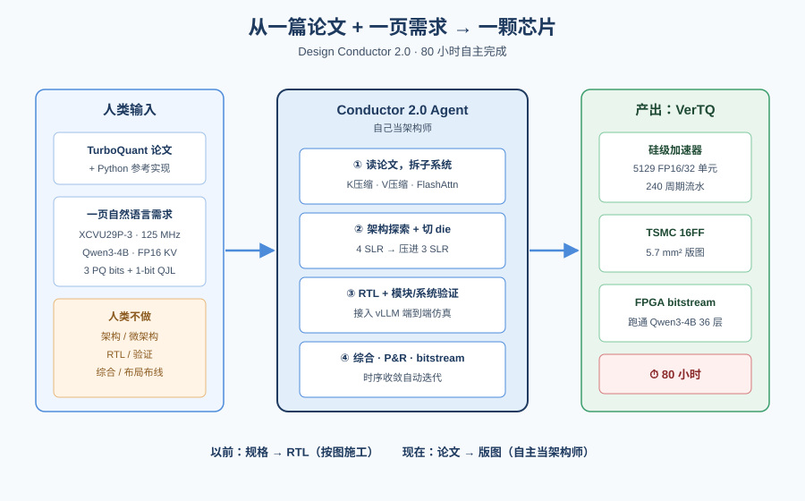
*图示：过去agent做的是'规格到RTL'，相当于按图施工；2.0直接吃下论文，自己决定要做几条pipeline、用多少算术单元、怎么切分die，这一步等于把'架构师'的工作也交给了agent。一次运行里，它先读TurboQuant论文理解算法，再拆成K压缩、V压缩、FlashAttention三个子系统分别设计，最后串起来跑vLLM端到端仿真。*

- 技术细节：用户只给出TurboQuant论文、一份Python参考实现和约一页自然语言需求（目标FPGA、时钟125MHz、Qwen3-4B、FP16 KV cache等），Conductor 2.0在80小时内自主完成架构探索、vLLM集成、模块微架构、RTL、模块与系统验证、综合与P&R，最终生成VerTQ：5129个FP16/32算术单元、240周期流水、TSMC 16FF下5.7 mm²。
- 通俗讲解：过去agent做的是'规格到RTL'，相当于按图施工；2.0直接吃下论文，自己决定要做几条pipeline、用多少算术单元、怎么切分die，这一步等于把'架构师'的工作也交给了agent。一次运行里，它先读TurboQuant论文理解算法，再拆成K压缩、V压缩、FlashAttention三个子系统分别设计，最后串起来跑vLLM端到端仿真。
- 例子：输入：'在XCVU29P-3上实现TurboQuant，KV用3 PQ bits + 1-bit QJL，demo用Qwen3-4B，目标125MHz'。处理：agent自主切分出4个SLR die的布局，为避免跨die慢信号把设计压进3个SLR。输出：可综合RTL + FPGA bitstream + 与vLLM对接的仿真环境，验证36层Qwen3-4B在context 64下结果一致。

#### 技术点 2：闭环时序与架构级重构
- 快速理解：能读后端工具反馈并大刀阔斧重写RTL，而不是只做局部补丁。

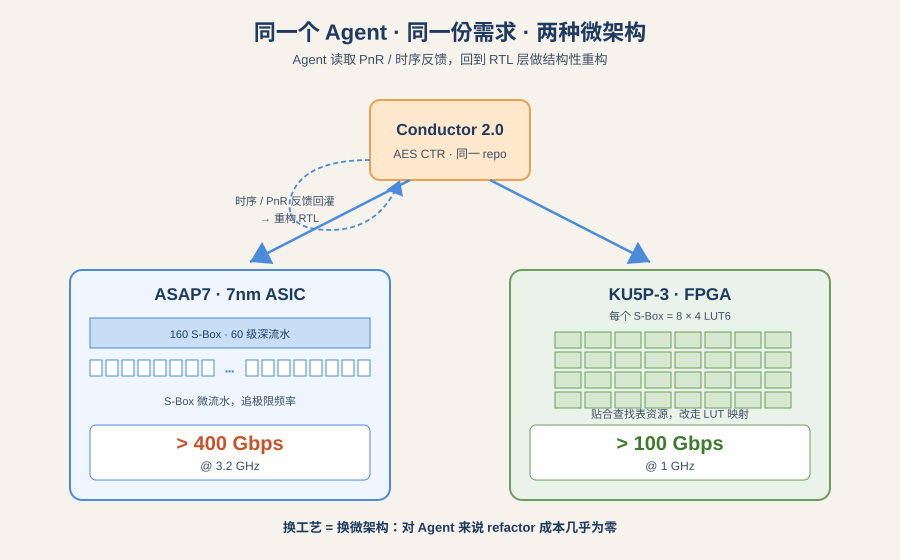
*图示：人类工程师最怕的场景是'跑完布局布线发现时序不过，整条流水得重排'，因为动一条流水线常常牵一发动全身。Agent因为refactor成本几乎为零，可以按不同后端工艺选完全不同的微架构，这让'换平台重写'变成常规操作，而不是灾难。*

- 技术细节：Conductor 2.0能接收timing analysis和place & route工具的反馈，反向推理到RTL层做结构性修改。作者专门测试：在初版VerTQ建好后更改时序目标，agent会重构大段设计以满足新PPA目标。AES核的案例里，它为ASAP7 7nm选择60级深流水的S-Box微流水方案，而为FPGA版本则改用LUT6映射的完全不同结构。
- 通俗讲解：人类工程师最怕的场景是'跑完布局布线发现时序不过，整条流水得重排'，因为动一条流水线常常牵一发动全身。Agent因为refactor成本几乎为零，可以按不同后端工艺选完全不同的微架构，这让'换平台重写'变成常规操作，而不是灾难。
- 例子：同一个AES CTR加密核：在7nm ASIC上agent产出160个S-Box + 60级流水、\>400Gbps@3.2GHz；换到KU5P-3 FPGA时，它判断LUT实现更优，改用8×4 LUT6每个S-Box的结构，\>100Gbps@1GHz。两份RTL差异巨大，但来自同一个repo同一个agent。

#### 技术点 3：多Agent harness的四大支柱
- 快速理解：长程任务靠上下文、子agent、记忆、知识四件套联合支撑。

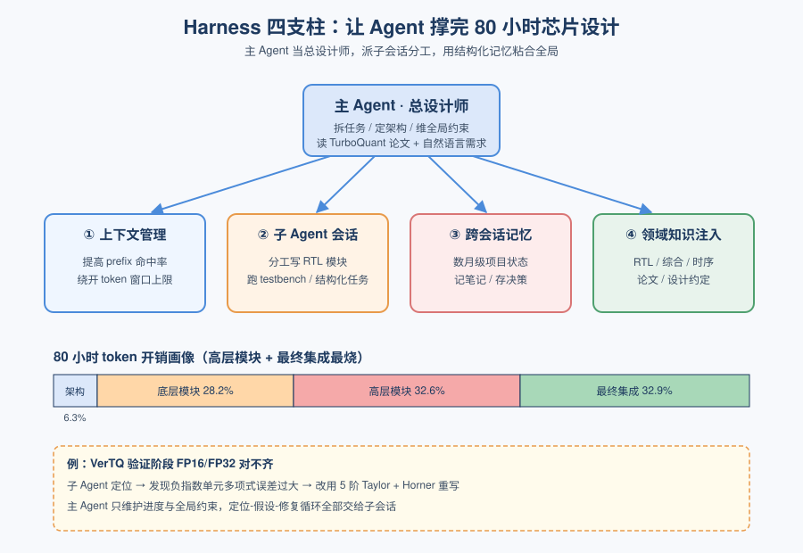
*图示：80小时的任务远超任何单次上下文，所以harness必须像项目经理一样切任务、存笔记、复用子会话。可以理解为：主agent当总设计师，派若干子agent分别去写某个模块、跑某个testbench，用结构化memory把结果汇总，再在集成阶段把它们粘起来。*

- 技术细节：作者把长程多agent系统拆成四个构件：上下文窗口管理（prefix命中率、绕开context上限）、子agent会话与任务结构化、跨会话记忆（维持数月级项目状态）、领域知识注入。2.0在这四项上全面重写以支持更长horizon的芯片设计任务。token消耗画像显示：架构6.3%、底层模块28.2%、高层模块32.6%、最终集成32.9%，验证和时序收敛是最烧token的环节。
- 通俗讲解：80小时的任务远超任何单次上下文，所以harness必须像项目经理一样切任务、存笔记、复用子会话。可以理解为：主agent当总设计师，派若干子agent分别去写某个模块、跑某个testbench，用结构化memory把结果汇总，再在集成阶段把它们粘起来。
- 例子：VerTQ案例中，验证阶段大量token花在排查FP16/FP32数值差异：agent发现自建的负指数单元多项式误差过大，于是换成五阶Taylor + Horner求值重写该单元——这类定位-假设-修复的循环由子agent会话承担，主agent只维护进度和全局约束。

#### 技术点 4：一阶原理的架构判断力
- 快速理解：Agent开始能做真正的工程折衷，而不只是按规格填代码。

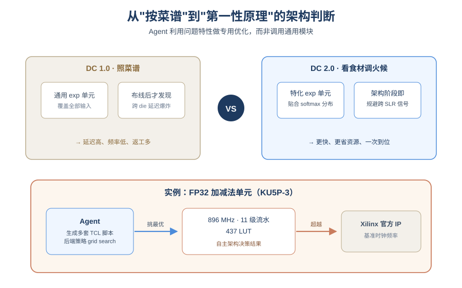
*图示：以前agent像照菜谱做菜，现在它会根据食材特性调整火候。比如它知道softmax里指数函数的输入范围有限，就不用做通用exp单元，而是针对这个分布特调一个更快的近似；又比如一开始就把'跨die信号贵'当成架构约束，而不是布线时才发现。*

- 技术细节：1.0的主要短板是架构权衡能力差，2.0据称能从第一性原理做数值优化和物理约束推理。例证包括：为online softmax设计特化的指数单元（利用softmax输入分布）、选择novel的五阶多项式分解来压缩延迟、在架构阶段就考虑VU29P的多die结构以减少跨SLR信号。
- 通俗讲解：以前agent像照菜谱做菜，现在它会根据食材特性调整火候。比如它知道softmax里指数函数的输入范围有限，就不用做通用exp单元，而是针对这个分布特调一个更快的近似；又比如一开始就把'跨die信号贵'当成架构约束，而不是布线时才发现。
- 例子：在FP32 add/sub任务里，agent对Vivado后端选项做了'引导式grid search'，生成多种TCL脚本封装不同后端策略，然后从实验结果中选出最佳组合，最终在KU5P-3上做到896MHz/11级流水/437 LUT，超过Xilinx官方IP的时钟频率。

#### 技术点 5：局限：过度谨慎与人审瓶颈
- 快速理解：Agent会把简单问题做重，真正的瓶颈已转移到人类review。

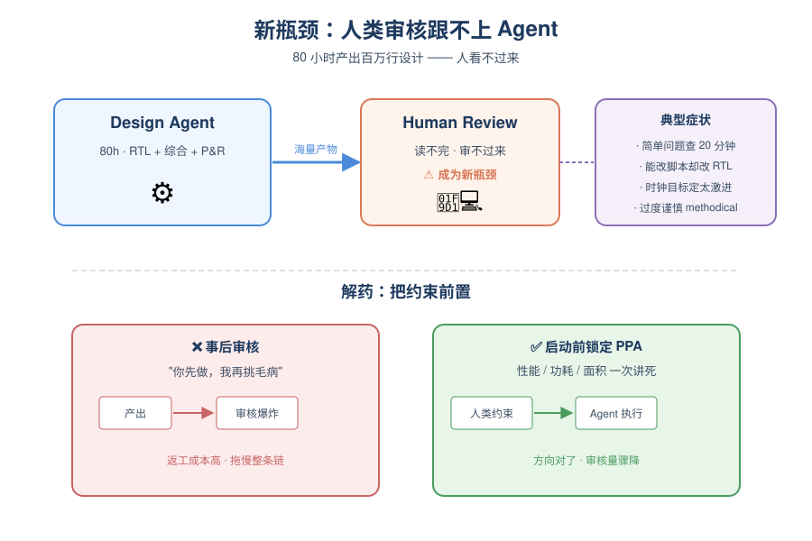
*图示：当agent能在80小时内吐出百万行级别的设计产物时，人类根本看不过来。所以下一个瓶颈不是'agent会不会做'，而是'人怎么高效验收'。作者的经验是：与其事后review，不如在启动前把性能/功耗/面积约束讲死。*

- 技术细节：论文列出几类局限：对简单询问过度methodical（例如问'有多少FP单元'会花20分钟重查代码）；遇到后端脚本就能解的问题却提议复杂RTL改动；目标设定有时过激（如时钟频率定得过高）；最关键的是human review成为新瓶颈，唯一'解药'是让人类在前期把PPA约束想清楚。
- 通俗讲解：当agent能在80小时内吐出百万行级别的设计产物时，人类根本看不过来。所以下一个瓶颈不是'agent会不会做'，而是'人怎么高效验收'。作者的经验是：与其事后review，不如在启动前把性能/功耗/面积约束讲死。
- 例子：作者观察到，当用户想快速确认一个已知答案时，agent仍会触发完整的codebase review流程，导致用户等待20分钟才得到它早就知道的答案——这暗示harness里可能缺一条'快问快答'的轻量路径。

- **对 Agent 产品/系统的启发：** 长程agent的价值在于'概念到交付'闭环，但产品设计重心要转向前期约束和人审效率。
- **详细启发：** 产品侧：做垂类code agent产品时，值得把输入界面从'规格书'前移到'概念+参考资料'，让agent承担规格撰写本身；同时要给用户提供轻量快问模式，避免简单查询也走完整思考链。；系统侧：多agent harness要把上下文管理、子会话调度、跨会话memory、领域知识四件事作为一等公民单独建设；token画像表明验证与集成阶段最贵，应针对这两段做缓存、并行与增量重验证。把后端工具反馈（timing/P&R报告）作为结构化信号喂回给主agent，是实现'闭环重构'的关键接口。；风险：当agent能一次性产出巨大artifact（百万LUT级设计、几十万测试向量）时，人类review能力就会成为事实上的瓶颈和风险点；此外数值精度类bug（如自研浮点单元的多项式误差）只能通过严密testbench暴露，若验证覆盖不足，错误可能被隐藏在看似正确的结果里。

### 3. LongSeeker: Elastic Context Orchestration for Long-Horizon Search Agents
- **方向：** web\_agent
- **评分：** 相关性 92 | 价值 85 | 有趣性 80 | 创新性 80 | 开拓性 82
- **为什么入选：** 长程搜索Agent用5种原子操作主动裁剪上下文，30B打赢43%的Tongyi DeepResearch
- **快速背景：** 长程搜索Agent的上下文会无限膨胀，现有截断和总结都太粗暴
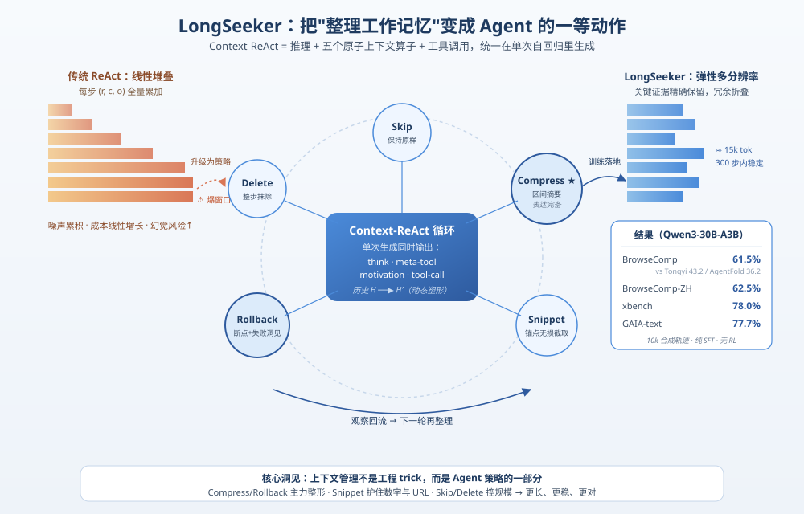
*图示：这篇论文把Agent长程推理中最头疼的'上下文爆炸'问题，拆成5个可学习的原子操作（Skip/Compress/Rollback/Snippet/Delete），并训出一个30B模型在BrowseComp上拿到61.5%，显著超过Tongyi DeepResearch(43.2%)、AgentFold(36.2%)。对任何做搜索/研究型Agent的人来说，这是一份可直接落地的'工作记忆管理'蓝图。*

- **详细背景：** ReAct范式下的搜索Agent会把每一步的推理、工具调用、观察结果全部累加，几十轮后上下文又长又噪声大，还可能爆窗口。已有方案要么滑窗硬截断（不看重要性）、要么到阈值就清空（打断推理）、要么定期总结（固定粒度、误差累积）。作者认为上下文管理需要'弹性的、多分辨率的'——不同历史片段应以不同详略共存，于是把它升级为Agent策略的一等公民。
- **详细入选理由：** 这篇论文把Agent长程推理中最头疼的'上下文爆炸'问题，拆成5个可学习的原子操作（Skip/Compress/Rollback/Snippet/Delete），并训出一个30B模型在BrowseComp上拿到61.5%，显著超过Tongyi DeepResearch(43.2%)、AgentFold(36.2%)。对任何做搜索/研究型Agent的人来说，这是一份可直接落地的'工作记忆管理'蓝图。

**核心技术点速览：**

#### 技术点 1：Context-ReAct范式
- 快速理解：在ReAct每一步里多加一层'元操作'，让Agent自己决定如何改写历史

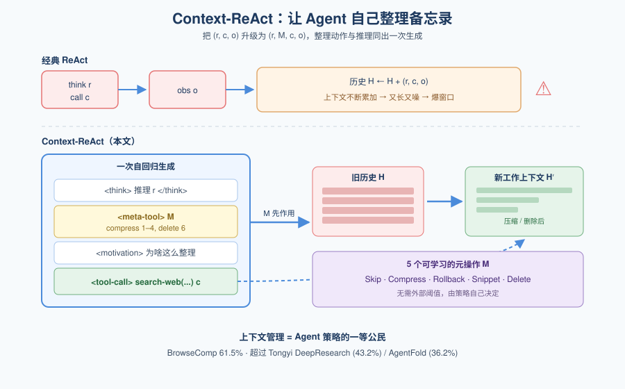
*图示：传统Agent是'想-做-看，全部塞进备忘录'，越写越厚。Context-ReAct让Agent在每一步先问自己：'我那本备忘录现在该怎么整理？'整理动作和下一步要调哪个工具一起产出，所以'整理上下文'本身变成了Agent策略的一部分，而不是外挂的工程trick。*

- 技术细节：把标准ReAct的每步(r,c,o)扩展为(r,M,c,o)，其中M是一串元操作，在拿到下一条观察前先作用于历史H，得到新的工作上下文H'。元操作和推理、工具调用在同一次自回归里一起生成，没有外部阈值触发。
- 通俗讲解：传统Agent是'想-做-看，全部塞进备忘录'，越写越厚。Context-ReAct让Agent在每一步先问自己：'我那本备忘录现在该怎么整理？'整理动作和下一步要调哪个工具一起产出，所以'整理上下文'本身变成了Agent策略的一部分，而不是外挂的工程trick。
- 例子：Agent走到第7步时，一次生成里同时输出：\<think\>推理\</think\>、\<meta-tool-call\>（compress 1–4, delete 6）\</meta-tool-call\>、\<motivation\>解释为啥这么整理\</motivation\>、\<standard-tool-call\>下一个search-web\</standard-tool-call\>，下一轮环境看到的就是被精简后的上下文。

#### 技术点 2：五个原子操作
- 快速理解：Skip/Compress/Rollback/Snippet/Delete构成完备又高效的上下文操作集

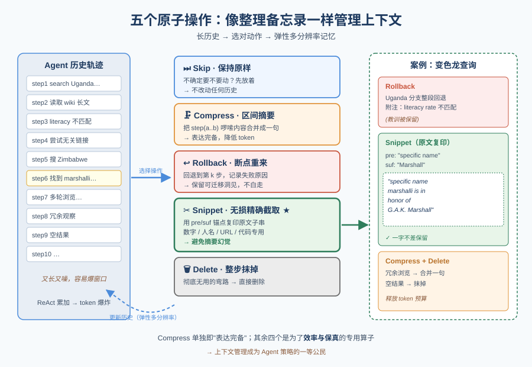
*图示：把'整理备忘录'拆成五种动作，各有分工：搞不定就先跳过(Skip)，啰嗦就合并(Compress)，走错路就断点重来并记下教训(Rollback)，关键数字/URL用复印而不是转述(Snippet)，彻底没用就撕掉(Delete)。Snippet特别关键——对数字、人名、代码这种一改就错的内容用指针复制，避免摘要幻觉。*

- 技术细节：Skip保持原样；Compress对任意连续区间（a,b）做摘要替换；Rollback回退到第k步并记录失败原因和可迁移洞见；Snippet用pre/suf锚点无损截取观察里的精确子串；Delete整步抹掉。论文证明Compress单独就'表达完备'，其他四个是为了效率和保真的专用算子。
- 通俗讲解：把'整理备忘录'拆成五种动作，各有分工：搞不定就先跳过(Skip)，啰嗦就合并(Compress)，走错路就断点重来并记下教训(Rollback)，关键数字/URL用复印而不是转述(Snippet)，彻底没用就撕掉(Delete)。Snippet特别关键——对数字、人名、代码这种一改就错的内容用指针复制，避免摘要幻觉。
- 例子：论文案例中，Agent查'津巴布韦的变色龙物种'，发现Wikipedia页面里有一句'specific name marshalli is in honor of G.A.K. Marshall'，于是用Snippet把这句原文精确保留到上下文，而前面一堆失败的Uganda分支则整段Rollback并附'literacy rate不匹配'的原因。

#### 技术点 3：LongSeeker训练与效果
- 快速理解：基于Qwen3-30B用1万条合成轨迹SFT，BrowseComp上61.5%跑赢GPT-5级别

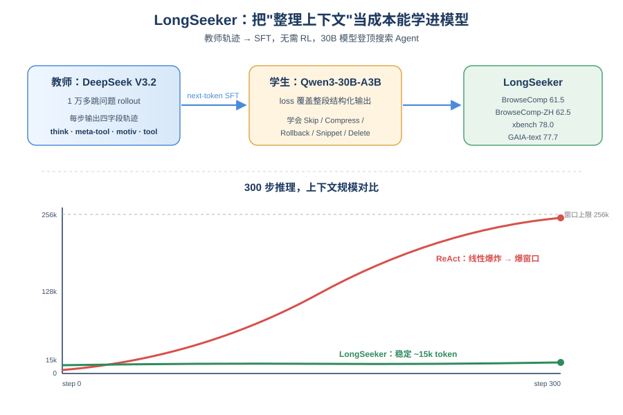
*图示：作者没用RL，只靠高质量的'含上下文管理决策'的教师轨迹做SFT，就把30B模型推到同参数搜索Agent里的SOTA，甚至在BrowseComp上超过GPT-5。关键在于训练数据里每一步都带着'该怎么整理上下文'的标签，让模型把整理动作学成本能。*

- 技术细节：用DeepSeek V3.2作为教师，在OpenSeeker的1万个多跳问题上按Context-ReAct四字段(\<think\>/\<meta-tool-call\>/\<motivation\>/\<standard-tool-call\>)一次性rollout轨迹；然后在Qwen3-30B-A3B上做标准next-token SFT，loss覆盖整个结构化输出。BrowseComp 61.5、BrowseComp-ZH 62.5、xbench 78.0、GAIA-text 77.7。
- 通俗讲解：作者没用RL，只靠高质量的'含上下文管理决策'的教师轨迹做SFT，就把30B模型推到同参数搜索Agent里的SOTA，甚至在BrowseComp上超过GPT-5。关键在于训练数据里每一步都带着'该怎么整理上下文'的标签，让模型把整理动作学成本能。
- 例子：在200个BrowseComp问题的实测中，ReAct版DeepSeek-V3.2的上下文token数随步数线性爆炸，而LongSeeker哪怕跑到300步，平均上下文也稳定在15k token以内（模型窗口256k），同时最终答对率更高。

#### 技术点 4：上下文动态与消融
- 快速理解：上下文token稳定在15k以内，同步长预算下胜过Summary和Discard-all

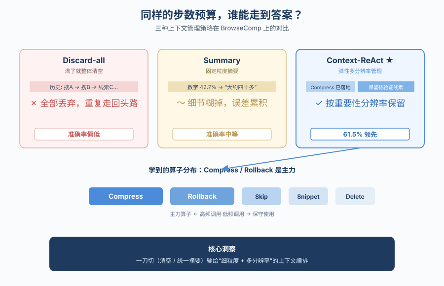
*图示：这组对照实验说明：单靠'总结'或'清空'这种一刀切做法，即使给同样的步数预算，也做不过细粒度的多分辨率管理。而操作分布显示，Agent确实学会了'搜索早期信息价值不确定就先留着，后期再果断删'的策略，而不是退化成只用某一个算子。*

- 技术细节：在相同base模型(DeepSeek-V3.2)和同步长预算下对比三种策略：Context-ReAct、把溢出部分Summary后续跑、Discard-all整体重置。Context-ReAct在BrowseComp上全程领先；五个操作的调用分布里Snippet/Delete用得较保守，Compress/Rollback是主力。
- 通俗讲解：这组对照实验说明：单靠'总结'或'清空'这种一刀切做法，即使给同样的步数预算，也做不过细粒度的多分辨率管理。而操作分布显示，Agent确实学会了'搜索早期信息价值不确定就先留着，后期再果断删'的策略，而不是退化成只用某一个算子。
- 例子：同样给Agent N步的搜索预算，Discard-all在某一步突然丢掉全部历史后会重复之前的搜索；Summary则因为固定粒度摘要把关键数字糊掉；Context-ReAct可以只Compress掉已经落地的子问题，保留待验证的线索，所以最后答对率最高。

- **对 Agent 产品/系统的启发：** 把'上下文管理'从工程trick升格成Agent策略的一部分，和工具调用一起训练
- **详细启发：** 产品侧：做Deep Research/搜索型产品时，不要再用'滑窗+到阈值总结'的固定规则，可以借鉴这五个原子操作，尤其是Rollback(带失败原因)和Snippet(无损保留数字、URL、人名)，显著降低长任务里的幻觉和token成本。；系统侧：在Agent框架层面可以把meta\_tool\_call做成一等公民，和standard\_tool\_call在同一次生成里输出；训练数据要把'每一步该如何整理上下文'显式标注出来，用SFT即可让模型学会，不一定非要上RL。；风险：所有操作都是模型自己决定，错误的Rollback或Delete会丢掉关键证据且无法恢复；Snippet依赖pre/suf锚点，锚点错位可能截到错误片段；另外训练依赖教师模型(DeepSeek V3.2)的轨迹质量，教师的偏好会被继承。

## 三、总结

- 今天主线：安全红队沙箱化、上下文策略化、Code Agent走向芯片级长程任务
- 今天的主线是把Agent的薄弱环节——安全、记忆、工具协议——从外挂trick改造成系统级一等公民
- 今天的主线是把Agent的薄弱环节——安全、记忆、工具协议——从外挂trick改造成系统级一等公民。DTap给出了真实环境+自主红队+状态级判别的安全评测新基准，LongSeeker/LCM把上下文管理写进策略本身，TSCG/AgentTrust则在tool-use协议和runtime拦截上补齐落地细节。与此同时，Design Conductor 2.0显示Code Agent已经能吃下一篇论文、80小时内产出可流片的加速器，长程自主的天花板又被顶高了一截。
