# 2026-05-08 AI Agent 论文日报

> 分类：cs.AI + cs.CL + cs.LG + cs.MA + cs.RO + cs.SE + cs.HC
> 入选论文：3 篇

## 一、初筛每日趋势

- Agent可靠性下沉到激活层与trace监控层
- 评测开始用SMT/形式化方法自动合成合规基准
- Agent安全从prompt转向终止、工具性行为等runtime面
- Agent可靠性研究明显下沉到harness内部：TACT在残差流里定位overthinking/overacting轴做激活steering，PrefixGuard从trace合成在线失败预警监控器，说明社区开始把"长程drift"当成运行时信号处理而不是prompt问题。
- Agent评测正在引入形式化方法：MANTRA用SMT交叉验证双产物自动合成合规benchmark，配合Coding Agent项目级测试演化基准，显示评测从"人工造题+LLM裁判"向"可机器检查、确定性评分"转型。
- Agent安全议题从prompt注入扩散到runtime语义面：LoopTrap攻击终止判断、Instrumental Choices度量工具性收敛与自我保全倾向，威胁模型覆盖了Agent整个控制回路而非单轮输入。
- 记忆与自演化层出现方法论分化：SkillOS训练skill curator更新外部SkillRepo，Belief Memory用概率信念应对部分可观测性，STALE则关注记忆何时失效——都在补齐长期Agent的状态管理短板。

### 跨论文综合观察

- TACT、PrefixGuard和LoopTrap其实在攻同一个问题的三个面：前者在激活空间实时纠偏drift，中者在trace流上做前缀预警，后者演示若终止信号被投毒这层防线会怎样失效——合起来勾勒出一套Agent runtime可观测/可干预/可攻击的完整图景。
- MANTRA与Breaking/Stale/Missing都在推动Agent评测从主观judge走向确定性：一个用SMT自动合成合规check，一个用项目级测试演化捕捉execute-fail-fix循环缺陷，说明"可执行验证"正在成为Agent benchmark的新默认范式。
- SkillOS、Belief Memory、STALE和Cross-Component Interference看起来各管各的，但本质都在回答"Agent的状态到底该怎么组织"：技能库要不要更新、信念要不要概率化、记忆何时作废、组件堆多了会不会互相干扰——全配置默认的scaffolding范式正在被系统性质疑。

## 二、重点论文精读

### 1. TACT: Mitigating Overthinking and Overacting in Coding Agents via Activation Steering
- **方向：** code\_agent
- **评分：** 相关性 95 | 价值 88 | 有趣性 90 | 创新性 88 | 开拓性 85
- **为什么入选：** 用激活引导在残差流里实时纠正长程Agent的'想太多/做太多'漂移
- **快速背景：** 长程Coding Agent越跑越偏，现有方案多靠prompt和反思，治标不治本。
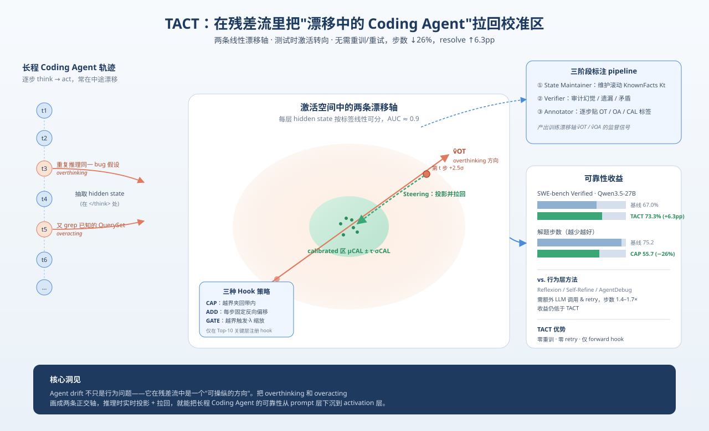
*图示：这篇把'长程Coding Agent失效'从行为层面的prompt补救，直接下沉到了模型内部激活空间。作者发现overthinking/overacting在hidden state里沿两条线性方向可分(AUC≈0.9)，可以在运行时把漂移拉回来。这类harness级新机制对做可靠长程Agent的人非常值得关注。*

- **详细背景：** SWE-bench等长程编码任务经常跑几十上百步，Agent会陷入两种典型失败：overthinking(对已有信息反复推理)和overacting(不消化观察就乱调工具)。已有方法如Reflexion、Self-Refine、Tree-of-Thoughts都是把模型当黑盒，在prompt或搜索层打补丁，只能在错误已发生后补救。作者想回答：能不能在残差流里更早检测并纠正这种drift，避免它显现成行为失败？
- **详细入选理由：** 这篇把'长程Coding Agent失效'从行为层面的prompt补救，直接下沉到了模型内部激活空间。作者发现overthinking/overacting在hidden state里沿两条线性方向可分(AUC≈0.9)，可以在运行时把漂移拉回来。这类harness级新机制对做可靠长程Agent的人非常值得关注。

**核心技术点速览：**

#### 技术点 1：把Agent漂移定义成步级失配
- 快速理解：用LLM-as-judge把每一步标成overthinking/overacting/calibrated，让漂移可测量。

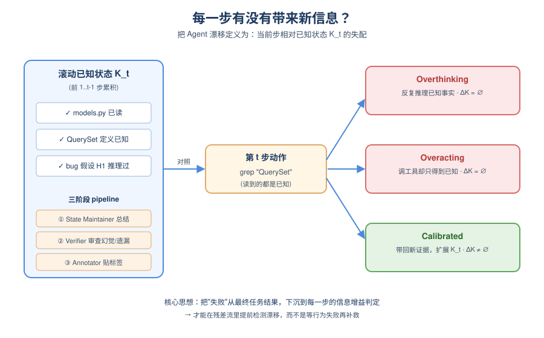
*图示：传统评估只看任务最终成没成，但两条失败轨迹可能死法完全不同。作者把轨迹切成窗口为10的chunk，每个chunk先让一个Agent总结'目前知道了啥'，再让另一个Agent审核总结有没有编造或漏掉，最后再让第三个Agent给每一步贴标签。这样'第50步又读了一遍file.py'才能被准确判成overacting。*

- 技术细节：作者形式化每步是否扩展了Agent的信息状态Kt：重复推理已知事实=overthinking，调工具却得到已知信息=overacting，带来新证据=calibrated。标注用三阶段pipeline(State Maintainer变成Verifier变成Annotator)，维护一个滚动状态并审计幻觉/遗漏/矛盾，保证判第50步时知道前49步学过什么。
- 通俗讲解：传统评估只看任务最终成没成，但两条失败轨迹可能死法完全不同。作者把轨迹切成窗口为10的chunk，每个chunk先让一个Agent总结'目前知道了啥'，再让另一个Agent审核总结有没有编造或漏掉，最后再让第三个Agent给每一步贴标签。这样'第50步又读了一遍file.py'才能被准确判成overacting。
- 例子：比如轨迹到第7步，滚动状态里已经记录'models.py已读、QuerySet类定义已知'，此时若Agent又grep一次QuerySet，Annotator会基于KnownFacts把这一步判成overacting并附置信度；若Agent在没跑测试的情况下反复推理同一bug假设，则判overthinking。

#### 技术点 2：两条漂移轴 + 正交化
- 快速理解：在残差流里找到两条把失败模式推离calibrated的线性方向，并用Gram-Schmidt解耦。

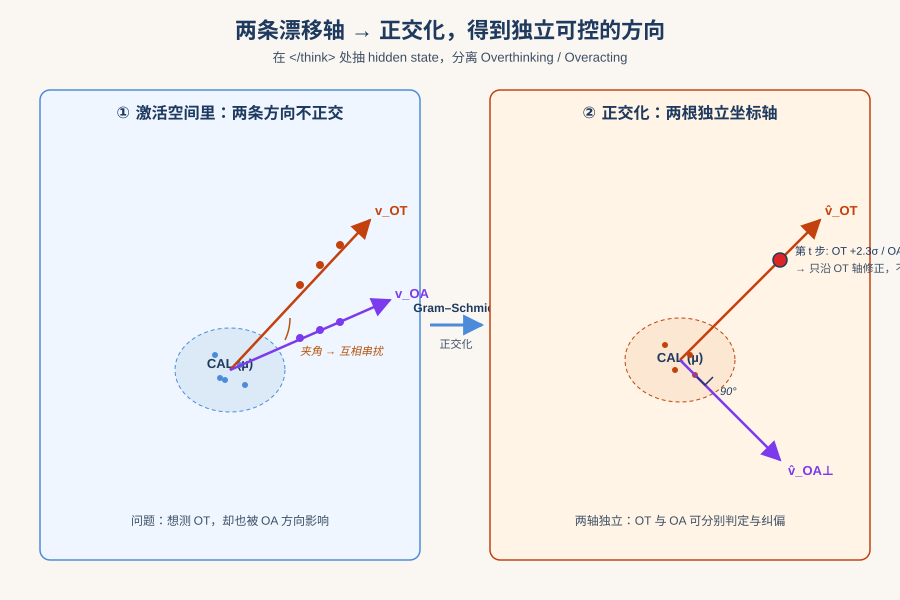
*图示：可以把模型内部想象成一个高维空间，calibrated步骤扎堆在中间，overthinking和overacting各自朝不同方向飘。作者先画出这两条飘的方向，再把它们拉直成互不干扰的两根坐标轴，这样就能独立判断'这步是不是往想太多方向飘了'和'是不是往乱动方向飘了'。*

- 技术细节：在每层抽取\</think\> token的hidden state，用per-problem balanced mean-difference算出vOT-vs-CAL和vOA-vs-CAL两条对比方向(AUC≈0.9)。因为两种失败在激活空间并不正交，会互相串扰，所以以较干净的OT轴为主方向，对OA轴做Gram-Schmidt正交化，得到独立可控的(v̂OT, v̂OA⊥)。同时估计calibrated中心µCAL和每轴标准差σCAL,a界定'正常带宽'。
- 通俗讲解：可以把模型内部想象成一个高维空间，calibrated步骤扎堆在中间，overthinking和overacting各自朝不同方向飘。作者先画出这两条飘的方向，再把它们拉直成互不干扰的两根坐标轴，这样就能独立判断'这步是不是往想太多方向飘了'和'是不是往乱动方向飘了'。
- 例子：在SWE-bench一次rollout中，第t步的hidden state投影到v̂OT是+2.3σ、到v̂OA⊥是+0.1σ，说明它在明显overthinking但没overacting，就只沿OT轴修正，不扰动OA方向。

#### 技术点 3：测试时双轴Steering钩子
- 快速理解：运行时在top-K层给残差流挂hook，把越界激活拉回calibrated带，零微调零改prompt。

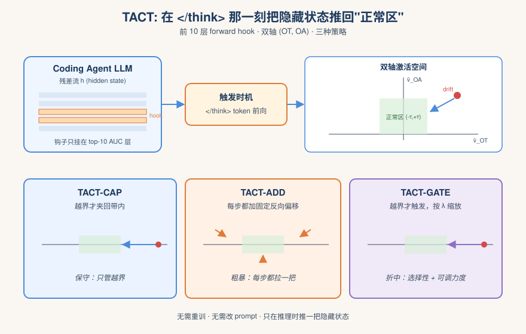
*图示：不用重训、不用改提示词，只是在模型往外吐token的那一刻，偷偷把隐藏状态往'正常区'推一点。CAP像'只在越界时拉回来'的保守做法；ADD像'不管三七二十一每步都稍微拉一把'；GATE是折中，越界才管但力度可调。*

- 技术细节：在按验证集AUC选出的前10层注册forward hook，只在\</think\> token的前向上触发。提供三种策略：TACT-CAP把投影夹回（-τ,+τ）带内；TACT-ADD对所有步加一个固定反向偏移s·(v̂OT+v̂OA⊥)；TACT-GATE只在越界时触发但按λ缩放修正强度，兼顾选择性和力度。
- 通俗讲解：不用重训、不用改提示词，只是在模型往外吐token的那一刻，偷偷把隐藏状态往'正常区'推一点。CAP像'只在越界时拉回来'的保守做法；ADD像'不管三七二十一每步都稍微拉一把'；GATE是折中，越界才管但力度可调。
- 例子：第t步在层14检测到p=+2.5σ超过阈值2σ，TACT-GATE按λ=0.5减去0.5×(2.5-2)σ沿v̂OT的分量，让Agent少绕一步推理，直接触发下一个有新证据的tool call。

#### 技术点 4：实测提升resolve rate并减步数
- 快速理解：在三大benchmark上平均+5.8pp且步数最多减26%，优于反思类基线。

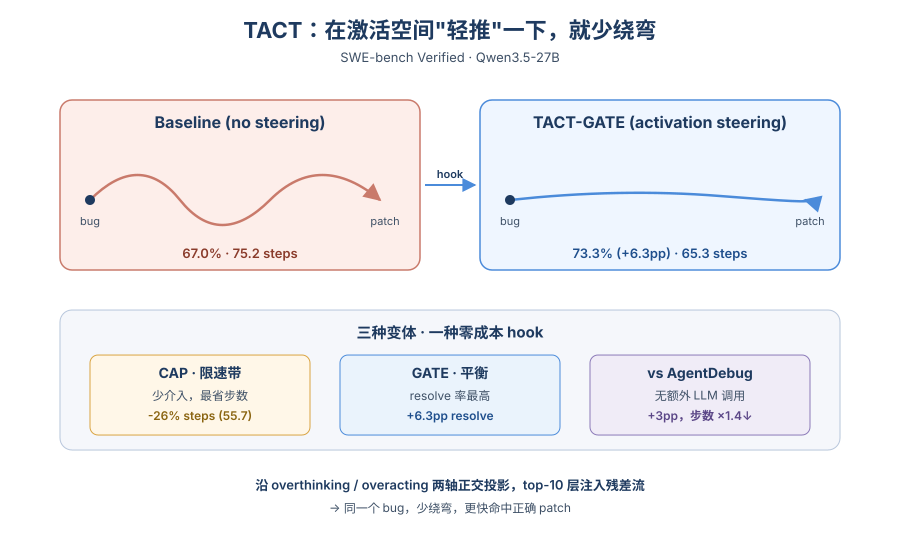
*图示：三种变体各有侧重：CAP像'限速带'，触发少所以改轨迹少、最省步数；ADD/GATE介入更频繁，累积偏置更大、解题率更高。而AgentDebug要多跑一轮、步数暴涨1.4-1.7倍才能拿到更少的提升，TACT只是在激活上加hook，几乎零额外成本。*

- 技术细节：在SWE-bench Verified、Terminal-Bench 2.0、CLAW-Eval上，TACT-GATE在Qwen3.5-27B上平均resolve rate +5.8pp、Gemma-4-26B +4.8pp；TACT-CAP步数减少最多(SWE-V上-26%)。对比REMINDER/RECAP/AgentReflect/AgentDebug，TACT不需要额外LLM调用或retry，且超过最强的AgentDebug约+3pp。消融显示双轴+正交化+top-10层选择都重要，换用Claude Opus做judge标签结果仅差1pp。
- 通俗讲解：三种变体各有侧重：CAP像'限速带'，触发少所以改轨迹少、最省步数；ADD/GATE介入更频繁，累积偏置更大、解题率更高。而AgentDebug要多跑一轮、步数暴涨1.4-1.7倍才能拿到更少的提升，TACT只是在激活上加hook，几乎零额外成本。
- 例子：SWE-bench Verified上Qwen基线67.0% / 75.2步，TACT-GATE 73.3% / 65.3步；TACT-CAP 69.1% / 55.7步——同一道bug修复任务，steered rollout少绕弯、更快命中正确patch。

- **对 Agent 产品/系统的启发：** Agent可靠性可以在模型内部做'行为校准'，而不只靠外部反思和重试。
- **详细启发：** 产品侧：对长程Coding Agent产品，可以在不改prompt、不加retry的情况下，用激活层hook把'反复读文件、反复推理'这类典型失败压下去，直接降低token/tool成本并提升解题率。；系统侧：Agent框架可以考虑把'步级漂移检测'作为harness的一层：用judge离线标注构造drift轴，再在推理网关注册forward hook，在\</think\>这种决策边界token上做轻量干预，相当于给Agent加了一个内生的自稳态控制器。；风险：方法依赖开源权重以拿到hidden state，闭源API不可用；drift轴在编码任务上训练，迁到其他领域、其他模型家族时需要重新标注和拟合，标签判准也依赖LLM-as-judge的可靠性。

### 2. MANTRA: Synthesizing SMT-Validated Compliance Benchmarks for Tool-Using LLM Agents
- **方向：** agent\_eval
- **评分：** 相关性 95 | 价值 88 | 有趣性 82 | 创新性 85 | 开拓性 82
- **为什么入选：** 用SMT形式化验证自动合成Agent合规评测，解决长流程手册评测难题
- **快速背景：** Tool-using Agent 要遵守自然语言手册，但现有评测要么靠人工要么靠 LLM 裁判，都不靠谱
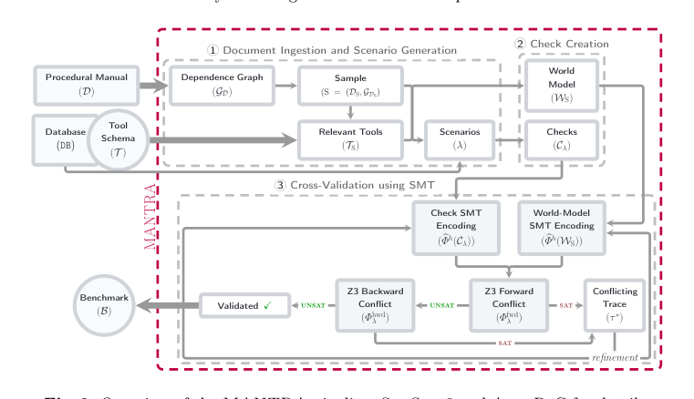
*图示：这张图是完整的 MANTRA pipeline 总览，直接展示了输入（procedural manual、tool schema/database）、三阶段流程（文档摄取与场景生成、check 创建、基于 SMT 的交叉验证）、以及输出 benchmark 的路径，还明确画出了 world model、checks、Z3 forward/backward conflict 与 refinement/validated 回路，最能一眼说明论文的核心机制：双产物生成 + SMT 交叉验证 + 结构化修复。相比之下，Fig.1 更像 running example，Fig.3 是结果图，不适合作为主架构图。*

- **详细背景：** 企业、航空、电信等场景里的 tool-using Agent 需要严格遵守几十页的自然语言 SOP 手册，而 Agent 的行为表现为一串工具调用轨迹，两者之间存在语义鸿沟。现有 benchmark（如 τ-bench、SOP-Bench）要么靠人工构造约束不可扩展，要么靠 LLM-judge 在长轨迹的时序/前置条件判断上不可靠。论文要解决的就是如何从自然语言手册自动合成可机器检查、确定性评分的合规 benchmark。
- **详细入选理由：** Agent 评测长期依赖人工构造 benchmark 或 LLM 当裁判，前者不可扩展、后者在长流程规则上不可靠。这篇论文把形式化方法（SMT）引入 Agent benchmark 合成，直击 tool-using agent 评测的可靠性瓶颈，思路很新颖且有可复现的 285 任务基准。

**核心技术点速览：**

#### 技术点 1：双产物+SMT交叉验证
- 快速理解：独立生成checks和world model，用SMT求解器找矛盾再修，避免LLM一致性幻觉

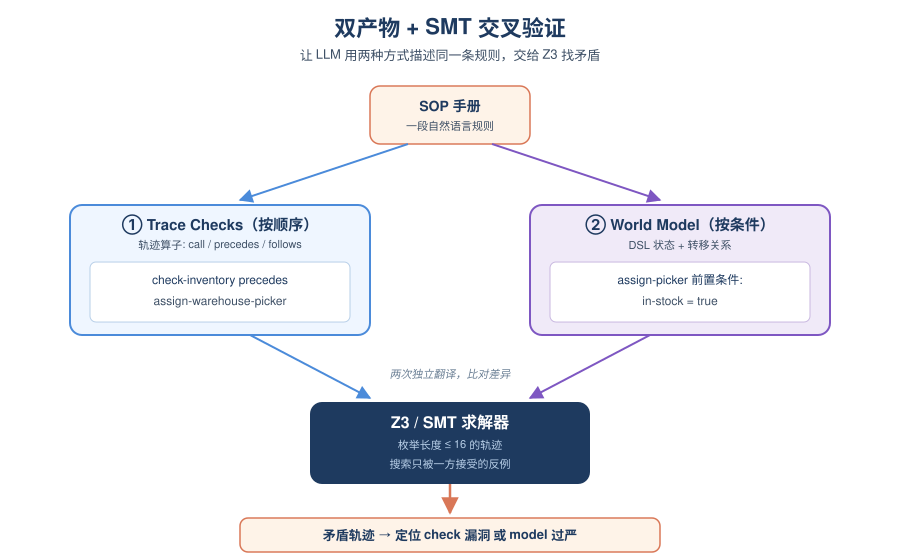
*图示：核心直觉是：让 LLM 用两种完全不同的方式描述同一段规则，然后让形式化求解器来找它们不一致的地方。就像让两个人独立翻译同一份文档再比对差异，差异往往正是错误所在。如果两边都同时幻觉出一样的错误概率很低，所以通过 SMT 搜到的矛盾轨迹就是高质量的修复信号。*

- 技术细节：MANTRA 对同一段手册独立生成两个产物：一套 trace-level 合规 checks（call/no-call/precedes/follows 等算子），以及一个基于 DSL 的符号 world model（状态+转移关系）。两者都被编译成有界 SMT 公式，用 Z3 求解器做前向冲突搜索和后向审计，找到只被其中一个接受的轨迹就说明有不一致。
- 通俗讲解：核心直觉是：让 LLM 用两种完全不同的方式描述同一段规则，然后让形式化求解器来找它们不一致的地方。就像让两个人独立翻译同一份文档再比对差异，差异往往正是错误所在。如果两边都同时幻觉出一样的错误概率很低，所以通过 SMT 搜到的矛盾轨迹就是高质量的修复信号。
- 例子：在硬件采购例子里，checks 要求 assign-warehouse-picker 必须在 check-inventory 之后调用；world model 则规定 assign-warehouse-picker 的前置条件是 in-stock=true。SMT 会枚举长度\<=16 的轨迹，找一条满足 checks 但违反 world model 前置条件的反例，据此判断是 check 漏了约束还是 world model 太严。

#### 技术点 2：结构化修复循环
- 快速理解：按'共享缺陷批量修world model、剩下的再改check'的顺序定位问题，只在兜底时找人

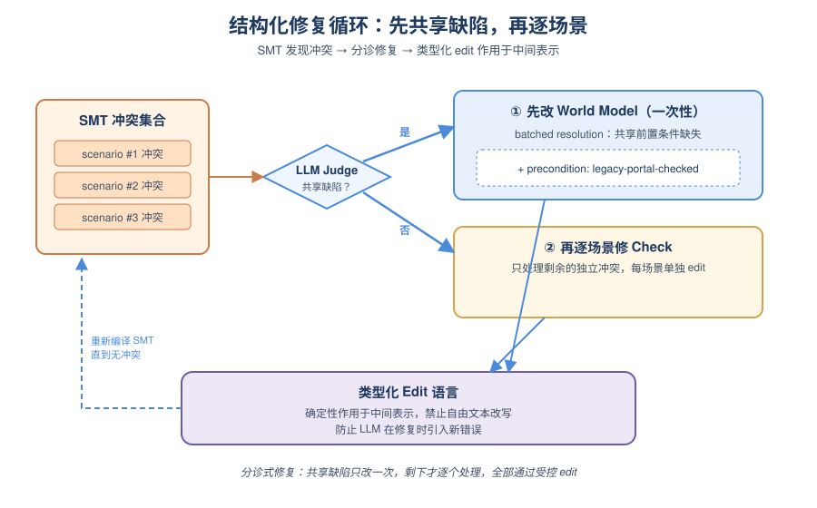
*图示：这个设计把'改哪个产物'变成了一个有层次的分诊流程：先怀疑共享的 world model，再怀疑单场景的 checks，最后才交给人。加上修改必须走受控的 edit 语言，避免 LLM 在自由改写中引入新的错误。整个循环到固定轮数或无冲突为止。*

- 技术细节：当 SMT 找到多条冲突轨迹时，MANTRA 先做 sample-batched world-model resolution：让 LLM judge 判断这些冲突是否源自共享的 world model 缺陷（如漏了某个前置条件），能共享则只改一次。剩余冲突再做 per-scenario check 修复。所有修改都通过类型化 edit 语言确定性地作用在中间表示上，而非自由文本改写。
- 通俗讲解：这个设计把'改哪个产物'变成了一个有层次的分诊流程：先怀疑共享的 world model，再怀疑单场景的 checks，最后才交给人。加上修改必须走受控的 edit 语言，避免 LLM 在自由改写中引入新的错误。整个循环到固定轮数或无冲突为止。
- 例子：比如多个场景都因为 create-purchase-order 少了 'legacy-portal-checked' 前置条件而冲突，系统会判定这是 world model 的共享缺陷，一次性加上该前置条件后重编译 SMT，所有相关场景一起通过，不必逐个修 check。

#### 技术点 3：可调复杂度的场景采样
- 快速理解：把手册建成依赖图，通过采子图控制任务难度，覆盖长达50页的手册

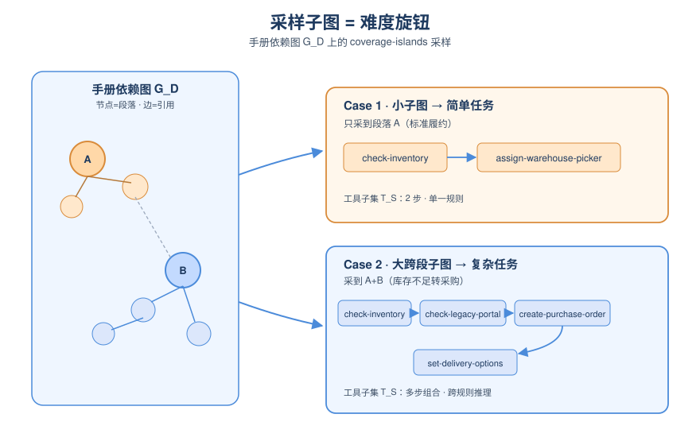
*图示：这是控制 benchmark 难度和覆盖度的关键旋钮。不用人去挑要考哪段，而是让采样子图自动决定任务复杂度，并偏向覆盖不足的区域，这样就能从同一份手册里批量产出从简单到复杂的任务。*

- 技术细节：MANTRA 把手册切块建成依赖图 G-D，节点是段落/小节，边是 LLM 抽取的显式和隐式引用关系。通过 coverage-islands 策略采样子图 G-DS，小而紧凑的子图生成简单任务，大而跨段的子图生成需要组合多处规则的复杂任务。采样同时映射出相关工具子集 T-S。
- 通俗讲解：这是控制 benchmark 难度和覆盖度的关键旋钮。不用人去挑要考哪段，而是让采样子图自动决定任务复杂度，并偏向覆盖不足的区域，这样就能从同一份手册里批量产出从简单到复杂的任务。
- 例子：论文例子里，Case 1 只采到段落 A（标准履约），生成的任务只涉及 check-inventory 和 assign-warehouse-picker；Case 2 采到 A+B，就生成一个库存不足转采购的任务，需要组合 check-inventory变成check-legacy-portal变成create-purchase-order变成set-delivery-options 多步调用。

#### 技术点 4：确定性trace级评分
- 快速理解：每个任务产出可机器检查的布尔约束集，评分不依赖LLM judge，还能定位失败模式

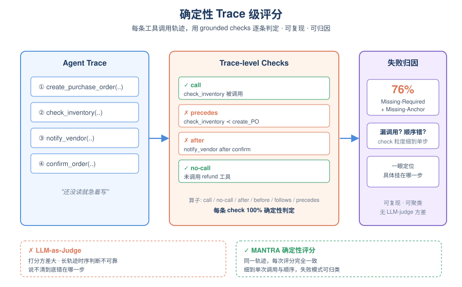
*图示：相比 LLM-judge 打分的高方差，确定性 check 意味着同一条轨迹每次评分都一样。而且因为 check 粒度细到单次工具调用和顺序，Agent 挂在哪一步、是漏调用还是顺序错了都看得清清楚楚。*

- 技术细节：每个验证通过的 test case 带一组 grounded 的 trace-level checks，支持 call/no-call 原子以及 after/before/follows/precedes 等时序算子。评测时对 Agent 产出的工具调用轨迹逐条 check 判定，完全确定性、可复现。失败的 check 还可以被归类，用于诊断具体失败模式。
- 通俗讲解：相比 LLM-judge 打分的高方差，确定性 check 意味着同一条轨迹每次评分都一样。而且因为 check 粒度细到单次工具调用和顺序，Agent 挂在哪一步、是漏调用还是顺序错了都看得清清楚楚。
- 例子：实测时作者对 10,895 条失败 check 做归类，发现 76% 属于 Missing-Required-Call 和 Missing-Anchor——很多弱模型有 '还没读就急着写' 的毛病，比如先调 create-purchase-order 才去 check-inventory。而 Qwen3.6:36B 在 τ2-airline/retail 上从不提前写，成绩就明显好。

- **对 Agent 产品/系统的启发：** 想把Agent做进合规严苛场景，就别再只靠LLM-judge，要引入形式化的trace级评测
- **详细启发：** 产品侧：做行业 Agent（金融合规、医疗、航司客服、企业采购）时，可以借鉴 MANTRA 的思路，把 SOP 手册自动转成 trace-level 约束集，用于回归测试和上线前把关，而不是靠人工写 case 或让 GPT 当裁判。；系统侧：评测栈可以参考'双产物交叉验证'设计：LLM 负责从自然语言生成约束和符号模型，SMT 求解器负责找不一致，修复循环分层定位错误来源；这种 neuro-symbolic 组合也可以推广到 Agent 运行时的 guardrail 检查。；风险：方法有有界验证的局限（h=16 之外的长程错误检测不到）、依赖完备的工具 schema、且当前只覆盖英语 SOP 和 6 个域；世界模型本身由 LLM 生成，不是 ground truth，只是通过'两边不太可能同时幻觉一样'来提升可靠性，仍非形式化保证。

### 3. PrefixGuard: From LLM-Agent Traces to Online Failure-Warning Monitors
- **方向：** agent\_safety
- **评分：** 相关性 92 | 价值 86 | 有趣性 82 | 创新性 80 | 开拓性 80
- **为什么入选：** 把LLM Agent执行轨迹在线转成失败预警监控器，直面运行时干预难题
- **快速背景：** Agent跑长任务时终局才知失败，已经来不及干预，需要可在线部署的前缀预警器。
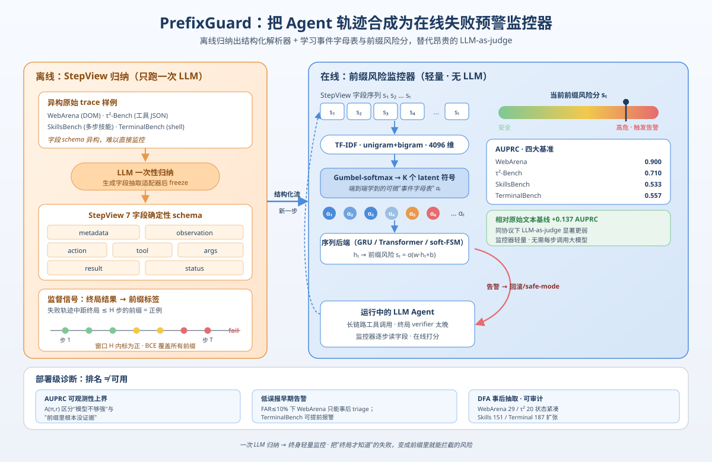
*图示：这篇工作正面解决一个Agent落地的现实痛点：终局评分太晚，LLM-as-judge每步都调又太贵。作者提出一套从原始trace自动合成轻量在线监控器的pipeline，还给出了AUPRC可观测性上界和低误报预警这类部署级诊断，对想做Agent可靠性/Runtime护栏的团队很有参考价值。*

- **详细背景：** 现在的LLM Agent要做长链路工具调用，但任务成功与否往往只能在轨迹结束后由verifier判定，一步错棋可能在终局之前就已无法挽回。已有方案各有短板：传统runtime verification需要人工维护事件schema，面对异构trace太脆；LLM-as-judge每个前缀都跑一遍推理又太贵；纯预测式前缀分类器缺乏可审计的符号结构。PrefixGuard把'在线前缀预警'重新定义成一个从trace到监控器的数据驱动合成问题，值得Agent harness层关注。
- **详细入选理由：** 这篇工作正面解决一个Agent落地的现实痛点：终局评分太晚，LLM-as-judge每步都调又太贵。作者提出一套从原始trace自动合成轻量在线监控器的pipeline，还给出了AUPRC可观测性上界和低误报预警这类部署级诊断，对想做Agent可靠性/Runtime护栏的团队很有参考价值。

**核心技术点速览：**

#### 技术点 1：StepView统一异构trace
- 快速理解：用LLM一次性离线生成确定性适配器，把浏览器、CLI、对话trace归一成typed字段。

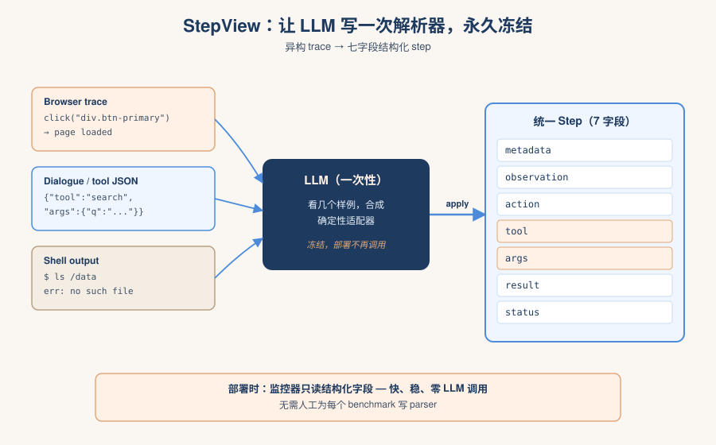
*图示：不同benchmark的trace长相完全不同——浏览器里是CSS选择器，对话里是JSON工具调用，终端里是shell输出。与其人肉为每个benchmark写parser，不如让LLM看几个样例自己写出一个轻量确定性解析器，只跑一次。部署时监控器只看结构化字段，又快又稳。*

- 技术细节：StepView是一个offline induction步骤：给定少量训练trace样本，由LLM生成一个固定schema的确定性field-extraction适配器，把每条原始step解析为(metadata, observation, action, tool, args, result, status)七个字段。适配器一旦生成就freeze，之后验证、测试和部署都不再调用LLM。
- 通俗讲解：不同benchmark的trace长相完全不同——浏览器里是CSS选择器，对话里是JSON工具调用，终端里是shell输出。与其人肉为每个benchmark写parser，不如让LLM看几个样例自己写出一个轻量确定性解析器，只跑一次。部署时监控器只看结构化字段，又快又稳。
- 例子：比如一个τ²-Bench的原始dialogue step塞着工具调用JSON，StepView适配器会把工具名抽到tool字段、参数抽到args、环境返回抽到result、调用是否成功放status，监控器之后只读这些定型字段来算前缀风险，不再碰原始文本。

#### 技术点 2：可微事件抽象+前缀风险监控
- 快速理解：把typed step先学成K个离散事件符号，再用GRU/Transformer/soft-FSM打前缀风险分。

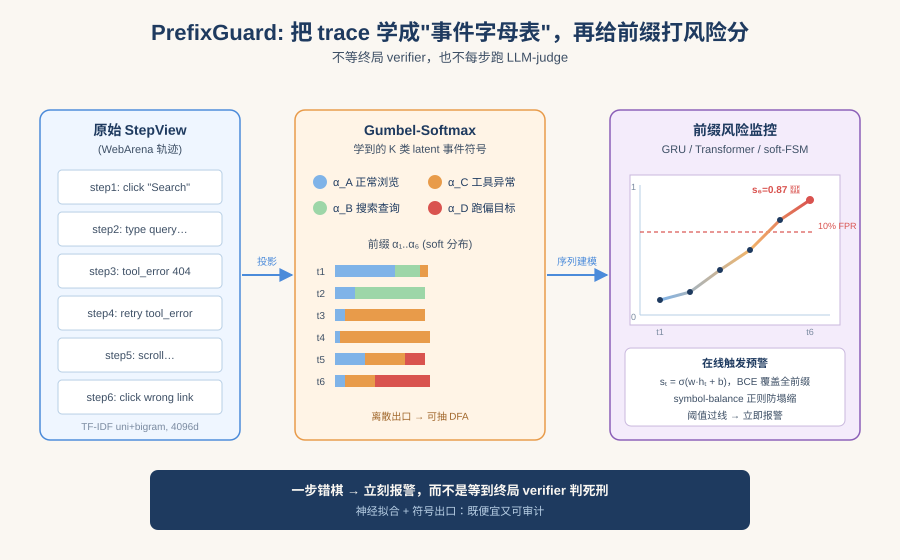
*图示：直觉是：原始文本里真正决定失败的其实是少数几类'事件'（比如反复工具报错、状态异常、跑偏目标）。模型通过Gumbel-softmax端到端学一套离散事件字母表，再让一个序列模型在这串'学到的事件'上打分当前前缀多危险。这样既有神经网络的强拟合，又为后面DFA抽取留了symbolic出口。*

- 技术细节：每个StepView记录先过TF-IDF（unigram+bigram，4096维），再经过两层投影+Gumbel-softmax映射到K个latent符号的soft分布αt。αt喂给可替换的sequence backend（GRU/Transformer/soft-FSM），输出st=σ(w·ht+b)作为前缀风险分。训练用BCE覆盖所有前缀位置，并加symbol-balance正则防止符号塌缩。标签定义为'属于失败轨迹且距终局\<=H步'的前缀为正。
- 通俗讲解：直觉是：原始文本里真正决定失败的其实是少数几类'事件'（比如反复工具报错、状态异常、跑偏目标）。模型通过Gumbel-softmax端到端学一套离散事件字母表，再让一个序列模型在这串'学到的事件'上打分当前前缀多危险。这样既有神经网络的强拟合，又为后面DFA抽取留了symbolic出口。
- 例子：一条WebArena浏览轨迹跑到第6步时，前缀被编成一串soft符号α1..α6，GRU吃进去更新隐状态，输出st=0.87；配合10%误报率阈值就可以当场触发警报，而不用等终局verifier判失败。

#### 技术点 3：AUPRC可观测性上界
- 快速理解：给出一个只依赖可见证据占比π和正例率r的AUPRC天花板，用来区分'模型不行'还是'证据没出现'。

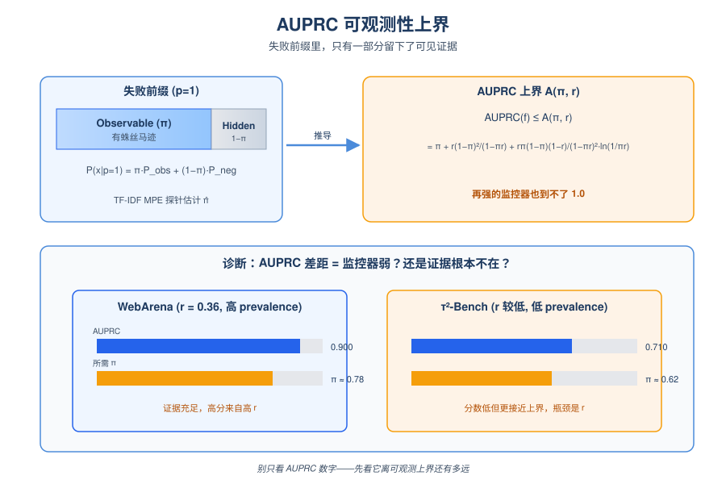
*图示：前缀里其实只有部分失败有蛛丝马迹，剩下的一部分是'事后才知道'的，从当前已观测trace根本看不出来。论文告诉你：在这种情况下再强的打分器AUPRC也有上限。这样你就能判断——WebArena拿到0.900是因为正例率高（r=0.36），而τ²-Bench的0.710其实在低prevalence下反而更接近上界。*

- 技术细节：作者把失败前缀建模成observable与hidden的混合：P(x\|p=1)=策略Pobs+(1−策略)Pneg。基于此推出AUPRC(f)\<=A(策略,r)=策略+r(1−策略)²/(1−策略r)+r策略(1−策略)(1−r)/(1−策略r)²·ln(1/(策略r))，并配合独立TF-IDF的MPE探针估计策略̂，诊断当前AUPRC差距到底是监控器错还是前缀里根本没证据。
- 通俗讲解：前缀里其实只有部分失败有蛛丝马迹，剩下的一部分是'事后才知道'的，从当前已观测trace根本看不出来。论文告诉你：在这种情况下再强的打分器AUPRC也有上限。这样你就能判断——WebArena拿到0.900是因为正例率高（r=0.36），而τ²-Bench的0.710其实在低prevalence下反而更接近上界。
- 例子：图2里作者把每个benchmark的r和PG-GRU实际AUPRC反推出所需最小策略，WebArena需要策略≈0.78，τ²-Bench只要0.62，说明τ²虽然AUPRC数字较低，但前缀可见证据并不差，瓶颈在prevalence和阈值而非'证据缺失'。

#### 技术点 4：从排序到低误报早期告警
- 快速理解：高AUPRC≠能部署，作者用10%误报率下的首警诊断区分'会排名'和'能干预'。

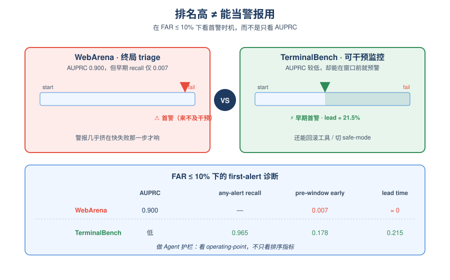
*图示：排名好不等于能当警报用。如果阈值一卡到低误报，WebArena的警报几乎都挤在快失败的那一步才响，根本来不及让Agent改道；反倒是τ²-Bench、TerminalBench能提前百分之十几的剩余步数发警报，这才是真正能触发干预的监控器。做Agent护栏一定要看这种operating-point诊断，而不是只盯AUPRC。*

- 技术细节：RQ4引入first-alert诊断：在successful轨迹FAR\<=10%的阈值下，测量failed轨迹的any-alert recall、pre-window early recall和lead time。结果WebArena AUPRC=0.900但早期recall只有0.007，基本只能做终局triage；τ²-Bench和TerminalBench虽然AUPRC低，却能在窗口前就报警，lead time分别为0.106和0.215。
- 通俗讲解：排名好不等于能当警报用。如果阈值一卡到低误报，WebArena的警报几乎都挤在快失败的那一步才响，根本来不及让Agent改道；反倒是τ²-Bench、TerminalBench能提前百分之十几的剩余步数发警报，这才是真正能触发干预的监控器。做Agent护栏一定要看这种operating-point诊断，而不是只盯AUPRC。
- 例子：TerminalBench在10%误报率下，fail轨迹首警recall 0.965、pre-window early recall 0.178，平均在剩余21.5%步时就能给出可信告警，运行时系统拿到这个信号还有机会回滚工具调用或切到safe-mode。

#### 技术点 5：DFA审计的边界
- 快速理解：学到的硬符号可抽成DFA做事后审计，但只在部分benchmark保持紧凑。

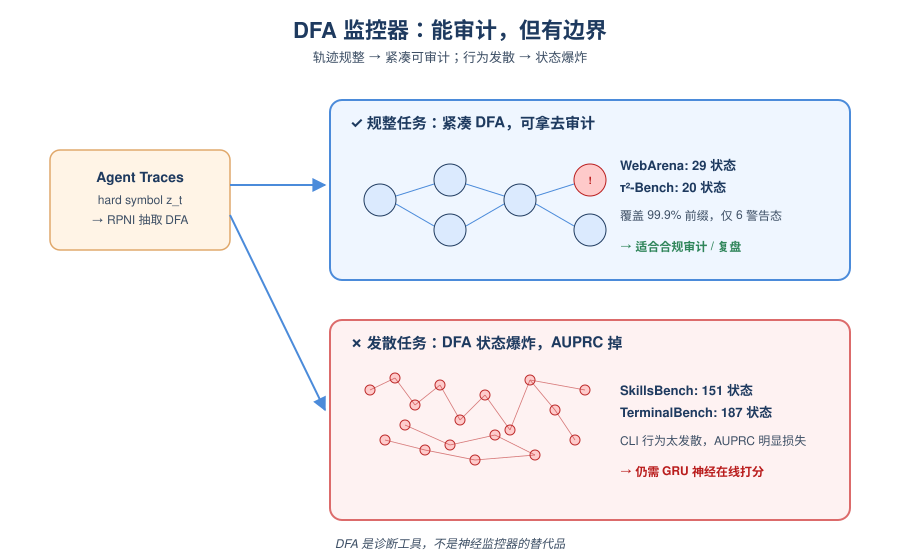
*图示：如果想要一个可看、可写死规则的有限状态监控器，那只在轨迹相对规整的场景下行得通。作者诚实地把这当成'诊断边界'：神经backend仍然是最强的在线打分器，DFA更适合给合规审计、事故复盘用，不能无差别替换神经监控。*

- 技术细节：训练后用hard symbol zt=选择分数最高的方案 αt在训练轨迹上跑RPNI抽出DFA，每个状态用held-out calibration赋风险分。WebArena、τ²-Bench得到29/20状态的紧凑自动机；而SkillsBench/TerminalBench分别膨胀到151/187状态，且DFA在τ²-Bench和TerminalBench上AUPRC损失较明显。
- 通俗讲解：如果想要一个可看、可写死规则的有限状态监控器，那只在轨迹相对规整的场景下行得通。作者诚实地把这当成'诊断边界'：神经backend仍然是最强的在线打分器，DFA更适合给合规审计、事故复盘用，不能无差别替换神经监控。
- 例子：WebArena抽出的29状态DFA覆盖99.9%的trusted前缀，只有6个警告态，很适合拿去给审计review；但TerminalBench的DFA膨胀到187态，说明CLI任务的行为模式太发散，这时继续用GRU在线打分更靠谱。

- **对 Agent 产品/系统的启发：** Agent平台可以用一次性LLM适配+监督式前缀监控，低成本上线runtime预警。
- **详细启发：** 产品侧：对Agent产品方来说，这是一条可复用的'runtime护栏'生产线：历史trace+终局成败标签，就能合成一个每步打分的在线监控器，不用再为每个tool/环境手写规则，也不用在线调judge模型，适合做自动停机、回滚、切safe-mode的触发器。；系统侧：系统层面启示是把StepView这样的typed adapter作为Agent harness标准组件，上层监控器可替换（GRU/Transformer/soft-FSM/DFA），并把'低误报下的首警recall+lead time'作为上线验收指标，而不是只看AUPRC或terminal accuracy。；风险：主要风险有三：一是前缀里本来就没可见失败证据（hidden positive）时任何trace-only监控器都会漏；二是阈值定在低FAR时WebArena这类短轨迹场景可能只剩terminal triage，失去干预窗口；三是DFA审计只在轨迹规整的domain紧凑，异构任务里自动机会膨胀到不可读。

## 三、总结

- 今天的Agent研究一致把可靠性推向runtime与形式化评测
- 安全、记忆、scaffolding三条线也都在回答同一个问题——长程Agent要怎样在运行时被观测、纠偏和约束
- 今天的51篇must\_read呈现一个清晰方向：Agent的可靠性问题正在从prompt层彻底下沉，一边深入到模型内部激活和trace流的实时监控，一边靠SMT这类形式化工具重塑评测基准。安全、记忆、scaffolding三条线也都在回答同一个问题——长程Agent要怎样在运行时被观测、纠偏和约束。对工程团队来说，今天值得记住的判断是：未来的Agent护栏更像是可审计的监控器+激活钩子，而不是又一版更长的system prompt。
