# 2026-05-11 AI Agent 论文日报

> 分类：cs.AI + cs.CL + cs.LG + cs.MA + cs.RO + cs.SE + cs.HC
> 入选论文：3 篇

## 一、初筛每日趋势

- Agent架构松动：编排权从harness让渡给模型自身
- 运行时治理成主线：图审计、约束Gate、记忆级联修复同时落地
- 评测向真实运维和角色边界下沉，揭穿prompt层假协作
- Agent架构层出现范式松动：SPE把agent loop写进模型补全、SARC把约束编入运行时Gate，编排与治理都在脱离硬编码harness、变成可被模型或规则操纵的一等对象。
- Agent运行时治理研究集中爆发：Agent-BOM做统一图审计、MemoRepair形式化记忆级联修复、StateGuard防长期状态投毒，三者从可观测、可修复、可防御三个面向同时补长生命周期Agent的治理短板。
- 评测继续向真实环境与边界场景下沉：SREGym搭高保真云原生故障、TeamBench用OS级角色隔离揭穿prompt-only协作、FixedBench暴露coding agent的action bias，评测越来越像在做'压力测试+缺陷诊断'。
- 可解释性开始切入Agent决策内部：用SAE和线性探针在工具调用前读取模型状态预测调用与后果，机理可解释正成为Agent安全可观测的新一层。

### 跨论文综合观察

- SPE、SARC、Agent-BOM其实在同一条轴上从不同方向切入：SPE把编排策略从harness挪到模型补全，SARC把约束从prompt挪到运行时Gate，Agent-BOM把执行语义从日志挪到属性图——共同趋势是Agent的控制流和安全语义都在脱离隐式实现、变成显式可操纵对象。
- MemoRepair与'长期状态投毒'(ULSPB)形成攻防对照：前者从provenance血缘视角解决合法更新引发的级联陈旧，后者揭示日常对话也能悄悄改写授权与工具默认值，两篇合起来说明长期记忆既要有修复契约也要有writeback边界审计。
- SREGym、TeamBench、FixedBench、EnvSimBench四个评测共同指向'Agent在受控demo里看起来能干，但在真实/受限/边界场景里频繁失败'，且失败模式越来越具体：故障定位、角色越权、行动偏置、多状态同步——评测正从总分制走向缺陷诊断学。

## 二、重点论文精读

### 1. Self-Programmed Execution for Language-Model Agents
- **方向：** general\_agent
- **评分：** 相关性 92 | 价值 85 | 有趣性 90 | 创新性 90 | 开拓性 88
- **为什么入选：** 把编排程序交给模型本身写，挑战 Agent 框架的固定 harness 范式
- **快速背景：** 现有 Agent 都靠固定 harness 控制多轮编排，作者想把这个权力还给模型
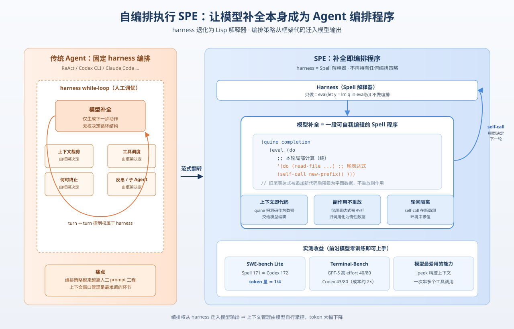
*图示：这篇论文直接质疑当前所有 Agent 框架的核心假设——必须有一个固定的 orchestrator 控制多轮状态。它提出让模型补全本身就是编排程序，harness 退化为纯执行层，并给出形式化定义、可用语言 Spell 与在 Terminal-Bench/SWE-bench 上的实测，对 Agent runtime 设计者尤其值得一读。*

- **详细背景：** 目前所有 LM Agent（ReAct、Claude Code、Codex CLI 等）都依赖一个固定的 harness 程序，由它决定每轮保留什么上下文、调用什么工具、何时结束。这部分编排策略越来越成为人工调优的重灾区，业界开始用反思循环、子 Agent 委派等方式做'部分自编排'。本文进一步提问：编排策略是否必须属于 harness？如果让模型补全本身就是编排程序，会发生什么？这对 Agent 架构是一次范式级的探讨。
- **详细入选理由：** 这篇论文直接质疑当前所有 Agent 框架的核心假设——必须有一个固定的 orchestrator 控制多轮状态。它提出让模型补全本身就是编排程序，harness 退化为纯执行层，并给出形式化定义、可用语言 Spell 与在 Terminal-Bench/SWE-bench 上的实测，对 Agent runtime 设计者尤其值得一读。

**核心技术点速览：**

#### 技术点 1：SPE：补全即编排程序
- 快速理解：harness 只负责执行，模型补全本身就是下一轮的编排代码

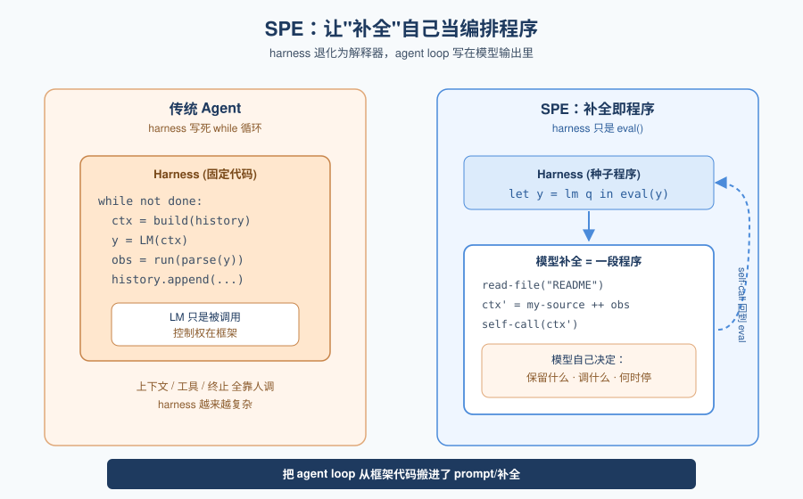
*图示：传统 Agent 像一个固定的 while 循环，里面调用模型；SPE 把这个 while 循环也写在模型输出里。harness 只是个 Lisp 解释器，模型每次输出的代码自己决定要不要再调一次模型、保留哪些上下文、调用哪些工具。等价于把 agent loop 本身从框架代码移进了 prompt/补全里。*

- 技术细节：作者用 agentic machine 形式化定义：状态 x 是 SPE 状态，当且仅当存在自嵌入，使模型可通过选择补全跳到该机器任意状态。具体实现是种子程序 let y = lm q in eval(y)：harness 调用模型，evaluate 它的补全，补全里通常含一个 self-call 用来发起下一轮，从而把 turn-to-turn 的控制权完全交给模型。
- 通俗讲解：传统 Agent 像一个固定的 while 循环，里面调用模型；SPE 把这个 while 循环也写在模型输出里。harness 只是个 Lisp 解释器，模型每次输出的代码自己决定要不要再调一次模型、保留哪些上下文、调用哪些工具。等价于把 agent loop 本身从框架代码移进了 prompt/补全里。
- 例子：种子程序是 (lm q) 的求值结果交给 eval。模型返回一段程序：先调用 read-file 读 README，然后把结果拼到自己的源码后面，再发起 self-call(new-prefix)。harness 不知道这是一次 ReAct，也没有维护 conversation history——一切都是模型生成的代码在驱动。

#### 技术点 2：Spell 语言三大设计挑战
- 快速理解：为了让'数据=上下文=可执行程序'三位一体，Spell 用 Lisp+尾表达式+新鲜环境解决三个坑

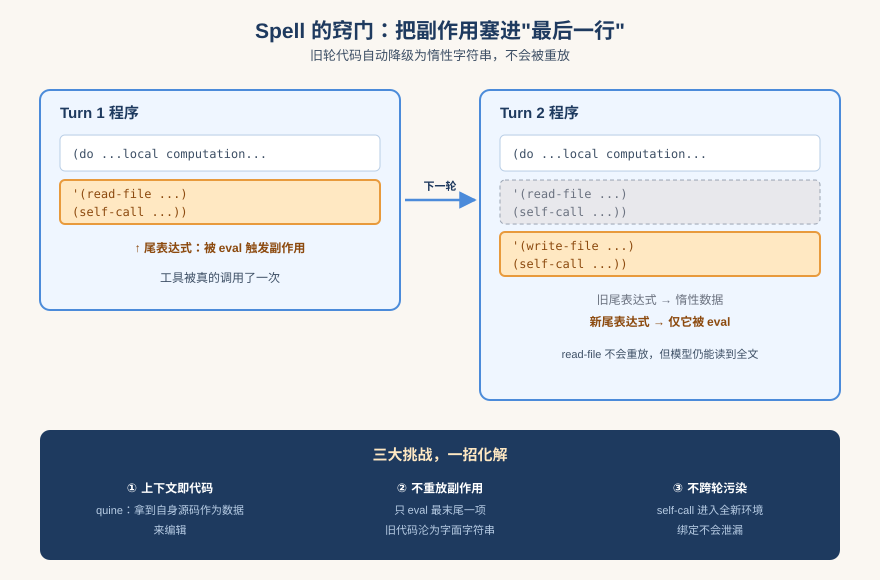
*图示：如果模型每次输出的代码都包含上一轮的整段代码作为前缀，直接重新执行就会陷入死循环、还会重复调用工具。Spell 的窍门是把会产生副作用的部分放在程序最后一行并加引号，外层只 eval 这一行；模型下一轮把新代码追加到这一行后面，原来的'最后一行'就不再是最后一行，自然变成无害的字面数据。*

- 技术细节：Spell 基于 Clojure 风格 Lisp。挑战1：上下文即代码——用 quine 形式让程序拿到自身源码作为数据进行编辑。挑战2：重放副作用——程序主体只能算出一个'尾表达式'作为数据返回，外层 wrapper 才用 eval 触发副作用；新一轮把新代码追加到尾表达式后面，旧的尾表达式自动降级为惰性数据，不会重放工具调用或 self-call。挑战3：跨轮干扰——self-call 在全新局部环境中求值，子程序不会继承或污染父程序的绑定。
- 通俗讲解：如果模型每次输出的代码都包含上一轮的整段代码作为前缀，直接重新执行就会陷入死循环、还会重复调用工具。Spell 的窍门是把会产生副作用的部分放在程序最后一行并加引号，外层只 eval 这一行；模型下一轮把新代码追加到这一行后面，原来的'最后一行'就不再是最后一行，自然变成无害的字面数据。
- 例子：一个 Spell 程序结构是 (quine completion (eval (do ...local computation... '(effectful-expression))))。turn 1 的尾表达式是调用 read-file 然后 self-call。turn 2 时，模型把新逻辑追加在这条 self-call 之后，于是 turn 1 的 self-call 不再被 eval 触发，但作为字符串仍然完整出现在 completion 绑定里供模型阅读。

#### 技术点 3：前沿模型零训练即可上手
- 快速理解：GPT-5.4 等模型未经 Spell 训练也能在 Terminal-Bench/SWE-bench 解决任务

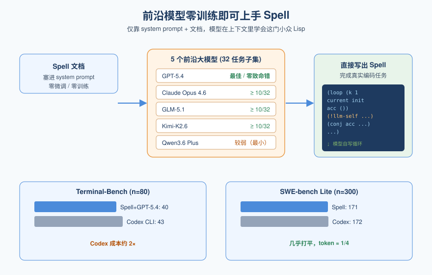
*图示：即使模型从未在 Spell 上做过专门训练，仅凭 system prompt 和文档就能在上下文里学会这门小众 Lisp，并完成真实编码任务。代价是 LongBench、AppWorld 这类任务上明显落后 Codex CLI，说明 Spell 目前更适合编码场景。*

- 技术细节：作者在 Terminal-Bench 1.1 和 SWE-bench Lite 各 32 任务子集上测试 GPT-5.4、Claude Opus 4.6、GLM-5.1、Kimi-K2.6、Qwen3.6 Plus 五个模型。除最小的 Qwen 外，每个模型成功率都不低于 10/32；GPT-5.4 零致命 Spell 错误且成功最多。在完整 Terminal-Bench (n=80) 上，Spell+GPT-5.4 高 effort 解决 40/80，Codex CLI 高 effort 43/80 但成本约 2 倍；SWE-bench Lite (n=300) 中等 effort 下 Spell 171 vs Codex 172，token 量约小 4 倍。
- 通俗讲解：即使模型从未在 Spell 上做过专门训练，仅凭 system prompt 和文档就能在上下文里学会这门小众 Lisp，并完成真实编码任务。代价是 LongBench、AppWorld 这类任务上明显落后 Codex CLI，说明 Spell 目前更适合编码场景。
- 例子：在 Telephone 编排小游戏中，GPT-5.4 自己写出一个 (loop （k 1 current initial-wording acc （）） ...) 循环，每轮调用 !llm-self 让另一个自我实例改写句子并 conj 进 accumulator，跑满 8 轮后返回最终改写——完全由模型自己实现一个确定性 workflow，没有外部 agent loop。

#### 技术点 4：上下文管理是当前最大收益
- 快速理解：模型主要拿 SPE 做上下文裁剪和批量工具调用，多 Agent 编排几乎没用起来

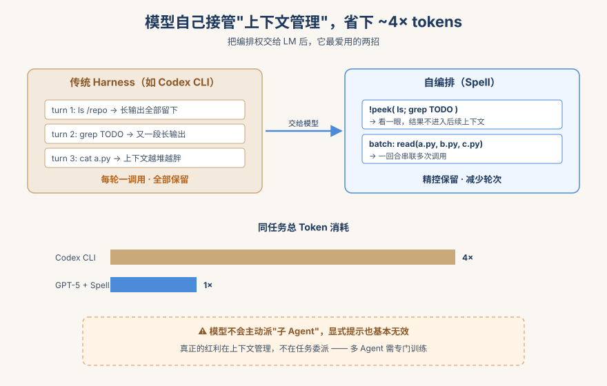
*图示：把编排权交给模型后，它最爱用的功能其实就两个：精细控制哪些工具结果进入下一轮上下文，以及一次性写好一串工具调用减少轮次。这正好对应实践中 harness engineering 最痛的地方——上下文窗口管理。但更高级的'我自己派子 Agent 干活'目前模型不会主动用，需要专门训练。*

- 技术细节：在实测轨迹分析中，GPT-5.4 大量使用 Spell 的 !peek（创建短暂的工具调用表达式，结果不进入后续上下文），相比 Codex CLI 总 token 数减少约 4 倍。Agent 也常把多个工具调用串联、按前一调用结果分支或一次批量执行多次。但多 Agent 委派几乎不用，作者观察到的两次尝试都可能是有害的；即使显式提示模型多 Agent 编排，也基本无效。
- 通俗讲解：把编排权交给模型后，它最爱用的功能其实就两个：精细控制哪些工具结果进入下一轮上下文，以及一次性写好一串工具调用减少轮次。这正好对应实践中 harness engineering 最痛的地方——上下文窗口管理。但更高级的'我自己派子 Agent 干活'目前模型不会主动用，需要专门训练。
- 例子：在 SWE-bench 任务里，模型用 !peek 包住 ls/grep 类调用，看一眼仓库结构后这些大段输出就被丢弃，不会反复占用后续上下文；同一回合内还会同时安排读取多个相关文件，等于一次自写的'批处理工具调用'。

#### 技术点 5：通用性与边界：能表达≠会表达
- 快速理解：理论上 SPE 可表达任意可计算编排策略，但模型实际写出的策略仍然简单

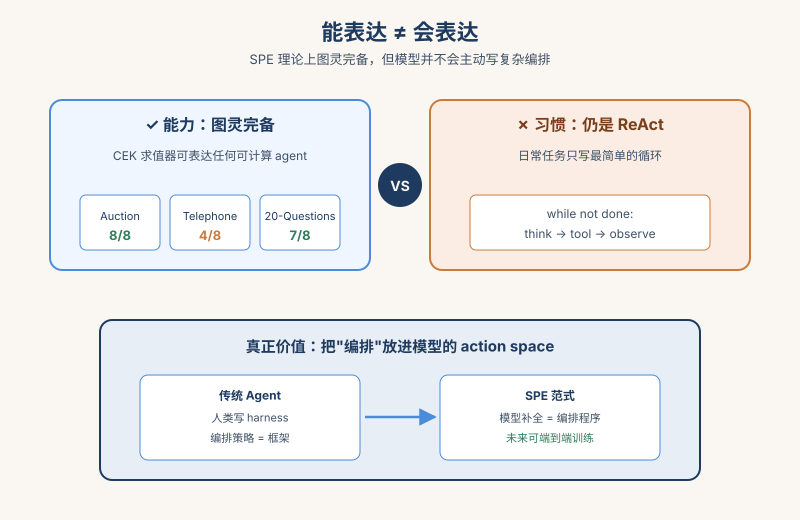
*图示：SPE 的真正价值不是让模型做'外部框架做不到'的事，而是把编排这件事变成模型 action space 的一部分，未来可以端到端训练。论文坦承：现有模型并未自发产生新颖的编排策略，多数行为模拟传统 agent loop；要让 SPE 真正发挥价值，可能需要专门为 Spell 训练的模型。*

- 技术细节：由于底层 CEK 求值器图灵完备，定理给出 universality 推论：种子状态 x\* 可 completion-generate 任何可计算的 agentic machine。但作者明确指出这不是性能保证：任何 SPE 程序也都可以被人类写死在 harness 里，区别只在于'谁来表达'编排策略。当前模型大多只用 Spell 实现简单 ReAct 循环和上下文裁剪，复杂的多 Agent 工作流几乎要靠任务设定专门触发。
- 通俗讲解：SPE 的真正价值不是让模型做'外部框架做不到'的事，而是把编排这件事变成模型 action space 的一部分，未来可以端到端训练。论文坦承：现有模型并未自发产生新颖的编排策略，多数行为模拟传统 agent loop；要让 SPE 真正发挥价值，可能需要专门为 Spell 训练的模型。
- 例子：在 Auction、Telephone、Twenty-Questions 三个'编排小游戏'上，GPT-5.4 分别 8/8、4/8、7/8 成功，证明它有能力写更复杂的编排程序，但日常编码任务里它就是不主动写——能力在那，习惯没养成。

- **对 Agent 产品/系统的启发：** 把 agent loop 当成模型 action space，未来可端到端训练编排策略
- **详细启发：** 产品侧：对做 Agent 平台的团队，这提示了一种极简 runtime 形态：不再维护 agent loop 与 conversation history，只提供一个能 eval 模型代码的沙箱与若干 effect 命名空间，把上下文管理、子 Agent 调度、工具批处理全部交给模型生成的代码完成，可显著降低 token 成本。；系统侧：系统层面要解决三个工程问题：1) 让代码与上下文同体不互相干扰（quine + 尾表达式模式）；2) 副作用不可重放（旧 effect 表达式自动惰性化）；3) 子调用环境隔离避免父子绑定污染。这些是任何 SPE 实现都绕不开的设计约束。；风险：目前模型并未训练适配这种范式，弱模型会写出无效程序导致 fatal error；多 Agent 编排尚不可靠（论文中两次尝试都被判可能有害）；非编码任务（LongBench、AppWorld）下表现不如成熟 harness。生产环境短期仍需配合 effect 命名空间白名单做兜底。

### 2. Towards Security-Auditable LLM Agents: A Unified Graph Representation
- **方向：** agent\_safety
- **评分：** 相关性 92 | 价值 88 | 有趣性 85 | 创新性 85 | 开拓性 85
- **为什么入选：** 首个为Agent设计的BOM式审计图，把记忆投毒、工具误用等隐蔽攻击链结构化还原
- **快速背景：** Agent 风险横跨语义状态、记忆和多 Agent 传播，传统日志/SBOM 看不懂
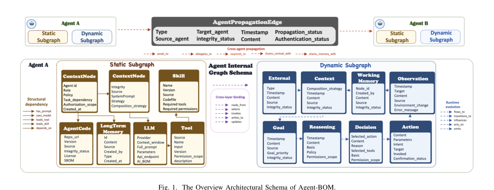
*图示：这张图是论文的主方法总览图，直接展示了 Agent-BOM 的核心分层结构：静态子图、动态子图、内部图模式，以及跨 Agent 传播边和安全属性，能一眼看出作者如何把能力基座、运行时语义状态和多 Agent 交互统一到同一可审计图表示中。相比后面的 Fig.2/Fig.4 攻击案例子图，它更能代表论文的通用方法与系统框架，适合作为日报首图。*

- **详细背景：** LLM Agent 通过动态工具调用、长期记忆和多 Agent 协作完成任务，导致底层物理事件和高层语义意图之间出现严重的 'semantic gap'：同一次文件删除可能是合法指令，也可能是被投毒记忆诱导的攻击。现有的 SBOM、日志、tracing、通用 provenance 图只能记录调用顺序或静态依赖，无法表达目标如何形成、上下文如何被污染、风险如何跨会话和跨 Agent 传播。作者认为 Agent 安全审计需要一个统一的、可查询的结构化表示，这正是 Agent-BOM 想填补的空白。
- **详细入选理由：** Agent 安全可观测性目前最大的痛点就是日志和 SBOM 都只能看到碎片，看不懂语义意图。这篇论文直接把 Agent 执行建模成一张可查询的属性图，并落到 OWASP Agentic Top 10 上做规则化审计，对做 Agent 平台、MCP 工具市场和企业部署的人都有实操价值。

**核心技术点速览：**

#### 技术点 1：Agent-BOM 分层属性图
- 快速理解：把静态能力库和动态语义状态拆成两层图，再用语义边和安全属性串起来

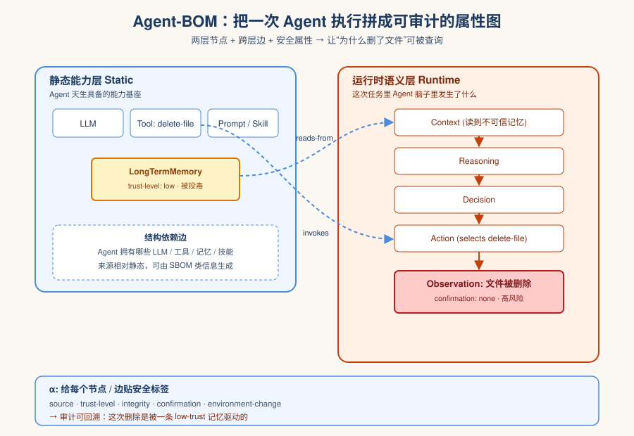
*图示：可以理解成把 Agent 的一次执行画成一张图：上层是它'天生具备的能力'（模型、工具、记忆），下层是'这次任务里它脑子里发生了什么'（目标变成上下文变成推理变成决策变成动作）。每个节点和边再贴上一组安全标签，比如这条上下文是从哪来的、可不可信、有没有人确认过。这样原本散落在日志里的碎片就被拼成了一条能查询的审计路径。*

- 技术细节：Agent-BOM 形式化为 B=(A,V,E,α)：V 分为静态能力层（Agent、LLM、Prompt、Tool、Skill、长期记忆、代码等节点）和运行时语义层（External、Goal、Context、Reasoning、Decision、Action、Observation 节点）；E 分为结构依赖、运行时演化、跨层绑定、跨 Agent 传播四类边；α 给节点边附加 source、trust-level、integrity-status、confirmation-status、environment-change 等安全属性。
- 通俗讲解：可以理解成把 Agent 的一次执行画成一张图：上层是它'天生具备的能力'（模型、工具、记忆），下层是'这次任务里它脑子里发生了什么'（目标变成上下文变成推理变成决策变成动作）。每个节点和边再贴上一组安全标签，比如这条上下文是从哪来的、可不可信、有没有人确认过。这样原本散落在日志里的碎片就被拼成了一条能查询的审计路径。
- 例子：比如 Agent 调用 delete-file 工具：图里会出现 ToolNode(delete-file) ← invokes ← ActionNode ← selects ← DecisionNode ← influences ← ReasoningNode ← reads-from ← ContextNode ← LongTermMemoryNode，每个节点都带 source 和 trust-level 属性，审计员一眼就能看出这次删除其实是被一条不可信的记忆驱动的。

#### 技术点 2：4 步路径化审计范式
- 快速理解：把所有审计规则统一成'入口定位-反向溯源-正向追踪-属性裁定'四元组

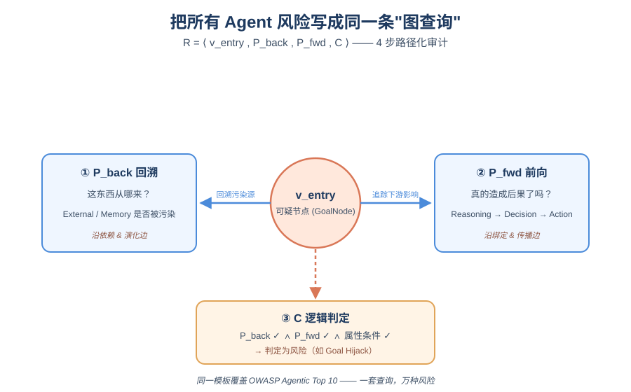
*图示：传统安全规则常常是一类风险一套检测逻辑，很难复用。这里把它统一成图查询：先锁定可疑节点，再往上游查 '这个东西从哪来'，再往下游查 '它是不是真的引发了坏后果'，最后用属性条件判一个是否违规。等于给所有 Agent 风险写出了一种通用 SQL。*

- 技术细节：作者把审计规则定义为 R=⟨ventry, Pback, Pfwd, C⟩：ventry 是风险首次表现的节点/边；Pback 沿依赖和演化边回溯找污染源；Pfwd 沿绑定和传播边看是否真的影响了下游决策、动作或其他 Agent；C 是基于节点/边属性的逻辑判定条件。所有 OWASP Agentic Top 10 风险都按这个模板写。
- 通俗讲解：传统安全规则常常是一类风险一套检测逻辑，很难复用。这里把它统一成图查询：先锁定可疑节点，再往上游查 '这个东西从哪来'，再往下游查 '它是不是真的引发了坏后果'，最后用属性条件判一个是否违规。等于给所有 Agent 风险写出了一种通用 SQL。
- 例子：判 Goal Hijack：ventry=GoalNode；Pback 看 GoalNode 的入边是否回到不可信的 ExternalNode 或被污染的 Memory；Pfwd 看是否经 Context变成Reasoning变成Decision变成Action 真的执行了；C 要求三者同时成立才判定为目标劫持。

#### 技术点 3：覆盖 OWASP Agentic Top 10
- 快速理解：用同一套图模板实例化 10 类 Agent 风险，覆盖供应链、记忆投毒、跨 Agent 传播

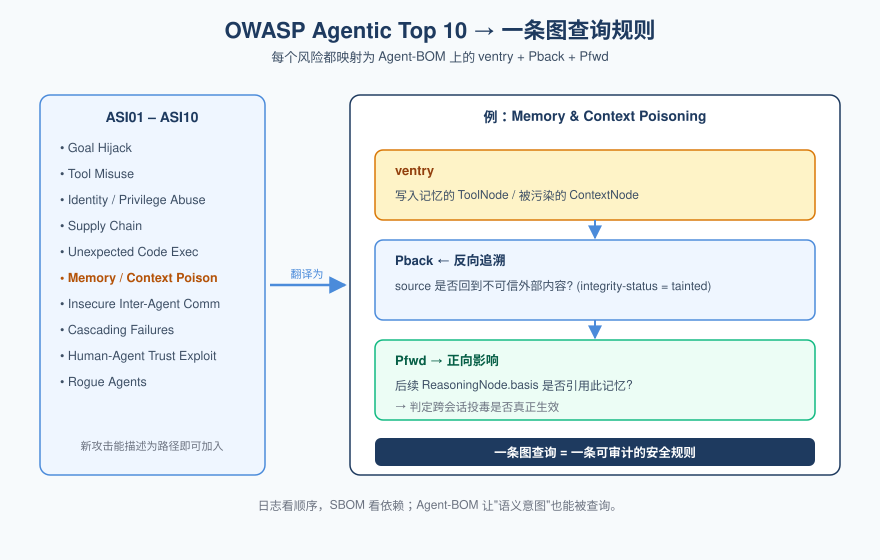
*图示：这部分相当于把业界正在讨论的 Agent 安全清单'翻译成图查询语言'。无论是工具被恶意参数滥用、prompt 模板被供应链污染，还是某个 Agent 在多 Agent 群里持续传播错误目标，都能在同一张图上写一条规则查出来。新出现的攻击只要能描述成路径，就能加进来。*

- 技术细节：论文将 ASI01–ASI10 全部转成 Agent-BOM 上的规则，包括 Goal Hijack、Tool Misuse、Identity & Privilege Abuse、Supply Chain、Unexpected Code Execution、Memory & Context Poisoning、Insecure Inter-Agent Comm、Cascading Failures、Human-Agent Trust Exploitation、Rogue Agents。每类风险明确给出 ventry 类型、Pback/Pfwd 路径方向以及关键属性条件（如 integrity-status、confirmation-status、environment-change）。
- 通俗讲解：这部分相当于把业界正在讨论的 Agent 安全清单'翻译成图查询语言'。无论是工具被恶意参数滥用、prompt 模板被供应链污染，还是某个 Agent 在多 Agent 群里持续传播错误目标，都能在同一张图上写一条规则查出来。新出现的攻击只要能描述成路径，就能加进来。
- 例子：对 Memory & Context Poisoning：ventry 是写入记忆的 ToolNode 或被污染的 ContextNode；Pback 检查 source 属性是否回到不可信外部内容；Pfwd 看后续 ReasoningNode 的 basis 是否引用了这条记忆，从而判定一次跨会话记忆投毒是否真正影响了后续行为。

#### 技术点 4：OpenClaw 上的实测
- 快速理解：在真实 Agent 运行时落地插件，重构出多种隐蔽攻击链

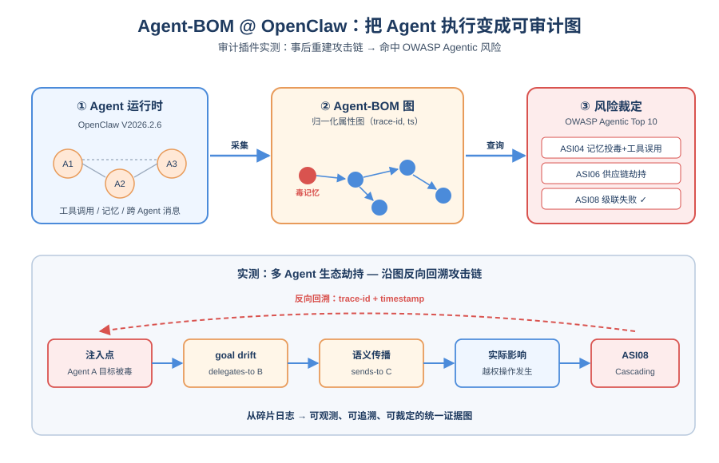
*图示：他们没停在概念图，而是真的做了一个能挂在 Agent 框架上的采集器，把每次执行变成 Agent-BOM 图，然后跑攻击场景看能否事后重建攻击链。这种 '可观测—可追溯—可裁定' 的闭环正是 Agent 安全工程化最缺的一环。*

- 技术细节：作者把 Agent-BOM 实现为 OpenClaw（V2026.2.6）中的审计插件，从真实执行中采集证据并归一化到 schema。评估覆盖四类组合攻击：跨会话记忆投毒+工具误用、能力供应链劫持+意外代码执行、多 Agent 生态劫持、信任滥用导致的权限滥用，共触及 10 类高风险。结果显示 Agent-BOM 能把风险入口、语义状态演化、能力调用、传播路径和实际影响连起来还原。
- 通俗讲解：他们没停在概念图，而是真的做了一个能挂在 Agent 框架上的采集器，把每次执行变成 Agent-BOM 图，然后跑攻击场景看能否事后重建攻击链。这种 '可观测—可追溯—可裁定' 的闭环正是 Agent 安全工程化最缺的一环。
- 例子：在多 Agent 生态劫持场景中：插件捕获跨 Agent 消息边，沿 trace-id 和 timestamp 反向回溯到最初被注入恶意目标的 Agent，再正向追踪同一 'goal drift' 语义如何在多个 Agent 间反复 sends-to/delegates-to，最终判定为 ASI08 Cascading Failures。

- **对 Agent 产品/系统的启发：** Agent 平台需要一层原生审计图，而不是堆日志和 SBOM
- **详细启发：** 产品侧：做 Agent 平台或 Copilot 产品时，可以借鉴 Agent-BOM 的双层节点设计，在控制台为每次会话生成可视化的'执行图+安全属性'，让企业客户能事后追溯一次危险动作究竟来自哪条上下文、哪段记忆或哪条跨 Agent 消息，这是合规和企业落地的硬需求。；系统侧：在 Agent runtime 层面，建议把 trace\_id、source、trust\_level、integrity\_status、confirmation\_status 等属性作为一等公民贯穿 prompt、记忆、工具调用、跨 Agent 消息，并把日志归一化到类似 Agent-BOM 的图 schema，便于用图查询写检测规则，而不是事后从 JSON 日志里 grep。；风险：这套表示假设底层模型、内核、采集探针都可信；如果攻击者能篡改采集 hook 或污染 telemetry，审计图本身就不再可靠。另外对 LLM 内部幻觉、推理是否'语义正确'它并不裁定，仍需配合 sandbox、权限控制等主动防御。

### 3. MEMOREPAIR: Barrier-First Cascade Repair in Agentic Memory
- **方向：** memory
- **评分：** 相关性 92 | 价值 85 | 有趣性 85 | 创新性 85 | 开拓性 82
- **为什么入选：** 首次把Agent记忆的级联失效形式化，并给出可证最优的修复算法
- **快速背景：** Agent记忆里summary、缓存、技能会从源头派生，源头一变，下游还在悄悄用旧信息。
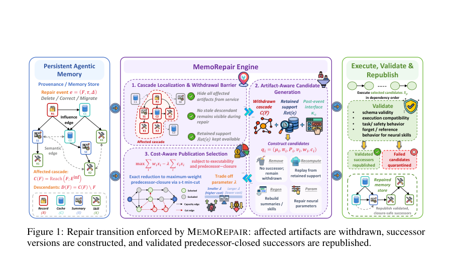
*图示：该图是论文的Figure 1，完整展示了MemoRepair的核心机制与信息流：从持久化agent记忆中的影响传播，到barrier-first撤回受影响后代，再到候选后继构造、基于成本的发布选择，以及最终验证后重发布。它直接解释了论文的方法总览、模块关系和修复工作流，明显优于其余仅展示实验结果或消融的图。*

- **详细背景：** 随着Agent跨任务积累记忆，原始记录会演化为summary、缓存输出、可执行流程、神经技能等派生artifact。当源头被删除、修正或随API迁移失效时，这些下游派生物常常仍可见、继续推动后续决策，造成'用着过期支撑'的隐性故障。已有工作覆盖记忆构造、检索、unlearning和数据库provenance，但缺一个事后过渡机制：哪些派生物要先下架、哪些可以重建、哪些可以重新发布。MemoRepair正是要补这一层。
- **详细入选理由：** 长生命周期Agent会把记忆沉淀成summary、缓存、技能、API流程，一旦源头被删/改/迁移，下游派生物会继续以陈旧支撑误导决策。这篇论文第一次把这件事形式化成'级联更新问题'，并给出barrier-first契约+min-cut精确求解，对做长期记忆Agent的人是治理层的重要参考。

**核心技术点速览：**

#### 技术点 1：形式化级联更新问题
- 快速理解：把'源头一变下游记忆全失效'这件事建模成可计算的修复问题

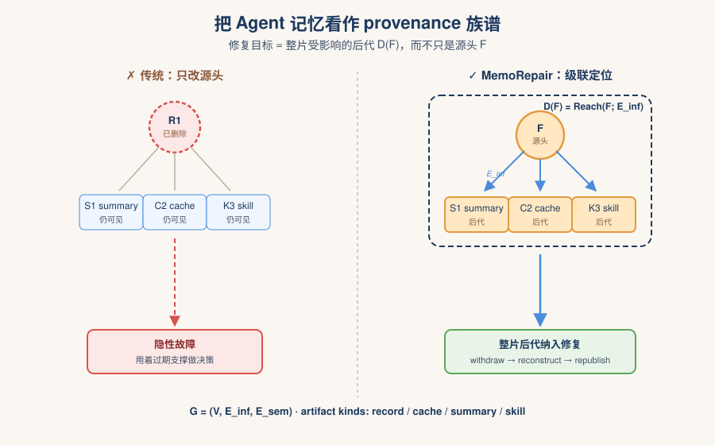
*图示：想象Agent的记忆是一棵棵'信息族谱'：一条原始记录被改/删后，由它衍生出的summary、缓存、技能其实都该跟着动，但传统系统只会改源头。论文先把这棵族谱明确画出来，并规定修复的真正目标是这些'后代'，而不是只盯根节点。*

- 技术细节：作者用一个有向provenance图G=(V, E-inf, E-sem)来表示持久记忆，influence边表示'v由u派生'，并给artifact打kind标签(record/cache/summary/skill)。一次修复事件e=(F, τ, ∆)中τ属于(delete, correct, migrate)，受影响级联C(F)=Reach(F; E-inf)，需要修复的对象是可见派生状态D(F)=C(F)，而不仅仅是被改动的源头。
- 通俗讲解：想象Agent的记忆是一棵棵'信息族谱'：一条原始记录被改/删后，由它衍生出的summary、缓存、技能其实都该跟着动，但传统系统只会改源头。论文先把这棵族谱明确画出来，并规定修复的真正目标是这些'后代'，而不是只盯根节点。
- 例子：比如用户偏好记录R1被删除，但基于R1生成的summary S1、缓存C2、技能K3仍可见；论文会沿influence边算出C(F)=(R1,S1,C2,K3)，把整片受影响后代都纳入修复范围。

#### 技术点 2：Barrier-first修复契约
- 快速理解：先把整片受影响记忆下架，再重建并只发布通过校验的后继

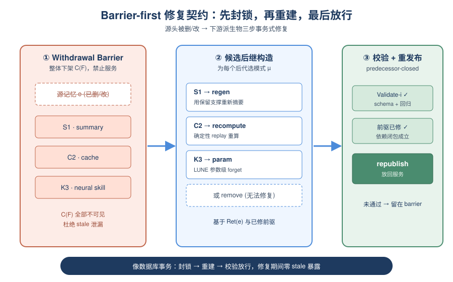
*图示：做法很像数据库事务：先'封锁'所有可能受影响的派生物，谁也别再用；然后挨个尝试重新生成新版本——能replay就replay，能regen就regen，神经技能则做参数级修复；最后只有通过自动校验、且它依赖的前驱也修好的后继才被放回服务。这样修复期间不会有stale信息漏出。*

- 技术细节：MemoRepair定义一个三步契约：(1)Withdrawal Barrier：把C(F)整体置为不可服务；(2)候选构造：对每个后代i分配模式µ-i属于(remove, recompute, regen, param)，从保留支撑Ret(e)和已暂存的修复前驱出发，按当前接口κ-e生成后继；(3)只有通过Validate-i且其依赖前驱也已修复的后继才能重新发布(predecessor-closed)。
- 通俗讲解：做法很像数据库事务：先'封锁'所有可能受影响的派生物，谁也别再用；然后挨个尝试重新生成新版本——能replay就replay，能regen就regen，神经技能则做参数级修复；最后只有通过自动校验、且它依赖的前驱也修好的后继才被放回服务。这样修复期间不会有stale信息漏出。
- 例子：处理删除事件时，系统先把S1、C2、K3全部下架；C2若是确定性缓存就replay重算，S1是summary就regen，K3是神经技能则用LUNE等算子做forget/reference参数修复，每个新版本通过schema+任务回归校验后再republish。

#### 技术点 3：min-cut精确求解发布选择
- 快速理解：把'修哪些值得'转化为最大权前驱闭包，用一次s-t min-cut精确解

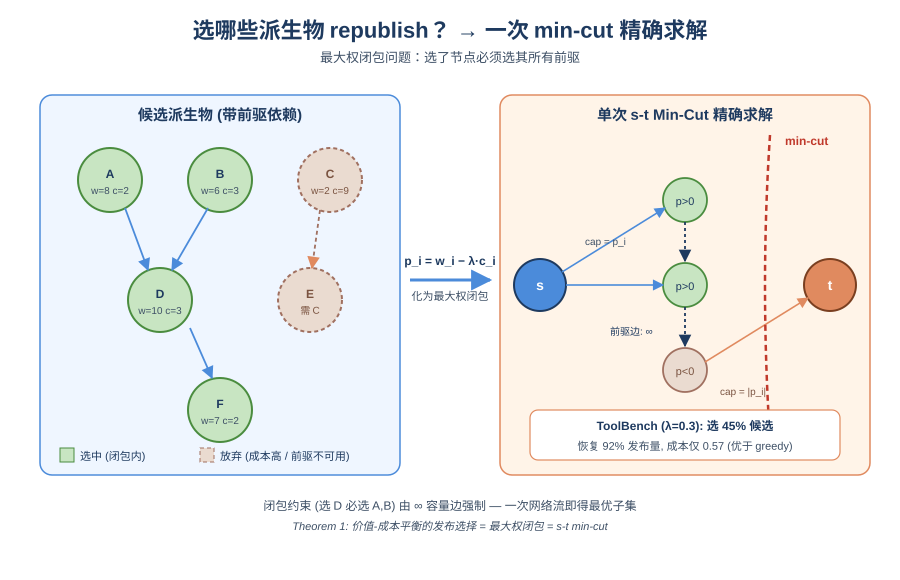
*图示：不是所有派生物都值得修——有的修起来贵、收益小，有的依赖了修不动的前驱。论文把这事建成图论里的经典问题：要选一个候选就必须连带选其所有前驱，再求总价值减总成本最大的子集。这正好等价于一次最大权闭包/最小割，能精确解，不用启发式。*

- 技术细节：对每个候选i赋值价值w-i和成本c-i，引入λ权衡，目标max 求和w-i x-i − λ求和c-i x-i，受可执行性x-i\<=v-i和前驱闭包x-i\<=x-j (j属于P̄-i)约束。论文证明令p-i=w-i−λc-i即化为最大权闭包问题，可由单次s-t min-cut精确求解(Theorem 1)。
- 通俗讲解：不是所有派生物都值得修——有的修起来贵、收益小，有的依赖了修不动的前驱。论文把这事建成图论里的经典问题：要选一个候选就必须连带选其所有前驱，再求总价值减总成本最大的子集。这正好等价于一次最大权闭包/最小割，能精确解，不用启发式。
- 例子：在ToolBench correction事件下，扫描λ会得到一条修复-成本前沿曲线；λ=0.3时min-cut选出45.1%的候选republish，恢复了Repair-all 92%以上的发布量，但归一化成本只有0.57，明显优于greedy基线。

#### 技术点 4：实验验证级联治理价值
- 快速理解：无级联修复的系统92-99%动作仍踩到陈旧记忆，MemoRepair把曝光降到0

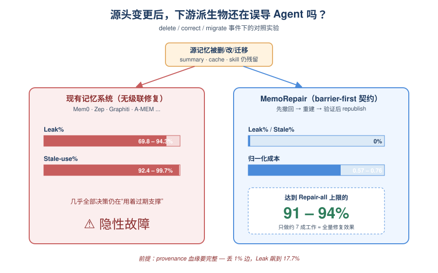
*图示：现有'看起来很先进'的Agent记忆系统其实并不会真正下架受影响内容，事件后绝大多数动作还在用旧信息。MemoRepair用一次先下架再republish的契约把陈旧曝光彻底消除，同时只做大约六七成的修复工作就拿到接近全量修复的效果。但前提是provenance血缘记得全，丢边会按比例放大泄漏。*

- 技术细节：在ToolBench和MemoryArena上测试delete/correct/migrate三类事件。Mem0、Zep/Graphiti、A-MEM等6个不带级联修复的记忆系统Leak%在69.8-94.3%、Stale-use%在92.4-99.7%。MemoRepair在完整provenance下Leak/Stale都为0，validated republish达到Repair-all上限的91.1-94.3%，归一化成本仅0.57-0.76。消融显示provenance完整性是关键不变量(丢1%边Leak升到17.7%)。
- 通俗讲解：现有'看起来很先进'的Agent记忆系统其实并不会真正下架受影响内容，事件后绝大多数动作还在用旧信息。MemoRepair用一次先下架再republish的契约把陈旧曝光彻底消除，同时只做大约六七成的修复工作就拿到接近全量修复的效果。但前提是provenance血缘记得全，丢边会按比例放大泄漏。
- 例子：在ToolBench删除事件中，No-action下100%动作仍用旧信息；Mem0、A-MEM等仍有92-99%的stale-use；切到MemoRepair后Leak=Stale=0，republish 22.4%候选，∆Task仅比Repair-all低0.08点，但成本从1.00降到0.61。

- **对 Agent 产品/系统的启发：** 做长期记忆Agent别只更源头，要给派生物建血缘并设计'下架-重建-校验-发布'流程
- **详细启发：** 产品侧：面向长生命周期Agent产品(个人助理、自演化工具Agent)，删除偏好、修正事实或迁移API时不能只改源头记录，必须把summary、缓存、技能、流程一并治理，否则用户会持续被旧信息影响而难以察觉。；系统侧：记忆系统应内建influence provenance血缘和withdrawal barrier：每条派生artifact记录其依赖来源，更新事件触发级联下架→候选重建→自动校验→predecessor-closed republish；选择哪些值得修可用min-cut按价值/成本求解，并与参数级unlearning组合处理神经技能。；风险：整套保证强依赖provenance完整性(丢1%边泄漏放大18倍)和校验oracle覆盖度；schema-only或单一回归校验都会漏检；神经技能修复仍受底层unlearning算子局限，不等于精确擦除。

## 三、总结

- 今天的关键词是'把Agent的隐性结构变成一等对象'——编排、约束、记忆血缘都被显式化。
- 今天的论文集体在做一件事
- 今天的论文集体在做一件事：把Agent里那些原本藏在harness、prompt和日志里的隐性结构，显式化为可被操纵、查询、修复的一等对象。
- 无论是SPE让模型自己写编排程序，还是Agent-BOM把执行画成可审计图、MemoRepair把派生记忆建成血缘DAG，都指向同一种工程哲学——Agent要进入长生命周期生产，必须先有可治理的内部表示。
- 评测侧则在不断证伪现有Agent的'看起来在协作/在思考/在守规矩'，提醒研究者真实可靠性还远未达成。
