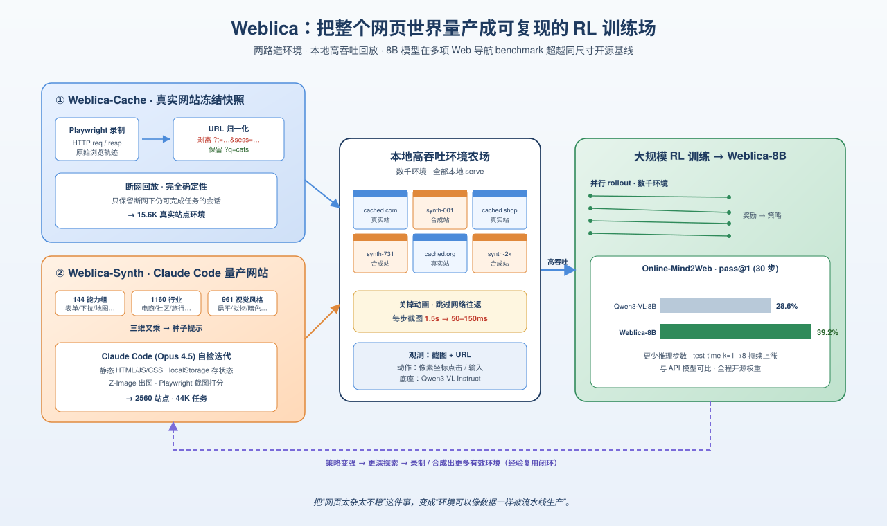
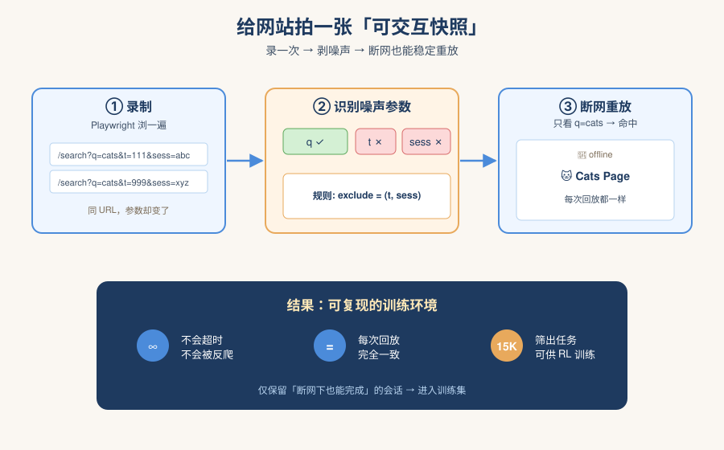
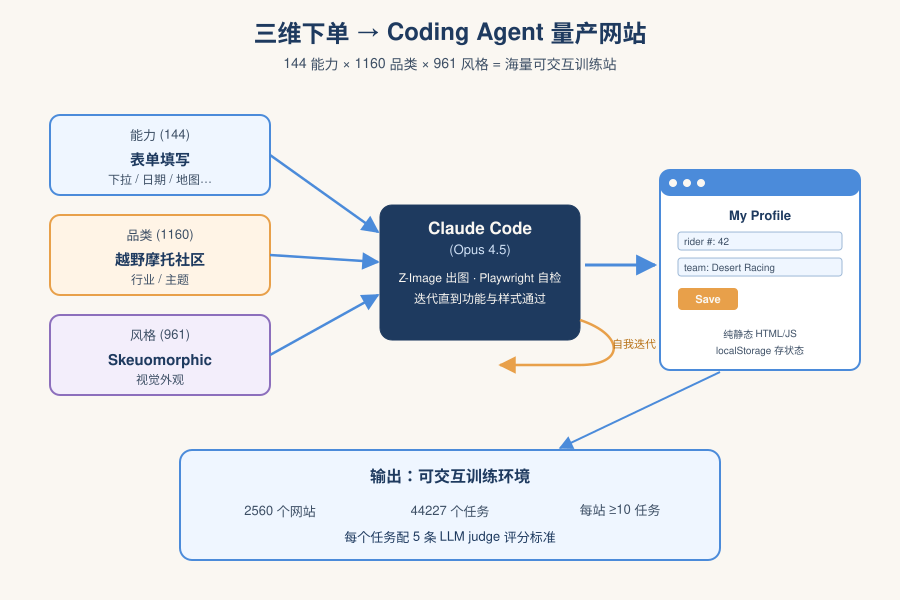
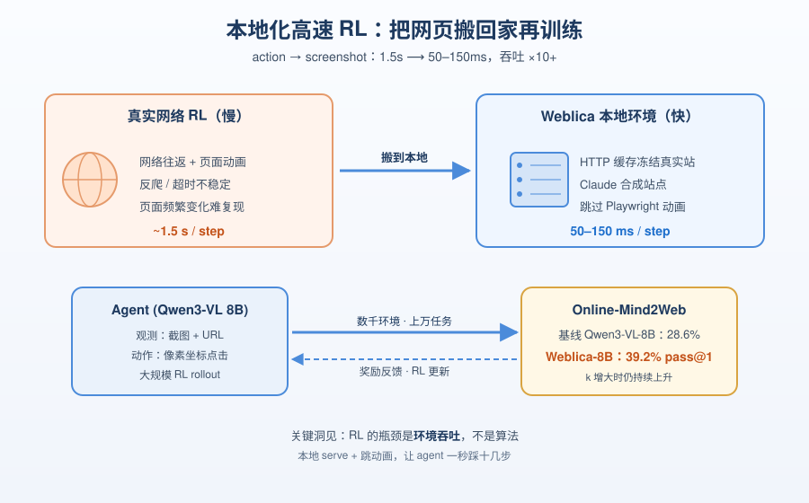
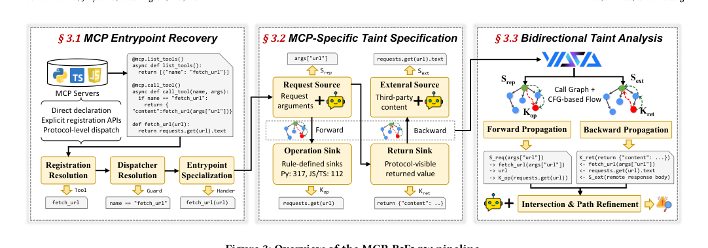
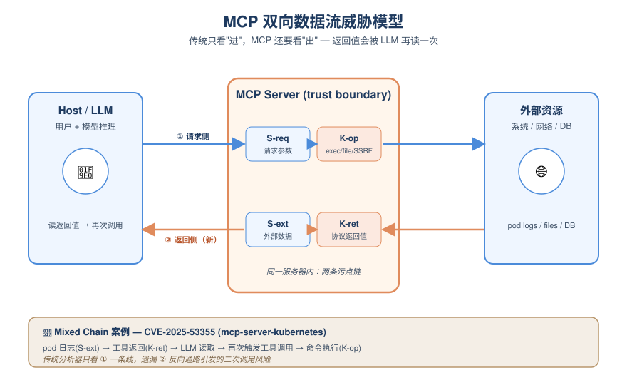
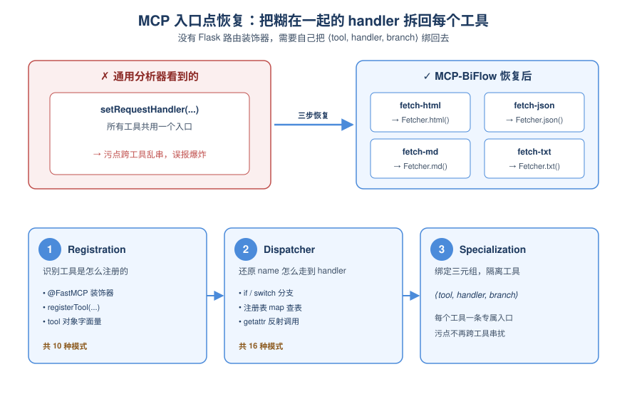
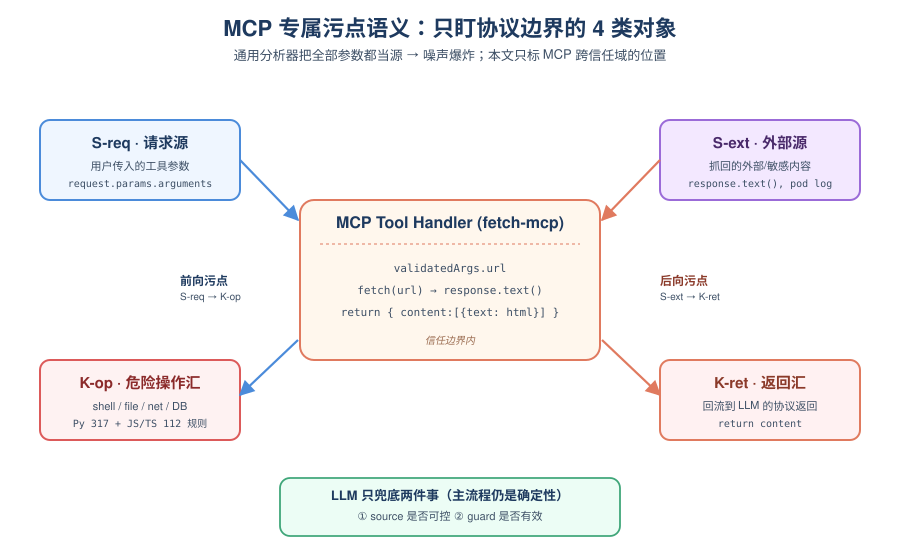
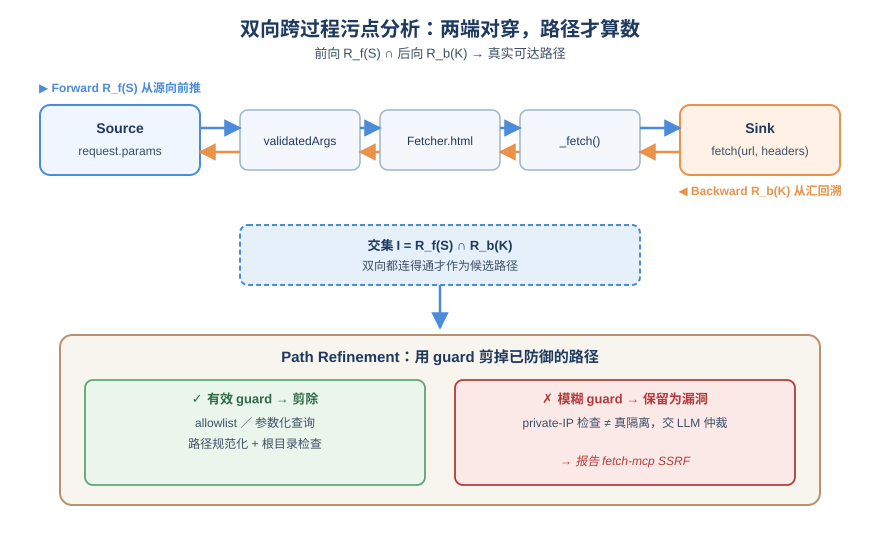
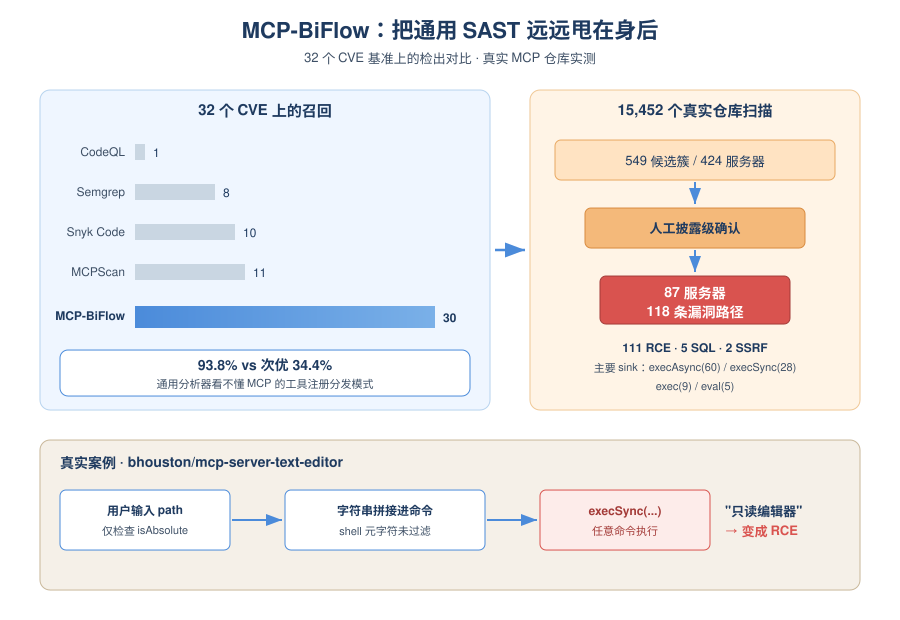

# 2026-05-11 AI Agent 论文日报

> 分类：cs.AI + cs.CL + cs.LG + cs.MA + cs.RO + cs.SE + cs.HC
> 入选论文：3 篇

## 一、初筛每日趋势

- Agent runtime 范式被重新审视：编排权下沉到模型补全
- MCP/记忆/多智能体协议层安全成为新主战场
- Web、SRE、Phone-Use 评测集体转向高保真可复现环境
- Agent 架构层出现范式松动：SPE 把 agent loop 写进模型补全、SARC 把约束编入 runtime 四个执行点，固定 harness 的'编排即代码'正被'编排即模型 action'挑战。
- 安全议题从 prompt 注入彻底下沉到协议与状态层：MCP 双向数据流、长期记忆状态污染、Agent-BOM 审计图谱共同指向'跨信任边界的数据流治理'。
- Agent 评测在向真实环境与可执行验证靠拢：Weblica 把网站冻结成可重放副本、SREGym 注入云原生故障、TeamBench 用 OS 访问控制强制角色分离，揭穿 prompt-only 协作的虚假成功。
- 多智能体协调开始引入形式化方法：TraceFix 用 TLA+ 反例修复协议，与 POMDP 形式化的 agentic search 一道，把 Agent 系统设计推向可验证工程。

### 跨论文综合观察

- SPE、SARC、TraceFix 看似分别讨论编排、治理与协议修复，其实都在回答同一个问题：Agent 的控制流应该写在哪里、由谁验证——SPE 把它推进模型补全，SARC 把它显式编进四个执行点，TraceFix 用 TLA+ 反例反向修复，三者拼出一张'可编程+可审计+可验证'的 runtime 设计谱。
- Unsafe by Flow、Long-Term State Poisoning、Agent-BOM 在不同层面盯同一件事：Agent 的风险已经不在单轮 prompt，而在跨工具、跨记忆、跨智能体的数据流，安全研究正集体转向'流图 + 边界 + 审计'范式。
- Weblica、SREGym、TeamBench、Phone-Use Safety 评测论文方法论高度一致：用真实/高保真环境 + 强制约束（断网重放、故障注入、OS 隔离、能力区分）来戳破 prompt 层面的假性成功，标志 Agent 评测正式进入'环境工程'时代。

## 二、重点论文精读

### 1. Self-Programmed Execution for Language-Model Agents
- **方向：** general\_agent
- **评分：** 相关性 92 | 价值 80 | 有趣性 88 | 创新性 90 | 开拓性 85
- **为什么入选：** 把编排程序交给模型本身写，挑战 Agent 框架的固定 harness 范式
- **快速背景：** 现有 Agent 都靠固定 harness 控制多轮编排，作者想把这个权力还给模型

*图示：这篇论文直接质疑当前所有 Agent 框架的核心假设——必须有一个固定的 orchestrator 控制多轮状态。它提出让模型补全本身就是编排程序，harness 退化为纯执行层，并给出形式化定义、可用语言 Spell 与在 Terminal-Bench/SWE-bench 上的实测，对 Agent runtime 设计者尤其值得一读。*

- **详细背景：** 目前所有 LM Agent（ReAct、Claude Code、Codex CLI 等）都依赖一个固定的 harness 程序，由它决定每轮保留什么上下文、调用什么工具、何时结束。这部分编排策略越来越成为人工调优的重灾区，业界开始用反思循环、子 Agent 委派等方式做'部分自编排'。本文进一步提问：编排策略是否必须属于 harness？如果让模型补全本身就是编排程序，会发生什么？这对 Agent 架构是一次范式级的探讨。
- **详细入选理由：** 这篇论文直接质疑当前所有 Agent 框架的核心假设——必须有一个固定的 orchestrator 控制多轮状态。它提出让模型补全本身就是编排程序，harness 退化为纯执行层，并给出形式化定义、可用语言 Spell 与在 Terminal-Bench/SWE-bench 上的实测，对 Agent runtime 设计者尤其值得一读。

**核心技术点速览：**

#### 技术点 1：SPE：补全即编排程序
- 快速理解：harness 只负责执行，模型补全本身就是下一轮的编排代码

*图示：传统 Agent 像一个固定的 while 循环，里面调用模型；SPE 把这个 while 循环也写在模型输出里。harness 只是个 Lisp 解释器，模型每次输出的代码自己决定要不要再调一次模型、保留哪些上下文、调用哪些工具。等价于把 agent loop 本身从框架代码移进了 prompt/补全里。*

- 技术细节：作者用 agentic machine 形式化定义：状态 x 是 SPE 状态，当且仅当存在自嵌入，使模型可通过选择补全跳到该机器任意状态。具体实现是种子程序 let y = lm q in eval(y)：harness 调用模型，evaluate 它的补全，补全里通常含一个 self-call 用来发起下一轮，从而把 turn-to-turn 的控制权完全交给模型。
- 通俗讲解：传统 Agent 像一个固定的 while 循环，里面调用模型；SPE 把这个 while 循环也写在模型输出里。harness 只是个 Lisp 解释器，模型每次输出的代码自己决定要不要再调一次模型、保留哪些上下文、调用哪些工具。等价于把 agent loop 本身从框架代码移进了 prompt/补全里。
- 例子：种子程序是 (lm q) 的求值结果交给 eval。模型返回一段程序：先调用 read-file 读 README，然后把结果拼到自己的源码后面，再发起 self-call(new-prefix)。harness 不知道这是一次 ReAct，也没有维护 conversation history——一切都是模型生成的代码在驱动。

#### 技术点 2：Spell 语言三大设计挑战
- 快速理解：为了让'数据=上下文=可执行程序'三位一体，Spell 用 Lisp+尾表达式+新鲜环境解决三个坑

*图示：如果模型每次输出的代码都包含上一轮的整段代码作为前缀，直接重新执行就会陷入死循环、还会重复调用工具。Spell 的窍门是把会产生副作用的部分放在程序最后一行并加引号，外层只 eval 这一行；模型下一轮把新代码追加到这一行后面，原来的'最后一行'就不再是最后一行，自然变成无害的字面数据。*

- 技术细节：Spell 基于 Clojure 风格 Lisp。挑战1：上下文即代码——用 quine 形式让程序拿到自身源码作为数据进行编辑。挑战2：重放副作用——程序主体只能算出一个'尾表达式'作为数据返回，外层 wrapper 才用 eval 触发副作用；新一轮把新代码追加到尾表达式后面，旧的尾表达式自动降级为惰性数据，不会重放工具调用或 self-call。挑战3：跨轮干扰——self-call 在全新局部环境中求值，子程序不会继承或污染父程序的绑定。
- 通俗讲解：如果模型每次输出的代码都包含上一轮的整段代码作为前缀，直接重新执行就会陷入死循环、还会重复调用工具。Spell 的窍门是把会产生副作用的部分放在程序最后一行并加引号，外层只 eval 这一行；模型下一轮把新代码追加到这一行后面，原来的'最后一行'就不再是最后一行，自然变成无害的字面数据。
- 例子：一个 Spell 程序结构是 (quine completion (eval (do ...local computation... '(effectful-expression))))。turn 1 的尾表达式是调用 read-file 然后 self-call。turn 2 时，模型把新逻辑追加在这条 self-call 之后，于是 turn 1 的 self-call 不再被 eval 触发，但作为字符串仍然完整出现在 completion 绑定里供模型阅读。

#### 技术点 3：前沿模型零训练即可上手
- 快速理解：GPT-5.4 等模型未经 Spell 训练也能在 Terminal-Bench/SWE-bench 解决任务

*图示：即使模型从未在 Spell 上做过专门训练，仅凭 system prompt 和文档就能在上下文里学会这门小众 Lisp，并完成真实编码任务。代价是 LongBench、AppWorld 这类任务上明显落后 Codex CLI，说明 Spell 目前更适合编码场景。*

- 技术细节：作者在 Terminal-Bench 1.1 和 SWE-bench Lite 各 32 任务子集上测试 GPT-5.4、Claude Opus 4.6、GLM-5.1、Kimi-K2.6、Qwen3.6 Plus 五个模型。除最小的 Qwen 外，每个模型成功率都不低于 10/32；GPT-5.4 零致命 Spell 错误且成功最多。在完整 Terminal-Bench (n=80) 上，Spell+GPT-5.4 高 effort 解决 40/80，Codex CLI 高 effort 43/80 但成本约 2 倍；SWE-bench Lite (n=300) 中等 effort 下 Spell 171 vs Codex 172，token 量约小 4 倍。
- 通俗讲解：即使模型从未在 Spell 上做过专门训练，仅凭 system prompt 和文档就能在上下文里学会这门小众 Lisp，并完成真实编码任务。代价是 LongBench、AppWorld 这类任务上明显落后 Codex CLI，说明 Spell 目前更适合编码场景。
- 例子：在 Telephone 编排小游戏中，GPT-5.4 自己写出一个 (loop （k 1 current initial-wording acc （）） ...) 循环，每轮调用 !llm-self 让另一个自我实例改写句子并 conj 进 accumulator，跑满 8 轮后返回最终改写——完全由模型自己实现一个确定性 workflow，没有外部 agent loop。

#### 技术点 4：上下文管理是当前最大收益
- 快速理解：模型主要拿 SPE 做上下文裁剪和批量工具调用，多 Agent 编排几乎没用起来

*图示：把编排权交给模型后，它最爱用的功能其实就两个：精细控制哪些工具结果进入下一轮上下文，以及一次性写好一串工具调用减少轮次。这正好对应实践中 harness engineering 最痛的地方——上下文窗口管理。但更高级的'我自己派子 Agent 干活'目前模型不会主动用，需要专门训练。*

- 技术细节：在实测轨迹分析中，GPT-5.4 大量使用 Spell 的 !peek（创建短暂的工具调用表达式，结果不进入后续上下文），相比 Codex CLI 总 token 数减少约 4 倍。Agent 也常把多个工具调用串联、按前一调用结果分支或一次批量执行多次。但多 Agent 委派几乎不用，作者观察到的两次尝试都可能是有害的；即使显式提示模型多 Agent 编排，也基本无效。
- 通俗讲解：把编排权交给模型后，它最爱用的功能其实就两个：精细控制哪些工具结果进入下一轮上下文，以及一次性写好一串工具调用减少轮次。这正好对应实践中 harness engineering 最痛的地方——上下文窗口管理。但更高级的'我自己派子 Agent 干活'目前模型不会主动用，需要专门训练。
- 例子：在 SWE-bench 任务里，模型用 !peek 包住 ls/grep 类调用，看一眼仓库结构后这些大段输出就被丢弃，不会反复占用后续上下文；同一回合内还会同时安排读取多个相关文件，等于一次自写的'批处理工具调用'。

#### 技术点 5：通用性与边界：能表达≠会表达
- 快速理解：理论上 SPE 可表达任意可计算编排策略，但模型实际写出的策略仍然简单

*图示：SPE 的真正价值不是让模型做'外部框架做不到'的事，而是把编排这件事变成模型 action space 的一部分，未来可以端到端训练。论文坦承：现有模型并未自发产生新颖的编排策略，多数行为模拟传统 agent loop；要让 SPE 真正发挥价值，可能需要专门为 Spell 训练的模型。*

- 技术细节：由于底层 CEK 求值器图灵完备，定理给出 universality 推论：种子状态 x\* 可 completion-generate 任何可计算的 agentic machine。但作者明确指出这不是性能保证：任何 SPE 程序也都可以被人类写死在 harness 里，区别只在于'谁来表达'编排策略。当前模型大多只用 Spell 实现简单 ReAct 循环和上下文裁剪，复杂的多 Agent 工作流几乎要靠任务设定专门触发。
- 通俗讲解：SPE 的真正价值不是让模型做'外部框架做不到'的事，而是把编排这件事变成模型 action space 的一部分，未来可以端到端训练。论文坦承：现有模型并未自发产生新颖的编排策略，多数行为模拟传统 agent loop；要让 SPE 真正发挥价值，可能需要专门为 Spell 训练的模型。
- 例子：在 Auction、Telephone、Twenty-Questions 三个'编排小游戏'上，GPT-5.4 分别 8/8、4/8、7/8 成功，证明它有能力写更复杂的编排程序，但日常编码任务里它就是不主动写——能力在那，习惯没养成。

- **对 Agent 产品/系统的启发：** 把 agent loop 当成模型 action space，未来可端到端训练编排策略
- **详细启发：** 产品侧：对做 Agent 平台的团队，这提示了一种极简 runtime 形态：不再维护 agent loop 与 conversation history，只提供一个能 eval 模型代码的沙箱与若干 effect 命名空间，把上下文管理、子 Agent 调度、工具批处理全部交给模型生成的代码完成，可显著降低 token 成本。；系统侧：系统层面要解决三个工程问题：1) 让代码与上下文同体不互相干扰（quine + 尾表达式模式）；2) 副作用不可重放（旧 effect 表达式自动惰性化）；3) 子调用环境隔离避免父子绑定污染。这些是任何 SPE 实现都绕不开的设计约束。；风险：目前模型并未训练适配这种范式，弱模型会写出无效程序导致 fatal error；多 Agent 编排尚不可靠（论文中两次尝试都被判可能有害）；非编码任务（LongBench、AppWorld）下表现不如成熟 harness。生产环境短期仍需配合 effect 命名空间白名单做兜底。

### 2. Weblica: Scalable and Reproducible Training Environments for Visual Web Agents
- **方向：** web\_agent
- **评分：** 相关性 93 | 价值 88 | 有趣性 82 | 创新性 82 | 开拓性 85
- **为什么入选：** 用 HTTP 缓存+LLM 合成造出几千个可复现网页环境，把 web agent 的 RL 训练规模化
- **快速背景：** Web agent 训练长期卡在'没有可复现可扩展的交互环境'这道坎上

*图示：Web agent 难做的核心瓶颈是训练环境——真实网站不稳定、模拟环境太少。这篇 Apple 的工作直接把网页环境'量产'出来：一边用 HTTP 缓存把真实网站冻结成可重放副本，一边用 Claude Code 合成几千个带任务的网站，从而支撑大规模 RL 训练，并训出在多项 web 导航 benchmark 超过同尺寸开源模型的 8B 模型。*

- **详细背景：** 现有 web agent 训练数据要么是离线轨迹做 SFT、缺乏交互；要么是 WebArena 这类只覆盖少数域的手工模拟环境；直接在真网上训又会被超时、反爬和页面变化搞得不可复现。这篇论文要解决的就是：怎么造出既多样、又能稳定 RL 训练的网页环境。这对所有想做视觉 web agent 的团队都是必经之路。
- **详细入选理由：** Web agent 难做的核心瓶颈是训练环境——真实网站不稳定、模拟环境太少。这篇 Apple 的工作直接把网页环境'量产'出来：一边用 HTTP 缓存把真实网站冻结成可重放副本，一边用 Claude Code 合成几千个带任务的网站，从而支撑大规模 RL 训练，并训出在多项 web 导航 benchmark 超过同尺寸开源模型的 8B 模型。

**核心技术点速览：**

#### 技术点 1：HTTP 缓存做网站快照
- 快速理解：记录并重放真实网站的 HTTP 流量，得到可离线复现的'网站副本'

*图示：可以把它想成给真实网站拍一张'可交互的快照'：先让一个 agent 把网站逛一遍，全部网络请求都录下来；然后回放时发现哪些参数每次都不一样（这些就是噪声），把它们从匹配规则里去掉，于是同一个 URL 在断网情况下也能稳定吐出当时记录的页面。这样训练时就不会被超时、反爬和网站改版打断。*

- 技术细节：Weblica-Cache 用 Playwright 录制一次浏览会话中的所有 HTTP 请求与响应，再通过回放识别出导致 cache miss 的'易变参数'（时间戳、session token 等），自动生成站点级的归一化规则，把这些参数从 cache key 里剥掉，并对分析类等非关键端点合成假响应，最终在完全断网的条件下确定性重放。只有在断网回放下能完成任务的会话才会保留进训练集。
- 通俗讲解：可以把它想成给真实网站拍一张'可交互的快照'：先让一个 agent 把网站逛一遍，全部网络请求都录下来；然后回放时发现哪些参数每次都不一样（这些就是噪声），把它们从匹配规则里去掉，于是同一个 URL 在断网情况下也能稳定吐出当时记录的页面。这样训练时就不会被超时、反爬和网站改版打断。
- 例子：比如录制时请求是 /search?q=cats&-t=111&sess=abc，回放时变成 /search?q=cats&-t=999&sess=xyz。系统比对后判定 q 稳定、-t 和 sess 易变，于是生成规则 exclude-params=（'-t','sess'），之后只要 q=cats 就能命中缓存，返回当时录下的搜索结果页。基于此他们从 InstaV3 任务池中筛出 15.6K 个可在缓存条件下完成的环境与任务。

#### 技术点 2：用编码 Agent 合成网站
- 快速理解：让 Claude Code 按能力/品类/视觉风格三维度量产带任务的网站

*图示：缓存解决不了'需要真正改状态'的任务（比如填表、加购物车），所以他们干脆让一个编码 agent 当外包，按'我要练 X 能力 + 这是 Y 行业 + 用 Z 视觉风格'下单，生成一整个能跑、能交互、还自带任务的小网站。三维采样是为了避免所有生成站长得一模一样，保证多样性。*

- 技术细节：Weblica-Synth 把 web 导航能力（如表单填写、下拉选择、日期选择、地图交互等）拆成 144 个高层能力组，再叉乘 1160 个网站品类和 961 种视觉风格，作为种子让 Claude Code (Opus 4.5) 生成纯静态 HTML/JS/CSS 网站，无后端、用 localStorage 保存状态。生成时会调用 Z-Image-Turbo 出图、用 Playwright 自截图自检，迭代直到功能和样式都过关，每个站再配至少 10 个不同难度的任务。
- 通俗讲解：缓存解决不了'需要真正改状态'的任务（比如填表、加购物车），所以他们干脆让一个编码 agent 当外包，按'我要练 X 能力 + 这是 Y 行业 + 用 Z 视觉风格'下单，生成一整个能跑、能交互、还自带任务的小网站。三维采样是为了避免所有生成站长得一模一样，保证多样性。
- 例子：一次输入可能是：能力=表单填写、品类=越野摩托社区、风格=Skeuomorphic。Claude Code 就吐出一个带 'My Profile' 页面的网站，并配套任务'把 rider number 从 42 改成 77，team name 改成 Desert Racing Team 并保存'，配 5 条评判标准给 LLM judge 打分。最终他们留了 2560 个站、44227 个任务作训练集。

#### 技术点 3：本地化高速 RL 训练
- 快速理解：环境全本地化让单步交互降到 50–150ms，端到端 RL 训练快 30–40%

*图示：RL 训练的瓶颈往往不是算法而是环境吞吐：真网每点一下都要等好几秒。把网页全搬到本地、关掉花哨动画后，agent 一秒能踩十几步，RL rollout 就快得多，规模化才有意义。结果就是 8B 模型用更少步数超过同量级开源 baseline，而且测试期增加采样还能继续涨。*

- 技术细节：所有缓存站点和合成站点都在本地 serve，省掉网络往返，同时打开 Playwright 的动画跳过特性，把每个 action变成screenshot 的耗时从约 1.5 秒压到 50–150ms。Agent 用纯截图 + URL 作观测，输出像素坐标动作，基于 Qwen3-VL Instruct 在数千个环境、上万任务上做 RL，最终 Weblica-8B 在 Online-Mind2Web 上 30 步达到 39.2% pass@1。
- 通俗讲解：RL 训练的瓶颈往往不是算法而是环境吞吐：真网每点一下都要等好几秒。把网页全搬到本地、关掉花哨动画后，agent 一秒能踩十几步，RL rollout 就快得多，规模化才有意义。结果就是 8B 模型用更少步数超过同量级开源 baseline，而且测试期增加采样还能继续涨。
- 例子：在 Online-Mind2Web 上，Qwen3-VL-8B 基线 pass@1 为 28.6%，Weblica-8B 提升到 39.2%；并且把推理尝试数 k 从 1 提到 8 时准确率持续走高，说明该训练方式让模型对 test-time compute 的扩展更友好。

- **对 Agent 产品/系统的启发：** 想训练或评测 web agent，先把'造可复现环境'当成一等公民工程
- **详细启发：** 产品侧：对做浏览器型 agent 的产品团队，这套思路意味着可以围绕真实业务场景建一组'缓存副本 + 合成网站'的私有训练/评测沙盒，避开线上反爬和不可复现，让回归测试和能力专项练习变得可控。；系统侧：系统层面提示：HTTP 录制+易变参数自动剥离是一个可复用的基础设施模式；同时，用编码 agent（Claude Code 类）按'能力×品类×风格'参数化生产环境，是一种比手写模拟器更可扩展的环境工厂思路；本地 serve + 跳过动画带来的 10× 加速对任何 GUI RL 训练都适用。；风险：缓存只能覆盖能稳定录到的页面，对登录态、强后端逻辑无能为力；合成网站存在 sim-to-real gap，靠 LLM judge 打分也可能高估真实任务完成率；以及训练数据被合成站风格带偏，可能在真实长尾网站上掉点。

### 3. Unsafe by Flow: Uncovering Bidirectional Data-Flow Risks in MCP Ecosystem
- **方向：** agent\_safety
- **评分：** 相关性 92 | 价值 88 | 有趣性 85 | 创新性 80 | 开拓性 85
- **为什么入选：** 首个面向 MCP 协议双向数据流的静态分析框架，扫出 118 个真实漏洞
- **快速背景：** MCP 服务器爆发式增长，但通用静态分析器无法识别其工具注册和双向数据流，漏洞频出。

*图示：这张图是论文方法本体的总览图，直接展示了 MCP-BiFlow 的三大核心阶段：MCP 入口点恢复、MCP 专属污点规范、双向污点分析，并明确了前向/后向传播与路径精化等关键机制，最能一眼解释论文如何工作。相比之下，Figure 1 更偏威胁模型与生态数据流背景，不如该图能代表具体方法。*

- **详细背景：** Anthropic 在 2024 年底推出 MCP 后，16 个月内 MCP 服务器数量已接近 6 万，成为 LLM Agent 调用外部工具的统一接口。但 MCP 涉及 host-client-server 三方信任边界：请求侧用户输入可能流入 shell、文件、数据库等敏感操作；返回侧外部抓取或敏感内部数据可能反向回流到模型推理。CodeQL、Semgrep、Snyk Code 等通用分析器不理解 MCP 的工具注册和分发模式，MCPScan 等专用工具也仅做局部规则匹配，无法跟踪完整工具作用域内的传播路径。
- **详细入选理由：** MCP 已成为 LLM Agent 调用工具的事实标准接口，但其host-client-server的链路天然横跨多个信任边界。这篇论文不是停留在概念讨论，而是构建了静态分析工具 MCP-BiFlow，在 32 个已确认 CVE 上达到 93.8% 召回，并在 15,452 个真实 MCP 仓库中确认了 87 个服务、118 条漏洞路径，对 Agent 协议层安全治理有直接系统性贡献。

**核心技术点速览：**

#### 技术点 1：双向数据流威胁模型
- 快速理解：把 MCP 安全问题统一建模为请求侧与返回侧两类跨信任边界传播

*图示：传统 Web 安全只关心'用户输入到危险函数'这一条线。但 MCP 多了一条反向通路：工具返回值会被 LLM 再读一遍，可能再次触发工具调用。所以必须同时盯进口和出口。论文用这套视角重新定义了源、汇和它们之间的关系。*

- 技术细节：论文将 MCP 服务器漏洞重构为双向 trust-boundary 数据流问题：请求侧（S-req 变成 K-op）是请求方可控参数流向命令执行、文件访问、SSRF 等敏感 sink；返回侧（S-ext 变成 K-ret）是外部抓取或敏感内部数据通过协议可见返回值跨出服务器边界，进而影响 host、client 或后续模型推理，形成 mixed chain。
- 通俗讲解：传统 Web 安全只关心'用户输入到危险函数'这一条线。但 MCP 多了一条反向通路：工具返回值会被 LLM 再读一遍，可能再次触发工具调用。所以必须同时盯进口和出口。论文用这套视角重新定义了源、汇和它们之间的关系。
- 例子：CVE-2025-53355 中，mcp-server-kubernetes 的 pod log 内容作为外部源 S-ext 通过工具返回流出，之后这段日志又被模型读到并影响下一次工具调用，正是返回侧传播触发的 mixed chain。

#### 技术点 2：MCP 入口点恢复
- 快速理解：通过注册解析+分发解析+特化，把工具具体处理函数还原出来

*图示：MCP 服务器没有 Flask 那种清晰的路由装饰器，工具往往在一个通用 handler 里通过 name 字符串分发。如果分析器只看到通用入口，就会把所有工具糊在一起分析，误报炸裂。论文先把'哪个工具走哪条代码'恢复出来，再做污点分析。*

- 技术细节：MCP-BiFlow 分三步恢复入口：Registration Resolution 识别 10 种发布模式（FastMCP 装饰器、registerTool、tool 对象等）；Dispatcher Resolution 处理 16 种分发模式（setRequestHandler 协议分发、if/switch 分支、注册表 map、反射 getattr 等）；Entrypoint Specialization 把 ⟨tool, handler, branch⟩ 三元组绑定，避免一个 tool 的污点跨入另一个 tool。
- 通俗讲解：MCP 服务器没有 Flask 那种清晰的路由装饰器，工具往往在一个通用 handler 里通过 name 字符串分发。如果分析器只看到通用入口，就会把所有工具糊在一起分析，误报炸裂。论文先把'哪个工具走哪条代码'恢复出来，再做污点分析。
- 例子：在 fetch-mcp 案例中，setRequestHandler(CallToolRequestSchema, ...) 是通用 handler，论文先识别 request.params.name == 'fetch-html' 这条分支，再把它和 Fetcher.html(validatedArgs) 这个具体处理函数绑定，作为该工具的专属入口。

#### 技术点 3：MCP 专属污点语义
- 快速理解：为请求边界、外部内容、敏感操作、协议返回分别定义源汇

*图示：通用工具把所有函数参数都当源、所有返回值都当汇，会被淹没在噪声里。论文专门挑出 MCP 协议边界上真正跨信任域的位置作为源汇，并且只在'这个值经过校验后还可控吗'这种语义判断上才调用 LLM 兜底，主流程依然是确定性的。*

- 技术细节：定义四类对象：S-req（解码后的请求参数，如 request.params.arguments 及其结构化解包）、K-op（命令执行、文件、网络、DB 等敏感操作 sink，论文实现 Py 317、JS/TS 112 条规则）、S-ext（HTTP response、文件内容、subprocess stdout、git log、pod log 等外部内容）、K-ret（recovered handler 的协议可见返回值）。语义模糊处用 LLM 仅做 source 可控性和 guard 有效性判定。
- 通俗讲解：通用工具把所有函数参数都当源、所有返回值都当汇，会被淹没在噪声里。论文专门挑出 MCP 协议边界上真正跨信任域的位置作为源汇，并且只在'这个值经过校验后还可控吗'这种语义判断上才调用 LLM 兜底，主流程依然是确定性的。
- 例子：fetch-mcp 中，request.params.arguments 标为 S-req，schema 校验后的 validatedArgs.url 仍保留请求边界污点；fetch(url, ...) 是 K-op；response.text() 是 S-ext；最终 return ( content: （( text: html )） ) 是 K-ret。

#### 技术点 4：双向跨过程污点分析
- 快速理解：前向追请求侧 sink，后向回溯返回侧 source，再做交集与 guard 精炼

*图示：MCP 漏洞往往不是一行内的源到汇，而是参数被解包变成helper 转发变成拼装返回对象这种长链路。论文同时从两端往中间走，确保整条路径在调用图上真的连得通，再用 guard 信息把已经被防御掉的路径剪掉。*

- 技术细节：前向传播从 S-req 沿调用图传到 K-op，得到 R-f(S-req)；后向传播从 K-ret 回溯到 S-ext，得到 R-b(K-ret)；最终 I-op = R-f(S-req) ∩ R-b(K-op)、I-ret = R-f(S-ext) ∩ R-b(K-ret) 才作为候选路径。Path Refinement 阶段识别 allowlist、路径规范化+根目录检查、参数化查询等有效 guard，对模糊 guard 才交给 LLM 仲裁，并合并等价路径。
- 通俗讲解：MCP 漏洞往往不是一行内的源到汇，而是参数被解包变成helper 转发变成拼装返回对象这种长链路。论文同时从两端往中间走，确保整条路径在调用图上真的连得通，再用 guard 信息把已经被防御掉的路径剪掉。
- 例子：fetch-mcp 的请求侧路径：request.params.arguments 变成 validatedArgs.url 变成 Fetcher.html 变成 -fetch 变成 fetch(url, headers)；private-IP guard 被识别为不能消除请求边界污点的 guard，路径保留为有效候选并被报告。

#### 技术点 5：大规模实测与基线对比
- 快速理解：32 CVE 召回 93.8%，1.5 万真实仓库确认 118 条漏洞路径

*图示：数字本身就是最强论据：通用 SAST 在 MCP 上几乎瞎；连专用的 MCPScan 也只能抓三分之一。而且这 118 条不是实验室构造的，是真实开源项目里在跑的代码，多数最终落到 child-process.exec 或 eval 这种致命 sink。*

- 技术细节：在 32 个 CVE 基准上 MCP-BiFlow 检出 30 个（93.8%），CodeQL 1、Semgrep 8、Snyk Code 10、MCPScan 11。在 15,452 个 Python/JS/TS MCP 仓库上产出 549 个去重候选簇（覆盖 424 个服务器），经人工披露级评审确认 87 个服务器、118 条漏洞路径，其中 111 条代码执行、5 条 query execution、2 条 SSRF；主要 sink 为 execAsync(60)、execSync(28)、exec(9)、eval(5) 等。
- 通俗讲解：数字本身就是最强论据：通用 SAST 在 MCP 上几乎瞎；连专用的 MCPScan 也只能抓三分之一。而且这 118 条不是实验室构造的，是真实开源项目里在跑的代码，多数最终落到 child-process.exec 或 eval 这种致命 sink。
- 例子：案例 bhouston/mcp-server-text-editor：path 参数仅校验是否绝对路径就拼进 execSync，攻击者用带 shell 元字符的绝对路径即可在 MCP host 上任意命令执行——一个看似只读的'文本编辑器'工具被劫持为 RCE。

- **对 Agent 产品/系统的启发：** Agent 接 MCP 工具时必须把工具入参和返回值都当作潜在攻击面，做协议级污点治理
- **详细启发：** 产品侧：做 Agent 平台或 MCP 网关的团队应在工具注册环节就要求声明参数 schema 和返回内容来源，并在网关层对工具返回内容做隔离标记，避免被 LLM 当作可信指令二次消费；对接受 URL、path、命令片段的工具应强制 allowlist 而非自检。；系统侧：MCP 服务器实现方需要把 request.params.arguments 视为不可信源，对 exec/eval/fetch/file 等 sink 做参数化或严格规范化；同时审视外部抓取内容（HTTP、git log、pod log）在返回前是否经过结构化封装，防止 mixed chain 把外部内容回灌进模型推理。；风险：MCP 生态扩张速度远超安全工具配套，社区中相当比例的服务器存在请求侧 RCE 或返回侧注入路径；通用 SAST 在 MCP 上召回严重不足，仅靠现有 CI 安全扫描会漏掉大多数协议层漏洞。

## 三、总结

- 今天的关键词是'编排下沉与协议治理'：把 loop 交给模型，把安全交给数据流。
- 今天 56 篇 must\_read 中
- 今天 56 篇 must\_read 中，general\_agent、agent\_eval、agent\_safety、multi\_agent 四条线交汇出一个共同信号：Agent 系统设计正在从'调 prompt、堆 harness'转向'形式化 runtime + 跨边界数据流治理'。
- Self-Programmed Execution 把编排权交还给模型，Weblica 把训练环境量产化，MCP-BiFlow 把协议安全做成静态分析工具——三者从架构、数据、安全三个面同时给 Agent 工程化补底。
- 如果说前几天的趋势是'安全从 prompt 下沉到 runtime'，今天则进一步显示：runtime 本身也开始被重新定义，可审计、可验证、可重放成为新的设计准绳。
