# 2026-05-12 AI Agent 论文日报

> 分类：cs.AI + cs.CL + cs.LG + cs.MA + cs.RO + cs.SE + cs.HC
> 入选论文：3 篇

## 一、初筛每日趋势

- Agent评测从刷分转向证据审计与统计严谨
- Harness/runtime成一等公民：在线自我精修、形式化trace
- 安全焦点下沉到OS、知识图谱与监控器红队
- Agent评测方法论集体反思：从单一pass分到证据三态、分层bootstrap、log审计，多篇高分论文都在挑战'榜单分数本身可不可信'。
- Harness/Runtime被当成可优化对象而非脚手架：Continual Harness在线CRUD四件套、Shepherd形式化execution trace、Containment Verification把安全锁在harness层，呈现'runtime as first-class citizen'趋势。
- Agent安全议题从prompt层全面下沉到真实运行环境：LITMUS覆盖OS行为越狱、Oracle Poisoning攻陷工具调用的KG、MonitoringBench反过来红队监控器本身。
- 记忆与长程任务转向'决策导向'：DeMem用rate-distortion重构agent memory，Slipstream为trajectory compaction加异步验证，长程agent的状态管理成为系统级研究焦点。

### 跨论文综合观察

- Computer Use at the Edge 和 Can Agent Benchmarks Support Their Scores 是同一问题的两个侧面：前者从环境设计揭穿pass@k与确定性环境的作弊空间，后者从证据可识别性给出三态标签和上下界，两篇合起来基本重写了交互式Agent评测的方法论标准。
- Continual Harness、Shepherd、Containment Verification 共同把'harness/runtime'抬升为研究一等公民——分别从在线自我改进、形式化执行trace、演绎式安全验证三个角度，呼应了把可靠性和安全性从模型对齐外移到运行时基底的趋势。
- 在安全侧，LITMUS、Oracle Poisoning、MonitoringBench 形成了攻击面三角：操作系统行为、外部知识图谱、监控器本身都被红队，揭示Agent的薄弱点已经全面转移到'模型之外'的基础设施层。

## 二、重点论文精读

### 1. Computer Use at the Edge of the Statistical Precipice
- **方向：** computer\_use
- **评分：** 相关性 98 | 价值 92 | 有趣性 90 | 创新性 88 | 开拓性 90
- **为什么入选：** 用1MB回放脚本击败前沿模型，揭穿CUA基准的统计谎言
- **快速背景：** 现有CUA基准要么静态可记忆，要么统计聚合粗糙，得出的分数不可信
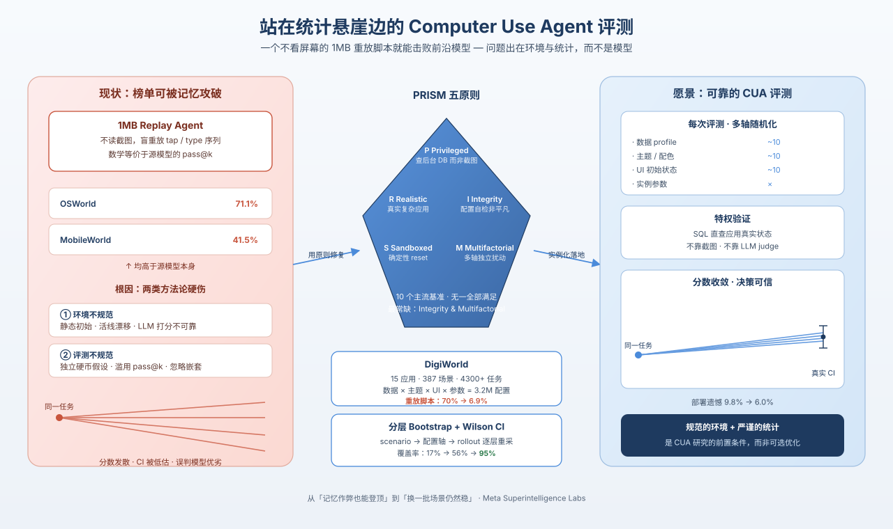
*图示：这篇论文用一个不看屏幕、只重放动作序列的1MB小脚本，居然在主流CUA基准上打败了前沿大模型，直接戳穿了当前Computer Use Agent评测的方法论假象。它不仅诊断问题，还给出环境设计原则PRISM、新基准DigiWorld和分层统计聚合框架，是想做CUA评测的人必读的一篇。*

- **详细背景：** Computer Use Agent（屏幕操作类Agent）的评测过去两年涌现了OSWorld、AndroidWorld等大量基准，但作者发现它们普遍存在两类硬伤：一是环境设计不严谨（静态初始状态、活线服务漂移、LLM-as-judge不可靠、缺乏配置完整性检查），二是评测方法论不严谨（把任务当独立掷硬币、滥用pass@k、忽略嵌套结构）。结果是榜单分数无法复现、可被廉价记忆作弊。这篇来自Meta Superintelligence Labs的工作系统性诊断并修复了这两层问题。
- **详细入选理由：** 这篇论文用一个不看屏幕、只重放动作序列的1MB小脚本，居然在主流CUA基准上打败了前沿大模型，直接戳穿了当前Computer Use Agent评测的方法论假象。它不仅诊断问题，还给出环境设计原则PRISM、新基准DigiWorld和分层统计聚合框架，是想做CUA评测的人必读的一篇。

**核心技术点速览：**

#### 技术点 1：1MB脚本打败前沿模型
- 快速理解：证明静态基准的pass@k等价于盲重放，刷分=记忆而非能力

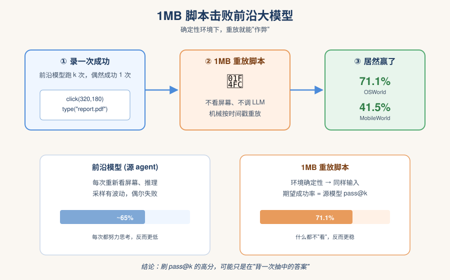
*图示：如果一个基准每次都从同一个画面开始，那只要曾经做对过一次，把那次的动作录下来再播一遍就一定还能成功。所以模型刷pass@k看起来很厉害，本质上只是在'抽中过一次正确答案再背下来'，并不代表它真能看懂屏幕。作者用一个1MB的小脚本就让这个漏洞肉眼可见。*

- 技术细节：作者构造了一个'重放agent'：录下前沿模型成功一次的动作序列，之后完全不看屏幕、原样重放点击和输入。在OSWorld上达到71.1%、MobileWorld上41.5%，反而高于源模型。论文形式化证明：在确定性环境下，重放agent的期望成功率恰好等于源agent的pass@k，且只要单次成功率非零，重放足够多次即可逼近100%。
- 通俗讲解：如果一个基准每次都从同一个画面开始，那只要曾经做对过一次，把那次的动作录下来再播一遍就一定还能成功。所以模型刷pass@k看起来很厉害，本质上只是在'抽中过一次正确答案再背下来'，并不代表它真能看懂屏幕。作者用一个1MB的小脚本就让这个漏洞肉眼可见。
- 例子：在OSWorld某任务上，先让Claude跑k次成功一次，把那次的tap/type序列存下来；之后评测时完全不传截图给脚本，它机械地按时间戳重放，结果照样判为成功，整体得分还比Claude本身高，因为Claude偶尔会因为采样波动失败。

#### 技术点 2：PRISM五条环境设计原则
- 快速理解：提出CUA基准必须同时满足的五条底线，并指出现有基准无一全中

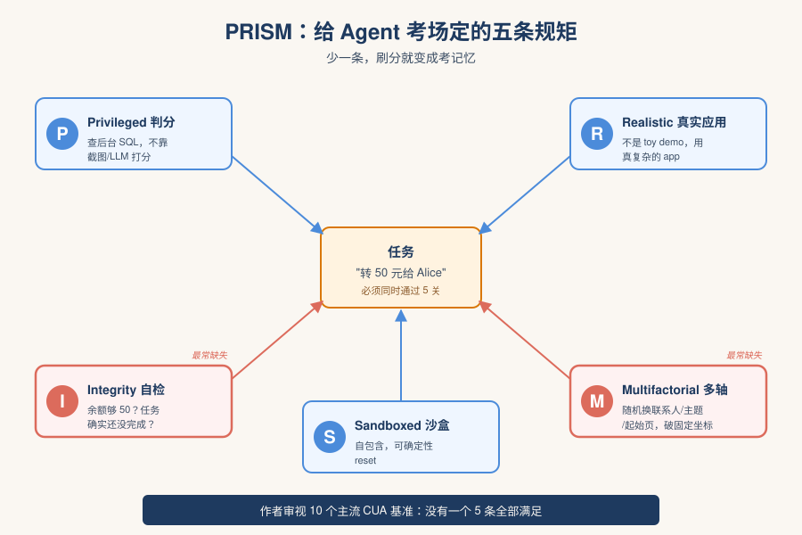
*图示：你可以把PRISM想成给Agent考场定的五条'防作弊+真实性'规矩：判分要看后台真实数据库而不是看截图像不像、考场要像真应用、每道题都要先自检确实能做、整个考场要能干净重置、每次开考的初始条件要在多个维度上随机变。少了任何一条，刷分就会变成考记忆而不是考能力。*

- 技术细节：PRISM=Privileged verification（用应用内部状态而非截图/LLM打分）、Realistic（真实复杂的应用）、Integrity-checked（自动校验配置可行、自洽、非平凡）、Sandboxed（自包含、可确定性reset）、Multifactorial（沿数据、主题、UI状态多轴独立变化）。论文用这五条审视10个主流基准，没有一个全部满足，最常缺失的是Integrity和Multifactorial。
- 通俗讲解：你可以把PRISM想成给Agent考场定的五条'防作弊+真实性'规矩：判分要看后台真实数据库而不是看截图像不像、考场要像真应用、每道题都要先自检确实能做、整个考场要能干净重置、每次开考的初始条件要在多个维度上随机变。少了任何一条，刷分就会变成考记忆而不是考能力。
- 例子：比如一个'转账50元给Alice'的任务：privileged verification要求直接查应用SQL看Alice账户余额是否+50；integrity check要先确认当前账户余额够50且任务还没完成；multifactorial要求每次评测随机换一套数据库（不同联系人）、不同主题色、不同初始页面，让重放agent找不到固定坐标。

#### 技术点 3：DigiWorld：320万配置的沙箱基准
- 快速理解：15个手写Android应用，按PRISM构造320万可验证配置，重放agent在此跌到6.9%

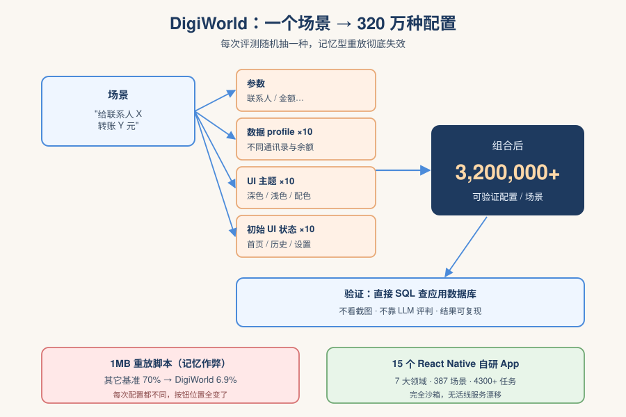
*图示：DigiWorld不是去爬真实App，而是自己造了15个长得像真App的Android应用，这样既真实又能完全沙箱化。每次评测时，数据库里的联系人、界面主题、起始页面都被随机换掉，所以重放脚本之前记下的'第三个按钮'这次可能根本不在那个位置——前面提到的1MB脚本在DigiWorld上的成功率从70%崩到6.9%，恰好印证了多轴变化能挡住记忆作弊。*

- 技术细节：DigiWorld包含15个用React Native手搓的全功能Android应用，覆盖通信、金融、购物、娱乐等7个领域，387个场景、4300+任务实例。每个场景沿4轴独立变化：实例参数、~10种数据profile、~10种主题、~10种UI初始状态，组合出超过320万种可验证配置。验证通过对应用内部数据库做参数化SQL查询完成；离线运行coherence、feasibility、triviality三条流水线确保每个配置都合法且非平凡。
- 通俗讲解：DigiWorld不是去爬真实App，而是自己造了15个长得像真App的Android应用，这样既真实又能完全沙箱化。每次评测时，数据库里的联系人、界面主题、起始页面都被随机换掉，所以重放脚本之前记下的'第三个按钮'这次可能根本不在那个位置——前面提到的1MB脚本在DigiWorld上的成功率从70%崩到6.9%，恰好印证了多轴变化能挡住记忆作弊。
- 例子：对于'给某联系人转账X元'的场景：系统先选一个数据profile（决定有哪些联系人和余额）、一个主题（深色/浅色等）、一个起始UI状态（在首页/在历史页等），然后注入mockdata并reset；agent只通过截图+tap/type/scroll交互；最后验证脚本直接查SQLite确认目标联系人余额变化是否正确，而不是看截图。

#### 技术点 4：分层Bootstrap+Wilson置信区间
- 快速理解：用Wilson区间+四层分层重采样，把名义95%覆盖率从17%拉回到95%

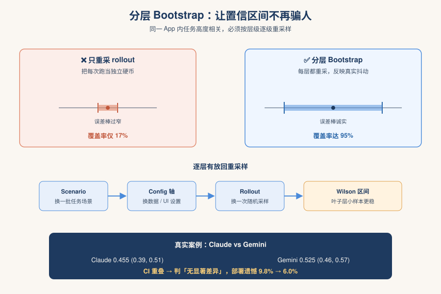
*图示：传统做法是把所有rollout当独立硬币算个均值和置信区间，但同一个app内的任务高度相关，这样算出来的误差棒会严重偏窄，导致两个其实差不多的模型被错判'显著优于'。作者把不确定性按层级一级一级重采样，让置信区间真正反映'换一批场景、换一套环境、换一次采样'后分数会怎么抖。实测Claude vs Gemini的部署遗憾从9.8%降到6.0%，避免了误选模型。*

- 技术细节：评测数据是suite变成app变成scenario变成configuration变成rollout的四层嵌套结构。叶子层用Wilson score interval替代Wald（在R=3、p接近0或1时仍有近95%覆盖，而Wald只有25%）；suite层先按app平均（apps当固定总体不重采样），再做hierarchical bootstrap：依次重采scenario、各环境轴、rollout。仿真显示只重采rollout覆盖率仅17%，加配置轴到56%，加scenario重采才到95%。
- 通俗讲解：传统做法是把所有rollout当独立硬币算个均值和置信区间，但同一个app内的任务高度相关，这样算出来的误差棒会严重偏窄，导致两个其实差不多的模型被错判'显著优于'。作者把不确定性按层级一级一级重采样，让置信区间真正反映'换一批场景、换一套环境、换一次采样'后分数会怎么抖。实测Claude vs Gemini的部署遗憾从9.8%降到6.0%，避免了误选模型。
- 例子：评测时对每个场景跑R=20次rollout、用1000次bootstrap：每次复制都先在app内按scenario有放回重采，再在每个scenario里沿数据/主题/UI轴独立重采配置，最后在配置内重采rollout，重算suite均值得到分布。最终给出Claude 0.455 （0.39, 0.51）、Gemini 0.525 （0.46, 0.57），CI重叠就老老实实判'无显著差异'，不冒险下结论。

- **对 Agent 产品/系统的启发：** 做Agent评测别只看一个数字，环境要多轴随机、统计要分层重采样
- **详细启发：** 产品侧：构建CUA类产品的内部评测时，应自建沙箱版应用而非依赖真实线上服务；任务初始状态、数据、主题要多维度随机化，否则团队会在'记忆型刷分'上自我欺骗；判分尽量用应用内部数据库状态而非截图比对或LLM裁判。；系统侧：Agent评测pipeline应按suite/app/scenario/config/rollout四层结构组织数据，叶子层用Wilson区间，聚合层用hierarchical bootstrap；不要再无脑套用代码生成圈的pass@k去衡量有状态UI交互——它在静态环境里等价于'重放盲打'。；风险：如果继续在静态、未沙箱化、靠LLM-judge的基准上比成绩，模型迭代很可能优化到了记忆和基准漏洞而非真实能力，部署后表现会大幅滑坡；naive置信区间还会让团队误判A/B显著性，错部署劣模型。

### 2. Continual Harness: Online Adaptation for Self-Improving Foundation Agents
- **方向：** general\_agent
- **评分：** 相关性 95 | 价值 90 | 有趣性 92 | 创新性 88 | 开拓性 90
- **为什么入选：** 首个无重置自改进 harness，agent 边玩边改自己的提示、子代理、技能和记忆
- **快速背景：** 编码 agent 有 Claude Code 这类成熟 harness，但具身长程 agent 没有
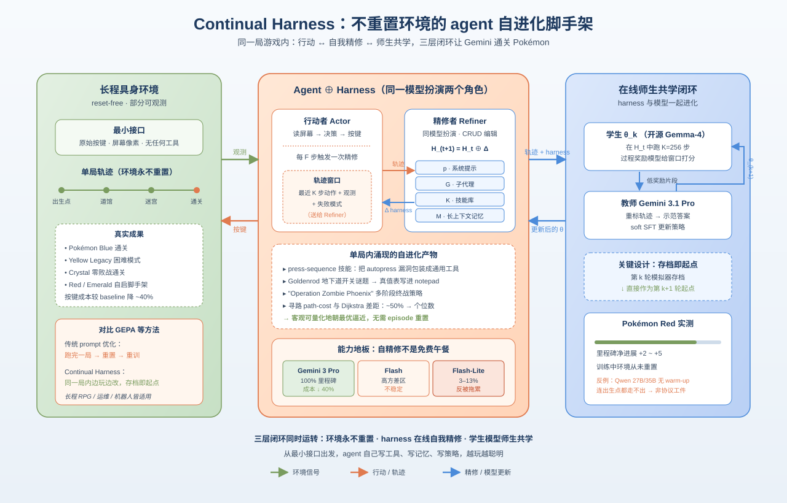
*图示：这篇论文把 'agent 自己迭代自己的脚手架' 做成了可工程化的框架，并在不重置环境的前提下让 Gemini 通关多款 Pokémon RPG，对长程具身 agent 的 harness 设计有直接借鉴价值。*

- **详细背景：** Claude Code、OpenHands 这类编码 harness 已经把 LLM 包装成可用的工具/记忆/规划体系，但具身长程 agent（比如玩 Pokémon）没有对应方案，没人工搭好脚手架前沿模型几乎走不动。已有的 prompt 优化方法（如 GEPA）都需要跑完整 episode 然后重置才能更新，这在长程 RPG、运维、机器人等场景下不现实。作者先用人在环路的方式让 Gemini 通关 Blue/Yellow Legacy 困难/Crystal，再把这套人工迭代过程自动化为 Continual Harness。
- **详细入选理由：** 这篇论文把 'agent 自己迭代自己的脚手架' 做成了可工程化的框架，并在不重置环境的前提下让 Gemini 通关多款 Pokémon RPG，对长程具身 agent 的 harness 设计有直接借鉴价值。

**核心技术点速览：**

#### 技术点 1：无重置在线 harness 自我精修
- 快速理解：agent 边玩边让 Refiner 改自己的 prompt、子代理、技能、记忆，不用重启环境

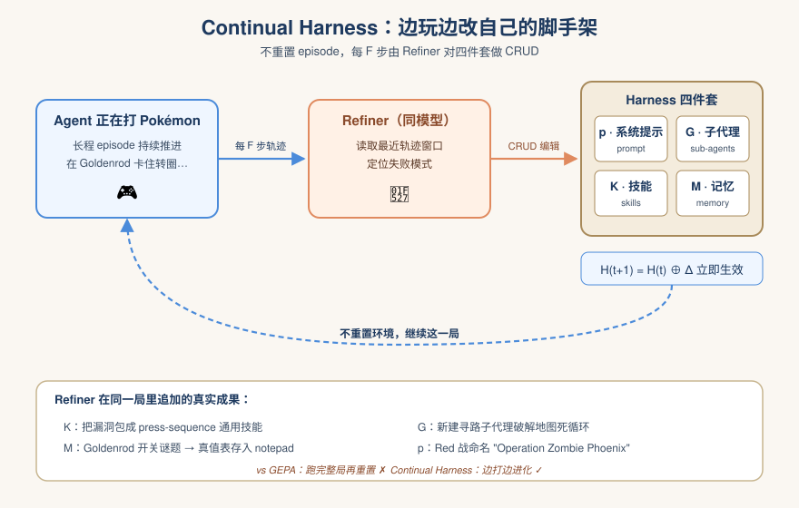
*图示：可以理解为 agent 一边打游戏一边写自己的攻略本和小工具：发现自己在某个洞里转圈，就自动改写提示语、新建一个寻路子代理、把成功路径存为技能、把过期信息从记忆里删掉。和 GEPA 那种 '跑完一局重头来过' 不同，它在同一局里持续累积经验，越玩越聪明。*

- 技术细节：Continual Harness 把 harness 拆成四件套：系统提示 p、子代理 G、技能 K、记忆 M。每隔 F 步，一个 Refiner（同一个模型扮演）读取最近的轨迹窗口找失败模式，对四个组件分别做 CRUD 编辑（增删改查），然后 H-(t+1)=H-t⊕Δ 直接生效，agent 当前 episode 不重置继续往下玩。
- 通俗讲解：可以理解为 agent 一边打游戏一边写自己的攻略本和小工具：发现自己在某个洞里转圈，就自动改写提示语、新建一个寻路子代理、把成功路径存为技能、把过期信息从记忆里删掉。和 GEPA 那种 '跑完一局重头来过' 不同，它在同一局里持续累积经验，越玩越聪明。
- 例子：在 Yellow Legacy 中，agent 自己把一个 autopress-buttons 的小漏洞包装成通用的 press-sequence 技能，又给最终 Red 战命名了 'Operation Zombie Phoenix' 多阶段战斗策略，并在 Goldenrod 地下道把开关谜题写成了真值表存进 notepad——这些都是 Refiner 在同一局里逐步追加进 K 和 M 的产物。

#### 技术点 2：模型与 harness 的在线共学
- 快速理解：开源模型 rollout → PRM 打分 → 前沿教师重标 → soft SFT，环境从不重置

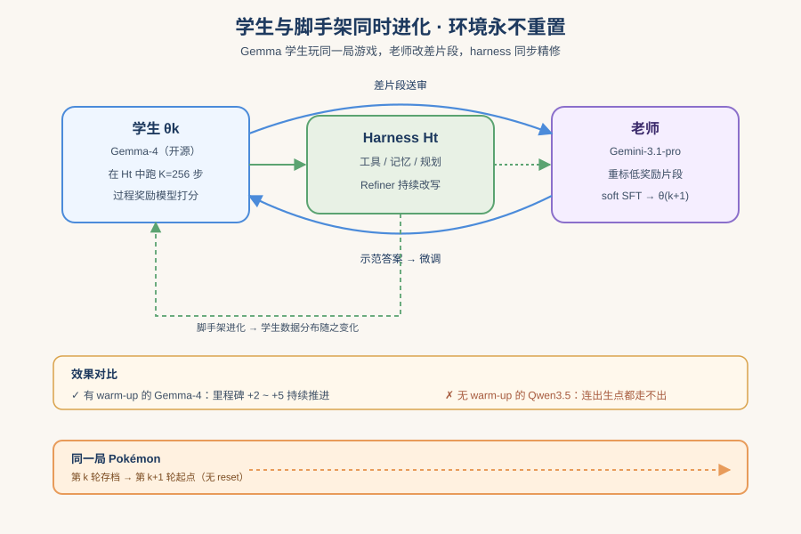
*图示：相当于一个学生（开源 Gemma-4）一直在玩同一局游戏，每打一段就把自己玩得不好的片段交给老师（前沿模型）改成示范答案，再把自己微调一下继续往下玩。harness 也在同时被 Refiner 改写，所以学生的训练数据分布会随着自己策略和脚手架的变化一起进化。*

- 技术细节：在 warm-up（SFT + 离线 GRPO）之后，每轮迭代让 策略θk 在持续精修的 Ht 中跑 K=256 步，过程奖励模型对窗口打分，低奖励片段交给 Gemini-3.1-pro 教师重标，再做 soft SFT 更新得到 θ-(k+1)。关键点：第 k 轮结束时的模拟器存档作为第 k+1 轮起点，环境从不重置。
- 通俗讲解：相当于一个学生（开源 Gemma-4）一直在玩同一局游戏，每打一段就把自己玩得不好的片段交给老师（前沿模型）改成示范答案，再把自己微调一下继续往下玩。harness 也在同时被 Refiner 改写，所以学生的训练数据分布会随着自己策略和脚手架的变化一起进化。
- 例子：在 Pokémon Red 上，从游戏开头和中盘存档分别启动，Gemma-4 在 reset-free 训练中持续推进里程碑（图 7 显示 +2 到 +5 的净进展），而无 warm-up 的 Qwen3.5 27B/35B 连出生点都走不出来，作为反例说明这套 co-learning 不是协议工件。

#### 技术点 3：harness 收益依赖模型能力
- 快速理解：Pro 上严格 Pareto 占优，Flash 高方差，Flash-Lite 反而比 minimal 更差

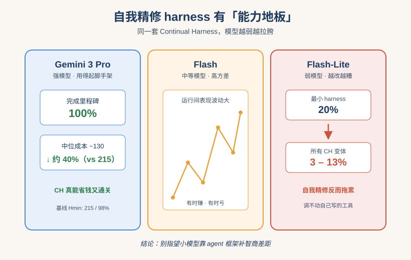
*图示：自我精修不是免费午餐：模型本身得有足够智商去用好它写出来的工具和提示，否则越改越乱。换句话说存在一个 '能力地板'，弱模型不能靠自我搭脚手架翻身。这对选模型上线很有指导意义——别指望小模型靠 agent 框架补能力差距。*

- 技术细节：在 Emerald 的成本-完成度 Pareto 平面上，Gemini 3 Pro 用 from-scratch CH 以 ~130 中位成本达成 100% 里程碑（vs Hmin 215/98%，约 40% 成本下降）；Flash 处于高方差区；Flash-Lite 上每个 CH 变体都跌到 3-13%，明显低于其 Hmin 的 20%。
- 通俗讲解：自我精修不是免费午餐：模型本身得有足够智商去用好它写出来的工具和提示，否则越改越乱。换句话说存在一个 '能力地板'，弱模型不能靠自我搭脚手架翻身。这对选模型上线很有指导意义——别指望小模型靠 agent 框架补能力差距。
- 例子：Flash-Lite 跑 CH 变体最终只完成 3-13% 里程碑，比它自己用最小 harness 的 20% 还差，说明 Refiner 写出来的子代理和技能它根本调用不好，反而拖累原本简单可靠的按键策略。

#### 技术点 4：技能可量化朝最优逼近
- 快速理解：用 Dijkstra 作 oracle，演化出的导航技能成本差距从近 50% 降到个位数

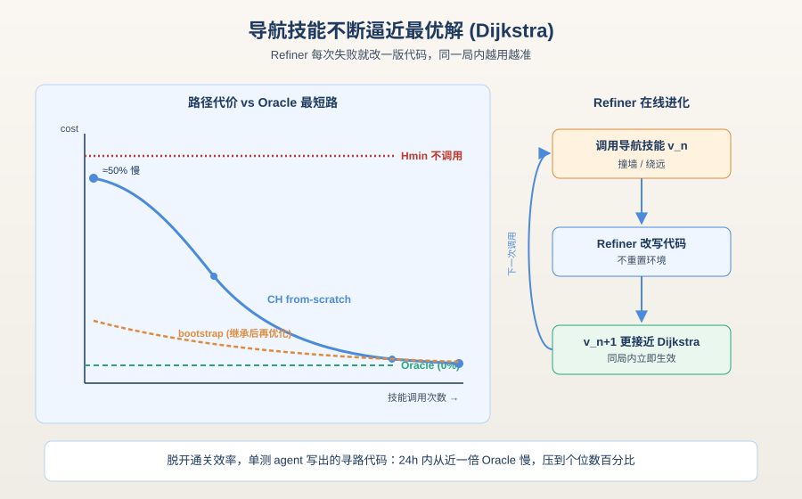
*图示：这是个挺漂亮的客观度量：脱开通关效率单看 'agent 写出来的寻路代码到底好不好'。Refiner 看到一次寻路失败就修一版，下一次调用就是改进版，整个过程在同一局里完成，不需要重置环境再重训。*

- 技术细节：作者在 warp-to-warp 带障碍导航任务上用 Dijkstra 最短路径作为 oracle，测量 Refiner 演化出的 top-10% 导航技能与 oracle 的 path-cost 差距。Hmin 从不调用导航技能；CH from-scratch 的成本差距从开局接近 50% 降到单位数并稳定，bootstrap-updating 还能在继承的技能集上继续进步。
- 通俗讲解：这是个挺漂亮的客观度量：脱开通关效率单看 'agent 写出来的寻路代码到底好不好'。Refiner 看到一次寻路失败就修一版，下一次调用就是改进版，整个过程在同一局里完成，不需要重置环境再重训。
- 例子：24 小时跑下来，from-scratch CH 累计调用导航技能数百次，路径代价从近一倍 oracle 慢慢压到个位数百分比；而 Hmin 一次都没调过自定义导航技能，全靠原始按键。

- **对 Agent 产品/系统的启发：** 把 prompt/工具/记忆当成可在线 CRUD 的对象，让 agent 在同一会话里自我重构脚手架。
- **详细启发：** 产品侧：做长程 agent 产品时，可以借鉴 '四件套（prompt/sub-agent/skill/memory）+ Refiner 周期性 CRUD' 的架构，把脚手架变成在线可演化的状态而非静态配置；尤其适合运维、长任务编码、机器人这类没有 '重置' 概念的场景。；系统侧：工程上要把 harness 状态显式建模并暴露 meta-tool（define\_agent/run\_code/process\_memory 等），让 Refiner 与 Agent 共用同一套编辑 API；训练侧可以叠加 reset-free 的 PRM + 教师重标 + soft SFT 闭环，让模型权重和 harness 状态在同一份轨迹数据上协同演化。；风险：存在能力地板：弱模型用这套框架反而更差；自动 CRUD 编辑可能引入越改越糟的污染（如错误技能、过时记忆），需要 PRM 或回滚机制兜底；长上下文成本与 Refiner 循环开销会随 episode 线性增长。

### 3. Can Agent Benchmarks Support Their Scores? Evidence-Supported Bounds for Interactive-Agent Evaluation
- **方向：** agent\_eval
- **评分：** 相关性 95 | 价值 90 | 有趣性 88 | 创新性 85 | 开拓性 85
- **为什么入选：** 直击 Agent benchmark 分数虚高问题，给出可复现的证据边界审计方法
- **快速背景：** Agent benchmark 用一个成功率掩盖了证据是否充分，本文要把这层不确定性显式化
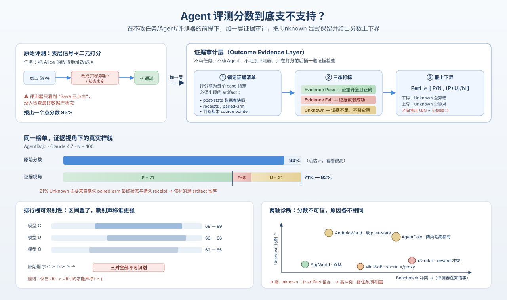
*图示：这篇论文不造新 benchmark，而是审计现有五大 Agent 评测（AndroidWorld、AgentDojo、AppWorld、τ3-bench retail、MiniWoB），用证据三态标签和上下界量化'分数到底支不支持'，对做 Agent 评测和发布榜单的人都是直接可用的方法论。*

- **详细背景：** 交互式 Agent benchmark 把一次运行映射成二元成功/失败，但很多评测器只看表层信号（点了 Save、最终消息、proxy 检查），并不能确认环境状态是否真的按要求改变。比如 AndroidWorld 一个删菜谱任务，agent 实际什么都没删却被判成功。作者把这种'分数和证据脱节'的问题正式化，并提出在不改任务/agent/原评测器的前提下加一层证据审计。
- **详细入选理由：** 这篇论文不造新 benchmark，而是审计现有五大 Agent 评测（AndroidWorld、AgentDojo、AppWorld、τ3-bench retail、MiniWoB），用证据三态标签和上下界量化'分数到底支不支持'，对做 Agent 评测和发布榜单的人都是直接可用的方法论。

**核心技术点速览：**

#### 技术点 1：证据三态标签
- 快速理解：把每条运行打成 Pass/Fail/Unknown，不再把没证据的偷偷算成功

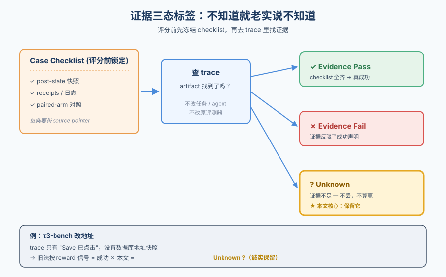
*图示：传统做法是把不确定的 run 默认算成功或者悄悄丢掉，本文坚持把'证据不足'单独标成 Unknown 保留下来。这样一次评分流程就变成：先冻结要看哪些证据，再去存下来的 trace/状态里查，查不到就老实承认不知道。*

- 技术细节：对每个 case 在评分前锁定一份 case checklist，规定要哪些 artifact（post-state、receipts、paired-arm 快照等）才能验证 benchmark 自己的成功声明。运行结束后用这份 checklist 给每条记录打 Evidence Pass / Evidence Fail / Unknown 三种标签，每个判断都要带 source pointer。
- 通俗讲解：传统做法是把不确定的 run 默认算成功或者悄悄丢掉，本文坚持把'证据不足'单独标成 Unknown 保留下来。这样一次评分流程就变成：先冻结要看哪些证据，再去存下来的 trace/状态里查，查不到就老实承认不知道。
- 例子：τ3-bench retail 中一个改地址任务，checklist 要求看到目标用户记录的最终地址字段。如果 trace 只有 'Save 已点击' 而没有数据库快照，这条记录就是 Unknown，而不是按 reward 信号算成功。

#### 技术点 2：证据支撑的分数上下界
- 快速理解：用 [P/N, (P+U)/N] 区间替代单点成功率，宽度即不确定性

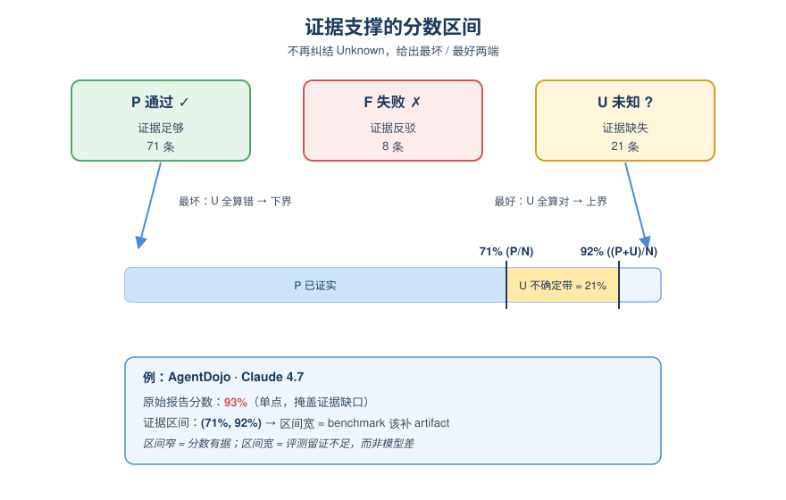
*图示：与其纠结 Unknown 该算对还是错，作者干脆同时报最坏（全算错）和最好（全算对）两端。区间窄说明证据足以支持这个分数；区间宽说明 benchmark 该补的是 artifact 留存，而不是模型能力。*

- 技术细节：设 N=P+F+U，论文给出 Perf 属于 （P/N, (P+U)/N），宽度 U/N 直接量化由 Unknown 带来的不确定性。这是 partial identification 区间，不是置信区间；当 U=0 时退化为点分数，否则任何点估计都隐含对未知记录的强假设。
- 通俗讲解：与其纠结 Unknown 该算对还是错，作者干脆同时报最坏（全算错）和最好（全算对）两端。区间窄说明证据足以支持这个分数；区间宽说明 benchmark 该补的是 artifact 留存，而不是模型能力。
- 例子：AgentDojo 上 Claude 4.7 原生分 93%，证据视角下 P=71/F=8/U=21，区间变成 （71%, 92%），21% 的 Unknown 主要来自缺失 paired-arm 最终状态和持久 receipt，提示 benchmark 需要补保存什么。

#### 技术点 3：排行榜可识别性检查
- 快速理解：只有当两模型区间不重叠才承认排序，否则判 '?'

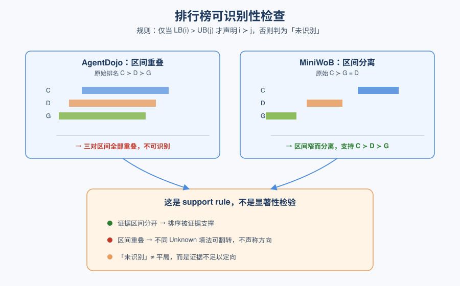
*图示：现在很多 Agent 榜单按点分数硬排，但如果不同 Unknown 的填法能翻转排序，那这个排序其实没被证据支撑。论文给出的规则简单粗暴：区间叠了就别声称谁更强。*

- 技术细节：对每对模型 i, j，仅当 LB-i \> UB-j 才报 i≻j，否则标为未识别（不是统计意义上的 tie，而是证据不支持方向性结论）。这是一个 support rule 而非显著性检验。
- 通俗讲解：现在很多 Agent 榜单按点分数硬排，但如果不同 Unknown 的填法能翻转排序，那这个排序其实没被证据支撑。论文给出的规则简单粗暴：区间叠了就别声称谁更强。
- 例子：AgentDojo 三模型原生顺序是 C≻D≻G，但三对区间全部重叠，所以表里全部判为不可识别；MiniWoB 上原生 C≻G=D，证据区间窄而分开，反而支持 C≻D≻G 的细粒度排序。

#### 技术点 4：五大 benchmark 的失败模式分类
- 快速理解：区分'证据缺失'与'benchmark 检查错对象'两类毛病

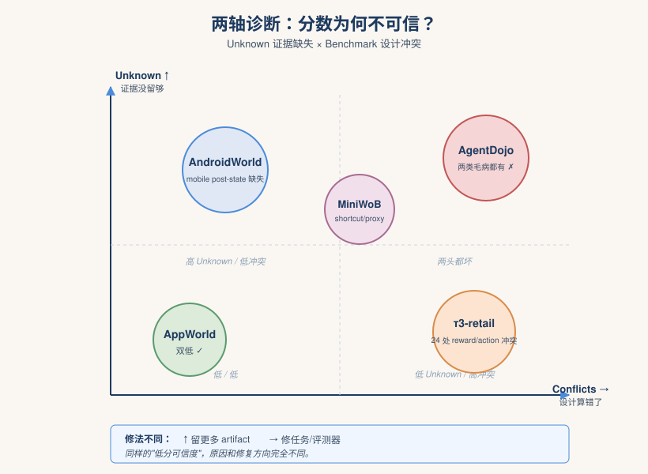
*图示：同样是分数不可信，原因可能很不同：要么是证据没存够（修留存），要么是 benchmark 设计本身在算错东西（修任务/评测器）。这套两轴诊断让 maintainer 知道往哪修。*

- 技术细节：Unknown share 衡量 identification（artifact 够不够），benchmark conflicts 衡量 alignment（任务/评测器/target set/reward 是不是在检查正确的事）。两轴交叉把 5 个 benchmark 分成不同诊断：AppWorld 双低、τ3-retail 低 Unknown 但 24 处 reward/action 冲突、AgentDojo 两类毛病都有、AndroidWorld 主要是 mobile post-state 缺失、MiniWoB 看似可判但有 shortcut/proxy 问题。
- 通俗讲解：同样是分数不可信，原因可能很不同：要么是证据没存够（修留存），要么是 benchmark 设计本身在算错东西（修任务/评测器）。这套两轴诊断让 maintainer 知道往哪修。
- 例子：AndroidWorld 删 Parmesan 菜谱那条任务，target set 构造把目标集弄空了，agent 什么都没删反被判成功——属于 benchmark conflict；同 benchmark 大量记录因缺少数据库/content provider 快照成 Unknown——属于证据缺失。

#### 技术点 5：Native vs Stronger 双层报告
- 快速理解：原 benchmark 声明和更严格的语义分开报，避免悄悄抬高门槛

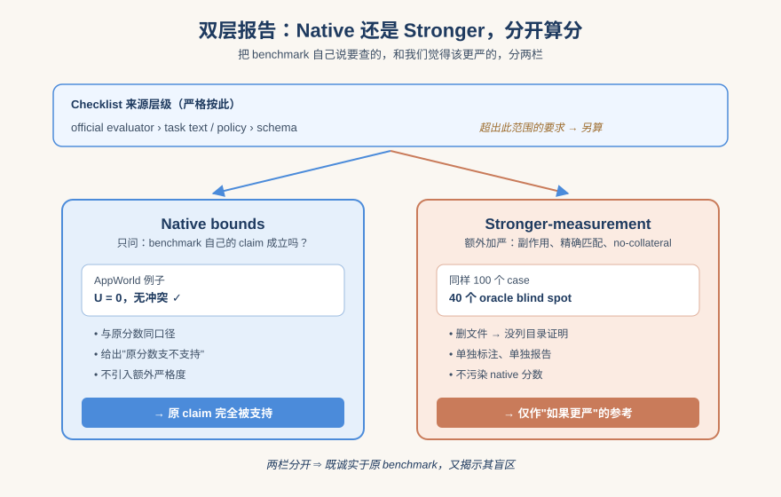
*图示：审计很容易陷入'我觉得应该更严'的诱惑，作者特意把它和'benchmark 自己说要检查的事'分开，这样读者既能看到原分数支不支持，也能看到如果加严会怎样，但两者不混。*

- 技术细节：checklist 严格按 official evaluator \> task text/policy \> schema 的来源层级，仅围绕 benchmark 自己的 claim 给出 native bounds。任何超出的要求（如 no-collateral-change、完整副作用、身份精确匹配）单独标为 stronger-measurement 并分开报告。
- 通俗讲解：审计很容易陷入'我觉得应该更严'的诱惑，作者特意把它和'benchmark 自己说要检查的事'分开，这样读者既能看到原分数支不支持，也能看到如果加严会怎样，但两者不混。
- 例子：AppWorld 的 native claim 在审计修正后被完全支持（U=0、无 conflict），但 100 个 case 中有 40 个被记录了 stronger-only 的 oracle blind spot，比如删除文件任务原检查通过但没有目录列表证明文件确实不存在了。

- **对 Agent 产品/系统的启发：** 做 Agent 评测时要把'证据是否充分'当一等公民，分数旁边必须配区间和 artifact 清单
- **详细启发：** 产品侧：对外发布 Agent 能力数字时不要只给单点成功率，建议同时给出证据支撑区间和 Unknown 比例，让用户知道哪些任务其实没被证据验证；对内做能力回归时也用区间，避免被翻转的小提升骗到。；系统侧：Agent 运行时应主动留存能反演 outcome 的 artifact：post-run 状态读取、数据库/文件快照、paired-arm 对照、durable receipt。可以在 evaluator 之外加一层 'evidence collector'，把 checklist 所需信息固化进 trace schema，方便后续审计和回放。；风险：如果继续用单点成功率排名，可能因为 Unknown 的处理方式（算对/算错/丢弃）不同而把方向性结论搞反；同时 reward/proxy 信号不可靠会让模型学到 shortcut，看似刷高分但实际任务没完成。

## 三、总结

- 今日主线：评测严谨化 + runtime治理化，Agent研究正在补基础设施债
- 今天的初筛信号非常一致：研究社区正集体把注意力从'造更强Agent'转向'让Agent的分数和运行时真正可信'
- 今天的初筛信号非常一致：研究社区正集体把注意力从'造更强Agent'转向'让Agent的分数和运行时真正可信'。一边是Computer Use Agent评测被1MB重放脚本戳破假象，催生PRISM/DigiWorld和证据支撑上下界；另一边是harness、监控器、知识图谱等基础设施被同时纳入安全与自我改进的视野。
- 可以预期未来一段时间，Agent领域的竞争不再只看benchmark数字，而是看谁的环境、trace和监控链条经得起审计。
