# 2026-05-13 AI Agent 论文日报

> 分类：cs.AI + cs.CL + cs.LG + cs.MA + cs.RO + cs.SE + cs.HC
> 入选论文：3 篇

## 一、初筛每日趋势

- Agent安全从prompt注入升级到生态/供应链级红队
- 长期记忆评测推到百兆token，依赖推理几近全军覆没
- Tool-Use鲁棒性首次按POMDP四象限系统拆解
- Agent安全议题进一步上探到生态层：从参数级溯源(PACT)、agentic workflow劫持、skill registry供应链攻击到针对Agent基础设施的Mobius DDoS，红队对象从单Agent扩展到skill市场和workflow平台。
- 长期记忆评测出现两条新轴线：LongMemEval-V2把haystack推到500轨迹/115M token测'资深同事'式环境经验，MEME则交叉实体范围与时间演化，揭示Cascade/Absence级依赖推理在六大主流记忆系统下平均仅0.02，结构性失败暴露无遗。
- Tool-Use鲁棒性研究开始范式化：用POMDP四象限(Observation/Action/Reward/Transition)统一22种扰动，并发现Reward误导命名和首次调用报错才是主要痛点，单纯堆参数无效，域随机化RL是可行配方。
- Agent评测体系正在补'工程性'短板：Rollout Cards规范可复现性，OpenClaw定义执行链级红队，ToolCUA把GUI-Tool混合动作空间纳入正式编排目标。

### 跨论文综合观察

- Sim-to-Real Tool-Use与MEME/LongMemEval-V2在方法论上高度同构：都是先把真实部署里的失败模式形式化(POMDP四象限 / DAG依赖图)，再据此构造可验证的扰动或gold答案，最后发现'更大模型/更强检索'救不回结构性失败，必须改训练或写入策略。
- PACT(参数级溯源)、Comment-and-Control(workflow劫持)、SKILL.md(skill registry供应链)、Proteus(自演化红队)、OpenClaw(执行上下文红队)五篇放在一起看，是同一张安全地图的不同切片——从Agent内部参数流，到workflow编排，到skill市场，到执行上下文，红队边界正在沿着'数据信任流'层层外扩。
- LongMemEval-V2提出'把记忆当文件、用Coding Agent当控制器'，与MEME中唯一work的'MD-flat+Opus写入时前置推理'路径不谋而合：两篇独立工作都指向同一结论——记忆系统的瓶颈不在存储，而在写入时是否保留可推理的上下文，以及是否有强controller敢主动改写记忆。

## 二、重点论文精读

### 1. When Simulation Lies: A Sim-to-Real Benchmark and Domain-Randomized RL Recipe for Tool-Use Agents
- **方向：** tool\_use
- **评分：** 相关性 95 | 价值 88 | 有趣性 85 | 创新性 85 | 开拓性 85
- **为什么入选：** 首个把工具调用Agent鲁棒性按POMDP拆成四类的基准，还顺手给出域随机化RL训练方案
- **快速背景：** 现有工具调用benchmark都假设输入干净、API稳定，但生产环境里typo、超时、重名工具天天发生。
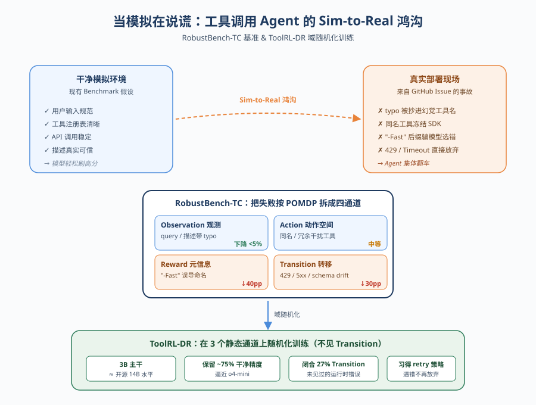
*图示：这篇论文把'tool-use Agent在真实部署中容易崩'这个老大难问题，第一次系统地拆成POMDP的四个组件（观察/动作/奖励/转移），并且每一种扰动都对应到LangChain、OpenAI Agents SDK等真实GitHub issue。更难得的是它不止做benchmark，还提出了ToolRL-DR这套域随机化RL训练配方，3B模型就接近开源14B水平，对做工具调用Agent的人非常有参考价值。*

- **详细背景：** 目前主流的工具调用评测（BFCL、API-Bank、ToolAlpaca等）默认用户query规范、工具注册表清晰、API调用稳定可靠。但真实部署里，用户typo会被模型抄进幻觉工具名、LangChain默认timeout=None会让Agent无限挂起、两个MCP server注册同名工具会冻结SDK。已有的鲁棒性研究只孤立地测过函数名扰动或干扰工具，缺少统一框架，也没人验证用扰动数据训练能否泛化到没见过的运行时错误。
- **详细入选理由：** 这篇论文把'tool-use Agent在真实部署中容易崩'这个老大难问题，第一次系统地拆成POMDP的四个组件（观察/动作/奖励/转移），并且每一种扰动都对应到LangChain、OpenAI Agents SDK等真实GitHub issue。更难得的是它不止做benchmark，还提出了ToolRL-DR这套域随机化RL训练配方，3B模型就接近开源14B水平，对做工具调用Agent的人非常有参考价值。

**核心技术点速览：**

#### 技术点 1：POMDP四象限扰动分类
- 快速理解：把工具调用失败按POMDP的四个组件归类，每种扰动都挂钩真实GitHub issue

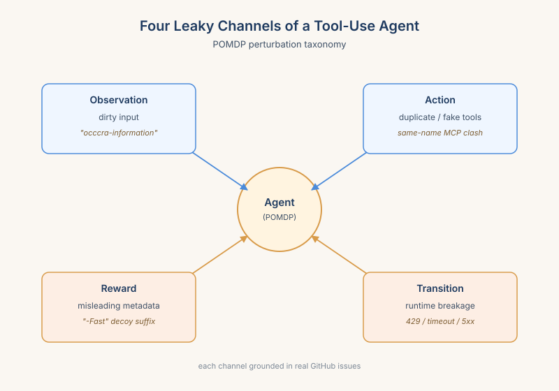
*图示：可以这样理解：Agent和工具环境之间有四个信息通道，任何一个被污染都会导致失败。看到的输入脏了是Observation问题，能选的工具列表里混了假货是Action问题，工具的描述/元信息误导你选了错的是Reward问题，工具真的调用时报错是Transition问题。这套分类让你能精确诊断'我的Agent到底是哪一层最脆'。*

- 技术细节：作者把工具调用建模成POMDP，并把22种扰动归到四个通道：Observation（query/工具描述里的typo和改写）、Action（同名干扰工具、冗余相似工具）、Reward（误导性命名/时延标注，让模型选错工具）、Transition（首次调用返回Timeout/429/401/5xx/malformed JSON/schema drift）。每种扰动类型都链接到一个验证过的GitHub issue或同行评审论文作为'production grounding'。
- 通俗讲解：可以这样理解：Agent和工具环境之间有四个信息通道，任何一个被污染都会导致失败。看到的输入脏了是Observation问题，能选的工具列表里混了假货是Action问题，工具的描述/元信息误导你选了错的是Reward问题，工具真的调用时报错是Transition问题。这套分类让你能精确诊断'我的Agent到底是哪一层最脆'。
- 例子：比如用户输入'occcra-information'（typo）属于Observation；两个MCP server注册了同名工具属于Action；一个distractor工具命名带'-Fast'后缀骗模型选它属于Reward；首次调用返回HTTP 429让模型必须重试属于Transition。

#### 技术点 2：鲁棒性差距严重不均
- 快速理解：Observation扰动几乎无影响，但Reward掉40%、Transition掉30%，扩大模型规模也救不了

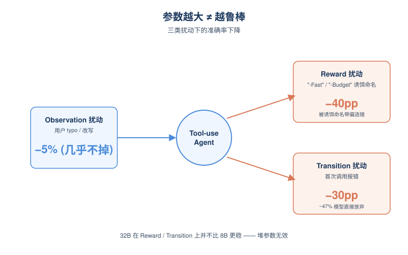
*图示：模型早就学会了忽略typo和改写，但一旦工具描述里有'-Fast''-Budget'这种暗示性命名，模型就会被带偏选错工具；一旦首次调用报错，将近一半的模型会直接放弃说'工具好像挂了，请稍后重试'，而不是换个工具或重试。最反直觉的是32B模型在这两件事上并不比8B更稳。*

- 技术细节：在21个模型（1.5B到32B，含闭源o4-mini）上测试发现：Observation扰动的准确率下降\<5%，但Reward扰动平均掉40pp，Transition扰动掉30pp。LoopTool-32B的Reward gap甚至比8B还大（50.9% vs 更小），Qwen3-32B的Transition gap也比Qwen3-8B更大。说明单纯堆参数无法解决这两类问题。
- 通俗讲解：模型早就学会了忽略typo和改写，但一旦工具描述里有'-Fast''-Budget'这种暗示性命名，模型就会被带偏选错工具；一旦首次调用报错，将近一半的模型会直接放弃说'工具好像挂了，请稍后重试'，而不是换个工具或重试。最反直觉的是32B模型在这两件事上并不比8B更稳。
- 例子：在Transition扰动下，作者分析ToolRL-Clean的808个失败样本：47%是模型直接放弃输出文本（omitted call），53%是错误调用（wrong call）。模型几乎从不沉默，但有一半概率会'认输'。

#### 技术点 3：ToolRL-DR域随机化训练
- 快速理解：用扰动过的轨迹做RL训练，3B模型上Transition gap竟然没训也能闭合27%

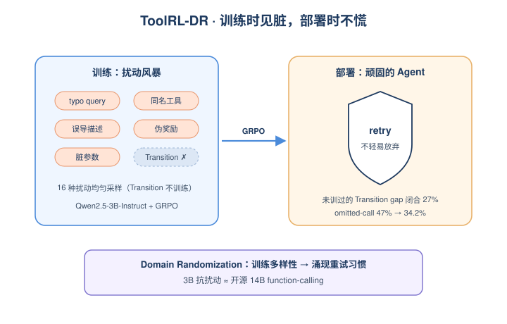
*图示：灵感来自机器人里的domain randomization——既然模拟器和现实差距大，就在训练时随机化各种参数让策略习惯多样性。这里把这个思路搬到工具调用：训练时就让模型见过各种脏query、同名干扰、误导描述，部署时就不容易翻车。最神奇的是从来没训过Transition扰动，但Transition gap居然也闭合了27%。*

- 技术细节：ToolRL-DR沿用ToolRL公开的GRPO代码，仅替换训练数据：把4000条干净轨迹换成在16种静态可编码扰动（4 obs + 6 act + 6 reward）上均匀采样的扰动轨迹。Transition扰动故意不放进训练。在Qwen2.5-3B-Instruct上，DR-Full保留约75%的clean准确率，整体扰动准确率追平开源14B function-calling模型。
- 通俗讲解：灵感来自机器人里的domain randomization——既然模拟器和现实差距大，就在训练时随机化各种参数让策略习惯多样性。这里把这个思路搬到工具调用：训练时就让模型见过各种脏query、同名干扰、误导描述，部署时就不容易翻车。最神奇的是从来没训过Transition扰动，但Transition gap居然也闭合了27%。
- 例子：作者把这种迁移归因于'更顽固的retry policy'：DR-Full在Transition扰动下，omitted-call率从47%降到34.2%（-12.8pp），wrong-call率上升，总失败数从808降到702。也就是说模型学会了'遇到对抗输入不要轻易放弃'，这种习惯顺势迁移到了运行时报错的retry行为上。

#### 技术点 4：Reward扰动是新隐患
- 快速理解：命名暗示能轻易把模型骗到错误工具，是被低估的攻击面

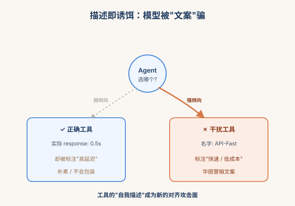
*图示：这暴露了一个产品风险：工具的'营销文案'比实际功能更影响模型选择。如果一个第三方工具开发者把自己的工具描述写成'快速、低成本'，即使它实际不对，模型也会优先选它。这对MCP生态、工具市场来说是严重的对齐隐患。*

- 技术细节：Reward扰动通过给ground truth工具加上误导描述（如标注高延迟），同时给distractor加上'-Fast''-Budget'后缀；甚至再叠加缩写命名（Abbr变体）。结果显示MisDesc-Abbr和TimeDesc-Abbr是所有扰动里最致命的，多数模型在这里掉50%以上。
- 通俗讲解：这暴露了一个产品风险：工具的'营销文案'比实际功能更影响模型选择。如果一个第三方工具开发者把自己的工具描述写成'快速、低成本'，即使它实际不对，模型也会优先选它。这对MCP生态、工具市场来说是严重的对齐隐患。
- 例子：案例：ground truth工具被标注'response time: 0.5s'，distractor工具加上'-Fast'后缀且标注'0.1s'。即使distractor功能不对，模型也倾向于选名字带'Fast'的那个。

- **对 Agent 产品/系统的启发：** 做工具调用Agent千万别只在干净数据上评测，要专门构造Reward和Transition扰动来压测和训练。
- **详细启发：** 产品侧：Agent产品上线前应该按四个POMDP通道分别压测，特别关注两类高危扰动：工具描述误导（Reward）和运行时transient错误（Transition）。如果你做的是MCP生态或工具市场，必须警惕第三方通过命名后缀（\_Fast/\_Budget）操纵模型选择，这是新型对齐攻击面。；系统侧：训练侧可以直接借鉴ToolRL-DR：用GRPO在扰动增强的轨迹上训练，即使只覆盖静态扰动（脏query、同名干扰、误导描述），也能让模型养成'更顽固的retry习惯'，部分迁移到运行时错误处理。3B就能逼近14B，性价比高。runtime侧仍需补retry策略和超时配置等基础设施级防护。；风险：论文方法没有真正闭合Transition gap（仍残留~23%），需要带error response的rollout和retry-aware reward才能彻底解决。另外所有实验都在single-turn场景，多轮Agent的累积误差和恢复行为没覆盖。

### 2. LongMemEval-V2: Evaluating Long-Term Agent Memory Toward Experienced Colleagues
- **方向：** memory
- **评分：** 相关性 95 | 价值 90 | 有趣性 85 | 创新性 82 | 开拓性 85
- **为什么入选：** 首个面向Web Agent环境经验的长期记忆评测，含115M token轨迹库
- **快速背景：** 现有Agent记忆评测多停留在用户聊天或单条轨迹，无法衡量环境经验积累
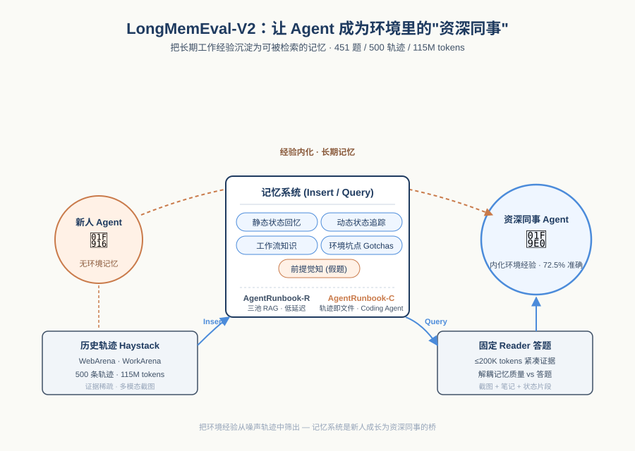
*图示：这篇论文不是在评测用户对话记忆，而是评测Agent能否像'有经验的同事'一样把长期工作中积累的环境知识沉淀下来。它把上下文堆到115M token、500条轨迹规模，还提出了一种把记忆当文件、用Coding Agent当记忆控制器的新思路，对做长期记忆系统的人是一个非常具体的参照系。*

- **详细背景：** 长期记忆对Agent在专门化Web环境中的表现至关重要，但现有评测要么只看用户聊天历史，要么只用简化游戏环境或单条轨迹，无法直接衡量记忆系统是否真正吸收了环境特定经验。作者把视角换成'让Agent变成环境里的资深同事'，需要它记住界面布局、状态变化、工作流、坑点和前提假设。LME-V2正是为评测这件事而生，规模上推到500条轨迹、上亿token。
- **详细入选理由：** 这篇论文不是在评测用户对话记忆，而是评测Agent能否像'有经验的同事'一样把长期工作中积累的环境知识沉淀下来。它把上下文堆到115M token、500条轨迹规模，还提出了一种把记忆当文件、用Coding Agent当记忆控制器的新思路，对做长期记忆系统的人是一个非常具体的参照系。

**核心技术点速览：**

#### 技术点 1：五种环境记忆能力分类
- 快速理解：把'资深同事'拆成五种可评测的环境记忆能力

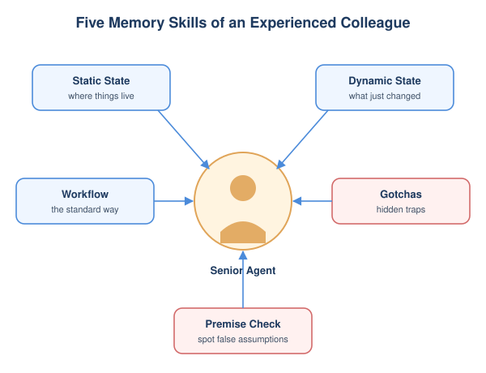
*图示：想象一个新员工和资深同事的差距：资深同事知道这个系统某个按钮在哪、改了状态后哪个字段会消失、清重复问题的标准流程，以及'这里搜索默认用大于等于而不是精确匹配'这种坑。论文把这些经验拆成5类，并构造了对应的题目去打分，让记忆系统的'经验内化'变得可量化。*

- 技术细节：LME-V2定义了Web Agent所需的五项核心记忆能力：静态状态回忆、动态状态追踪、工作流知识、环境坑点(gotchas)和前提觉知(premise awareness)。共451道人工标注题，覆盖WebArena和WorkArena的ServiceNow、Magento等定制网站，并特意设计了带错误前提的abstention题来测试Agent是否会被错误假设带偏。
- 通俗讲解：想象一个新员工和资深同事的差距：资深同事知道这个系统某个按钮在哪、改了状态后哪个字段会消失、清重复问题的标准流程，以及'这里搜索默认用大于等于而不是精确匹配'这种坑。论文把这些经验拆成5类，并构造了对应的题目去打分，让记忆系统的'经验内化'变得可量化。
- 例子：比如一道gotchas题给出截图：'按Assigned to搜索某员工却混入了别人'，资深Agent要能从历史轨迹里学到'该字段默认用\>=而非精确匹配'这一隐藏规则；而错误前提题会问'state下方多了哪个字段'，但其实没有这种字段，模型必须识别前提错误而非编造答案。

#### 技术点 2：上下文采集式评测框架
- 快速理解：记忆系统通过Insert/Query两个API产出证据，再交固定reader答题

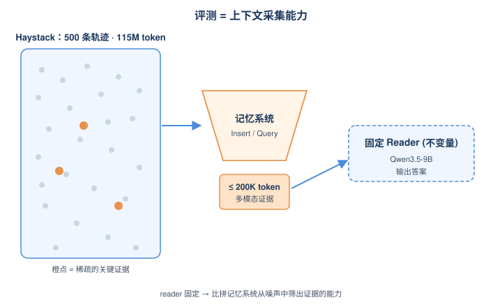
*图示：这个设计把'记忆质量'和'下游答题能力'解耦了：reader固定，比的就是你这套记忆系统能不能从巨量噪声轨迹里筛出真正相关的小段证据。它更接近真实Agent栈里记忆模块给主Agent供料的样子，而不是端到端任务成功率那种间接指标。*

- 技术细节：评测被形式化成context gathering：记忆系统实现Insert(轨迹)和Query(问题)两个API，依次喂入haystack中的全部轨迹，对问题返回不超过200K token的多模态证据，再交给固定的Qwen3.5-9B reader答题。Small档共享100条轨迹/25M token，Medium档每题500条轨迹/115M token，且答案轨迹在haystack里非常稀疏。
- 通俗讲解：这个设计把'记忆质量'和'下游答题能力'解耦了：reader固定，比的就是你这套记忆系统能不能从巨量噪声轨迹里筛出真正相关的小段证据。它更接近真实Agent栈里记忆模块给主Agent供料的样子，而不是端到端任务成功率那种间接指标。
- 例子：比如一道工作流题，系统先把498条轨迹依次Insert进记忆，再用问题Query，返回的可能是几段状态截图加一段策略笔记，被截断到200K token喂给reader。reader只看这段证据回答'清理重复问题时除Priority、Problem statement外还要检查哪个字段'。

#### 技术点 3：AgentRunbook-R三池RAG
- 快速理解：把记忆拆成原始状态、状态转移事件、策略笔记三个独立池

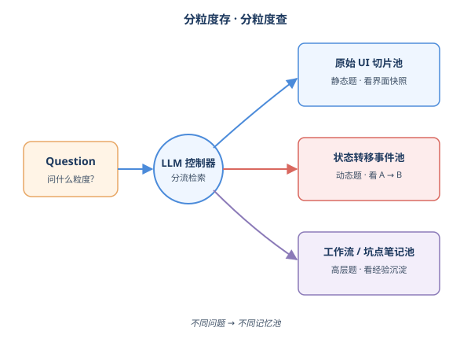
*图示：原因是不同问题需要不同粒度的证据：静态题靠原始UI切片，动态题靠状态转移事件，工作流和坑点靠高层笔记。把它们分池存、分流检索，比一锅端的RAG命中率更高，且延迟仍然控制在20几秒，是accuracy-latency曲线上低延迟那一端的强基线。*

- 技术细节：AgentRunbook-R在Insert时把每条轨迹拆解进三个知识池：以状态为中心的原始切片池(保留UI观察)、相邻状态间抽取的状态转移事件池、以及轨迹级的工作流/坑点笔记池。Query时由LLM控制器读问题和记忆快照，分别生成多条原始切片查询、一条事件查询、一条笔记查询，再用稠密检索拼成多模态上下文。
- 通俗讲解：原因是不同问题需要不同粒度的证据：静态题靠原始UI切片，动态题靠状态转移事件，工作流和坑点靠高层笔记。把它们分池存、分流检索，比一锅端的RAG命中率更高，且延迟仍然控制在20几秒，是accuracy-latency曲线上低延迟那一端的强基线。
- 例子：面对'问题被标为Duplicate且进入Closed后，State下方哪个字段消失'这种动态题，控制器会主要发事件查询，从事件池里召回'Duplicate变成Closed'的转移记录，而不是去拉一堆无关的UI切片。

#### 技术点 4：AgentRunbook-C：把记忆当文件
- 快速理解：Coding Agent当记忆控制器，用工作流文档+manifest+辅助脚本提速

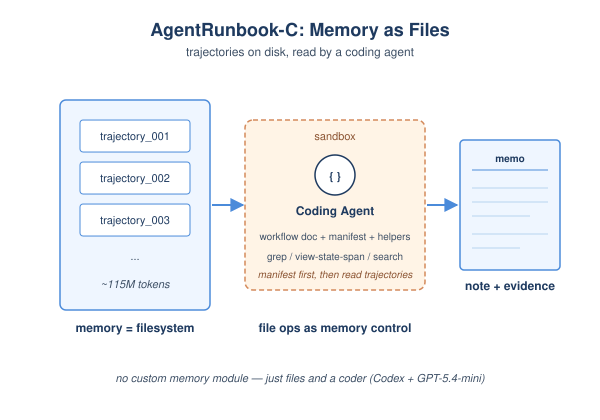
*图示：作者发现Coding Agent本身就是优秀的文件操作和工具调用者，与其训练专门的记忆控制器，不如把记忆问题改写成文件管理问题。脚手架的作用是防止它过度探索或乱翻：先看manifest挑可疑轨迹，再用helper脚本精读对应状态。结果在Medium档拿到70.1%、Small档74.9%，把Codex裸跑的69.3%平均准确率推上去，同时延迟比Codex快约32%。*

- 技术细节：AgentRunbook-C把每条轨迹直接以文件形式存盘，Query时为现成Coding Agent (Codex+GPT-5.4-mini)搭一个沙盒，注入三类轻量脚手架：工作流文档(指挥它充当记忆模块的步骤)、查询时渲染的manifest(总结当前记忆布局，便于先粗筛轨迹)、以及封装常用轨迹查看/搜索操作的helper脚本。Agent最后输出一段记忆笔记+选中的状态片段。
- 通俗讲解：作者发现Coding Agent本身就是优秀的文件操作和工具调用者，与其训练专门的记忆控制器，不如把记忆问题改写成文件管理问题。脚手架的作用是防止它过度探索或乱翻：先看manifest挑可疑轨迹，再用helper脚本精读对应状态。结果在Medium档拿到70.1%、Small档74.9%，把Codex裸跑的69.3%平均准确率推上去，同时延迟比Codex快约32%。
- 例子：对一道gotchas题，Agent先读manifest发现3条与'Hardware Asset搜索'相关的轨迹文件，然后调用helper脚本view-state-span只看这几条的关键状态而不是整条轨迹，最后写出一段笔记说明'Assigned to字段使用\>=匹配'，并选取支撑的状态截图作为证据交给reader。

#### 技术点 5：准确率-延迟前沿对比
- 快速理解：Coding Agent路线显著拉高上限，但每查询180秒级延迟仍是瓶颈

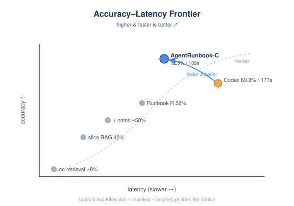
*图示：结论是：朴素RAG在这种深度上下文场景下天花板很低；让Coding Agent当记忆控制器准确率确实高，但每问要一两百秒，离生产可用还远。脚手架式优化能在同等准确率下显著省时间，但作者也直说'剩余改进空间仍然很大'，提示这是一个开放问题，不是已解决的工程任务。*

- 技术细节：无检索基线接近0%，简单query变成slice RAG约40%，加笔记到约46-51%，AgentRunbook-R到57-58%。Coding Agent家族中Codex达69.3%平均，AgentRunbook-C到72.5%且更快(108秒vs177秒)。控制器的reasoning effort是延迟主导因素，AgentRunbook-C在多个effort档位上都优于裸Codex，明确推动了accuracy-latency帕累托前沿。
- 通俗讲解：结论是：朴素RAG在这种深度上下文场景下天花板很低；让Coding Agent当记忆控制器准确率确实高，但每问要一两百秒，离生产可用还远。脚手架式优化能在同等准确率下显著省时间，但作者也直说'剩余改进空间仍然很大'，提示这是一个开放问题，不是已解决的工程任务。
- 例子：在Medium档同样用GPT-5.4-mini xhigh reasoning，Codex要186秒拿到68.7%，而AgentRunbook-C约140秒就能拿到70.1%——同一控制器，仅靠工作流文档+manifest+helper脚本的引导，就把准确率和延迟同时改善。

- **对 Agent 产品/系统的启发：** 做长期记忆别只堆RAG，可以把轨迹当文件、用Coding Agent当记忆控制器
- **详细启发：** 产品侧：对需要在定制化Web/SaaS环境长期运行的Agent产品，应该按'静态/动态/工作流/坑点/前提'五类经验来设计记忆能力，而不是只存对话历史。abstention类问题提醒产品要让Agent能识别错误前提而不是硬答。；系统侧：可以借鉴双层方案：低延迟场景用AgentRunbook-R式多池RAG(原始切片+状态转移事件+策略笔记)，高准确率场景把轨迹直接以文件存盘，用Coding Agent + 工作流文档 + manifest + 辅助脚本作为记忆控制器，按需切换operating point。；风险：Coding Agent式记忆每查询百秒级延迟，难以用于实时交互；同时实验只覆盖WebArena/WorkArena几个站点，迁移到真实企业系统时五类能力的边界和坑点分布可能不同，记忆系统的有效性需要重新校准。

### 3. MEME: Multi-entity & Evolving Memory Evaluation
- **方向：** agent\_eval
- **评分：** 相关性 95 | 价值 88 | 有趣性 85 | 创新性 82 | 开拓性 85
- **为什么入选：** 首个系统暴露Agent记忆在依赖推理上集体失败的评测，结论刺眼。
- **快速背景：** Agent持久记忆评测一直只测单实体更新，依赖传播这块是空白。
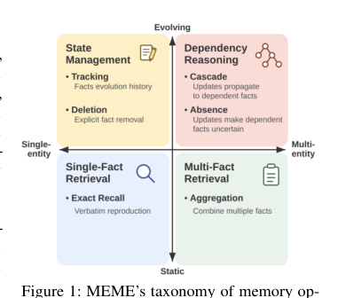
*图示：这张 Figure 1 最适合作为主图：它用二维坐标把论文核心贡献——多实体（multi-entity）与时间演化（evolving）两条评测轴——以及六类任务的分布一眼讲清楚，是整篇 MEME benchmark 的总览框架图。相比其他候选，Figure 2 更像任务示例，Figures 3/5 属于结果图，不适合作为日报首图。虽然它不是 agent 系统架构图，但它是本论文最核心的方法/benchmark taxonomy 总图，解释价值最高。*

- **详细背景：** 现在的Agent越来越多在跨session环境里运行，需要存储、更新并对历史信息做推理。但已有的memory benchmark（LoCoMo、LongMemEval、MemBench、MemoryAgentBench等）只测独立实体的更新，没人评测'上游事实变了，下游依赖事实要不要跟着变'这种ripple效应。这正是真实场景里最容易出bug的地方——比如用户搬家了，通勤时间、附近设施这些依赖事实是否要重新判断为不确定，没benchmark测过。MEME填的就是这个洞。
- **详细入选理由：** 这篇论文不只是又一个长记忆benchmark，而是把'实体范围×时间演化'两条轴交叉，专门测试此前所有memory benchmark都没覆盖的依赖推理（Cascade/Absence/Deletion）。结果非常震撼：六个主流记忆系统在默认配置下Cascade平均3%、Absence平均1%，几乎全军覆没；而且提示词优化、加深top-k、换更强answering LLM、降噪音都救不回来。对做Agent长期记忆的人来说，这是一份必看的失败诊断报告。

**核心技术点速览：**

#### 技术点 1：二维任务分类法
- 快速理解：用实体范围×时间演化两轴切出六类任务，补上依赖推理空白。

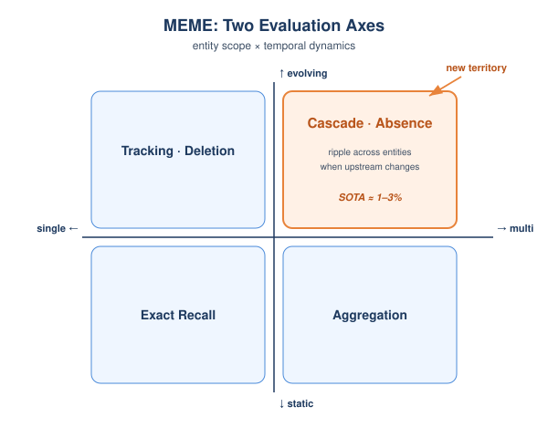
*图示：作者认为以前评测只关心'你能不能记住事实'和'事实更新后能不能回忆新值'，但真实Agent记忆的关键挑战是'一个事实变了，依赖它的其他事实该怎么办'。他们把这条'依赖传播'轴单独立出来，配上单/多实体维度，就形成一个完整的二维评测空间，每个象限挑1-2个最难的任务做代表。*

- 技术细节：MEME沿两条正交轴组织记忆评测：entity scope（单实体 vs 多实体）和temporal dynamics（静态 vs 演化），交叉出四象限六个任务：Exact Recall、Aggregation、Tracking、Deletion、Cascade、Absence。其中Cascade（按依赖规则推断下游变化）、Absence（上游变了但没替换规则，应答'不确定'）、Deletion（删除后不再报告）是此前任何benchmark都没打分的。
- 通俗讲解：作者认为以前评测只关心'你能不能记住事实'和'事实更新后能不能回忆新值'，但真实Agent记忆的关键挑战是'一个事实变了，依赖它的其他事实该怎么办'。他们把这条'依赖传播'轴单独立出来，配上单/多实体维度，就形成一个完整的二维评测空间，每个象限挑1-2个最难的任务做代表。
- 例子：比如用户先说'团队lead是Sarah，code review给David；如果lead换人，reviewer就换成Seoyun'，后来又说'新lead是Minjun'。问'现在reviewer是谁？'——正确答案是Seoyun（Cascade）。如果没有那条if-then规则，正确答案就应该是'不确定'（Absence），而不是继续报David。

#### 技术点 2：DAG驱动的可验证数据生成
- 快速理解：用带条件规则的DAG构造episode，让依赖传播的gold答案天然可算。

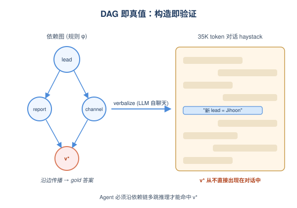
*图示：他们没有人工标注每道题的答案，而是先把'谁依赖谁、依赖规则是什么'写死在图里，然后程序按图生成对话和正确答案。这样既保证答案绝对正确（构造即验证），又能用trivial-pass过滤——必须change之前答对、change之后也答对才算分，防止那种'啥都不记'的系统蒙对。*

- 技术细节：每个领域（Personal Life、Software Project）建一张手工DAG G=(V,E,P,Φ)，节点是实体，边是依赖，Φ是条件规则。生成episode时选根、赋初值、按拓扑角色分配任务、用LLM自聊天verbalize、再混入filler组成约35K token的haystack。Cascade/Absence的gold答案不直接出现在对话里，而是通过沿DAG传播规则递归计算v\*=φv(v-i\*)得到，可多跳。
- 通俗讲解：他们没有人工标注每道题的答案，而是先把'谁依赖谁、依赖规则是什么'写死在图里，然后程序按图生成对话和正确答案。这样既保证答案绝对正确（构造即验证），又能用trivial-pass过滤——必须change之前答对、change之后也答对才算分，防止那种'啥都不记'的系统蒙对。
- 例子：在sw-033这个episode里，DAG上team-lead是weekly-report-recipient的父节点，规则是'lead变则recipient变成James Lee'。session 14插入'新lead是Jihoon Ryu'，程序自动算出v\*=James Lee作为gold，对话里从不直接说出这个答案。

#### 技术点 3：六个系统集体崩在依赖推理
- 快速理解：BM25到Graphiti到MD-flat全部翻车，Cascade平均3%、Absence平均1%。

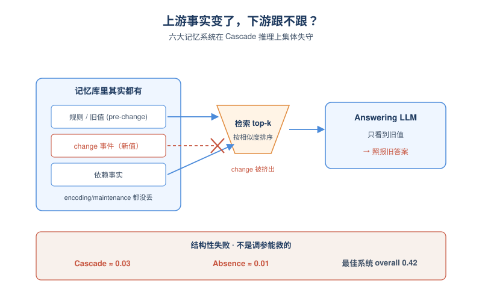
*图示：诊断trace显示：大多数系统在encoding阶段都把规则和change事件写进了store，maintenance阶段也保留住了，问题出在retrieval——向量检索里change事件被pre-change值的相似度排在后面，graph/tool-use系统则压根没去打开包含change事件的那条记录，于是answering LLM只看到旧值就照报。这是结构性失败，不是单个组件没调好。*

- 技术细节：作者评测了三大范式六个系统：raw retrieval（BM25、text-embedding-3-small）、LLM-processed memory（Mem0、Graphiti）、file-based agents（MD-flat、Karpathy Wiki），统一用gpt-4.1-mini做内部和answering LLM。结果Cascade六系统平均0.03、Absence 0.01，最好的MD-flat overall也只有0.42。两条评测轴各自掉约0.30精度，交叉象限掉到0.02地板。
- 通俗讲解：诊断trace显示：大多数系统在encoding阶段都把规则和change事件写进了store，maintenance阶段也保留住了，问题出在retrieval——向量检索里change事件被pre-change值的相似度排在后面，graph/tool-use系统则压根没去打开包含change事件的那条记录，于是answering LLM只看到旧值就照报。这是结构性失败，不是单个组件没调好。
- 例子：sw-033里Graphiti把规则、旧值'Hyunwoo Nam'、change事件'新lead Jihoon Ryu'都存为边，但query时graph search只surface了规则+旧值，change事件掉到top-k之外；Karpathy Wiki把change写进了daily/2023-03-17.md但query agent压根没打开那个文件。最终答案都是'Hyunwoo Nam'，错。

#### 技术点 4：五种修复方案几乎全失效
- 快速理解：提示词优化、加深top-k、换强answering LLM、降噪都救不回Cascade。

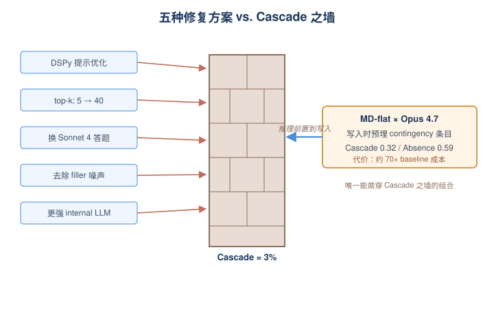
*图示：唯一work的机制是：Opus在ingest阶段就主动写下'按规则，下游现值=X'这种contingency entry，等change到来时它扫描这些entry并直接把传播后的新值写进store，相当于把推理前置到了写入时刻。检索时新值是top-1的独立陈述句，answering LLM直接读到。但这要求internal LLM足够聪明、且substrate（markdown文件）能保留contingency措辞——Mem0/Graphiti会把这些拆成atomic fact或triple，把上下文剥光，所以同样换Opus也救不了它们。*

- 技术细节：作者尝试五种不改架构的干预：DSPy SIMBA提示优化、top-k从5到40、answering LLM换Sonnet 4、去掉filler噪音、换更强internal LLM（gpt-5/GLM-5.1/Opus 4.7）。前四种Cascade都几乎贴地板；只有MD-flat配Opus 4.7一个组合把Cascade推到0.32、Absence到0.59，但成本是baseline的约70倍。
- 通俗讲解：唯一work的机制是：Opus在ingest阶段就主动写下'按规则，下游现值=X'这种contingency entry，等change到来时它扫描这些entry并直接把传播后的新值写进store，相当于把推理前置到了写入时刻。检索时新值是top-1的独立陈述句，answering LLM直接读到。但这要求internal LLM足够聪明、且substrate（markdown文件）能保留contingency措辞——Mem0/Graphiti会把这些拆成atomic fact或triple，把上下文剥光，所以同样换Opus也救不了它们。
- 例子：MD-flat × Opus 4.7在sw-033里，ingest时写入'（2023/03/13） Contingency: if team lead changes, recipient will be James Lee'；当session 14的新lead到来，Opus主动追加'（2023/03/17） Per contingency, weekly report recipient is now James Lee'。query时这条直接被检索到，答对。

- **对 Agent 产品/系统的启发：** 做长记忆Agent别只测单事实更新，依赖传播是真正的隐形坑。
- **详细启发：** 产品侧：如果你的Agent产品依赖长期用户记忆（个人助理、项目协作、CRM），现在的Mem0/Graphiti/向量库在'用户搬家了，通勤还按旧地址算'这类依赖更新场景下基本不可用。短期workaround是在写入对话时显式模板化记录依赖规则和change事件，并在系统prompt里要求Agent显式扫描contingency。；系统侧：论文给出一个可复用的per-stage诊断框架：encoding/maintenance/retrieval三段排查。大多数系统问题不在'记没记住'而在'检索时新事件被旧值的相似度压住'，所以纯加top-k或换更强answer模型都没用，正确做法是要么在ingest阶段做依赖传播（写入propagated value），要么在检索层加change-event优先级。架构层面的启示是：memory层需要原生支持'maintenance阶段沿依赖传播更新'，而不是把推理留给query时刻。；风险：依靠frontier LLM在ingest时做传播虽然能work，但成本约70×、且会反过来损害Exact Recall和Tracking等基础任务，规模化部署不现实；同时数据集只有两个手工DAG、英文、LLM生成对话，真实用户场景的隐式依赖规则可能比这更难。

## 三、总结

- 今天主轴：Agent安全打到生态层、记忆评测打到依赖推理层
- 今天的入选论文集中说明一件事：Agent研究正在从'单体能力'走向'系统级压力测试'
- 今天的入选论文集中说明一件事：Agent研究正在从'单体能力'走向'系统级压力测试'。安全侧从prompt注入下沉到skill registry、workflow平台和Agent基础设施，记忆侧从单实体回忆推进到多实体依赖传播，工具使用侧则首次拿到了POMDP级的鲁棒性诊断框架。三条线共同的判断是：当前Agent栈的薄弱点不在模型推理本身，而在'信息如何在Agent、工具、记忆、生态间流动'这一层，这也是未来几个月最值得深耕的方向。
