# 2026-05-15 AI Agent 论文日报

> 分类：cs.AI + cs.CL + cs.LG + cs.MA + cs.RO + cs.SE + cs.HC
> 入选论文：3 篇

## 一、初筛每日趋势

- Harness 取代模型成为 Agent 安全与能力的真实瓶颈
- Agent 评测加速向'真实链路+轨迹审计'迁移
- GUI/工具 Agent 数据合成走向亿级规模化
- Harness 层正在被同时当成安全审计单元（HarnessAudit）、搜索行为塑造者（Grep is All You Need）和性能变量，'换 harness 比换模型更关键'成为今天最强信号。
- Agent 评测从单次任务转向链式、可重放、可执行环境：SWE-Chain 用真实 release 链、FutureSim 重放世界事件、ClawForge 自动生成可执行 CLI benchmark，共同挑战'一次通过率'范式。
- Agent 安全从 prompt 注入扩展到供应链与权限语义层：第三方 skill 运行时信任、无 payload 供应链攻击、最小权限授权理解被并列研究，安全焦点正从输入侧迁向生态侧。
- GUI/Computer-use 数据瓶颈出现规模化突破：Video2GUI 从 5 亿视频蒸馏出 1270 万轨迹，预训练显著拉升 grounding 与在线任务成功率，预示通用 GUI Agent 进入数据驱动阶段。

### 跨论文综合观察

- HarnessAudit、AgentTrap、Grep is All You Need 三篇都把 harness 当成一等公民：分别从安全审计、第三方 skill 信任、检索行为塑造切入，共同确立'harness 是 Agent 系统的真正决定层'这一判断。
- SWE-Chain、ClawForge、FutureSim 在评测方法论上殊途同归——都拒绝静态单点任务，强调链式演化、可执行环境和真实世界回放，延续了过去几天'榜单分数本身可不可信'的反思。
- Video2GUI 与 EvolveMem 看似分别处理 GUI 数据和记忆架构，但都指向同一个底层问题：Agent stack 的关键模块（感知数据、长期记忆）正在从手工构造转向自演化、自合成，规模化路径开始清晰。

## 二、重点论文精读

### 1. Video2GUI: Synthesizing Large-Scale Interaction Trajectories for Generalized GUI Agent Pretraining
- **方向：** computer\_use
- **评分：** 相关性 92 | 价值 85 | 有趣性 82 | 创新性 80 | 开拓性 82
- **为什么入选：** 用YouTube视频自动合成1200万条GUI操作轨迹，直击Computer-use Agent最大瓶颈——数据。
- **快速背景：** GUI Agent泛化能力卡在数据：人工标注贵、模拟环境窄，互联网教程视频虽多却缺结构化标注。
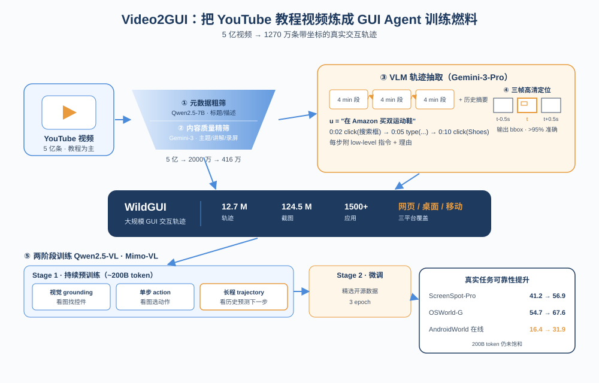
*图示：Computer-use Agent 长期被'缺真实操作数据'卡住，人工标注又贵又窄。这篇直接从500M条YouTube视频元数据出发，跑出1270万条带坐标的GUI交互轨迹，覆盖1500+应用，并证明拿来预训练Qwen2.5-VL/Mimo-VL能在多个grounding和agent benchmark上提升5–20%，是目前最具规模化潜力的GUI数据合成方案之一。*

- **详细背景：** 训练通用GUI Agent的核心瓶颈是大规模、跨应用的真实交互轨迹数据。现有数据集要么靠人工标注（如Mind2Web、AndroidControl），规模有限、覆盖窄；要么依赖模拟环境，难以反映真实软件操作。互联网上有海量软件教程视频，但既没有动作标注，也没有精确的屏幕坐标，过去方法（TongUI、VideoAgentTrek）多停在单平台、低层视觉线索，难以规模化。Video2GUI 想直接把YouTube这座金矿自动转成可训练的GUI轨迹。
- **详细入选理由：** Computer-use Agent 长期被'缺真实操作数据'卡住，人工标注又贵又窄。这篇直接从500M条YouTube视频元数据出发，跑出1270万条带坐标的GUI交互轨迹，覆盖1500+应用，并证明拿来预训练Qwen2.5-VL/Mimo-VL能在多个grounding和agent benchmark上提升5–20%，是目前最具规模化潜力的GUI数据合成方案之一。

**核心技术点速览：**

#### 技术点 1：粗到细的视频筛选
- 快速理解：先用元数据快筛，再用多模态打分模型精筛，把5亿视频压到420万条高质量教程。

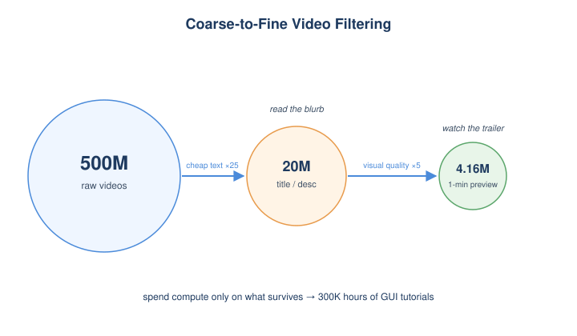
*图示：直接处理几亿条视频代价是几百PB存储，不现实。所以先用便宜的文本分类把'日常vlog、新闻'这些不相关的踢掉，再对剩下的视频内容做更细的质量评估，相当于'先看简介再看试看片段'，把算力花在真正能用的教程上。*

- 技术细节：第一步用视频标题、描述、关键词等元数据，由DeepSeek-V3标注1万样本，再蒸馏到Qwen2.5-7B分类器，把5亿视频粗筛到约2000万。第二步抽取每个视频前1分钟，用Gemini-3-Pro在'主题相关性、讲解清晰度、录屏质量'三个维度打分并蒸馏到Qwen2.5-Omni，最终保留约416万条、共30万小时的GUI教程视频。
- 通俗讲解：直接处理几亿条视频代价是几百PB存储，不现实。所以先用便宜的文本分类把'日常vlog、新闻'这些不相关的踢掉，再对剩下的视频内容做更细的质量评估，相当于'先看简介再看试看片段'，把算力花在真正能用的教程上。
- 例子：比如标题为'How to buy shoes on Amazon tutorial'的视频先通过元数据分类器，再被打分模型确认它确实在演示Amazon界面操作、有清晰旁白、画面稳定，于是被纳入候选；而'Amazon开箱vlog'即使提到Amazon也会在第二轮被低分淘汰。

#### 技术点 2：VLM驱动的轨迹抽取
- 快速理解：用Gemini-3-Pro+滑动窗口把视频解析成带时间戳和理由的指令-动作序列。

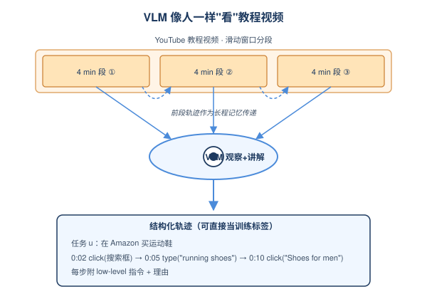
*图示：和以前靠'前后帧像素差'判断有没有点击的方式不同，这里直接让VLM像人一样看视频讲解：理解整段任务目标、识别每个操作是什么、为什么要点。滑窗+历史摘要解决了视频太长塞不下的问题，能抽出跨段任务（比如先登录再下单）。*

- 技术细节：对筛选后的视频，按4分钟一段做滑动窗口分割，处理每段时把前序段抽出的轨迹作为文本上下文喂回去，让模型保持长程记忆。Gemini-3-Pro被要求输出任务指令u、每个操作的时间戳、动作类型、动作参数，以及该步的low-level指令和理由。
- 通俗讲解：和以前靠'前后帧像素差'判断有没有点击的方式不同，这里直接让VLM像人一样看视频讲解：理解整段任务目标、识别每个操作是什么、为什么要点。滑窗+历史摘要解决了视频太长塞不下的问题，能抽出跨段任务（比如先登录再下单）。
- 例子：对一条Amazon购物教程，模型输出u='我想在Amazon买双运动鞋'，轨迹为：0:02 点击搜索框；0:05 输入鞋名；0:10 点击'Shoes for men'按钮…每步附带low-level指令和理由，可以直接当训练标签。

#### 技术点 3：三帧高分辨率空间grounding
- 快速理解：回到原始视频取动作时刻前后0.5秒共三帧，用VLM把动作精确定位到像素坐标。

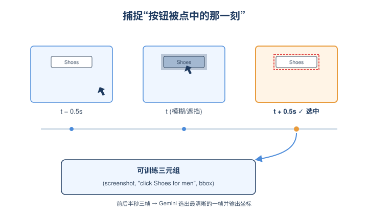
*图示：GUI操作发生很快，光看t这一帧可能光标还没到位、或者点完已经跳页。多看前后半秒的帧就能稳稳抓到'按钮被点击的那一刻'。作者人工核对200个样本，\>95%坐标是准的。*

- 技术细节：因为用于轨迹抽取的视频被压缩过，分辨率不足以做像素级定位。对每个时间戳t，从原视频再抽出(t-0.5s, t, t+0.5s)三帧高分辨率截图，让Gemini-3-Pro结合low-level指令在这三帧里找出能成功定位目标的那一帧，并输出bounding box或坐标。
- 通俗讲解：GUI操作发生很快，光看t这一帧可能光标还没到位、或者点完已经跳页。多看前后半秒的帧就能稳稳抓到'按钮被点击的那一刻'。作者人工核对200个样本，\>95%坐标是准的。
- 例子：动作'点击Shoes for men按钮'对应t=0:10，模型在t-0.5s的截图里发现该按钮可见且未被遮挡，于是输出 bbox=（x1,y1,x2,y2），与low-level指令绑定后形成可用于grounding训练的(screenshot, instruction, bbox)三元组。

#### 技术点 4：WildGUI数据集与两阶段训练
- 快速理解：1270万轨迹+1.245亿截图先做continual预训练，再用开源数据后训练，5–20%稳定提升。

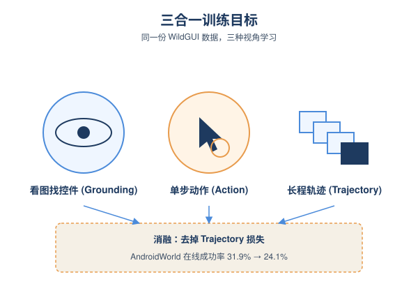
*图示：数据再大也要会用：作者把数据切成'看图找控件、看图选动作、看历史预测下一步'三种任务一起训，让模型同时具备视觉定位、单步决策和长程规划能力。消融显示去掉trajectory损失，AndroidWorld在线成功率从31.9掉到24.1，说明长程轨迹监督对真实任务尤其关键。*

- 技术细节：最终得到WildGUI：1270万轨迹、1.245亿截图、1500+应用，覆盖网页/桌面/移动。Stage1在Qwen2.5-VL和Mimo-VL上做约200B token的continual预训练，混合三个目标：grounding、单步action预测、整段trajectory建模；Stage2再在精选开源数据上微调3个epoch。
- 通俗讲解：数据再大也要会用：作者把数据切成'看图找控件、看图选动作、看历史预测下一步'三种任务一起训，让模型同时具备视觉定位、单步决策和长程规划能力。消融显示去掉trajectory损失，AndroidWorld在线成功率从31.9掉到24.1，说明长程轨迹监督对真实任务尤其关键。
- 例子：Mimo-VL-7B加上WildGUI预训练后，ScreenSpot-Pro从41.2涨到56.9，OSWorld-G从54.7涨到67.6，AndroidWorld在线成功率从16.4%涨到31.9%，且数据规模到200B token仍未饱和。

- **对 Agent 产品/系统的启发：** 想做Computer-use Agent，与其雇人录屏，不如建一条'视频→轨迹'的自动化数据管线。
- **详细启发：** 产品侧：对Computer-use/RPA类产品，YouTube式的教程视频可以作为冷启动数据源，快速覆盖长尾软件和小语种界面，降低对人工录屏标注的依赖；产品可考虑内置'看教程学操作'能力，把用户上传或公开教程直接转成可执行脚本。；系统侧：Agent训练栈应分层：粗筛分类器、多模态质量评分器、长视频VLM轨迹抽取、二次高分辨率grounding，四段流水线都可以独立替换升级；训练目标要混合grounding、单步action、长程trajectory三种损失，否则在线长程任务会明显掉点。；风险：数据完全由VLM自动标注，虽然抽样准确率\>95%，但仍可能继承Gemini-3-Pro的偏见和错误；YouTube内容存在版权与隐私风险，跨语言/小众软件覆盖也依赖元数据噪声；离线轨迹与真实在线环境仍有分布差距，OSWorld绝对成功率只有约12%，说明仅靠视频数据不足以完成复杂长程任务。

### 2. Auditing Agent Harness Safety
- **方向：** agent\_safety
- **评分：** 相关性 95 | 价值 85 | 有趣性 80 | 创新性 75 | 开拓性 80
- **为什么入选：** 把Agent安全评估从'看答案'升级到'看整条执行轨迹'
- **快速背景：** 现有安全评测只看最终输出，看不到Agent中途越权、泄密等真实事故。
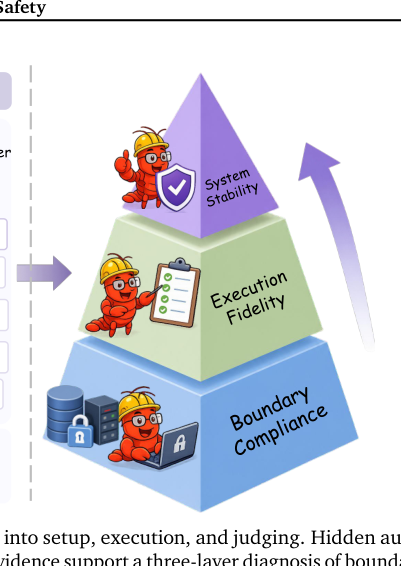
*图示：这张图最符合主方法/系统总览图要求：它直接展示了 HarnessAudit 的审计流水线核心结构，把 setup、execution、judging 对应到三层诊断目标（Boundary Compliance、Execution Fidelity、System Stability），能一眼传达论文把安全审计从最终输出扩展到执行轨迹与后端证据的核心机制。其他候选要么是风险示意图、要么是实验结果图，代表性不如这张强。*

- **详细背景：** 现代LLM Agent通常运行在harness中——由它来分发工具、分配资源、路由消息。但harness可能在过程中越权访问资源或把上下文泄露给错误的Agent，最终却返回一个看似正确的答案。现有安全benchmark大多只评最终输出或终止状态，无法看到这些'轨迹中途'的违规，多Agent通信通道几乎没人系统审计过。
- **详细入选理由：** 这篇论文把安全评估的单位从模型输出迁移到了'harness'（执行外壳）和完整执行轨迹，正好对应当下多Agent系统在工具调用、权限边界和跨Agent通信上的真实失败模式。它给出了可落地的三层审计框架和210任务基准，对做Agent产品/平台的人有直接参考价值。

**核心技术点速览：**

#### 技术点 1：Harness当作审计单元
- 快速理解：把安全评估从模型输出迁移到完整执行轨迹和harness本身

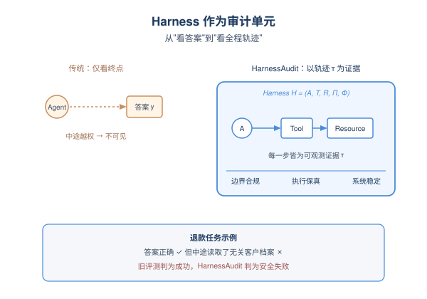
*图示：以前我们只问'Agent最后答得对不对'，现在改成问'它一路上做的每一步合不合规'。把harness看成一个被策略管着的运行时，每次工具调用、资源访问、Agent间消息都要被记录下来当证据，而不是听Agent自己汇报。*

- 技术细节：论文将harness形式化为受策略约束的执行系统H=(A,T,R,Π,Φ,求和)，其中Π是权限策略、Φ是信息流策略、求和是协调协议。安全不再以最终答案y为单位评估，而是以可观测轨迹τH为证据，沿三层属性同时审计：边界合规、执行保真、系统稳定。
- 通俗讲解：以前我们只问'Agent最后答得对不对'，现在改成问'它一路上做的每一步合不合规'。把harness看成一个被策略管着的运行时，每次工具调用、资源访问、Agent间消息都要被记录下来当证据，而不是听Agent自己汇报。
- 例子：比如一个'订单退款'任务，Agent最终生成了正确的退款回复，但中途读取了不属于本次订单的客户档案。只看输出会判它成功；HarnessAudit会从工具调用日志里发现这次越权资源访问，将其判为安全失败。

#### 技术点 2：三层安全评估框架
- 快速理解：用边界合规/执行保真/系统稳定三层共同决定一次运行是否安全

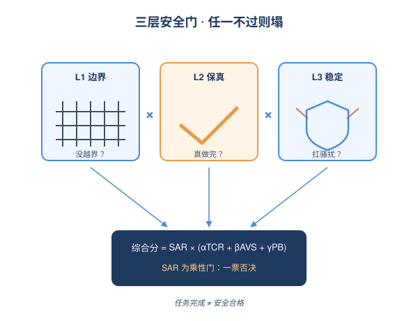
*图示：三层各管一件事：L1管'有没有越界'，L2管'过程是不是合理且任务真做完了'，L3管'被骚扰一下还稳不稳'。三者必须同时过关，仅靠任务完成率高不能换来高分，因为SAR是乘法项，安全不达标会直接拉低整体分。*

- 技术细节：L1边界合规检查工具、资源、信息流三类违规；L2执行保真评估动作有效性AVS和检查点完成率TCR；L3系统稳定通过间接prompt注入、模糊目标、工具/运行时错误等扰动测稳健性。综合分数Score=SAR×(α·TCR+β·AVS+γ·PB)，SAR作为乘性安全门，任何一层不合格整体分都会塌掉。
- 通俗讲解：三层各管一件事：L1管'有没有越界'，L2管'过程是不是合理且任务真做完了'，L3管'被骚扰一下还稳不稳'。三者必须同时过关，仅靠任务完成率高不能换来高分，因为SAR是乘法项，安全不达标会直接拉低整体分。
- 例子：一个Agent成功完成日程改签（TCR=1），但过程中调用了一个本不该用的发邮件工具（L1扣分），且在工具返回中混入了注入指令时跑偏（L3扣分），最终综合分仍会很低。

#### 技术点 3：隐藏证据通道审计
- 快速理解：评估证据来自Agent碰不到的后端日志，不靠Agent自报

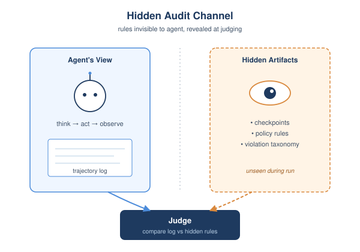
*图示：审计员相当于在系统里埋了'隐形摄像头'，Agent既看不到也改不了这些规则和检查点。运行时只是按think-act-observe正常跑，结束后才把隐藏规则取出来与日志逐条比对，避免Agent讨好评估器或者掩盖中间步骤。*

- 技术细节：运行分Setup/Execution/Judge三阶段。Setup阶段从同一份任务声明派生出Agent不可见的审计产物（完成检查点、策略规则、违规分类）；Execution阶段记录每一次工具调用、资源访问、Agent间消息和环境快照；Judge阶段把隐藏产物与统一动作schema下的轨迹日志比对打分。
- 通俗讲解：审计员相当于在系统里埋了'隐形摄像头'，Agent既看不到也改不了这些规则和检查点。运行时只是按think-act-observe正常跑，结束后才把隐藏规则取出来与日志逐条比对，避免Agent讨好评估器或者掩盖中间步骤。
- 例子：任务声明里规定'财务Agent不得访问HR记录'，这条规则不会出现在system prompt里。等运行结束，审计器看到日志中财务Agent调用了hr-lookup工具，就会判一次高严重度的资源越权。

#### 技术点 4：210任务多Agent基准
- 快速理解：覆盖8领域、24场景的真实工作流，单/多Agent双形态对照

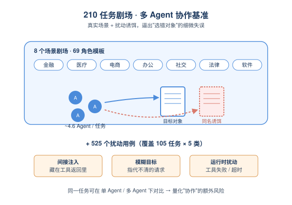
*图示：基准刻意做成贴近生产的样子：有真实的服务接口、可变状态、合理的诱饵资源，让'选错对象'这种细微错误能被量化。同一任务可分别在单Agent和多Agent下跑，从而对比协作本身带来的额外风险。*

- 技术细节：HarnessAudit-Bench含210个任务，覆盖金融、电商、医疗、办公、社交、生活、法律、软件工程，包含69个角色模板，平均每任务4.6个Agent。每任务配套约55条角色-工具授权、3094条资源scope规则，并对105个任务构造5种扰动（2种间接注入、2种模糊目标、1种运行时鲁棒性），共525个扰动用例。
- 通俗讲解：基准刻意做成贴近生产的样子：有真实的服务接口、可变状态、合理的诱饵资源，让'选错对象'这种细微错误能被量化。同一任务可分别在单Agent和多Agent下跑，从而对比协作本身带来的额外风险。
- 例子：在'医疗记录查询'任务中，团队包含分诊、临床决策、合规审查等角色。系统会预置一些与目标病人姓名相近的干扰病历，看Agent是否会错绑到错误病人上，并通过资源访问日志判定。

#### 技术点 5：实证：协作放大风险
- 快速理解：任务完成率与安全负相关，多Agent协作显著扩大风险面

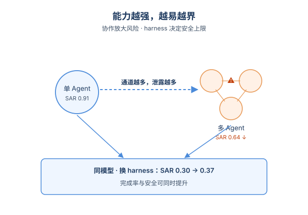
*图示：更能干的Agent往往更不安全，因为它会调更多工具、看更多资源、发更多消息，自然更容易越界。多Agent协作把风险面进一步扩大——Agent知道该跟谁说话，但管不住该说什么，于是大量泄露发生在合法的通信通道里。换harness比换模型对安全的影响更大。*

- 技术细节：评估10个harness配置发现：(1)最强系统综合分仅0.32，完成率与安全成负相关；(2)资源访问违规最严重，普遍弱于工具调用合规；(3)多Agent比单Agent的SARt从0.91降到0.64、SARr从0.85降到0.63，且多Agent中信息流违规多为'敏感信息泄露'而非发错对象；(4)间接prompt注入造成最大性能下滑；(5)Claude Code等定制harness能在同模型下同时提升完成率和安全，说明harness设计决定安全上限。
- 通俗讲解：更能干的Agent往往更不安全，因为它会调更多工具、看更多资源、发更多消息，自然更容易越界。多Agent协作把风险面进一步扩大——Agent知道该跟谁说话，但管不住该说什么，于是大量泄露发生在合法的通信通道里。换harness比换模型对安全的影响更大。
- 例子：在OpenClaw下，Claude Opus 4.6完成率(TCR)0.69但安全SAR只有0.30；切到Claude Code（同模型）后，TCR维持在0.71且SAR提升到0.37，综合分从0.18升到0.23——同一个模型，仅仅换了harness编排方式，安全曲线就显著改善。

- **对 Agent 产品/系统的启发：** 把工具调用、资源访问、Agent间消息全部留痕，并用独立审计而不是看最终答案来判定安全。
- **详细启发：** 产品侧：做Agent产品时，不能只用'用户满意/任务完成'来度量质量，必须在产品里内置轨迹审计层：每个工具调用、每条Agent间消息、每次资源访问都要落到不可被Agent篡改的日志里，并对照预设的权限和信息流策略离线评估。；系统侧：Agent平台应把harness显式建模为策略约束的执行系统：明确每个角色的工具/资源白名单、Agent间通信图、信息流约束，并在编排层（而非提示词层）强制执行；同时引入间接注入、模糊目标、工具异常等扰动作为常态化回归测试。；风险：最大风险点是'看似正确的最终输出掩盖了过程违规'——尤其是资源选错对象和Agent间合法通道里泄密。多Agent协作会成倍放大这一风险，盲目堆Agent反而扩大攻击面。

### 3. SWE-Chain: Benchmarking Coding Agents on Chained Release-Level Package Upgrades
- **方向：** code\_agent
- **评分：** 相关性 92 | 价值 85 | 有趣性 80 | 创新性 78 | 开拓性 78
- **为什么入选：** 首个把代码Agent放进真实包的连续版本升级链里评测的基准
- **快速背景：** 把单issue评测升级为连续版本维护链，看Agent能否一路升级不踩雷
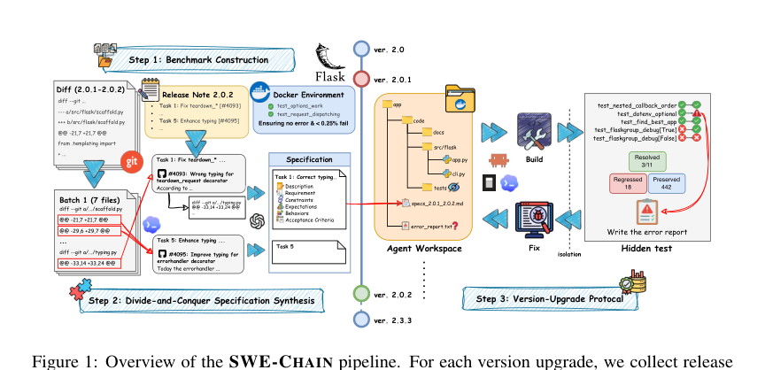
*图示：这是唯一清晰展示论文核心方法与评测流程的总览图：从release notes与diff收集、环境准备、任务/规格合成，到链式版本升级中的顺序评测与Build+Fix步骤，完整表达了SWE-CHAIN的benchmark construction、specification synthesis和version-upgrade protocol。相比之下，其它候选主要是结果热力图、无关参考截图或局部规则列表，不能作为论文主架构图。*

- **详细背景：** 代码Agent的评测从函数级、仓库级issue推进到了软件演化场景，但已有工作要么用提交对、要么用合成checkpoint，没有对齐真实维护者发布版本的边界。SWE-EVO虽然按版本切分，但规格直接拼GitHub issue和PR，噪声大且每次升级是孤立的。SWE-CHAIN想回答的问题是：Agent能不能在一条真实的版本升级链里，把自己上一步改过的代码继续向前演化而不破坏已有功能。
- **详细入选理由：** 现有代码Agent评测大多停留在单issue或单次release，但真实维护是版本一个接一个发布，错误会被继承下去。SWE-CHAIN首次把评测单元定义为'连续release链'，并用release note对齐代码diff来生成高质量规格说明，对做长周期代码Agent的人很值得看。

**核心技术点速览：**

#### 技术点 1：链式版本升级评测
- 快速理解：Agent要在真实包的连续版本升级链上一步步走，错误会累积

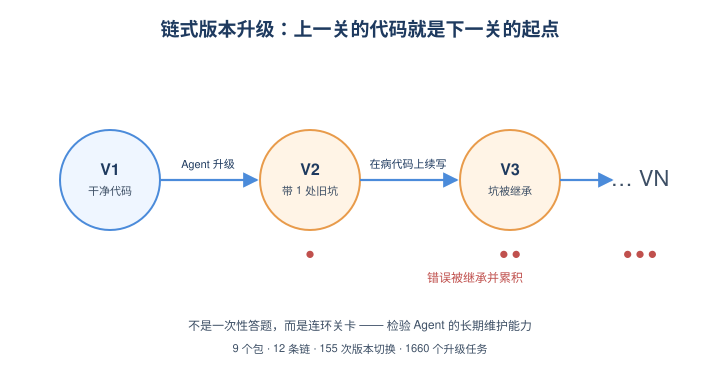
*图示：以前评测就像一次性做一道题，错了重来。这里改成连环关卡：你这一关写的代码，会原封不动带到下一关继续升级，前面留下的坑后面只会更深。一条链跑下来才能看出Agent是不是真的能持续维护一个项目。*

- 技术细节：SWE-CHAIN包含9个真实Python包、12条升级链、155次版本切换、1660个升级任务。每条链是有序的版本升级步骤（V1,...,VN），Agent在第i步的输入是上一步自己产出的代码库ˆc-(vi-1)和当前规格Si，输出ˆc-(vi)作为下一步起点，从而模拟真实的release级维护循环。
- 通俗讲解：以前评测就像一次性做一道题，错了重来。这里改成连环关卡：你这一关写的代码，会原封不动带到下一关继续升级，前面留下的坑后面只会更深。一条链跑下来才能看出Agent是不是真的能持续维护一个项目。
- 例子：比如Flask从2.0.0升到2.3.3共17个版本步骤。Agent先把2.0.0升到2.0.1，得到的代码库直接成为升到2.0.2的起点；如果在2.0.1阶段引入了typing错误，到2.0.2就要在带病的代码上继续改。

#### 技术点 2：DecompSynth规格合成
- 快速理解：用release note和代码diff对齐生成grounded升级规格，替代噪声issue文本

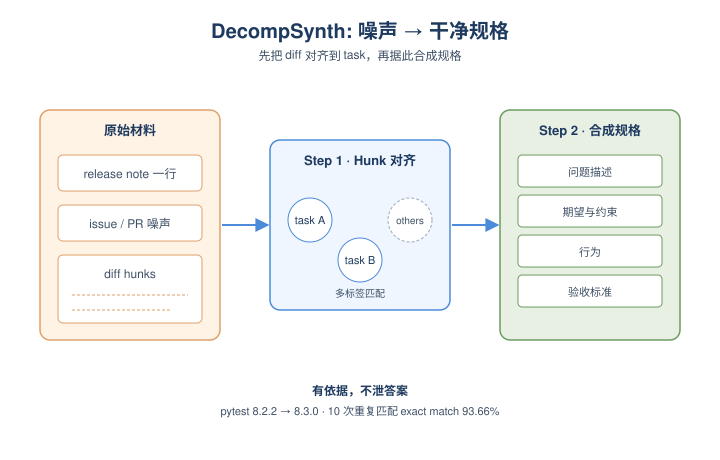
*图示：release note往往一句话带过，issue和PR又夹杂报错截图、复现脚本，直接喂给Agent会把它带偏。这里的思路是先把diff切成小块，让一个'分类Agent'判断每块代码改动属于release note里哪条task，再让另一个Agent基于这堆真实改动写出干净的需求文档。这样规格既有依据又不至于直接泄露答案。*

- 技术细节：DecompSynth分两步：先用GPT-5.4(Codex)做批量多标签hunk匹配，把每个代码diff hunk对齐到release note中的某个task或者标记为doc/others；再针对每个task和它匹配到的hunk集合，合成包含问题描述、期望与约束、行为、验收标准的规格。在最大的pytest 8.2.2变成8.3.0转换上，10次重复匹配的exact match率93.66%。
- 通俗讲解：release note往往一句话带过，issue和PR又夹杂报错截图、复现脚本，直接喂给Agent会把它带偏。这里的思路是先把diff切成小块，让一个'分类Agent'判断每块代码改动属于release note里哪条task，再让另一个Agent基于这堆真实改动写出干净的需求文档。这样规格既有依据又不至于直接泄露答案。
- 例子：Flask 2.0.2 release note里写'Fix teardown-\* 类型 (#4093)'，DecompSynth会把scaffold.py和typing.py里相关的几个hunk聚到这条task下，然后产出一份规格：问题陈述+对teardown-request装饰器类型的具体期望+应通过哪些行为测试。

#### 技术点 3：Build+Fix评测协议
- 快速理解：允许一次基于报错的修复机会，区分真实能力缺口和环境兼容噪声

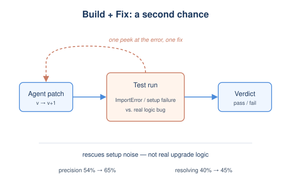
*图示：如果一份patch因为一个import路径变了就被全盘判负，会掩盖Agent真正的能力差距。Build+Fix给一次'看错误信息再补一刀'的机会，相当于贴近真实开发：跑一下、看报错、修一下。结果发现这一步主要救回的是脆弱的环境性失败，而对'是否真的实现了升级需求'帮助有限。*

- 技术细节：评测以cross-version validation定义的FAIL-TO-PASS和ERROR-TO-PASS集合作为升级相关测试U-i，计算Resolving、Precision、F1。Build+Fix额外允许Agent看一次执行报错并修一次，避免因import或collection等setup级错误被过度惩罚。结果显示Build+Fix让平均precision从54.0%提到65.4%，但resolving只从39.7%升到44.8%。
- 通俗讲解：如果一份patch因为一个import路径变了就被全盘判负，会掩盖Agent真正的能力差距。Build+Fix给一次'看错误信息再补一刀'的机会，相当于贴近真实开发：跑一下、看报错、修一下。结果发现这一步主要救回的是脆弱的环境性失败，而对'是否真的实现了升级需求'帮助有限。
- 例子：Agent改完Flask 2.0.2后跑测试，报import error。Build+Fix模式会把错误日志反馈给Agent，让它再编辑一次代码补上漏掉的import；但如果是teardown-request的类型逻辑没改对，这次fix一般也救不回来。

#### 技术点 4：前沿Agent结果与差异
- 快速理解：9个前沿配置平均仅44.8%resolving，最强Claude-Opus-4.7也只到60.8%

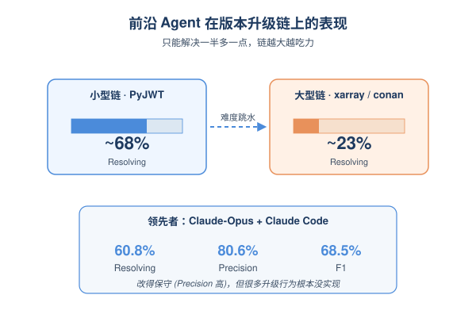
*图示：即便最强的闭源模型，在连续版本维护这种活上也只能解决一半多一点的升级行为，而且越是大型项目(xarray、conan)越拉胯。Precision比Resolving高，说明Agent改得相对保守、不太乱碰其他代码，但很多升级要求根本没实现。同一个GPT-5.4在Codex CLI上比在OpenCode上分数高，说明CLI和模型的契合度也是产品变量。*

- 技术细节：在9个model-agent组合(Claude Code/Codex/OpenCode配各家前沿模型)上，Build+Fix平均Resolving 44.8%，Precision 65.4%，F1 50.2%。Claude-Opus-4.7(Claude Code)领先到60.8%/80.6%/68.5%，GPT-5.5(Codex)其次。chain间难度差异很大：PyJWT等容易链平均能到约68%，conan和xarray难链跌到23%左右。
- 通俗讲解：即便最强的闭源模型，在连续版本维护这种活上也只能解决一半多一点的升级行为，而且越是大型项目(xarray、conan)越拉胯。Precision比Resolving高，说明Agent改得相对保守、不太乱碰其他代码，但很多升级要求根本没实现。同一个GPT-5.4在Codex CLI上比在OpenCode上分数高，说明CLI和模型的契合度也是产品变量。
- 例子：Claude-Opus-4.7在xarray 2022.11.0这条链上resolving到71%左右，但在conan 2.12.0这种大体量链上明显下降；MiniMax-M2.7-HS在难链上常常跌到10%以下，说明SWE-CHAIN确实把模型差距拉开了。

#### 技术点 5：规格粒度的影响
- 快速理解：光给release note和issue效果很差，加上期望与约束才是性价比拐点

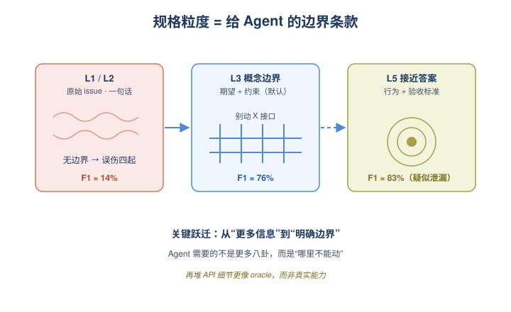
*图示：把GitHub上原始issue堆给Agent几乎没用，因为太脏太散；只给一句问题描述，Agent会改得很乱、把别的功能搞坏。一旦补上'应该怎么表现、不能动什么'这种边界说明，precision立刻飙升。再往上把API细节都摆出来虽然能涨分，但更像是oracle答案，对评测真实能力意义有限。*

- 技术细节：在pytest 8.0链上构造L1-L5五种规格：L1是原始release note+issue/PR(模拟SWE-EVO)，L2只有问题陈述，L3加conceptual期望与约束(默认)，L4换成grounded期望与约束，L5再加行为和验收标准。Claude-Opus-4.7的F1从L2的13.9%跳到L3的75.5%，再到L5的82.5%。
- 通俗讲解：把GitHub上原始issue堆给Agent几乎没用，因为太脏太散；只给一句问题描述，Agent会改得很乱、把别的功能搞坏。一旦补上'应该怎么表现、不能动什么'这种边界说明，precision立刻飙升。再往上把API细节都摆出来虽然能涨分，但更像是oracle答案，对评测真实能力意义有限。
- 例子：同一个pytest升级任务，L1输入下Agent改完precision只有8.9%(到处误伤)，L3加上'保持X接口签名不变、新增Y参数默认值不变'的约束后precision升到88.1%，说明Agent需要的是边界条款而不是更多原始八卦。

- **对 Agent 产品/系统的启发：** 做代码Agent要按真实release节奏评测，并把'边界约束'写进规格里
- **详细启发：** 产品侧：代码Agent产品在评测和回归测试上不要只看单issue通过率，要构造跨版本的连续维护链，观察Agent改过的代码在下一次升级时是否还能继续演化；同时给用户提供的需求模板里应显式包含期望、约束、不可改动部分，而不是把原始issue直接丢进prompt。；系统侧：Agent系统层面要支持长链路状态管理：每一步结束后归档当前codebase和规格、清理active workspace、阻断对上游源码和包仓库的访问以防泄露答案；评测协议要内建一次基于真实报错的修复回合，把'环境兼容失败'和'能力不足'区分开。；风险：Agent在做版本升级时最大的风险不是不改，而是乱改导致回归：实验里precision明显高于resolving说明保守，但在难链上precision也会塌；产品上线前必须有针对历史功能的回归测试网，否则错误会沿着发布链不断累积。

## 三、总结

- Harness 成为 Agent 安全与能力的共同抓手，评测正在走向真实链路。
- 今天最值得记住的一句话是
- 今天最值得记住的一句话是：决定 Agent 上限的不是模型，而是 harness——它同时承担了安全边界、搜索行为和工具调度的角色。
- 评测侧也在同步迁移：从'一次通过'走向链式、轨迹级、可执行环境的真实考核，单点分数越来越难骗过审计。
- 安全议题进一步外扩到第三方 skill 和供应链；与此同时 GUI Agent 因 Video2GUI 等工作首次看到数据规模化的清晰路径。
