# 2026-05-26 AI Agent 论文日报

> 分类：cs.AI + cs.CL + cs.LG + cs.MA + cs.RO + cs.SE + cs.HC
> 入选论文：3 篇

## 一、初筛每日趋势

- Harness 正式被推上一等公民：模型 vs 脚手架方差比 7.8×
- Computer-Use Agent 训练栈集体补课：环境、奖励、并行三件套
- Agent 评测从结果分转向因果归因和过程指标
- 今天 general\_agent 占 417 篇，多个高分论文（Harness Scaling、Stop Comparing、CausalFlow）共同指向同一判断：Agent 的下一个瓶颈在 harness/runtime 层，而不是再堆模型。
- Computer-Use 方向集中爆发训练与仿真基础设施（CUA-Gym、MobileGym、AgentHijack），把'可验证奖励 + 可重置环境 + 鲁棒性扰动'打成标准三件套。
- Agent 评测方法论持续深化：从 harness 透明披露、因果失败归因到环境腐化基准，单一成功率 leaderboard 的可信度被系统性质疑。
- 记忆与持续学习方向出现新议题：Provenance-Role 崩塌、Mental Model 演化、Library Drift 延续，记忆层正被当作有生命周期、会退化的子系统来治理。

### 跨论文综合观察

- Harness Scaling、Stop Comparing、CausalFlow 三篇形成三角呼应：一个提出'harness 是可设计可分解的系统'，一个用 7.8× 方差证明它在评测中被严重低估，一个进一步给出运行时因果诊断工具——共同把 harness 从工程细节升格为研究对象。
- CUA-Gym、MobileGym、AgentHijack 在 Computer-Use 方向上分别补齐训练数据合成、并行仿真和鲁棒性扰动评测，三者拼起来就是'CUA 版 RLVR + 抗扰动评测'的完整训练-评测闭环。
- Typed Memory、VeriTrace、Evo-Attacker 同时出现，说明记忆层正被三种视角夹击：表征侧治理崩塌、研究 Agent 演化心智模型、攻击侧专门针对长程记忆——记忆已经从'存储问题'变成攻防与生命周期问题。

## 二、重点论文精读

### 1. From Model Scaling to System Scaling: Scaling the Harness in Agentic AI
- **方向：** general\_agent
- **评分：** 相关性 95 | 价值 88 | 有趣性 85 | 创新性 80 | 开拓性 88
- **为什么入选：** 把 Agent 的 harness（系统层）当作一等公民，提出从模型 scaling 转向系统 scaling 的架构视角
- **快速背景：** Agent 表现不只取决于模型本身，而取决于围绕它的执行系统
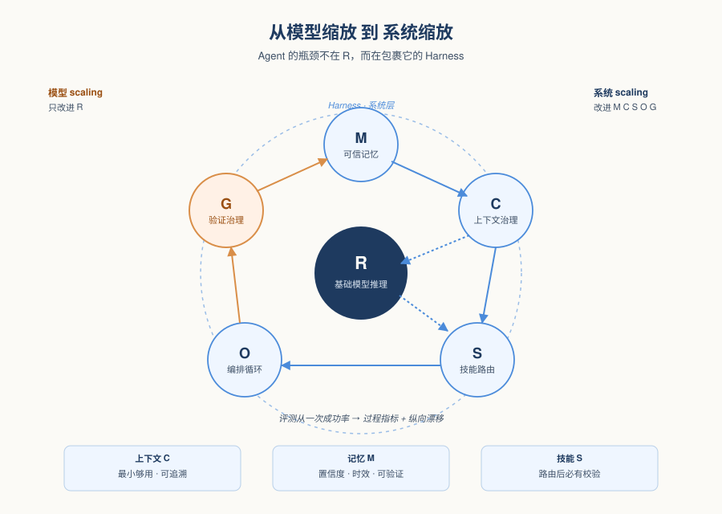
*图示：这篇论文跳出了'模型越大越好'的叙事，明确提出 Agent 的下一个瓶颈在系统层——也就是包裹模型的 harness（记忆、上下文、技能路由、编排、验证治理），并给出了可对比的开源参考实现 CheetahClaws。对做 Agent 产品和 runtime 的人，这是少见的'架构级'整理。*

- **详细背景：** 目前 Agent 评测仍以一次任务成功率为主，把记忆、检索、工具、编排、验证当作次要工程细节。但实际部署中，Agent 行为是由模型与外围系统（harness）共同决定的：同一个模型套不同 harness 会表现得像不同 Agent。作者认为模型 scaling 到一定能力后，长程任务的瓶颈转移到系统 scaling，因此值得把 harness 当作一等设计与评测对象。
- **详细入选理由：** 这篇论文跳出了'模型越大越好'的叙事，明确提出 Agent 的下一个瓶颈在系统层——也就是包裹模型的 harness（记忆、上下文、技能路由、编排、验证治理），并给出了可对比的开源参考实现 CheetahClaws。对做 Agent 产品和 runtime 的人，这是少见的'架构级'整理。

**核心技术点速览：**

#### 技术点 1：六组件 harness 框架
- 快速理解：把 Agent 拆成六个可独立干预的系统组件，模型只是其一

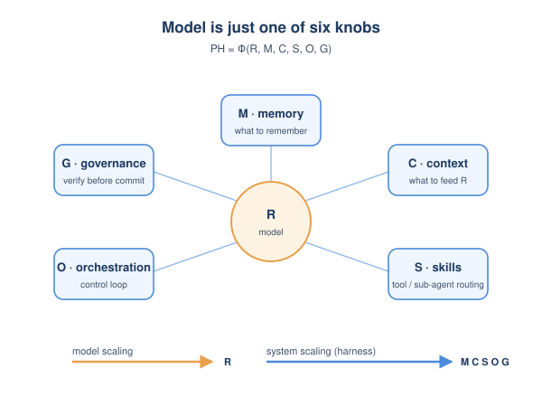
*图示：作者想说的其实是：别再把 Agent 当成'模型 + prompt'，要当成一个分层系统。一次请求过来，O 启动控制循环，C 从 M 里挑相关记忆拼上下文喂给 R，R 给出动作后由 S 决定调哪个工具或子 Agent，结果先经过 G 审核才允许写回 M 或对外执行。每一层都可以单独优化或单独搞砸。*

- 技术细节：论文把 Agent 表现写成 PH = Φ(R, M, C, S, O, G)：R 是基础模型推理，M 是记忆，C 是上下文构造，S 是技能/子 Agent 路由，O 是编排循环，G 是验证与治理。模型 scaling 改进的只是 R，系统 scaling 改进的是 M、C、S、O、G。作者强调这不是定量公式，而是六个可单独打开/关闭/测量的干预点。
- 通俗讲解：作者想说的其实是：别再把 Agent 当成'模型 + prompt'，要当成一个分层系统。一次请求过来，O 启动控制循环，C 从 M 里挑相关记忆拼上下文喂给 R，R 给出动作后由 S 决定调哪个工具或子 Agent，结果先经过 G 审核才允许写回 M 或对外执行。每一层都可以单独优化或单独搞砸。
- 例子：比如让 Agent 修一个 repo bug：O 启动循环；C 从 M 里取出 'loader 在 utils/loader.py' 的项目记忆并 grep 当前代码；R 生成补丁；S 路由给 '运行测试' 子 Agent；G 检查 diff 权限和测试通过后，才把 '此 bug 已修复' 写回 M。任何一层缺位都会让同一个模型表现得像不同 Agent。

#### 技术点 2：三大系统瓶颈
- 快速理解：上下文治理、可信记忆、动态技能路由是当前最痛的三个系统层短板

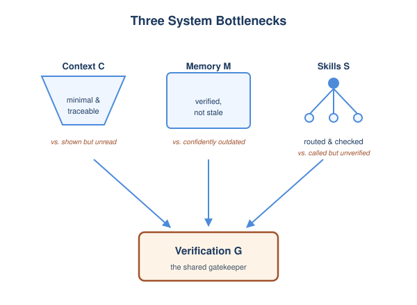
*图示：更长的 context window 不等于更好的上下文，关键是每一步只装入'最小够用'的信息并能追溯来源。记忆不是存得多就好，存进去的内容会过期、漂移、被污染，所以信任要在检索时再判断一次，必要时回环境里重新核对。技能多了反而会出现'子 Agent 给了个看起来对的结果但没人校验'的失败，路由必须配上后置检查。*

- 技术细节：论文识别三个瓶颈：(1) 上下文治理 C，关注相关性、紧凑性、可追溯、刷新策略，对抗'曝光但没真正读到'；(2) 可信记忆 M，关注精度、持久性、可检索、可验证，对抗'过期但仍自信'；(3) 动态技能路由 S，关注专一性、选择性、可组合、可验证，对抗'调用了但没人校验'。三者都和验证治理 G 紧耦合。
- 通俗讲解：更长的 context window 不等于更好的上下文，关键是每一步只装入'最小够用'的信息并能追溯来源。记忆不是存得多就好，存进去的内容会过期、漂移、被污染，所以信任要在检索时再判断一次，必要时回环境里重新核对。技能多了反而会出现'子 Agent 给了个看起来对的结果但没人校验'的失败，路由必须配上后置检查。
- 例子：Agent 记忆里写着 'data loader 在 utils/loader.py'，重构后文件已被删除。语义检索仍然把这条排到最前；如果系统直接信任并调用，就会引入回归 bug。可信记忆的做法是：检索时附带过期惩罚和置信度，先 grep 当前仓库验证一次再决定是否用。

#### 技术点 3：面向过程与纵向的评测
- 快速理解：Agent 评测要从一次性成功率扩展到过程质量与长期可演化性

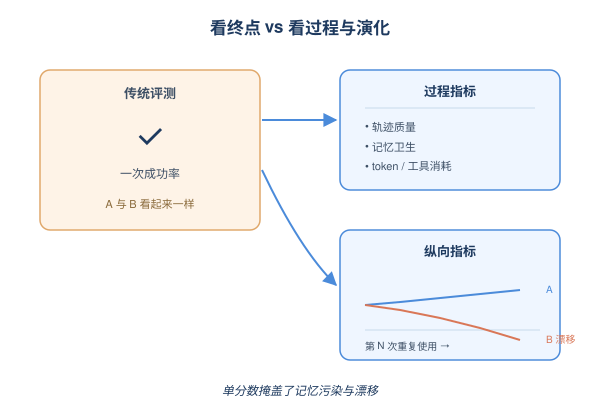
*图示：现在的榜单只看任务最后通没通过，忽略了'用了多少 token、改了几次、回滚了多少次、记忆有没有越用越脏'。但真实部署里这些才决定成本、信任和安全。作者主张把 Agent 当作一个会持续运行的系统来评测，看它在重复使用中是变得更好用还是悄悄退化。*

- 技术细节：作者指出 SWE-bench、AgentBench、WebArena、Terminal-Bench 等推动了多步执行评测，但仍以单分数为主，混淆了模型能力和 harness 设计。论文呼吁同时报告过程指标（轨迹质量、记忆卫生、上下文效率、通信保真度、验证成本、token/工具调用消耗）以及纵向指标（重复使用下的漂移、记忆污染、安全演化），并配套'Agent 演化标准'：什么持久化、什么可更新、什么被度量、什么可审计。
- 通俗讲解：现在的榜单只看任务最后通没通过，忽略了'用了多少 token、改了几次、回滚了多少次、记忆有没有越用越脏'。但真实部署里这些才决定成本、信任和安全。作者主张把 Agent 当作一个会持续运行的系统来评测，看它在重复使用中是变得更好用还是悄悄退化。
- 例子：两个 Agent 都解出了同一个 SWE-bench 任务，但 A 用了 5 次工具调用和干净的 trace，B 用了 30 次调用、写入了 10 条相互矛盾的记忆。一次性成功率上两者并列；但纵向评测会暴露 B 在跑第二轮类似任务时因为记忆污染而崩溃。

#### 技术点 4：三套 harness 对比
- 快速理解：Claude Code、OpenClaw、CheetahClaws 用不同设计落地同一组系统问题

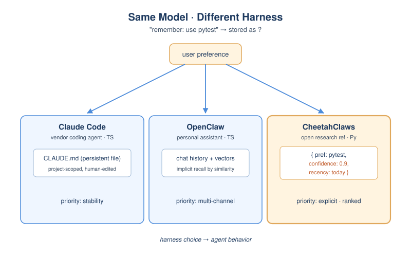
*图示：作者用三个真实系统说明：相同模型套上不同 harness，行为会显著不同，差异主要由部署目标驱动而非模型差异。厂商系统优先稳定可用，个人助理优先多渠道接入，研究 harness 优先透明和可复现。这也支撑了'harness 是一等设计对象'的主张。*

- 技术细节：论文用 Claude Code（TypeScript，厂商级编码 Agent）、OpenClaw（TypeScript，多通道个人助理）、CheetahClaws（Python，开源研究参考实现）作为三个对照点。三者都要解决上下文治理、记忆管理、技能路由，但选择不同：CheetahClaws 把每条记忆的 confidence 与 recency 作为一等字段直接进入检索排序与冲突解决，另两者更多隐式地从访问模式推断信任。
- 通俗讲解：作者用三个真实系统说明：相同模型套上不同 harness，行为会显著不同，差异主要由部署目标驱动而非模型差异。厂商系统优先稳定可用，个人助理优先多渠道接入，研究 harness 优先透明和可复现。这也支撑了'harness 是一等设计对象'的主张。
- 例子：同样一句 '记住用户偏好用 pytest'：Claude Code 写进 CLAUDE.md 持久项目记忆；OpenClaw 落到对话历史 + 向量检索里；CheetahClaws 则会写成一条带 confidence=0.9、recency=今天 的结构化条目，下次检索冲突时按这两个字段裁决。

- **对 Agent 产品/系统的启发：** 把 harness 当成可设计、可评测的一等对象，而不是模型外面的胶水
- **详细启发：** 产品侧：做 Agent 产品时不要只比拼底层模型，要把上下文构造、记忆策略、工具/子 Agent 路由、验证治理当作显式产品特性，并向用户暴露成本、轨迹与可审计性，这些才是长期使用中的差异化点。；系统侧：Agent runtime 应按六组件 (R,M,C,S,O,G) 模块化：上下文按选择策略动态装配并记录 provenance；记忆在检索时附带过期与置信度，并支持回环境二次验证；技能路由配后置检查；所有写记忆/调工具/改路由都留 audit trace。；风险：纯靠'模型变强会自己解决'是危险的：过期记忆、过宽工具权限、未验证检索、无来源追踪是系统级失败，模型再强也仍需显式机制；持续演化的 Agent 还可能积累污染、漂移甚至潜伏行为，行为评测不足以覆盖。

### 2. CUA-Gym: Scaling Verifiable Training Environments and Tasks for Computer-Use Agents
- **方向：** computer\_use
- **评分：** 相关性 95 | 价值 88 | 有趣性 82 | 创新性 80 | 开拓性 85
- **为什么入选：** 把 RLVR 数据合成搬到电脑使用 Agent，环境和任务一起规模化
- **快速背景：** CUA 缺可验证奖励数据，手写一条要数小时，规模一直上不去。
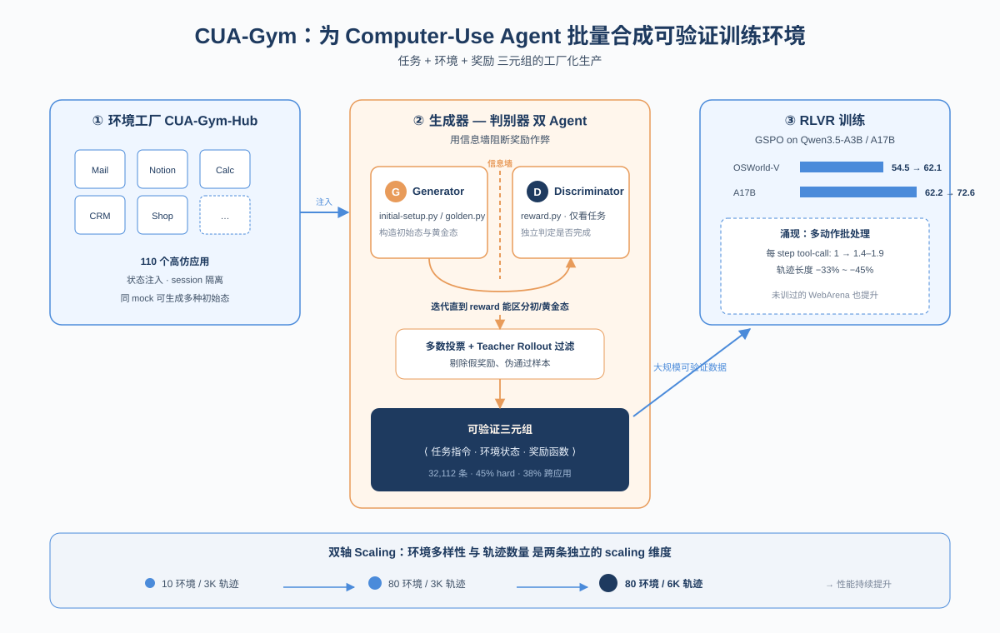
*图示：Computer-Use Agent 训练长期卡在'没有可验证奖励的训练数据'，本文给出一条把任务、环境、奖励一起合成并自动验证的流水线，且开源数据、环境和模型，对做 CUA 训练栈的人是直接可用的资产。*

- **详细背景：** 数学和代码领域靠 RLVR + 大规模可验证数据取得突破，但 CUA 的训练样本是 (任务指令, 可执行环境, 奖励函数) 三元组，每条都要工程师手搓，导致数据规模比文本领域小几个数量级。已有方案要么用 VLM 当裁判（奖励噪声大、RL 容易崩），要么用代码原生但只覆盖少量浏览器场景。本文要解决的就是'同时具备确定性奖励、广覆盖、规模化'这三件事。
- **详细入选理由：** Computer-Use Agent 训练长期卡在'没有可验证奖励的训练数据'，本文给出一条把任务、环境、奖励一起合成并自动验证的流水线，且开源数据、环境和模型，对做 CUA 训练栈的人是直接可用的资产。

**核心技术点速览：**

#### 技术点 1：生成器-判别器双 Agent 合成
- 快速理解：用信息隔离的两个 Agent 分别造环境和写奖励，避免奖励 hack。

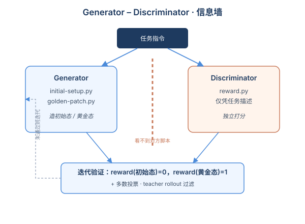
*图示：如果同一个 Agent 既造环境又写打分，它很容易写出'检查我刚才那几步有没有跑过'这种假奖励。论文把两个角色拆开并加信息墙：造环境的人不告诉打分的人具体怎么造，打分的人只能根据任务本身去判断'是否真的完成了'。再用一轮 rollout 过滤掉那些循环里看不出问题、但放到真 Agent 跑就崩的题。*

- 技术细节：Orchestrator 起两台 VM，Generator 根据任务和技能写 initial-setup.py 和 golden-patch.py 构造初始态与黄金态；Discriminator 在沙箱里只看任务描述独立写 reward.py，不能看 Generator 的脚本。两者迭代直到 reward 能区分初始态和黄金态，最后再叠一层 LLM 多数投票 + teacher rollout 过滤。
- 通俗讲解：如果同一个 Agent 既造环境又写打分，它很容易写出'检查我刚才那几步有没有跑过'这种假奖励。论文把两个角色拆开并加信息墙：造环境的人不告诉打分的人具体怎么造，打分的人只能根据任务本身去判断'是否真的完成了'。再用一轮 rollout 过滤掉那些循环里看不出问题、但放到真 Agent 跑就崩的题。
- 例子：任务是'按 Notion 名单给每个客户发带 clients.xlsx 附件的邮件'。Generator 写脚本准备好 Notion 数据库、Gmail 模板、桌面 xlsx；Discriminator 只看任务，把奖励拆成'Sent 里有邮件 / 内容匹配模板 / 收件人匹配 Notion 名单'三个子项，每项打分聚合成 （0,1），跑完发现初始态 0 分、黄金态 1 分才算这条数据通过。

#### 技术点 2：CUA-Gym-Hub 环境工厂
- 快速理解：用 Plan/Dev/Web 三 Agent 自动造 94 个可重置 mock Web 应用。

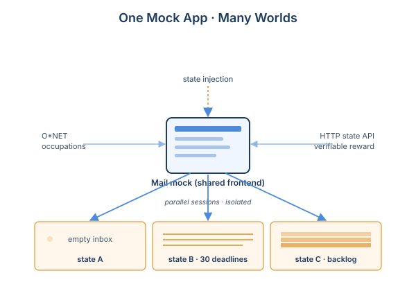
*图示：真网站没法当训练场：登录、限流、状态不可重置。作者干脆让 Agent 自己照真应用造一批高仿单页应用，并且每个应用都能像游戏存档一样注入初始状态、按 session 隔离。这样同一个 Mail mock，可以一秒切换成'空收件箱''截止日紧张''积压一堆邮件'三种世界，配合不同任务复用。*

- 技术细节：环境覆盖以 O\*NET 职业分类和 Anthropic Economic Index 软件使用分布为锚点。Plan Agent 先输出 DESIGN.md / TODO.md 和 UI 树，Dev Agent 实现单页应用，Web Agent 用 Playwright 自动点遍每个交互元素并对照 spec 反馈给 Dev Agent，直到收敛。每个 mock 都暴露统一 HTTP 状态 API，支持 state injection 和 session isolation。
- 通俗讲解：真网站没法当训练场：登录、限流、状态不可重置。作者干脆让 Agent 自己照真应用造一批高仿单页应用，并且每个应用都能像游戏存档一样注入初始状态、按 session 隔离。这样同一个 Mail mock，可以一秒切换成'空收件箱''截止日紧张''积压一堆邮件'三种世界，配合不同任务复用。
- 例子：想训练'整理收件箱'的能力，只要给同一个 Mail mock 注入不同 JSON 初始态：状态 A 是干净收件箱，状态 B 塞 30 封项目截止邮件，状态 C 是休假后的积压。多个 RL worker 各占一个 session 并行跑，互不干扰，但共用同一份前端代码。

#### 技术点 3：数据与环境双轴 Scaling
- 快速理解：扩任务量和扩环境数是两条独立有效的 scaling 轴。

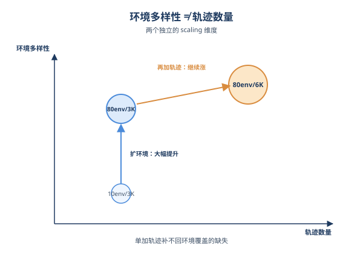
*图示：光堆轨迹不够，覆盖的应用种类同样关键。作者分别做了'10 环境/3K 轨迹''80 环境/3K 轨迹''80 环境/6K 轨迹'三组对照，发现把环境从 10 扩到 80 提升明显，再加倍轨迹还能继续涨——说明环境多样性是和数据量并列的独立 scaling 维度。*

- 技术细节：最终数据集 32,112 条已验证三元组覆盖 110 个环境（16 桌面 + 94 web mock），45% 标为 hard、38% 跨应用。在 Qwen3.5-A3B/A17B 上用 GSPO 训练，OSWorld-Verified 从 54.5变成62.1、62.2变成72.6，并在未训过的 WebArena 上也有提升。消融显示 10变成80 环境的扩展带来的收益是单纯加轨迹量补不回来的。
- 通俗讲解：光堆轨迹不够，覆盖的应用种类同样关键。作者分别做了'10 环境/3K 轨迹''80 环境/3K 轨迹''80 环境/6K 轨迹'三组对照，发现把环境从 10 扩到 80 提升明显，再加倍轨迹还能继续涨——说明环境多样性是和数据量并列的独立 scaling 维度。
- 例子：用 12K 条 CUA-Gym 数据训 A3B，OSWorld 多应用工作流子集从 30 涨到 51.5（+21.5pp），libreoffice-calc +14.9pp；同一 checkpoint 在完全没见过的 WebArena 浏览器环境也从 40.8 涨到 44.5，说明合成 mock 学到的能力能迁到真浏览器站点。

#### 技术点 4：RL 自发涌现多动作批处理
- 快速理解：RL 训练让策略自动把多个确定性动作打包成一回合。

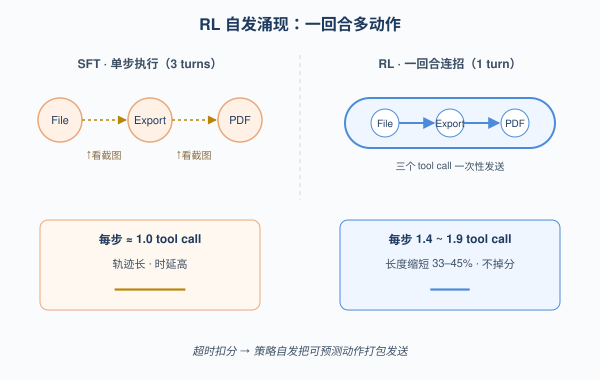
*图示：没人显式教模型'多动作合并'，但因为超时会被扣分，模型自己发现：像点 File变成Export变成PDF 这种结果可预测的连招可以一次性发出去；而依赖网络返回或弹窗的动作仍然单步执行，避免出错。等于 RL 帮你把推理时延降了 40%。*

- 技术细节：在 GSPO 的组归一化 advantage 下，能在固定 step 预算内完成的轨迹拿到更高相对回报，策略因此自发学会一回合发多个 tool call。每步平均 tool call 数从 SFT 时的 ≈1 升到稳定的 1.4–1.9，轨迹长度在不掉分情况下缩短 33–45%。
- 通俗讲解：没人显式教模型'多动作合并'，但因为超时会被扣分，模型自己发现：像点 File变成Export变成PDF 这种结果可预测的连招可以一次性发出去；而依赖网络返回或弹窗的动作仍然单步执行，避免出错。等于 RL 帮你把推理时延降了 40%。
- 例子：导出 PDF 时，SFT 模型分三回合：第一回合 click(File)、看截图、第二回合 click(Export)…；RL 后模型直接在一个 turn 里输出 click(File)变成click(Export)变成click(PDF) 三个 tool call，但遇到'点了发送等服务器返回'就退回单步执行。

- **对 Agent 产品/系统的启发：** 做 CUA 产品就该把任务、环境、奖励当成一条流水线一起合成，并把环境当成可复用底座。
- **详细启发：** 产品侧：面向桌面/Web Agent 的产品方，可以直接复用 CUA-Gym-Hub 的 mock 应用作为训练和回归测试场，把'是否完成任务'改写成可程序化校验的状态断言，而不是依赖人工或 VLM 打分。；系统侧：训练栈层面，建议把环境层和任务层解耦：环境暴露统一状态 API + session 隔离支持并行 rollout；任务合成走'生成者-判别者+信息墙+rollout 过滤'四段式，避免奖励 hack 和不可解任务污染数据。长轨迹训练可以借鉴论文的 trajectory slicing，把旧截图压成占位符以省 context、复用 KV cache。；风险：奖励只校验终态而非过程，无法区分'干净完成'和'破坏后又重建到同样终态'；mock 应用缺真实鉴权、限流、第三方集成与服务器异常，跨到真实生产环境仍可能掉点；最大规模 RL 实验仅单 seed，结论稳健性需自行复测。

### 3. Stop Comparing LLM Agents Without Disclosing the Harness
- **方向：** agent\_eval
- **评分：** 相关性 92 | 价值 88 | 有趣性 85 | 创新性 80 | 开拓性 85
- **为什么入选：** 揭示 Agent 评测里 harness 比模型更决定胜负，直接动摇 leaderboard 的可信度
- **快速背景：** 现在的 Agent 榜单只报模型分数，却忽略了决定成败的执行 harness。
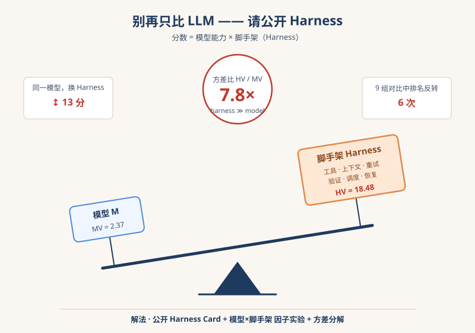
*图示：这篇 position paper 把 'agent 跑分到底是模型的功劳还是脚手架的功劳' 这个长期被忽视的问题摆到台面上，并用控制论框架、公开榜单数据和一个 3×3 受控实验给出量化证据：harness 引起的方差是模型方差的 7.8 倍，9 对比较里出现 6 次排名反转。对任何关心 Agent 评测、benchmark 复现或选型的人都极具冲击力。*

- **详细背景：** 目前 SWE-bench、Terminal-Bench、GAIA 等 leaderboard 都只报 {模型, 分数}，默认分数等于模型能力。但每个分数其实是模型 + 执行 harness（上下文构造、工具调用、重试、验证、停止策略等）共同产出的。已有数据显示：同一模型只换 harness，SWE-bench Verified 能差 11–15 个点，Terminal-Bench 能从 69.7% 跳到 77.0%，远超论文里常报的 2–4 点 '模型进步'。这让跨论文模型比较和复现都不可靠，也把研究投入引向了错误方向。
- **详细入选理由：** 这篇 position paper 把 'agent 跑分到底是模型的功劳还是脚手架的功劳' 这个长期被忽视的问题摆到台面上，并用控制论框架、公开榜单数据和一个 3×3 受控实验给出量化证据：harness 引起的方差是模型方差的 7.8 倍，9 对比较里出现 6 次排名反转。对任何关心 Agent 评测、benchmark 复现或选型的人都极具冲击力。

**核心技术点速览：**

#### 技术点 1：Binding Constraint Thesis
- 快速理解：在长程任务+同档模型下，harness 方差通常超过模型方差，榜单排名会被 harness 翻转

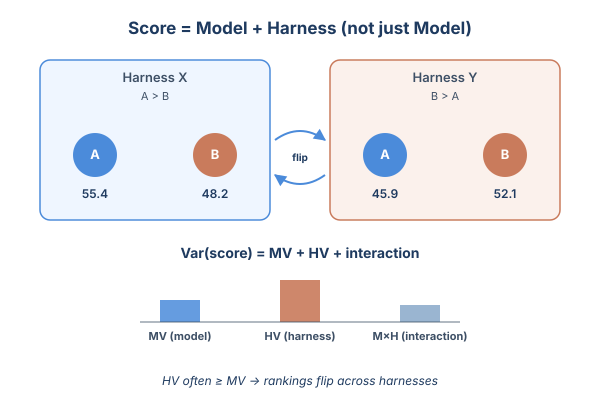
*图示：把'模型能力'和'外面那层执行框架'看成两个变量，作者说真正让分数抖动的往往是后者。换句话说，A 模型在 X 框架下赢 B，到了 Y 框架可能就输了。所以只报一个分数、不说用了哪种框架，等于把两个变量混在一起算成模型的本事。*

- 技术细节：作者形式化定义 HV(M)=Var-H（B(M,H)） 与 MV(H)=Var-M（B(M,H)），并用 Var(B)=MV+HV+interaction 三项分解。论点是：在长程任务 + 能力相近的前沿模型这一区间，HV 常常可比甚至大于 MV，且 interaction 项不可忽略，所以单一未公开 harness 下的排名是不可靠的。
- 通俗讲解：把'模型能力'和'外面那层执行框架'看成两个变量，作者说真正让分数抖动的往往是后者。换句话说，A 模型在 X 框架下赢 B，到了 Y 框架可能就输了。所以只报一个分数、不说用了哪种框架，等于把两个变量混在一起算成模型的本事。
- 例子：在 SWE-bench Pro 上，Claude Opus 4.5 用 SEAL 脚手架是 45.9%，换成 Claude Code 就到 55.4%；只是给所有模型加一个 WarpGrep 搜索子 agent，就让 MiniMax 2.5 和 Claude Opus 4.6 的排名翻转。

#### 技术点 2：把 Agent 当闭环控制系统
- 快速理解：LLM 是开环策略，harness 才是关闭反馈回路的控制器，长程稳定性是控制器属性

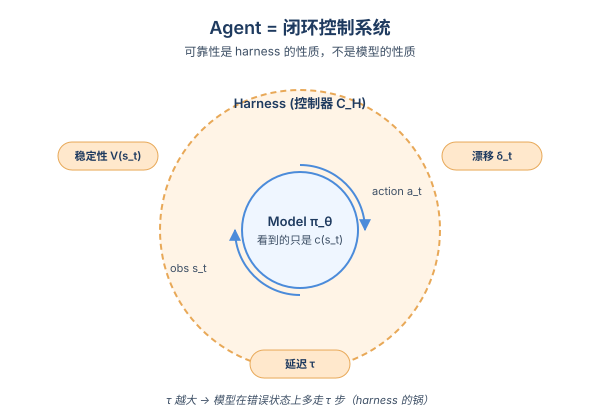
*图示：模型本身'看不见'真实状态，只能看到 harness 喂进来的那段上下文，也没有跨步记忆，错了也不会自动改。所以一次长任务能不能稳住、能不能从工具报错里恢复，本质是外面那圈控制逻辑在决定，而不是模型变聪明就能解决。*

- 技术细节：论文用控制论重写 agent：状态 s-t 是上下文+记忆，模型是随机策略 策略-θ(·\|c(s-t))，harness 是控制器 C-H 决定如何把 (s-t,a-t,o-t) 更新成 s-(t+1)。三大可靠性量——稳定性 V(s-t)、上下文漂移 δ-t、控制延迟 τ——都是 C-H 的性质，不是模型的性质。
- 通俗讲解：模型本身'看不见'真实状态，只能看到 harness 喂进来的那段上下文，也没有跨步记忆，错了也不会自动改。所以一次长任务能不能稳住、能不能从工具报错里恢复，本质是外面那圈控制逻辑在决定，而不是模型变聪明就能解决。
- 例子：工具调用失败发生在第 t-d 步，harness 处理完错误并把纠正信号喂回模型是在第 t-c 步，τ=t-c-t-d。τ 越大，模型就在错误状态上多走 τ 步，损害不断累积——这是 harness 的锅，不是模型的锅。

#### 技术点 3：受控 3×3 实验给出 7.8× 比值
- 快速理解：在匹配条件下 HV/MV=7.8，9 对比较里 6 次排名反转，验证了核心论断

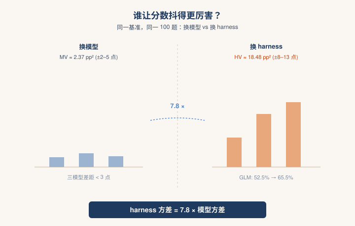
*图示：他们在同一台机器、同一组任务、相同超参下，把'换模型'和'换 harness'分别做一遍，看哪个让分数抖得更厉害。结论是 harness 抖得猛得多，而且不同模型对同一 harness 改动反应不同，所以经常出现'换个 harness 排名就翻'。*

- 技术细节：作者在 SWE-bench Verified 100 题子集上跑 3 个能力相近的前沿模型 (GPT-5.4, Kimi K2.6, GLM-5.1) × 3 个 harness 配置 (H1 极简 / H2 改进 / H3 全量含自检+回滚+漂移检测)。结果：平均 HV=18.48 pp²，MV=2.37 pp²，比值 7.80×；换 harness 单模型分数动 8.5–13 个点，换模型仅动 2.5–5 个点。
- 通俗讲解：他们在同一台机器、同一组任务、相同超参下，把'换模型'和'换 harness'分别做一遍，看哪个让分数抖得更厉害。结论是 harness 抖得猛得多，而且不同模型对同一 harness 改动反应不同，所以经常出现'换个 harness 排名就翻'。
- 例子：GLM-5.1 从 H1 到 H3：52.5% 变成 65.5% (+13.0 点)；而在 H1 这一档，三个模型分别 52.5/55.0/52.0，相差不到 3 点。9 个模型对×harness 对的比较里出现 6 次排名反转。

#### 技术点 4：Harness Card + 方差分解协议
- 快速理解：提出 ETCSOVG 七层披露卡 + 2×2 因子实验，把 harness 变成可报告的实验维度

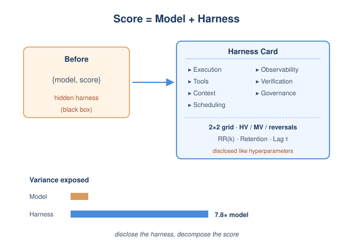
*图示：作者不是要求大家用同一个 harness，而是要求'你用了什么 harness 必须像超参一样写清楚'，并且鼓励做模型×harness 网格实验，把方差拆给读者看。轨迹指标则让你能定位是验证层、上下文层还是工具层在出问题。*

- 技术细节：评测框架包含三件套：(1) Harness Card 按 Execution / Tool / Context / Scheduling / Observability / Verification / Governance 七层强制披露；(2) 至少 2×2 模型×harness 因子设计，报告 HV、MV、HV/MV、排名反转数、partial η²；(3) 轨迹级指标——Recovery Rate RR(k)、Context Retention、Control Lag τ，分别对应稳定性、漂移、控制延迟。
- 通俗讲解：作者不是要求大家用同一个 harness，而是要求'你用了什么 harness 必须像超参一样写清楚'，并且鼓励做模型×harness 网格实验，把方差拆给读者看。轨迹指标则让你能定位是验证层、上下文层还是工具层在出问题。
- 例子：比如某次提交在 H3 上：runtime 用 Docker SWE-bench runner，50 步上限、单步 120s；上下文 32k 配 BM25 top-5 检索；3 次重试+回滚深度 3；含自检与异常检测——这一卡片让别人能复现，也能在 RR(k) 曲线变差时定位到 verification 层。

- **对 Agent 产品/系统的启发：** 选模型之前先把 harness 当一等公民来设计、披露和做对照实验
- **详细启发：** 产品侧：做 Agent 产品时，与其频繁换更贵的模型，不如先优化上下文压缩、工具裁剪、重试与验证回路——论文实验里这能多带来 8.5–13 个点，而换模型只有 2.5–5 个点。Vercel 把工具从 15 个砍到 2 个把成功率从 80% 拉到 100%，是同类信号。；系统侧：评测平台和内部 benchmark 应当强制要求提交方填写 ETCSOVG 七层 Harness Card，并支持锁定 harness 或因子化扫描两种模式；同时把 Recovery Rate、Context Retention、Control Lag 加入 trace 监控，让 regression 能定位到具体一层。；风险：如果继续只比模型分数，会持续把 harness 工程的红利错误归因给模型，导致选型、采购、研究方向决策都偏；同时不同团队 harness 不公开会让复现和审计几乎不可能。

## 三、总结

- 今天的共同信号：Agent 性能边界不在模型，在 harness 与环境治理
- 如果说前几天还在零散讨论 runtime/harness
- 如果说前几天还在零散讨论 runtime/harness，今天则是一次集体定调：Harness Scaling、Harness 披露、CausalFlow 三篇从架构、评测、诊断三个角度同时把脚手架推到一等公民位置。
- Computer-Use 这条线已经形成可验证训练环境 + 鲁棒性 benchmark + 仿真平台的完整栈，CUA 训练范式正在向数学/代码看齐。
- 对从业者而言，今天最值得带走的判断是：再比较 Agent 分数前，先问对方公开了什么 harness、记忆策略和验证层——否则比较就没有意义。
