# 2026-05-27 AI Agent 论文日报

> 分类：cs.AI + cs.CL + cs.LG + cs.MA + cs.RO + cs.SE + cs.HC
> 入选论文：3 篇

## TL;DR（30 秒速览）

- 🎯 **今日定调**：AgingBench、GEM/MemState、MemFail、MemMorph 四篇从评测、抽象、失败模式、攻击面四个角度共同重塑 memory 系统认知…
- 📌 **最值得读**：《Your Agents Are Aging Too: Agent Lifespan Engine…》— 提出 Agent 老化的纵向可靠性评测 AgingBench，区分压缩/干扰/修订/维护四类老化机制并定位到记忆管线…
- 💡 **一句话 takeaway**：记忆与运行时治理是今天的真正主战场，eval 正在变成它们的诊断工具

## 一、初筛每日趋势

- 记忆系统从存储升格为治理对象：老化、失败模式、数据库化抽象同时出现
- Agent 评测全面纵向化：从一锤定音转向 lifespan、轨迹、扰动诊断
- 运行时治理成新前线：能力预算、可控性、记忆中毒攻防同框
- memory 层今天集中爆发：AgingBench 把'老化'拆成四类机制、GEM 把记忆重构为带正确性约束的数据库 workload、MemFail 形式化失败模式，三篇从不同方向指向同一判断——record-level CRUD 已不够支撑长程 Agent。
- Agent 评测方法论继续从'最终成功率'下沉到'诊断与纵向追踪'：AgingBench 的 aging curve、Anchor 的 artifact drift、RepoMirage 的扰动探针、TrajAudit 的轨迹失败归因，共同把 benchmark 推向'能解释为什么错'的阶段。
- 运行时安全治理成新焦点：ChainCaps 用单调能力衰减堵 permission laundering，MemMorph 揭示记忆×工具的新攻击面，Position 论文则把 controllability 立为安全一等目标，runtime 层正在形成攻-防-治理的完整议题。
- general\_agent 仍占 267/505，但真正高分集中在 memory、eval、safety 三类——同质化的 general 框架越来越难拿分，垂直层的硬骨头开始决定上限。

### 跨论文综合观察

- AgingBench、GEM/MemState、MemFail、MemMorph 四篇从评测、抽象、失败模式、攻击面四个角度共同重塑 memory 系统认知：单纯加向量库或图库已不足以承载长程 Agent，记忆需要被当成带正确性条件和治理策略的数据 workload。
- ChainCaps、Position(Controllability)、MemMorph 三篇构成了 runtime 治理的三角：能力如何在工具组合中传播、Agent 如何被中断/覆盖/重定向、记忆如何被恶意污染——共同指向一个新共识，即 Agent 安全要在协议与运行时边界硬约束，而非依赖模型对齐。
- AgingBench、Anchor、RepoMirage、TrajAudit、VitaBench 2.0 在评测方法论上高度同频：都在拒绝'最终成功率'式打分，转而构造可控扰动、纵向曲线、子能力探针来定位失败阶段，eval 正逐步成为 Agent 系统设计的诊断仪表板。

## 二、重点论文精读

### 1. Your Agents Are Aging Too: Agent Lifespan Engineering for Deployed Systems
- **方向：** agent\_eval
- **评分：** 相关性 95 | 价值 92 | 有趣性 90 | 创新性 88 | 开拓性 88
- **arxiv 信息：** `2605.26302` · 作者：Jianing Zhu等 · 类目：cs.AI · 提交：2026-05 · [原文](https://arxiv.org/abs/2605.26302) · [PDF](https://arxiv.org/pdf/2605.26302.pdf)
- **为什么入选：** 首次系统定义 Agent 老化，把长期部署的可靠性衰减拆成四类机制并能定位到记忆管线的具体环节。
- **快速背景：** 当前 Agent 评测都在测 '第一天'，没人系统衡量长期部署后还能不能用。
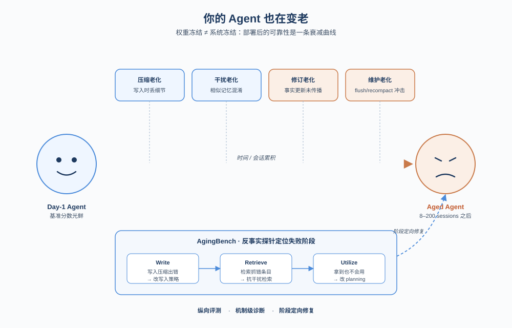
*图示：论文核心机制概念图*

- **详细背景：** 现实中的 Agent 已经从一次性对话变成长期运行的系统，会跨会话记忆、检索、修订事实并经历维护事件。但现有评测大多是 day-one 快照分数，无法回答 '一个部署后的 Agent 还能可靠多久' 这种系统性问题。即使模型权重冻结，记忆压缩、相似条目堆积、事实变更和例行维护都会让有效状态漂移，作者把这种衰减命名为 'agent aging'，并指出它是部署可靠性的核心盲区。
- **详细入选理由：** 这篇论文提出了一个被长期忽视的部署级问题：模型权重不变，Agent 仍会随时间变 '老'。它不仅给出 AgingBench 这一纵向评测基准，还把失效拆成压缩/干扰/修订/维护四类机制，并通过反事实探针定位到写入、检索、利用三个阶段，对要把 Agent 真正长期上线的人极具参考价值。

**核心技术点速览：**

#### 技术点 1：四类老化机制分类
- 快速理解：把 Agent 长期失效拆成压缩、干扰、修订、维护四类，每类对应不同修复方向。

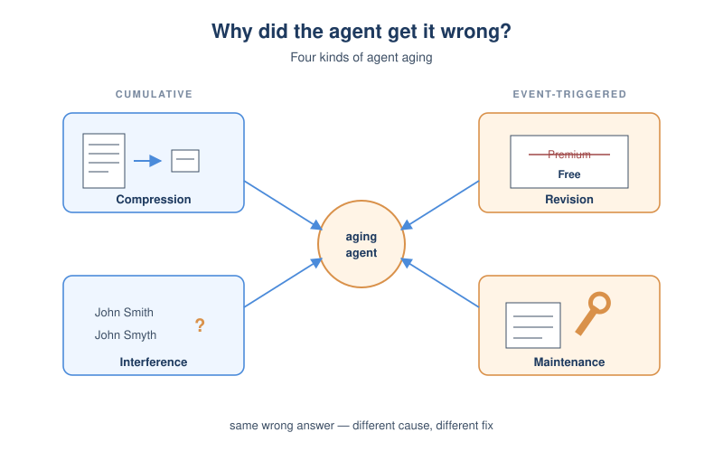
*图示：四类老化机制分类的概念示意*

- 技术细节：论文把 Agent aging 划成四类机制：compression aging（写入压缩时丢细节）、interference aging（相似记忆堆积导致检索混淆）、revision aging（事实更新后没正确传播，特别是衍生状态如累计预算）、maintenance aging（recompaction、flush 等生命周期事件触发回归）。前两类属于累积型，后两类属于事件触发型。
- 通俗讲解：同样是 'Agent 答错了'，原因可能完全不同：可能是当初没记住、可能是记混了别人、可能是没更新、也可能是某次后台维护把记忆搞坏了。论文坚持要把这四种区分开，因为对应的修复手段差别很大，不能一律 '加更多记忆' 解决。
- 例子：用户说 '取消高级会员'，几天后问 '我是高级会员吗？'。如果 Agent 回答 '是'，可能是修订老化（没更新订阅状态）；如果把 John Smith 邮件发到 john.smyth，则是干扰老化；如果只记得 '每天吃药' 而忘了剂量 50mg，则是压缩老化。

#### 技术点 2：时间依赖图与纵向评测
- 快速理解：用带版本链和干扰对的 DAG 程序化生成多会话任务，把老化画成一条曲线而不是单一分数。

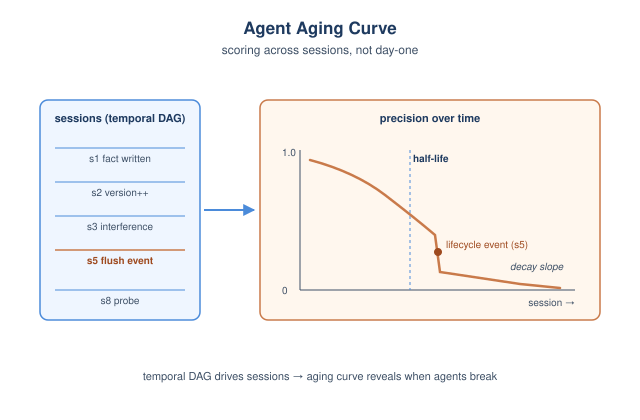
*图示：时间依赖图与纵向评测的概念示意*

- 技术细节：AgingBench 为每个场景配一个程序化生成器，输出一个 temporal dependency DAG，包含 version chains（事实版本继承）、dependency edges（探针依赖多会话前的事实，控制 chain depth）和 interference pairs（跨域可混淆实体）。可以在依赖密度、更新率、链深、干扰对数量等维度做可复现的扫描，并在指定 session 注入 lifecycle event。每个 session 都打分，得到 aging curve，并计算 half-life、decay slope 等统计量。
- 通俗讲解：传统 benchmark 是 '答对没答对' 一锤子买卖，这里是按 session 跑下去画一条衰减曲线，能看出 Agent 在第几次会话开始崩、崩得多快。生成器用种子可控地堆压力，比如刻意安排会让 Agent 困惑的相似客户名，或者在第 5 个 session 触发一次 recompaction 看它会不会突然失忆。
- 例子：在生活助理场景里，生成器先写入 'dining budget 309' 和 'travel budget 450'（构成干扰对），后续每个 session 加几笔消费（形成累加器），并在 session 5 注入一次 history flush。评测在每个 session 都问 '我餐饮还剩多少'，画出 precision 随会话数下降的曲线。

#### 技术点 3：反事实探针定位失败阶段
- 快速理解：用 P1/P2/P3 三档 oracle 替换，把同一个错误归到写入、检索还是利用阶段。

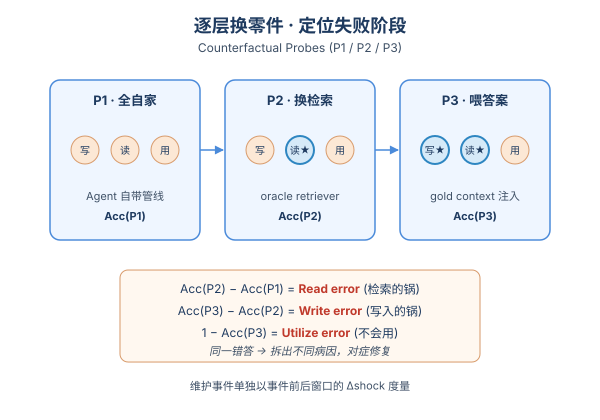
*图示：反事实探针定位失败阶段的概念示意*

- 技术细节：论文把记忆管线拆成 Write、Store、Read、Utilize 四个组件，并设计三档探针：P1 全用 Agent 自己的写/读/用；P2 用 oracle retriever 从 Agent 的记忆库中拿出相关事实；P3 直接把 gold context 注入 prompt。Read error = Acc(P2)−Acc(P1)，Write error = Acc(P3)−Acc(P2)，Utilization error = 1−Acc(P3)。维护事件则通过事件前后窗口的 Δshock 单独度量。
- 通俗讲解：做法像逐层换零件：先看自己跑成什么样，再换上 '完美检索' 看好多少（差值就是检索的锅），再把答案需要的事实直接塞进 prompt 看还错不错（差值是写入的锅，剩下的就是模型不会用）。这样 '同样的错答' 能被区分成不同病因，进而对症修复。
- 例子：实验里 S1 场景中 GPT-4o-mini 的总错误率和 Llama 接近，但拆解后 GPT-4o-mini 几乎全是 Write error（应该改写入侧的 compaction prompt），Llama 则有大量 Read error（应该改检索/抗干扰）。S5 场景里强模型的错误集中在 Utilization，意味着要去改 planning loop 强制重读，而不是再加记忆。

#### 技术点 4：行为合规与事实精度脱钩
- 快速理解：Agent 看起来还在乖乖遵守约束，但事实精度其实早就掉了，常规监控发现不了。

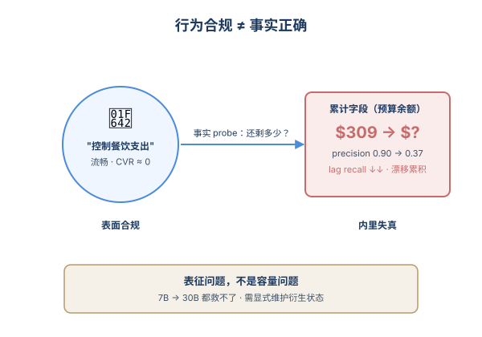
*图示：行为合规与事实精度脱钩的概念示意*

- 技术细节：在 S2 生活助理场景中，constraint violation rate（CVR）几乎一直为 0，但 constraint precision 从 0.90 跌到 0.37，lag recall 同步崩塌。同时 revision 实验显示 accumulator error 与模型规模无明显相关，说明衍生状态的维护是表征问题而非容量问题，单纯换更大模型或更好压缩并不能稳住。
- 通俗讲解：意思是 Agent 仍在很自然地讨论预算和偏好，从行为合规角度完全合格，但具体数字已经错了。靠 '是否违反规则' 这种行为监控完全看不出来，必须主动用事实级 probe 去测；而对于累计型字段（预算、库存这种），还得显式维护或周期性重算，否则越滚越偏。
- 例子：用户开始时说 '餐饮预算 309 美元'，之后每个 session 报一笔消费。Agent 一直能流畅回答 '你在控制餐饮支出哦'，没违反任何约束，但当 probe 直接问 '现在还剩多少' 时，它给出的数字与真实累加值偏离上百美元，且这种偏差在 7B 到 30B 模型间没有明显改善。

- **对 Agent 产品/系统的启发：** 想做长期在线的 Agent，必须把 '部署后还能撑多久' 当成一等评测指标，并能把失败定位到写/读/用哪一环。
- **详细启发：** 产品侧：长期记忆型 Agent 产品（个人助理、企业知识库、Coding Agent）应在上线前跑一个纵向 aging 评测，输出 half-life 和四类机制的失败画像，而不是只报一个 day-one 准确率；UI 上也应避免 '看起来在执行约束' 但事实已漂移的假合规体验。；系统侧：把 Agent 当成有生命周期的系统：在记忆管线里显式区分 Write/Store/Read/Utilize，对每次 recompaction、prompt 变更、模型轮换都加 regression probe；对累计型字段（预算、配额、订阅状态）做显式状态维护或周期性重算，而不是依赖摘要。；风险：维护事件（flush、recompaction、迁移）可能造成突发 -0.5 量级的能力跌落，且行为级监控完全捕捉不到；不同模型/框架的失败位置不同，盲目 '加更多记忆' 可能修错了地方。

### 2. Is Agent Memory a Database? Rethinking Data Foundations for Long-Term AI Agent Memory
- **方向：** memory
- **评分：** 相关性 95 | 价值 90 | 有趣性 88 | 创新性 85 | 开拓性 88
- **arxiv 信息：** `2605.26252` · 作者：Abdelghny Orogat等 · 类目：cs.AI · 提交：2026-05 · [原文](https://arxiv.org/abs/2605.26252) · [PDF](https://arxiv.org/pdf/2605.26252.pdf)
- **为什么入选：** 把 Agent 长期记忆当作新型数据管理 workload，提出可验证的状态级算子。
- **快速背景：** 现有 Agent 记忆都按 CRUD 记录级处理，导致冗余堆积、旧事实不更新、按时间淘汰、检索不改状态。
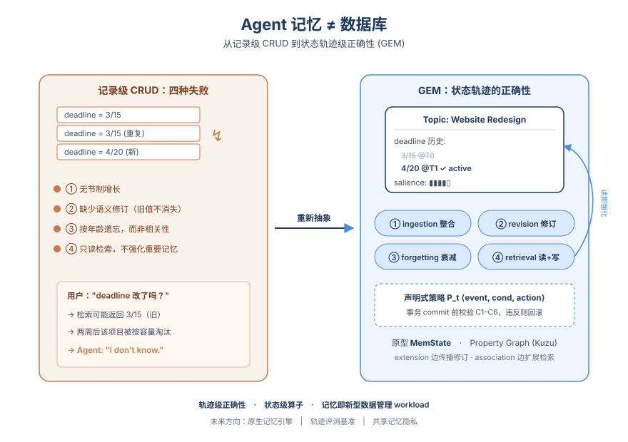
*图示：论文核心机制概念图*

- **详细背景：** 长程 Agent 需要跨会话维护持久记忆，但目前 MemGPT、Mem0、Zep、MIRIX 等系统都把记忆当成存储，沿用关系/向量/图数据库的 CRUD 操作。作者总结出四种典型失败：无节制增长、缺少语义修订、按容量/时间遗忘、只读检索。这些问题不是实现 bug，而是抽象层缺失，因此值得从数据管理 workload 的视角重新定义。
- **详细入选理由：** 这篇论文跳出了 '记忆=向量库或图库' 的惯性思维，直接论证现有 CRUD 范式在结构上无法满足长程 Agent 记忆的正确性需求，并给出形式化抽象 GEM、原型 MemState 和研究路线图。对正在做记忆系统的团队来说，是少见的从数据库视角系统反思 Agent memory 的工作。

**核心技术点速览：**

#### 技术点 1：四种记忆失败模式
- 快速理解：把 Agent 记忆乱象归纳成四个 CRUD 抽象天然解决不了的失败。

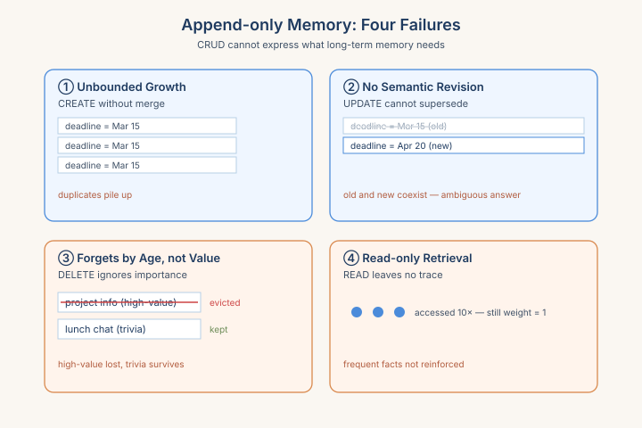
*图示：四种记忆失败模式的概念示意*

- 技术细节：作者用一个三周快照的例子刻画现有 append-only 记忆的四种失败：①无节制增长（重复条目堆积）、②缺少语义修订（旧 deadline 与新 deadline 共存）、③按年龄而非相关性遗忘（高价值条目被淘汰，闲聊条目留下）、④只读检索（频繁访问的事实得不到加权保护）。每种失败对应 CRUD 中一个原语的能力缺口。
- 通俗讲解：想象你给 ChatGPT 重复说了三次项目 deadline，它会把三条都存下来；你后来改了 deadline，旧的还留着；过两周系统因为容量到了把项目信息删了，却保留了你随口聊的午餐偏好。问题不在向量召回好不好，而在于 create/update/delete/read 这四件事根本没法表达 '整合、传播、按重要性保留、读时强化'。
- 例子：Week 1 用户更新 'Deadline 改为 4 月 20 日'，系统把它当新记录追加；Week 2 用户问 deadline，向量检索按相似度可能仍返回旧的 '3 月 15 日'，再过一周项目记录被按年龄淘汰，用户再问只能得到 'I do not know'。

#### 技术点 2：GEM 状态级算子
- 快速理解：用四个状态级算子 + 六条轨迹正确性条件取代 CRUD。

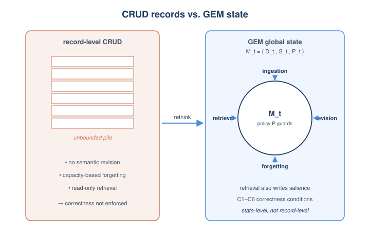
*图示：GEM 状态级算子的概念示意*

- 技术细节：Governed Evolving Memory 把记忆形式化为 M-t=(D-t, S-t, P-t)，分别表示语义单元、结构关系和声明式策略。四个算子 ingestion、revision、forgetting、retrieval 都作用在全局状态上；六条正确性条件 C1–C6 覆盖查询健全性、转移合规、依赖一致性、溯源保留、有界活跃状态、检索引发的显著度更新。作者给出三条结构性论断，说明任何 record-level CRUD 引擎在结构上都满足不了这些条件。
- 通俗讲解：和 CRUD 不同，GEM 关心的是 '记忆这条时间线整体是否正确'，而不是某条记录对不对。摄入要整合而不是堆积，修订要沿依赖传播，遗忘要按相关性分级衰减，检索本身要顺手把被读到的内容标记为更重要。每次状态转移都要先过策略检查，违反就回滚。
- 例子：用户更新项目 deadline 时，ingestion 把新值附加到 Website Redesign 这个语义单元的 deadline 字段历史里，旧值保留作为溯源；revision 沿 extension 边触发对相关里程碑话题的重新评估；之后用户每次查询 deadline，retrieval 在返回 4 月 20 日的同时给该字段的 salience +1，从而让它不容易被遗忘算子衰减。

#### 技术点 3：MemState 属性图原型
- 快速理解：在 Kuzu 上用 topic 图 + 字段历史 + 声明式策略落地 GEM。

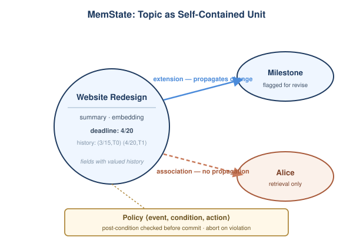
*图示：MemState 属性图原型的概念示意*

- 技术细节：MemState 用嵌入式属性图引擎 Kuzu 实现 GEM：每个 topic 是自包含语义单元，包含标题、摘要、embedding 和带值历史的字段；S-t 区分 extension 边（蕴含传播）和 association 边（仅检索扩展）；P-t 用 ⟨event, condition, action⟩ 声明式策略，在事务 commit 前对拟定 M-(t+1) 做后置条件校验，违反则中止。算法 1 把 ingest/revise/forget/retrieve 统一成一个事务模板，retrieval 分支里显式做 salience 自增以满足 C6。
- 通俗讲解：作者没有发明新引擎，而是用图数据库拼出一个能跑的 GEM。话题作为基本单元让相关字段聚在一起，避免实体级图（比如 Zep）查一个概念要到处跳；extension 边明确表达 '改这个会牵连那个'，所以 revision 只沿这种边传播；策略写成规则，事务提交时统一检查。
- 例子：对 Website Redesign 这个 topic，deadline 字段维护历史 （(3/15, T0), (4/20, T1)）；策略 propagate-on-change 触发后，flag-for-revision 把依赖的里程碑 topic 标记重审；当 Alice 在大量交互中被反复提及时，revision 把她从 Website Redesign 的子集中拆成独立 topic。

#### 技术点 4：三条研究议程
- 快速理解：需要原生引擎、轨迹级评测以及多租户下的隐私遗忘。

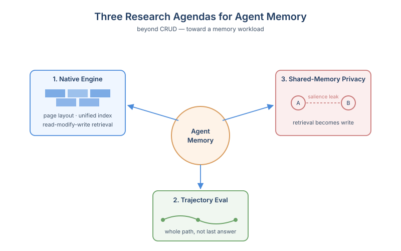
*图示：三条研究议程的概念示意*

- 技术细节：作者提出三个方向：(1) 原生记忆引擎，需要 topic+字段历史+embedding 的 I/O 友好页布局、跨语义/时间/结构的统一索引、把 retrieval 变成读改写一体的算子；(2) 轨迹级正确性与评测，现有 LongMemEval、LoCoMo 等只测 C1，需要构造同时覆盖 C2/C3/C5 的基准与声明式冲突解决语言，以及在轨迹约束下学习的 RL 控制器；(3) 共享记忆下的隐私问题，C6 让检索成为写操作，会在租户间通过 salience 形成信息泄漏路径，且 C4 溯源使 GDPR 式擦除比关系删除更难。
- 通俗讲解：GEM 在通用图库上能跑但不优雅，要真正成为一种 workload，就需要数据库内核级支持，类似 ACID 之于事务、event-time 之于流处理。同时评测得换思路，看的是整条记忆轨迹是否健康，而不只是最后一题答得对不对；多租户场景里还得防住 'A 的查询把某条记忆顶上去，B 后来就搜到了' 这种新泄漏。
- 例子：作者建议的首批目标包括：500 轮对抗工作负载上对 Mem0、Zep、MemState 做答案级与轨迹级双指标评测；在 LongMemEval、LoCoMo 上跑策略语言原型；以及测量两个租户共享 MemState 时的信息泄漏率，并设计带界化 salience 副作用的检索算子。

- **对 Agent 产品/系统的启发：** 做 Agent 记忆要从 '存什么' 转到 '状态如何演化'，并把检索当写操作设计。
- **详细启发：** 产品侧：对做长程对话助手、Coding Agent 的产品来说，仅靠加大上下文或换更强的向量库治不了 '记忆错乱'，需要在产品层设计语义单元、字段历史和遗忘策略，让用户感知到的事实是会被整合、修订并按重要性保留的。；系统侧：工程上可借鉴 MemState：选一个支持事务的图/文档存储，把记忆建模成带字段历史的 topic，区分 '蕴含' 与 '关联' 两类边，用声明式策略在 commit 时做后置校验；retrieval 路径里显式记录访问以更新显著度，而不是纯只读召回。；风险：把 retrieval 做成写操作会引入并发一致性成本，并在多租户共享记忆时通过 salience 造成跨租户泄漏；同时溯源保留会让真正的 '被遗忘权' 难以实现，需要专门的擦除算子。

### 3. ChainCaps: Composition-Safe Tool-Using Agents via Monotonic Capability Attenuation
- **方向：** agent\_safety
- **评分：** 相关性 95 | 价值 85 | 有趣性 80 | 创新性 80 | 开拓性 80
- **arxiv 信息：** `2605.26542` · 作者：Xiaochong Jiang等 · 类目：cs.AI · 提交：2026-05 · [原文](https://arxiv.org/abs/2605.26542) · [PDF](https://arxiv.org/pdf/2605.26542.pdf)
- **为什么入选：** 用一条简单不变式堵住工具组合中的'权限洗白'，部署即用
- **快速背景：** 工具单点鉴权过不了组合关，Agent链式调用会出现'权限洗白'
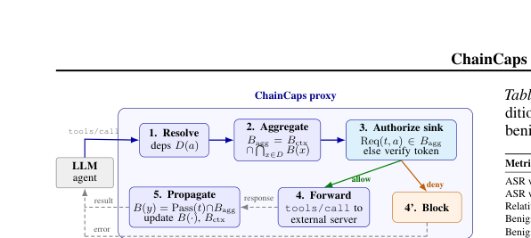
*图示：Figure 2 是 ChainCaps 代理架构图，清…*

- **详细背景：** 工具型Agent在运行时会把文件、Web API、代码解释器、企业服务任意拼接，每个调用单独看都被授权，但整条链可能造成把机密文档摘要后发到外网这类越权效果，论文称之为permission laundering。已有的标量信息流标签(Fides)、按函数隔离(PFI)、提示注入检测等方案都没有直接对'链路上权限如何传播'下硬约束。ChainFuzzer的实证显示20个真实Agent应用中19个存在多工具漏洞，说明这是个迫切的部署问题。
- **详细入选理由：** 这篇论文给MCP生态提了一个非常实用的运行时安全机制：每个值都带一个'还能流向哪些Sink'的预算，工具组合时只能取交集，不能扩张权限。它直接命中了当前Agent部署里普遍存在的'每个工具单看都合规、链起来就越权'的盲区，且以透明代理形式不需要改模型或工具，落地路径清晰。

**核心技术点速览：**

#### 技术点 1：Sink预算+交集传播
- 快速理解：每个值带'还能去哪些Sink'的预算，组合时只能取交集

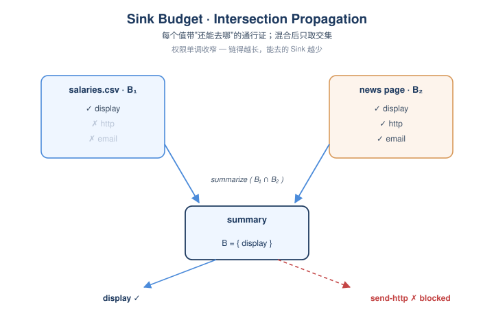
*图示：Sink预算+交集传播的概念示意*

- 技术细节：每个值v携带一个降闭的Sink权限集合B(v)，权限以(操作, 作用域)二元组表示，作用域用前缀/路径包含关系排序。当工具t消费x1...xk产出y时，B(y)=Pass(t)∩B(x1)∩...∩B(xk)；调用Sink前必须满足Req(t,a)在所有贡献值预算的交集中，否则阻断或要求一次性签名的declassification token。
- 通俗讲解：可以把每个数据想成一张通行证，上面写着'我还能进入哪几扇门'。把两份数据混在一起做摘要时，新数据继承的是双方通行证的最小公共部分——只能进两边都允许的门。这样无论Agent怎么绕路、转格式、再摘要，权限只会越来越窄，绝不会因为'换了个工具'就突然多出新权限。
- 例子：读salaries.csv得到B1=(display)，fetch新闻页B2=(display, http, email)，summarize后输出预算=B1∩B2=(display)。Agent接着想send-http外发摘要时，因为预算里没有http，被代理直接拦下；但显示给用户仍然允许。

#### 技术点 2：透明MCP代理实现
- 快速理解：约1200行Python代理夹在Agent和MCP工具之间，零改动落地

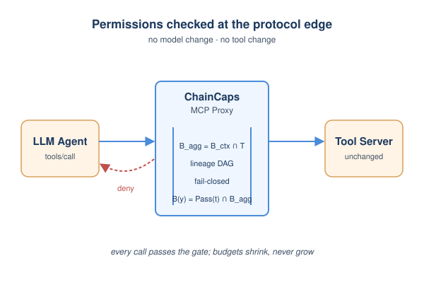
*图示：透明MCP代理实现的概念示意*

- 技术细节：ChainCaps实现为MCP协议层代理，维护值ID到预算的映射、在线数据流DAG做血缘恢复，以及一个context预算Bctx来兜底模型上下文里隐式携带的权限。声明式manifest给出source初始预算、Exec(t)、Pass(t)；declassification使用HMAC-SHA256签名的一次性token绑定具体Sink请求和血缘；未知Sink采用关键词启发式fail-closed。
- 通俗讲解：它不改模型也不改工具服务器，所有tools/call走代理。一次调用进来时，代理先查参数依赖了哪些值、把它们的预算取交集，再校验本次Sink请求是否在交集中，通过就转发并在响应路径上更新输出值的预算。换句话说，它把'权限传播'这件事从模型脑子里搬到了协议边界上，落地像加一层网关。
- 例子：Agent发起send-email(tools/call)，代理第一步解析参数依赖到的中间值D(a)，第二步聚合Bagg=Bctx∩交集，第三步若Req=email不属于Bagg且无合法token，则在转发前直接返回deny；若允许则转发并在响应里写回B(y)=Pass(t)∩Bagg。

#### 技术点 3：Manifest质量是部署瓶颈
- 快速理解：算法没问题，真正卡部署的是工具描述写得对不对

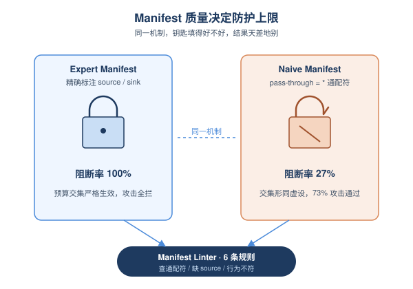
*图示：Manifest质量是部署瓶颈的概念示意*

- 技术细节：在5个前沿模型、82个任务的实测里ASR从25–68%降到0–4.8%，良性完成率96–100%；replay对比中显著强于scalar-IFC和PFI模拟基线。但manifest质量决定上限：专家manifest阻断率100%，checklist指导90.9%，朴素自动生成只有27.3%阻断、50%良性完成。代理本身延迟仅0.13ms中位数。
- 通俗讲解：机制再漂亮，也得有人正确填写每个工具的source/sink角色和pass-through预算。论文给了manifest linter六条规则去查通配符、缺source、声明与实际行为不符等常见错误。残余失败集中在execution laundering、indirect injection和shell管道泄漏，都是代理在应用层看不到的地方——比如先写脚本再执行就绕过了。
- 例子：在expert manifest下read-file(salaries.csv)被正确标注为source且初始预算不含http，summarize声明Pass只保留display，于是攻击全数被拦；但naive manifest里summarize默认pass-through=\*，预算交集失效，攻击通过率回升到73%。

#### 技术点 4：非放大定理
- 快速理解：形式化证明：组合不可能凭空造出源头本就没有的权限

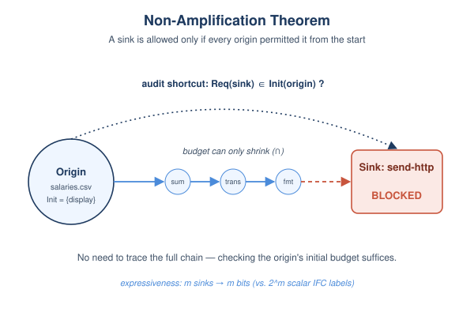
*图示：非放大定理的概念示意*

- 技术细节：Theorem 3.1：若Sink调用(t,a)在无declassification的情况下被允许，则对所有传递性贡献到参数的源origin o，Req(t,a)属于Init(o)。证明依赖meet-rule单调收敛和context预算的保守narrowing。论文还给了一个表达力下界：标量标签IFC要区分m个独立Sink子集需2 m个标签，而Sink预算只需m位。
- 通俗讲解：这条定理保证了'监管闭环'：只要manifest正确、调用都过代理，那么任何被放行的Sink，它接触到的每一个原始数据源在最初就被允许去这个Sink。这给运维一个非常硬的合规承诺——不需要审计完整调用链，只需检查源头初始预算和Sink要求即可。
- 例子：若salaries.csv的Init=(display)，则无论Agent经过多少步summarize/translate/format，最终对send-http的调用都不可能被允许，因为传递回去看源头压根就不含http权限。

- **对 Agent 产品/系统的启发：** 给MCP工具补一层'数据权限只缩不扩'的代理网关，是当下最务实的Agent安全护栏
- **详细启发：** 产品侧：对做Agent平台或MCP生态的产品，可以把ChainCaps这种代理作为默认安全层下放给企业用户，并把manifest编辑器、linter、CI测试做成产品化能力，因为部署效果几乎完全取决于工具描述的质量。；系统侧：在系统架构上，应该把权限传播从模型推理或工具内部上移到协议边界统一处理，配合在线数据流DAG和context预算做保守追踪；对未知Sink采用fail-closed策略，对受信场景用一次性签名token开declassification口子。；风险：该机制只对'代理可见的显式数据流'有效，对脚本间接执行、shell管道、模型隐藏状态泄漏、被攻陷的工具服务器或写错的manifest都不防。需要和OS级隔离、网络层监控、提示注入检测等组合做纵深防御。

## 三、总结

- 记忆与运行时治理是今天的真正主战场，eval 正在变成它们的诊断工具
- 今天 505 篇里真正有突破的不在 general\_agent 的繁荣赛道
- 今天 505 篇里真正有突破的不在 general\_agent 的繁荣赛道，而在 memory、eval、safety 三个垂直层。多篇论文不约而同把'部署后的 Agent 能否长期可靠运行'作为核心问题，从老化机制、记忆抽象、能力传播、可控性等不同切口给出系统级答案。评测也随之从一次性分数转向纵向、扰动、轨迹诊断——这意味着 Agent 研究正在进入'运维与治理'阶段，不再只是'让它能跑起来'。
