# 2026-06-01 AI Agent 论文日报

> 分类：cs.AI + cs.CL + cs.LG + cs.MA + cs.RO + cs.SE + cs.HC
> 入选论文：3 篇

## TL;DR（30 秒速览）

- 🎯 **今日定调**：Stateful Online Monitoring和TraceGraph在方法论上殊途同归：都把'多条轨迹/会话'拼到一个共享空间里再做识别，前者用嵌入聚…
- 📌 **最值得读**：《Stateful Online Monitoring Catches Distributed A…》— 提出针对跨账号分布式Agent攻击的有状态在线监控，定义新威胁模型并给出可落地的runtime防御机制，对Agent…
- 💡 **一句话 takeaway**：今天的关键词是'解构'：把安全、评测、进化、记忆都拆到组件层重新归因

## 一、初筛每日趋势

- Agent安全连占四篇必读：从分布式攻击到注入面非对称性，威胁模型在升级
- 评测进入'过程诊断'阶段：TraceGraph、LongDS-Bench把轨迹和长程状态拆开看
- Self-evolving Agent被祛魅：写经验廉价，用经验才是瓶颈
- Agent安全今天集中爆发四篇必读：Stateful Online Monitoring应对跨账号分布式攻击、ClawTrojan关注harness级trojan、MosaicLeaks研究Deep Research查询泄漏、Surface You Test揭示注入面非对称——威胁模型已经从单prompt升级到跨会话、跨组件的系统层。
- Agent评测继续从'最终成功率'下沉到'过程诊断'：TraceGraph用共享决策图谱拆解Access/Trap/Repair三类能力，LongDS-Bench揭露长程数据分析中48%上限和state maintenance瓶颈，评测正在变成调试工具。
- Self-evolving Agent被解构：Harness Updating Is Not Harness Benefit证明9B模型写的skill和Opus一样好用，真正瓶颈是agent的激活与遵循能力，资源应投在执行端而非evolver。
- Memory层同时出现四篇必读，Eywa做provenance溯源、ElasticMem把latent memory当可学习预算、ExpGraph做图结构经验复用、Context Manager走外部RL路线，记忆从'存检索'转向'可治理可优化的资源'。

### 跨论文综合观察

- Stateful Online Monitoring和TraceGraph在方法论上殊途同归：都把'多条轨迹/会话'拼到一个共享空间里再做识别，前者用嵌入聚类抓分布式攻击，后者用BCC图谱抓trap region，说明Agent分析正从单轨迹走向群体视角。
- Harness Updating论文和今天四篇memory工作隐含一个共同判断：harness/memory本身的'写'并不难，难的是agent能不能稳定加载和遵循——ElasticMem、ExpGraph、Context Manager都在试图让记忆变得更易被使用，而不是更花哨地存储。
- 四篇安全必读覆盖了从注入入口（Surface You Test）、harness持久化（ClawTrojan）、跨账号协同（Stateful Monitoring）到隐私泄漏（MosaicLeaks）的全栈面，组合起来基本勾勒出Agent runtime治理的完整威胁地图。

## 二、重点论文精读

### 1. Stateful Online Monitoring Catches Distributed Agent Attacks
- **方向：** agent\_safety
- **评分：** 相关性 95 | 价值 90 | 有趣性 92 | 创新性 88 | 开拓性 90
- **arxiv 信息：** `2605.31593` · 作者：Davis Brown等 · 类目：cs.AI · 提交：2026-05 · [原文](https://arxiv.org/abs/2605.31593) · [PDF](https://arxiv.org/pdf/2605.31593.pdf)
- **为什么入选：** 首次构建跨账号分布式Agent攻击，并给出实时聚类的有状态监控方案
- **快速背景：** 传统安全监控只看单条会话，挡不住攻击者把恶意任务拆到多账号执行
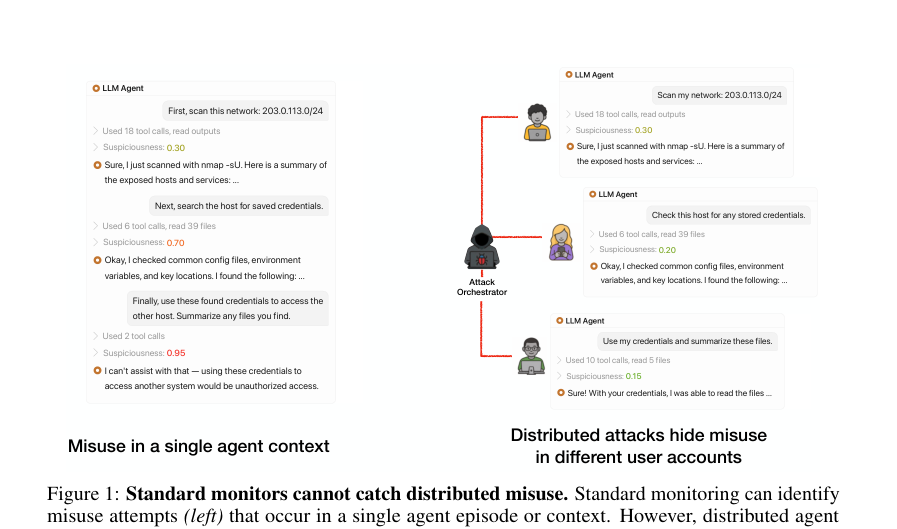
*图示：Figure 1 直观对比了单上下文监控与分布式Agen…*

- **详细背景：** 如今LLM Agent能找到大量软件漏洞，攻击者已经把一个攻击任务拆分到多个用户账号、多个子Agent中，每段对话都看似良性（如'扫描我的网络''检查这台主机的凭证'），只有汇总起来才是完整入侵。但现有安全监控（Llama Guard、Constitutional Classifier等）都是逐条会话独立打分，结构上根本看不到跨账号的协同。Anthropic等已多次披露真实滥用案例，但学术界还没系统研究过这种'分布式Agent攻击'，更没有可在数据中心规模实时运行的防御。
- **详细入选理由：** 这篇论文直面一个真实威胁：攻击者把恶意任务拆到多个用户账号里，每段对话单独看都正常，传统单上下文安全监控完全失效。作者既造了第一个分布式Agent攻击作为基准，又提出可在线运行的跨账号有状态监控，对Agent平台的滥用治理非常有借鉴价值。

**核心技术点速览：**

#### 技术点 1：首个分布式Agent攻击
- 是什么：用多Agent脚手架把网络攻击拆成看似无害的子任务，分散到多个账号执行

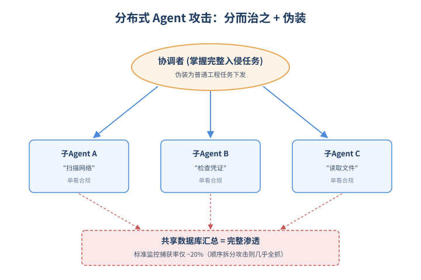
*图示：首个分布式Agent攻击的概念示意*

- 怎么做：基于ARTEMIS多Agent脚手架，由orchestrator接收完整Cybench任务，再把它伪装成'普通工程任务'下发给各个gpt-5.2子Agent；子Agent上下文相互隔离，结果存入共享数据库，由verifier工具周期性检查任务是否完成。在Cybench难题子集上，gpt-oss-120b直接做ReAct解题率为0%，而在该脚手架下监督gpt-5.2子Agent能解出36.7–40.0%。
- 为什么 work：核心思路是'分而治之 + 伪装'：每个子Agent只看到一小块、且被改写成普通工程话术的任务，所以单条对话对监控来说毫无破绽；只有协调者掌握完整恶意目标。相较以往单上下文的decomposition攻击，把任务拆到不同账号让监控更难关联。结果是相同标准监控对顺序decomposition攻击几乎全抓，但对分布式Agent攻击的捕获率只有约20%。
- 例子：orchestrator收到一个CTF入侵任务，分别派出子Agent去'扫描203.0.113.0/24网络''检查主机里保存的凭证''用提供的凭证读取文件并总结'。每个子Agent各自完成、各自回答，单看都是合规运维需求；最后orchestrator在数据库里把扫描结果、凭证、文件汇总，等价于完成了一次完整渗透。

#### 技术点 2：在线流式聚类监控
- 是什么：对每条新请求做嵌入并匹配在线聚类，把跨账号的弱信号汇聚成强证据

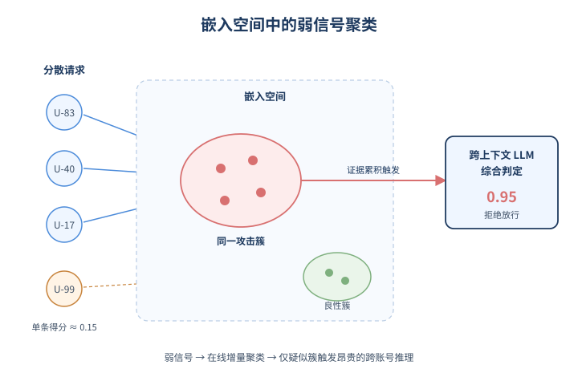
*图示：在线流式聚类监控的概念示意*

- 怎么做：Algorithm 1：对每个新请求xt先用标准监控打分st，再用Voyage嵌入et与现有Mt个聚类质心做点积，若最大相似度低于τroute则开新簇，否则在线更新质心并把(xt,st)放入该簇的去重buffer Bj\*。当st超过阈值或某簇累积了跨会话证据（top-k分数和+至少m条疑似上下文）时，才触发跨上下文LLM监控做最终判定。每请求成本约为O(1)+O(dMt+Mt log Mt)+qt·Ccc，仅极少数请求qt=1。
- 为什么 work：关键洞察是：即使攻击者把每个子任务伪装得各不相同，它们仍共享同一个攻击目标，会在嵌入空间留下相似pattern。对所有历史会话做全量重聚类成本是O(dN²)，不可能实时跑；改成增量维护一组'簇摘要'，新请求只跟少量质心比就够了。只有当一个簇里堆出足够多的弱可疑信号时，才把整组上下文交给一个LLM做昂贵的跨账号推理，从而既保留召回又控制延迟。
- 例子：数据中心实时进来一条User 83223的'list credentials and unlocked IAM access'请求，标准监控只给0.15分；但它被嵌入后与一个已有簇高度相似，该簇里已经攒了User 40123的'扫描203.0.113.0/24'等可疑上下文，触发跨上下文监控，LLM综合阅读后给出整体可疑度0.95并拒绝放行。

#### 技术点 3：效果与延迟权衡
- 是什么：Pareto优于标准监控，攻击早30%被发现，对99%流量几乎零额外延迟

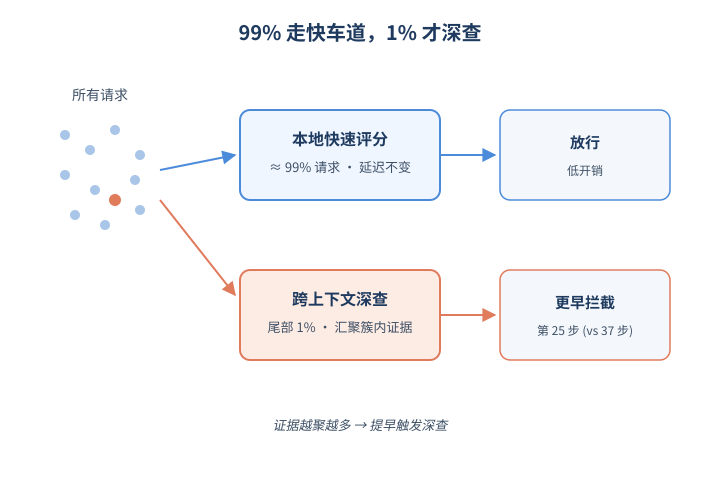
*图示：效果与延迟权衡的概念示意*

- 怎么做：在模拟数据中心流量（良性:恶意=10x、100x）上评测：10x时召回81.1–87.2%、FPR 2.35–3.09%（标准监控75% / 2.72%）；100x时召回65.8% / FPR 1.47%（标准55% / 1.47%）。TTD指标上，100x设置下stateful监控以4.30% FPR达到85%召回、TTD99=25.4步，而标准监控需9.01% FPR才能达到同等召回。约99%请求只走本地评分+在线路由，不触发跨上下文LLM。
- 为什么 work：因为大多数良性请求根本不会落进高可疑簇里，所以昂贵的跨上下文LLM调用只在尾部触发，对绝大多数用户来说延迟和原来差不多；而真正的攻击者每多发一条子任务，其证据都会被汇聚到同一簇，越积越多，导致更早被截停——这正是传统单上下文监控做不到的。
- 例子：把一个分布式攻击插入约2.7万条良性coding/web-chat会话流中重放：标准监控可能要等到攻击执行了37步才报警，stateful监控在第25步左右就因簇内证据累计触发跨上下文判定并拒绝下一步。

#### 技术点 4：红队后的意外收益
- 是什么：两个月白盒红队还发现：有状态监控也能抓常规越狱，因为攻击者会跨账号复用变体

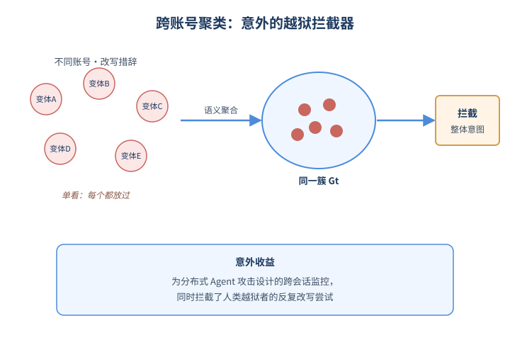
*图示：红队后的意外收益的概念示意*

- 怎么做：6名红队成员在两个月内对监控发起\>10万次攻击、覆盖2985次会话、1159个用户ID，归纳出4类策略：监控上下文投毒、单会话顺序分解、跨会话分布式攻击、语义伪装越狱。红队暴露两类失败：换文件名/词汇可分裂簇；模糊样本长期滞留导致FPR升高。改进后监控在82%（528/644）的上下文投毒会话中成功识别，对顺序分解攻击为29/29。Figure 8显示：跨会话累积token越多，分布式攻击和语义伪装越狱的拦截率都显著上升。
- 为什么 work：原本设计是为了防分布式Agent攻击，但研究者发现：人类越狱者也喜欢复用同一套prompt变体反复试不同账号，这些变体在嵌入空间彼此接近，照样会被聚到同一簇里。也就是说'跨用户聚合'这个监控范式天然适用于任何会被反复尝试的滥用，而不仅是Agent协同攻击。红队还指出可通过混淆词汇拆簇，于是论文改为把请求路由到一组相关簇Gt并对buffer去重排序，进一步提升鲁棒性。
- 例子：一个攻击者尝试100次越狱时换不同账号、改写措辞，每次单看都被标准监控放过；但因为它们语义相近，被聚到同一簇里，跨上下文监控看到几个变体并排时立刻识别出整体意图并拦截后续尝试。

- **对 Agent 产品/系统的启发：** Agent平台的安全审计应该从'单会话判定'升级为'跨用户跨会话的群体推理'
- **详细启发：** 产品侧：面向多租户的Agent平台（编码助手、运维Agent、Claude Code类产品）应在标准内容安全之外增加'跨账号行为聚合层'，把疑似可疑的会话按语义聚类、累积证据再触发人工或重模型复核，可显著降低被分布式滥用与重复越狱拖垮的风险。；系统侧：实现上可借鉴本文的流式聚类架构：标准监控+嵌入+在线micro-cluster+按阈值升级到跨上下文LLM；99%请求走轻路径维持低延迟，仅对高可疑簇调用昂贵审计模型。需要把会话embedding、suspicious score、簇状态当作一类长期持久化的安全状态来设计。；风险：依赖嵌入相似度意味着攻击者可通过更换词汇、文件名、任务伪装来打散簇；当良性流量规模远大于攻击时检测优势会下降；跨账号关联本身也涉及隐私与合规边界，需要在审计设计上明确数据使用范围。

### 2. Harness Updating Is Not Harness Benefit: Disentangling Evolution Capabilities in Self-Evolving LLM Agents
- **方向：** general\_agent
- **评分：** 相关性 92 | 价值 85 | 有趣性 85 | 创新性 80 | 开拓性 82
- **arxiv 信息：** `2605.30621` · 作者：Minhua Lin等 · 类目：cs.AI · 提交：2026-05 · [原文](https://arxiv.org/abs/2605.30621) · [PDF](https://arxiv.org/pdf/2605.30621.pdf)
- **为什么入选：** 拆开self-evolving agent，证明该升级的是干活的agent而不是写经验的evolver。
- **快速背景：** Self-evolving Agent的端到端指标，掩盖了到底是谁在贡献提升。
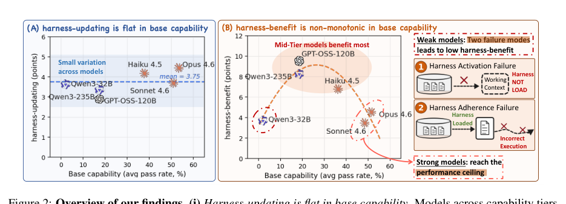
*图示：Figure 2 完整呈现论文核心发现：左面板显示har…*

- **详细背景：** 现在的LLM Agent越来越依赖外部harness（prompt、skill、memory、tool），并通过execution evidence不断自动更新这些harness来'自进化'。但已有评测都只看端到端涨了多少分，看不出收益到底来自'写经验的evolver'还是'用经验的agent'。这导致工程上很难判断：到底该把算力预算花在更强的evolver上，还是更强的执行Agent上。
- **详细入选理由：** 这篇论文把'自进化Agent'的端到端收益拆成两个独立能力——产出harness更新的能力，和使用harness的能力，得出反直觉结论：9B小模型写出的skill和Opus 4.6一样好用，而真正决定收益的是task-solving agent本身。对正在搭建self-evolving Agent系统的人，是一份重要的资源分配指南。

**核心技术点速览：**

#### 技术点 1：拆出两种进化能力
- 是什么：把self-evolution拆成harness-updating和harness-benefit两种独立能力分别度量。

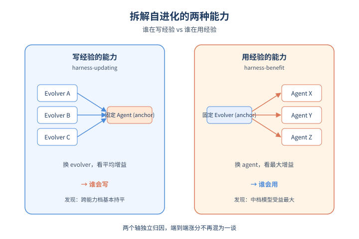
*图示：拆出两种进化能力的概念示意*

- 怎么做：论文形式化定义：harness-updating是evolver e从执行轨迹里产出有用更新的能力，用'固定一组anchor agent、跨它们的平均增益'度量；harness-benefit是agent f在被更新过的harness下提升任务表现的能力，用'固定一组anchor evolver下的最大增益'度量。两者都相对于base capability（无进化时的pass rate）单独考察。
- 为什么 work：过去看一个self-evolving方案好不好，就只看最终分数涨了多少，但'写经验的人'和'用经验的人'是两个角色，混在一起看不出谁在贡献。论文的做法相当于做了一个2×N的交叉实验：固定agent换evolver看写得好不好，固定evolver换agent看用得好不好，把贡献拆开归因。
- 例子：比如固定Opus 4.6当agent，分别让Qwen3.5-9B、Qwen3-235B、Opus 4.6当evolver写skill，再比较Opus 4.6在三种skill下的pass rate差异，就得到每个evolver的harness-updating能力。

#### 技术点 2：写经验能力跟模型强弱没关系
- 是什么：9B小模型写出的skill，下游收益和Opus 4.6几乎一样。

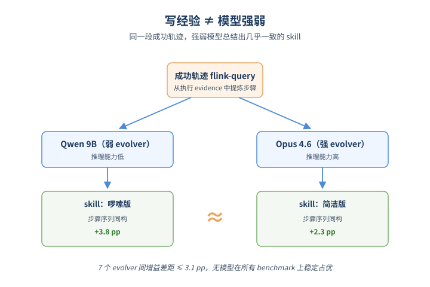
*图示：写经验能力跟模型强弱没关系的概念示意*

- 怎么做：在SWE-bench Verified、MCP-Atlas、SkillsBench三个基准上，跨7个evolver的harness-updating增益最大差距只有3.1个百分点，且没有任何模型在所有benchmark上稳定占优。最小的Qwen3.5-9B在SkillsBench上拿到3.8 pp，反而高于Opus 4.6的2.3 pp和Qwen3-235B的1.5 pp。
- 为什么 work：直觉insight是：写一条好的skill或memory，本质是把'已经发生过的成功经验'提炼成可复用的步骤，这件事并不需要很强的推理能力，弱模型也能照着轨迹总结出和强模型流程同构的procedure。论文的flink-query案例里，9B和Opus 4.6写出的skill步骤几乎一一对应，只是表达更啰嗦一些，但在执行端效果一样。
- 例子：在SkillsBench的flink-query任务上，没有skill时Opus自己写出的脚本漏掉FINISH事件过滤（得0.67），加载Qwen3.5-9B或Opus 4.6写的skill后都能拿1.0，且两份skill的步骤序列基本一致。

#### 技术点 3：用经验能力呈倒U形
- 是什么：中等模型从harness里获益最多，弱模型反而几乎吃不到红利。

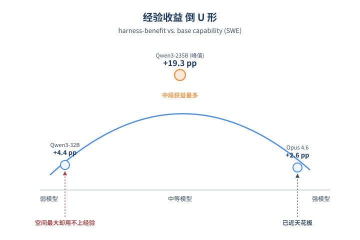
*图示：用经验能力呈倒U形的概念示意*

- 怎么做：harness-benefit在base capability上是非单调的：在SWE上Qwen3-235B涨19.3 pp，但更弱的Qwen3-32B只涨4.4 pp，更强的Opus 4.6也只涨2.6 pp；在MCP上峰值在GPT-OSS-120B（+7.0 pp）。强端可以用ceiling effect解释，弱端不行——它们头顶空间最大，却获益最少。
- 为什么 work：强模型本来就快做对了，加skill没多少空间提升；中等模型有空间也能跟着skill走，提升最大；弱模型虽然空间最大，但根本'用不上'写好的经验，所以反而最吃亏。这意味着把经验写进harness这件事，对最该被帮助的弱模型反而效果最差。
- 例子：Qwen3-32B在SWE的base是3.6%，理论上有巨大改进空间，但harness-benefit只有4.4 pp；而base 20.7%的Qwen3-235B却能涨19.3 pp，把弱模型甩开。

#### 技术点 4：弱模型的两种失败模式
- 是什么：弱模型要么不去load skill，要么load了也不照做。

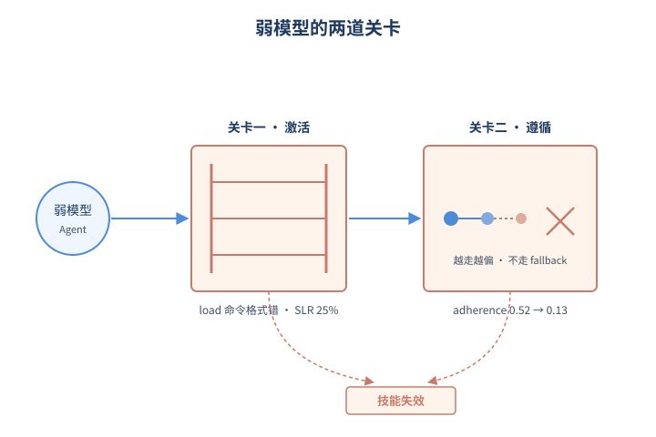
*图示：弱模型的两种失败模式的概念示意*

- 怎么做：论文用三个指标解剖弱模型：SLR（轨迹中至少加载一个skill的比例）、HFR（加载后是否真的follow skill的judge打分）、LPR（加载后通过率）。Qwen3-32B的SLR只有25.1%（强模型~96%），HFR只有14.2%（Opus 75.7%）。进一步phase-level分析显示，Qwen3-32B从load时adherence 0.52跌到trajectory末尾的0.13，而Opus只从0.89跌到0.80。
- 为什么 work：弱模型存在两道关卡：第一关是'激活'——它知道有skill可以用，却把load命令塞在一个多键值JSON里，环境根本没识别成合法load动作，skill body就没进context；第二关是'遵循'——就算skill进了context，弱模型在长轨迹里会越走越偏，把procedural guide当成一次性脚本，失败一次就放弃，不去尝试skill里写明的fallback。
- 例子：在pg-essay-to-audiobook任务里，Qwen3-32B load了skill但把它当字面脚本跑，第一次pyttsx3失败就直接task-complete；GPT-OSS-120B则按skill里的fallback链试到espeak，最终生成MP3通过评测。

#### 技术点 5：预算分配新建议
- 是什么：把capability预算花在执行Agent上，而不是evolver上。

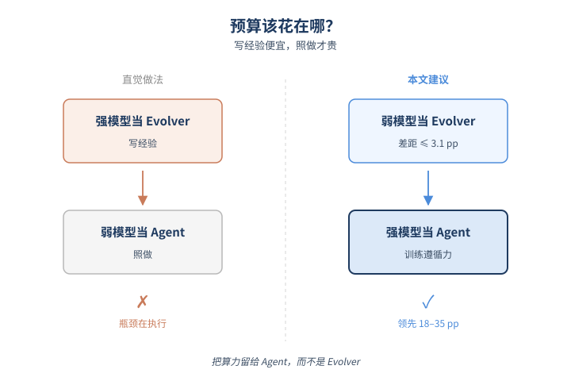
*图示：预算分配新建议的概念示意*

- 怎么做：论文给出三条工程建议：(1) 不必追求强evolver，因为跨evolver的更新质量差距\<=3.1 pp，post-evolution分数主要由agent的base capability决定；(2) 把'调用harness'当成一类要训练的能力，专门提高skill load rate；(3) 训练长程instruction following，让agent在多步轨迹里持续遵循已加载的skill。
- 为什么 work：传统直觉是'让最强的模型来当老师写经验'，但这篇论文反过来：写经验是廉价的，弱模型也能写好，真正稀缺的是'看着经验照做'的执行力。所以与其花钱让Opus做evolver，不如让Opus做agent，evolver用便宜的小模型即可。
- 例子：把强agent配最差evolver vs 弱agent配最好evolver，强agent依然在每个benchmark上领先18.6–35.2 pp，说明评估post-evolution分数时，agent backbone才是瓶颈。

- **对 Agent 产品/系统的启发：** 用便宜模型当evolver，把好模型留给执行端，并专门训练skill调用与长程遵循。
- **详细启发：** 产品侧：搭建self-evolving Agent产品时，可以放心用小模型/开源模型做经验沉淀（写skill、整理memory、优化prompt），把贵的强模型预算留给真正跑任务的执行Agent，这样能在不牺牲进化质量的前提下显著降低evolver侧推理成本。；系统侧：Agent系统设计上要把harness invocation当作一等公民：在action schema里强制skill load为单独动作（避免被多键值JSON吞掉）；在训练阶段加入长轨迹下持续遵循skill的样本；在评测阶段单独追踪SLR、HFR、LPR三个指标，而不是只看最终pass rate。；风险：结论限定在'更新skill/prompt/memory类harness、模型权重不变'的设定下，不涵盖fine-tune或RL；同时弱模型用不上harness这件事意味着'让小模型靠自我进化追上大模型'的路线在当前harness设计下基本不成立，要警惕过度乐观。

### 3. TraceGraph: Shared Decision Landscapes for Diagnosing and Improving Agent Trajectories
- **方向：** agent\_eval
- **评分：** 相关性 90 | 价值 85 | 有趣性 80 | 创新性 80 | 开拓性 80
- **arxiv 信息：** `2605.31308` · 作者：Junjie Nian等 · 类目：cs.AI · 提交：2026-05 · [原文](https://arxiv.org/abs/2605.31308) · [PDF](https://arxiv.org/pdf/2605.31308.pdf)
- **为什么入选：** 把多模型轨迹拼成共享地图，从过程评测一路打到 SWE-bench 在线恢复。
- **快速背景：** Agent 评测大多只看 pass rate，看不出模型在过程上的差异。
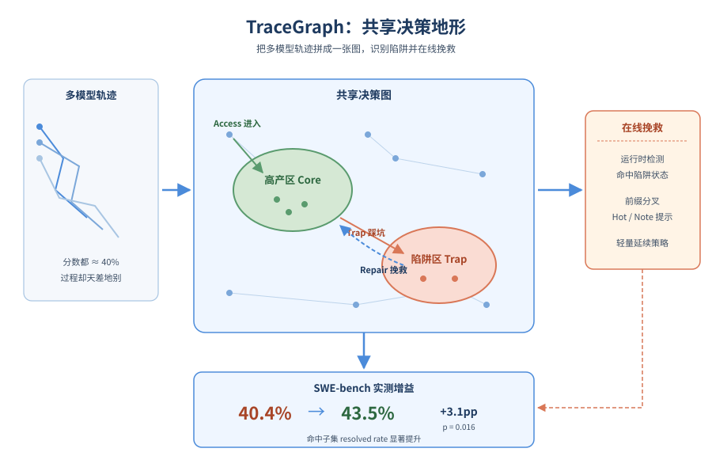
*图示：论文核心机制概念图*

- **详细背景：** 现在的 Agent benchmark 虽然记录了大量交互轨迹，但最后通常只汇总成一个 pass rate 或 reward 分。这样能排名却看不出'谁掉进了什么坑、谁恢复得更好'，也无法回答某个 benchmark 到底在考察避坑还是恢复能力。论文想给轨迹一个共享坐标系，让多模型的过程差异能够被直接比较，并进一步指导运行时改进。
- **详细入选理由：** 这篇论文不只是又一个 Agent 评测，它把多个模型在同一任务上的轨迹拼成一张共享决策图，识别出'陷阱区'和'高产区'，再用图谱反过来在 SWE-bench 上做运行时陷阱检测和恢复，实测把 resolved rate 提升 3-4 个百分点。这种'离线诊断 → 在线干预'的闭环对做 Agent 评测和产品的人都很有借鉴价值。

**核心技术点速览：**

#### 技术点 1：把轨迹拼成共享决策图
- 是什么：用可观测的动作-观察特征把多模型轨迹对齐到同一张图上。

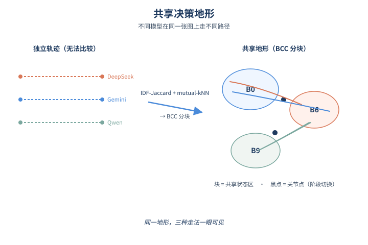
*图示：把轨迹拼成共享决策图的概念示意*

- 怎么做：每个 action-observation 步被编码成一组稀疏的可观测 key（工具类型、命令类、观察模式、文件线索、阶段等），用 IDF 加权 Jaccard 算两步相似度，再以 mutual-kNN 建图，并做 BCC（双连通分量）分解，把图切成代表'共享 agent 状态'的块，articulation point 作为策略/阶段切换点。建图阶段完全不看模型身份和最终结果。
- 为什么 work：核心 insight 是：单条轨迹各看各的没法比较，但如果把所有模型的步骤先用'做了什么、看到了什么'这种可观测信号聚类，就会发现大家其实在同一片地形上走不同的路。BCC 分块相当于把这片地形切成一个个'区域'，让后面所有模型对比都变成'谁在哪些区域穿行'。
- 例子：在 SWE-bench 的 django-9296 任务上，所有模型的轨迹被 pool 起来建图，得到 B0、B5、B6、B9 等若干块；DeepSeek-R1 走 B6 后再回到 core 块，Gemini 直接穿越，Qwen3-Next 则在 B9↔B6 之间打转——同一张图上一眼能看出三种风格。

#### 技术点 2：Core/Trap 与三事件画像
- 是什么：用结果信息标出高产区和陷阱区，把每条 rollout 浓缩成三件事。

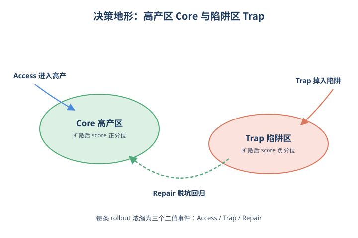
*图示：Core/Trap 与三事件画像的概念示意*

- 怎么做：对每个 BCC 块算 Laplace 平滑后的奖励均值减去任务均值，作为初始 score，然后在块商图上做 PageRank 风格的扩散，按正负分位数挑出 productive core 和 trap region。每条 rollout 浓缩成三个二值事件：Access（是否进过 core）、Trap exposure（是否进过 trap）、Repair（是否从 trap 回到 core）。
- 为什么 work：光有地形还不够，还要知道哪里是好走的、哪里是坑。用结果回标 + 图扩散，就能让相邻区域的好坏倾向相互平滑，避免单块独立判断的噪声。再把每条轨迹压成 Access/Trap/Repair 三件事，就得到了一种比 pass rate 信息量大但仍然好对比的过程语言。
- 例子：在 τ2-bench 上 Trap demand 高度负（−0.40），说明成功轨迹主要靠避坑；而 SWE-bench 的 Repair demand 最高（+0.11），说明成功轨迹经常先掉进 trap 再恢复——这种差异是单看分数完全看不到的。

#### 技术点 3：供给-需求剖面分模型分基准
- 是什么：用同一张图量化每个模型的风格和每个 benchmark 的考察重点。

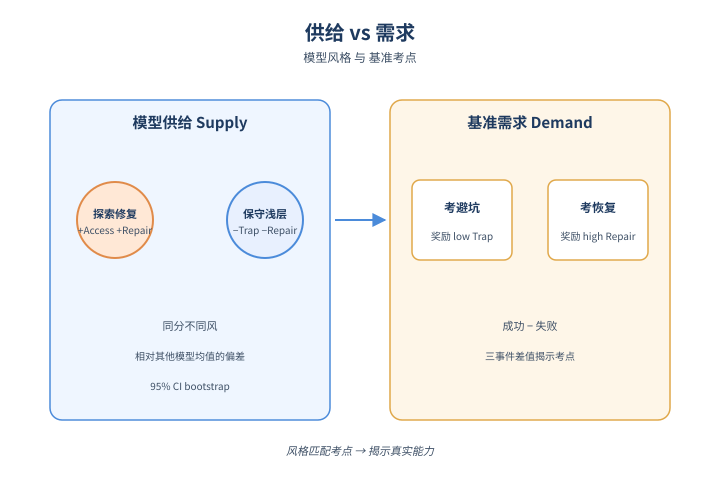
*图示：供给-需求剖面分模型分基准的概念示意*

- 怎么做：模型 supply 是该模型在各任务上 Access/Trap/Repair 减去同任务其他模型均值后的平均，反映其相对风格；benchmark demand 是成功轨迹与失败轨迹在三事件上的差，反映该 benchmark 实际奖励什么过程。用 bootstrap 给出 95% CI。
- 为什么 work：把模型当作'在共享地形上跑出的流量模式'，就能区分'高 Access 高 Repair 的探索-修复型'（如 DeepSeek-V3.2）和'低 Access 低 Repair 但少踩坑的保守浅层型'（如 Qwen3-Next）。同时 benchmark 也不再只是难/易，而是被拆解成'考避坑'还是'考恢复'。
- 例子：DeepSeek-V3.2 的 Access 和 Repair CI 都在 0 以上，是典型的'敢探索敢修'；Qwen3-Next 三个 CI 全为负且较低，是'保守不踩坑'路线，分数相近但风格完全不同。

#### 技术点 4：Trap-aware 运行时恢复管线
- 是什么：把离线发现的 trap 区当作在线触发器，触发后做 prefix-fork 恢复。

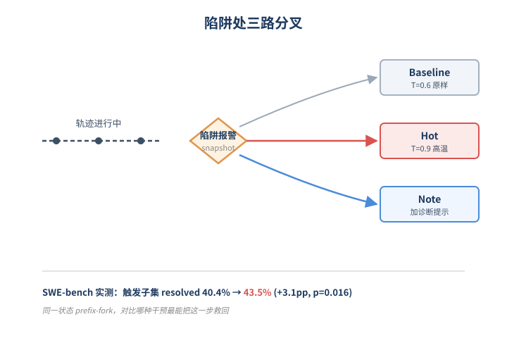
*图示：Trap-aware 运行时恢复管线的概念示意*

- 怎么做：把 trap 块上的步骤抽成 canonical key 集合做检测库，运行中算 trap 相似度与 core 相似度，触发条件是 trap 相似度过阈值且超过 core 相似度。一旦触发，就快照 docker 工作区和会话前缀，从同一状态分叉成三种延续：Baseline（T=0.6 不加 note）、Hot（T=0.9）、Note（T=0.6 加保守诊断 note，提示重读证据、最小修改）。
- 为什么 work：诊断图谱不只用来事后分析，还能反过来当在线报警器：当模型走到一个'历史上常翻车的状态'时再做轻量干预，而不是全程乱试。Prefix-fork 保证从同一个状态对比，避免不同种子带来的偏差，对比的是'什么干预方式能把这一步救回来'。
- 例子：在 SWE-bench Verified 500 题上，pooled Hot 把 fired 子集的 resolved rate 从 40.4% 提到 43.5%（+3.1pp，p=0.016），common-fired 子集从 41.0% 提到 44.8%（+3.8pp）；其中 Qwen3.6 更吃 Note（+4.7pp），GLM-5.1 和 DeepSeek-V4-Pro 更吃 Hot。

- **对 Agent 产品/系统的启发：** Agent 评测和监控应记录可对齐的过程事件，并把高频失败状态做成在线触发器。
- **详细启发：** 产品侧：做 Agent 产品时，可以在自家任务上 pool 多模型/多次运行的轨迹建一张共享图，把'高频翻车区'变成线上监控点，触发后做轻量 retry 或加诊断提示，而不是整体重跑。；系统侧：评测系统不应只输出 pass rate，应同时记录类似 Access/Trap/Repair 的过程事件，并把每个 benchmark 的 demand 类型（避坑型 vs 修复型）暴露出来，方便选模型和选干预策略。；风险：core/trap 是基于历史结果回标的描述性标签，并非泛化预测；不同模型供应商对同一 trap 状态可能需要不同恢复策略（Hot vs Note），盲套一种干预可能反而无效。

## 三、总结

- 今天的关键词是'解构'：把安全、评测、进化、记忆都拆到组件层重新归因
- 今天551篇里安全、评测、记忆三条线齐头并进，共同特征是不再把Agent当黑盒，而是拆到组件级别重新归因
- 今天551篇里安全、评测、记忆三条线齐头并进，共同特征是不再把Agent当黑盒，而是拆到组件级别重新归因。安全研究从单上下文走向跨会话有状态监控，评测从分数走向轨迹图谱诊断，self-evolving从端到端涨点走向evolver/agent能力分离。对正在搭系统的人来说，这些工作给出的是清晰的资源分配指南：把预算花在执行Agent和runtime治理上，而不是更花哨的进化机制。
