# 2026-06-11 AI Agent 论文日报

> 分类：cs.AI + cs.CL + cs.LG + cs.MA + cs.RO + cs.SE + cs.HC
> 入选论文：3 篇

## 30 秒速览

- 🎯 **今日主线**：今天主题是'让生产Agent可治理、可审计、可被CI拦下来'
- 💡 **一句话带走**：如果说前几天在讨论Agent怎么失败，今天讨论的是怎么把失败拦在生产线之前…

**今日导读**（先挑该读哪篇）

1. [必读 · 安全]**Goal-Autopilot: A Verifiable Anti-Fabrication…** — 针对长时无人值守 Agent 的虚假成功问题提出 gated FS…
2. [必读 · 通用]**Toward Generalist Autonomous Research via…** — Arbor提出长程自主研究Agent框架
3. [必读 · 评测]**Layer-Isolated Evaluation…** — 提出生产级 Agent 的分层确定性测试 harness 与回归注…

## 一、今日趋势

- Agent安全今天罕见地集中在runtime治理层：Five-Plane参考架构、Sovereign Assurance Boundary证书化admission、Runtime Skill Audit动态探测共同把'生产Agent的运行时边界'做成系统级研究对象，而不再停留在prompt注入和越狱。
- Agent评测从'最终成功率'继续下沉到层级与harness：Layer-Isolated Evaluation用回归注入证明聚合指标会掩盖单层25–91pp的崩溃，Claw-SWE-Bench把harness和成本写进coding agent评测的一等轴。
- 长程Agent的核心矛盾被重新框定为'诚实性'而非'能力'：Goal-Autopilot用门控FSM+No-False-Success定理在SWE-bench上把虚报率从33.7%压到0.67%，Arbor用假设树把研究状态外化为可审计、可剪枝的持久结构。
- 多Agent与工作流方向开始把基础设施和复用作为优化轴：INFRAMIND把队列/KV缓存/延迟纳入RL编排，FlowBank用precompute-and-reuse做查询自适应工作流，Agent调度正从纯prompt层走向系统层。

### 跨论文综合观察

- Goal-Autopilot、Arbor、Layer-Isolated Evaluation三篇看似分属safety/general/eval，其实在做同一件事——把Agent的隐式状态外化成可审计对象：FSM、假设树、分层断言切片，分别对应执行、研究、测试三种粒度的'状态机化'。
- Five-Plane架构、Sovereign Assurance Boundary、Runtime Skill Audit、Bootstrapped Monitoring共同构成一个完整的runtime治理栈：从架构分层、admission准入、skill动态审计到CoT监督，今天的Agent安全研究第一次像云原生安全栈一样齐整。
- INFRAMIND和FlowBank把多Agent编排从'谁说什么'拉到'系统跑得动吗'——一个用infra信号做RL调度，一个用预计算工作流做复用，提示multi-agent的下一波优化空间在系统层而非prompt层。

## 二、重点论文精读

### 1. [必读 · 安全] Goal-Autopilot: A Verifiable Anti-Fabrication Firewall for Unattended Long-Horizon Agents
- **arxiv 信息：** `2606.11688` · 作者：Youwang Deng · 类目：cs.AI · 提交：2026-06 · [原文](https://arxiv.org/abs/2606.11688) · [PDF](https://arxiv.org/pdf/2606.11688.pdf)
- **为什么读：** 用门控状态机给长时无人值守 Agent 加一道 '禁止虚报成功' 的防火墙
- **背景：** 长链路 LLM Agent 在无人值守时最大的风险不是出错，而是'自信地谎报完成'——这种错误是静默的，下游会照单全收。Reflexion、Self-Refine 这类自我反思方法只是降低概率，StateFlow/AutoGen 这类编排框架只给结构、不管完成诚实性，selective prediction 又依赖模型自身置信度，而虚报恰恰发生在模型很自信的时候。作者把'终止时能声明什么'当作和能力并列的一等指标，提出从执行模型层面让虚报在结构上不可能发生。
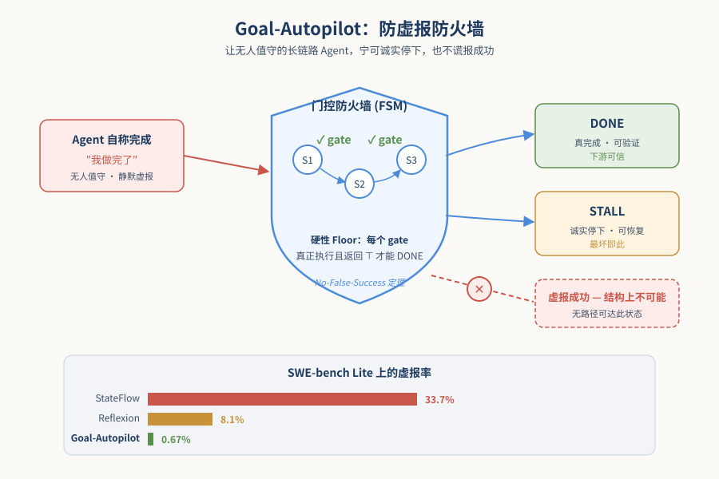
*图示：论文核心机制概念图*

**核心技术点**

#### 技术点 1：门控有限状态机+硬性 Floor
DONE 必须由真实执行并通过的 gate 才能到达，模型说了不算

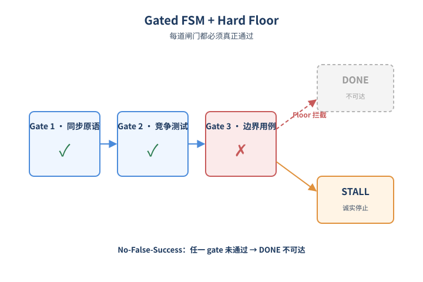
*图示：门控有限状态机+硬性 Floor的概念示意*

- 怎么做：把整个运行状态外化成一个持久化的 FSM 对象 S（goals/states/cursor/phase/history/DOD），每个状态都带一个可执行、可证伪的 gate predicate。终止状态只有 DONE 和 STALL，硬性 Floor 规定：只有沿途每个 gate 都被真正执行且返回 ⊤，才允许进入 DONE，否则只能落到 STALL。
- 为什么 work：核心 insight 是不再相信模型自己说'我做完了'，而是要求每一步必须留下'外部检查跑过且通过'的痕迹才能宣告成功。和 selective prediction 的差别在于：不依赖模型置信度，而是要求一个外部确定性检查通过；和 StateFlow 的差别在于多了 Floor 这一硬约束。
- 例子：比如目标是写一个线程安全计数器：FSM 把它分解成'有同步原语→32×20000 竞争测试通过→...'多个 gate，调度器逐 tick 执行；只要其中任何一个 gate 没真正跑过或没返回 true，系统就不会声明 done，最坏情况是诚实地停在 STALL。

#### 技术点 2：无状态 tick + 状态外化
每个 tick 重新加载 S，per-step 上下文是常数，不随时长膨胀

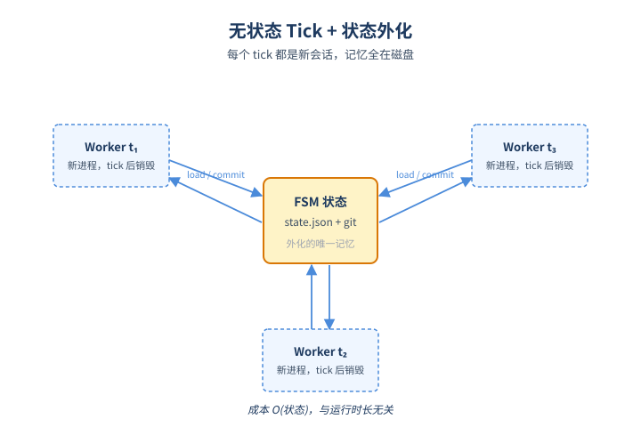
*图示：无状态 tick + 状态外化的概念示意*

- 怎么做：调度器每隔一段时间启动一个全新 worker 进程，只把 FSM 对象 S 重新水化进上下文，执行一次幂等 tick：load S → 路由 phase → 做一单位工作 → 执行 gate 验证 → 决定推进/重试/失败 → 原子写回并 git commit。长任务用异步 job 跨多个 tick 轮询。
- 为什么 work：传统 in-context Agent 把整段 trajectory 带在上下文里，per-step 成本随步数线性增长、总成本 O(T²)；Autopilot 因为完全不在会话里保留记忆，每个 tick 都是新会话，per-step 成本只与状态机大小有关，跟跑了多久无关。这同时让每个 tick 天然 idempotent、崩溃可恢复、跨重启可续。
- 例子：一次跑 6 小时的任务，传统 ReAct 上下文会越堆越长；Autopilot 则是每 5 分钟启动一次新 worker，只读那个 JSON 状态文件，做一步就退出，杀掉中间任何一个 tick 都不会丢状态。

#### 技术点 3：Goal 编译器+A3 双层审计
把自然语言目标编成带可执行 gate 的 FSM，再用静态+LLM 两层审计 A3 覆盖

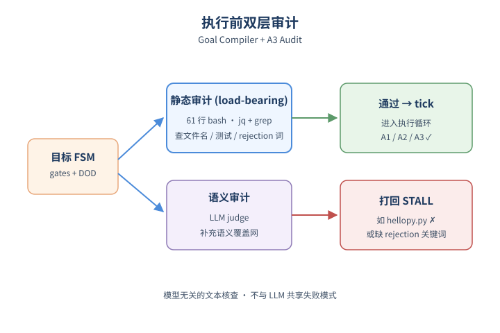
*图示：Goal 编译器+A3 双层审计的概念示意*

- 怎么做：一次性 LLM 调用把目标编译成依赖有序的 FSM，每个状态要带可执行 gate 和一行 DOD，编译器自检每个 gate 是否可执行、DONE 是否可达。在 tick 循环开始前跑两层审计：静态审计（61 行 bash，用 jq+grep 检查文件名、测试、rejection 关键词覆盖），再跑一个 LLM-judge 做语义覆盖网。静态审计是 load-bearing 的，LLM 只是补充。
- 为什么 work：定理三个假设里 A1/A2 是代码不变量好查，最难的是 A3——计划是否真覆盖了目标。作者发现弱模型的 A3 失败几乎都是文本层面的（文件名漏字符、多条 rejection 被压成一条），所以一个 60 行的纯文本 grep 就能在执行前拦住绝大多数计划缺陷，且模型无关，不会和被审计 LLM 共享失败模式。
- 例子：弱模型 W1 把目标里的 hello.py 编译成 hellopy.py 的 gate，或把'拒绝 .. / 绝对路径 / symlink / 盘符 / NUL'压成一句 raises ValueError——静态审计直接发现文件名不匹配或缺少 rejection 关键词，FSM 还没跑就被打回 STALL。

#### 技术点 4：No-False-Success 定理
在 A1/A2/A3 三个可测条件下，DONE 必然蕴含目标真的达成

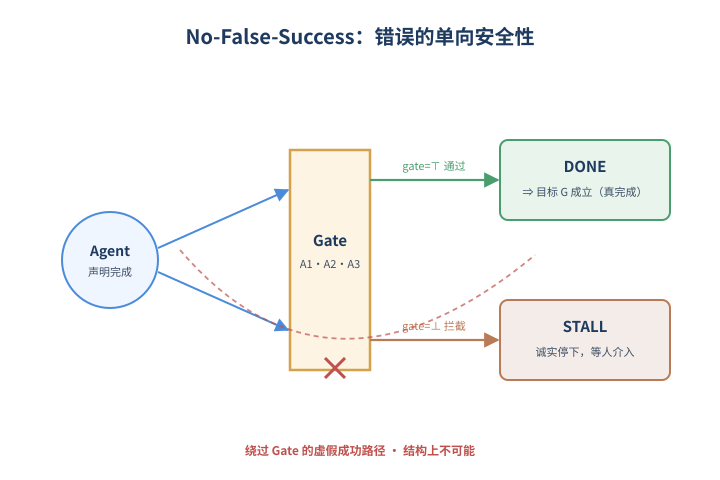
*图示：No-False-Success 定理的概念示意*

- 怎么做：三条假设：A1 gate 检查无 false positive；A2 DONE 必须由真正执行并返回 ⊤ 的 gate 推进；A3 任意通往 DONE 的路径上 gate 合取蕴含目标 G。定理证明：status=DONE ⇒ G 成立。推论 1：gate 不完备只会导致 STALL（漏判），不会导致虚报，错误是单向安全的。
- 为什么 work：和很多'尽量诚实'的方法不同，作者把信任点显式写出来，且这三个点都是可经验测量的（A1/A2 是代码不变量靠单测，A3 是审计器的命中率）。最关键的性质是错误的非对称性：最差情况是诚实地停下来等人，永远不会变成下游消费的虚假成功。
- 例子：实验里所有 10 次 Autopilot 虚报都来自最强的模型 F2（A3 审计漏过的语义缺陷），而两个较弱模型 M1/M2 在 700 个配对 cell 上零虚报——因为它们的代码都通不过 gate，于是被诚实地路由到 STALL。

#### 技术点 5：3150-cell 配对实验+SWE-bench 33pp 差
在 SWE-bench Lite 上虚报率从 StateFlow 的 33.7% 降到 0.67%

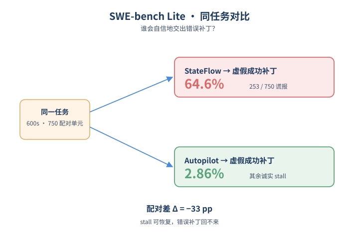
*图示：3150-cell 配对实验+SWE-bench 33p…*

- 怎么做：70 任务（20 trap + 50 SWE-bench Lite，覆盖 11 个 OSS 仓库）× 3 系统（Autopilot/Reflexion/StateFlow）× 3 模型 × 5 seed = 3150 cell，per-cell 600s 上限，配对 bootstrap (B=5000)。聚合虚报率：Autopilot 0.95% （0.38,1.62），Reflexion 8.10%，StateFlow 25.05%。SWE-bench Lite 上配对差 ∆(Autopilot−StateFlow) = −33.07pp （−36.53,−29.73）。
- 为什么 work：trap 任务上三家都比较诚实（差距统计上不显著），真正拉开差距的是 SWE-bench Lite 这种'弱 Agent 容易交出看似合理但其实错误的补丁'的硬场景。StateFlow 在 750 个 SWE 配对单元里交出 253 次自信的错误补丁，Autopilot 只有 5 次，其他几乎都是诚实地 stall——这正是无人值守场景下最重要的非对称：stall 可恢复，错误补丁一旦下游消费就回不来。
- 例子：同一组 SWE-bench Lite 任务、同样 600s 预算，StateFlow+F2 交出 64.6% 的虚假成功补丁；Autopilot+F2 只有 2.86%，且 928 次 Honest Stall 中 93.3% 是 A3 审计在执行前主动拒绝的，理论里的 A3 条件就是按设计触发的。

- **对 Agent 产品/系统的启发：**
  - 产品侧：做长链路或夜间无人值守的 Agent 产品（自动 PR、自动 triage、CI 修 bug 等），应该把'完成'定义成一个外部可执行检查通过，而不是模型说完成；STALL 路径要做成可移交、可重试，而不是当作产品 bug 隐藏起来。
  - 系统侧：可以把 Autopilot 这种'外部 FSM + 无状态 tick + 持久化状态文件'当作 Agent runtime 的一种参考架构：调度器（如 pm2）只跑一步 tick，状态写到 git/DB，per-step 上下文恒定，天然崩溃可恢复、可审计；并在 init 阶段加一个针对 plan 的静态+LLM 双层审计器。
  - 风险：Floor 只保证不虚报，不保证内容安全或对齐：恶意 goal 仍可让 gate 通过有害输出，因此必须叠加内容级安全（RLHF、输出分类器、HITL）。审计器对强 planner 偏保守，会牺牲覆盖率，需要根据业务在'虚报代价'与'漏完成代价'之间做工程取舍。

### 2. [必读 · 通用] Toward Generalist Autonomous Research via Hypothesis-Tree Refinement
- **arxiv 信息：** `2606.11926` · 作者：Jiajie Jin等 · 类目：cs.AI · 提交：2026-06 · [原文](https://arxiv.org/abs/2606.11926) · [PDF](https://arxiv.org/pdf/2606.11926.pdf)
- **为什么读：** 用持久化假设树把长程自主科研Agent变成可累积的搜索过程，6项真实任务全胜
- **背景：** 科研是一个'探索-实验-抽象'反复迭代的长程过程，需要从失败和成功里抽出经验指导后续尝试。现有的Codex、Claude Code等编码Agent虽然能长时间执行，但本质上把每次尝试当独立局部行为，缺乏跨时间的研究状态；已有的科研Agent又多按固定流程走或一次只优化一条线。论文要解决的是：如何让Agent在没有人逐步监督的情况下，把许多次实验沉淀成一个可累积、可审计的研究过程。
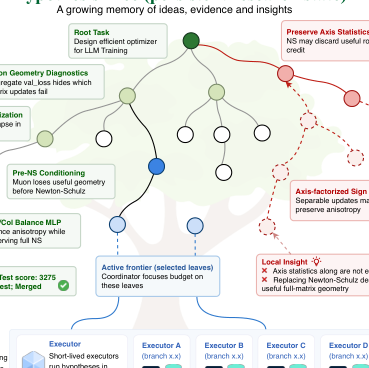
*图示：Figure 2是Arbor的整体框架图，清晰展示了co…*

**核心技术点**

#### 技术点 1：假设树作为持久研究状态
用一棵持久化的假设树把想法、产物、证据、洞见全部连起来作为Agent的研究记忆。

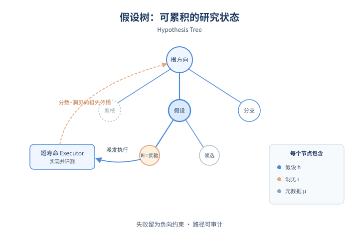
*图示：假设树作为持久研究状态的概念示意*

- 怎么做：Arbor用根节点开始的树T=(V,E)记录研究状态，每个节点包含三部分：假设hn（要验证的命题）、洞见ιn（对证据的可复用解释）、元数据µn（状态、dev分数、git分支引用等）。靠近根的是大方向，深节点是可执行的具体干预；叶子被执行后写回得分和洞见，再向祖先节点抽象传播。
- 为什么 work：和把对话历史塞进context或维护一个flat的尝试列表不同，树形结构同时承担三种角色：当前的搜索前沿、过去尝试的长期记忆、以及每次产物变更的审计记录。这样失败也能变成对未来方向的负向约束，而不是被遗忘。
- 例子：在Math-Reasoning数据合成任务里，树从'code+prompt'(1.1)长出'parametric'(1.4)、再到'recalibrate'(2.4)、'family fixes'(3.4)，最终被合并的路径是1.1→1.4→2.4→3.4，dev score从0涨到约24%，整条路径在树上可追溯。

#### 技术点 2：Coordinator+Executor分层
长寿命coordinator管全局策略，短寿命executor在隔离worktree里只验证单个假设。

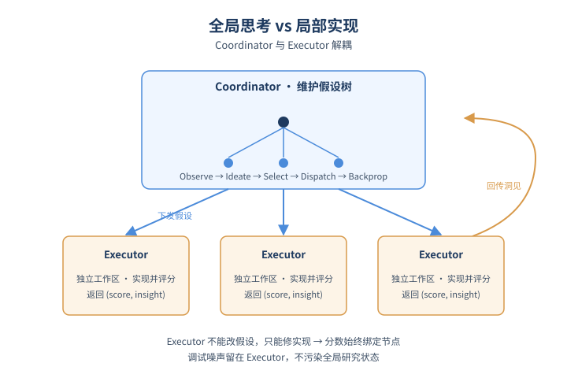
*图示：Coordinator+Executor分层的概念示意*

- 怎么做：Coordinator按Observe→Ideate→Select→Dispatch→Backpropagate→Decide六步循环：读取树状态、在选定父节点下生成k个子假设、挑前沿叶子、并行下发到executor、回写证据并向上抽象、最后决定继续/剪枝/合并。Executor拿到一个假设后在fresh worktree里实现、用Edev评估，只能修复实现不能改假设，最后返回(score, result, insight, branch)。
- 为什么 work：把'全局怎么搜'和'单点怎么实现'解耦：低层调试日志不会污染全局研究状态，executor的得分也始终对应它被分配的那个假设。如果让executor自己在指标卡住时换假设，分数就不再代表那个节点，向上传播的洞见就会失真。
- 例子：在优化器设计任务里，coordinator在'Muon Geometry Diagnostics'方向下生成'Axis-factorized Sign Update'等子假设，分发给多个executor并行测试；返回后把'Newton-Schulz破坏了全矩阵几何'这种局部教训抽象到祖先节点，作为未来ideation的先验。

#### 技术点 3：Held-out合并门控
dev分数只用来引导搜索，候选必须在test集上也变好才允许合并到主干。

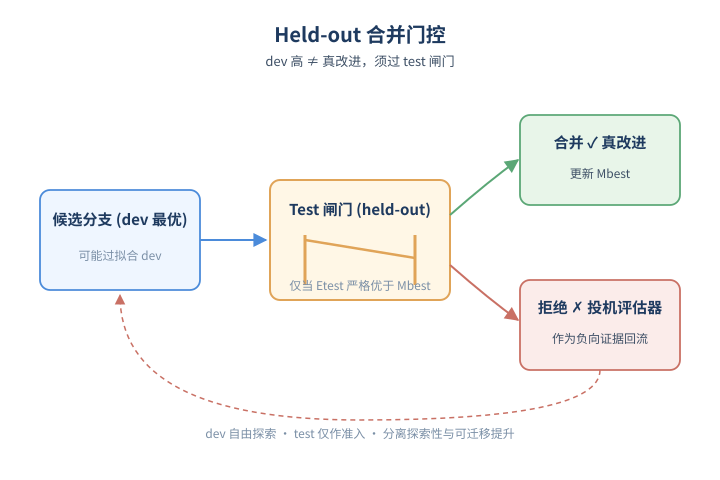
*图示：Held-out合并门控的概念示意*

- 怎么做：AO任务被形式化为P=(M0, O, Edev, Etest)：Edev在搜索过程中可自由调用，Etest仅作为admission gate。一个候选分支即使dev最优，也要在fresh worktree里跑Etest，仅当其Etest分数严格优于当前Mbest才merge，否则视为'在过拟合dev'的负向证据。
- 为什么 work：长时间对dev反复优化必然会过拟合或钻评估器的空子。把dev/test严格分离能把'探索性提升'和'可迁移提升'区分开来，dev高test低反而成为有用信号——提示这个方向在投机评估器而不是真改进。
- 例子：Terminal-Bench 2.0上Claude Code拿到75.00的最高dev分但held-out只有71.70；Arbor的dev只有72.22却能在test达到77.36，说明合并门控阻止了dev过拟合的方向被接受。

#### 技术点 4：六类真实科研任务上的全面验证
在模型训练、harness工程、数据合成6个真实任务上Arbor全胜，平均held-out增益是基线2.5倍以上。

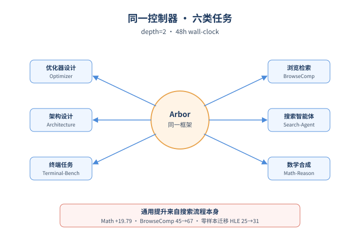
*图示：六类真实科研任务上的全面验证的概念示意*

- 怎么做：作者构造了Optimizer Design、Architecture Design、Terminal-Bench 2.0、BrowseComp、Search-Agent及Math-Reasoning数据合成6个AO任务，每个都有M0、自然语言目标、dev/test评估器和原生指标。Arbor、Codex、Claude Code在相同48小时墙钟和接口下对比；MLE-Bench Lite上Arbor用GPT-5.5达到86.36% Any Medal、77.27% Gold。
- 为什么 work：六个任务覆盖三种很不同的产物类型——训练算法、Agent harness、数据生成管线，但用的是同一个controller和同样深度=2的树设置，说明提升来自搜索流程本身而非任务特调。BrowseComp上学到的搜索harness还能零样本迁移到HLE和DeepSearchQA，进一步说明它学到的是通用改进而非benchmark-specific的tricks。
- 例子：Math-Reasoning数据合成任务上，Arbor把held-out pass-gap从1.04提升到20.83(+19.79)，而Codex仅+5.21、Claude Code +7.29；BrowseComp上test精度从45.33%提到67.67%，且这个harness frozen后还能让HLE从25.5%涨到31.5%。

- **对 Agent 产品/系统的启发：**
  - 产品侧：对自主科研、AutoML、Agent harness优化类产品有直接启发：与其让用户看一个不断增长的对话历史，不如暴露一棵'假设树'作为可视化和介入界面，用户可以在任意节点查看证据、剪枝或注入先验，让长任务变得可观测、可信任。
  - 系统侧：架构上值得借鉴三点：(1)长寿命coordinator+短寿命隔离executor的双层设计，避免低层调试污染全局状态；(2)持久化结构化memory(树/图)取代不断膨胀的context，重新Observe而不是依赖对话历史；(3)严格的dev/test分离和合并门控，把'探索性反馈'和'验证性进步'解耦。
  - 风险：持久树本身可能成为新的过拟合和复杂度来源：洞见的向上抽象由LLM完成，错误总结会污染后续ideation；executor被绑死在分配假设上，遇到假设本身有问题时缺乏反向通道；同时框架对评估器质量极度敏感，Edev/Etest设计不当时held-out gate也保护不了下游。

### 3. [必读 · 评测] Layer-Isolated Evaluation: Gating the Deterministic Scaffold of a Production LLM Agent with a No-LLM, Regression-Locked Test Harness
- **arxiv 信息：** `2606.11686` · 作者：Sawyer Zhang等 · 类目：cs.AI · 提交：2026-06 · [原文](https://arxiv.org/abs/2606.11686) · [PDF](https://arxiv.org/pdf/2606.11686.pdf)
- **为什么读：** 把生产 Agent 拆成层做无 LLM 单元测试，每个 PR 秒级跑完
- **背景：** 目前主流 Agent 评测（AgentBench、τ-bench、WebArena 等）都看端到端任务成功率，但这种聚合指标只能说'坏了'，说不出'哪一层坏了'，而且每次跑要分钟级、还带随机性，根本进不了 PR 级 CI。已有工作如 EDDOps 提出过分层评测的概念但没落地实现，CheckList 提供了行为切片的思路但是针对 NLP 模型而非 Agent 内部架构。这篇论文是第一次给出一个部署中 Agent 的、完全分解、亚秒级、无 LLM 的可运行实例。
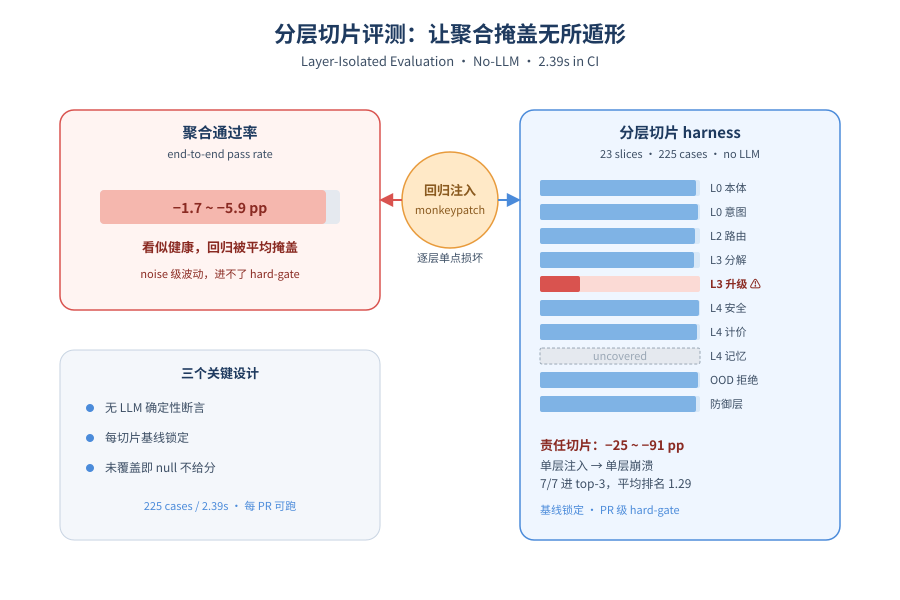
*图示：论文核心机制概念图*

**核心技术点**

#### 技术点 1：分层确定性测试 harness
把 Agent 按架构层切成 23 个断言切片，每个切片用纯函数路径在毫秒内跑完

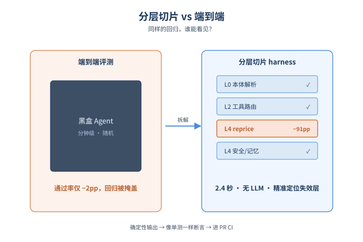
*图示：分层确定性测试 harness的概念示意*

- 怎么做：作者把订餐 Agent 拆成固定层级分类：L0 本体解析/意图/言语行为，L2 工具路由，L3 子目标分解/约束/升级，L4 安全/知识/记忆，再加横切的 envelope/defense/OOD/reformulator 等。每层有一个 assertion slice，只断言该层确定性输出（如本体解析的规范 ID、规则化升级决策、服务端重新计价结果），完全不调用 LLM。整个 pure 套件 238 个用例 23 个切片，225 个能跑的在 2.39 秒跑完，平均每用例 ≈10ms。
- 为什么 work：传统单元测试到了 Agent 这里就卡住，因为大多数行为都依赖 LLM 调用，又慢又随机。作者的关键洞察是：Agent 里其实有相当一部分行为是确定性的——本体匹配、工具路由、规则升级、价格计算、prompt 拼装、防御过滤——这些给定输入输出就是固定的，完全可以像普通代码一样写 assert。把这部分单独抽出来跑，就拿到了普通软件工程的全部好处：秒级、可复现、可在每个 PR 上 hard-gate。
- 例子：比如 L4 安全层的 reprice 切片：输入一个购物车和店铺价目表，调用 reprice(cart, tenant.pricebook)，断言 observed.total-cents == case.expected-total-cents 且 observed.rejected-skus == case.expected-rejects——整个过程 1ms，没有任何 LLM 参与，结果在 baseline 锁定的 100% 通过率下，PR 一旦让这个切片掉点就会被拦下来。

#### 技术点 2：回归注入暴露聚合掩盖
单层注入故障时，聚合指标只掉几个点，但责任切片直接崩塌 25~91pp

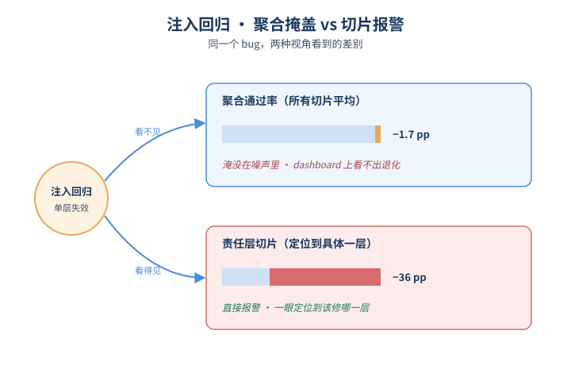
*图示：回归注入暴露聚合掩盖的概念示意*

- 怎么做：作者对 7 个非安全层逐一做单点 monkeypatch（如把 escalation 改成永不升级、把 reformulator 改成 identity、把 OOD gate 改成永不拒绝），重跑整个 pure 套件，记录聚合通过率 delta 与各切片 delta。harness 会自验证 patch 真的生效（no-op 会被丢弃）。
- 为什么 work：这是论文最有价值的发现：6 个本地回归让聚合通过率只掉 1.7~5.9pp——在 dashboard 上完全淹没在噪声里——但责任切片掉 25~91pp，直接报警。这就解释了为什么很多团队盯着端到端通过率却感觉不到回归：不是没退化，是被平均掉了。同时 off-diagonal 几乎不动（被注入层的切片 5/7 是最差，7/7 进前三，平均排名 1.29/19），意味着信号是定位到一层的，不是糊在一片。
- 例子：把 escalation 层改成永不升级：聚合通过率只掉 4.62pp（很容易被当噪声忽略），但 L3-escalate 切片掉 50pp、其它切片几乎不动；把 OOD gate 改成永不拒绝则聚合只掉 1.68pp，ood-reject 切片直接掉 36.36pp 且其它切片完全不动——一眼就能定位修哪。

#### 技术点 3：覆盖诚实的基线规则
零用例的切片必须报 null 而不是 100%，让没测过的层永远不能蒙混过关

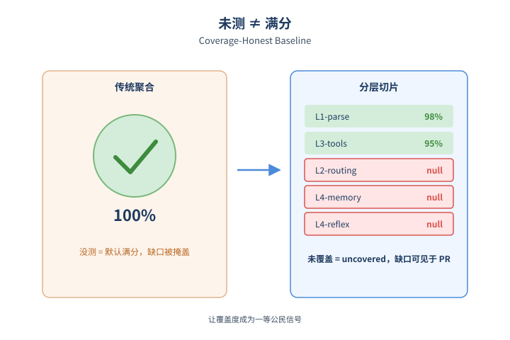
*图示：覆盖诚实的基线规则的概念示意*

- 怎么做：锁定基线对每个切片记录 (total, passed, rate, failed-ids)，但显式规定：用例数为 0 的切片报 rate: null（uncovered）而非 1.0。当前基线显式标出 4 个未覆盖切片（L2-routing、L4-memory、L4-personalization、L4-reflexion）和 2 个低 N 切片，让覆盖缺口本身成为 PR 上的可见信号。
- 为什么 work：大多数聚合指标的隐含语义是'没测的就当满分'，结果团队删测试或不写测试反而能让指标变好。作者反着来：没用例就报 uncovered，绝不给分。这把'测试覆盖度'本身变成了一个一等公民质量信号，而不是只在 coverage report 里被忽略的数字。论文里有一个真实例子：他们的订单确认 guardrail 出过严重生产回归（一半的回合 confirm 后没下单），事后发现对应的 L2-routing 切片当时正好是 uncovered——而 coverage-honesty 规则让这个缺口在每次跑测时都被显式打出来，而不是被绿色聚合掩盖。
- 例子：PR 提交时，gate 逻辑会逐切片对照 baseline：如果 base（s）.rate is None 且当前仍 total==0，则继续标记为未覆盖（追踪但不算绿）；任何已覆盖切片低于 baseline 立刻 block-merge——一个 100% 的聚合数字永远不能因为'某层根本没测'而存在。

- **对 Agent 产品/系统的启发：**
  - 产品侧：做 Agent 产品的团队不应只盯 end-to-end 任务成功率，而要把 Agent 的确定性骨架（路由、工具选择、价格、安全校验、prompt 拼装、防御）当作普通后端代码一样写单元测试和契约测试，让回归在合并前就被定位到具体哪一层。
  - 系统侧：可以参考这套'层级分类 + 每层 assertion slice + 锁定 baseline + PR 级 gate + 覆盖诚实'的 CI 架构：用 pure mode 跑亚秒级套件做 per-PR hard gate，把昂贵的 live LLM 评测留在 nightly/release。注入回归测试可以作为对评测 harness 本身有效性的验证手段，每次重大架构变更后跑一遍。
  - 风险：需要警惕：1) baseline 锁的是当前行为，不是正确性，如果 baseline 本身错了 gate 会忠实地把错误锁住；2) 测试 harness 必须每次跑都用全新 runtime，否则像 order-store 这种状态泄漏会伪造出根本不存在的层间耦合；3) 生成式行为（自由对话、风格）这一层 pure mode 抓不到，仍需 live 评测兜底。

## 三、总结

- 如果说前几天在讨论Agent怎么失败，今天讨论的是怎么把失败拦在生产线之前。Goal-Autopilot和Arbor用结构化执行模型让长程Agent不再谎报成功，Layer-Isolated Evaluation让分层回归在PR级CI里就能被发现，五平面架构和Sovereign Assurance Boundary则给运行时画出可执行的治理边界。
- 底层趋势是一致的：Agent正在从'一个会自己想办法的模型'被重构成'一个状态外化、边界明确、每层都能单测的系统'，评测、安全、记忆、编排都在朝这个方向收敛。
