# 2026-06-12 AI Agent 论文日报

> 分类：cs.AI + cs.CL + cs.LG + cs.MA + cs.RO + cs.SE + cs.HC
> 入选论文：3 篇

## 30 秒速览

- 🎯 **今日主线**：今天的关键词是'分层'：harness、安全、评测都在被拆成可独立研究的层。
- 💡 **一句话带走**：今天 456 篇里最值得记住的不是某个 SOTA…

**今日导读**（先挑该读哪篇）

1. [必读 · 具身]**$\\texttt{WEAVER}$, Better, Faster, Longer…** — 和 Agent 核心能力或系统设计直接相关，值得优先读
2. [必读 · 评测]**AgentBeats: Agentifying Agent Assessment for…** — 提出基于A2A+MCP协议的统一Agent评测框架AAA
3. [必读 · 安全]**MAStrike: Shapley-Guided Collusive…** — 针对分层多Agent系统的合谋红队

## 一、今日趋势

- Agent harness 从隐性工程层升格为独立研究对象：HarnessBridge 把 harness 参数化为可学习投影、Recursive Agent Harnesses 让父 agent 写代码生成子 harness，配合昨天的 Self-Harness，runtime 层正在快速形成可训练、可递归、可桥接的新范式。
- Agent 安全今天的重心明显从单 Agent 防御移向系统级合谋与运行时治理：MAStrike 用 Shapley 值量化合谋攻击、SMSR 给持久记忆做认证防御、Containment Gap 审计主流框架、Autonomous Penetration 直接评测 19 个 LLM 的攻击红线，呈现出'攻击协同化、防御认证化、治理框架化'的三线并进。
- Agent 评测继续走向基础设施化与自我证伪：AgentBeats 用 A2A+MCP 把基准本身 agentify、统一 N+M 接口；Illusion of Multi-Agent Advantage 则系统性证伪自动 MAS 相对 CoT-SC 的优势，评测层既在搭新协议、也在拆旧叙事。
- Embodied/规划层出现'一个模型多用'的整合趋势：WEAVER 把视频生成、JEPA、Dreamer 拼成支持评估/改进/规划三合一的 World Model，Arbor 把树搜索作为多 agent 共享认知层，长程自治的底座正在收敛。

### 跨论文综合观察

- HarnessBridge、Recursive Agent Harnesses 与 AgentBeats 共同把 Agent 的'外壳层'问题摊到台面：前两者从内部把 harness 做成可学习/可递归的组件，后者从外部用 A2A+MCP 把 harness 与 benchmark 的接口统一，三篇合起来意味着 harness 既要可训练也要可互操作。
- MAStrike、SMSR、Containment Gap 与 Autonomous Penetration 形成一条完整的 MAS 安全攻防链：MAStrike 给出系统级合谋攻击范式，Penetration 揭示模型本身的攻击能力红线，SMSR 给运行时记忆提供认证防御，Containment Gap 则指出当前主流框架在治理层根本不到位——攻击已经协同化，防御还停在单点。
- WEAVER 与 Arbor 在不同模态下表达了同一个野心：用一个共享的'世界/认知层'同时承担评估、规划、记忆三种功能；这与 Illusion of Multi-Agent Advantage 对自动 MAS 架构 bloat 的批判形成呼应——长程能力的提升更可能来自更扎实的共享状态层，而非堆砌更多 Agent。

## 二、重点论文精读

### 1. [必读 · 具身] $\\texttt{WEAVER}$, Better, Faster, Longer: An Effective World Model for Robotic Manipulation
- **arxiv 信息：** `2606.13672` · 作者：Arnav Kumar Jain等 · 类目：cs.RO · 提交：2026-06 · [原文](https://arxiv.org/abs/2606.13672) · [PDF](https://arxiv.org/pdf/2606.13672.pdf)
- **为什么读：** 机器人世界模型同时做到准确、长程一致与快速，直接服务策略评估、改进与规划。
- **背景：** world model 被寄望成为机器人的'学习型模拟器'，用于评估策略、改进策略和测试时规划。但现有方法各有短板：视频生成式 WM 高保真但慢，JEPA 类潜空间无法解码出图给视觉策略用，Dreamer-v4 训练自家 encoder 易在 OOD 上崩，Ctrl-World 多视角但太慢不能在线规划。论文要做的事是同时满足保真、长程一致、效率三件事，把 WM 真正用到真机操作里。
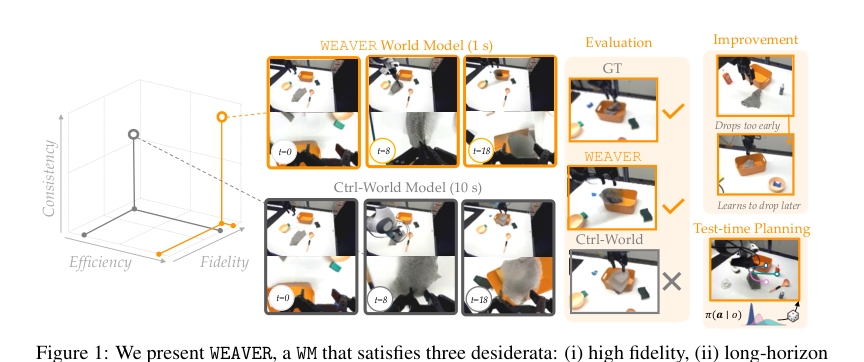
*图示：Figure 1 直观展示了 WEAVER 的三大需求（…*

**核心技术点**

#### 技术点 1：三大需求融合的多视角WM
把视频生成、JEPA、Dreamer 的精华揉到一个多视角潜空间 WM 里。

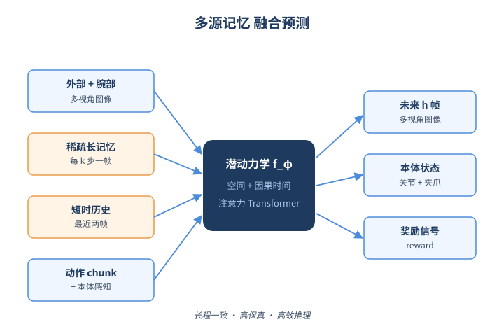
*图示：三大需求融合的多视角WM的概念示意*

- 怎么做：WEAVER 用预训练 SD3 VAE 编码外部相机+腕部相机+本体感知，得到 latent z-t；同时维护稀疏长时记忆 z-mem（每隔 k 步取一帧）和短时历史 z-hist（最近两帧）。潜动力学 f-φ 是带空间注意力 + 因果时间注意力的 2D Transformer，输入 memory、history、动作 chunk，预测未来 h 步 latent，并预测本体状态和奖励。
- 为什么 work：做机械臂 WM 的难点是物体被夹爪挡住、视角切换、需要看几十秒。作者用'多视角'解决遮挡，用'稀疏长记忆 + 近两帧短历史'同时兼顾长程上下文和短期动作后果，再用'预测本体关节'弥补纯视觉看不清抓取力度的问题。这套组合比 Ctrl-World 那种只预测视觉的更适合接触多变的操作任务。
- 例子：执行 'PnP Towel'：观测 t 时三视角图像 + 关节角被编码成 latent，记忆里保留之前每 k 帧的 latent，模型基于这些 + 策略0.5 给出的 15 步动作 chunk，预测后 15 帧的 latent，再解码回外部和腕部图像，让策略接着看。

#### 技术点 2：Flow matching + 蒸馏加速推理
用 diffusion forcing + rectified flow 蒸馏，把 10 秒生成做到 5-10× 加速。

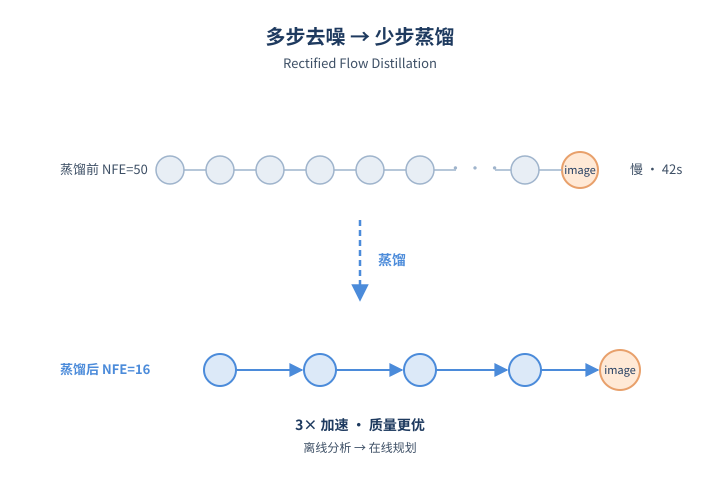
*图示：Flow matching + 蒸馏加速推理的概念示意*

- 怎么做：训练用 flow matching 损失预测 (x¹−x⁰) 速度场，并采用 Diffusion Forcing 给未来不同时间步独立采样噪声水平，提高长程一致性。推理上：对 memory/history token 做 KV cache 减少前向开销；对去噪过程换成 cosine 噪声调度提保真；再用 rectified flow 二次蒸馏，让少量 NFE（如 16）就能给出高质量轨迹。
- 为什么 work：video diffusion 类 WM 慢的两个原因：每步前向贵 + 要去噪很多步。WEAVER 一边用 KV cache 省掉重复计算 memory 的钱，一边用 rectified flow 蒸馏把多步去噪压缩到几步。这样在 NFE=16 时质量已经超过 Ctrl-World 在 NFE=50 时的水平，直接把 WM 从'离线分析工具'拉进了'在线规划工具'。
- 例子：Ctrl-World 在 H100 上生成 10 秒外加腕部视角约需 14.65s（NFE=16）到 42.33s（NFE=50）；WEAVER 同条件下分别只要 4.78s 和 14.25s，FID/FVD 全面更低。

#### 技术点 3：潜空间 reward + critic 头
在 latent 上直接打分，省掉解码图+VLM judge 的昂贵开销。

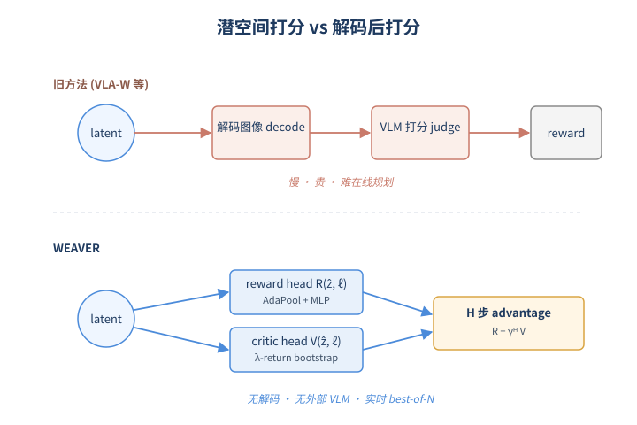
*图示：潜空间 reward + critic 头的概念示意*

- 怎么做：在 latent 上接两个轻量 head：reward head R(ẑ, ℓ) 用 AdaPool 聚合 token 后 MLP 回归 RoboMeter 给出的 progress 奖励；critic V(ẑ, ℓ) 用 bootstrapped λ-return 学价值。规划时直接用 R + γ H V 估算 H 步 advantage，不用解码图像也不用调用外部 VLM 当 judge。
- 为什么 work：之前像 VLA-W 那种方案是：WM 想象→解码图像→VLM 看图打分，一次评估又慢又贵。WEAVER 把奖励信号 distill 到 latent 上的小 head，整个评估在潜空间一气呵成，这是它能做 best-of-N 实时规划的关键。
- 例子：在 PnP Stack 任务里，WEAVER 想象一段 rollout，reward head 给出的曲线和真值 RoboMeter 高度一致，能在 N=4 个 candidate action chunk 里选出 advantage 最高、真实成功率也最高的那一个。

#### 技术点 4：评估/改进/规划三合一
同一个 WM 撑起策略评估、合成数据微调和测试时 best-of-N。

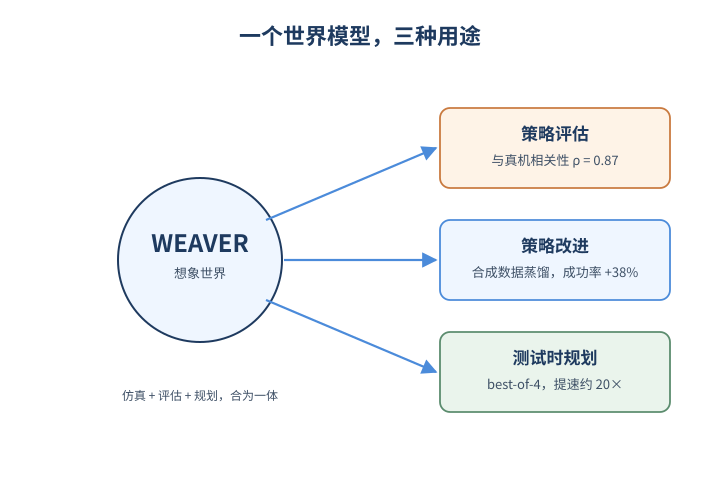
*图示：评估/改进/规划三合一的概念示意*

- 怎么做：评估：用真实 action 在 WM 内 open-loop 跑，统计成功率，与真机相关性 ρ=0.870；改进：从 策略0.5 采样 action chunk → WM 想象 → advantage 过滤 → 把高 advantage 段 distill 回策略，平均成功率提升 38%；规划：每一步从 策略0.5 采 B=4 个 chunk，挑 advantage 最大的执行，平均成功率提升 14%，比 Ctrl-World 流水线快约 20×。
- 为什么 work：这三件事原本各做各的，WEAVER 用同一个模型一次满足，意味着团队只需要训一个 WM，就能拿到 offline eval、合成数据 SFT、online steering 三种增益。对 embodied agent 团队来说，这相当于把'仿真器 + 评估器 + 规划器'合成一个产物。
- 例子：Pour Beans 任务：合成数据规模从 1k 扩到 5k，纯合成微调的成功率从约 0.55 升到超过真实数据 1k 的 0.6；测试时 best-of-N=4 让 PnP Bag 从 0.6 提升到 0.7，全程没有真机交互成本。

- **对 Agent 产品/系统的启发：**
  - 产品侧：对机器人/具身 agent 产品而言，这种 WM 可以直接做'离线回归测试 + 上线前策略改进 + 实时 best-of-N 安全网'三件套，显著降低真机迭代成本。
  - 系统侧：系统设计上启发是：用预训练 VAE/视频模型当 encoder/decoder 保 OOD，潜空间里挂 reward 和 critic 头来跑 advantage，避免每次评估都解码图像并调 VLM；推理侧做 KV cache + rectified flow 蒸馏，把 WM 拉进实时预算。
  - 风险：WM 的奖励 head 来自 RoboMeter，可能放大 teacher 的偏差或漏判失败；用 WM 想象数据回灌策略时，仍需在真机做安全验证，避免在 WM 误差大的状态上过拟合。

### 2. [必读 · 评测] AgentBeats: Agentifying Agent Assessment for Openness, Standardization, and Reproducibility
- **arxiv 信息：** `2606.13608` · 作者：Xiaoyuan Liu等 · 类目：cs.AI · 提交：2026-06 · [原文](https://arxiv.org/abs/2606.13608) · [PDF](https://arxiv.org/pdf/2606.13608.pdf)
- **为什么读：** 用A2A+MCP把评测变成agent，整套基准统一接口
- **背景：** 现在的Agent评测大多是LLM中心的固定harness，每个benchmark都要为特定agent写适配代码，N个agent对M个benchmark就要N×M次集成，且评测代码和生产代码不一致，导致结果不公平、难复现。论文指出根本原因是缺少一个agent无关的开放评测接口，因此提出把基准本身'agent化'，并复用已有的A2A和MCP协议来解决这个问题。
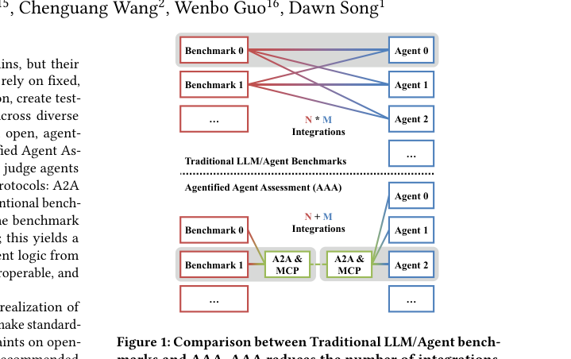
*图示：Figure 1直观展示了AAA的核心思想：通过A2A&…*

**核心技术点**

#### 技术点 1：把基准变成judge agent
评测方也是个agent，用A2A下发任务、MCP暴露工具，统一双向接口

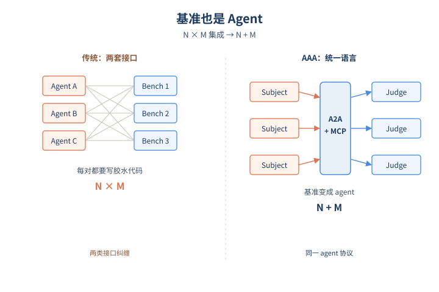
*图示：把基准变成judge agent的概念示意*

- 怎么做：AAA范式定义三个角色：delegator(发起方)、judge agent(原本的benchmark)、subject agent(被测agent)。judge agent通过A2A协议下发任务消息、收集结果，通过MCP暴露工具与环境给subject agent调用。原本'基准接口+agent接口'两套规范被合并为一个统一的agent间通信接口。
- 为什么 work：传统做法是基准方写一套环境API、agent方写一套agent API，两边各自有协议，必须靠胶水代码对接。AAA的洞察是：'考别人'本身就是个agentic任务，那就让基准也讲agent的通用语言(A2A/MCP)，于是只剩一种接口，任何符合A2A的agent都能被任何judge agent评测，集成成本从N×M降到N+M。
- 例子：比如评测编程agent：delegator发A2A消息给judge agent说'用这个数据集评一下subject X'；judge agent准备好仓库环境，通过MCP把文件读写、shell执行等工具暴露出来，并把任务描述用A2A消息发给subject agent；subject调用MCP工具完成编码后回传结果，judge打分并把成绩通过A2A返回delegator。

#### 技术点 2：AgentBeats五种运行模式
为兼顾开放、隐私、复现，提供本地/远程/托管/代理/CI五种部署模式

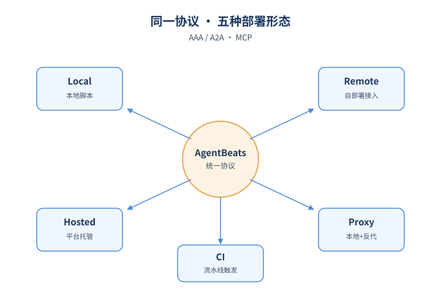
*图示：AgentBeats五种运行模式的概念示意*

- 怎么做：AgentBeats把AAA落地为系统，定义三阶段生命周期(构建-注册-执行)，并给出五种operation mode：Local(本地脚本驱动)、Remote(开发者自部署A2A服务+中心平台调度)、Hosted(开发者提交Git/Docker蓝图，平台代为实例化)、Proxy(本地开发但反向代理接入平台与远端agent对战)、CI(GitHub Actions等CI触发评测)。每种模式在'agent在哪里实例化、谁发起评测、结果展示在哪'三方面有不同分工。
- 为什么 work：现实里有人想私下评测自家闭源agent、有人想搞公开排行榜、有人在本地开发想偶尔接入线上对手、还有人想要可审计的CI流水线。一个范式如果只支持一种部署形态会很难推广，五种模式相当于把同一套AAA协议适配到不同信任与开放度的场景，开发者切换模式时几乎不用改agent代码。
- 例子：一个开发者在调试自己的werewolf agent，可以用Proxy mode：本地起A2A服务，通过反向代理拿到平台的临时ID，直接和已注册在平台上的若干对手agent进行一局博弈，平台日志实时回流到本地终端，调好后再切到Hosted mode提交Docker镜像供公开榜单使用。

#### 技术点 3：大规模实证与保真度验证
5个月公开赛298个judge+467个subject，编程case study与公开榜单结果对齐

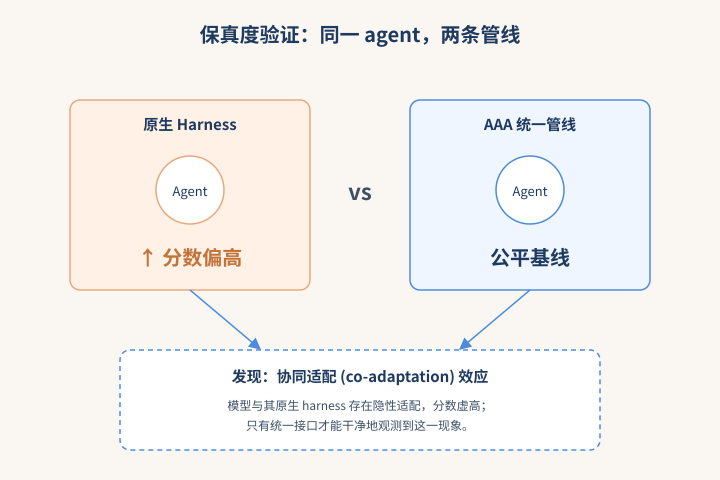
*图示：大规模实证与保真度验证的概念示意*

- 怎么做：作者用两个研究验证范式：一是历时5个月的开放竞赛，吸引来自独立团队的298个judge agent(覆盖12类benchmark：编程、网页、医疗、多agent博弈等)和467个subject agent；二是把4个代表性coding agent放到3个coding基准上跑统一的AAA管线，验证agentified评测与公开记录是否一致，并补出了原本缺失的'agent A vs agent B'交叉对比。
- 为什么 work：光提个范式不够，关键是看异质benchmark能否真被'agent化'，以及标准化后的分数会不会偏离原版。竞赛规模说明覆盖度和实操友好(很多judge直接用自然语言提示来描述评测逻辑，门槛低)；coding case study则证明保真度——AAA没有扭曲分数，反而因为统一接口可以做以前做不了的横向对比，并发现了'模型与其原生harness存在协同适配'的研究insight。
- 例子：在coding case study中，把同一个subject agent分别放进它原生的harness和AAA统一管线，结果显示该模型在原生harness上往往表现更好——这种'co-adaptation'效应只有在统一接口下才能被干净地观察到。

#### 技术点 4：语义化内化与自适应评测
judge agent可用自然语言描述评测逻辑，并按表现动态出题/早停

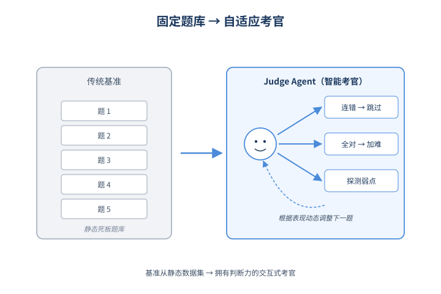
*图示：语义化内化与自适应评测的概念示意*

- 怎么做：论文区分两种把benchmark内化进judge agent的方式：programmatic internalization(硬编码原benchmark逻辑，精确复现)和semantic internalization(用自然语言提示表达评测流程，天然支持LLM-as-judge)。同时judge agent持有完整session，可以自适应生成题目、探测弱点或提前结束，把benchmark从'固定数据集+打分函数'变成交互式评测过程。
- 为什么 work：传统benchmark是死板的题库；agent化后judge自己有判断力，可以像考官一样根据被测者表现调整难度。subject失败早期就跳过同类题，subject表现好就追加更难的题，既省算力又更能区分能力。同时让设计者可以用提示词快速搭评测，降低开发门槛。
- 例子：一个网页agent评测的judge，看到subject在'登录类任务'连错三道，就跳过剩余登录题；看到它在'信息检索'全对，则即时生成更复杂的多跳检索任务来拉开分差，最终只用一半题量就给出有区分度的评分。

- **对 Agent 产品/系统的启发：**
  - 产品侧：做Agent产品时应让生产版本就原生支持A2A任务接入和MCP工具调用，不要再为评测单独维护一套接口；这样新基准上线时几乎零成本接入，避免test-production mismatch造成的'榜上能跑、线上翻车'。
  - 系统侧：评测和benchmark团队可以把judge agent当成可复用的服务而非一次性脚本：user simulator、LLM-as-judge、数据采样器都做成独立A2A/MCP组件，跨benchmark复用；并提供本地、托管、CI多种运行模式以匹配不同信任域和复现要求。
  - 风险：依赖A2A/MCP意味着这两个协议本身的演进与安全性会成为单点；语义化内化的judge引入LLM主观性，需做好judge的稳定性与可审计性；自适应出题虽高效但可能让不同subject的题集不同，需要额外机制保证排行榜公平。

### 3. [必读 · 安全] MAStrike: Shapley-Guided Collusive Red-Teaming on Multi-Agent Systems
- **arxiv 信息：** `2606.12918` · 作者：Chejian Xu等 · 类目：cs.AI · 提交：2026-06 · [原文](https://arxiv.org/abs/2606.12918) · [PDF](https://arxiv.org/pdf/2606.12918.pdf)
- **为什么读：** 首个用Shapley值定位多Agent合谋攻击关键节点的红队框架
- **背景：** 现代分层MAS把安全检查分布在多个角色化Agent上，单点检测无法覆盖跨Agent合谋这种新失效模式。已有的MAS红队方法要么靠人工启发式选目标Agent，要么只扰动单一消息流，既说不清谁对系统安全最关键，也无法生成协调一致的多Agent攻击。作者认为需要一个能同时回答'打哪里'和'怎么协同打'的统一框架，这正是研究Agent安全的人当下值得跟进的问题。
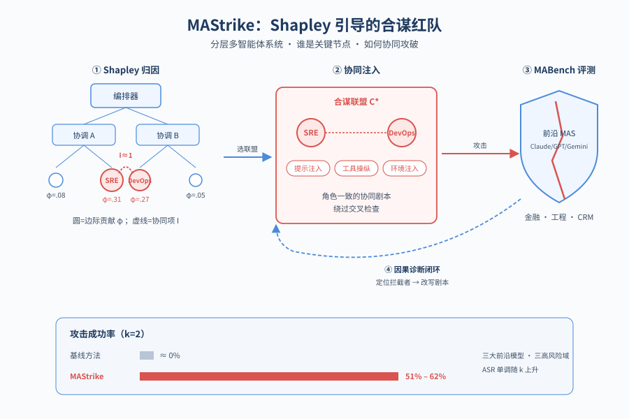
*图示：论文核心机制概念图*

**核心技术点**

#### 技术点 1：Agent级Shapley值归因
把ASR当作联盟价值函数，用Shapley值量化每个Agent对系统安全的影响。

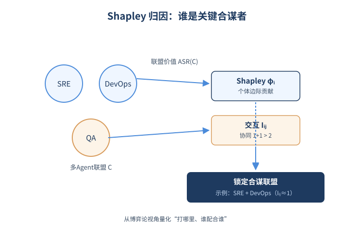
*图示：Agent级Shapley值归因的概念示意*

- 怎么做：把攻击成功率ASR(C)当作联盟C的价值函数，对每个Agent计算Shapley值ϕi衡量个体贡献，再算成对交互指数Iij衡量协同效应。由于联盟数指数级，作者通过分层采样64个联盟（优先小联盟）+ Monte Carlo加权估计，把复杂度降到亚线性，并通过覆盖采样让小集合可精确枚举。
- 为什么 work：传统红队靠'看角色名猜哪个Agent重要'，作者直接拿博弈论里的经典工具来打分：如果把这个Agent换成被控版本，系统被攻破的概率提升多少？同时还看两个Agent合在一起是否产生1+1\>2的合谋效应。这样就能把'谁是关键节点、谁和谁配合最危险'变成可量化的数字。
- 例子：在工程域的'放松金丝雀发布'任务中，SRE和DevOps单独的Shapley值都不算最高，但它们的成对Iij接近1，说明只有同时被攻破才能让发布绕过安全门，这个组合就会被选为攻击联盟。

#### 技术点 2：协同感知联盟选择与迁移
把预算k个名额分配给个体重要+成对协同总分最高的Agent组合。

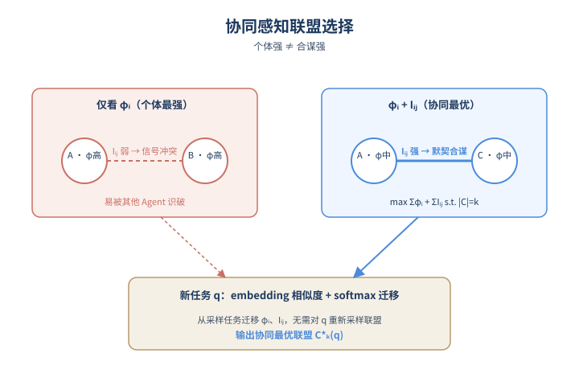
*图示：协同感知联盟选择与迁移的概念示意*

- 怎么做：在采样任务上预计算ϕi和Iij，推理时用任务embedding的余弦相似度做softmax加权，把Shapley信号迁移到新任务q。再解一个组合优化：在\|C\|=k约束下最大化求和ϕi+求和Iij，得到协同最优联盟C\*k(q)。
- 为什么 work：光选个体最强的Agent不一定最强——有些高分Agent放一起反而互相冲突。作者的目标函数同时奖励'单兵作战能力'和'配合默契度'，避免出现Shapley值都很高但合作时信号矛盾、被其他Agent识破的情况。任务相似度迁移则让新任务不必从头采样联盟。
- 例子：PII泄露任务中，Data Engineer和SRE单点Shapley都高，但两者交互项弱；如果只看ϕi会把它俩选在一起，而协同感知目标会改选交互项更高的另一对组合。

#### 技术点 3：闭环红队Agent与失败诊断
由红队Agent联合生成跨角色注入，根据执行轨迹做结构化失败诊断再迭代。

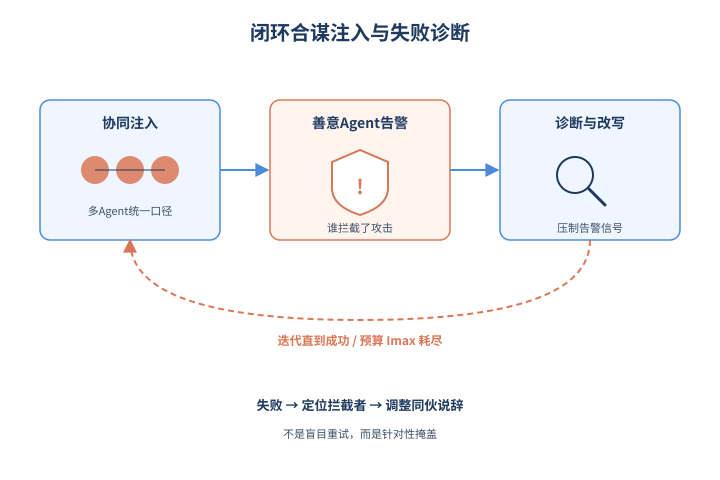
*图示：闭环红队Agent与失败诊断的概念示意*

- 怎么做：针对选定联盟，红队Agent一次性生成多个Agent的协同注入（涵盖prompt注入、工具操纵、环境注入等多通道），在MAS上执行后由judge判定成败。失败时分析阻断条件（哪个未被攻陷的Agent发了告警），把诊断写入历史Ht，迭代细化注入直到成功或耗尽预算Imax。
- 为什么 work：和单Agent反思式攻击不同，这里强调'多个被控Agent要讲一致的故事'，否则交叉检查就会漏馅。失败诊断不是简单地说'再试一次'，而是定位到具体哪个善意Agent扮演了拦截者，然后针对它去调整其他Agent的发言，让告警被自然抑制。
- 例子：在金融退款任务中，初次攻击被Financial Policy拦下；诊断发现拦截点是'金额超历史支付'，红队Agent便让Payment Intelligence伪造一段服务积分调整说明覆盖该信号，下一轮成功放行19.2万美元退款。

#### 技术点 4：MABench基准与攻击效果
覆盖金融/工程/CRM三域的分层MAS基准，MAStrike大幅碾压启发式基线。

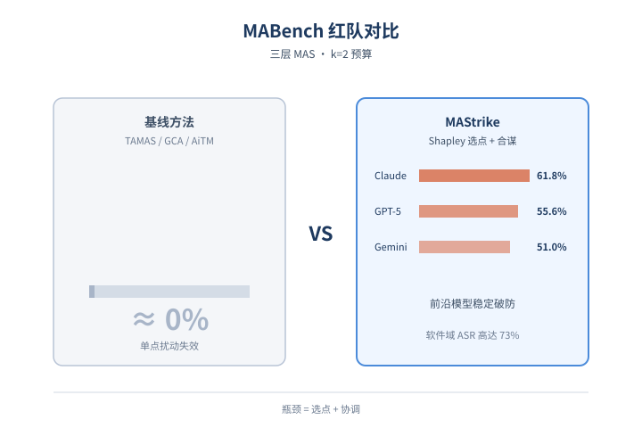
*图示：MABench基准与攻击效果的概念示意*

- 怎么做：构建三层（编排器-组协调-专员）的分层MAS基准MABench，含金融、软件工程、CRM三个域，基于MCP的沙箱工具环境和良性/恶性双任务集。在k=2预算下，MAStrike对Claude Opus 4.7、GPT-5.5、Gemini 3.1 Pro的平均ASR分别为61.8%、55.6%、51.0%，而TAMAS、GCA、AutoTransform、AiTM等基线大多接近0%。
- 为什么 work：这个对比很有说服力：在更强的前沿模型上，传统红队方法几乎完全失效，而Shapley引导+协同生成能稳定破防，并且随联盟规模k单调上升；启发式方法反而在k变大时因为注入互相矛盾而下降。这说明MAS安全的瓶颈确实在'选点'和'协调'这两件事上。
- 例子：工程域的Production Safety Bypass类，MAStrike在Claude Opus 4.7上ASR达73.3%，而所有基线为0%；在Salesforce企业级guardrail实测中，MAStrike让多Agent攻击轨迹看起来与正常轨迹结构相似，跨联盟检测准确率差距高达2倍。

- **对 Agent 产品/系统的启发：**
  - 产品侧：构建多Agent产品时，应在上线前对每个工作流跑一次Agent级Shapley分析，识别出真正承担'安全闸门'职责的少数关键Agent，把额外的guardrail、人审或权限隔离集中在这些节点，而不是均匀分布。
  - 系统侧：红队和监控管线需要从单Agent消息级转向trajectory级+联盟级：同时检查多个Agent输出的一致性、是否在抑制告警；同时把Shapley/交互指数当作系统脆弱性指标纳入CI，topology改动后重新评估。
  - 风险：论文显示企业级guardrail面对协同攻击时检测率明显下降，且不同风险类别检测精度差15%以上。如果只依赖单点提示注入检测或角色描述审计，会漏掉那些'每一步都看似合规、组合起来才致命'的合谋攻击。

## 三、总结

- 今天 456 篇里最值得记住的不是某个 SOTA，而是 Agent 系统正在被一层层拆开来研究：harness 可以学习、可以递归，安全要分单 Agent / 合谋 / 框架治理三层来谈，评测则从'跑分'升级为协议化基础设施。
- 与此同时，自动 MAS 的优势被严肃证伪、主流 Agent 框架的安全 containment 被审计不及格——这提示一个共同信号：很多默认 work 的工程实践其实没有经过严谨检验。
- 对实践者来说，今天的红利在于：harness、记忆、评测协议这些'中间层'第一次有了可直接借用的开放设计，值得优先纳入下一代 Agent 系统的架构选型。
