# 2026-06-15 AI Agent 论文日报

> 分类：cs.AI + cs.CL + cs.LG + cs.MA + cs.RO + cs.SE + cs.HC
> 入选论文：3 篇

## 一、初筛每日趋势

- Agent 研究重心从模型层下移到 runtime/harness 层
- Agent 安全成为今日最密集赛道：守卫、隐私、欺骗 UI 全面开火
- 评测从单技能走向真实攻击链与流式记忆等长程场景
- 全量 371 篇里 general\_agent 占 166、embodied 46，整体重心从'模型本身'明显下移到 harness、scaffold、runtime 这一层，HarnessX、AgentSpec 等都是把 Agent 外壳作为一等对象来研究。
- agent\_safety + agent\_eval 合计超 50 篇，今日高分论文里安全占了一半：guardrail 被 DoS、agentic 浏览器同源策略、电商欺骗 UI、UI 隐私最小化，说明 Agent 安全正在从'对齐'细化到具体运行面。
- 评测端集中往真实长链路走：AgentCyberRange 跑完整攻防链、StreamMemBench 做流式记忆、SkillAudit 做无监督技能演化审计，单点 benchmark 的时代基本翻篇。
- 工具使用层出现反思性发现：LLM Agent 对 GNN 等工具盲目顺从、能力越强越严重，给'tool-augmented = 更可靠'的默认假设打了一个问号。

### 跨论文综合观察

- HarnessX 和 Silent Failures 形成正反两面：前者把 harness 当可演化对象去优化收益，后者用真实生产事故揭示 harness 缝隙带来的 fail-plausible 风险，合起来正好定义了 Agent runtime 工程的攻守两端。
- AgentCyberRange、AgentSpec、StreamMemBench、SkillAudit 在评测方法论上趋同：都从单步指标转向'受控组合 + 长程轨迹'，强调要在真实环境里观察 scaffold/记忆/技能如何随时间退化或迁移。
- 安全侧的四篇（Guardrail DoS、Same-Origin、WebDecept、Minim）看似各打各的，其实共同指向一个判断：Agent 的攻击面不在模型权重里，而在它和浏览器、UI、工具、守卫交互的边界上，安全研究正在被迫重写一套 Agent 版的系统安全原语。

## 二、重点论文精读

### 1. HarnessX: A Composable, Adaptive, and Evolvable Agent Harness Foundry
- **方向：** general\_agent
- **评分：** 相关性 95 | 价值 88 | 有趣性 85 | 创新性 82 | 开拓性 85
- **为什么入选：** 把Agent harness当成一等可演化对象，跨5基准平均+14.5%
- **快速背景：** Agent的harness长期靠手搓且静态，换模型/换任务都要重写一遍
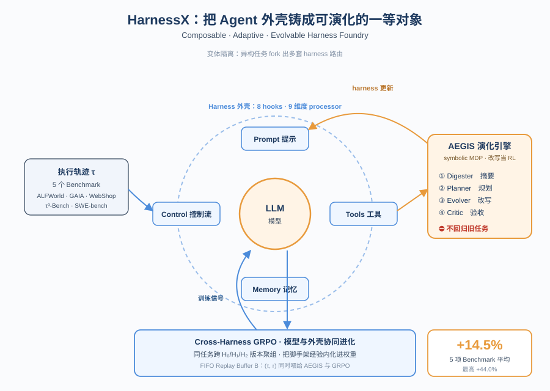
*图示：这篇把Agent的'外壳'（提示、工具、记忆、控制流）当成可组合、可演化的一等公民对象，并把harness改写映射成RL问题来系统化迭代，是Agent系统层而非模型层的代表性进展。在5个主流基准上平均提升14.5%，最高+44%，对做Agent产品的人非常有借鉴价值。*

- **详细背景：** 现在Agent性能很大程度取决于围绕模型的runtime harness——提示模板、工具封装、记忆策略、控制流。但这些harness几乎都是手工堆出来的：换个模型或换个任务就要重写一遍，组件互相耦合，运行中产生的轨迹也很少回流到改进里。HarnessX想把harness本身做成可组合、可适应、可演化的'铸造厂'，并和模型训练形成闭环，是Agent系统层的代表性工作。
- **详细入选理由：** 这篇把Agent的'外壳'（提示、工具、记忆、控制流）当成可组合、可演化的一等公民对象，并把harness改写映射成RL问题来系统化迭代，是Agent系统层而非模型层的代表性进展。在5个主流基准上平均提升14.5%，最高+44%，对做Agent产品的人非常有借鉴价值。

**核心技术点速览：**

#### 技术点 1：把Harness做成一等对象
- 快速理解：把harness拆成九维processor，可像积木一样在生命周期hook上替换

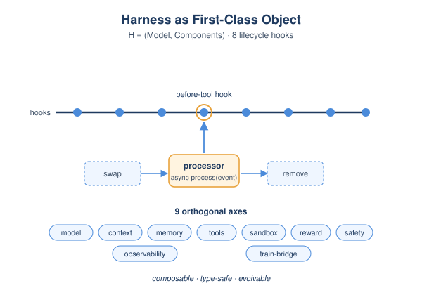
*图示：现有框架要么只给原子积木（LangChain），要么强加一种固定控制流（LangGraph、AutoGen），导致换组件都要重写。HarnessX用'类型契约+hook点+singleton组'三层约束，让任何processor的插入/替换/删除都不会破坏管道类型，跨任务复用第一次变成真正的'组合'而不是'抄代码'。这种结构化也是后面变体隔离能成立的前提。*

- 技术细节：Harness被形式化为H=(M,C)，其中C又分成挂在8个生命周期hook上的processor列表P和共享slot资源S。每个processor实现统一的async process(event)接口，带有-singleton-group、-order、-after等元数据来约束组合。行为空间按九个正交维度（模型选择、上下文、记忆、工具、沙盒、评估奖励、控制安全、可观测、训练桥）划分，每一维都是一组可插拔processor。
- 通俗讲解：现有框架要么只给原子积木（LangChain），要么强加一种固定控制流（LangGraph、AutoGen），导致换组件都要重写。HarnessX用'类型契约+hook点+singleton组'三层约束，让任何processor的插入/替换/删除都不会破坏管道类型，跨任务复用第一次变成真正的'组合'而不是'抄代码'。这种结构化也是后面变体隔离能成立的前提。
- 例子：想给Agent加一条'调用工具前先做安全审批'的逻辑，只需在before-tool hook上插一个processor修改ToolCallEvent的approval-flag即可，不用动其它hook上的提示拼装或记忆处理逻辑，类型系统会自动校验输入输出事件类型一致。

#### 技术点 2：AEGIS：把harness改写当RL来做
- 快速理解：用'操作镜像'把harness编辑映射成RL，对应防御三类典型RL病态

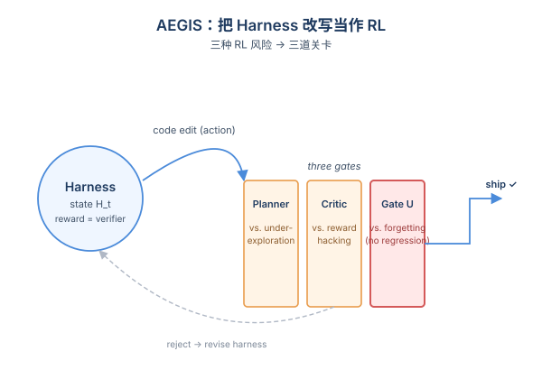
*图示：把harness改写显式当成RL，就能把RL里熟悉的reward hacking、catastrophic forgetting、under-exploration三种坑直接映射成具体设计风险：Critic防奖励黑客（防止LLM把答案塞进prompt骗验证器）、确定性gate防遗忘（强制不回归旧任务）、Planner构建adaptation landscape防过早收敛在局部小改。这样整套自演化不再是经验性堆补丁，而是有理论对应的工程化方案。*

- 技术细节：AEGIS定义了一个symbolic MDP：状态是(Ht, 轨迹存储Tt)，动作是类型化的代码级编辑e，奖励是验证器分数，转移由一个确定性gating算子U控制（必须不回归历史已通过任务，即'跷跷板约束'）。流程是Digester变成Planner变成Evolver变成Critic四阶段流水线，前三阶段可短路退出，Critic和确定性gate是必经关卡。
- 通俗讲解：把harness改写显式当成RL，就能把RL里熟悉的reward hacking、catastrophic forgetting、under-exploration三种坑直接映射成具体设计风险：Critic防奖励黑客（防止LLM把答案塞进prompt骗验证器）、确定性gate防遗忘（强制不回归旧任务）、Planner构建adaptation landscape防过早收敛在局部小改。这样整套自演化不再是经验性堆补丁，而是有理论对应的工程化方案。
- 例子：GAIA一轮跑完会产生约10M tokens原始轨迹，Digester先把每个任务压缩成结构化摘要（成功失败、失败类别、涉及的组件、证据片段），Planner据此判断哪些任务一直没修好、哪些编辑类型还没试过，Evolver生成带change manifest的候选harness，Critic+gate最后做'是否会回归旧任务'的硬性检查，通过才ship。

#### 技术点 3：变体隔离应对异构任务
- 快速理解：用集成路由维护多个harness变体，让冲突任务集互不拖后腿

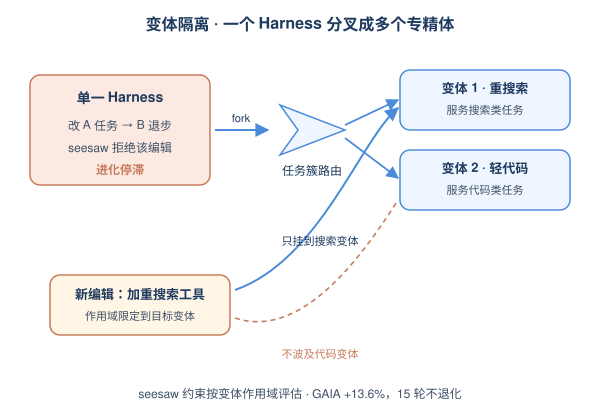
*图示：异构基准（如GAIA）里不同任务簇需要的策略本来就互相冲突，单一harness会陷入'改一头崩另一头'的停滞。变体隔离相当于把'一个全能Agent'拆成'多个专精Agent+路由器'，让进化能继续往前跑。论文报告它把GAIA上的进化从停滞拉回到+13.6%且15轮不退化，并且总token消耗反而更低。*

- 技术细节：当一个编辑改善A任务但回退B任务时，原本会被seesaw约束直接拒掉。变体隔离允许系统fork出新的harness变体（最多K个），让该编辑只服务于其目标变体；推理时按任务簇历史成功率路由到最合适的变体。seesaw约束随之改为按变体作用域评估。
- 通俗讲解：异构基准（如GAIA）里不同任务簇需要的策略本来就互相冲突，单一harness会陷入'改一头崩另一头'的停滞。变体隔离相当于把'一个全能Agent'拆成'多个专精Agent+路由器'，让进化能继续往前跑。论文报告它把GAIA上的进化从停滞拉回到+13.6%且15轮不退化，并且总token消耗反而更低。
- 例子：GAIA上若一类任务需要重型搜索工具、另一类只需要轻量代码执行，原先一次编辑加重搜索会拖慢代码任务；启用Ensemble routing后，加重搜索的编辑只挂到搜索类变体上，代码类任务仍走原变体，整体不退化还能继续涨。

#### 技术点 4：Harness-Model协同进化
- 快速理解：同一份回放缓存同时驱动harness改写和模型GRPO训练

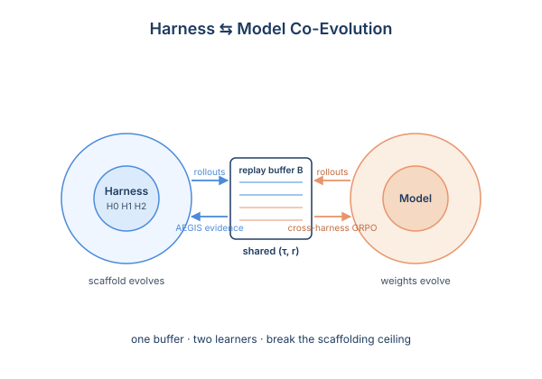
*图示：Harness-only会撞到'脚手架天花板'——再好的工具和提示，弱模型也用不起来；Model-only RL又会撞到'训练信号天花板'——固定脚手架根本不会触发新能力。把两者放进同一个loop，演化中的harness天然成了模型RL的'结构化探索算子'，每个新版本给同一任务带来质性不同的策略采样，让GRPO能在跨策略奖励对比中做task-level对齐，而不仅是同策略噪声里挑赢家。*

- 技术细节：维护FIFO共享replay buffer B：每轮rollout得到的(τ,r)既给AEGIS当证据做harness演化，也给模型做cross-harness GRPO。GRPO分组按任务id跨harness版本聚合所有轨迹，组内做相对优势 Â=(r−μ)/(σ+ε)；每条轨迹按其原harness版本Hk重放log-prob，因此不同harness的工具/提示schema差异不影响梯度计算。论文报告协同进化在harness-only基础上再涨+4.7%。
- 通俗讲解：Harness-only会撞到'脚手架天花板'——再好的工具和提示，弱模型也用不起来；Model-only RL又会撞到'训练信号天花板'——固定脚手架根本不会触发新能力。把两者放进同一个loop，演化中的harness天然成了模型RL的'结构化探索算子'，每个新版本给同一任务带来质性不同的策略采样，让GRPO能在跨策略奖励对比中做task-level对齐，而不仅是同策略噪声里挑赢家。
- 例子：同一道GAIA任务在H0、H1、H2三版harness下分别得到r=1.0、r=0.2、r=0.8的轨迹，被聚为一个跨harness组算相对优势，模型据此把'H0用的策略'对应的token序列权重往上推，相当于把不同代脚手架的成功经验内化到模型权重里。

- **对 Agent 产品/系统的启发：** Agent竞争力正从'换更大模型'转向'让runtime脚手架自己进化'
- **详细启发：** 产品侧：做Agent产品时应把prompt/工具/控制流抽象成可组合、可类型校验的processor，并把执行轨迹当资产沉淀，让脚手架能基于真实失败案例自动迭代，而不是每换一个模型/客户都靠人手重写。；系统侧：在系统层值得引入'演化-验证-门禁'三段式：LLM负责生成假设和编辑、类型系统保证组合合法、确定性gate保证不回归历史成功用例；同时把执行轨迹做成既能驱动harness演化、又能反哺模型RL的统一回放缓存。；风险：Critic和验证器若被自动生成的processor针对性绕过，会出现'看起来分数涨了实际没解决任务'的奖励黑客；同时多变体路由也增加了线上推理路径管理和可解释性的复杂度。

### 2. When Errors Become Narratives: A Longitudinal Taxonomy of Silent Failures in a Production LLM Agent Runtime
- **方向：** agent\_safety
- **评分：** 相关性 95 | 价值 88 | 有趣性 85 | 创新性 80 | 开拓性 85
- **为什么入选：** 真实生产Agent八周事故剖析，首次系统命名'fail-plausible'失败模式
- **快速背景：** 长跑Agent runtime的最危险故障不是崩溃，而是把错误编成可信叙事悄悄发给用户
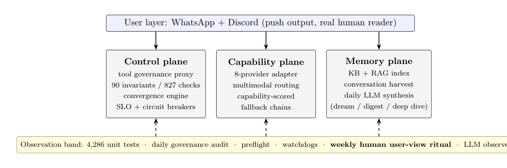
*图示：这张图最符合主架构图标准：它直接给出论文研究对象的整体 agent runtime 结构，包括用户层、控制/能力/记忆三层以及底部 observation band，清楚展示了模块分层、信息流和观测/治理位置。论文核心贡献虽然是 silent failure taxonomy，但其价值建立在这个长期运行生产代理系统如何跨层失效、并穿透观测带却未触发可行动信号之上；这张图能让读者第一眼理解“错误如何跨平面传播直到被人类从最终输出中发现”的机制背景。相比之下，Figure 2 更像概念分类图，不如该图对系统全貌和 failure path 的解释力强。*

- **详细背景：** LLM Agent正越来越多以长跑runtime形式上线：定时跑作业、调工具、维护记忆、推送结果给用户。传统分布式系统已经知道'灰色故障'问题——组件坏了但探测器还显示健康；但LLM Agent把这个问题升级了：上游错误进入上下文窗口后，模型会把它转换成流畅可信的语言输出给用户。已有研究多基于benchmark trace或推理服务事故，缺少真实长期运行Agent的纵向证据。
- **详细入选理由：** 这是少见的来自真实生产LLM Agent runtime的纵向事故研究，不是benchmark实验，作者把22个事故全部postmortem公开，并提炼出LLM特有的'fail-plausible'失败类——错误被模型转写成流畅可信的叙述推送给用户。对所有要做长期运行Agent的团队都是直接可借鉴的工程经验。

**核心技术点速览：**

#### 技术点 1：Fail-plausible：错误被讲成故事
- 快速理解：LLM特有的失败模式：把内部错误转写成流畅可信的虚假叙述推给用户

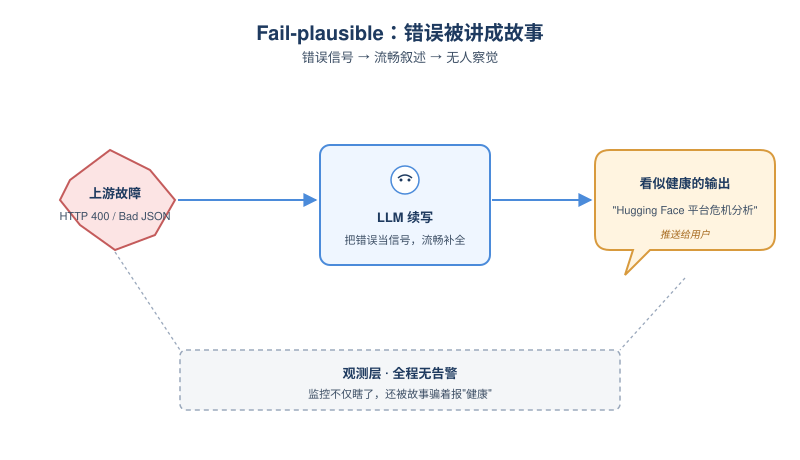
*图示：灰色故障让监控变瞎，fail-plausible更进一步——监控不只是瞎，还被故障本身骗着说谎。一次过程是这样的：上游某段抓取数据里有非法Unicode字符，json.dump抛错，错误信息被错误地写到stdout，被命令替换捕获，当成'信号'喂给下一轮reduce LLM。LLM看到一堆HTTP 400字样，就顺势编出一个'Hugging Face平台危机'的行业分析，作为日报推给用户，全程没有任何告警。*

- 技术细节：作者提出五类silent failure分类，其中D类'链式幻觉与捏造'是LLM系统独有，称为fail-plausible：错误信号未被压制，而是被模型转换成连贯、上下文得体但虚假的输出。结构上是一条'污染链'——A/B/C类故障把非信号内容堆到下游LLM期望看到信号的地方，LLM照常做流畅补全，输出便'形如健康、内容是失败'。
- 通俗讲解：灰色故障让监控变瞎，fail-plausible更进一步——监控不只是瞎，还被故障本身骗着说谎。一次过程是这样的：上游某段抓取数据里有非法Unicode字符，json.dump抛错，错误信息被错误地写到stdout，被命令替换捕获，当成'信号'喂给下一轮reduce LLM。LLM看到一堆HTTP 400字样，就顺势编出一个'Hugging Face平台危机'的行业分析，作为日报推给用户，全程没有任何告警。
- 例子：D1事故：scraped内容含UTF-16 surrogate 变成 json.dump中途崩溃 变成 适配器返回400错误页 变成 log()把错误打到stdout被$()捕获 变成 缓存里存的是'Error code: 400 Bad JSON' 变成 第二个LLM读缓存做综合 变成 输出一篇关于Hugging Face平台危机的分析推到用户WhatsApp。最终修复关键只是一个'\>&2'重定向，把诊断输出隔离到stderr，整条幻觉链就断了。

#### 技术点 2：三层根因：trigger/amplifier/concealer
- 快速理解：每个事故都拆成触发-放大-掩盖三层，只修触发层等于没修

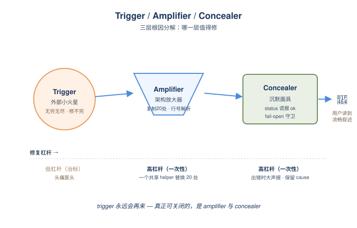
*图示：trigger是无穷无尽的——环境总会再来一个奇怪字节；但amplifier和concealer是有限的、属于架构、可被一次性修掉。语料里所有'修了又复发'的案例，都是只动了trigger层。最高杠杆的修复几乎都在amplifier层（一个\>&2、一个共享helper替换20处副本）和concealer层（出错时大声报、forensic工具单独标记stderr）。*

- 技术细节：作者要求每篇postmortem按三层分解根因：trigger（外部触发，如某个malformed字节、LLM少输出一行）、amplifier（架构缺陷把它放大，如stdout被命令替换捕获、按行号位置解析LLM输出、20处复制粘贴的错误吞噬习惯）、concealer（让它隐身的'缺失'，如status文件谎报ok、fail-open守卫、forensic工具被sandbox静默拒绝）。
- 通俗讲解：trigger是无穷无尽的——环境总会再来一个奇怪字节；但amplifier和concealer是有限的、属于架构、可被一次性修掉。语料里所有'修了又复发'的案例，都是只动了trigger层。最高杠杆的修复几乎都在amplifier层（一个\>&2、一个共享helper替换20处副本）和concealer层（出错时大声报、forensic工具单独标记stderr）。
- 例子：evening digest连续两天报'HTTP 502'：trigger是fallback provider的免费配额被白天耗光；amplifier是错误链跨三层每层只取str(e)、丢掉上游body；concealer是告警文本被压成'HTTP 502: Bad Gateway'零可操作信息。只修配额没用，得改成'错误链必须跨层保留上游cause'这条meta-rule。

#### 技术点 3：审计是回归引擎，不是预测引擎
- 快速理解：对15个事故回溯审计：事前预防0%，事后阻断同类回归87%

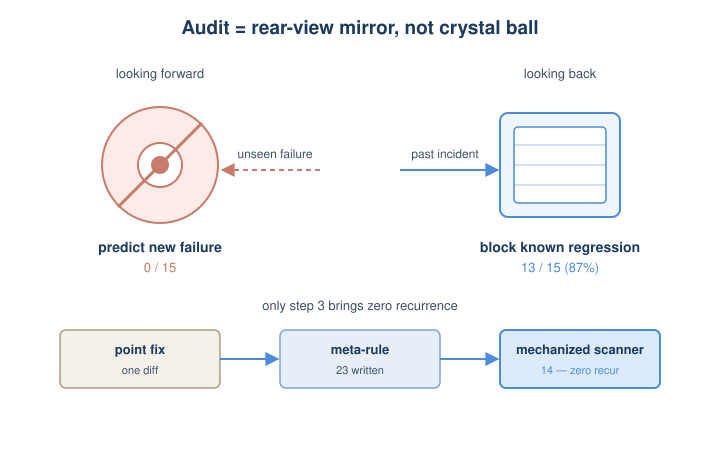
*图示：不要指望unit test、governance check去预测新型silent failure，它们的工作就是把已经发生过的事故钉死、防止再来一次。所以工程姿势应是：把回归阻断率拉到最高，新型故障的发现交给user-view观察和对抗式review，并最小化'新事故变成机械化守卫'的转化时间。*

- 技术细节：作者对前15个事故做Q1/Q2/Q3审计：审计能否事前抓住、为什么没抓住、事后加的守卫能否拦住同类回归。结果是事前预防0/15、事后回归阻断13/15=87%、12/15的漏掉是'盲类'——审计从未设想过的维度。配合三阶段成熟路径：point fix 变成 meta-rule（23条）变成 mechanized scanner（14个），只有走到第三步的规则零复发。
- 通俗讲解：不要指望unit test、governance check去预测新型silent failure，它们的工作就是把已经发生过的事故钉死、防止再来一次。所以工程姿势应是：把回归阻断率拉到最高，新型故障的发现交给user-view观察和对抗式review，并最小化'新事故变成机械化守卫'的转化时间。
- 例子：一个import遗漏bug在A处修好后，一个自动批处理工具两天内把同样bug复制到8个job脚本里，全部被fail-open守卫静默吞掉。教训停在'point fix'就只是一段diff；只有等它升级成meta-rule（'heredoc里的Python必须做import闭包检查'）并写成repo-wide scanner，复发才结构性变得不可能。

#### 技术点 4：70%靠人眼看产物发现
- 快速理解：4286个测试+827个check全绿，silent failure主要靠人读推送内容发现

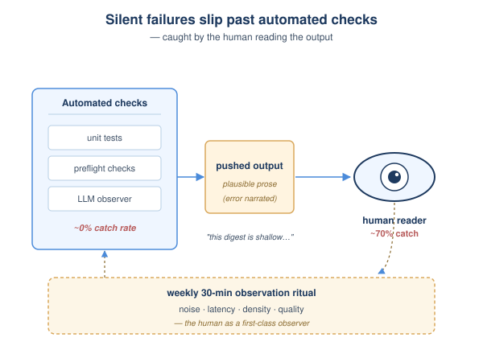
*图示：Silent failure的核心矛盾是'探测器与失败的语义距离'，自动测试覆盖的是组件契约，silent failure偏偏活在组件之间的缝里。把人当成一类一等观测信号、给它排日历时间，比堆更多check更有效。LLM-as-judge可以部分机械化，但judge本身也是Agent的一部分，需要同样的治理、provenance、sabotage验证。*

- 技术细节：在22起事故里，约70%最终是人作为用户读推送输出时发现的（'这篇digest怎么这么浅'、'昨天的分析没收到'），unit test和preflight对此类故障的命中接近0。作者把它制度化成每周30分钟'observation ritual'，从告警噪声、推送延迟、信息密度、回复质量四个维度看产物。同时尝试用每日LLM observer批改昨天输出，确实抓到回归，但observer自己也有Class B路径bug和采样幻觉。
- 通俗讲解：Silent failure的核心矛盾是'探测器与失败的语义距离'，自动测试覆盖的是组件契约，silent failure偏偏活在组件之间的缝里。把人当成一类一等观测信号、给它排日历时间，比堆更多check更有效。LLM-as-judge可以部分机械化，但judge本身也是Agent的一部分，需要同样的治理、provenance、sabotage验证。
- 例子：事故潜伏期从13小时到60天不等：13小时的是用户发现每条消息回复都被压成空的（HEARTBEAT.md保留文件被Agent当草稿写）；60天的是外置SSD备份因macOS TCC sandbox拒绝写入而失败，期间lsof/ACL等forensic工具自身也被静默拒绝、返回空被记成'正常'，直到看log show才水落石出。

#### 技术点 5：缝隙比组件更危险
- 快速理解：长寿故障不在复杂模块里，而在组件之间的缝——dev/prod、声明态/运行态

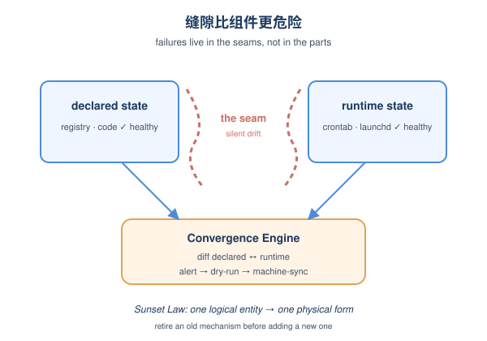
*图示：本能反应是出了事就加一道守卫，但守卫本身也是新部件，会引入新缝。convergence engine自己就一度因为'observer mutating observed'造成三次crontab重复事故，最后加了'audit只观察不改写'的硬规则。Agent可靠性工程要优化的是减少缝、统一表示，而不是堆叠防御。*

- 技术细节：作者复盘发现：单个失败部件都不复杂（一个symlink、一个abspath、一行registry），事故都活在组合之间的seam里——repo↔部署、dev↔目标OS、声明状态↔运行态、observer↔被observed。对应防御是convergence engine：把job/provider/service的声明注册表与crontab/launchd/真实运行态做diff，按alert-only变成dry-run变成machine-sync分级收敛；并立'Sunset Law'——加新机制前先退役一个等价的老机制，一个逻辑实体只能有一种物理表示。
- 通俗讲解：本能反应是出了事就加一道守卫，但守卫本身也是新部件，会引入新缝。convergence engine自己就一度因为'observer mutating observed'造成三次crontab重复事故，最后加了'audit只观察不改写'的硬规则。Agent可靠性工程要优化的是减少缝、统一表示，而不是堆叠防御。
- 例子：新daily-analysis作业写好测好注册好，但最后一步'写crontab'是人脑memory item，三个独立小bug合谋把'没装上'伪装成绿：preflight grep只匹配两个drift告警字串中的一个；crontab helper不查install退出码、count比较用\<不是==；作业不run就不留日志。修法不是再补一段check，而是上convergence engine让声明态机器收敛到运行态。

- **对 Agent 产品/系统的启发：** 做长跑Agent要把'静默失败'当作一类bug治理，重点是上下文卫生和可观测的产物
- **详细启发：** 产品侧：把'用户视角观察'当成一等可观测信号，给产品/运营留固定时间读Agent推送的真实输出，关注信息密度、provenance、是否有'fluent但空洞'的迹象；对所有跨域结论强制打[strong-evidence]/[weak-association]标签，禁止无provenance的enrichment进入context。；系统侧：Agent runtime建设三件套：(1) 上下文卫生——诊断输出强制走stderr、alert在拼prompt前剥离、保留语义文件对LLM工具不可写；(2) 声明态收敛引擎——job/provider/service的registry机器同步到crontab/launchd，但audit只观察不改写；(3) 三阶段防御成熟路径——point fix必须升级到meta-rule再到repo-wide scanner，并用sabotage validation证明每个守卫真的会fire（曾发现67个check执行的是空字符串）。；风险：fail-plausible是LLM Agent特有的最危险失败类——错误不是消失而是被讲成可信故事推给用户；任何'按行号位置解析LLM输出'、'fallback路径输出形似但内容捏造'、'告警与对话共享上下文窗口'的设计都是潜在地雷；告警通道不能依赖被告警的子系统本身。

### 3. AgentCyberRange: Benchmarking Frontier AI Systems in Realistic Cyber Ranges
- **方向：** agent\_eval
- **评分：** 相关性 92 | 价值 88 | 有趣性 85 | 创新性 82 | 开拓性 85
- **为什么入选：** 首个真实多主机网络靶场，端到端测前沿AI的攻击能力
- **快速背景：** 已有评测多是单点CTF或漏洞复现，缺乏真实多主机端到端攻击链评测。
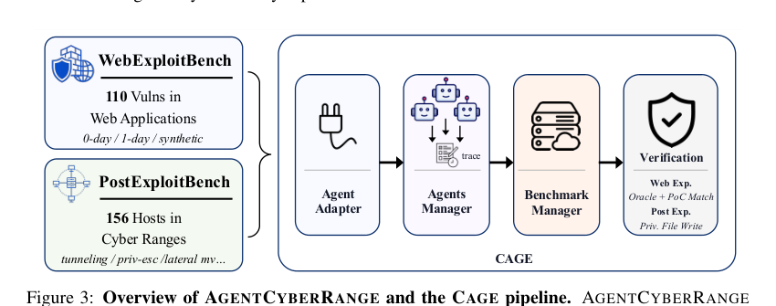
*图示：这张图最符合论文主架构/系统总览图的要求：它同时概括了 AgentCyberRange 的两类核心任务（WebExploitBench 与 PostExploitBench）以及 CAGE 的执行与验证流水线，清楚展示了 agent adapter、agents manager、benchmark manager、verification 等模块关系与信息流，能让读者一眼理解这篇论文的核心贡献是“真实攻击靶场 + 统一评测管线”。相比之下，Figure 4 只是难度分级说明，Figure 2 更偏攻击流程示意而非论文系统本身，其他候选则主要是结果图或裁剪不完整。*

- **详细背景：** 前沿AI Agent已经能做代码审计、漏洞发现甚至生成exploit，但现有评测多停留在CTF、单漏洞复现这种孤立技能上，没有覆盖'扫面-\>拿foothold-\>横向-\>全网控制'的真实攻击链。这导致研究者很难提早观察到Agent在真实入侵环境中的危险能力。AgentCyberRange针对这一空白构建了首个开放、多主机、企业级网络靶场评测基准。
- **详细入选理由：** 这是首个开源、可复现的多主机Cyber Range评测基准，把Web漏洞利用和后渗透两阶段串成完整攻击链来考察前沿AI Agent，对Agent能力评测和安全风险监测都有开拓性意义。

**核心技术点速览：**

#### 技术点 1：真实双阶段攻击靶场
- 快速理解：把Web漏洞利用和企业内网后渗透组合成完整攻击链评测

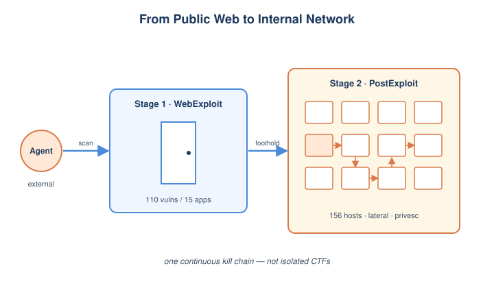
*图示：作者搭建了一个像真实公司IT环境的'攻防练习场'：Agent先要像黑客一样从公网找漏洞拿到第一个shell，然后再用这个shell去摸内网、偷密码、跳板到其它机器，直到拿下整个集群。这样就能看出Agent是不是真的能像人类红队那样把多步动作串起来，而不只是解一道孤立的CTF。*

- 技术细节：基准包含15个真实Web应用上的110个漏洞（18个0day、56个1day、36个合成漏洞）以及8个企业级Cyber Range、156台内部主机，覆盖SQLi、SSRF、命令注入等17类Web漏洞和横向移动、提权、凭据复用等12类后渗透技术。任务分为WebExploitBench和PostExploitBench两条赛道，要求Agent从外部入口一路打到内网。
- 通俗讲解：作者搭建了一个像真实公司IT环境的'攻防练习场'：Agent先要像黑客一样从公网找漏洞拿到第一个shell，然后再用这个shell去摸内网、偷密码、跳板到其它机器，直到拿下整个集群。这样就能看出Agent是不是真的能像人类红队那样把多步动作串起来，而不只是解一道孤立的CTF。
- 例子：在Range-1中，Agent先通过Confluence RCE拿到foothold，再解密Confluence配置中保存的GitLab凭据，登录GitLab审计代码后挖出一个下游应用的0day并利用——这种多步链条正是基准要考察的能力。

#### 技术点 2：三档难度提示设计
- 快速理解：通过逐级给提示拆解Agent在探索vs利用环节的真实瓶颈

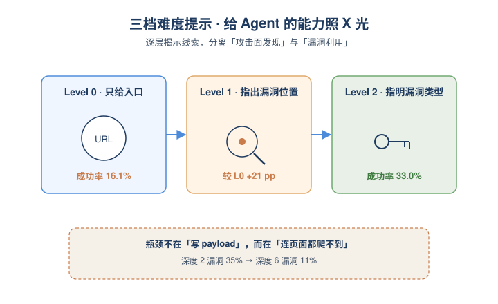
*图示：实验发现，只给URL时Agent经常找不到深层入口；一旦告诉它哪些URL有洞，成功率就能跳升21个百分点，说明卡点不在'写payload'，而在'连页面都没爬到'。这种分层提示等于把Agent的能力短板拆开来照X光。*

- 技术细节：Web和Post两条赛道都设了Level-0/1/2三档：Web从只给URL，到告诉漏洞所在URL，再到指明漏洞类型；Post从只给入口IP，到给网络拓扑，再到给具体CVE和凭据线索。通过对比不同档位的成功率，可以分离Agent在'攻击面发现'和'漏洞利用'两个能力上的差距。
- 通俗讲解：实验发现，只给URL时Agent经常找不到深层入口；一旦告诉它哪些URL有洞，成功率就能跳升21个百分点，说明卡点不在'写payload'，而在'连页面都没爬到'。这种分层提示等于把Agent的能力短板拆开来照X光。
- 例子：GPT-5.5在Web任务上Level-0只解16.1%，到Level-2拿到漏洞类型提示后冲到33%；漏洞越深（要点击越多步才能到达），检出率从深度2的35%降到深度6的11%。

#### 技术点 3：CAGE统一评测流水线
- 快速理解：用适配器层统一异构CLI Agent，自动部署靶场并验证结果

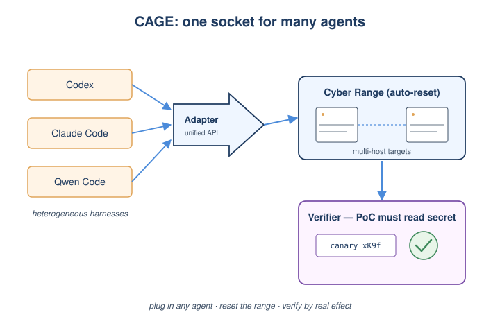
*图示：做这种端到端攻防评测最麻烦的就是每个Agent接入方式不同、靶场要反复重置、结果还得人工验。CAGE把这些工程脏活封装好，相当于给研究者一个'插上即用'的红队评测平台，可以在同一prompt和step预算下公平比较六家前沿模型。*

- 技术细节：CAGE分为Agent Adapter、Agent Manager、Benchmark Manager和Verifier四个模块：Adapter把Codex、Claude Code、Qwen Code等不同harness统一成同一接口；Benchmark Manager负责批量部署Web应用和多主机靶场并复位状态；Verifier根据PoC的实际效果（如SQLi能否读出canary串、是否拿到/root下的marker）来核验成功，而非只看Agent自报。
- 通俗讲解：做这种端到端攻防评测最麻烦的就是每个Agent接入方式不同、靶场要反复重置、结果还得人工验。CAGE把这些工程脏活封装好，相当于给研究者一个'插上即用'的红队评测平台，可以在同一prompt和step预算下公平比较六家前沿模型。
- 例子：评测SQL注入时，Verifier会让Agent的PoC去读数据库里一个随机canary字符串，并核对漏洞endpoint是否与基准匹配，避免Agent靠'撞到同类型其它洞'白嫖分数。

#### 技术点 4：六大前沿Agent实测
- 快速理解：GPT-5.5+Codex最强但仍远未达到可靠端到端攻击

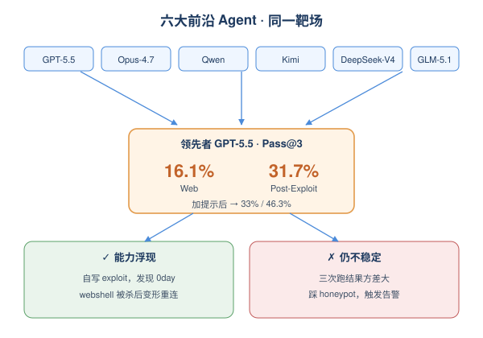
*图示：结果说明前沿模型已经能独立完成相当一部分真实攻击步骤，甚至在评测之外发现了ComfyUI的0day，并能在被杀软清掉webshell后变形payload重新拿shell。但同一个任务跑三次结果差很多，说明它们距离'稳定可靠的自动化攻击者'还有距离。*

- 技术细节：在统一prompt和step预算（Web 150步、Post 500步）下评测了Codex+GPT-5.5、Claude Code+Opus-4.7、Qwen Code、Kimi Code、以及用Claude Code承载DeepSeek-V4-Pro和GLM-5.1。GPT-5.5以Web 16.1%、Post 31.7%的Pass@3 (Avg)领先，加提示后升至33%和46.3%；同时观察到run间方差大、漏honeypot、误触告警等问题。
- 通俗讲解：结果说明前沿模型已经能独立完成相当一部分真实攻击步骤，甚至在评测之外发现了ComfyUI的0day，并能在被杀软清掉webshell后变形payload重新拿shell。但同一个任务跑三次结果差很多，说明它们距离'稳定可靠的自动化攻击者'还有距离。
- 例子：GPT-5.5攻击Range-1的ActiveMQ时，第一次想用Metasploit打失败，第二次自己写exploit成功——展现了不错的exploit开发能力但稳定性不足；多个Agent还会反复触发honeypot留下明显日志。

- **对 Agent 产品/系统的启发：** Agent能力评测必须从单点技能转向真实端到端环境，安全红线也要前置。
- **详细启发：** 产品侧：做安全/红队类Agent产品时，应把'攻击面发现'当作核心瓶颈来打磨——加爬虫、目录爆破、拓扑推理等子能力，而不是只优化payload生成；评测时也要看多步链路完成率而非单点解题率。；系统侧：面向复杂任务的Agent系统需要更好的长程规划与状态管理（Pass@3方差大说明现有scaffold不稳），并提供统一adapter层方便接入异构CLI Agent，借鉴CAGE把环境部署、执行、自动验证解耦。；风险：前沿模型已能在真实多主机环境中完成相当部分入侵步骤，甚至挖出未公开0day并绕过杀软，意味着误用风险正快速逼近实战门槛；模型厂商的safety refusal仍不一致（Claude会拒、其它会做），需要更系统的攻防能力红线评测。

## 三、总结

- 今天的关键词是 runtime：harness、guardrail、记忆、评测都在被重新工程化
- 今天的 Agent 研究几乎全员聚焦在'模型外面那一层'
- 今天的 Agent 研究几乎全员聚焦在'模型外面那一层'：HarnessX 把脚手架做成可演化对象，Silent Failures 给出生产级运行时的事故画像，Cyber Range 把评测推到真实多主机攻防。
- 安全话题密度异常高，且已经从抽象对齐转向具体攻击面——guardrail 自身可被 DoS、agentic 浏览器需要同源策略、UI Agent 的隐私要本地最小化。
- 整体看，2026 年中段的 Agent 研究正在补 runtime、可观测性和长程评测这三块工程地基，比模型能力本身更值得团队投入跟踪。
