# 2026-06-17 AI Agent 论文日报

> 分类：cs.AI + cs.CL + cs.LG + cs.MA + cs.RO + cs.SE + cs.HC
> 入选论文：3 篇

## 一、初筛每日趋势

- 411篇里general\_agent占202，重心继续压在harness与runtime层
- agent\_eval+safety合计54篇，评测开始拆解model/harness/env
- 记忆与自演化方向升温，强调归因和四级记忆结构
- 今日411篇里general\_agent独占202、embodied 43，关注点继续从'更强模型'下移到harness、runtime和长期记忆机制。
- agent\_eval 36 + agent\_safety 18合计54篇，且高分论文里多篇直指'benchmark混淆model/harness/environment'与工具调用数据泄漏，评测方法论开始走向组件级拆解。
- 记忆与自演化方向出现OPD-Evolver、MemTrace等工作，开始从'存检索'转向'归因+四级记忆+联合蒸馏'，把记忆生命周期当作可训练能力。
- computer-use赛道同时出现PreAct的执行重放和ProCUA-SFT的大规模轨迹训练，CUA开始分化为'训练栈'与'runtime缓存'两条互补路径。

### 跨论文综合观察

- Verified Detection、PreAct、ProvenanceGuard其实在解决同一个问题的不同层面——都是给Agent runtime加上'可验证的中间状态'：前者管多Agent共享内存的并发一致性，中者管单Agent重放时的屏幕谓词校验，后者管MCP调用结果的源头归属，三者合起来勾勒出一个组件级可信runtime的雏形。
- OPD-Evolver和MemTrace在记忆方向形成互补：前者用归因+蒸馏把记忆生命周期内化进参数，后者则指出长程记忆的真正瓶颈是证据使用而非检索，暗示下一步记忆研究要从'检索召回'转向'证据利用与归因质量'。
- Position paper、SEAGym、Dissecting model behavior、GameCraft-Bench四篇评测工作有共同方法论倾向：拒绝把model/harness/environment捆在一起打分，转向轨迹级、组件级、多视图诊断，这与安全侧的数据泄漏评测一起，正在重塑Agent benchmark的设计范式。

## 二、重点论文精读

### 1. Verified Detection and Prevention of Concurrency Anomalies in Multi-Agent Large Language Model Systems
- **方向：** multi\_agent
- **评分：** 相关性 95 | 价值 88 | 有趣性 85 | 创新性 88 | 开拓性 85
- **为什么入选：** 首个用形式化方法机器验证多Agent运行时一致性层级的工作
- **快速背景：** 多Agent共享内存和工具时会出现数据库式的并发异常，但还没人系统化定义和验证。
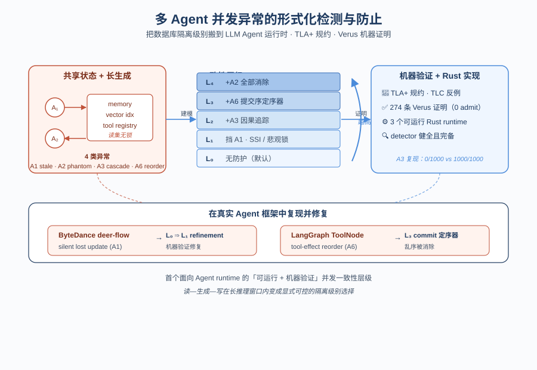
*图示：这篇论文把数据库领域的'隔离级别'思想搬到多Agent LLM系统，用TLA+和Verus机器验证了4种并发异常和5级一致性层级，还真的复现了字节deer-flow和LangGraph里的并发bug。对做Agent runtime的人来说，这是第一次看到'共享状态并发'被严格分类、形式化并配套可运行Rust实现。*

- **详细背景：** 多Agent系统通过共享memory、向量库、工具注册表协作，但读-生成-写过程中LLM推理耗时长、读集没锁，会产生类似数据库脏读/幻读的并发异常。现有理论（硬件一致性、数据库隔离、分布式一致性）都假设操作短或读集可锁，无法直接套用。已有Atomix、SagaLLM、CodeCRDT各自解决一个点，但缺乏统一的层级框架和形式化保证，作者要补上这个 gap。
- **详细入选理由：** 这篇论文把数据库领域的'隔离级别'思想搬到多Agent LLM系统，用TLA+和Verus机器验证了4种并发异常和5级一致性层级，还真的复现了字节deer-flow和LangGraph里的并发bug。对做Agent runtime的人来说，这是第一次看到'共享状态并发'被严格分类、形式化并配套可运行Rust实现。

**核心技术点速览：**

#### 技术点 1：四种Agent并发异常
- 快速理解：把多Agent共享状态下的四类并发故障形式化成TLA+谓词。

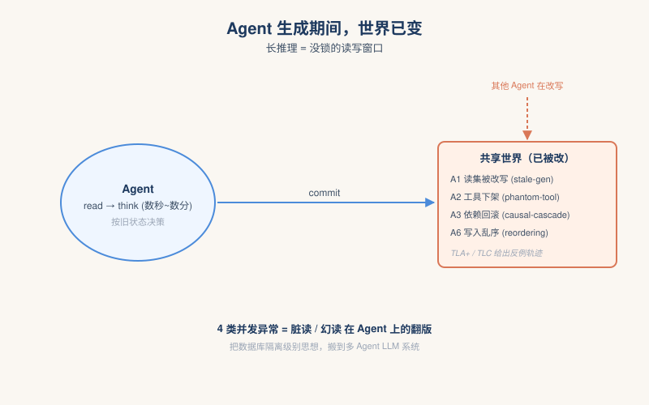
*图示：经典数据库隔离假设事务很短、读集可以锁住，但Agent的'生成阶段'是几秒到几分钟的神经推理，期间没人锁住状态。作者把数据库里脏读、幻读、级联回滚等概念翻译到Agent场景，并加上工具注册表这种数据库根本没有的可变状态，第一次把这些隐性故障显性化。*

- 技术细节：作者在TLA+里定义了4个异常：A1 stale-generation（读后生成过程中读集被改写）、A2 phantom-tool（生成期间工具被下架）、A3 causal-cascade（依赖被回滚但自己已外部化）、A6 tool-effect-reordering（多次写入被runtime乱序提交）。每个异常都用TLC在 \|A\|=2、Cells\<=2、MaxOps\<=4 的小模型上跑出反例轨迹。
- 通俗讲解：经典数据库隔离假设事务很短、读集可以锁住，但Agent的'生成阶段'是几秒到几分钟的神经推理，期间没人锁住状态。作者把数据库里脏读、幻读、级联回滚等概念翻译到Agent场景，并加上工具注册表这种数据库根本没有的可变状态，第一次把这些隐性故障显性化。
- 例子：比如订机票agent在read阶段读到 trip date=6月14日，生成提案花了几秒，期间另一个agent把日期改成6月21日，订机票agent commit时仍按14日下单——这就是A1的现实场景，TLC给出5态反例。

#### 技术点 2：L0–L4一致性层级
- 快速理解：把16点Boolean格里的一条最大链命名为L0–L4，并机器验证逐级严格更强。

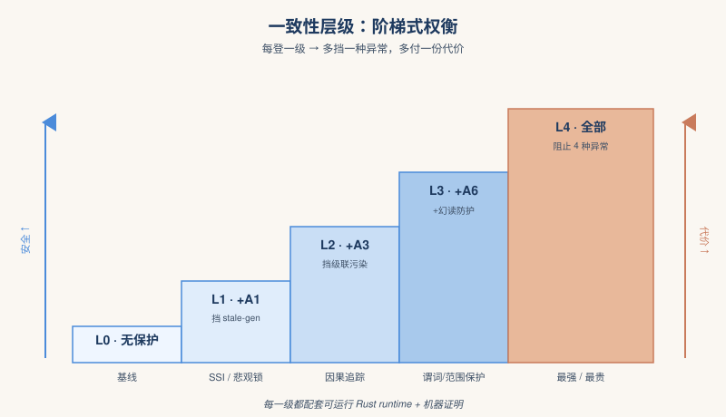
*图示：Boolean格本身是trivial的数学结构，作者强调贡献不是格本身，而是这条链上每一步都能用'真实可跑的Rust runtime+机器证明'实现并严格分离。这给Agent runtime设计者提供了一个可量化的trade-off坐标：你要付多少代价、能挡住哪些异常、不能挡住哪些。*

- 技术细节：4个异常构成2 4=16点的Boolean格，作者沿一条最大链命名L0=∅⊊L1=(A1)⊊L2=(A1,A3)⊊L3=(A1,A3,A6)⊊L4=全部。每级在Verus里有一个对应runtime模型，并配证明：L1由悲观锁/SSI/default-SI三种Rust runtime实现并验证，L2–L4以exec-mode方式验证可运行代码，配dependency-free孪生实现做对照测量（0/1000 vs 1000/1000）。
- 通俗讲解：Boolean格本身是trivial的数学结构，作者强调贡献不是格本身，而是这条链上每一步都能用'真实可跑的Rust runtime+机器证明'实现并严格分离。这给Agent runtime设计者提供了一个可量化的trade-off坐标：你要付多少代价、能挡住哪些异常、不能挡住哪些。
- 例子：比如选L1（SSI）只能挡stale-generation，会增加约8%的token开销；选悲观锁延迟会到1.6–2.3×；L2再加因果追踪后能阻止级联问题，三个模型120次回放session里A3被全部阻止（0/120）。

#### 技术点 3：可执行的形式化验证
- 快速理解：274条Verus证明义务、零assume零admit，detector和runtime都被证sound&complete。

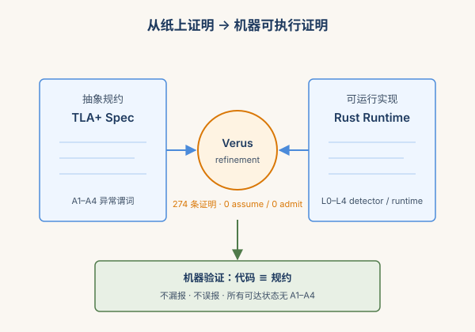
*图示：这不是写在纸上的伪证明，而是真把Rust代码丢进Verus里证明它和TLA+规约等价。这意味着detector不会漏报也不会误报指定异常，runtime确实在所有可达状态都不出某类异常——对追求生产级保障的Agent平台是稀缺资产。*

- 技术细节：整套工程274条Verus证明，零assume、零admit，trust base仅两条结构性公理加mutex对应。验证内容包括：4个detector相对TLA+谓词的soundness/completeness（24条）；3个L0–L1 runtime对A1的safety（40条）；4个spec-runtime refinement证明（31+18+17+18条）；L2–L4 exec-mode验证。
- 通俗讲解：这不是写在纸上的伪证明，而是真把Rust代码丢进Verus里证明它和TLA+规约等价。这意味着detector不会漏报也不会误报指定异常，runtime确实在所有可达状态都不出某类异常——对追求生产级保障的Agent平台是稀缺资产。
- 例子：他们复现了字节deer-flow里一条真实lost-update issue：从项目自带回归测试出发，把修复形式化为一个L0变成L1 refinement，并用Verus证明新版runtime在抽象状态机层面真的不再产生A1。

#### 技术点 4：对真实Agent框架的审计
- 快速理解：用层级和检测器复现了deer-flow和LangGraph ToolNode上的并发bug。

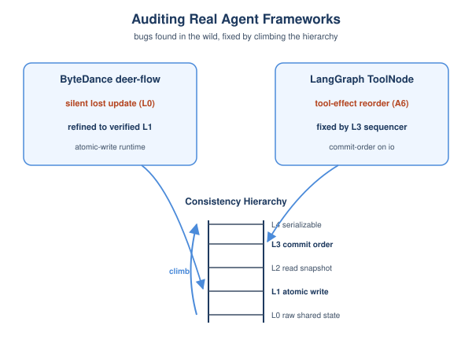
*图示：光定义异常不够，作者证明这些异常在真实开源项目里能被触发，并能用对应层级的runtime机制消除。这把抽象层级和工程实践联起来，告诉Agent框架开发者：你现在停在哪一层、再往上需要加什么机制。*

- 技术细节：在ByteDance deer-flow里复现了一个silent lost update（L0行为），把修复形式化为验证过的L0变成L1 refinement；在LangGraph的ToolNode上展示了未修改输出下出现的tool-effect reordering（A6），并用L3的commit-order sequencer移除。还把Atomix、SagaLLM、CodeCRDT非正式地映射到链上不同节点。
- 通俗讲解：光定义异常不够，作者证明这些异常在真实开源项目里能被触发，并能用对应层级的runtime机制消除。这把抽象层级和工程实践联起来，告诉Agent框架开发者：你现在停在哪一层、再往上需要加什么机制。
- 例子：LangGraph的ToolNode在一次执行里会发出多个工具调用，runtime可能按非预期顺序externalize；作者的L3 sequencer强制按io顺序提交，把A6阻断。

- **对 Agent 产品/系统的启发：** 做Agent runtime要把'共享状态并发'当一等公民，按层级选机制，并用形式化方法兜底。
- **详细启发：** 产品侧：Agent平台应明确告诉用户自己的一致性级别（能否阻止stale read、级联回滚、工具乱序），并把SSI、因果追踪、commit-order sequencer做成可选挡位，让需要审计的客户用更强档位换可控的token/延迟开销（论文测得SSI约+8%、悲观锁1.6–2.3×）。；系统侧：在Agent runtime层引入：1) 读集版本号+提交时校验（防A1）；2) 因果依赖图+级联中止（防A3）；3) 单操作内多写按io顺序的commit sequencer（防A6）；4) 工具注册表快照（防A2）。条件允许时用Verus/TLA+对关键状态机做形式化验证。；风险：LLM输出本身是非确定性的，论文的检测谓词在严格意义上只对'确定性replay/低温采样'regime有效；deploy里要监控误报率。此外悲观锁+长推理可能导致活锁或排队，副本/分布式部署下的split-view尚未在主模型里覆盖。

### 2. PreAct: Computer-Using Agents that Get Faster on Repeated Tasks
- **方向：** computer\_use
- **评分：** 相关性 92 | 价值 85 | 有趣性 85 | 创新性 82 | 开拓性 78
- **为什么入选：** 把成功轨迹编译成可直接执行的状态机，让computer-use Agent第二次干同样的事快10倍。
- **快速背景：** Computer-use Agent每次重复任务都重新感知推理，成本不降；现有缓存方案要么仍要LLM在环，要么盲重放不可靠。
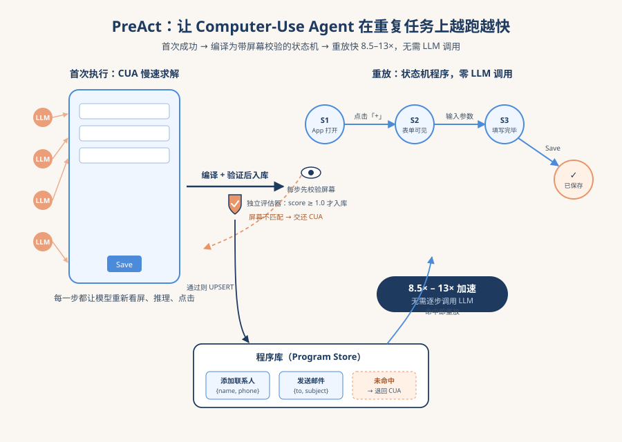
*图示：这篇论文直击computer-use Agent的一个真实痛点：每次都从零开始读屏幕、推理、点击。它提出把首次成功的轨迹编译成带屏幕校验的状态机程序，重放时不调用LLM，速度提升8.5–13倍，而且通过'存储前先验证'保证程序库越用越好而不是越烂。对做Agent runtime和缓存机制的人有直接借鉴价值。*

- **详细背景：** 现在的computer-use Agent（看屏幕、点击、输入）每次执行同一个任务都要重新完整跑一遍感知-推理-动作循环，成本随调用次数线性增长。已有的技能库方案运行时仍依赖LLM调用，传统RPA和record-and-replay虽然能直接重放但既不校验屏幕状态也不能自我修正，存进来的脚本可能根本跑不通。论文提出把'重复任务变便宜'作为一等指标，用可验证的状态机程序替换重复推理，对Agent的runtime和长期记忆机制都是新思路。
- **详细入选理由：** 这篇论文直击computer-use Agent的一个真实痛点：每次都从零开始读屏幕、推理、点击。它提出把首次成功的轨迹编译成带屏幕校验的状态机程序，重放时不调用LLM，速度提升8.5–13倍，而且通过'存储前先验证'保证程序库越用越好而不是越烂。对做Agent runtime和缓存机制的人有直接借鉴价值。

**核心技术点速览：**

#### 技术点 1：成功轨迹编译为状态机程序
- 快速理解：把首次成功的执行轨迹编译成带屏幕断言的状态机，重放时不再调用LLM。

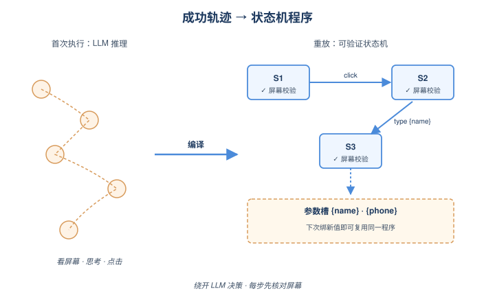
*图示：类比人用第二次微信支付：流程已经内化成'看到这个页面就点这里'。把这种'看一眼+做一下'的状态机直接执行，绕开了每步都让大模型重新决策的开销。和死板的RPA脚本不同，每步动作前都会先核对屏幕是否匹配预期。*

- 技术细节：程序形式化为 P=(S,T,M,V)：每个状态S带一个屏幕验证谓词（如XPath/accessibility tree匹配），每条转移T带一个动作（点击、输入等），元数据M含参数schema和去重签名。轨迹中的具体值（如人名、电话）会被抽成参数，下次绑定新值即可复用。
- 通俗讲解：类比人用第二次微信支付：流程已经内化成'看到这个页面就点这里'。把这种'看一眼+做一下'的状态机直接执行，绕开了每步都让大模型重新决策的开销。和死板的RPA脚本不同，每步动作前都会先核对屏幕是否匹配预期。
- 例子：AndroidWorld的'添加联系人Emilia Gonzalez'任务被编译成7个状态：联系人app打开变成创建表单变成姓名输入完变成...变成保存完成；每条转移就是一次点击或输入；first-name/last-name/phone被抽成参数，下次添加任何联系人都复用这套程序。

#### 技术点 2：Replay时观察先于行动
- 快速理解：每步动作前先校验屏幕谓词，匹配才执行，不匹配就交回完整Agent。

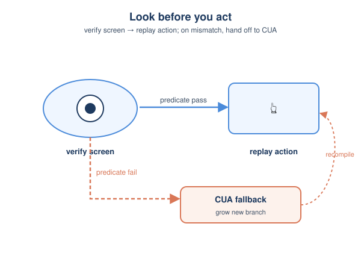
*图示：这是PreAct与传统record-and-replay的核心差别：盲重放遇到弹窗或加载延迟会一路点错；PreAct会在每一步都'瞄一眼'确认环境是预期的样子，一旦不对就退回让大模型介入。这让无LLM重放仍然可靠，并且程序会随着不同失败场景长出新分支。*

- 技术细节：Replayer走状态机时，对每个状态先用verification predicate检查实时屏幕，通过则触发该状态的转移动作；任何谓词失败或动作出错，控制权立刻交还给CUA fallback，CUA从当前真实屏幕续跑，并把新轨迹再编译进库（可能新增分支，比如版本特定的弹窗）。
- 通俗讲解：这是PreAct与传统record-and-replay的核心差别：盲重放遇到弹窗或加载延迟会一路点错；PreAct会在每一步都'瞄一眼'确认环境是预期的样子，一旦不对就退回让大模型介入。这让无LLM重放仍然可靠，并且程序会随着不同失败场景长出新分支。
- 例子：如果重放联系人创建时突然弹出一个权限对话框，状态谓词'First name字段可见'失败，replay立即停止；CUA接手处理对话框继续完成任务，新的处理路径被编译为分支补回程序。

#### 技术点 3：存储前再验证一次（verify-before-store gate）
- 快速理解：新编译的程序必须重置环境从头跑通并被独立评估器判过关，才允许进库。

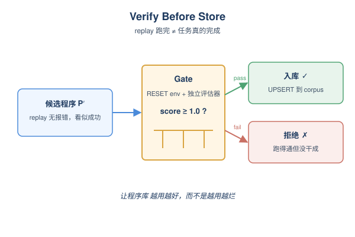
*图示：光看replay跑完还不够，因为可能某步action被后端默默吞掉，最终其实没真正完成任务。Gate就是把run-time的'观察后行动'纪律应用到整段程序上，确保入库的程序是真的能解决问题，而不是表面跑得漂亮。这是程序库越用越好而不是越用越烂的关键。*

- 技术细节：编译出P′后，harness会RESET环境到任务初始状态，重放P′，再调用benchmark的独立评估器打分，只有replay无错且评分\>=1.0时才UPSERT进corpus（同签名替换旧版）。专门防范'cov=100%但score=0'的lossy程序——动作全跑完但结果没生效。
- 通俗讲解：光看replay跑完还不够，因为可能某步action被后端默默吞掉，最终其实没真正完成任务。Gate就是把run-time的'观察后行动'纪律应用到整段程序上，确保入库的程序是真的能解决问题，而不是表面跑得漂亮。这是程序库越用越好而不是越用越烂的关键。
- 例子：联系人添加程序中某次因某字段stale导致没真的写入名字，但replay跑到Save按钮就报success；Gate重置环境再跑一次后，评估器查询通讯录发现没有这个联系人，score=0，程序被拒绝入库。论文记录了5个这种'跑得通但没干成'的真实案例。

#### 技术点 4：Cache miss时退回完整Agent
- 快速理解：没有匹配程序或gate拒绝时，直接调用完整CUA重新解，避免库为空时性能崩盘。

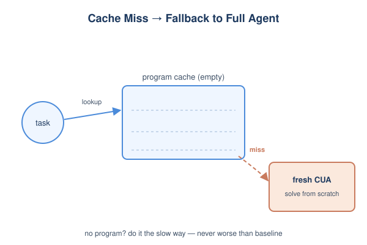
*图示：verify-gate虽然防住了坏程序，但也可能让库变空。让Agent在没找到合适程序时退回从零做一遍，至少不比传统record-and-replay差，整体策略才完整。这其实是一个工程上很容易忽略但很关键的兜底。*

- 技术细节：在WebArena这种答案抽取任务上，页面数据天天变，gate会拒掉绝大多数程序，导致corpus几乎为空。论文加上'cache-miss变成fresh CUA'的fallback后，PreAct在WebArena上的warm-cold降幅从-4.0缩到-1.0，与强基线Muscle-Mem (-0.75) 统计上不可区分 (p≈0.84)。
- 通俗讲解：verify-gate虽然防住了坏程序，但也可能让库变空。让Agent在没找到合适程序时退回从零做一遍，至少不比传统record-and-replay差，整体策略才完整。这其实是一个工程上很容易忽略但很关键的兜底。
- 例子：WebArena上问'2022年最畅销产品'，第一次抽到一个值后页面数据变了，gate拒绝该程序入库；第二次再问时corpus没有候选，harness直接调用CUA重新求解，而不是干等失败。

#### 技术点 5：哪些设计其实不重要
- 快速理解：Prompt措辞、运行时guardrail、用LLM还是embedding做选择器都几乎不影响结果。

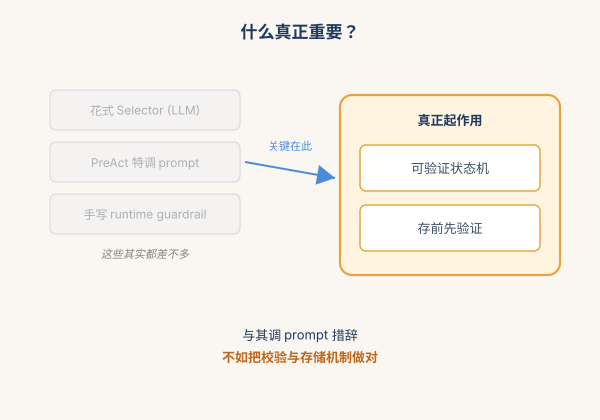
*图示：作者特意诚实地告诉读者哪些工程花活其实没用，避免把功劳归错对象。这对工程实践是个反向参考：与其调prompt措辞，不如把存储和校验机制做对。*

- 技术细节：消融显示：Selector用LLM agentic（100%检索准确率）和plain embedding retriever（75.6%）效果差不多；prompt用上游原版无PreAct特调；几个手写的runtime guardrail也不显著。真正起作用的是harness设计本身：直接执行可验证的状态机+verify-before-store。
- 通俗讲解：作者特意诚实地告诉读者哪些工程花活其实没用，避免把功劳归错对象。这对工程实践是个反向参考：与其调prompt措辞，不如把存储和校验机制做对。

- **对 Agent 产品/系统的启发：** Agent runtime应把成功轨迹编译为可校验、可执行的程序而非死板缓存，并强制'存储前再跑一遍'。
- **详细启发：** 产品侧：对面向重复任务的computer-use或RPA类产品（订餐、报销、客服流程自动化），可以把首次成功流程沉淀成状态机程序，第二次起替用户秒级执行，省成本同时提升体感速度。配合参数化设计，一个'添加联系人'程序就能服务所有人。；系统侧：Agent系统的长期记忆不应只是append-only的trace缓存或RAG文本，而要存可直接执行、带屏幕断言的程序；并在两个时间尺度上做verify——每步动作前校验屏幕、入库前重跑+评估器把关。Selector用普通embedding就够，重点投入在执行/校验层。；风险：对不可逆任务（支付、发送消息）不能用'重跑验证'的方式入库，需要设计side-effect-free的验证替代路径；UI不可见结构（canvas、视频）的状态谓词难以表达；跨任务族迁移能力有限。

### 3. OPD-Evolver: Cultivating Holistic Agent Evolver via On-Policy Distillation
- **方向：** memory
- **评分：** 相关性 90 | 价值 82 | 有趣性 82 | 创新性 80 | 开拓性 82
- **为什么入选：** 把 agent 记忆从'存得下'升级到'用得好'，9B 模型可对标百亿巨头
- **快速背景：** 现有记忆 agent 只会存经验，不会真正学会怎么用经验进化
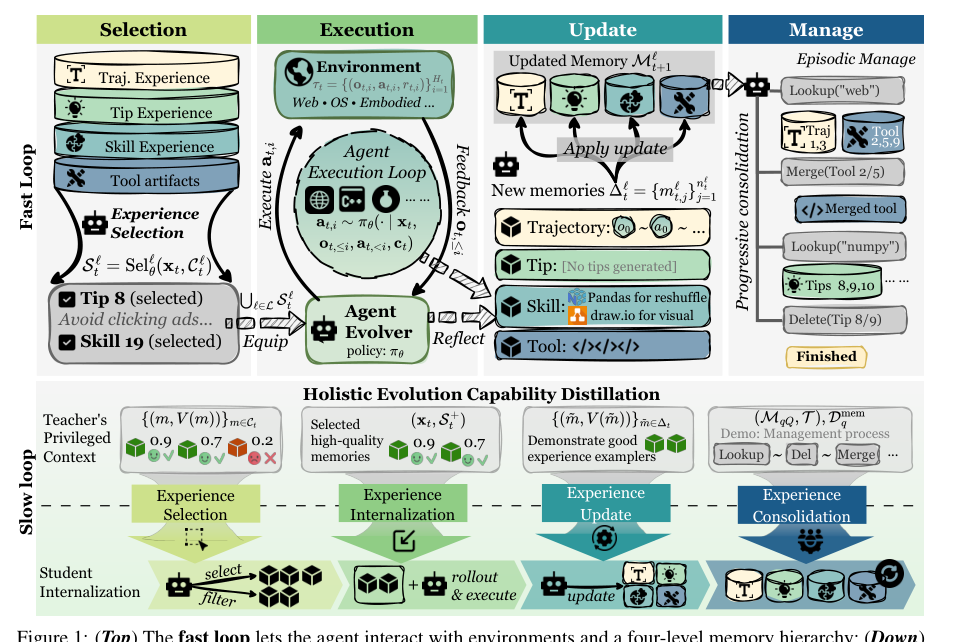
*图示：这张 Figure 1 是完整的方法总览图，直接展示了 OPD-Evolver 的核心机制：上半部分是 fast loop 中 agent 与环境及四级记忆层级的交互，下半部分是 slow loop 如何把 hindsight 与 on-policy distillation 转化为四种能力的内化训练信号。图中明确覆盖 selection / execution / update / manage 四类能力、模块关系与信息流，最能一眼说明论文的系统结构与方法贡献。其他候选基本都是结果分布图、表格混合图或案例流程图，不适合作为论文主图。*

- **详细背景：** 现在主流的自演化 agent 都把记忆当作核心，存轨迹、做反思、攒技能，但大多只在某一个环节优化，比如检索、写入或参数化训练。问题在于：任务奖励能监督执行，但很难直接监督'该选哪条记忆''该写什么进库''该删哪条'，这些能力如果不一起训练就会互相拖后腿。作者把'合格的 agent evolver'定义为同时具备 选/用/写/管 四种能力的 agent，并提出统一训练方案。
- **详细入选理由：** 这篇论文不是又一个记忆库，而是把'选记忆-用记忆-写记忆-管记忆'四件事统一训练成一个会自我进化的 agent，9B 模型在多个 benchmark 上能挑战 397B 巨头，对做 agent 记忆系统的人有直接借鉴价值。

**核心技术点速览：**

#### 技术点 1：四级记忆 + 四种能力定义
- 快速理解：把记忆拆成轨迹/提示/技能/工具四层，并定义 agent 必须掌握的四种能力

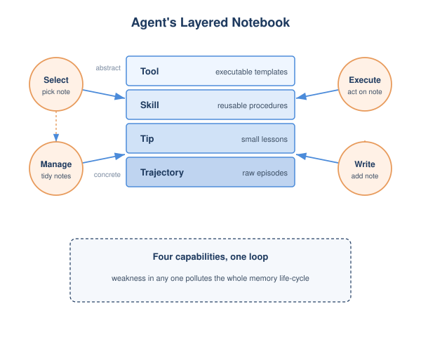
*图示：可以理解为给 agent 建了一个分级笔记本：原始过程记在'轨迹'里，零碎经验写成'tip'，可复用流程抽象成'skill'，能直接执行的命令模板放进'tool'。Agent 在每个任务里都要做四件事：挑笔记、按笔记做事、把新经验写回去、定期整理这本笔记。*

- 技术细节：记忆库被组织为 trajectory、tip、skill、tool 四个层级，分别对应不同复用粒度。论文同时把 agent evolver 形式化为四个耦合能力：experience selection、experience-grounded execution、experience writing、experience management，并指出任何一环弱都会污染整个生命周期。
- 通俗讲解：可以理解为给 agent 建了一个分级笔记本：原始过程记在'轨迹'里，零碎经验写成'tip'，可复用流程抽象成'skill'，能直接执行的命令模板放进'tool'。Agent 在每个任务里都要做四件事：挑笔记、按笔记做事、把新经验写回去、定期整理这本笔记。
- 例子：比如做 OS 任务'创建 /reports 并生成 5 个文件'，agent 会从四层里检索候选记忆，选中一条 skill（修改时间排序）和一条 tip（权限设置），执行后把失败或新的有用经验写回对应层，每隔 Q 个任务再批量做 merge/delete 整理。

#### 技术点 2：结果校准的记忆归因
- 快速理解：用任务成败反推每条记忆的真实价值，把稀疏奖励变成密集监督

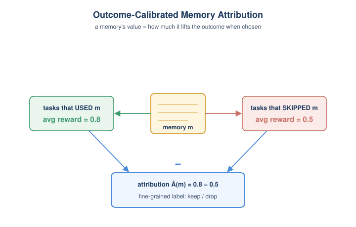
*图示：直觉是：一条记忆到底有没有用，不能光看它出现过，要看选了它的任务和没选它的任务结果差多少。用得越多、差距越显著、置信越高，分越高。这就把'任务成功/失败'这种粗信号变成了'哪条笔记该留、哪条该删'的精细标签。*

- 技术细节：对每条记忆 m，只在它被检索到的任务集合里比较'被选中'与'未被选中'两组的平均回报差，得到 outcome-calibrated attribution Â(m)，再乘以层级先验和置信因子得到 V(m)。这样把延迟的任务奖励转化为对每条记忆的细粒度好坏评分。
- 通俗讲解：直觉是：一条记忆到底有没有用，不能光看它出现过，要看选了它的任务和没选它的任务结果差多少。用得越多、差距越显著、置信越高，分越高。这就把'任务成功/失败'这种粗信号变成了'哪条笔记该留、哪条该删'的精细标签。
- 例子：假设某条 SQL tip 被检索 20 次，其中 8 次被选中执行任务平均成功率 0.8，未选中那 12 次平均 0.5，差值就转成正向价值；而某条频繁被选但成功率反而更低的记忆，会被打成负分，后续蒸馏会教 agent 学会忽略它。

#### 技术点 3：Slow-Fast 双环 + 特权蒸馏
- 快速理解：快环在线用记忆、慢环用'事后诸葛亮'视角把四种能力蒸馏回同一策略

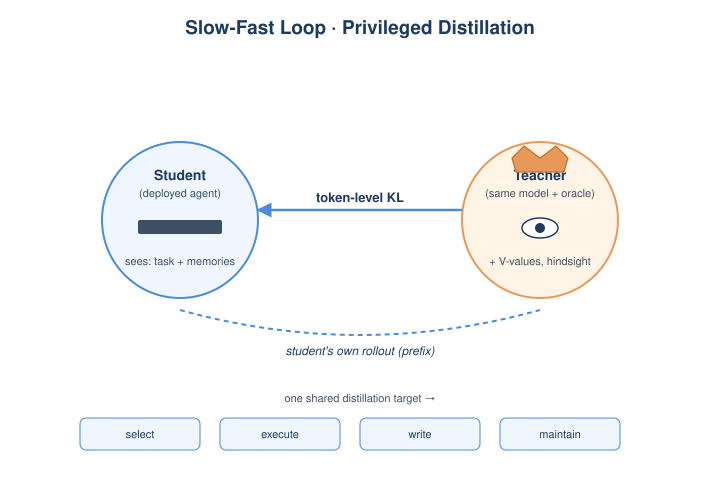
*图示：可以理解为：上线版 agent 看不到'未来这条记忆有没有用'这种上帝视角信息，但训练时让一个能看到的 teacher（其实是同一个模型加特权输入）告诉它'当时你应该选这条''当时你写的这条后来很有用'。蒸馏只在 student 自己走出来的轨迹上做，避免训练-推理分布错位。*

- 技术细节：Fast loop 让 agent 在线检索-执行-写入-维护，不更新参数；Slow loop 把同一个模型当作 teacher，给它特权信息（每条候选记忆的 V 值、未来效用、仓库冗余度等），然后在 student 自己 rollout 的 prefix 上做 token 级 KL 蒸馏。四种能力 selection/execution/writing/maintenance 共享一份蒸馏目标。
- 通俗讲解：可以理解为：上线版 agent 看不到'未来这条记忆有没有用'这种上帝视角信息，但训练时让一个能看到的 teacher（其实是同一个模型加特权输入）告诉它'当时你应该选这条''当时你写的这条后来很有用'。蒸馏只在 student 自己走出来的轨迹上做，避免训练-推理分布错位。
- 例子：比如 selection 训练时，student 只看到任务和候选记忆，teacher 多看到每条候选的 V 值；teacher 做出更好的选择分布后，让 student 在自己生成的 prefix 上对齐 teacher 的 token 分布，从而把'识别高价值记忆'的直觉内化进参数。

#### 技术点 4：记忆维护被当作工具调用学习
- 快速理解：把仓库整理变成 lookup/merge/delete 的多轮工具调用，由 agent 自己学

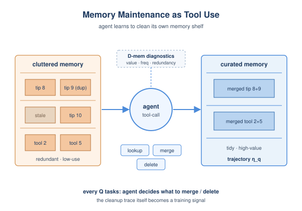
*图示：记忆库会越用越脏，重复、过时、低价值条目会拖累后面的检索。OPD-Evolver 把'整理库'当成一项 agent 能力来学：定期让 agent 自己看仓库诊断，决定合并相似条目还是删掉无用的，而不是靠人工启发式策略。*

- 技术细节：每隔 Q 个任务触发一次维护，agent 在 lookup、merge(mi,mj)、delete(mi) 三个工具之上做多轮 tool-call 轨迹 ηq，输入包括当前仓库、历史交互和带有 V、置信、使用频次、冗余度的诊断信息 D-mem。这条轨迹也作为 maintenance 维度被蒸馏。
- 通俗讲解：记忆库会越用越脏，重复、过时、低价值条目会拖累后面的检索。OPD-Evolver 把'整理库'当成一项 agent 能力来学：定期让 agent 自己看仓库诊断，决定合并相似条目还是删掉无用的，而不是靠人工启发式策略。
- 例子：维护轮里 agent 可能先 lookup('numpy') 找到 tip 8/9/10，发现内容高度重复且使用率低，就调用 delete(Tip 8) 和 merge(Tool 2, Tool 5) 把仓库压缩，整理过程整段被记录下来作为后续蒸馏的监督。

#### 技术点 5：9B 挑战 397B 的实证结果
- 快速理解：在 4 个 benchmark 上压过 ReasoningBank 等记忆基线，9B 多数子集胜过 397B

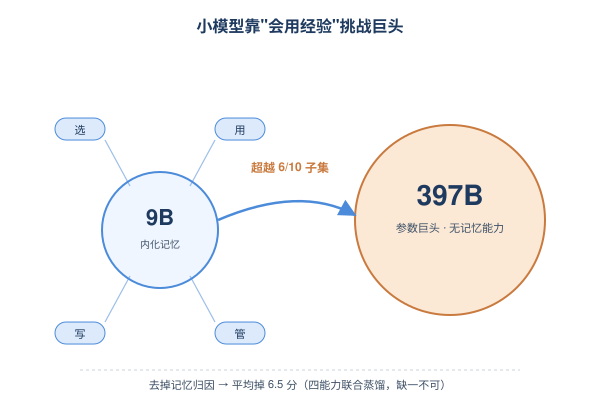
*图示：结论是：把记忆生命周期内化进参数后，小模型可以靠'更会用经验'来抵消'参数更少'。而且 ablation 表明真正起作用的不是某一个组件，而是归因+四种能力联合蒸馏，缺一个都明显掉点。*

- 技术细节：在 LifelongAgentBench、MemoryArena、AMA-Bench、InterCode、MiniHack 上，OPD-Evolver-9B 在所有 10 个子集上超过同 backbone 的 ReasoningBank 等记忆基线（最高 +11.5%），并在 6/10 子集上超过 Qwen3.5-397B-A17B、9/10 子集上超过 Step-3.5-Flash(196B)。消融显示去掉记忆归因平均掉 6.5 个点，最关键。
- 通俗讲解：结论是：把记忆生命周期内化进参数后，小模型可以靠'更会用经验'来抵消'参数更少'。而且 ablation 表明真正起作用的不是某一个组件，而是归因+四种能力联合蒸馏，缺一个都明显掉点。
- 例子：InterCode-SQL 上 9B 从无记忆 55.73 提升到 64.01，超过 397B 的 62.74；同时图 4 显示 OPD-Evolver 在不挂外部记忆库时 task success 也显著提升、步数减少 ~2.5 步，说明经验真的内化进了策略。

- **对 Agent 产品/系统的启发：** 做记忆 agent 不能只搭检索，要把'选-用-写-管'当成一个闭环统一训练
- **详细启发：** 产品侧：对 agent 产品，提示我们记忆模块不该只是'向量库 + 反思'，而要分层（轨迹/tip/skill/tool）、要有打分维护机制，并把'写什么进库'和'删什么'都当成可观测、可优化的能力。；系统侧：系统设计上值得借鉴 outcome-calibrated attribution：用任务成败回灌每条记忆的价值评分，是一种相对低成本就能落地的反馈信号，可以驱动检索质量评估、记忆衰退策略和数据飞轮，不一定要做完整的 OPD 蒸馏。；风险：整体方案对'任务有可验证奖励'依赖较强；在奖励稀疏或主观（比如开放对话、创意类任务）的场景中，归因信号会很噪，记忆库可能反而被错误信号污染。同时仓库会持续增长，隐私与审计风险随之放大。

## 三、总结

- 今天的关键词是runtime可靠性、组件级评测和记忆归因三件套
- 今天最值得记住的判断是：Agent研究正在把过去模糊的'能力'拆成可验证、可归因、可缓存的工程组件
- 今天最值得记住的判断是：Agent研究正在把过去模糊的'能力'拆成可验证、可归因、可缓存的工程组件。多Agent并发被形式化进L0–L4层级，computer-use把成功轨迹编译成可校验状态机，记忆系统则把'选/用/写/管'四件事联合蒸馏。与此同时，评测和安全也在同步从端到端打分转向组件级诊断和部署期风险量化，整体看Agent正在进入一个'软件工程化'的阶段。
