# 2026-06-19 AI Agent 论文日报

> 分类：cs.AI + cs.CL + cs.LG + cs.MA + cs.RO + cs.SE + cs.HC
> 入选论文：3 篇

## 一、初筛每日趋势

- 471篇里general\_agent占225，重心继续压在harness与runtime层
- 评测转向长程压力和predictive validity，静态leaderboard被多篇质疑
- 记忆和上下文成一等动作，GUI范式首次被CLI正面挑战
- 今日471篇里general\_agent独占225、embodied 67，研究重心持续从模型能力下移到Agent harness、session runtime和长程上下文管理，OpenRath、MemGUI-Agent、Connect the Dots均在这条主线上。
- agent\_eval 24 + agent\_safety 19合计43篇，评测议题从单轮通过率转向长程stamina、predictive validity和故障注入，多篇直指现有leaderboard无法反映真实Agent能力。
- 多Agent与工具调用研究开始出现运行时治理共识：grite用git事件日志做协作底座、Sovereign Brokers用证书绑定执行权、Tool Programs取代静态endpoint，都在重构Agent间的可验证交互层。
- computer\_use出现明显范式分歧：CLI-first的移动Agent路线和H-RePlan的层次化恢复同时挑战GUI视觉范式与全局重规划假设。

### 跨论文综合观察

- StaminaBench、Beyond Static Leaderboards、H-RePlan三篇从不同角度指向同一判断：Agent评测必须从单轮静态通过率转向长程、可预测、含故障的真实运行时画像，且harness差异往往大于模型差异。
- OpenRath的session抽象、MemGUI-Agent的Context-as-Action、Connect the Dots的长生命周期RL在方法论上趋同——都把'上下文/状态管理'提升为与动作并列的一等公民，而不是塞进prompt的附属物。
- Before the Pull Request、Tool Programs、Sovereign Execution Brokers构成多Agent运行时治理的三件套：协调日志、可执行工具协议、证书绑定执行权，共同把Agent间交互从临时prompt约定推向可审计、可验证的基础设施层。

## 二、重点论文精读

### 1. StaminaBench: Stress-Testing Coding Agents over 100 Interaction Turns
- **方向：** agent\_eval
- **评分：** 相关性 95 | 价值 88 | 有趣性 85 | 创新性 80 | 开拓性 80
- **为什么入选：** 首个把编码Agent压到100轮交互的压力测试，揭穿harness与反馈回路的真实价值
- **快速背景：** 现有编码benchmark只测单轮，无法反映真实多轮vibe-coding场景。
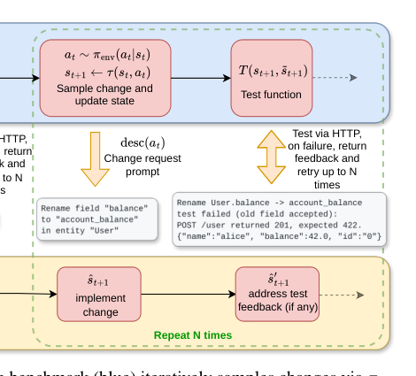
*图示：这是最明确的系统总览图：直接展示了 StaminaBench 的 benchmark 端与 agent 端分离结构、环境采样变化请求、参考状态推进、测试函数、HTTP 交互、测试反馈与重试回路，能一眼说明论文核心机制是如何对编码 agent 进行多轮压力测试的。相比其他候选，这张图主体完整、文字负担小、信息流清楚，最适合作为日报首图。*

- **详细背景：** SWE-Bench等主流编码benchmark都是单轮一次性任务，但实际开发中工程师与Agent的对话往往持续几十到上百轮，需要Agent在不断膨胀的代码库里保持一致性。已有的多轮benchmark要么轮数太少（10-25轮），要么不在编码领域。作者认为长程多轮才是Agent真正的瓶颈，需要一个能无限程序化生成、语言无关、可靠测试的benchmark。
- **详细入选理由：** 现有编码benchmark大多只测一两轮，但真实vibe-coding动辄几十上百轮。这篇用程序化生成的REST API改造任务，把Agent硬扛到100轮，直接暴露模型+harness的长程稳定性问题，对Agent评测和harness设计都很有参考价值。

**核心技术点速览：**

#### 技术点 1：REST API作为长程压力测试载体
- 快速理解：用程序化生成的REST API改造序列做100轮压测，全程不靠LLM出题。

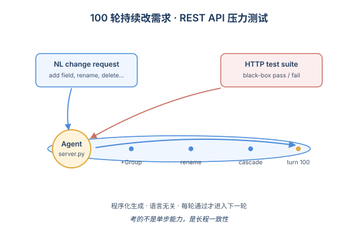
*图示：作者把'测Agent能跑多久'转化成'看Agent能正确响应多少次连续改需求'。因为REST API有明确接口，可以纯程序化造题、造改动、造测试，不需要LLM参与，重复跑完全可复现。Agent只看到自然语言描述，看不到测试，纯黑盒考核。*

- 技术细节：每个scenario让Agent先实现一个REST API server，然后通过程序化采样器在结构化action空间里生成100轮变更（加实体、改字段、重命名、级联删除、聚合分析等），每轮都用程序化生成的HTTP测试套件验证。Agent在Docker隔离环境里运行，benchmark通过HTTP黑盒通信，语言无关。
- 通俗讲解：作者把'测Agent能跑多久'转化成'看Agent能正确响应多少次连续改需求'。因为REST API有明确接口，可以纯程序化造题、造改动、造测试，不需要LLM参与，重复跑完全可复现。Agent只看到自然语言描述，看不到测试，纯黑盒考核。
- 例子：初始让Agent建一个User实体（id/name/balance）的server.py，第二轮要求加一个Group实体并引用User，第三轮要求重命名balance字段，每轮跑完都用HTTP测试集合检查所有endpoint是否符合最新规范，跑通才能进下一轮。

#### 技术点 2：测'坚持轮数'而非'通过率'
- 快速理解：评测指标从'解决多少题'改成'连续撑过多少轮才崩'。

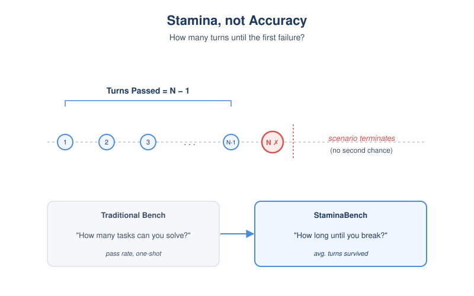
*图示：传统benchmark问'你能解多少题'，这篇问'你能不出错地连干多少活'。任何一轮失败就game over，所以Agent必须维护一个不断膨胀（最多6000行代码）的一致状态，这跟一次性任务完全不是一回事。*

- 技术细节：核心指标是average turns passed——在每个scenario里Agent能连续通过多少轮才首次失败，scenario一旦失败就终止。作者跑了20个scenario×100轮，配合6个harness×7个开源LLM。这种stamina指标更贴近真实vibe-coding里'能用多久不出bug'的体验。
- 通俗讲解：传统benchmark问'你能解多少题'，这篇问'你能不出错地连干多少活'。任何一轮失败就game over，所以Agent必须维护一个不断膨胀（最多6000行代码）的一致状态，这跟一次性任务完全不是一回事。
- 例子：GLM-5配OpenCode平均能撑57轮，但配OpenHands只能撑8.7轮；最强模型在无反馈情况下也只能撑6轮左右就崩，说明长程一致性是普遍硬伤。

#### 技术点 3：反馈回路带来12倍提升
- 快速理解：把测试失败信息回灌给Agent并允许重试，通过轮数最高提升12倍。

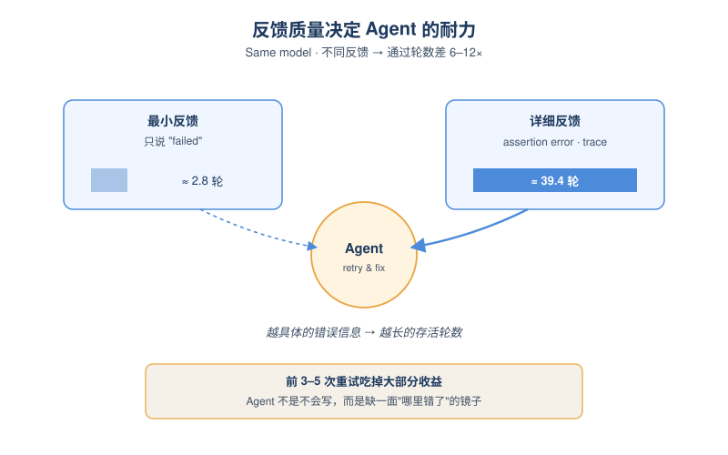
*图示：Agent单次写对长程代码非常难，但只要把测试报错原文喂回去让它改，效果立刻天差地别。这说明Agent不是不会写，而是需要外部信号告诉它哪里错。但现实场景里这种详细反馈往往拿不到，所以单次正确率仍然是核心瓶颈。*

- 技术细节：实验对比了4档反馈：无反馈、最小（只说失败）、中等（每个测试pass/fail）、详细（具体assertion错误）。详细反馈相比最小反馈带来6-12倍的通过轮数提升。重试预算R在0-10范围内扫，前3-5次重试吃掉大部分收益，之后趋于平台。
- 通俗讲解：Agent单次写对长程代码非常难，但只要把测试报错原文喂回去让它改，效果立刻天差地别。这说明Agent不是不会写，而是需要外部信号告诉它哪里错。但现实场景里这种详细反馈往往拿不到，所以单次正确率仍然是核心瓶颈。
- 例子：Qwen3.5-122B在最小反馈下只能撑2.8轮，给详细测试错误信息后能撑到39.4轮；GLM-5从10.7轮跳到57轮，相同模型仅靠反馈质量差出近6倍。

#### 技术点 4：harness差异大于模型差异
- 快速理解：同一个模型换harness差6倍，弱模型再好的harness也救不回来。

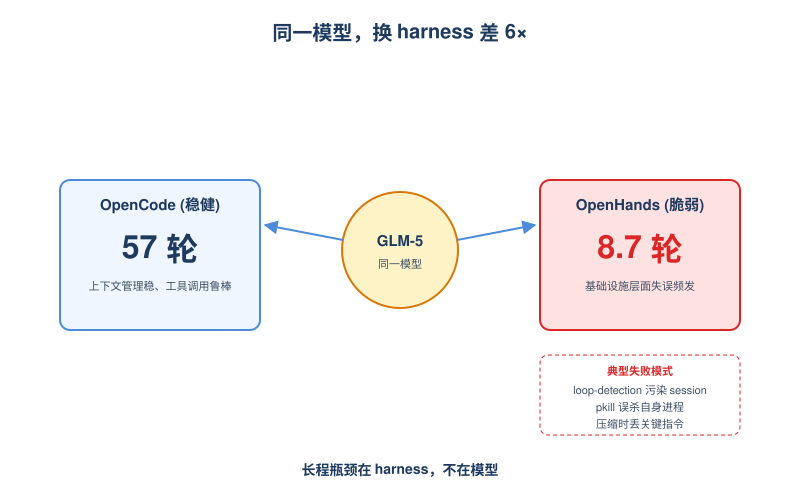
*图示：很多人以为换个更强的模型就行，但这篇发现harness（怎么管理上下文、怎么调工具、怎么压缩历史）的影响可能比模型本身还大。长程场景下harness要负责上下文压缩不丢关键指令、工具调用要鲁棒、出错要能恢复，这些都不是模型层面的事。*

- 技术细节：强模型在不同harness上最高差6倍（GLM-5在OpenCode上57轮，OpenHands上仅8.7轮），弱模型则任何harness都撑不过几轮。模型自家的harness（QwenCode、Mistral Vibe）也未必最优，OpenCode在7个模型上都是最好或与最好不显著差异。失败分析显示OpenHands的loop检测、OpenCode的compaction时调工具、Agent误用pkill自杀等infrastructure问题占很大比例。
- 通俗讲解：很多人以为换个更强的模型就行，但这篇发现harness（怎么管理上下文、怎么调工具、怎么压缩历史）的影响可能比模型本身还大。长程场景下harness要负责上下文压缩不丢关键指令、工具调用要鲁棒、出错要能恢复，这些都不是模型层面的事。
- 例子：Nemotron Super配OpenHands时，11/20个scenario死于Agent自己用pkill正则太宽把自己进程杀了；GLM-5配OpenHands时13/20个scenario死于触发了loop-detection错误，污染了session状态。

#### 技术点 5：失败模式：指令越后面越被忽略
- 快速理解：Agent在长上下文里逐渐忘记初始指令，而非能力不够。

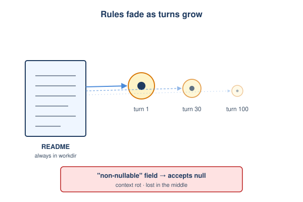
*图示：Agent不是不会，而是'忘'。初始prompt写得很清楚的规则（比如非nullable字段不能传null），跑了几十轮上下文一压缩就糊了。这印证了'lost in the middle'和'context rot'现象，也说明harness的上下文管理策略至关重要。*

- 技术细节：失败分类显示，最常见的早期失败是数据校验过严或过松（违背README里明确写的nullable规则）、幻觉出未要求的字段类型、级联删除处理错误、重命名失败等。README始终在工作目录里，但Agent随着轮数增加越来越少回头读它。R=10时则更多是infrastructure类失败（工具格式错、compaction期间调工具、pkill自杀）。
- 通俗讲解：Agent不是不会，而是'忘'。初始prompt写得很清楚的规则（比如非nullable字段不能传null），跑了几十轮上下文一压缩就糊了。这印证了'lost in the middle'和'context rot'现象，也说明harness的上下文管理策略至关重要。
- 例子：MiniSWE+Devstral 2 Small被要求加一个string类型的activity-type字段，结果Agent自作主张造了个enum；另一个常见错误是README明明说'非nullable字段不能为null'，跑到几十轮后Agent就开始接受null输入了。

- **对 Agent 产品/系统的启发：** 做编码Agent别只看单轮成功率，长程稳定性靠harness的上下文管理和反馈闭环。
- **详细启发：** 产品侧：Vibe-coding类产品的真实体验由长程稳定性决定，应该把'连续无bug轮数'作为核心指标，并且尽可能把测试/lint/运行错误自动回灌给Agent重试，这是性价比最高的可靠性提升手段。；系统侧：harness层是长程Agent的胜负手：上下文压缩策略要保留README和早期约束、工具调用要做格式校验和异常恢复、loop检测和进程管理要鲁棒。强模型配差harness会被打回原形，反过来好harness能让中等模型逼近最强模型表现。；风险：Agent在长上下文里会逐渐忽略明确写在指令里的硬约束（如类型/nullable规则），并幻觉出未要求的功能；同时会因为工具误用（如pkill正则过宽）自杀，这些故障在单轮benchmark里完全看不到。

### 2. Before the Pull Request: Mining Multi-Agent Coordination
- **方向：** multi\_agent
- **评分：** 相关性 92 | 价值 85 | 有趣性 85 | 创新性 80 | 开拓性 80
- **为什么入选：** 把多编码Agent的协作冲突搬到PR之前，用git原生日志可挖掘
- **快速背景：** 编码Agent的PR更快但通过率更低，问题其实出在PR之前的协作过程
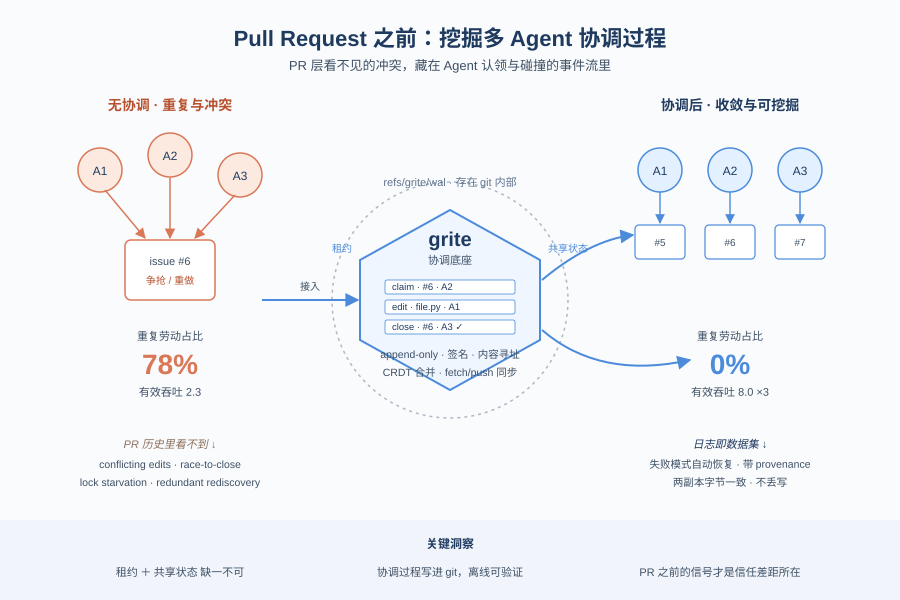
*图示：针对多编码Agent协作时重复劳动、冲突编辑等无法在PR层观察的问题，提出一个git原生、无需中心服务器的协调底座grite，并给出可挖掘的事件日志和具体失败模式，对多Agent运行时治理非常有参考价值。*

- **详细背景：** AIDev数据显示45万+条由编码Agent发起的PR普遍'更快但更难被接受'，但PR级数据看不到Agent之间在认领、分工、抢任务时发生的冲突。已有工作要么挖PR/commit产物，要么是单Agent基准，要么是文件型git issue跟踪器，都没法暴露PR之前的协作过程。作者认为这层缺失的信号才是Agent协作信任差距的关键，因此构建grite来直接观测和度量。
- **详细入选理由：** 针对多编码Agent协作时重复劳动、冲突编辑等无法在PR层观察的问题，提出一个git原生、无需中心服务器的协调底座grite，并给出可挖掘的事件日志和具体失败模式，对多Agent运行时治理非常有参考价值。

**核心技术点速览：**

#### 技术点 1：git原生的协调底座grite
- 快速理解：把任务状态写进git refs，不靠中心服务器，让协作过程随代码同步

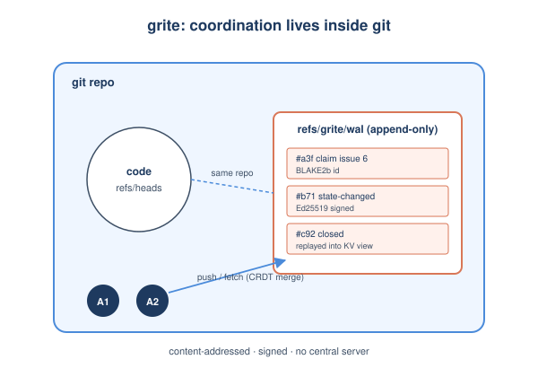
*图示：想象多个Agent共享一个仓库，它们之间的'谁认领了哪个任务'、'谁改了issue状态'这些信息不再写到某个独立服务或working tree文件，而是直接以事件形式存进git本身。这样代码走到哪、协调状态就走到哪，离线也能用，并且每条记录都带可验证来源。*

- 技术细节：grite把Agent的issue tracker实现成一个写在refs/grite/wal下的append-only事件日志，事件用BLAKE2b内容寻址、可Ed25519签名，物化视图作为KV存储重建供查询，同步就是普通的git fetch/push加CRDT合并。
- 通俗讲解：想象多个Agent共享一个仓库，它们之间的'谁认领了哪个任务'、'谁改了issue状态'这些信息不再写到某个独立服务或working tree文件，而是直接以事件形式存进git本身。这样代码走到哪、协调状态就走到哪，离线也能用，并且每条记录都带可验证来源。
- 例子：Agent 0e对issue 6发了一个state-changed事件，事件以哈希id追加到refs/grite/wal；其他Agent fetch后重放这个日志，就知道issue 6已被关闭，不会再去做。

#### 技术点 2：租约+共享状态共同必要
- 快速理解：光有锁还会重复劳动，必须再叠一层共享完成态才能降到零

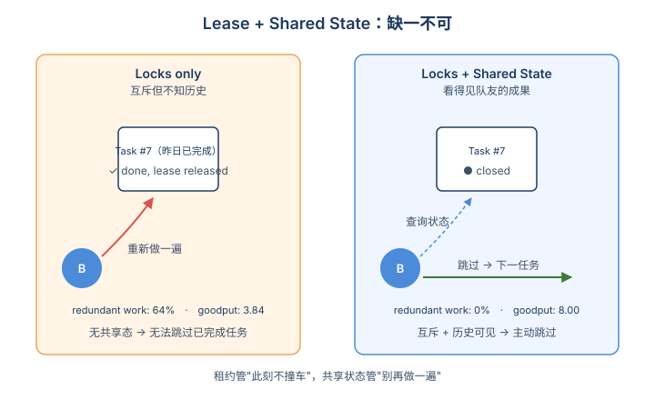
*图示：只加advisory lease只能保证两个Agent不在同一时刻动同一个任务，但没法阻止一个Agent去重做队友早已完成的事。只有再加上共享的'谁已完成什么'的状态，Agent才会主动跳过已完成任务。所以互斥锁和共享状态是两件事，必须同时存在。*

- 技术细节：实验对比no-coord、locks-only、locks+state三种协调强度，N=32时重复工作率从0.78降到0.64再降到0.00，goodput从2.33升到3.84再升到8.00；挖掘还显示locks-only的redundant rediscovery反而最高。
- 通俗讲解：只加advisory lease只能保证两个Agent不在同一时刻动同一个任务，但没法阻止一个Agent去重做队友早已完成的事。只有再加上共享的'谁已完成什么'的状态，Agent才会主动跳过已完成任务。所以互斥锁和共享状态是两件事，必须同时存在。
- 例子：在locks-only下，Agent A今天完成了task 7并释放租约；明天Agent B拿到task 7的租约后照样从头做一遍。换到locks+state后，B在选任务时先查共享态，发现task 7已closed便直接跳过。

#### 技术点 3：日志即可挖掘的失败模式
- 快速理解：事件日志能自动还原冲突编辑、锁饥饿、抢关任务等PR里看不见的失败

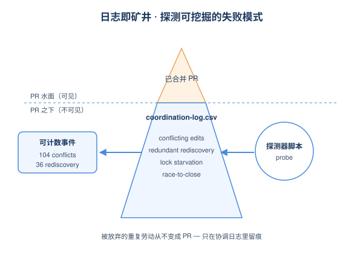
*图示：因为每个协调动作都是一条带类型、带签名的事件，日志本身就是研究对象。跑一遍探测脚本就能数出'有多少次跨Agent覆盖写'、'有多少次抢着关同一个任务'。这些在传统PR数据集里根本看不到——被放弃的重复活儿压根不会变成PR。*

- 技术细节：作者预先注册一组探测器，从coordination-log.csv的conflict、duplicate、lock-outcome字段直接识别conflicting edits、redundant rediscovery、lock starvation、race-to-close等失败模式，并附带provenance；多种模式在PR历史中完全或部分不可见。
- 通俗讲解：因为每个协调动作都是一条带类型、带签名的事件，日志本身就是研究对象。跑一遍探测脚本就能数出'有多少次跨Agent覆盖写'、'有多少次抢着关同一个任务'。这些在传统PR数据集里根本看不到——被放弃的重复活儿压根不会变成PR。
- 例子：no-coord run里探测器报出104次conflicting edits和36次redundant rediscovery；同一个toolkit可以通过grite export --format coordination-log直接跑在真实LLM Agent的日志上。

#### 技术点 4：CRDT保证收敛不丢写
- 快速理解：无论事件到达顺序如何，所有副本重建出字节一致的状态

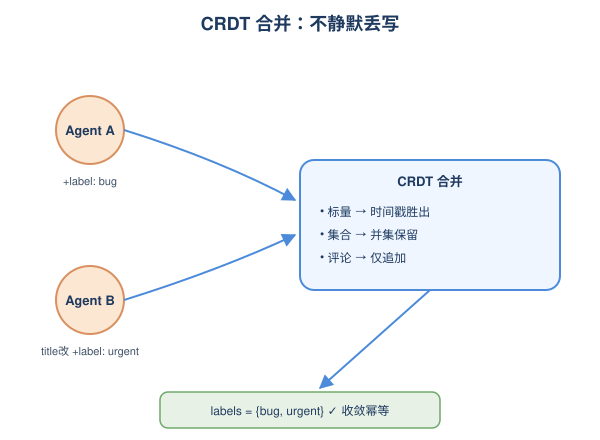
*图示：多Agent离线工作再同步时，最怕的是有人写的东西被悄悄吞掉。grite用CRDT把每类字段用合理方式合并，所以两个Agent各加一个label都会保留。作为对照，文件型JSONL tracker按整文件last-writer-wins会直接丢一方的写。*

- 技术细节：标量字段用按(timestamp, actor, event-id)排序的last-writer-wins，集合字段(labels、assignees、依赖)交换合并，评论和链接append-only；属性测试在大量随机事件集和投递顺序下验证两副本字节一致且重投递幂等。
- 通俗讲解：多Agent离线工作再同步时，最怕的是有人写的东西被悄悄吞掉。grite用CRDT把每类字段用合理方式合并，所以两个Agent各加一个label都会保留。作为对照，文件型JSONL tracker按整文件last-writer-wins会直接丢一方的写。
- 例子：Agent A给issue加label 'bug'，Agent B同时改title并加label 'urgent'；合并后title按时间戳取胜者，labels集合保留(bug, urgent)，没有静默丢失。

- **对 Agent 产品/系统的启发：** 做多Agent编码系统时，协调层要同时提供互斥锁和共享完成态，并保留可审计事件流
- **详细启发：** 产品侧：面向多编码Agent的产品应该在PR之前就提供共享任务面板：谁在做、做到哪、已完成什么，并把这些状态作为Agent上下文的一部分，而不是只在PR层做review。；系统侧：运行时层可以借鉴grite——把协调状态以append-only事件日志形式落到版本控制或类似底座，配合CRDT合并和TTL租约，既支持去中心化/离线，又天然产出可挖掘的诊断数据，便于事后归因Agent行为。；风险：advisory lease无法强制不合作的Agent，部分合规本身就是风险点；同时本论文的量化结论来自合成确定性Agent，真实LLM Agent在真实仓库上的幅度未验证，不要把0%重复率当成可直接复现的承诺。

### 3. Beyond the GUI Paradigm: Do Mobile Agents Need the Phone Screen?
- **方向：** computer\_use
- **评分：** 相关性 92 | 价值 85 | 有趣性 85 | 创新性 80 | 开拓性 80
- **为什么入选：** 挑战移动Agent的GUI默认范式，证明纯CLI路径已能匹敌甚至超越视觉Agent
- **快速背景：** 移动Agent几乎都默认看屏幕点屏幕，但手机其实暴露了完整的命令行接口。
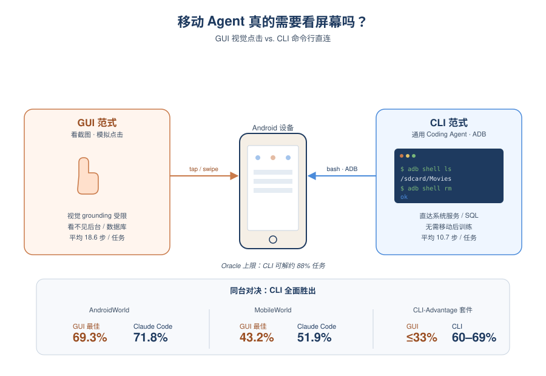
*图示：这篇论文直接质疑当下移动Agent最主流的GUI视觉范式，提出用ADB命令行让通用Coding Agent操作手机。在AndroidWorld和MobileWorld两个标准基准上，未经任何移动专门微调的Claude Code就超越了所有可复现的GUI基线，并新建了一套CLI更擅长的任务套件。这对Agent系统设计的范式选择有直接冲击。*

- **详细背景：** 目前移动Agent几乎都是GUI范式：看截图、模拟点击滑动，性能受限于视觉grounding精度，也看不到电池历史、后台进程等不上屏的系统状态。然而Android本质是Linux，通过ADB可以直接命令行访问设备服务和数据。同时前沿Coding Agent在终端任务上能力已经很强。作者因此提出问题：移动Agent真的需要看屏幕吗？
- **详细入选理由：** 这篇论文直接质疑当下移动Agent最主流的GUI视觉范式，提出用ADB命令行让通用Coding Agent操作手机。在AndroidWorld和MobileWorld两个标准基准上，未经任何移动专门微调的Claude Code就超越了所有可复现的GUI基线，并新建了一套CLI更擅长的任务套件。这对Agent系统设计的范式选择有直接冲击。

**核心技术点速览：**

#### 技术点 1：CLI范式与GUI同台竞技
- 快速理解：未做任何移动微调的Coding Agent，仅靠ADB就在主流基准上击败专门训练的GUI模型

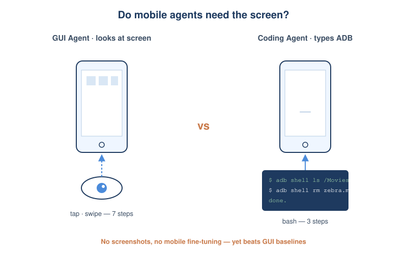
*图示：传统做法是让模型像人一样看屏幕点按钮，这受视觉识别精度拖累。作者反过来让Agent像程序员开终端一样直接敲ADB命令操作手机。结果是：通用编程Agent不需要任何移动适配，光靠'懂Linux'就能比专门训练的视觉Agent做得更好，而且步数明显更少。*

- 技术细节：作者把Claude Code、Terminus-2、mini-swe-agent三个通用Coding Agent接到Android终端，输入只有终端stdout，输出是bash命令，没有任何截图和无障碍树，也没做移动专门后训练。在AndroidWorld和MobileWorld上，Claude Code (Opus 4.7) 达到71.8%和51.9%，超过GUI-Owl-1.5-32B、MAI-UI-8B、Qwen3-VL-32B等所有可复现的GUI基线。
- 通俗讲解：传统做法是让模型像人一样看屏幕点按钮，这受视觉识别精度拖累。作者反过来让Agent像程序员开终端一样直接敲ADB命令操作手机。结果是：通用编程Agent不需要任何移动适配，光靠'懂Linux'就能比专门训练的视觉Agent做得更好，而且步数明显更少。
- 例子：任务'删除Movies文件夹里的backup-funny-zebra.mp4'：GUI Agent要7步——打开文件管理器变成进菜单变成进Movies变成搜索变成点删除变成确认；CLI Agent只要3步——`adb shell ls /sdcard/Movies/` 找到文件，`adb shell rm` 删除，再`ls` 验证已不存在。

#### 技术点 2：CLI-Advantage任务套件
- 快速理解：新基准专门收录GUI天生做不了的日常需求，CLI在所有类别上全面碾压

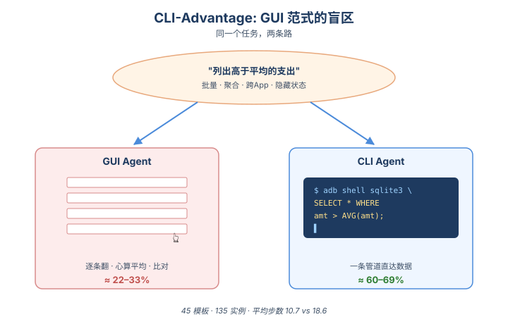
*图示：现有基准本身是按GUI能做的任务设计的，所以'看不见的需求'根本没被衡量。比如'删掉Downloads里所有.apk'、'本月Top3花销类别'、'昨天开会期间谁给我发短信了'——这些用手指点按钮要么做不到要么极其低效，但用shell管道和数据库查询天然就能做。这套基准把GUI范式的盲区显式暴露了出来。*

- 技术细节：作者构建45个任务模板共135实例，分5类：批量操作、多条件筛选、聚合与TopK、跨App工作流、隐藏设备状态。每类都对应规则验证器和人工核对的oracle CLI解。结果所有CLI Agent (60.7-68.9%) 都超过所有GUI基线 (22.2-33.3%)，平均步数10.7 vs 18.6。跨App工作流上GUI上限只有11%。
- 通俗讲解：现有基准本身是按GUI能做的任务设计的，所以'看不见的需求'根本没被衡量。比如'删掉Downloads里所有.apk'、'本月Top3花销类别'、'昨天开会期间谁给我发短信了'——这些用手指点按钮要么做不到要么极其低效，但用shell管道和数据库查询天然就能做。这套基准把GUI范式的盲区显式暴露了出来。
- 例子：'列出高于我平均消费的支出'：GUI Agent得逐条翻账单、心算平均值、逐条比较，过滤UI根本不支持这种组合谓词；CLI Agent一条SQL先求avg再select即可，几步搞定。

#### 技术点 3：Oracle上限与失败模式分析
- 快速理解：CLI范式理论上限88.8%/86.3%，且GUI与CLI失败模式截然不同，需各自的优化路径

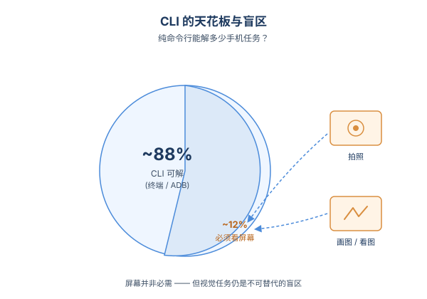
*图示：作者既给出了天花板（CLI能解决约88%的任务），也指出CLI不是万能的——拍照、画图、转写收据等本质需要看的任务还是得靠GUI。更有意思的是两种范式犯的错完全不一样，意味着以后优化也要分开搞，不能套用GUI Agent的训练经验。另外工具封装的价值取决于模型本身强不强，强模型自己写bash已经够用。*

- 技术细节：通过人机协作构造oracle CLI解，证明AndroidWorld 116个任务里103个、MobileWorld 117个里101个可纯CLI完成（剩余主要是看图、拍照、画图等天生视觉的任务）。轨迹级错误分析显示：GUI Agent主要错在步骤重复和过早终止，CLI Agent则集中在推理-动作不一致和验证不充分；包装ADB的工具对弱模型(GPT-5.3 Codex)能涨11-14点，对强模型几乎无收益。
- 通俗讲解：作者既给出了天花板（CLI能解决约88%的任务），也指出CLI不是万能的——拍照、画图、转写收据等本质需要看的任务还是得靠GUI。更有意思的是两种范式犯的错完全不一样，意味着以后优化也要分开搞，不能套用GUI Agent的训练经验。另外工具封装的价值取决于模型本身强不强，强模型自己写bash已经够用。
- 例子：把ADB包成sql/read-file/write-file/find-files四个工具后，GPT-5.3 Codex在Terminus-2上从48.9%涨到63.2%，成本降28%；但Claude Opus 4.7几乎没变化，因为它本身就能正确处理shell引号转义这类细节。

- **对 Agent 产品/系统的启发：** 做移动/设备Agent前先问一句：这事真的非要看屏幕吗？能走API/命令行就别走UI。
- **详细启发：** 产品侧：对于面向开发者或高级用户的手机助手，应该考虑双模式设计：日常UI操作走GUI，批量/聚合/跨App/系统状态类需求直接走CLI或API，不仅成功率高还省一半步数。论文也明确指出未来方向是CLI-GUI混合Agent。；系统侧：Agent系统的'动作空间'选择本身是个杠杆。在桌面/移动/IoT等同时暴露UI和编程接口的环境，优先评估CLI/API路径的可解性上限再决定是否上视觉模型，可能比堆VLM训练数据更划算。同时工具封装层要按模型能力做gating，强模型直接给原始接口，弱模型再包装高层工具。；风险：CLI范式依赖前沿闭源API（论文实验花了约$8K），不适合端上常态化使用；且只能触达终端能看到的状态，对私有UI流程和纯视觉任务（视频、图像编辑、手写）无能为力，安全上ADB级权限也比GUI危险得多。

## 三、总结

- harness和runtime层的工程化研究已经盖过模型本身
- 评测、协调、范式三条线同时在动摇旧假设
- 今天的信号很一致：Agent研究的瓶颈不在模型，而在harness、session、协调底座这些'模型外'的运行时层。
- 评测端从'能不能解题'转向'能撑多久、能不能预测真实表现'，对现有leaderboard的方法论质疑越来越硬。
- 范式选择上，CLI-first移动Agent和git原生多Agent协调都在提醒：与其继续堆视觉grounding和全局replan，不如换个执行衬底。
