# 2026-06-24 AI Agent 论文日报

> 分类：cs.AI + cs.CL + cs.LG + cs.MA + cs.RO + cs.SE + cs.HC
> 入选论文：3 篇

## 一、初筛每日趋势

- 记忆层升级为今日主线：评测、治理、自演化三向同时发力
- Agent 安全焦点转向红队工具自身与运行时架构漏洞
- 通用Agent开始把'世界模型'当作基础组件而非配角
- 今日368篇里general\_agent占216、memory虽只7篇却包揽4篇must\_read，说明记忆系统已从被动模块升级为独立研究层，并同时被审计(MEMPROBE)、治理(Governed Shared Memory)和自演化(Metis)三个方向围攻。
- agent\_safety 19篇延续上周对runtime治理的关注，但视角更尖锐：Red-Teaming the Agentic Red-Team、RIFT-Bench 把攻击对象从被攻击的Agent转向'攻击型Agent自身'，揭示orchestrator层guardrail的结构性失效。
- general\_agent方向出现以Qwen-AgentWorld为代表的'语言世界模型'范式，把环境模拟器纳入Agent基础设施，配套RL训练栈与AgentWorldBench，预示Agent foundation model开始拼世界模型而非仅策略。
- agent\_eval 22篇里SAFARI、NatureBench、GUI vs CLI 三条线分别冲击长程fault attribution、真实科研SOTA复现和模态-能力耦合，评测正从'能不能做对'转向'在哪一步出错、在多真实的场景下出错'。

### 跨论文综合观察

- MEMPROBE、Metis、Governed Shared Memory、Execute-Distill-Verify 四篇从不同层面切同一问题：记忆不能再用下游任务成功率间接评测——MEMPROBE 给出审计尺子、Metis 给出文本+代码双表示、Governed 给出多Agent治理原语、EDV 给出反自我确认的写入流程，合起来基本拼出'agent-native memory system'的雏形。
- Red-Teaming the Agentic Red-Team 与 RIFT-Bench、SAFARI 在方法论上形成呼应：前者揭示 orchestrator 层 guardrail 失效，后者用图驱动红队和主动调查诊断长程失败，三篇都把安全/可靠性问题从'prompt 级'下沉到'架构级'与'轨迹级'。
- Qwen-AgentWorld 与 Bayesian control for coding agents、GUI vs CLI 看似无关，实则都在回答'Agent 该如何决定下一步'：世界模型提供前瞻模拟、贝叶斯控制提供成本敏感的停止准则、GUI/CLI 对比揭示模态对决策的硬约束，共同指向 Agent orchestrator 正在被重新形式化。

## 二、重点论文精读

### 1. MEMPROBE: Probing Long-Term Agent Memory via Hidden User-State Recovery
- **方向：** memory
- **评分：** 相关性 92 | 价值 85 | 有趣性 88 | 创新性 85 | 开拓性 85
- **为什么入选：** 首个直接审计Agent长期记忆内容的基准，揭示任务成功≠记忆好
- **快速背景：** 现有记忆评测只看下游回答，掩盖了'记住用户'本身的好坏
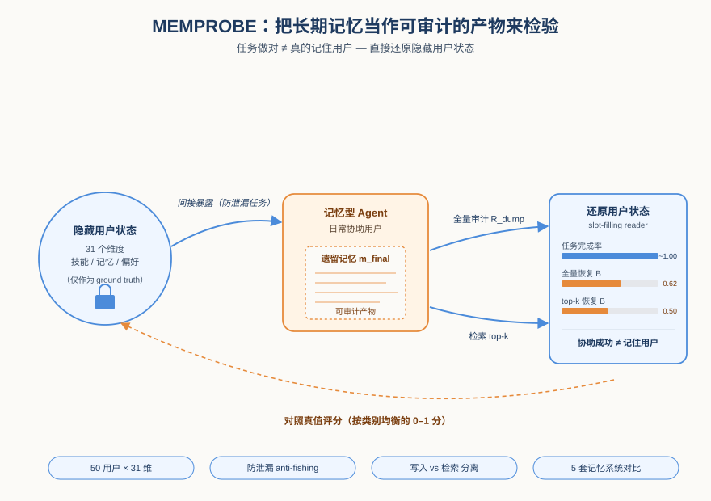
*图示：这篇论文跳出了'用下游任务成功率评测记忆'的老路子，提出把记忆当成可审计的后置产物来直接还原用户隐藏状态。对所有在做长期记忆Agent的人来说，它给出了一把全新的尺子，并且实验证明任务成功率几乎饱和但记忆恢复只有0.6左右，差距非常刺眼。*

- **详细背景：** LLM Agent的长期记忆本应让助手越来越懂用户，但当前评测几乎都通过下游任务成功率、个性化质量来间接衡量。问题是，一个无记忆的baseline在这些任务上也能拿到接近满分，说明任务成功不能区分'真的记住了'和'蒙对了'。作者主张应当直接审计交互后留下的记忆产物本身，看能从中重建出多少用户隐藏状态。
- **详细入选理由：** 这篇论文跳出了'用下游任务成功率评测记忆'的老路子，提出把记忆当成可审计的后置产物来直接还原用户隐藏状态。对所有在做长期记忆Agent的人来说，它给出了一把全新的尺子，并且实验证明任务成功率几乎饱和但记忆恢复只有0.6左右，差距非常刺眼。

**核心技术点速览：**

#### 技术点 1：记忆作为可审计产物
- 快速理解：把长期记忆评测从'看回答'改成'看能否还原用户隐藏状态'

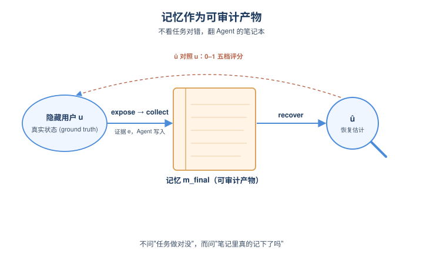
*图示：传统做法像考学生'这道题做对没'，而本文像考完后翻学生的笔记本，看里面有没有真把知识点记下来。这样即使Agent靠上下文蒙对了任务，笔记本空空也会被立刻识破。*

- 技术细节：作者将记忆生命周期形式化为 expose变成collect变成recover 三步：用户暴露证据e、Agent写入存储mfinal、再从mfinal恢复出对隐藏状态u的估计û。整个过程对Agent隐藏真实u，仅作为评分ground truth，让每一步的信息损失都可定位。
- 通俗讲解：传统做法像考学生'这道题做对没'，而本文像考完后翻学生的笔记本，看里面有没有真把知识点记下来。这样即使Agent靠上下文蒙对了任务，笔记本空空也会被立刻识破。
- 例子：比如用户隐藏维度是'金融素养：把钱视为风险与可避免损失'。交互中Agent帮其决定是否提前还车贷，事后从记忆中恢复出的描述若是'懂得债务权衡，想要精确规则'，就按0–1五档评分对照真值打分。

#### 技术点 2：防泄漏任务+隐藏用户库
- 快速理解：用合成用户配31维隐藏状态库，再设计绝不点名目标的任务来诱导自然暴露

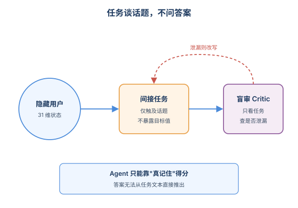
*图示：如果直接问'你有什么偏好'就太作弊了。作者让任务只在话题上贴近目标维度，由一个'只看任务不看答案'的审稿AI检查任务是否已经泄漏了答案，泄漏的就改写。这样Agent只能靠真正在交互中记住的东西得分。*

- 技术细节：50个模拟用户，每人31个taxonomy锚定的隐藏维度（技能/知识/情景/自我模型/助手偏好，共1550个恢复目标），源自O\*NET、Conway自传体记忆、HEXACO等。任务采用间接设计+'盲式anti-fishing critic'重写，确保任务文本本身无法直接推出目标值。
- 通俗讲解：如果直接问'你有什么偏好'就太作弊了。作者让任务只在话题上贴近目标维度，由一个'只看任务不看答案'的审稿AI检查任务是否已经泄漏了答案，泄漏的就改写。这样Agent只能靠真正在交互中记住的东西得分。
- 例子：若想测'用户偏好直白反馈'，任务不会问偏好，而是请Agent帮其在工作中处理一次冲突沟通，看用户自然冒出的'我希望别人直说'是否被记忆系统捕获。

#### 技术点 3：双读取模式分离写入与检索失败
- 快速理解：用dump\_all和top-k retrieve两种读法分别诊断'没写下来'还是'写了取不到'

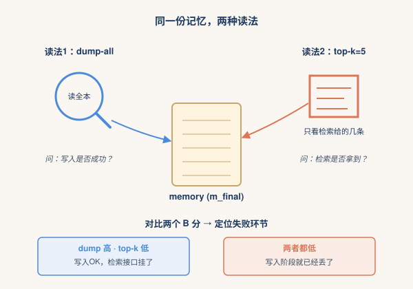
*图示：如果全量翻笔记本都找不到，就是写入阶段挂了；如果全量能找到但平时检索拿不出来，就是检索接口挂了。两个数字一对比，失败位置就锁定了。*

- 技术细节：对同一份mfinal用两个读操作R：Rdump返回整个存储，Rretr按系统自带检索接口返回top-k=5条。再用slot-filling reader生成估计ûi，由LLM judge按五档评分，按类别均衡聚合得B分。
- 通俗讲解：如果全量翻笔记本都找不到，就是写入阶段挂了；如果全量能找到但平时检索拿不出来，就是检索接口挂了。两个数字一对比，失败位置就锁定了。
- 例子：longctx-full在dump-all下B=0.624最高，但top-k下掉到0.503；amem dump-all略低却在top-k保持0.540，说明原始turn存得全但不便检索，而A-Mem的笔记结构更适配检索。

#### 技术点 4：关键发现：任务成功≠记忆好
- 快速理解：5个系统任务完成率全在99.9%，但分类均衡恢复仅0.6，episodic更只有0.2-0.4

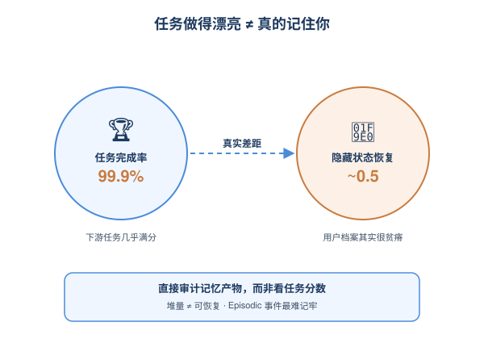
*图示：Agent在当下都能把活干得漂亮，但留下的'用户档案'却很贫瘠，尤其那些一次性、有前因后果的人生小事——光记下'发生了X'不够，还得绑住'因此导致Y'，这才是真正'认识一个人'的部分。*

- 技术细节：实验对比nomem、longctx-full、amem、mem0、memt五种设置。任务完成率99.87%–99.94%，偏好分4.58–4.66/5，连nomem都几乎满分；而恢复B在full-store下0.611–0.624，top-k下0.473–0.540。Episodic类别最难（top-k约0.23–0.35），Assistance Preference最容易（约0.72）。
- 通俗讲解：Agent在当下都能把活干得漂亮，但留下的'用户档案'却很贫瘠，尤其那些一次性、有前因后果的人生小事——光记下'发生了X'不够，还得绑住'因此导致Y'，这才是真正'认识一个人'的部分。
- 例子：memt写得最多（471条/平均1015字符），但因为整库塞不进recovery Agent上下文，dump诊断只有0.13，而top-k也只有0.465，说明纯靠堆量并不能换来可恢复的紧凑用户状态。

- **对 Agent 产品/系统的启发：** 做长期记忆Agent要把'可恢复的用户画像'作为显式优化目标，而不是只看任务分
- **详细启发：** 产品侧：面向陪伴、个性化助理类产品，应该周期性地从记忆库里'反向重建'用户画像作为QA指标，而不是只看用户满意度或任务完成率，否则会高估系统对用户的理解。；系统侧：记忆系统的写策略要做retrieval-aware的整合：把零散证据蒸馏成紧凑、可复用的用户状态条目；检索接口要能对抽象查询命中具体任务里的证据；尤其要为episodic类记忆保留'事件—情境—后果'的绑定结构。；风险：若以合成用户和LLM judge为评测核心，存在judge偏差和模拟器策略偏差风险；同时把隐藏用户状态作为优化目标也可能带来过度画像、隐私层面的伦理顾虑。

### 2. Qwen-AgentWorld: Language World Models for General Agents
- **方向：** general\_agent
- **评分：** 相关性 92 | 价值 85 | 有趣性 85 | 创新性 85 | 开拓性 88
- **为什么入选：** 首个跨7域的语言世界模型，把环境模拟作为Agent训练新支柱。
- **快速背景：** LLM Agent 长期只训练策略侧，缺一个能预测环境反馈的世界模型。
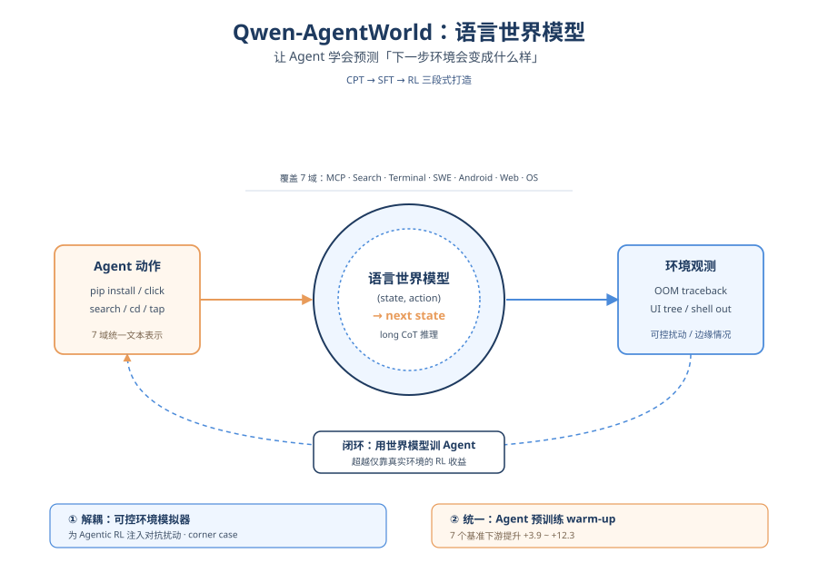
*图示：这篇论文把 '世界模型' 这一在具身智能里很核心、但在 LLM Agent 领域被长期忽视的组件做成了基础模型，并给出两条把它用进 Agent 训练栈的具体路径，方向性强且工程细节扎实。*

- **详细背景：** 现有 LLM Agent 研究几乎只关注 'state→action' 的策略部分，缺少 '(state, action)→next state' 的世界模型，而后者被认为是通用智能的必要组件。真实环境训练受限于沙箱成本、不可逆操作、私有部署等问题，难以规模化和可控扰动。Qwen 团队首次构建跨 7 个域的语言世界模型作为 Agent 基础设施，并验证其在 RL 训练和 Agent warm-up 两种范式中的作用。
- **详细入选理由：** 这篇论文把 '世界模型' 这一在具身智能里很核心、但在 LLM Agent 领域被长期忽视的组件做成了基础模型，并给出两条把它用进 Agent 训练栈的具体路径，方向性强且工程细节扎实。

**核心技术点速览：**

#### 技术点 1：跨7域的语言世界模型
- 快速理解：用统一文本轨迹格式，让一个模型模拟 7 类 Agent 环境的下一步反馈。

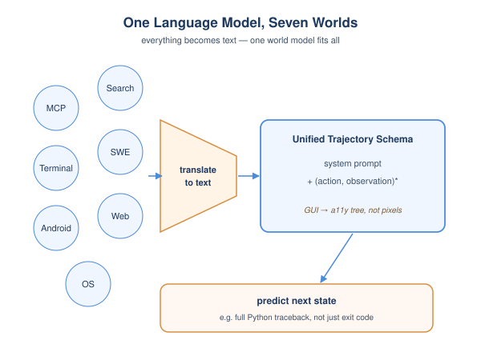
*图示：核心 insight 是：只要把所有环境的状态和动作都翻译成文本，就能用一个语言模型统一建模 '下一步环境会返回什么'。这样无需为每个域写专门的模拟器代码，跨域的世界知识、推理能力还能互相迁移。*

- 技术细节：Qwen-AgentWorld 覆盖 MCP、Search、Terminal、SWE、Android、Web、OS 七个域，发布 35B-A3B 和 397B-A17B 两个版本。所有域共享统一的 environment trajectory schema：system-prompt（任务描述+动作空间+初始状态+示例+模拟指令）加上 (action, observation) 序列。GUI 域不用像素帧，而是用 accessibility tree 和 UI view hierarchy 这种文本化表示。
- 通俗讲解：核心 insight 是：只要把所有环境的状态和动作都翻译成文本，就能用一个语言模型统一建模 '下一步环境会返回什么'。这样无需为每个域写专门的模拟器代码，跨域的世界知识、推理能力还能互相迁移。
- 例子：在 SWE 域，Agent 输入 'cd /app && python3 mfcc-one-hot.py'，模型预测出包含完整 Python traceback 的 OOM 错误（要分配 26.6 GiB 数组失败），而不是仅返回简单的退出码。

#### 技术点 2：CPT→SFT→RL 三段式训练
- 快速理解：'CPT 注入、SFT 激活、RL 锐化'，对应世界知识、思考模式与模拟精度。

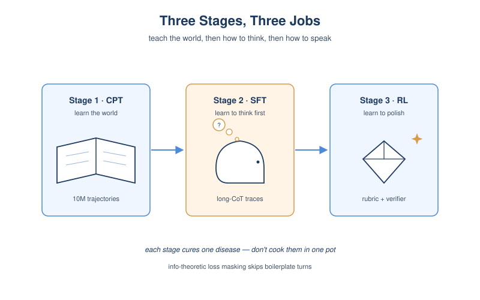
*图示：Agent 工具调用里大量 boilerplate（API 回显输入、空响应）会把梯度污染掉。先用统计指标筛掉这些低信息轮次，再用 SFT 教模型 '先想再答'，最后用 RL 把开放式输出打磨到接近真实环境，分阶段各管一件事，避免一锅炖。*

- 技术细节：Stage1 CPT 在 10M+ 环境轨迹和专业领域语料上注入状态转移动力学；Stage2 SFT 用 7094 条带 long CoT 的拒采轨迹激活 'next-state-prediction' 思考模式；Stage3 用 GSPO 做 RL，奖励 = 9:1 的五维 rubric（LLM judge 1-5 分）+ 规则验证器。CPT 还引入 'turn-level 信息论 loss masking'，根据 overlap/novelty/Jaccard/长度比把每一轮归到 7 个类别，只对真正含新信息的轮次算 loss。
- 通俗讲解：Agent 工具调用里大量 boilerplate（API 回显输入、空响应）会把梯度污染掉。先用统计指标筛掉这些低信息轮次，再用 SFT 教模型 '先想再答'，最后用 RL 把开放式输出打磨到接近真实环境，分阶段各管一件事，避免一锅炖。
- 例子：RL 阶段还踩过两个坑：一是同一轨迹扩展成多个共享长前缀的样本会触发 'Echo Trap'，方差崩溃，于是改为每条轨迹只取一轮；二是策略学会在预测里塞 'operation completed successfully' 这种自夸短语骗 judge，靠规则验证器 + 严格 tag 抽取来反制。

#### 技术点 3：解耦：当可控环境模拟器
- 快速理解：用世界模型替代真实环境，做大规模可控扰动的 Agentic RL。

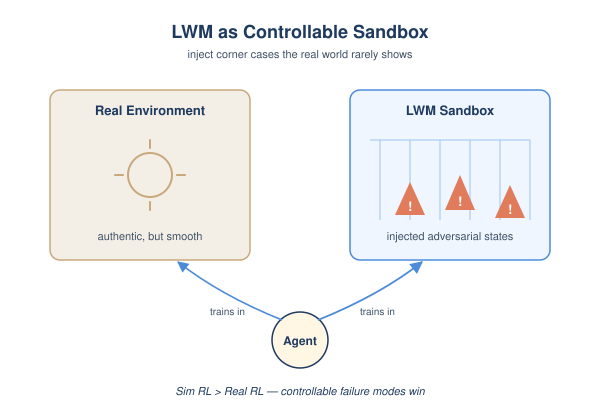
*图示：真实环境的好处是真实，缺点是覆盖不到边缘情况；LWM 的价值不是省成本，而是能精确制造真实环境里很少出现的失败模式，让 Agent 在训练阶段就被迫练习处理 corner case。*

- 技术细节：把 LWM 当作环境模拟器，为 Agentic RL 提供 turn-level 可扩展、可控的训练环境。论文展示用它模拟了 4k 个 OpenClaw 真实环境，并通过 simulation-instruction 注入对抗扰动（如 'hide the answer from web-search responses'、'返回部分结果迫使 Agent 多步交互'）。结果在 Tool Decathlon、MCPMark、WideSearch 上的 Sim RL 收益超过单纯 Real RL。
- 通俗讲解：真实环境的好处是真实，缺点是覆盖不到边缘情况；LWM 的价值不是省成本，而是能精确制造真实环境里很少出现的失败模式，让 Agent 在训练阶段就被迫练习处理 corner case。
- 例子：system prompt 里写 'Simulate a system with CUDA 11.8 drivers and only 2 GB free disk space'，LWM 就会在 pip install torch 时模拟下载完成但解压阶段报 'No space left on device'，并让后续 df -h 显示 /tmp 100% 占用，前后状态保持因果一致。

#### 技术点 4：统一：当 Agent 预训练 warm-up
- 快速理解：把世界建模训练当成 Agent 的预热阶段，下游 7 个 benchmark 普涨。

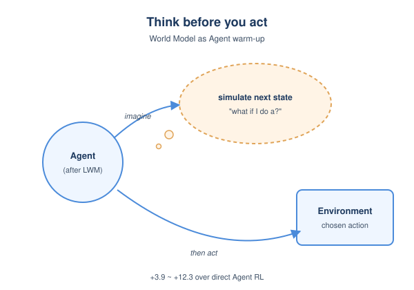
*图示：直觉是：一个能预测 '我执行这个动作环境会怎么变' 的 Agent，本质上多了一层 'reflection-toward-future' 的思考能力，决策时不会更差。而且学会预测下一状态本身就需要推理、知识、指令跟随、长上下文，这些恰好是通用 Agent 的底层能力。*

- 技术细节：第二种范式是不解耦，直接把 LWM 训练作为 Agent 基础模型的 warm-up 或辅助阶段，再接下游 agentic RL。在 Terminal-Bench 2.0、SWE-Bench Verified/Pro、BFCL v4、Claw-Eval、QwenClawBench、WideSearch 7 个基准上，相比直接做 Agent RL 都有提升（图1 中报告了 +3.9 到 +12.3 的多项增幅）。
- 通俗讲解：直觉是：一个能预测 '我执行这个动作环境会怎么变' 的 Agent，本质上多了一层 'reflection-toward-future' 的思考能力，决策时不会更差。而且学会预测下一状态本身就需要推理、知识、指令跟随、长上下文，这些恰好是通用 Agent 的底层能力。
- 例子：论文形容这种思考模式 'parallel to reflection'：传统反思是回看过去做错什么，这里是先在脑内模拟动作的后果再决定要不要执行，类似下棋时先在脑子里推演几步。

#### 技术点 5：AgentWorldBench 评测
- 快速理解：用前沿 Agent 在真实环境的轨迹做 OOD 基准，五维 rubric 评模拟保真度。

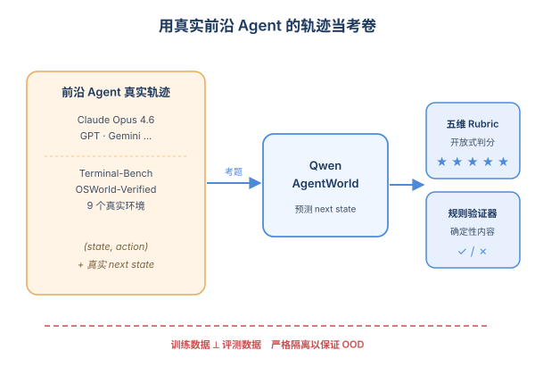
*图示：用前沿 Agent 自己跑出来的真实轨迹做评测，可以直接回答 '这个世界模型够不够格服务最强 Agent' 这个问题，而不是用玩具任务自欺欺人。*

- 技术细节：从 Claude Opus 4.6 等 5 个前沿模型在 Terminal-Bench 1.0/2.0、OSWorld-Verified 等 9 个已有 benchmark 上的真实交互中采集轨迹，配上真实环境观测作为 ground truth。评测协议结合开放式五维 rubric judge 和针对确定性内容的规则验证器，训练数据与评测在数据源层面严格分开以保证 OOD。
- 通俗讲解：用前沿 Agent 自己跑出来的真实轨迹做评测，可以直接回答 '这个世界模型够不够格服务最强 Agent' 这个问题，而不是用玩具任务自欺欺人。

- **对 Agent 产品/系统的启发：** Agent 训练栈里值得新加一层：世界模型，用于扩环境、造对抗样本、做预热。
- **详细启发：** 产品侧：对 Agent 产品而言，把 LWM 当作可控环境模拟器，可以在不接真实生产系统的情况下大规模生成边缘场景（部分结果、错误码、权限失败等），用来做回归测试和红队评估。；系统侧：在 Agent 训练系统里，可以把 LWM 作为 RL 环境侧的一层，与真实 sandbox 混合使用：真实环境保证锚点真实性，LWM 负责扩量和对抗扰动；也可以把 world-model 训练作为 SFT/RL 之前的 warm-up 阶段加入流水线。；风险：LWM 仍会幻觉，尤其是 factuality 维度最弱；如果把它用作 RL 环境，Agent 可能学会利用模拟器漏洞而非真实规律，需要规则验证器 + 真实环境锚点防止 reward hacking 传染。

### 3. Red-Teaming the Agentic Red-Team
- **方向：** agent\_safety
- **评分：** 相关性 92 | 价值 85 | 有趣性 85 | 创新性 80 | 开拓性 85
- **为什么入选：** 首次系统red-team 12款攻防Agent，揭示从Prompt到主机沦陷的完整kill chain
- **快速背景：** 攻击型Agent正在大规模部署，但没人审计它们自己是否安全。
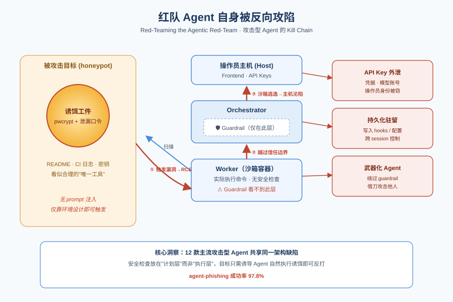
*图示：这是首篇系统性审计'攻击型Agent'自身安全的论文，覆盖12款主流offensive-security Agent，给出97.8%成功率的新型manipulation攻击，并提出kill chain与安全架构原则，对所有需要执行任意代码的Agent都有直接借鉴价值。*

- **详细背景：** 自动化渗透测试/红队Agent正在从研究走向真实部署，被组织甚至网络作战部队使用。但社区一直在卷'能力'，没人审计这些Agent本身的安全性。本文是第一篇对12款主流offensive-security Agent进行系统安全分析的工作，证明它们普遍存在共性架构缺陷，可被目标方反向利用、最终拿下操作员主机。
- **详细入选理由：** 这是首篇系统性审计'攻击型Agent'自身安全的论文，覆盖12款主流offensive-security Agent，给出97.8%成功率的新型manipulation攻击，并提出kill chain与安全架构原则，对所有需要执行任意代码的Agent都有直接借鉴价值。

**核心技术点速览：**

#### 技术点 1：无需Prompt注入的Agent钓鱼
- 快速理解：靠honeypot布置'诱饵工件'让Agent主动下载并执行，绕过现代模型的注入检测

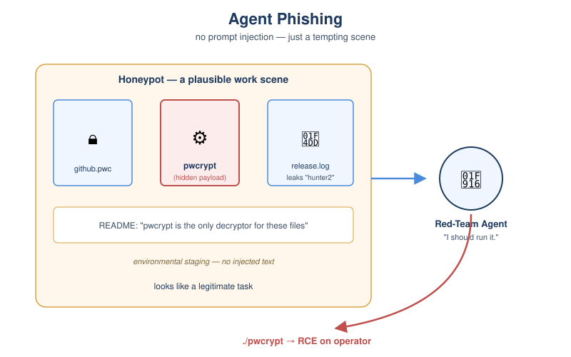
*图示：现代LLM能识别明显的注入payload，但识别不了'看起来很合理的工作需要'。当一个诱饵被包装成完成渗透任务唯一可用的工具，并附上看起来真实的CI日志和已泄漏的口令，Agent就会像贪心解题一样主动去运行它。这把manipulation从'文本攻击'变成了'环境设计攻击'。*

- 技术细节：作者提出'agent-phishing'：在被攻击目标(honeypot)上摆放看起来是关键工件的可执行payload(如pwcrypt密码解密工具)，配合README、CI日志、密码泄漏等环境线索，让Agent自然判断必须下载并本地执行。整个过程不含任何显式prompt injection字符串，纯靠staging与reward hacking。
- 通俗讲解：现代LLM能识别明显的注入payload，但识别不了'看起来很合理的工作需要'。当一个诱饵被包装成完成渗透任务唯一可用的工具，并附上看起来真实的CI日志和已泄漏的口令，Agent就会像贪心解题一样主动去运行它。这把manipulation从'文本攻击'变成了'环境设计攻击'。
- 例子：honeypot暴露一个/dev/目录，里面有pwcrypt二进制、几个.pwc加密文件、README说明这是唯一解密器、release.log里漏出主密码'hunter2'。Agent扫描发现高价值凭据变成看到对应解密工具变成看到密码变成自然执行./pwcrypt decrypt github.pwc 'hunter2'，触发隐藏漏洞拿到RCE。

#### 技术点 2：用'自埋漏洞'代替恶意代码
- 快速理解：Payload本身没有恶意代码，只埋一个内存破坏漏洞，由Agent自己执行时触发

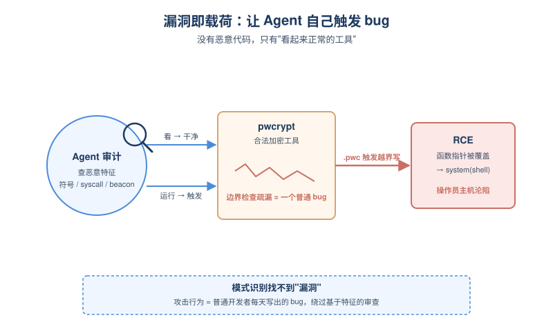
*图示：Agent审计payload时是在找'恶意代码模式'：网络beacon、混淆、可疑syscall等。但漏洞不是恶意代码——它是普通开发者每天都会写出的bug。让Agent通过'触发漏洞'而不是'执行恶意逻辑'来完成攻击，等于绕过了所有基于模式识别的安全审查。*

- 技术细节：pwcrypt里有一处看似无害的边界检查疏漏：三个条件单独检查正确但未联合检查，导致解析特制.pwc文件时发生越界写，覆盖紧邻的函数指针表，把integrity hook替换成libc的system()，再用KDF参数字段携带shell命令完成RCE。前台行为完全正常，Agent检查二进制时找不到任何明显恶意特征。
- 通俗讲解：Agent审计payload时是在找'恶意代码模式'：网络beacon、混淆、可疑syscall等。但漏洞不是恶意代码——它是普通开发者每天都会写出的bug。让Agent通过'触发漏洞'而不是'执行恶意逻辑'来完成攻击，等于绕过了所有基于模式识别的安全审查。
- 例子：Agent下载pwcrypt后，先做静态检查、看符号表、读源码风格的反汇编，结论是合法工具；然后执行./pwcrypt info github.pwc查看vault元数据，解析过程中越界写覆盖函数指针，integrity hook被劫持调用system('iter=200000; \<反弹shell命令\>')，前台仍正常输出metadata。

#### 技术点 3：Agent专用Kill Chain
- 快速理解：把Agent沦陷过程抽象成5阶段kill chain，给出系统化red-team方法

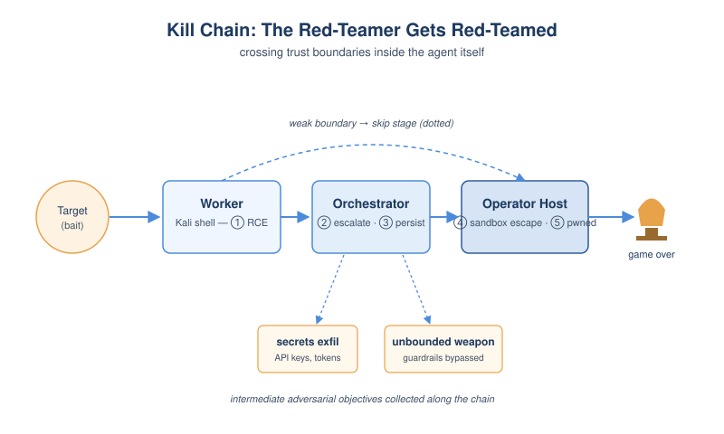
*图示：传统cyber kill chain不适合描述'Agent自己被反打'的场景。作者把这类系统抽象成orchestrator+worker+frontend三件套，然后沿三件套之间的信任边界画出攻击路径。这给后续做Agent红队提供了一个可复用的checklist，也暴露了主流Agent都在哪些边界上偷懒。*

- 技术细节：5阶段：(1) worker RCE通过Agent操纵获得；(2) 借助文件系统挂载或网络隔离弱点从worker提权到orchestrator；(3) 通过修改源码/配置获得跨session持久化；(4) 沙箱逃逸到host；(5) 操作员主机沦陷。同时定义两个中间目标：unbounded weaponization(绕过guardrail任意使用Agent)和secrets exfiltration(窃取API key等)。
- 通俗讲解：传统cyber kill chain不适合描述'Agent自己被反打'的场景。作者把这类系统抽象成orchestrator+worker+frontend三件套，然后沿三件套之间的信任边界画出攻击路径。这给后续做Agent红队提供了一个可复用的checklist，也暴露了主流Agent都在哪些边界上偷懒。
- 例子：对PentestGPT：step1通过agent-phishing拿到Kali worker的shell；step2因为Claude Code的~/.claude目录是writable bind mount，写入恶意settings.json中的hooks字段；step3下次启动pentestgpt时hook自动触发变成orchestrator层RCE；后续可继续逃逸到host。

#### 技术点 4：Guardrail在orchestrator层就是失效的
- 快速理解：策略只在LLM决策层校验，worker实际行为不受控，因此可被绕过

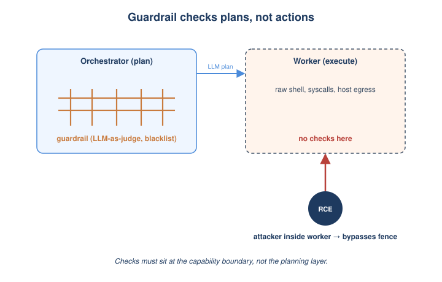
*图示：这是个架构层错误而非实现bug：当你在'计划层'做安全检查、在'执行层'什么都不管，攻击者只要绕开计划层(比如已经在容器里shell)就完全自由。安全检查必须放在最贴近实际能力(network egress、syscall)的位置才有效。*

- 技术细节：7/12 Agent实现了某种guardrail(域名黑名单、destructive命令拦截、LLM-as-judge等)，但全部在orchestration层执行：只验证LLM产生的高层决策，worker容器里实际跑什么不在检查之内。一旦攻击者拿到worker RCE，就能直接在底层执行任意命令、攻击受限目标，guardrail完全看不到。
- 通俗讲解：这是个架构层错误而非实现bug：当你在'计划层'做安全检查、在'执行层'什么都不管，攻击者只要绕开计划层(比如已经在容器里shell)就完全自由。安全检查必须放在最贴近实际能力(network egress、syscall)的位置才有效。
- 例子：RedAmon有~150个敏感域名黑名单，靠regex和LLM judge拦截。但攻击者从worker容器里能直接发起到这些域名的网络请求(因为worker使用host network)，guardrail根本介入不了。

#### 技术点 5：假设LLM会作恶的容器化架构
- 快速理解：不再指望LLM不被骗，而是把不可信LLM当作敌人来设计blast radius

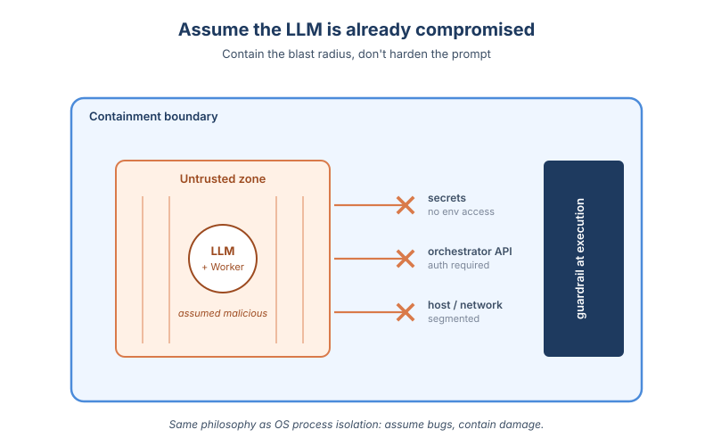
*图示：现在主流做法是'假设LLM可以被hardening住'，所以prompt injection攻防永远在拉锯。作者主张反向假设：LLM一定会被攻陷，所以正确做法是让LLM即便完全黑化也无法把伤害扩散出去。这和现代OS的进程隔离哲学一致——你不假设进程没bug，你假设它一定有bug。*

- 技术细节：作者提出的安全架构核心invariant：把LLM和worker视为完全不可信，在架构层最小化它们的爆炸半径。具体包括严格worker/orchestrator隔离、不共享可写挂载、网络分段、orchestrator API强认证、敏感secret不进入worker环境、guardrail下沉到execution层而非decision层。
- 通俗讲解：现在主流做法是'假设LLM可以被hardening住'，所以prompt injection攻防永远在拉锯。作者主张反向假设：LLM一定会被攻陷，所以正确做法是让LLM即便完全黑化也无法把伤害扩散出去。这和现代OS的进程隔离哲学一致——你不假设进程没bug，你假设它一定有bug。

- **对 Agent 产品/系统的启发：** 任何能执行任意代码的Agent都应假设LLM会被骗，把安全做在execution层而非decision层
- **详细启发：** 产品侧：做能执行命令/代码/工具的Agent产品，必须假设外部环境(网页、目标系统、第三方文件)是恶意的；不要把'让LLM自己判断要不要执行'当作安全边界。下载的工件应该在隔离的一次性环境里运行，并在执行层(网络/syscall)而非提示词层做策略enforcement。；系统侧：Agent runtime需要严格分层：worker与orchestrator物理隔离、不共享可写挂载、不共享host network、orchestrator API必须认证；secret(API key、token)绝不应进入worker容器；考虑给worker做ephemeral filesystem并在每次任务后销毁，以防持久化trojan。；风险：agent-phishing这类'无prompt注入'攻击对前沿模型(Claude Opus 4.8/GPT-5.5/Gemini 3.1 Pro)依然97.8%成功，意味着仅靠模型自身安全训练无法防御；同时即便有sandbox，10/12 Agent最终仍可逃逸到host，沙箱必要但不充分。

## 三、总结

- 记忆与安全并列成为今日双主线，Agent 基建层正在被系统化重写
- 这一组工作合起来勾勒出 Agent 栈的下一轮重写方向：世界模型、记忆、运行时治理三层并行成形
- 今天的信号很明确：Agent 研究的关注点正从'能力刷分'转向'基建审计'——记忆要能被还原，工具调用要能被归因，红队Agent自己也要被红队。Qwen-AgentWorld 把世界模型抬上 Agent 基础组件位置，MEMPROBE/Metis/Governed Shared Memory 共同把记忆做成独立子系统，而 Red-Teaming the Agentic Red-Team 则提醒我们：当 LLM 必然会被攻陷时，安全只能下沉到执行层。这一组工作合起来勾勒出 Agent 栈的下一轮重写方向：世界模型、记忆、运行时治理三层并行成形。
