# 2026-06-25 AI Agent 论文日报

> 分类：cs.AI + cs.CL + cs.LG + cs.MA + cs.RO + cs.SE + cs.HC
> 入选论文：3 篇

## 一、初筛每日趋势

- general\_agent 189篇继续主导
- agent\_eval 27 + agent\_safety 26 共 53 篇
- memory 10篇却出 3 篇 must\_read，记忆从模块升级为可治理的一等公民
- 今日 414 篇里 general\_agent 占 189、embodied 51，研究继续从模型能力下移到 harness 设计、消息总线与 runtime 治理，The Interplay of Harness Design 直接把 harness 当独立设计维度研究。
- agent\_eval 27 + agent\_safety 26 合计 53 篇，评测维度从静态通过率扩展到工具环境不可靠 (ToolBench-X)、测试时持续学习 (AgentOdyssey) 和行为取证 (Model Forensics)，开始追问 Agent 在真实失效下的恢复与意图。
- memory 主题仅 10 篇却贡献 3 篇 must\_read：TRUSTMEM 治理写入污染、端侧 budget-curated memory 管理预算与投毒、EKG 把领域知识沉淀成可演化图谱，记忆层正在被系统化重构。
- code\_agent 和多 Agent 工作 (icat-agent、Adaptive Scaffolding) 不约而同走向'去中心化 + 事件驱动消息总线 + 角色分工'，开始取代共享上下文式 orchestrator。

### 跨论文综合观察

- Adaptive Multi-Agent Scaffolding 和 The Interplay of Harness Design 是同一个问题的两面：前者给出去中心化事件总线的具体架构，后者把 harness 设计本身抬升为与 post-training 同等的研究变量，共同宣告 harness 时代到来。
- TRUSTMEM、On-Device Budget-Curated Memory 和 Agentic EKG 分别从可信写入、资源治理、知识沉淀三个角度重塑记忆层，方法论上都在把记忆从'存什么'转向'怎么验证、预算与演化'，呈现明显共性趋势。
- AgentOdyssey、ToolBench-X 和 Model Forensics 把评测从结果导向推到过程与意图层面——一个查长程学习，一个查工具失效恢复，一个查行为是否真出于错位，三者拼起来就是 Agent 可靠性评测的新坐标系。

## 二、重点论文精读

### 1. Agentic evolution of physically constrained foundation models
- **方向：** memory
- **评分：** 相关性 100 | 价值 90 | 有趣性 80 | 创新性 82 | 开拓性 85
- **为什么入选：** 把'演化知识图谱'当 Agent 长期记忆，用算法 CoT 替代盲目搜索，对记忆型 Agent 设计有直接借鉴。
- **快速背景：** 通用 Agent 做硬件相关设计时容易'物理幻觉'，作者用结构化记忆+多 Agent 把它约束住。
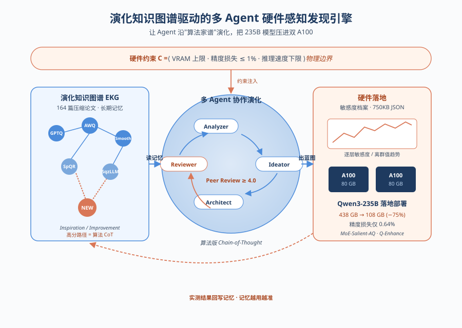
*图示：这篇论文的核心其实是一个多 Agent 协作 + 结构化历史记忆的系统：用一个'演化知识图谱'当作 Agent 的长期记忆，把 164 篇压缩方法论按'谁启发了谁、谁改进了谁'连成图，再让多个角色 Agent (分析-构想-架构-审稿-执行) 沿着高分轨迹做'算法版 Chain-of-Thought'。它给 Agent 系统设计提供了一个相对完整的样本：怎么把领域知识沉淀成可查询的记忆、怎么用 peer review 抑制幻觉、怎么把抽象方案落到硬件约束里执行。*

- **详细背景：** 当前自主科研 Agent 大多在纯软件层操作，缺乏对物理约束的理解，经常输出硬件根本跑不动的方案，作者称之为'物理幻觉'。另一条路是传统自动化搜索，但只能在预定义的小空间里组合，没法真正发明新算法。论文要解决的问题是：怎么让 Agent 在严格硬件约束下，自主演化出新的模型压缩方法，并且能真的部署。作者选了一个极端测试场：把 235B 大模型压到双 A100 上跑。
- **详细入选理由：** 这篇论文的核心其实是一个多 Agent 协作 + 结构化历史记忆的系统：用一个'演化知识图谱'当作 Agent 的长期记忆，把 164 篇压缩方法论按'谁启发了谁、谁改进了谁'连成图，再让多个角色 Agent (分析-构想-架构-审稿-执行) 沿着高分轨迹做'算法版 Chain-of-Thought'。它给 Agent 系统设计提供了一个相对完整的样本：怎么把领域知识沉淀成可查询的记忆、怎么用 peer review 抑制幻觉、怎么把抽象方案落到硬件约束里执行。

**核心技术点速览：**

#### 技术点 1：演化知识图谱当长期记忆
- 快速理解：把 164 篇压缩方法做成可遍历的图记忆，节点存元数据，边记录'谁改进了谁'。

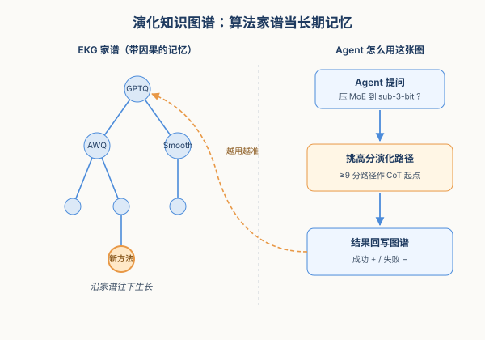
*图示：可以把 EKG 理解成 Agent 的'领域记忆库'，不是简单的向量检索，而是一张带因果关系的家谱图。当一个新任务进来时，Agent 不是去硬搜相关段落，而是顺着家谱找'这条演化路径有没有还没人走过的下一步'，这就比纯 RAG 更有方向感。每完成一次成功演化，新方法会被回写进图里，失败的路径也会被打上负反馈，记忆会越用越准。*

- 技术细节：作者用 schema 引导的 LLM 解析器把 2022 年以来的压缩论文抽成 Neo4j 属性图，节点是具体方法 (含 7 类元数据：基本信息、核心贡献、方法细节、适用模型、硬件适配、实验结果、局限)，边是 Inspiration / Improvement 等有向关系。图分两层：宏观拓扑展示算法家族的分叉演化，微观节点记录如 W8A8 精度、内存压缩比、引入了什么可学习参数等转移机制。
- 通俗讲解：可以把 EKG 理解成 Agent 的'领域记忆库'，不是简单的向量检索，而是一张带因果关系的家谱图。当一个新任务进来时，Agent 不是去硬搜相关段落，而是顺着家谱找'这条演化路径有没有还没人走过的下一步'，这就比纯 RAG 更有方向感。每完成一次成功演化，新方法会被回写进图里，失败的路径也会被打上负反馈，记忆会越用越准。
- 例子：比如任务是'压缩 MoE 模型到 sub-3-bit'，系统会先在 EKG 里给每条历史路径打 1-10 分相关性，留下 \>=9 分的高潜路径，比如从 GPTQ 变成 AWQ 变成 SmoothQuant 这条权重量化主线，再采样其中一条当作后续推理的算法 CoT 起点。

#### 技术点 2：异构多 Agent + 算法版 CoT
- 快速理解：用 Analyzer/Ideator/Architect/Reviewer 四类角色沿历史轨迹做定向变异，而不是盲目采样。

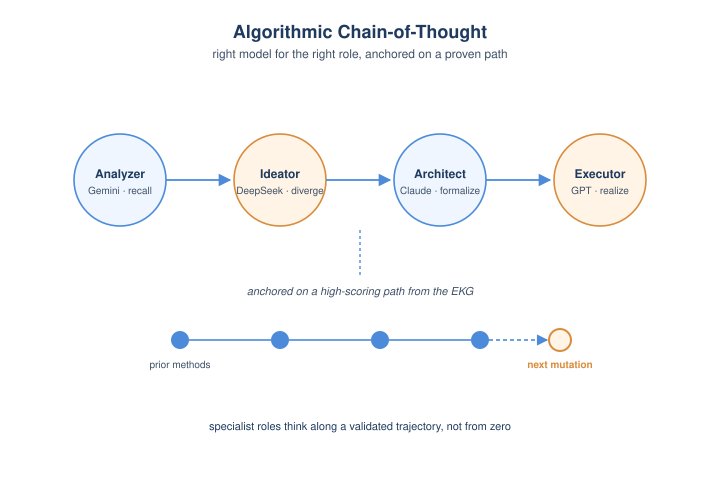
*图示：和单模型 zero-shot 或 few-shot 比，作者把'想点子'拆成了一条流水线：先复盘历史方法为什么 work，再提新假设，再形式化成可执行蓝图。每个角色用最适合它的模型，避免一个模型既要发散又要严谨。算法 CoT 的关键在于'有锚点'——它不是从零开始想，而是站在某条具体的演化路径上接着想下一步。*

- 技术细节：系统按能力把不同基础模型分配给不同角色：Gemini Pro 做 Analyzer 和 Reviewer (利用长上下文做轨迹剖析与审稿)，DeepSeek 做 Ideator (发散性假设)，Claude Opus 做 Architect (严谨的算法形式化)，GPT-5.5 类模型做最终代码执行。从 EKG 抽出的高分路径被当作 'algorithmic Chain-of-Thought' 上下文，引导这一组 Agent 顺着已验证推理路径做变异。
- 通俗讲解：和单模型 zero-shot 或 few-shot 比，作者把'想点子'拆成了一条流水线：先复盘历史方法为什么 work，再提新假设，再形式化成可执行蓝图。每个角色用最适合它的模型，避免一个模型既要发散又要严谨。算法 CoT 的关键在于'有锚点'——它不是从零开始想，而是站在某条具体的演化路径上接着想下一步。
- 例子：消融实验里 (Figure 5a)，同样用 DeepSeek 当底座：zero-shot 完全做不出 Tier 1 方案 (硬件不兼容幻觉)，few-shot 也只是边际改进；切换到这条多 Agent + 算法 CoT 的流程后，Tier 1 方案占比直接跳到 50%，作者形容这是一次'相变'。

#### 技术点 3：AI Peer Review 抑制幻觉
- 快速理解：在落地前用 5 维加权打分硬卡阈值，分不够直接打回，避免烧算力调试坏蓝图。

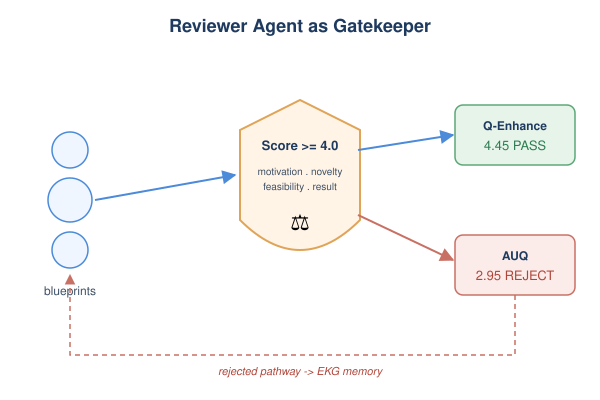
*图示：这一步相当于在 Agent 流水线里塞了一个'守门员'，把生成阶段的高方差挡在物理执行之前。因为后面跑代码、做量化、上 A100 都很贵，所以在便宜的推理阶段就用结构化打分卡掉一大半烂方案，整体性价比就上来了。失败案例还会被写回 EKG 当作 Rejected Pathway，下次遍历时直接降权。*

- 技术细节：Reviewer Agent 按 5 分制对每份蓝图打分，权重固定：动机 0.25、创新 0.25、可行性 0.20、预期结果 0.20、弱点 0.10，加权总分要 \>=4.0 才能进候选池。低于阈值或数学/硬件上不自洽的直接丢弃。为了防止 LLM-as-a-judge 的自偏好，作者还跑了 25 个对照算法 (含 The AI Scientist、arXiv preprint、顶会论文等) 做基准对齐。
- 通俗讲解：这一步相当于在 Agent 流水线里塞了一个'守门员'，把生成阶段的高方差挡在物理执行之前。因为后面跑代码、做量化、上 A100 都很贵，所以在便宜的推理阶段就用结构化打分卡掉一大半烂方案，整体性价比就上来了。失败案例还会被写回 EKG 当作 Rejected Pathway，下次遍历时直接降权。
- 例子：论文图里给出对比：Q-Enhance 加权得分 4.45 变成 通过；另一个候选 AUQ 得 2.95 变成 拒绝，并以低分轨迹形式回写 EKG，未来路径检索时会被压制。

#### 技术点 4：敏感度档案桥接硬件
- 快速理解：用 ~750KB 的 JSON+趋势图代替 TB 级权重，把硬件反馈塞进 Agent 决策循环。

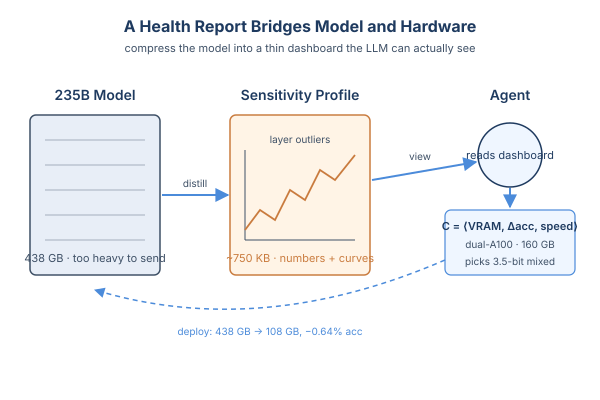
*图示：想让 Agent 真正考虑硬件，就得让它'看得到'硬件，但又不能把几百 GB 的权重传给 LLM。作者的做法是把模型蒸成一份非常瘦的'体检报告'，既有数字也有图，让 Agent 像看 dashboard 一样判断哪些层敏感、哪些层可以激进压。这样从全局算法演化到具体设备部署之间就有了一条带宽友好的反馈通道。*

- 技术细节：本地 profiler 用 128 条 WikiText-2 校准样本生成一个 Sensitivity Profile，包含 Architecture Block (层拓扑) 和 Numerics Block (权重/激活分布、梯度敏感度、各组件量化敏感度)，整包压到 ~750KB JSON。同时把统计指标渲染成趋势图，让基础模型能'看图'理解跨层离群值和退化曲线。硬件约束被形式化成 C=⟨VRAM 上限, 精度损失上限, 速度下限⟩，Recommender 据此查 EKG 选策略，Evaluator 再迭代搜索 bit width / group size 等配置。
- 通俗讲解：想让 Agent 真正考虑硬件，就得让它'看得到'硬件，但又不能把几百 GB 的权重传给 LLM。作者的做法是把模型蒸成一份非常瘦的'体检报告'，既有数字也有图，让 Agent 像看 dashboard 一样判断哪些层敏感、哪些层可以激进压。这样从全局算法演化到具体设备部署之间就有了一条带宽友好的反馈通道。
- 例子：部署 Qwen3-235B-A22B 到 dual-A100 (160GB) 场景时，系统读取敏感度档案后，开出 3.5-bit 仅权重方案，按专家激活显著性混合 INT3/INT4，把 438GB 压到 108GB，精度只掉 0.64% (79.49% 变成 78.85%)，落在 1% 容忍区内。

- **对 Agent 产品/系统的启发：** 想做能持续学习的领域 Agent，先把领域知识做成带因果边的图记忆，再用多角色 + 审稿守门员组织生成。
- **详细启发：** 产品侧：对垂直领域 Agent (科研、芯片、编译、EDA 等) 来说，最值得抄的是这套'结构化记忆 + 多角色生成 + 审稿守门员 + 环境反馈'四件套，特别是把领域知识沉淀成带因果边的图，而不是只丢进向量库。产品上可以让用户看到 Agent '沿着哪条历史路径在演化'，比纯黑盒生成更可解释。；系统侧：系统层面有两个工程点值得借鉴：一是把不同推理角色绑到不同模型 (长上下文 vs 发散 vs 形式化 vs 代码)，比'一个 GPT 打天下'更稳；二是把环境/硬件反馈压成轻量结构化档案再喂回 Agent，避免上下文爆炸，同时让评审/评估闭环可量化。EKG 的成功/失败双向回写也是一个值得复用的长期记忆更新模式。；风险：EKG 的初始构建仍需人工审计来保证抽取质量，论文也明确指出这是当前未完全自动化的环节；同时 LLM 推理本身的随机性让算法可复现性和确定性性能保证仍是开放问题。如果直接照搬，要小心评审 Agent 的自偏好以及历史记忆带来的路径依赖 (Agent 可能困在主流方法家族里)。

### 2. Unlocking Model Potentials Through Adaptive Multi-Agent Scaffolding for Efficient Issue Resolution
- **方向：** code\_agent
- **评分：** 相关性 92 | 价值 88 | 有趣性 85 | 创新性 82 | 开拓性 82
- **为什么入选：** 去中心化多Agent+事件消息总线，让同一模型在SWE-bench上多解6-18%
- **快速背景：** 单Agent长上下文会污染，传统多Agent又靠orchestrator汇总仍会传播偏差。
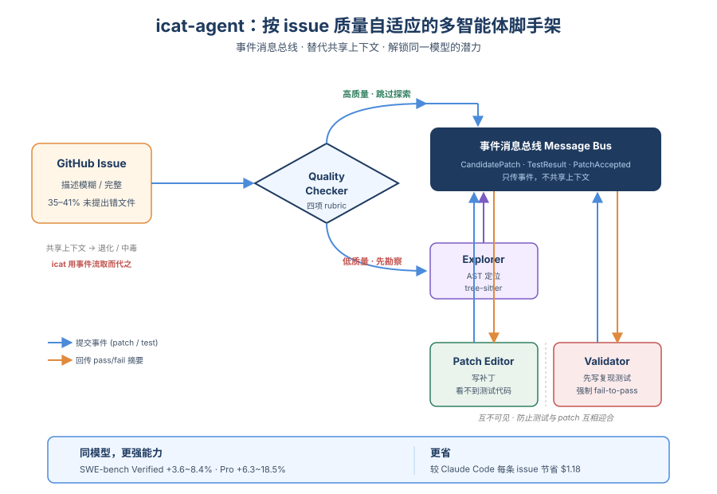
*图示：这篇论文给出了一个非常实用的code agent架构范式：用质量分级路由+事件驱动消息总线取代共享上下文，配合Explorer/Validator/Patch Editor三agent分工，在SWE-bench Verified和Pro上用同一模型显著优于SWE-agent、mini-SWE-agent和Claude Code，对Agent harness设计有直接借鉴价值。*

- **详细背景：** 解决GitHub issue需要定位、复现、修补、验证的长程流程，单Agent scaffold（如SWE-agent）共享上下文会出现context degradation、test overfitting和patch overfitting；现有orchestrator/team-lead式多Agent又会因中心节点汇总所有子Agent摘要而传播偏差，同时面对模糊issue时规划失灵。作者统计发现SWE-bench Verified/Pro里35-41%的issue连buggy文件都没提，现实场景更糟，这促使他们设计去中心化、按issue质量自适应的scaffold。
- **详细入选理由：** 这篇论文给出了一个非常实用的code agent架构范式：用质量分级路由+事件驱动消息总线取代共享上下文，配合Explorer/Validator/Patch Editor三agent分工，在SWE-bench Verified和Pro上用同一模型显著优于SWE-agent、mini-SWE-agent和Claude Code，对Agent harness设计有直接借鉴价值。

**核心技术点速览：**

#### 技术点 1：Issue质量分级路由
- 快速理解：用四条rubric判断issue是否够清晰，决定要不要先探索

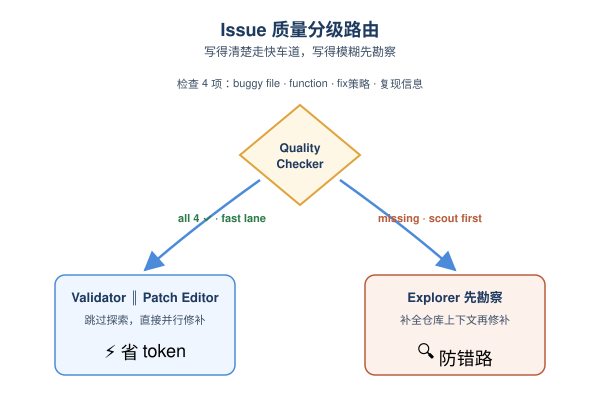
*图示：把'issue写得够不够清楚'当作一个开关：写得清楚就走快车道省token，写得模糊就先派人勘察现场。判定保守是因为多花一点探索成本远比带着错误上下文开修便宜。*

- 技术细节：Quality Checker按四个二元标准评估issue描述：是否点名buggy文件、是否点名buggy函数、是否给出修复策略、是否包含复现信息（测试代码/报错/期望行为）。只有四条全部满足才判为high quality，直接跳过探索并行启动Validator和Patch Editor；否则判为low quality，先派Explorer补充仓库上下文。
- 通俗讲解：把'issue写得够不够清楚'当作一个开关：写得清楚就走快车道省token，写得模糊就先派人勘察现场。判定保守是因为多花一点探索成本远比带着错误上下文开修便宜。
- 例子：对一个明确指出openlibrary/core/models.py中Edition.from-isbn方法、并给出接口规范和复现步骤的issue，Checker打分为high quality，直接并行进入修补和测试；而matplotlib那个只描述了'年份没显示'的issue则被判为low quality，Explorer先用AST工具定位到ConciseDateFormatter.format-ticks再开工。

#### 技术点 2：事件消息总线替代共享上下文
- 快速理解：Validator和Patch Editor只交换结构化事件，不共享原始trajectory

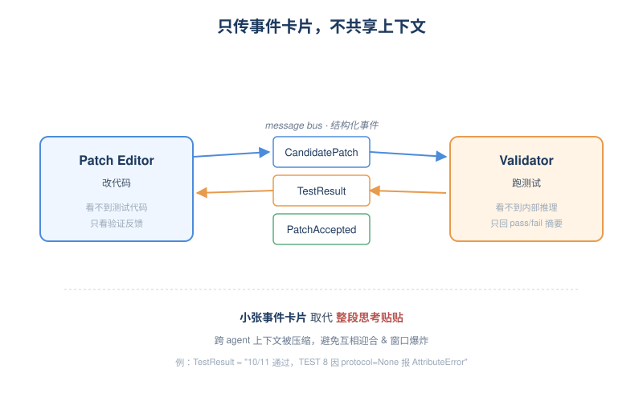
*图示：把传统的'把整段思考贴给对方'换成'只发关键事件卡片'。修补的人只知道'第8个测试挂了，回归测试都过了'，但看不到测试怎么写；测试的人只知道'有了一个新patch'，但看不到改patch时的内部推理。这样既防止互相迎合，也避免上下文窗口被塞爆。*

- 技术细节：三个agent通过message bus用CandidatePatch、TestResult、PatchAccepted等结构化事件类型同步通信。Validator只传pass/fail结果和失败语句摘要，不暴露测试代码；Patch Editor只看到验证反馈，不看测试断言；从而把跨agent上下文Icross压缩到远小于本地trajectory的大小。
- 通俗讲解：把传统的'把整段思考贴给对方'换成'只发关键事件卡片'。修补的人只知道'第8个测试挂了，回归测试都过了'，但看不到测试怎么写；测试的人只知道'有了一个新patch'，但看不到改patch时的内部推理。这样既防止互相迎合，也避免上下文窗口被塞爆。
- 例子：Patch Editor提交一版diff后，Validator跑测试回传一条TestResult：'10/11 reproduction通过，TEST 8因protocol=None报AttributeError，3/3 regression通过'。Patch Editor据此诊断并修补None分支，再次提交CandidatePatch，循环直到收到PatchAccepted事件。

#### 技术点 3：防止测试与patch互相迎合
- 快速理解：用先失败后通过、隔离信息流的方式抑制test/patch overfitting

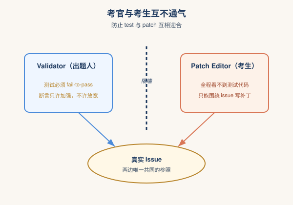
*图示：传统单Agent经常先写个弱测试再写一段恰好通过它的patch，等于自己出题自己答。这里强制测试必须能抓住原bug、且写测试的人和写patch的人互不通气，让两边都只能围绕真实需求工作，自然避免互相对齐。*

- 技术细节：Validator在拿到patch前就先基于issue和Explorer摘要生成reproduction test，并强制要求至少一个测试在buggy版本上失败（fail-to-pass），否则继续refine；只有当反复失败形成loop时才允许通过Reflect步骤修订测试断言，且只允许加强不允许放宽。Patch Editor则全程看不到测试代码。
- 通俗讲解：传统单Agent经常先写个弱测试再写一段恰好通过它的patch，等于自己出题自己答。这里强制测试必须能抓住原bug、且写测试的人和写patch的人互不通气，让两边都只能围绕真实需求工作，自然避免互相对齐。
- 例子：在flipt那个案例里，Validator连续几次拒绝patch后通过Reflect识别出是自己测试覆盖了整个config struct导致默认值被清空，于是修正测试期望而非放宽断言；在django-13964式的patch overfitting场景中，因测试人员看不到patch细节，就不会写出'断言SQL里没有BETWEEN'这种贴合错误patch的弱测试。

#### 技术点 4：Explorer做AST结构化定位
- 快速理解：low quality issue先用tree-sitter生成定位+调用链摘要

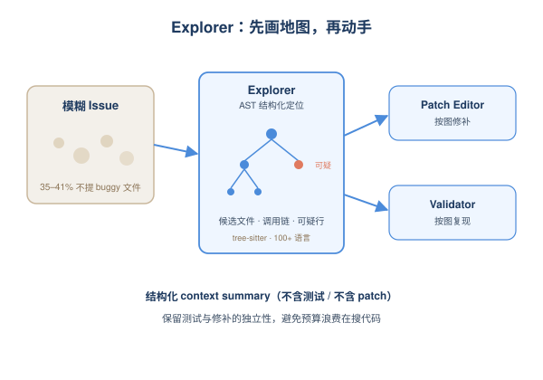
*图示：对模糊issue先派一个'读代码的'，把现场画好地图再交给修补和测试两路人，避免他们各自把预算都浪费在搜代码上，也降低对Python习语的依赖（这也是非Python语言上提升更大的原因之一）。*

- 技术细节：Explorer基于tree-sitter（支持100+语言）进行AST级仓库探索和静态分析，产出结构化context summary：候选buggy文件/函数、相关调用链（按长度排序并按上下文窗口截断）、可疑代码行。该摘要只来自issue和仓库本身，不包含任何生成的测试或patch，保留测试与修补的独立性。
- 通俗讲解：对模糊issue先派一个'读代码的'，把现场画好地图再交给修补和测试两路人，避免他们各自把预算都浪费在搜代码上，也降低对Python习语的依赖（这也是非Python语言上提升更大的原因之一）。
- 例子：面对matplotlib那个'年份不显示'的low quality issue，Explorer定位到lib/matplotlib/dates.py的ConciseDateFormatter.format-ticks，指出795-806行的level-selection循环会在level\<2时把show-offset设为False，并把--init--、get-offset、offset-formats的依赖关系一并交给后续两个agent。

#### 技术点 5：实测：同模型解题率显著提升
- 快速理解：同backbone下Verified +3.6-8.4%、Pro +6.3-18.5%，每例还省约$1.18

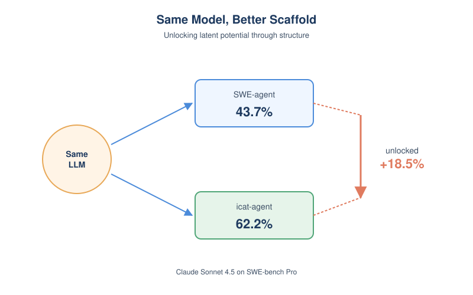
*图示：作者反复强调一个观点：scaffold本身能'解锁'模型的潜力。同一个模型换上icat-agent就能多解出一截题，并且越是难题、非Python语言、低质量issue，提升越明显，说明结构化通信带来的收益是真实可叠加在模型之上的。*

- 技术细节：在SWE-bench Verified(500)和Pro(731)上用MiniMax M2.5、GPT-5-mini、Claude Sonnet 4.5、GPT-5.4-xhigh四个模型对比SWE-agent、mini-SWE-agent、Claude Code。icat-agent在Verified上比mini-SWE-agent提升3.6-8.4%，在Pro上比SWE-agent/mini-SWE-agent/Claude Code分别提升18.5%、8.3%、6.3%；GPT-5.4-xhigh+icat-agent在Pro拿到67.4%，每例平均成本1.49 vs Claude Code的2.67。
- 通俗讲解：作者反复强调一个观点：scaffold本身能'解锁'模型的潜力。同一个模型换上icat-agent就能多解出一截题，并且越是难题、非Python语言、低质量issue，提升越明显，说明结构化通信带来的收益是真实可叠加在模型之上的。
- 例子：在SWE-bench Pro上，Claude Sonnet 4.5用SWE-agent只能解43.7%，换到icat-agent变成62.2%；按修改文件数分组的多文件难题里icat-agent比Claude Code高5.3-7.2%；TypeScript和JavaScript子集分别从37.6%/25.0%跳到61.0%/75.0%。

- **对 Agent 产品/系统的启发：** 做code agent时把'共享上下文'换成'结构化事件总线+角色隔离'，可能比换更大模型更划算。
- **详细启发：** 产品侧：对于做code agent或issue修复类产品的团队，可以借鉴'先做issue质量分级再决定走快车道还是慢车道'的产品形态：清晰的工单直接并行修补+测试，模糊的工单先自动勘察仓库，既能控制成本也能给用户透明的进度反馈。；系统侧：Agent harness应把跨Agent通信收敛为结构化事件（CandidatePatch/TestResult等），避免把完整reasoning trace塞进彼此上下文；同时通过信息隔离（测试方不看patch内部、修补方不看测试代码）系统性地抑制互相迎合，比单纯加更长上下文更能稳长程任务。；风险：Quality Checker的rubric判断本身依赖LLM，可能误判把low quality当成high quality导致跳过探索；事件消息抽象得过窄又可能让Patch Editor缺信息打转，需要在payload设计和Reflect自纠机制上平衡。

### 3. AgentOdyssey: Open-Ended Long-Horizon Text Game Generation for Test-Time Continual Learning Agents
- **方向：** agent\_eval
- **评分：** 相关性 92 | 价值 85 | 有趣性 85 | 创新性 80 | 开拓性 85
- **为什么入选：** 首个测试时持续学习Agent的程序化长程文本游戏评测
- **快速背景：** 传统Agent评测假设测试时不再学习，难以暴露Agent真实长程能力
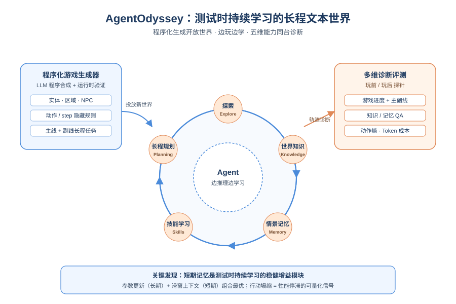
*图示：现有Agent评测多是静态推理评测，忽视了真实部署中Agent要边用边学。这篇论文用程序化生成的开放长程文本游戏，把探索、记忆、世界知识、技能学习、长程规划五种能力都拉到同一个评测里，并提供多维诊断指标，对做Agent评测和能力边界研究非常有参考价值。*

- **详细背景：** 目前主流Agent benchmark（ALFWorld、TextWorld等）多是封闭、可重置、单一任务的环境，默认训练和测试分离，Agent在测试时不再学习。但真实部署中Agent需要在交互中不断获取新知识、积累经验、跨长时间维护目标。作者认为评测必须把'测试时持续学习'当作一等公民，因此提出AgentOdyssey，用程序化生成的长程文本游戏来同时考察五种关键能力。
- **详细入选理由：** 现有Agent评测多是静态推理评测，忽视了真实部署中Agent要边用边学。这篇论文用程序化生成的开放长程文本游戏，把探索、记忆、世界知识、技能学习、长程规划五种能力都拉到同一个评测里，并提供多维诊断指标，对做Agent评测和能力边界研究非常有参考价值。

**核心技术点速览：**

#### 技术点 1：五大能力同台评测
- 快速理解：将探索、情景记忆、世界知识、技能、长程规划放进同一长程游戏一并诊断

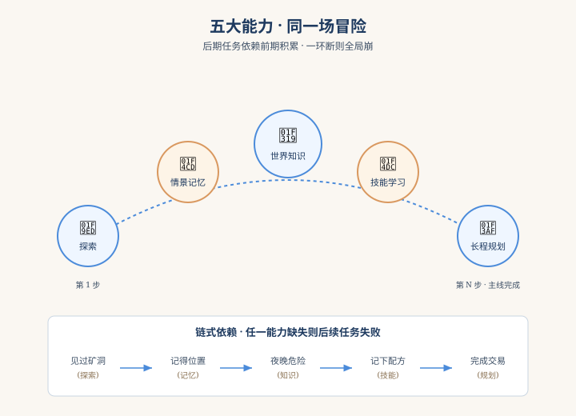
*图示：传统评测往往只看任务完成率，无法判断Agent到底是在哪一环出问题。AgentOdyssey让一次游戏过程中同时考验这五种能力：要先去探索陌生区域变成记住掉落物位置变成推断夜间敌人更强这种隐藏规则变成学会把配方写在纸上当外部记忆变成最终完成多步交易任务。哪一环掉链子都会让后续任务失败。*

- 技术细节：论文从人类认知发展中归纳出测试时持续学习Agent必需的五种能力：探索、情景记忆、世界知识获取、技能学习、长程规划，并设计能让这些能力相互依赖的长程文本游戏，让后期任务的成功依赖于前期获得的经验和知识。
- 通俗讲解：传统评测往往只看任务完成率，无法判断Agent到底是在哪一环出问题。AgentOdyssey让一次游戏过程中同时考验这五种能力：要先去探索陌生区域变成记住掉落物位置变成推断夜间敌人更强这种隐藏规则变成学会把配方写在纸上当外部记忆变成最终完成多步交易任务。哪一环掉链子都会让后续任务失败。
- 例子：论文图1展示：Agent第64步把'钥匙=1铁锭+1木条'写到纸上(技能/外部记忆)，第257步意识到要去工坊(规划)，第302步因为是深夜12点选择停在安全区(世界知识)，第317步想起之前掉在阳台的水晶矿(情景记忆)并最终拿去交易完成主线。

#### 技术点 2：LLM程序合成生成游戏
- 快速理解：用LLM按本体论合成实体、规则、任务，并跑自动测试修复保证可玩

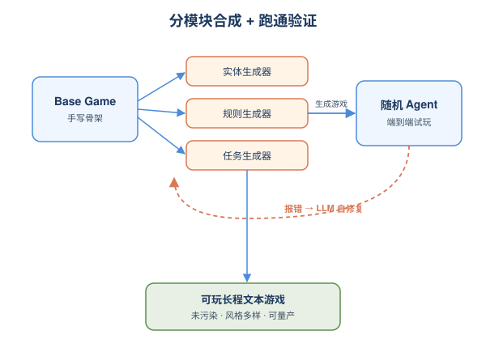
*图示：纯让LLM一次性写出一个长程可玩游戏很容易出bug，作者把游戏拆成有明确本体的几个组件（区域、物品、NPC、动作规则、step规则、任务），让LLM分模块生成，并给每个生成结果跑随机Agent做'编译+运行'测试。这样可以源源不断地造出风格各异、不容易被训练数据污染的新游戏。*

- 技术细节：游戏生成引擎基于Aider做程序合成，包含实体生成器、规则生成器、任务生成器，三者条件化在一个手写的base game上，扩展或修改实体、动作规则、step规则和主/副线任务。生成后通过让随机Agent实际跑一遍来做端到端运行时验证，把错误反馈回LLM自动修复。
- 通俗讲解：纯让LLM一次性写出一个长程可玩游戏很容易出bug，作者把游戏拆成有明确本体的几个组件（区域、物品、NPC、动作规则、step规则、任务），让LLM分模块生成，并给每个生成结果跑随机Agent做'编译+运行'测试。这样可以源源不断地造出风格各异、不容易被训练数据污染的新游戏。
- 例子：比如生成一个含18个区域、83种物品、13种NPC、24阶段主线的游戏；其中step规则可能定义'每天12点-1点敌人攻击力加成且50%概率刷怪'，这种规则不会告诉Agent，必须Agent自己从挨打经历里推断出来。

#### 技术点 3：多维诊断+成本指标
- 快速理解：除任务奖励外，新增世界知识/情景记忆QA、探索率、行动多样性、token成本

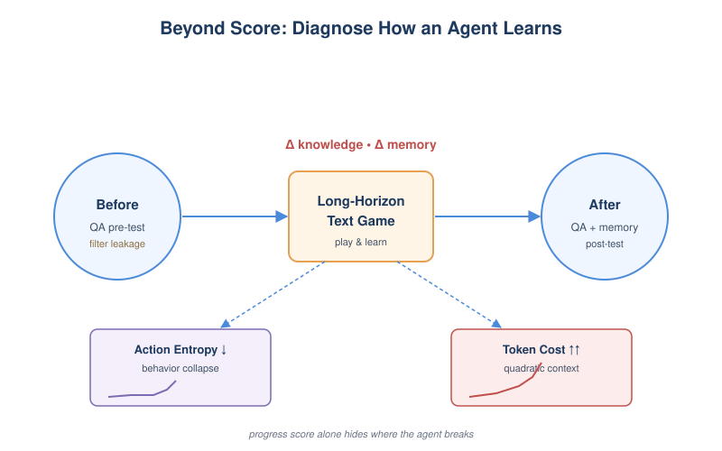
*图示：光看任务完成度看不出Agent是'真懂'还是'凑巧通关'。作者在游戏前后各问一次世界知识题，看Agent玩完后是不是真学到了；再问情景记忆题看它是否记得自己走过哪、丢过什么；用动作熵看它是不是越玩越僵化只重复一个动作；同时记录累计token暴露Long Context型Agent的二次方成本。*

- 技术细节：评测指标分三类：游戏进度奖励（主线+副线/探索/合成/击败的归一化组合）、诊断测试（游戏前后做World Knowledge QA与Episodic Memory QA、对象与动作探索覆盖率、滑窗熵衡量的行动多样性）、模型成本（累计token数）。世界知识QA在游戏前做还能筛掉训练数据污染严重的游戏。
- 通俗讲解：光看任务完成度看不出Agent是'真懂'还是'凑巧通关'。作者在游戏前后各问一次世界知识题，看Agent玩完后是不是真学到了；再问情景记忆题看它是否记得自己走过哪、丢过什么；用动作熵看它是不是越玩越僵化只重复一个动作；同时记录累计token暴露Long Context型Agent的二次方成本。
- 例子：实验1中Long Context+GPT-5在玩完后World Knowledge QA准确率提升34.8%，情景记忆QA也最高；而STM和SFT Agent在动作多样性曲线上出现陡降，恰好和它们的累计奖励停滞同步发生，说明行动塌缩是阻碍长程性能的可量化信号。

#### 技术点 4：短期记忆显著有效
- 快速理解：短期滑窗记忆稳定提升RAG与SFT Agent，是测试时训练的关键组件

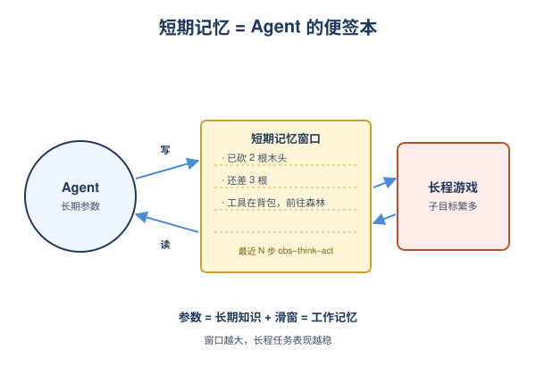
*图示：长程任务里Agent不仅要长期知识，还需要稳定的'工作记忆'来追踪当下子目标，比如'还需要再砍几根木头'。短期滑窗把最近若干步的观察-推理-动作直接放进上下文，等于给Agent一个不会忘的便签本。实验里加了短期记忆的SFT Agent反超了纯短期记忆Agent，说明参数更新作为长期记忆 + 上下文滑窗作为短期记忆是一个有效组合。*

- 技术细节：作者实现并对比六种Agent范式（Long Context、Fixed Size Memory含MEM1、RAG含Mem0/Raptor/Voyager、SFT、RL、Latent含MemoryLLM/MPlus），并可叠加反思、摘要、短期记忆。结果显示短期记忆几乎对所有范式都带来稳定提升，且记忆窗口越大、游戏表现和世界知识QA越好。
- 通俗讲解：长程任务里Agent不仅要长期知识，还需要稳定的'工作记忆'来追踪当下子目标，比如'还需要再砍几根木头'。短期滑窗把最近若干步的观察-推理-动作直接放进上下文，等于给Agent一个不会忘的便签本。实验里加了短期记忆的SFT Agent反超了纯短期记忆Agent，说明参数更新作为长期记忆 + 上下文滑窗作为短期记忆是一个有效组合。
- 例子：实验2中Qwen3-4B做底座，SFT+STM组合在简化游戏里取得整组最佳；而纯Long Context Agent在小模型上反而崩溃，World Knowledge QA和Episodic Memory QA都掉到0，动作多样性收敛到单一动作，呈现明显塌缩。

#### 技术点 5：暴露当前Agent五大失败模式
- 快速理解：Agent在探索、记忆、世界知识、技能、规划上都有系统性缺陷且远低于人类

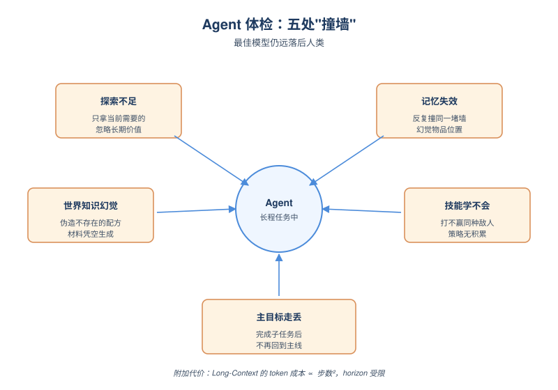
*图示：这部分相当于一份Agent能力体检报告。比如Long Context Agent能看到完整历史，却仍会在收到多次'此处不可进入'反馈后继续重复同一个动作，说明它没有从历史失败中真正学习；SFT Agent在测试时训练后通用语言能力反而下降，出现灾难性遗忘。这些都是做长程Agent绕不开的问题。*

- 技术细节：即便最好的Long Context+Claude-Opus-4.6也明显落后于人类。作者归纳出五大失败模式：探索覆盖不足（只拿当前任务相关物）、情景记忆失效（反复撞墙、幻觉物品位置）、世界知识幻觉（造不存在的配方）、缺乏程序性技能（学不到针对敌人的策略）、长程规划中子目标完成后无法回到主目标。同时Long Context Agent token成本随步数二次方增长，限制有效horizon。
- 通俗讲解：这部分相当于一份Agent能力体检报告。比如Long Context Agent能看到完整历史，却仍会在收到多次'此处不可进入'反馈后继续重复同一个动作，说明它没有从历史失败中真正学习；SFT Agent在测试时训练后通用语言能力反而下降，出现灾难性遗忘。这些都是做长程Agent绕不开的问题。
- 例子：比如Agent在白天打完一波敌人后，本应回到主线'去图书馆交易水晶矿'，但完成子目标'造钥匙'后却没有重新锚定主目标，转而去做别的小事；又或者明明纸上写着配方，却尝试用不存在的材料合成钥匙。

- **对 Agent 产品/系统的启发：** 做长程Agent别只看任务通过率，要分别测探索/记忆/知识/规划，并把短期记忆当一等组件
- **详细启发：** 产品侧：Agent产品上线后真正的考验是'持续部署期的学习能力'，单一任务通过率掩盖太多问题。建议在内部评测里参考AgentOdyssey思路：用程序化生成的新场景+游戏前后知识QA+行动多样性指标，定期诊断Agent是否真的在长期使用中变聪明，而不是越用越僵化。；系统侧：在Agent架构上，把'短期滑窗工作记忆'当成必备组件，而不是可选项；长上下文方案要正视token成本随步数二次方膨胀的现实，限制有效horizon。可以考虑'参数更新（长期）+ 固定大小上下文（短期）'的组合，并显式建模主/子目标栈，避免子目标完成后丢失主目标。；风险：测试时参数更新（SFT/RL Agent）容易出现灾难性遗忘，通用语言和世界知识能力反而下降；Long Context Agent在弱底模上会出现行动塌缩到单一动作的退化现象；用LLM生成评测内容时仍需用'游戏前QA准确率'做污染筛查。

## 三、总结

- 今日主线：harness/runtime 成核心战场，记忆与评测协同进化
- Agent 研究从'模型更强'转向'系统更可控、记忆更可信、评测更真实'
- 今天 414 篇论文继续印证一条主线：Agent 研究的重心已经从模型能力转移到 harness、消息总线和记忆治理这些系统层。
- 评测也在同步进化，工具环境不可靠、长程持续学习、行为取证成为新的诊断维度，单轮通过率正在让位给恢复力与意图判定。
- 记忆主题虽小但权重极高，TRUSTMEM、端侧 budget memory、EKG 三条路径共同表明：可信记忆已是 Agent 系统设计的第一性问题。
- 整体来看，今天的工作更像在拼装一台'可治理的 Agent 操作系统'，而不是再训一个更聪明的大脑。
