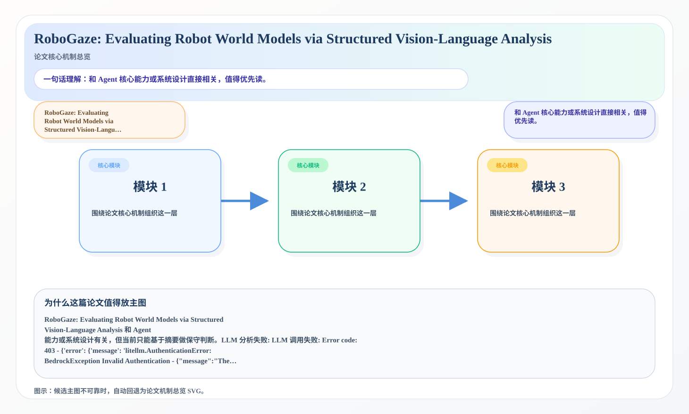
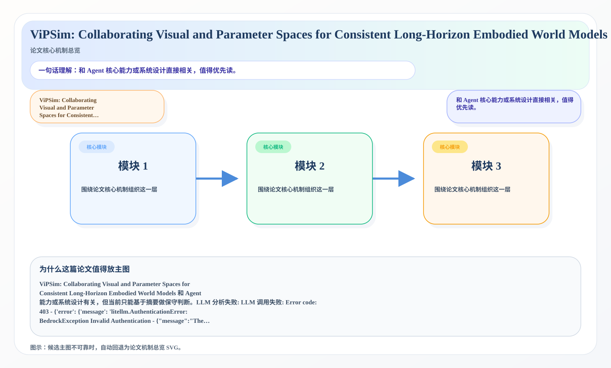

# 2026-06-30 AI Agent 论文日报

> 分类：cs.AI + cs.CL + cs.LG + cs.MA + cs.RO + cs.SE + cs.HC
> 入选论文：3 篇

## 30 秒速览

- 🎯 **今日主线**：Agent 研究继续从模型能力转向执行链与系统边界。
- 💡 **一句话带走**：更值得追踪的是评测、约束、协议和运行时设计。

**今日导读**（先挑该读哪篇）

1. [必读 · 具身]**RoboGaze: Evaluating Robot World Models via…** — 和 Agent 核心能力或系统设计直接相关，值得优先读
2. [必读 · 记忆]**HMARS: A Hierarchical Multi-Agent Memory…** — 和 Agent 核心能力或系统设计直接相关，值得优先读
3. [必读 · 评测]**ViPSim: Collaborating Visual and Parameter…** — 和 Agent 核心能力或系统设计直接相关，值得优先读

## 一、今日趋势

- 今天初筛后最集中的主题是 tool\_use、agent\_eval、planning\_reasoning，说明研究关注点继续从单轮回答能力转向更完整的执行链。
- 高优先级论文里，RoboGaze: Evaluating Robot World Models via Structured Vision-Language Analysis 等工作都在强调 Agent 的系统边界，而不是只卷更大的底座模型。
- 从创新性和研究开拓性看，RoboGaze: Evaluating Robot World Models via Structured Vision-Language Analysis、HMARS: A Hierarchical Multi-Agent Memory System for Long-Context Reasoning 代表了今天最值得后续继续追踪的切口。

## 二、重点论文精读

### 1. [必读 · 具身] RoboGaze: Evaluating Robot World Models via Structured Vision-Language Analysis
- **arxiv 信息：** `2606.28385` · 作者：Minh-Loi Nguyen等 · 类目：cs.AI · 提交：2026-06 · [原文](https://arxiv.org/abs/2606.28385) · [PDF](https://arxiv.org/pdf/2606.28385.pdf)
- **为什么读：** 和 Agent 核心能力或系统设计直接相关，值得优先读。

*图示：候选主图不可靠，已回退为论文核心机制总览 SVG。*

- *（本篇自动深读未完成，下面是论文英文摘要原文，可点上方原文链接看全文）*
- **摘要原文：** Recent advances in robot world models enable synthetic video generation for embodied prediction and planning. However, evaluating these videos is challenging: visually realistic outputs often violate physical laws, temporal consistency, or task logic, while conventional metrics and monolithic Vision …

### 2. [必读 · 记忆] HMARS: A Hierarchical Multi-Agent Memory System for Long-Context Reasoning
- **arxiv 信息：** `2606.28349` · 作者：Zeju Li等 · 类目：cs.IR · 提交：2026-06 · [原文](https://arxiv.org/abs/2606.28349) · [PDF](https://arxiv.org/pdf/2606.28349.pdf)
- **为什么读：** 和 Agent 核心能力或系统设计直接相关，值得优先读。

*图示：候选主图不可靠，已回退为论文核心机制总览 SVG。*

- *（本篇自动深读未完成，下面是论文英文摘要原文，可点上方原文链接看全文）*
- **摘要原文：** Long-context reasoning requires models to access, retrieve, and integrate evidence scattered across documents, dialogues, and accumulated interaction histories. …

### 3. [必读 · 评测] ViPSim: Collaborating Visual and Parameter Spaces for Consistent Long-Horizon Embodied World Models
- **arxiv 信息：** `2606.28804` · 作者：Longyu Chen等 · 类目：cs.RO · 提交：2026-06 · [原文](https://arxiv.org/abs/2606.28804) · [PDF](https://arxiv.org/pdf/2606.28804.pdf)
- **为什么读：** 和 Agent 核心能力或系统设计直接相关，值得优先读。

*图示：候选主图不可靠，已回退为论文核心机制总览 SVG。*

- *（本篇自动深读未完成，下面是论文英文摘要原文，可点上方原文链接看全文）*
- **摘要原文：** Embodied World Models (EWMs) have emerged as a scalable and risk-free paradigm for advancing embodied intelligence, enabling the safety-critical evaluation of Vision-Language-Action systems. …

## 三、总结

- 如果把今天的论文连起来看，一个明显变化是：大家越来越少把 Agent 当成单一模型能力问题，而是把它当成执行链、工具层、评测层和安全层共同构成的系统问题。
- 这意味着后续真正有开拓性的研究，往往不是再加一点 prompt 技巧，而是重新定义 Agent 应该如何被评测、如何被约束，以及如何在真实环境里更稳地工作。
