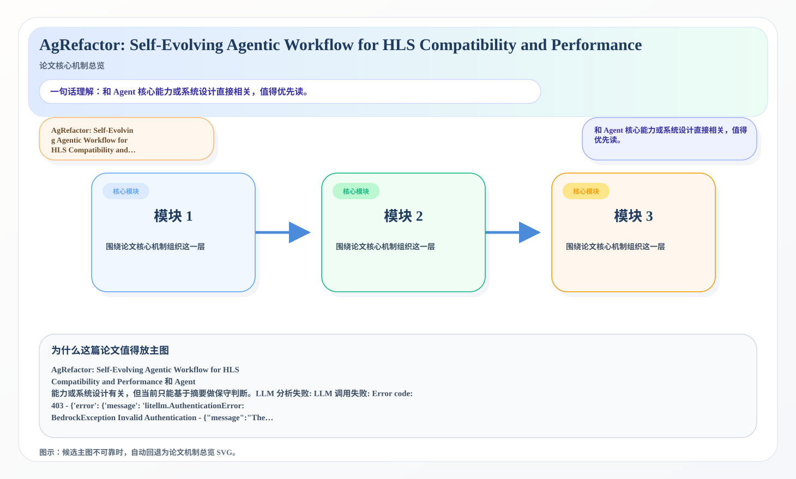
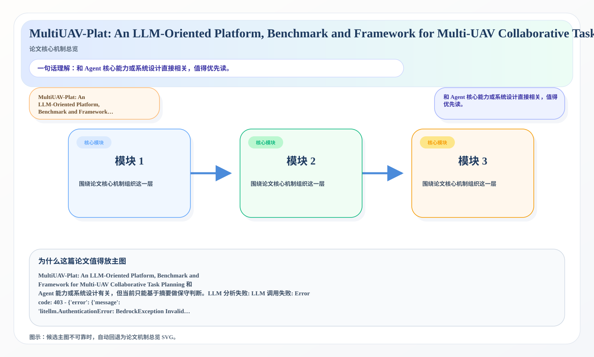
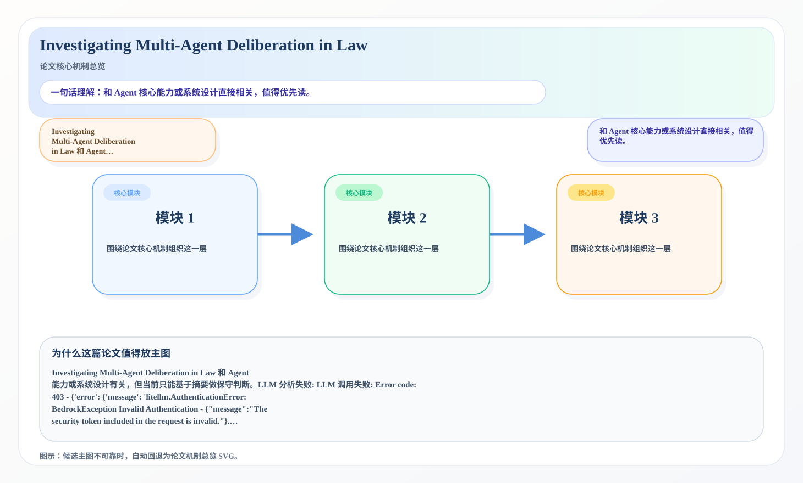

# 2026-07-01 AI Agent 论文日报

> 分类：cs.AI + cs.CL + cs.LG + cs.MA + cs.RO + cs.SE + cs.HC
> 入选论文：3 篇

## 30 秒速览

- 🎯 **今日主线**：Agent 研究继续从模型能力转向执行链与系统边界。
- 💡 **一句话带走**：更值得追踪的是评测、约束、协议和运行时设计。

**今日导读**（先挑该读哪篇）

1. [必读 · 工具]**AgRefactor: Self-Evolving Agentic Workflow…** — 和 Agent 核心能力或系统设计直接相关，值得优先读
2. [必读 · 规划]**MultiUAV-Plat: An LLM-Oriented Platform,…** — 和 Agent 核心能力或系统设计直接相关，值得优先读
3. [必读 · 评测]**Investigating Multi-Agent Deliberation in Law** — 和 Agent 核心能力或系统设计直接相关，值得优先读

## 一、今日趋势

- 今天初筛后最集中的主题是 agent\_eval、planning\_reasoning、tool\_use，说明研究关注点继续从单轮回答能力转向更完整的执行链。
- 高优先级论文里，AgRefactor: Self-Evolving Agentic Workflow for HLS Compatibility and Performance 等工作都在强调 Agent 的系统边界，而不是只卷更大的底座模型。
- 从创新性和研究开拓性看，AgRefactor: Self-Evolving Agentic Workflow for HLS Compatibility and Performance、MultiUAV-Plat: An LLM-Oriented Platform, Benchmark and Framework for Multi-UAV Collaborative Task Planning 代表了今天最值得后续继续追踪的切口。

## 二、重点论文精读

### 1. [必读 · 工具] AgRefactor: Self-Evolving Agentic Workflow for HLS Compatibility and Performance
- **arxiv 信息：** `2606.30949` · 作者：Yang Zou等 · 类目：cs.AI · 提交：2026-06 · [原文](https://arxiv.org/abs/2606.30949) · [PDF](https://arxiv.org/pdf/2606.30949.pdf)
- **为什么读：** 和 Agent 核心能力或系统设计直接相关，值得优先读。

*图示：候选主图不可靠，已回退为论文核心机制总览 SVG。*

- *（本篇自动深读未完成，下面是论文英文摘要原文，可点上方原文链接看全文）*
- **摘要原文：** High-Level Synthesis (HLS) provides a fast path from concepts to silicon, but converting real-world software into synthesizable HLS code remains challenging due to restrictive language support and the gap between software and hardware programming practices. …

### 2. [必读 · 规划] MultiUAV-Plat: An LLM-Oriented Platform, Benchmark and Framework for Multi-UAV Collaborative Task Planning
- **arxiv 信息：** `2606.31073` · 作者：Sheng Zhang等 · 类目：cs.AI · 提交：2026-06 · [原文](https://arxiv.org/abs/2606.31073) · [PDF](https://arxiv.org/pdf/2606.31073.pdf)
- **为什么读：** 和 Agent 核心能力或系统设计直接相关，值得优先读。

*图示：候选主图不可靠，已回退为论文核心机制总览 SVG。*

- *（本篇自动深读未完成，下面是论文英文摘要原文，可点上方原文链接看全文）*
- **摘要原文：** Large language models (LLMs) provide a promising interface for high-level robotic task planning, but their use in multi-UAV collaboration remains difficult to evaluate systematically. …

### 3. [必读 · 评测] Investigating Multi-Agent Deliberation in Law
- **arxiv 信息：** `2606.30906` · 作者：Cor Steging等 · 类目：cs.AI · 提交：2026-06 · [原文](https://arxiv.org/abs/2606.30906) · [PDF](https://arxiv.org/pdf/2606.30906.pdf)
- **为什么读：** 和 Agent 核心能力或系统设计直接相关，值得优先读。

*图示：候选主图不可靠，已回退为论文核心机制总览 SVG。*

- *（本篇自动深读未完成，下面是论文英文摘要原文，可点上方原文链接看全文）*
- **摘要原文：** Artificial Intelligence is increasingly applied to the field of law, and has the potential to increase access to justice. One particular movement that is gaining traction is that of agentic AI, wherein AI agents, based on Large Language Models (LLMs) can take autonomous actions. …

## 三、总结

- 如果把今天的论文连起来看，一个明显变化是：大家越来越少把 Agent 当成单一模型能力问题，而是把它当成执行链、工具层、评测层和安全层共同构成的系统问题。
- 这意味着后续真正有开拓性的研究，往往不是再加一点 prompt 技巧，而是重新定义 Agent 应该如何被评测、如何被约束，以及如何在真实环境里更稳地工作。
