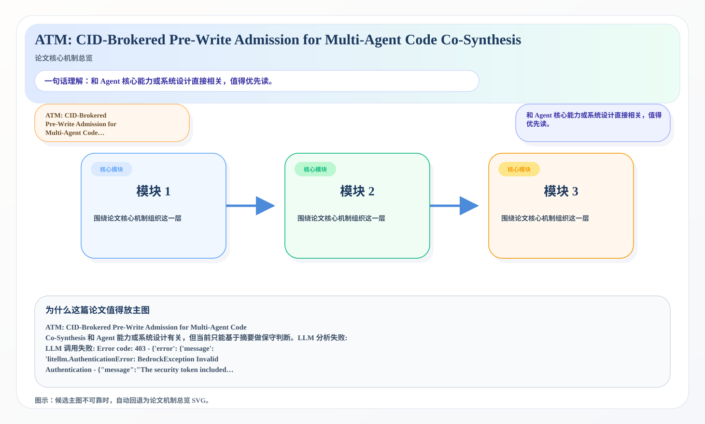
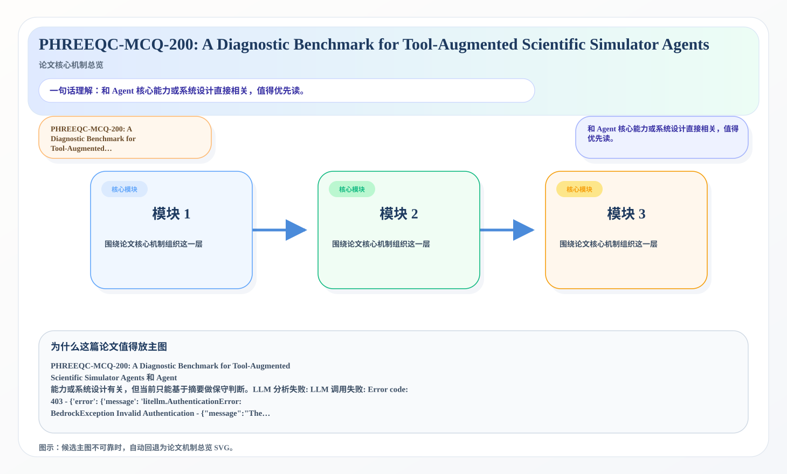

# 2026-07-02 AI Agent 论文日报

> 分类：cs.AI + cs.CL + cs.LG + cs.MA + cs.RO + cs.SE + cs.HC
> 入选论文：3 篇

## 一、初筛每日趋势

- 今天初筛后最集中的主题是 tool\_use、agent\_eval、…
- 高优先级论文里，ATM: CID-Brokered Pre-Wri…
- 从创新性和研究开拓性看，PHREEQC-MCQ-200: A Di…
- 今天初筛后最集中的主题是 tool\_use、agent\_eval、planning\_reasoning，说明研究关注点继续从单轮回答能力转向更完整的执行链。
- 高优先级论文里，ATM: CID-Brokered Pre-Write Admission for Multi-Agent Code Co-Synthesis 等工作都在强调 Agent 的系统边界，而不是只卷更大的底座模型。
- 从创新性和研究开拓性看，PHREEQC-MCQ-200: A Diagnostic Benchmark for Tool-Augmented Scientific Simulator Agents、What's Hidden Matters: Identifying Planning-Critical Occluded Agents using Vision-Language Models 代表了今天最值得后续继续追踪的切口。

## 二、重点论文精读

### 1. ATM: CID-Brokered Pre-Write Admission for Multi-Agent Code Co-Synthesis
- **方向：** planning\_reasoning
- **评分：** 相关性 100 | 价值 100 | 有趣性 100 | 创新性 90 | 开拓性 100
- **为什么入选：** 和 Agent 核心能力或系统设计直接相关，值得优先读。
- **快速背景：** ATM: CID-Brokered Pre-Write Admission f…

*图示：和 Agent 核心能力或系统设计直接相关，值得优先读。*

- **当前状态：** llm_failed（LLM 分析失败: LLM 调用失败: Error code: 403 - {'error': {'message': 'litellm.AuthenticationError: BedrockException Invalid Authentication - {"message":"The security token included in the request is invalid."}. Received Model Group=claude-opus-4-7\\nAvailable Model Group Fallbacks=[\\'claude-opus-4-8\\']\\nError doing the fallback: litellm.AuthenticationError: BedrockException Invalid Authentication - {"message":"The security token included in the request is invalid."}. Received Model Group=claude-opus-4-8\\nAvailable Model Group Fallbacks=[\\'claude-opus-4-7\\']\\nError doing the fallback: litellm.AuthenticationError: BedrockException Invalid Authentication - {"message":"The security token included in the request is invalid."}. Received Model Group=claude-opus-4-7\\nAvailable Model Group Fallbacks=[\\'claude-opus-4-8\\']\\nError doing the fallback: litellm.AuthenticationError: BedrockException Invalid Authentication - {"message":"The security token included in the request is invalid."}. Received Model Group=claude-opus-4-8\\nAvailable Model Group Fallbacks=[\\'claude-opus-4-7\\']\\nError doing the fallback: litellm.AuthenticationError: BedrockException Invalid Authentication - {"message":"The security token included in the request is invalid."}. Received Model Group=claude-opus-4-7\\nAvailable Model Group Fallbacks=[\\'claude-opus-4-8\\']\\nError doing the fallback: litellm.AuthenticationError: BedrockException Invalid Authentication - {"message":"The security token included in the request is invalid."}. Received Model Group=claude-opus-4-8\\nAvailable Model Group Fallbacks=[\\'claude-opus-4-7\\']\\nError doing the fallback: litellm.AuthenticationError: BedrockException Invalid Authentication - {"message":"The security token included in the request is invalid."}', 'type': None, 'param': None, 'code': '403'}}）
- **核心技术点：** 本次精读未成功，暂不展示结构化核心点，避免误导。

### 2. Leveraging LLM-Based Agentic Systems to Generate Quantum Applications for Test Optimization
- **方向：** multi\_agent
- **评分：** 相关性 100 | 价值 100 | 有趣性 100 | 创新性 78 | 开拓性 100
- **为什么入选：** 和 Agent 核心能力或系统设计直接相关，值得优先读。
- **快速背景：** Leveraging LLM-Based Agentic Systems to…

*图示：和 Agent 核心能力或系统设计直接相关，值得优先读。*

- **当前状态：** llm_failed（LLM 分析失败: LLM 调用失败: Error code: 403 - {'error': {'message': 'litellm.AuthenticationError: BedrockException Invalid Authentication - {"message":"The security token included in the request is invalid."}. Received Model Group=claude-opus-4-7\\nAvailable Model Group Fallbacks=[\\'claude-opus-4-8\\']\\nError doing the fallback: litellm.AuthenticationError: BedrockException Invalid Authentication - {"message":"The security token included in the request is invalid."}. Received Model Group=claude-opus-4-8\\nAvailable Model Group Fallbacks=[\\'claude-opus-4-7\\']\\nError doing the fallback: litellm.AuthenticationError: BedrockException Invalid Authentication - {"message":"The security token included in the request is invalid."}. Received Model Group=claude-opus-4-7\\nAvailable Model Group Fallbacks=[\\'claude-opus-4-8\\']\\nError doing the fallback: litellm.AuthenticationError: BedrockException Invalid Authentication - {"message":"The security token included in the request is invalid."}. Received Model Group=claude-opus-4-8\\nAvailable Model Group Fallbacks=[\\'claude-opus-4-7\\']\\nError doing the fallback: litellm.AuthenticationError: BedrockException Invalid Authentication - {"message":"The security token included in the request is invalid."}. Received Model Group=claude-opus-4-7\\nAvailable Model Group Fallbacks=[\\'claude-opus-4-8\\']\\nError doing the fallback: litellm.AuthenticationError: BedrockException Invalid Authentication - {"message":"The security token included in the request is invalid."}. Received Model Group=claude-opus-4-8\\nAvailable Model Group Fallbacks=[\\'claude-opus-4-7\\']\\nError doing the fallback: litellm.AuthenticationError: BedrockException Invalid Authentication - {"message":"The security token included in the request is invalid."}', 'type': None, 'param': None, 'code': '403'}}）
- **核心技术点：** 本次精读未成功，暂不展示结构化核心点，避免误导。

### 3. PHREEQC-MCQ-200: A Diagnostic Benchmark for Tool-Augmented Scientific Simulator Agents
- **方向：** tool\_use
- **评分：** 相关性 100 | 价值 90 | 有趣性 88 | 创新性 100 | 开拓性 97
- **为什么入选：** 和 Agent 核心能力或系统设计直接相关，值得优先读。
- **快速背景：** PHREEQC-MCQ-200: A Diagnostic Benchmark…

*图示：和 Agent 核心能力或系统设计直接相关，值得优先读。*

- **当前状态：** llm_failed（LLM 分析失败: LLM 调用失败: Error code: 403 - {'error': {'message': 'litellm.AuthenticationError: BedrockException Invalid Authentication - {"message":"The security token included in the request is invalid."}. Received Model Group=claude-opus-4-7\\nAvailable Model Group Fallbacks=[\\'claude-opus-4-8\\']\\nError doing the fallback: litellm.AuthenticationError: BedrockException Invalid Authentication - {"message":"The security token included in the request is invalid."}. Received Model Group=claude-opus-4-8\\nAvailable Model Group Fallbacks=[\\'claude-opus-4-7\\']\\nError doing the fallback: litellm.AuthenticationError: BedrockException Invalid Authentication - {"message":"The security token included in the request is invalid."}. Received Model Group=claude-opus-4-7\\nAvailable Model Group Fallbacks=[\\'claude-opus-4-8\\']\\nError doing the fallback: litellm.AuthenticationError: BedrockException Invalid Authentication - {"message":"The security token included in the request is invalid."}. Received Model Group=claude-opus-4-8\\nAvailable Model Group Fallbacks=[\\'claude-opus-4-7\\']\\nError doing the fallback: litellm.AuthenticationError: BedrockException Invalid Authentication - {"message":"The security token included in the request is invalid."}. Received Model Group=claude-opus-4-7\\nAvailable Model Group Fallbacks=[\\'claude-opus-4-8\\']\\nError doing the fallback: litellm.AuthenticationError: BedrockException Invalid Authentication - {"message":"The security token included in the request is invalid."}. Received Model Group=claude-opus-4-8\\nAvailable Model Group Fallbacks=[\\'claude-opus-4-7\\']\\nError doing the fallback: litellm.AuthenticationError: BedrockException Invalid Authentication - {"message":"The security token included in the request is invalid."}', 'type': None, 'param': None, 'code': '403'}}）
- **核心技术点：** 本次精读未成功，暂不展示结构化核心点，避免误导。

## 三、候选但未完成深读的论文

- **ATM: CID-Brokered Pre-Write Admission for Multi-Agent Code Co-Synthesis**
  - 状态：llm\_failed
  - 原因：LLM 分析失败: LLM 调用失败: Error code: 403 - {'error': {'message': 'litellm.AuthenticationError: BedrockException Invalid Authentication - {"message":"The security token included in the request is invalid."}. Received Model Group=claude-opus-4-7\\nAvailable Model Group Fallbacks=[\\'claude-opus-4-8\\']\\nError doing the fallback: litellm.AuthenticationError: BedrockException Invalid Authentication - {"message":"The security token included in the request is invalid."}. Received Model Group=claude-opus-4-8\\nAvailable Model Group Fallbacks=[\\'claude-opus-4-7\\']\\nError doing the fallback: litellm.AuthenticationError: BedrockException Invalid Authentication - {"message":"The security token included in the request is invalid."}. Received Model Group=claude-opus-4-7\\nAvailable Model Group Fallbacks=[\\'claude-opus-4-8\\']\\nError doing the fallback: litellm.AuthenticationError: BedrockException Invalid Authentication - {"message":"The security token included in the request is invalid."}. Received Model Group=claude-opus-4-8\\nAvailable Model Group Fallbacks=[\\'claude-opus-4-7\\']\\nError doing the fallback: litellm.AuthenticationError: BedrockException Invalid Authentication - {"message":"The security token included in the request is invalid."}. Received Model Group=claude-opus-4-7\\nAvailable Model Group Fallbacks=[\\'claude-opus-4-8\\']\\nError doing the fallback: litellm.AuthenticationError: BedrockException Invalid Authentication - {"message":"The security token included in the request is invalid."}. Received Model Group=claude-opus-4-8\\nAvailable Model Group Fallbacks=[\\'claude-opus-4-7\\']\\nError doing the fallback: litellm.AuthenticationError: BedrockException Invalid Authentication - {"message":"The security token included in the request is invalid."}', 'type': None, 'param': None, 'code': '403'}}
- **Leveraging LLM-Based Agentic Systems to Generate Quantum Applications for Test Optimization**
  - 状态：llm\_failed
  - 原因：LLM 分析失败: LLM 调用失败: Error code: 403 - {'error': {'message': 'litellm.AuthenticationError: BedrockException Invalid Authentication - {"message":"The security token included in the request is invalid."}. Received Model Group=claude-opus-4-7\\nAvailable Model Group Fallbacks=[\\'claude-opus-4-8\\']\\nError doing the fallback: litellm.AuthenticationError: BedrockException Invalid Authentication - {"message":"The security token included in the request is invalid."}. Received Model Group=claude-opus-4-8\\nAvailable Model Group Fallbacks=[\\'claude-opus-4-7\\']\\nError doing the fallback: litellm.AuthenticationError: BedrockException Invalid Authentication - {"message":"The security token included in the request is invalid."}. Received Model Group=claude-opus-4-7\\nAvailable Model Group Fallbacks=[\\'claude-opus-4-8\\']\\nError doing the fallback: litellm.AuthenticationError: BedrockException Invalid Authentication - {"message":"The security token included in the request is invalid."}. Received Model Group=claude-opus-4-8\\nAvailable Model Group Fallbacks=[\\'claude-opus-4-7\\']\\nError doing the fallback: litellm.AuthenticationError: BedrockException Invalid Authentication - {"message":"The security token included in the request is invalid."}. Received Model Group=claude-opus-4-7\\nAvailable Model Group Fallbacks=[\\'claude-opus-4-8\\']\\nError doing the fallback: litellm.AuthenticationError: BedrockException Invalid Authentication - {"message":"The security token included in the request is invalid."}. Received Model Group=claude-opus-4-8\\nAvailable Model Group Fallbacks=[\\'claude-opus-4-7\\']\\nError doing the fallback: litellm.AuthenticationError: BedrockException Invalid Authentication - {"message":"The security token included in the request is invalid."}', 'type': None, 'param': None, 'code': '403'}}
- **PHREEQC-MCQ-200: A Diagnostic Benchmark for Tool-Augmented Scientific Simulator Agents**
  - 状态：llm\_failed
  - 原因：LLM 分析失败: LLM 调用失败: Error code: 403 - {'error': {'message': 'litellm.AuthenticationError: BedrockException Invalid Authentication - {"message":"The security token included in the request is invalid."}. Received Model Group=claude-opus-4-7\\nAvailable Model Group Fallbacks=[\\'claude-opus-4-8\\']\\nError doing the fallback: litellm.AuthenticationError: BedrockException Invalid Authentication - {"message":"The security token included in the request is invalid."}. Received Model Group=claude-opus-4-8\\nAvailable Model Group Fallbacks=[\\'claude-opus-4-7\\']\\nError doing the fallback: litellm.AuthenticationError: BedrockException Invalid Authentication - {"message":"The security token included in the request is invalid."}. Received Model Group=claude-opus-4-7\\nAvailable Model Group Fallbacks=[\\'claude-opus-4-8\\']\\nError doing the fallback: litellm.AuthenticationError: BedrockException Invalid Authentication - {"message":"The security token included in the request is invalid."}. Received Model Group=claude-opus-4-8\\nAvailable Model Group Fallbacks=[\\'claude-opus-4-7\\']\\nError doing the fallback: litellm.AuthenticationError: BedrockException Invalid Authentication - {"message":"The security token included in the request is invalid."}. Received Model Group=claude-opus-4-7\\nAvailable Model Group Fallbacks=[\\'claude-opus-4-8\\']\\nError doing the fallback: litellm.AuthenticationError: BedrockException Invalid Authentication - {"message":"The security token included in the request is invalid."}. Received Model Group=claude-opus-4-8\\nAvailable Model Group Fallbacks=[\\'claude-opus-4-7\\']\\nError doing the fallback: litellm.AuthenticationError: BedrockException Invalid Authentication - {"message":"The security token included in the request is invalid."}', 'type': None, 'param': None, 'code': '403'}}

## 四、总结

- Agent 研究继续从模型能力转向执行链与系统边界。
- 更值得追踪的是评测、约束、协议和运行时设计。
- 如果把今天的论文连起来看，一个明显变化是：大家越来越少把 Agent 当成单一模型能力问题，而是把它当成执行链、工具层、评测层和安全层共同构成的系统问题。
- 这意味着后续真正有开拓性的研究，往往不是再加一点 prompt 技巧，而是重新定义 Agent 应该如何被评测、如何被约束，以及如何在真实环境里更稳地工作。
