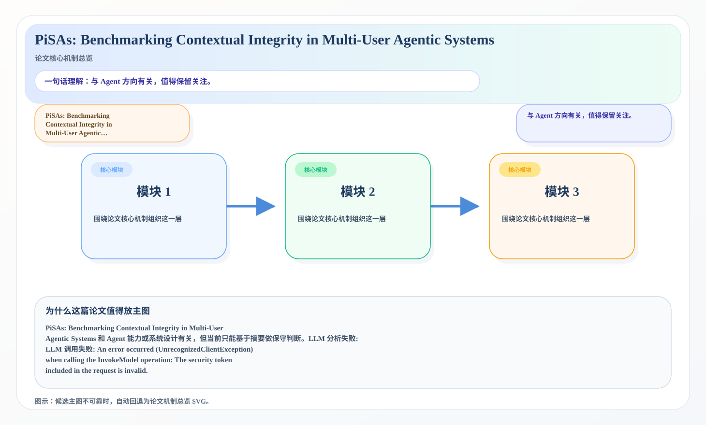
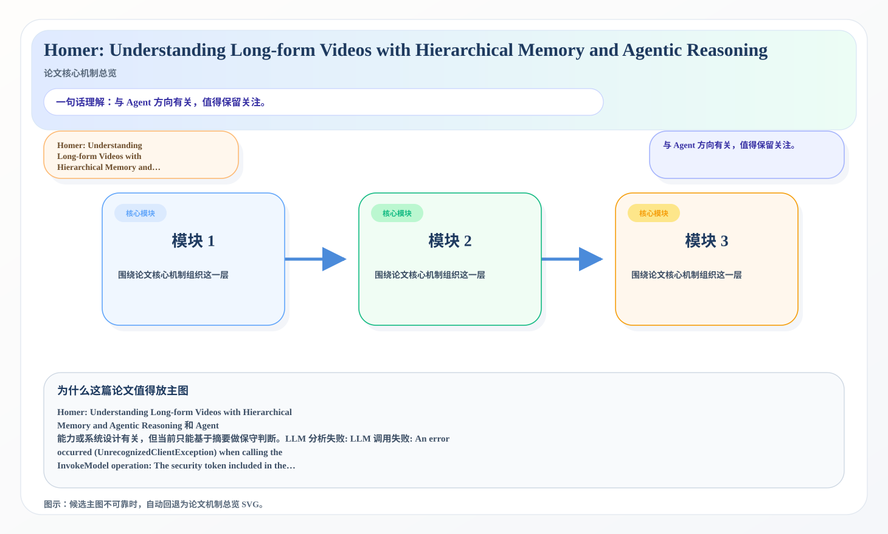
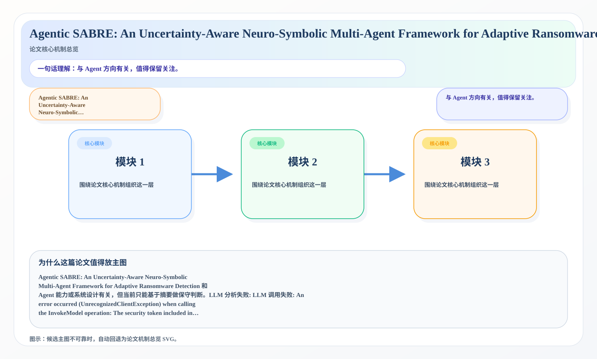

# 2026-07-07 AI Agent 论文日报

> 分类：cs.AI + cs.CL + cs.LG + cs.MA + cs.RO + cs.SE + cs.HC
> 入选论文：3 篇

## 一、初筛每日趋势

- 今天初筛后最集中的主题是 tool\_use、embodied\_ag…
- 从创新性和研究开拓性看，Homer: Understanding…
- 说明研究关注点继续从单轮回答能力转向更完整的执行链。
- 今天初筛后最集中的主题是 tool\_use、embodied\_agent、planning\_reasoning，说明研究关注点继续从单轮回答能力转向更完整的执行链。
- 从创新性和研究开拓性看，Homer: Understanding Long-form Videos with Hierarchical Memory and Agentic Reasoning、When Claws Remember but Do Not Tell: Stealthy Memory Injection in Persistent Personal Agents 代表了今天最值得后续继续追踪的切口。

## 二、重点论文精读

### 1. PiSAs: Benchmarking Contextual Integrity in Multi-User Agentic Systems
- **方向：** agent\_eval
- **评分：** 相关性 73 | 价值 62 | 有趣性 64 | 创新性 54 | 开拓性 71
- **为什么入选：** 与 Agent 方向有关，值得保留关注。
- **快速背景：** PiSAs: Benchmarking Contextual Integrit…

*图示：候选主图不可靠，已回退为论文核心机制总览 SVG。*

- **当前状态：** llm_failed（LLM 分析失败: LLM 调用失败: An error occurred (UnrecognizedClientException) when calling the InvokeModel operation: The security token included in the request is invalid.）
- **核心技术点：** 本次精读未成功，暂不展示结构化核心点，避免误导。

### 2. Homer: Understanding Long-form Videos with Hierarchical Memory and Agentic Reasoning
- **方向：** planning\_reasoning
- **评分：** 相关性 73 | 价值 62 | 有趣性 56 | 创新性 66 | 开拓性 59
- **为什么入选：** 与 Agent 方向有关，值得保留关注。
- **快速背景：** Homer: Understanding Long-form Videos w…

*图示：候选主图不可靠，已回退为论文核心机制总览 SVG。*

- **当前状态：** llm_failed（LLM 分析失败: LLM 调用失败: An error occurred (UnrecognizedClientException) when calling the InvokeModel operation: The security token included in the request is invalid.）
- **核心技术点：** 本次精读未成功，暂不展示结构化核心点，避免误导。

### 3. Agentic SABRE: An Uncertainty-Aware Neuro-Symbolic Multi-Agent Framework for Adaptive Ransomware Detection
- **方向：** multi\_agent
- **评分：** 相关性 73 | 价值 62 | 有趣性 56 | 创新性 54 | 开拓性 71
- **为什么入选：** 与 Agent 方向有关，值得保留关注。
- **快速背景：** Agentic SABRE: An Uncertainty-Aware Neu…

*图示：候选主图不可靠，已回退为论文核心机制总览 SVG。*

- **当前状态：** llm_failed（LLM 分析失败: LLM 调用失败: An error occurred (UnrecognizedClientException) when calling the InvokeModel operation: The security token included in the request is invalid.）
- **核心技术点：** 本次精读未成功，暂不展示结构化核心点，避免误导。

## 三、候选但未完成深读的论文

- **PiSAs: Benchmarking Contextual Integrity in Multi-User Agentic Systems**
  - 状态：llm\_failed
  - 原因：LLM 分析失败: LLM 调用失败: An error occurred (UnrecognizedClientException) when calling the InvokeModel operation: The security token included in the request is invalid.
- **Homer: Understanding Long-form Videos with Hierarchical Memory and Agentic Reasoning**
  - 状态：llm\_failed
  - 原因：LLM 分析失败: LLM 调用失败: An error occurred (UnrecognizedClientException) when calling the InvokeModel operation: The security token included in the request is invalid.
- **Agentic SABRE: An Uncertainty-Aware Neuro-Symbolic Multi-Agent Framework for Adaptive Ransomware Detection**
  - 状态：llm\_failed
  - 原因：LLM 分析失败: LLM 调用失败: An error occurred (UnrecognizedClientException) when calling the InvokeModel operation: The security token included in the request is invalid.

## 四、总结

- Agent 研究继续从模型能力转向执行链与系统边界。
- 更值得追踪的是评测、约束、协议和运行时设计。
- 如果把今天的论文连起来看，一个明显变化是：大家越来越少把 Agent 当成单一模型能力问题，而是把它当成执行链、工具层、评测层和安全层共同构成的系统问题。
- 这意味着后续真正有开拓性的研究，往往不是再加一点 prompt 技巧，而是重新定义 Agent 应该如何被评测、如何被约束，以及如何在真实环境里更稳地工作。
