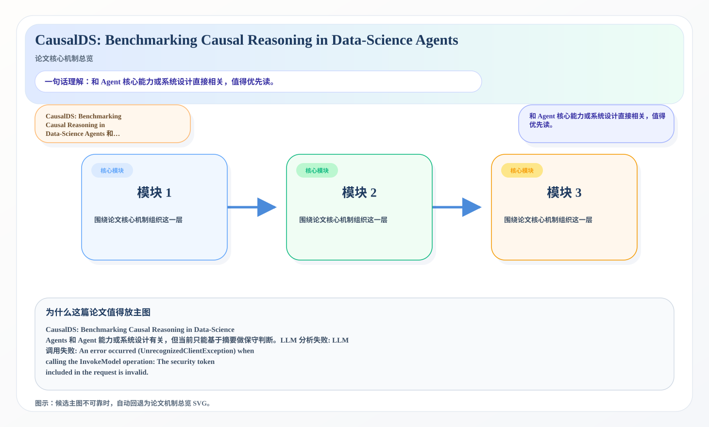
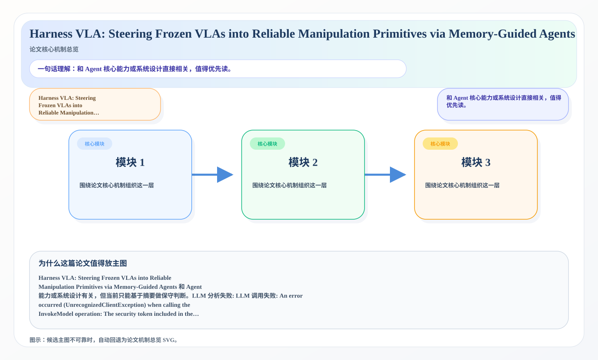

# 2026-07-10 AI Agent 论文日报

> 分类：cs.AI + cs.CL + cs.LG + cs.MA + cs.RO + cs.SE + cs.HC
> 入选论文：3 篇

## 一、初筛每日趋势

- 今天初筛后最集中的主题是 tool\_use、agent\_eval、…
- 高优先级论文里，Out of Sight: Compression…
- 从创新性和研究开拓性看，Out of Sight: Compres…
- 今天初筛后最集中的主题是 tool\_use、agent\_eval、planning\_reasoning，说明研究关注点继续从单轮回答能力转向更完整的执行链。
- 高优先级论文里，Out of Sight: Compression-Aware Content Protection against Agentic Crawlers 等工作都在强调 Agent 的系统边界，而不是只卷更大的底座模型。
- 从创新性和研究开拓性看，Out of Sight: Compression-Aware Content Protection against Agentic Crawlers、Harness VLA: Steering Frozen VLAs into Reliable Manipulation Primitives via Memory-Guided Agents 代表了今天最值得后续继续追踪的切口。

## 二、重点论文精读

### 1. Out of Sight: Compression-Aware Content Protection against Agentic Crawlers
- **方向：** planning\_reasoning
- **评分：** 相关性 100 | 价值 90 | 有趣性 88 | 创新性 100 | 开拓性 85
- **为什么入选：** 和 Agent 核心能力或系统设计直接相关，值得优先读。
- **快速背景：** Out of Sight: Compression-Aware Content…

*图示：候选主图不可靠，已回退为论文核心机制总览 SVG。*

- **当前状态：** llm_failed（LLM 分析失败: LLM 调用失败: An error occurred (UnrecognizedClientException) when calling the InvokeModel operation: The security token included in the request is invalid.）
- **核心技术点：** 本次精读未成功，暂不展示结构化核心点，避免误导。

### 2. CausalDS: Benchmarking Causal Reasoning in Data-Science Agents
- **方向：** tool\_use
- **评分：** 相关性 100 | 价值 90 | 有趣性 88 | 创新性 78 | 开拓性 100
- **为什么入选：** 和 Agent 核心能力或系统设计直接相关，值得优先读。
- **快速背景：** CausalDS: Benchmarking Causal Reasoning…

*图示：候选主图不可靠，已回退为论文核心机制总览 SVG。*

- **当前状态：** llm_failed（LLM 分析失败: LLM 调用失败: An error occurred (UnrecognizedClientException) when calling the InvokeModel operation: The security token included in the request is invalid.）
- **核心技术点：** 本次精读未成功，暂不展示结构化核心点，避免误导。

### 3. Harness VLA: Steering Frozen VLAs into Reliable Manipulation Primitives via Memory-Guided Agents
- **方向：** embodied\_agent
- **评分：** 相关性 100 | 价值 90 | 有趣性 80 | 创新性 100 | 开拓性 85
- **为什么入选：** 和 Agent 核心能力或系统设计直接相关，值得优先读。
- **快速背景：** Harness VLA: Steering Frozen VLAs into…

*图示：候选主图不可靠，已回退为论文核心机制总览 SVG。*

- **当前状态：** llm_failed（LLM 分析失败: LLM 调用失败: An error occurred (UnrecognizedClientException) when calling the InvokeModel operation: The security token included in the request is invalid.）
- **核心技术点：** 本次精读未成功，暂不展示结构化核心点，避免误导。

## 三、候选但未完成深读的论文

- **Out of Sight: Compression-Aware Content Protection against Agentic Crawlers**
  - 状态：llm\_failed
  - 原因：LLM 分析失败: LLM 调用失败: An error occurred (UnrecognizedClientException) when calling the InvokeModel operation: The security token included in the request is invalid.
- **CausalDS: Benchmarking Causal Reasoning in Data-Science Agents**
  - 状态：llm\_failed
  - 原因：LLM 分析失败: LLM 调用失败: An error occurred (UnrecognizedClientException) when calling the InvokeModel operation: The security token included in the request is invalid.
- **Harness VLA: Steering Frozen VLAs into Reliable Manipulation Primitives via Memory-Guided Agents**
  - 状态：llm\_failed
  - 原因：LLM 分析失败: LLM 调用失败: An error occurred (UnrecognizedClientException) when calling the InvokeModel operation: The security token included in the request is invalid.

## 四、总结

- Agent 研究继续从模型能力转向执行链与系统边界。
- 更值得追踪的是评测、约束、协议和运行时设计。
- 如果把今天的论文连起来看，一个明显变化是：大家越来越少把 Agent 当成单一模型能力问题，而是把它当成执行链、工具层、评测层和安全层共同构成的系统问题。
- 这意味着后续真正有开拓性的研究，往往不是再加一点 prompt 技巧，而是重新定义 Agent 应该如何被评测、如何被约束，以及如何在真实环境里更稳地工作。
