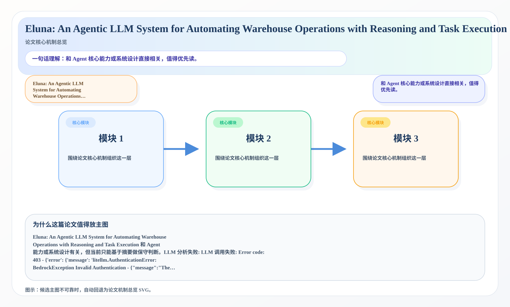
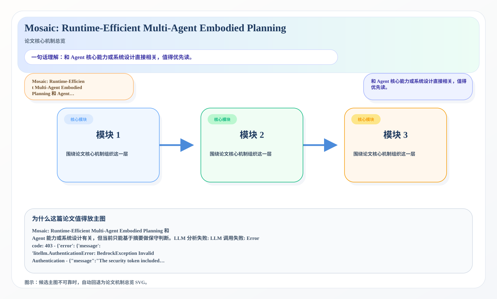
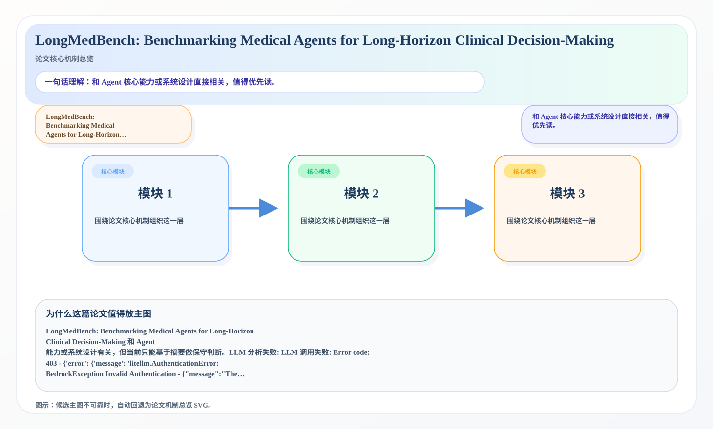

# 2026-07-13 AI Agent 论文日报

> 分类：cs.AI + cs.CL + cs.LG + cs.MA + cs.RO + cs.SE + cs.HC
> 入选论文：3 篇

## 30 秒速览

- 🎯 **今日主线**：Agent 研究继续从模型能力转向执行链与系统边界。
- 💡 **一句话带走**：更值得追踪的是评测、约束、协议和运行时设计。

**今日导读**（先挑该读哪篇）

1. [必读 · 记忆]**Eluna: An Agentic LLM System for Automating…** — 和 Agent 核心能力或系统设计直接相关，值得优先读
2. [必读 · 规划]**Mosaic: Runtime-Efficient Multi-Agent…** — 和 Agent 核心能力或系统设计直接相关，值得优先读
3. [必读 · 工具]**LongMedBench: Benchmarking Medical Agents for…** — 和 Agent 核心能力或系统设计直接相关，值得优先读

## 一、今日趋势

- 今天初筛后最集中的主题是 tool\_use、agent\_eval、planning\_reasoning，说明研究关注点继续从单轮回答能力转向更完整的执行链。
- 高优先级论文里，Eluna: An Agentic LLM System for Automating Warehouse Operations with Reasoning and Task Execution 等工作都在强调 Agent 的系统边界，而不是只卷更大的底座模型。
- 从创新性和研究开拓性看，Eluna: An Agentic LLM System for Automating Warehouse Operations with Reasoning and Task Execution、Mosaic: Runtime-Efficient Multi-Agent Embodied Planning 代表了今天最值得后续继续追踪的切口。

## 二、重点论文精读

### 1. [必读 · 记忆] Eluna: An Agentic LLM System for Automating Warehouse Operations with Reasoning and Task Execution
- **arxiv 信息：** `2607.08960` · 作者：Ning Liu等 · 类目：cs.AI · 提交：2026-07 · [原文](https://arxiv.org/abs/2607.08960) · [PDF](https://arxiv.org/pdf/2607.08960.pdf)
- **为什么读：** 和 Agent 核心能力或系统设计直接相关，值得优先读。

*图示：候选主图不可靠，已回退为论文核心机制总览 SVG。*

- *（本篇自动深读未完成，下面是论文英文摘要原文，可点上方原文链接看全文）*
- **摘要原文：** Warehouse operations are governed by Standard Operating Procedures (SOPs) that encode complex, multi-system decision logic, which must be executed reliably under strict time constraints, yet LLM agents lack mechanisms to enforce procedural compliance and degrade under the context overload full SOP s …

### 2. [必读 · 规划] Mosaic: Runtime-Efficient Multi-Agent Embodied Planning
- **arxiv 信息：** `2607.09603` · 作者：Kunjal Panchal等 · 类目：cs.MA · 提交：2026-07 · [原文](https://arxiv.org/abs/2607.09603) · [PDF](https://arxiv.org/pdf/2607.09603.pdf)
- **为什么读：** 和 Agent 核心能力或系统设计直接相关，值得优先读。

*图示：候选主图不可靠，已回退为论文核心机制总览 SVG。*

- *（本篇自动深读未完成，下面是论文英文摘要原文，可点上方原文链接看全文）*
- **摘要原文：** LLM-based multi-agent embodied planning remains impractical due to prohibitively high execution latency. We identify failed actions as the dominant bottleneck, stemming from two core challenges: inaccurate state tracking under partial observability and inefficient coordination that produces redundan …

### 3. [必读 · 工具] LongMedBench: Benchmarking Medical Agents for Long-Horizon Clinical Decision-Making
- **arxiv 信息：** `2607.09322` · 作者：Yanzhen Chen等 · 类目：cs.AI · 提交：2026-07 · [原文](https://arxiv.org/abs/2607.09322) · [PDF](https://arxiv.org/pdf/2607.09322.pdf)
- **为什么读：** 和 Agent 核心能力或系统设计直接相关，值得优先读。

*图示：候选主图不可靠，已回退为论文核心机制总览 SVG。*

- *（本篇自动深读未完成，下面是论文英文摘要原文，可点上方原文链接看全文）*
- **摘要原文：** In this work, we introduce LongMedBench, a real-world EHR-based benchmark for long-horizon clinical decision-making. Prior evaluations of LLM-based medical agents have largely emphasized short-context knowledge QA and tool use. …

## 三、总结

- 如果把今天的论文连起来看，一个明显变化是：大家越来越少把 Agent 当成单一模型能力问题，而是把它当成执行链、工具层、评测层和安全层共同构成的系统问题。
- 这意味着后续真正有开拓性的研究，往往不是再加一点 prompt 技巧，而是重新定义 Agent 应该如何被评测、如何被约束，以及如何在真实环境里更稳地工作。
