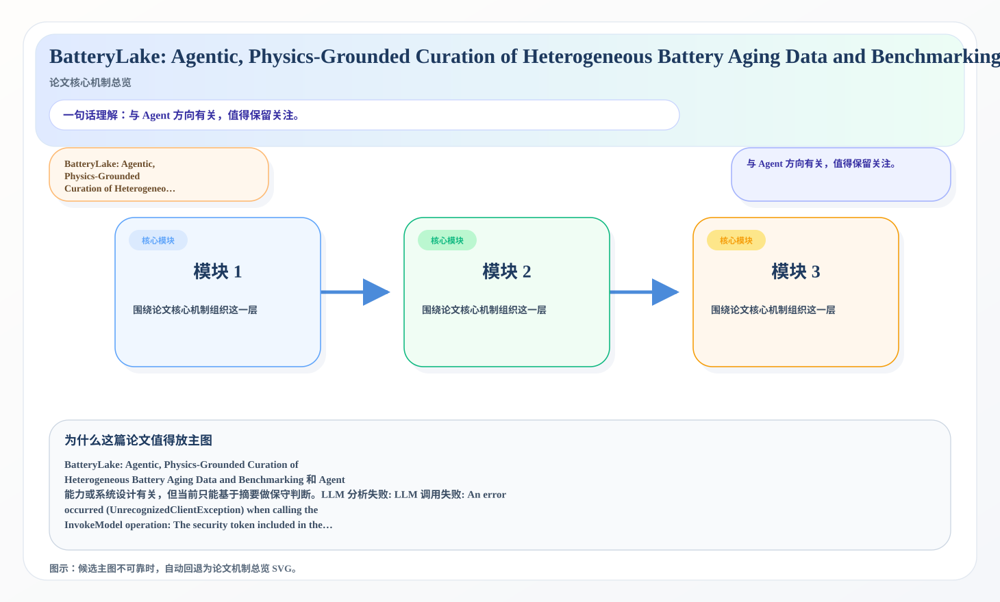
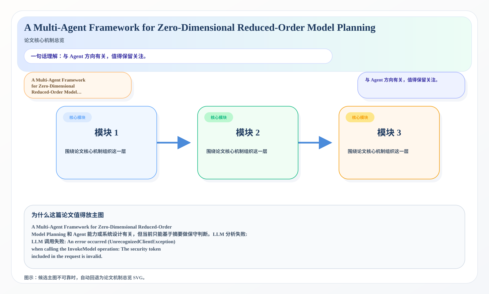

# 2026-07-14 AI Agent 论文日报

> 分类：cs.AI + cs.CL + cs.LG + cs.MA + cs.RO + cs.SE + cs.HC
> 入选论文：3 篇

## 一、初筛每日趋势

- 今天初筛后最集中的主题是 tool\_use、planning\_re…
- 从创新性和研究开拓性看，NetInjectBench: Bench…
- 说明研究关注点继续从单轮回答能力转向更完整的执行链。
- 今天初筛后最集中的主题是 tool\_use、planning\_reasoning、embodied\_agent，说明研究关注点继续从单轮回答能力转向更完整的执行链。
- 从创新性和研究开拓性看，NetInjectBench: Benchmarking Indirect Prompt Injection in Tool-Using Large Language Model Agents for Network Operations、Memory-Conditioned Tool Calling for Camera-First Visual Agents 代表了今天最值得后续继续追踪的切口。

## 二、重点论文精读

### 1. BatteryLake: Agentic, Physics-Grounded Curation of Heterogeneous Battery Aging Data and Benchmarking
- **方向：** agent\_eval
- **评分：** 相关性 73 | 价值 62 | 有趣性 64 | 创新性 54 | 开拓性 71
- **为什么入选：** 与 Agent 方向有关，值得保留关注。
- **快速背景：** BatteryLake: Agentic, Physics-Grounded…

*图示：候选主图不可靠，已回退为论文核心机制总览 SVG。*

- **当前状态：** llm_failed（LLM 分析失败: LLM 调用失败: An error occurred (UnrecognizedClientException) when calling the InvokeModel operation: The security token included in the request is invalid.）
- **核心技术点：** 本次精读未成功，暂不展示结构化核心点，避免误导。

### 2. NetInjectBench: Benchmarking Indirect Prompt Injection in Tool-Using Large Language Model Agents for Network Operations
- **方向：** tool\_use
- **评分：** 相关性 73 | 价值 62 | 有趣性 64 | 创新性 66 | 开拓性 51
- **为什么入选：** 与 Agent 方向有关，值得保留关注。
- **快速背景：** NetInjectBench: Benchmarking Indirect P…

*图示：候选主图不可靠，已回退为论文核心机制总览 SVG。*

- **当前状态：** llm_failed（LLM 分析失败: LLM 调用失败: An error occurred (UnrecognizedClientException) when calling the InvokeModel operation: The security token included in the request is invalid.）
- **核心技术点：** 本次精读未成功，暂不展示结构化核心点，避免误导。

### 3. A Multi-Agent Framework for Zero-Dimensional Reduced-Order Model Planning
- **方向：** planning\_reasoning
- **评分：** 相关性 73 | 价值 62 | 有趣性 56 | 创新性 54 | 开拓性 63
- **为什么入选：** 与 Agent 方向有关，值得保留关注。
- **快速背景：** A Multi-Agent Framework for Zero-Dimens…

*图示：候选主图不可靠，已回退为论文核心机制总览 SVG。*

- **当前状态：** llm_failed（LLM 分析失败: LLM 调用失败: An error occurred (UnrecognizedClientException) when calling the InvokeModel operation: The security token included in the request is invalid.）
- **核心技术点：** 本次精读未成功，暂不展示结构化核心点，避免误导。

## 三、候选但未完成深读的论文

- **BatteryLake: Agentic, Physics-Grounded Curation of Heterogeneous Battery Aging Data and Benchmarking**
  - 状态：llm\_failed
  - 原因：LLM 分析失败: LLM 调用失败: An error occurred (UnrecognizedClientException) when calling the InvokeModel operation: The security token included in the request is invalid.
- **NetInjectBench: Benchmarking Indirect Prompt Injection in Tool-Using Large Language Model Agents for Network Operations**
  - 状态：llm\_failed
  - 原因：LLM 分析失败: LLM 调用失败: An error occurred (UnrecognizedClientException) when calling the InvokeModel operation: The security token included in the request is invalid.
- **A Multi-Agent Framework for Zero-Dimensional Reduced-Order Model Planning**
  - 状态：llm\_failed
  - 原因：LLM 分析失败: LLM 调用失败: An error occurred (UnrecognizedClientException) when calling the InvokeModel operation: The security token included in the request is invalid.

## 四、总结

- Agent 研究继续从模型能力转向执行链与系统边界。
- 更值得追踪的是评测、约束、协议和运行时设计。
- 如果把今天的论文连起来看，一个明显变化是：大家越来越少把 Agent 当成单一模型能力问题，而是把它当成执行链、工具层、评测层和安全层共同构成的系统问题。
- 这意味着后续真正有开拓性的研究，往往不是再加一点 prompt 技巧，而是重新定义 Agent 应该如何被评测、如何被约束，以及如何在真实环境里更稳地工作。
